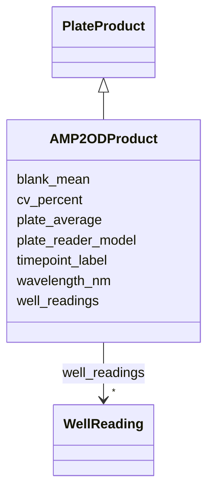

# Class: AMP2ODProduct 


_AMP2 optical density measurement product._

_One row per plate × timepoint._

_processedData.type = 'amp2_od'_

__

_v1 origin: plate-general.yaml AMP2ODProduct_


URI: [basalt_schema:AMP2ODProduct](https://emsl-computing.github.io/BASALT-Schema/elements/AMP2ODProduct)





## Inheritance
* [PlateProduct](PlateProduct.md)
    * **AMP2ODProduct**


## Slots

| Name | Cardinality and Range | Description | Inheritance |
| ---  | --- | --- | --- |
| [plate_reader_model](plate_reader_model.md) | 0..1 <br/> [String](String.md) | Instrument model used for reading (e | direct |
| [wavelength_nm](wavelength_nm.md) | 1 <br/> [Integer](Integer.md) | Measurement wavelength in nanometres (e | [PlateProduct](PlateProduct.md) |
| [timepoint_label](timepoint_label.md) | 1 <br/> [String](String.md) | Human-readable timepoint label for repeated-measurement series | [PlateProduct](PlateProduct.md) |
| [plate_average](plate_average.md) | 0..1 <br/> [Float](Float.md) | Mean measurement across all sample wells (excludes blanks) | [PlateProduct](PlateProduct.md) |
| [blank_mean](blank_mean.md) | 0..1 <br/> [Float](Float.md) | Mean measurement of uninoculated control wells | [PlateProduct](PlateProduct.md) |
| [cv_percent](cv_percent.md) | 0..1 <br/> [Float](Float.md) | Coefficient of variation across technical replicates | [PlateProduct](PlateProduct.md) |
| [well_readings](well_readings.md) | * <br/> [WellReading](WellReading.md) | Structured per-well measurement data array | [PlateProduct](PlateProduct.md) |


## Identifier and Mapping Information


### Schema Source


* from schema: https://emsl-computing.github.io/BASALT-Schema


## Mappings

| Mapping Type | Mapped Value |
| ---  | ---  |
| self | basalt_schema:AMP2ODProduct |
| native | basalt_schema:AMP2ODProduct |


## LinkML Source

<!-- TODO: investigate https://stackoverflow.com/questions/37606292/how-to-create-tabbed-code-blocks-in-mkdocs-or-sphinx -->

### Direct

<details>
```yaml
name: AMP2ODProduct
description: 'AMP2 optical density measurement product.

  One row per plate × timepoint.

  processedData.type = ''amp2_od''


  v1 origin: plate-general.yaml AMP2ODProduct'
from_schema: https://emsl-computing.github.io/BASALT-Schema
is_a: PlateProduct
slots:
- plate_reader_model

```
</details>

### Induced

<details>
```yaml
name: AMP2ODProduct
description: 'AMP2 optical density measurement product.

  One row per plate × timepoint.

  processedData.type = ''amp2_od''


  v1 origin: plate-general.yaml AMP2ODProduct'
from_schema: https://emsl-computing.github.io/BASALT-Schema
is_a: PlateProduct
attributes:
  plate_reader_model:
    name: plate_reader_model
    description: Instrument model used for reading (e.g. "BioTek Epoch2")
    todos:
    - harmonize with existing Instrument modelling
    from_schema: https://emsl-computing.github.io/BASALT-Schema
    rank: 1000
    alias: plate_reader_model
    owner: AMP2ODProduct
    domain_of:
    - AMP2ODProduct
    range: string
  wavelength_nm:
    name: wavelength_nm
    description: Measurement wavelength in nanometres (e.g. 590 Ecoplate, 610 AMP2
      OD)
    from_schema: https://emsl-computing.github.io/BASALT-Schema
    rank: 1000
    alias: wavelength_nm
    owner: AMP2ODProduct
    domain_of:
    - AMP2DataGenerationActivity
    - EcoplateDataGenerationActivity
    - PlateProduct
    range: integer
    required: true
  timepoint_label:
    name: timepoint_label
    description: 'Human-readable timepoint label for repeated-measurement series.

      Examples: "t=0", "t=24h", "t=48h".

      Lives on concrete analysis/product subclasses, NOT on base DataGenerationActivity'
    from_schema: https://emsl-computing.github.io/BASALT-Schema
    rank: 1000
    alias: timepoint_label
    owner: AMP2ODProduct
    domain_of:
    - PlateDataGenerationActivity
    - PlateProduct
    range: string
    required: true
  plate_average:
    name: plate_average
    description: Mean measurement across all sample wells (excludes blanks)
    todos:
    - units
    from_schema: https://emsl-computing.github.io/BASALT-Schema
    rank: 1000
    alias: plate_average
    owner: AMP2ODProduct
    domain_of:
    - PlateProduct
    range: float
  blank_mean:
    name: blank_mean
    description: Mean measurement of uninoculated control wells
    todos:
    - units
    from_schema: https://emsl-computing.github.io/BASALT-Schema
    rank: 1000
    alias: blank_mean
    owner: AMP2ODProduct
    domain_of:
    - PlateProduct
    range: float
  cv_percent:
    name: cv_percent
    description: Coefficient of variation across technical replicates
    from_schema: https://emsl-computing.github.io/BASALT-Schema
    rank: 1000
    alias: cv_percent
    owner: AMP2ODProduct
    domain_of:
    - PlateProduct
    range: float
  well_readings:
    name: well_readings
    description: 'Structured per-well measurement data array.

      Lightweight summary for SQL queries without full file download.

      Raw data still accessible via processedData.s3_key in MinIO.

      typed via LinkML inlined class.'
    todos:
    - decide how to represent in backend (normalized child table with FK to PlateSetupActivity,
      array column, or other)
    from_schema: https://emsl-computing.github.io/BASALT-Schema
    rank: 1000
    alias: well_readings
    owner: AMP2ODProduct
    domain_of:
    - PlateProduct
    range: WellReading
    multivalued: true
    inlined: true
    inlined_as_list: true

```
</details>