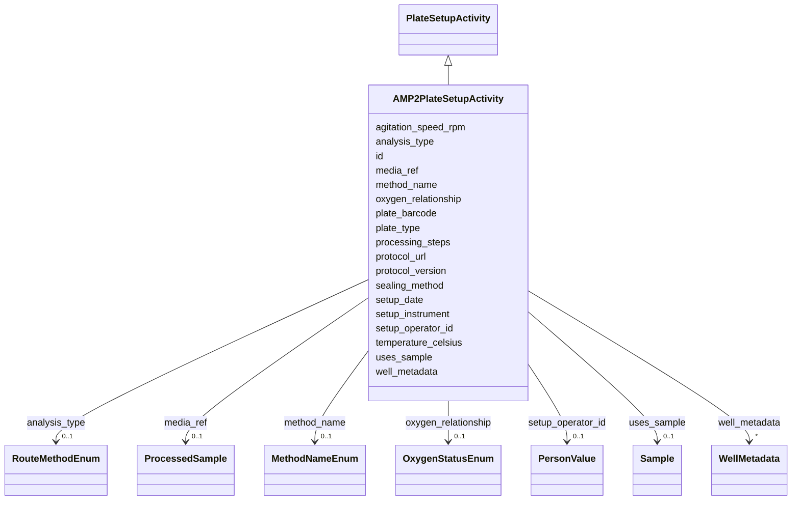

# Class: AMP2PlateSetupActivity 


_AMP2-specific plate setup._

_media_ref points to the plate-level prepared media processedSample._

_well_metadata stores minimal per-well data as AMP2WellMetadata instances_

_(position, volumes, replicate_group).  AMP2WellMetadata also carries a_

_per-well media_ref for plates that use different media per well._

__

_Input:  processedSample(type='experimental_culture') via processingSampleLink_

_Output: processedSample(type='amp2_96well_plate') via processingSampleLink_

_Refs:   processedSample(type='prepared_media') via media_ref_

__

_v1 origin: plate-general.yaml AMP2PlateSetupActivity_

_v2 change: media_ref directly on class (no UsesMedia mixin);_

_           range is processedSample (not purchasedMaterial)_


URI: [basalt_schema:AMP2PlateSetupActivity](https://EMSL-Computing.github.io/BASALT-Schema/AMP2PlateSetupActivity)





## Inheritance
* [SampleProcessing](SampleProcessing.md)
    * [PlateSetupActivity](PlateSetupActivity.md) [ [HasIncubationConditions](HasIncubationConditions.md)]
        * **AMP2PlateSetupActivity**


## Slots

| Name | Cardinality and Range | Description | Inheritance |
| ---  | --- | --- | --- |
| [media_ref](media_ref.md) | 0..1 <br/> [ProcessedSample](ProcessedSample.md) | FK reference to a prepared media processedSample used in the activity | direct |
| [plate_type](plate_type.md) | 1 <br/> [String](String.md) | Vendor and model of plate (e | [PlateSetupActivity](PlateSetupActivity.md) |
| [plate_barcode](plate_barcode.md) | 0..1 <br/> [String](String.md) | Physical barcode on plate (if different from UUID) | [PlateSetupActivity](PlateSetupActivity.md) |
| [setup_date](setup_date.md) | 1 <br/> [Datetime](Datetime.md) | When the plate was physically set up | [PlateSetupActivity](PlateSetupActivity.md) |
| [setup_operator_id](setup_operator_id.md) | 0..1 <br/> [PersonValue](PersonValue.md) | Person who set up the plate | [PlateSetupActivity](PlateSetupActivity.md) |
| [setup_instrument](setup_instrument.md) | 0..1 <br/> [String](String.md) | Automated liquid handler (e | [PlateSetupActivity](PlateSetupActivity.md) |
| [sealing_method](sealing_method.md) | 0..1 <br/> [String](String.md) | How the plate is sealed (e | [PlateSetupActivity](PlateSetupActivity.md) |
| [well_metadata](well_metadata.md) | * <br/> [WellMetadata](WellMetadata.md) | Structured per-well metadata array | [PlateSetupActivity](PlateSetupActivity.md) |
| [temperature_celsius](temperature_celsius.md) | 0..1 <br/> [Float](Float.md) | Temperature at which the method/process/activity was performed | [HasIncubationConditions](HasIncubationConditions.md) |
| [agitation_speed_rpm](agitation_speed_rpm.md) | 0..1 <br/> [Integer](Integer.md) | Agitation/shaking speed in RPM (0 for static) | [HasIncubationConditions](HasIncubationConditions.md) |
| [oxygen_relationship](oxygen_relationship.md) | 0..1 <br/> [OxygenStatusEnum](OxygenStatusEnum.md) | The relationship of the sample to oxygen, such as aerobic or anaerobic | [HasIncubationConditions](HasIncubationConditions.md) |
| [protocol_url](protocol_url.md) | 0..1 <br/> [String](String.md) | URL pointing to the protocol used in the activity, if applicable | [SampleProcessing](SampleProcessing.md) |
| [protocol_version](protocol_version.md) | 0..1 <br/> [String](String.md) | Version of the protocol used in the activity, if applicable | [SampleProcessing](SampleProcessing.md) |
| [id](id.md) | 1 <br/> [Uuid](Uuid.md) |  | [SampleProcessing](SampleProcessing.md) |
| [analysis_type](analysis_type.md) | 0..1 <br/> [RouteMethodEnum](RouteMethodEnum.md) |  | [SampleProcessing](SampleProcessing.md) |
| [method_name](method_name.md) | 0..1 <br/> [MethodNameEnum](MethodNameEnum.md) |  | [SampleProcessing](SampleProcessing.md) |
| [processing_steps](processing_steps.md) | 1 <br/> [String](String.md) |  | [SampleProcessing](SampleProcessing.md) |
| [uses_sample](uses_sample.md) | 0..1 <br/> [Sample](Sample.md) |  | [SampleProcessing](SampleProcessing.md) |


## Identifier and Mapping Information


### Schema Source


* from schema: https://EMSL-Computing.github.io/BASALT-Schema


## Mappings

| Mapping Type | Mapped Value |
| ---  | ---  |
| self | basalt_schema:AMP2PlateSetupActivity |
| native | basalt_schema:AMP2PlateSetupActivity |


## LinkML Source

<!-- TODO: investigate https://stackoverflow.com/questions/37606292/how-to-create-tabbed-code-blocks-in-mkdocs-or-sphinx -->

### Direct

<details>
```yaml
name: AMP2PlateSetupActivity
description: "AMP2-specific plate setup.\nmedia_ref points to the plate-level prepared\
  \ media processedSample.\nwell_metadata stores minimal per-well data as AMP2WellMetadata\
  \ instances\n(position, volumes, replicate_group).  AMP2WellMetadata also carries\
  \ a\nper-well media_ref for plates that use different media per well.\n\nInput:\
  \  processedSample(type='experimental_culture') via processingSampleLink\nOutput:\
  \ processedSample(type='amp2_96well_plate') via processingSampleLink\nRefs:   processedSample(type='prepared_media')\
  \ via media_ref\n\nv1 origin: plate-general.yaml AMP2PlateSetupActivity\nv2 change:\
  \ media_ref directly on class (no UsesMedia mixin);\n           range is processedSample\
  \ (not purchasedMaterial)"
from_schema: https://EMSL-Computing.github.io/BASALT-Schema
is_a: PlateSetupActivity
slots:
- media_ref

```
</details>

### Induced

<details>
```yaml
name: AMP2PlateSetupActivity
description: "AMP2-specific plate setup.\nmedia_ref points to the plate-level prepared\
  \ media processedSample.\nwell_metadata stores minimal per-well data as AMP2WellMetadata\
  \ instances\n(position, volumes, replicate_group).  AMP2WellMetadata also carries\
  \ a\nper-well media_ref for plates that use different media per well.\n\nInput:\
  \  processedSample(type='experimental_culture') via processingSampleLink\nOutput:\
  \ processedSample(type='amp2_96well_plate') via processingSampleLink\nRefs:   processedSample(type='prepared_media')\
  \ via media_ref\n\nv1 origin: plate-general.yaml AMP2PlateSetupActivity\nv2 change:\
  \ media_ref directly on class (no UsesMedia mixin);\n           range is processedSample\
  \ (not purchasedMaterial)"
from_schema: https://EMSL-Computing.github.io/BASALT-Schema
is_a: PlateSetupActivity
attributes:
  media_ref:
    name: media_ref
    description: 'FK reference to a prepared media processedSample used in the activity.

      Maps to Montana''s growth_medium (on CultureGrowth) and media_id

      (on plate setup).  Points to processedSample(type=prepared_media)

      produced by an upstream MediaPreparation activity.'
    from_schema: https://EMSL-Computing.github.io/BASALT-Schema
    rank: 1000
    alias: media_ref
    owner: AMP2PlateSetupActivity
    domain_of:
    - AMP2PlateSetupActivity
    - AMP2WellMetadata
    range: ProcessedSample
    required: false
  plate_type:
    name: plate_type
    description: Vendor and model of plate (e.g. "Greiner_96well_flat_bottom", "Biolog_EcoPlate")
    from_schema: https://EMSL-Computing.github.io/BASALT-Schema
    rank: 1000
    alias: plate_type
    owner: AMP2PlateSetupActivity
    domain_of:
    - PlateSetupActivity
    range: string
    required: true
  plate_barcode:
    name: plate_barcode
    description: Physical barcode on plate (if different from UUID)
    from_schema: https://EMSL-Computing.github.io/BASALT-Schema
    rank: 1000
    alias: plate_barcode
    owner: AMP2PlateSetupActivity
    domain_of:
    - PlateSetupActivity
    range: string
  setup_date:
    name: setup_date
    description: When the plate was physically set up
    from_schema: https://EMSL-Computing.github.io/BASALT-Schema
    rank: 1000
    alias: setup_date
    owner: AMP2PlateSetupActivity
    domain_of:
    - PlateSetupActivity
    range: datetime
    required: true
  setup_operator_id:
    name: setup_operator_id
    description: Person who set up the plate
    from_schema: https://EMSL-Computing.github.io/BASALT-Schema
    rank: 1000
    alias: setup_operator_id
    owner: AMP2PlateSetupActivity
    domain_of:
    - PlateSetupActivity
    range: PersonValue
  setup_instrument:
    name: setup_instrument
    description: Automated liquid handler (e.g. "Hamilton_STAR") or "manual"
    from_schema: https://EMSL-Computing.github.io/BASALT-Schema
    rank: 1000
    alias: setup_instrument
    owner: AMP2PlateSetupActivity
    domain_of:
    - PlateSetupActivity
    range: string
  sealing_method:
    name: sealing_method
    description: How the plate is sealed (e.g. "BreathEasy_membrane", "adhesive_film")
    from_schema: https://EMSL-Computing.github.io/BASALT-Schema
    rank: 1000
    alias: sealing_method
    owner: AMP2PlateSetupActivity
    domain_of:
    - PlateSetupActivity
    range: string
  well_metadata:
    name: well_metadata
    description: "Structured per-well metadata array. Format varies by activity subclass:\n\
      \  AMP2:     AMP2WellMetadata instances (position, volumes, replicate_group)\n\
      \  Ecoplate: EcoplateWellMetadata instances (position, carbon_source, treatment,\
      \ volumes)"
    todos:
    - decide how to represent in backend (normalized child table with FK to PlateSetupActivity,
      array column, or other)
    from_schema: https://EMSL-Computing.github.io/BASALT-Schema
    rank: 1000
    alias: well_metadata
    owner: AMP2PlateSetupActivity
    domain_of:
    - PlateSetupActivity
    range: WellMetadata
    multivalued: true
    inlined: true
    inlined_as_list: true
  temperature_celsius:
    name: temperature_celsius
    description: Temperature at which the method/process/activity was performed
    from_schema: https://EMSL-Computing.github.io/BASALT-Schema
    rank: 1000
    alias: temperature_celsius
    owner: AMP2PlateSetupActivity
    domain_of:
    - ChromatographyConfiguration
    - HasIncubationConditions
    range: float
  agitation_speed_rpm:
    name: agitation_speed_rpm
    description: Agitation/shaking speed in RPM (0 for static)
    from_schema: https://EMSL-Computing.github.io/BASALT-Schema
    rank: 1000
    alias: agitation_speed_rpm
    owner: AMP2PlateSetupActivity
    domain_of:
    - HasIncubationConditions
    range: integer
  oxygen_relationship:
    name: oxygen_relationship
    description: The relationship of the sample to oxygen, such as aerobic or anaerobic.
    title: oxygen relationship
    from_schema: https://EMSL-Computing.github.io/BASALT-Schema
    exact_mappings:
    - MIXS:0000015
    rank: 1000
    alias: oxygen_status
    owner: AMP2PlateSetupActivity
    domain_of:
    - HasIncubationConditions
    - CommerciallyPurchasedSample
    - CultureEnvironmentalSample
    - FieldDeployedTerraformSample
    - MixedCultureSample
    - OtherUndescribedSample
    - PureCultureSample
    - SedimentSample
    - SoilSample
    - SynthesizedMaterialSample
    - TerraformSample
    - WaterSample
    range: OxygenStatusEnum
  protocol_url:
    name: protocol_url
    description: URL pointing to the protocol used in the activity, if applicable.
    from_schema: https://EMSL-Computing.github.io/BASALT-Schema
    rank: 1000
    alias: protocol_url
    owner: AMP2PlateSetupActivity
    domain_of:
    - DataGenerationActivity
    - SampleProcessing
    range: string
  protocol_version:
    name: protocol_version
    description: Version of the protocol used in the activity, if applicable.
    from_schema: https://EMSL-Computing.github.io/BASALT-Schema
    rank: 1000
    alias: protocol_version
    owner: AMP2PlateSetupActivity
    domain_of:
    - DataGenerationActivity
    - SampleProcessing
    range: string
  id:
    name: id
    from_schema: https://EMSL-Computing.github.io/BASALT-Schema
    identifier: true
    alias: id
    owner: AMP2PlateSetupActivity
    domain_of:
    - Activity
    - Entity
    - DataProduct
    - DataGenerationActivity
    - DataProcessingActivity
    - AlternativeIdentifier
    - FunctionalAnnotationIdentifier
    - Instrument
    - OntologyClass
    - ContainerType
    - Custodian
    - InstrumentAlternativeIdentifier
    - LabDevice
    - SampleProcessing
    - ProcessingSampleLink
    - Configuration
    - MobilePhaseSegment
    - MassSpectrometryStandardRun
    - PurchasedMaterial
    - LabProcessingActivity
    - organism
    - MAOMProduct
    - WEOMProduct
    - Site
    - Sample
    - AerosolArmSample
    - AerosolSample
    - AMP2UserSample
    - CommerciallyPurchasedSample
    - CultureEnvironmentalSample
    - EngineeredStrainSample
    - FieldDeployedTerraformSample
    - MixedCultureSample
    - MonetSoilSample
    - OtherUndescribedSample
    - PlantSample
    - PureCultureSample
    - SedimentSample
    - SoilSample
    - SynthesizedMaterialSample
    - TerraformSample
    - WaterSample
    - ProcessedSample
    - CoreSection
    - SamplingActivity
    - AerosolArmSamplingActivity
    - AerosolSamplingActivity
    - CommerciallyPurchasedSamplingActivity
    - CultureEnvironmentalSamplingActivity
    - EngineeredStrainSamplingActivity
    - FieldDeployedTerraformSamplingActivity
    - MixedCultureSamplingActivity
    - MonetSoilSamplingActivity
    - OtherUndescribedSamplingActivity
    - PlantSamplingActivity
    - PureCultureSamplingActivity
    - SedimentSamplingActivity
    - SoilSamplingActivity
    - SynthesizedMaterialSamplingActivity
    - TerraformSamplingActivity
    - WaterSamplingActivity
    - Study
    - ProjectParticipant
    - TimestampValue
    - TextValue
    - SoftwareControlledTermValue
    - ControlledTermValue
    - PersonValue
    - QuantityValue
    - ConditioningValue
    - zipDownload
    range: uuid
    required: true
  analysis_type:
    name: analysis_type
    from_schema: https://EMSL-Computing.github.io/BASALT-Schema
    alias: analysis_type
    owner: AMP2PlateSetupActivity
    domain_of:
    - SampleProcessing
    - AerosolArmSample
    - AerosolSample
    - AMP2UserSample
    - CommerciallyPurchasedSample
    - CultureEnvironmentalSample
    - FieldDeployedTerraformSample
    - MixedCultureSample
    - OtherUndescribedSample
    - PlantSample
    - PureCultureSample
    - SedimentSample
    - SoilSample
    - SynthesizedMaterialSample
    - TerraformSample
    - WaterSample
    range: RouteMethodEnum
  method_name:
    name: method_name
    from_schema: https://EMSL-Computing.github.io/BASALT-Schema
    rank: 1000
    alias: method_name
    owner: AMP2PlateSetupActivity
    domain_of:
    - SampleProcessing
    range: MethodNameEnum
  processing_steps:
    name: processing_steps
    from_schema: https://EMSL-Computing.github.io/BASALT-Schema
    rank: 1000
    alias: processing_steps
    owner: AMP2PlateSetupActivity
    domain_of:
    - SampleProcessing
    range: string
    required: true
  uses_sample:
    name: uses_sample
    from_schema: https://EMSL-Computing.github.io/BASALT-Schema
    rank: 1000
    alias: uses_sample
    owner: AMP2PlateSetupActivity
    domain_of:
    - SampleProcessing
    range: Sample

```
</details>