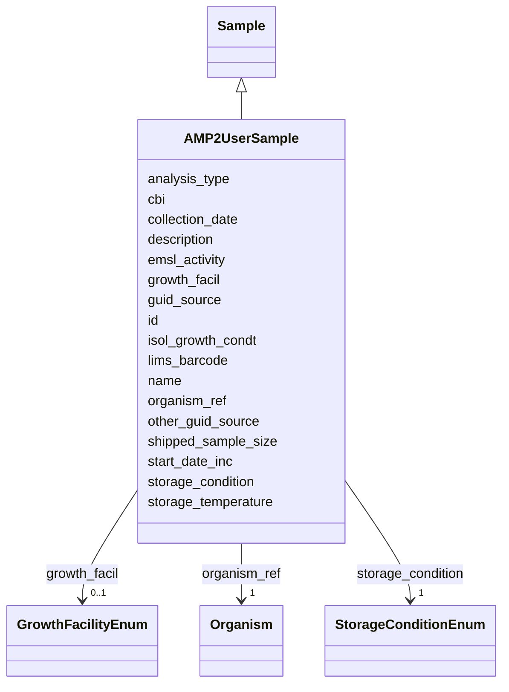

# Class: AMP2UserSample 


_A user-submitted microbial sample for AMP2 workflows._

__

_References an organism for identity (the "what") and carries_

_physical/logistical metadata for the specific sample instance (the "this tube")._

__

_Relationship to organism:_

_  - Many AMP2UserSample instances can reference one organism_

_  - organism_ref is the FK (required)_

_  - Example: 1000 samples of strain KT2440_pTE314_

__

_Workflow integration:_

_  - Enters workflow via SampleReceiving activity_

_  - Processed through StrainPurity → StockCulturePreparation → PreCultureGrowth → ExperimentalCulture_

_  - Outputs ProcessedSample instances at each stage_


URI: [basalt_schema:AMP2UserSample](https://EMSL-Computing.github.io/BASALT-Schema/AMP2UserSample)





## Inheritance
* [Sample](Sample.md)
    * **AMP2UserSample**


## Slots

| Name | Cardinality and Range | Description | Inheritance |
| ---  | --- | --- | --- |
| [organism_ref](organism_ref.md) | 1 <br/> [Organism](Organism.md) | FK to organism representing the biological identity this sample instantiates | direct |
| [collection_date](collection_date.md) | 0..1 <br/> [Date](Date.md) | The date the sample was collected or received from the user | direct |
| [growth_facil](growth_facil.md) | 0..1 <br/> [GrowthFacilityEnum](GrowthFacilityEnum.md) | Type of facility or location from where the sample was collected or | direct |
| [isol_growth_condt](isol_growth_condt.md) | 0..1 <br/> [String](String.md) | Publication reference in the form of pubmed ID (PMID), digital object | direct |
| [start_date_inc](start_date_inc.md) | 0..1 <br/> [String](String.md) | Date the incubation was started | direct |
| [storage_condition](storage_condition.md) | 1 <br/> [StorageConditionEnum](StorageConditionEnum.md) | Storage condition for this sample (frozen, fresh, etc | direct |
| [storage_temperature](storage_temperature.md) | 0..1 <br/> [String](String.md) | Storage temperature for this sample (e | direct |
| [shipped_sample_size](shipped_sample_size.md) | 0..1 <br/> [String](String.md) | Total amount of sample sent to EMSL | direct |
| [guid_source](guid_source.md) | 0..1 <br/> [String](String.md) | Source system for the sample GUID (e | direct |
| [other_guid_source](other_guid_source.md) | 0..1 <br/> [String](String.md) | Description of GUID source if guid_source = "other" | direct |
| [analysis_type](analysis_type.md) | 0..1 <br/> [String](String.md) | The type(s) of analysis planned for this sample | direct |
| [cbi](cbi.md) | 0..1 <br/> [Boolean](Boolean.md) | Confidential Business Information flag (yes/no) | direct |
| [id](id.md) | 1 <br/> [Uuid](Uuid.md) |  | direct |
| [name](name.md) | 1 <br/> [String](String.md) | Sample identifier/name (e | [Sample](Sample.md) |
| [description](description.md) | 0..1 <br/> [String](String.md) | Human-readable description for the entity or activity | [Sample](Sample.md) |
| [emsl_activity](emsl_activity.md) | 0..1 <br/> [String](String.md) | Nullable string linking a Sample or SamplingActivity to a named EMSL activity... | [Sample](Sample.md) |
| [lims_barcode](lims_barcode.md) | 0..1 <br/> [String](String.md) | LIMS barcode identifier | [Sample](Sample.md) |


## Identifier and Mapping Information


### Schema Source


* from schema: https://EMSL-Computing.github.io/BASALT-Schema


## Mappings

| Mapping Type | Mapped Value |
| ---  | ---  |
| self | basalt_schema:AMP2UserSample |
| native | basalt_schema:AMP2UserSample |


## LinkML Source

<!-- TODO: investigate https://stackoverflow.com/questions/37606292/how-to-create-tabbed-code-blocks-in-mkdocs-or-sphinx -->

### Direct

<details>
```yaml
name: AMP2UserSample
description: "A user-submitted microbial sample for AMP2 workflows.\n\nReferences\
  \ an organism for identity (the \"what\") and carries\nphysical/logistical metadata\
  \ for the specific sample instance (the \"this tube\").\n\nRelationship to organism:\n\
  \  - Many AMP2UserSample instances can reference one organism\n  - organism_ref\
  \ is the FK (required)\n  - Example: 1000 samples of strain KT2440_pTE314\n\nWorkflow\
  \ integration:\n  - Enters workflow via SampleReceiving activity\n  - Processed\
  \ through StrainPurity → StockCulturePreparation → PreCultureGrowth → ExperimentalCulture\n\
  \  - Outputs ProcessedSample instances at each stage"
from_schema: https://EMSL-Computing.github.io/BASALT-Schema
is_a: Sample
slots:
- organism_ref
- collection_date
- growth_facil
- isol_growth_condt
- start_date_inc
- storage_condition
- storage_temperature
- shipped_sample_size
- guid_source
- other_guid_source
- analysis_type
- cbi
slot_usage:
  organism_ref:
    name: organism_ref
    description: 'FK to organism representing the biological identity this sample
      instantiates.

      Required - every AMP2UserSample must reference an organism.'
    required: true
  storage_condition:
    name: storage_condition
    description: 'Storage condition for this sample (frozen, fresh, etc.).

      Inherited from Sample; required for AMP2UserSample.

      Aliases: samp_store_cond, storage_cond, storage_condt'
    required: true
  storage_temperature:
    name: storage_temperature
    description: 'Storage temperature for this sample (e.g., "-80 C").

      Aliases: samp_store_temp'
  name:
    name: name
    description: 'Sample identifier/name (e.g., "PP_0055").

      May match strain_identifier on organism for 1:1 cases,

      but typically unique per sample instance.

      Aliases: sample_name, samp_name'
  collection_date:
    name: collection_date
    description: The date the sample was collected or received from the user.
    required: false
  analysis_type:
    name: analysis_type
    description: The type(s) of analysis planned for this sample.
    required: false
attributes:
  id:
    name: id
    from_schema: https://EMSL-Computing.github.io/BASALT-Schema/sample-classes
    identifier: true
    domain_of:
    - Activity
    - Entity
    - DataProduct
    - DataGenerationActivity
    - DataProcessingActivity
    - AlternativeIdentifier
    - FunctionalAnnotationIdentifier
    - Instrument
    - OntologyClass
    - ContainerType
    - Custodian
    - InstrumentAlternativeIdentifier
    - LabDevice
    - SampleProcessing
    - ProcessingSampleLink
    - Configuration
    - MobilePhaseSegment
    - MassSpectrometryStandardRun
    - PurchasedMaterial
    - LabProcessingActivity
    - organism
    - MAOMProduct
    - WEOMProduct
    - Site
    - Sample
    - AerosolArmSample
    - AerosolSample
    - AMP2UserSample
    - CommerciallyPurchasedSample
    - CultureEnvironmentalSample
    - EngineeredStrainSample
    - FieldDeployedTerraformSample
    - MixedCultureSample
    - MonetSoilSample
    - OtherUndescribedSample
    - PlantSample
    - PureCultureSample
    - SedimentSample
    - SoilSample
    - SynthesizedMaterialSample
    - TerraformSample
    - WaterSample
    - ProcessedSample
    - CoreSection
    - SamplingActivity
    - AerosolArmSamplingActivity
    - AerosolSamplingActivity
    - CommerciallyPurchasedSamplingActivity
    - CultureEnvironmentalSamplingActivity
    - EngineeredStrainSamplingActivity
    - FieldDeployedTerraformSamplingActivity
    - MixedCultureSamplingActivity
    - MonetSoilSamplingActivity
    - OtherUndescribedSamplingActivity
    - PlantSamplingActivity
    - PureCultureSamplingActivity
    - SedimentSamplingActivity
    - SoilSamplingActivity
    - SynthesizedMaterialSamplingActivity
    - TerraformSamplingActivity
    - WaterSamplingActivity
    - Study
    - ProjectParticipant
    - TimestampValue
    - TextValue
    - SoftwareControlledTermValue
    - ControlledTermValue
    - PersonValue
    - QuantityValue
    - ConditioningValue
    - zipDownload
    range: uuid
    required: true

```
</details>

### Induced

<details>
```yaml
name: AMP2UserSample
description: "A user-submitted microbial sample for AMP2 workflows.\n\nReferences\
  \ an organism for identity (the \"what\") and carries\nphysical/logistical metadata\
  \ for the specific sample instance (the \"this tube\").\n\nRelationship to organism:\n\
  \  - Many AMP2UserSample instances can reference one organism\n  - organism_ref\
  \ is the FK (required)\n  - Example: 1000 samples of strain KT2440_pTE314\n\nWorkflow\
  \ integration:\n  - Enters workflow via SampleReceiving activity\n  - Processed\
  \ through StrainPurity → StockCulturePreparation → PreCultureGrowth → ExperimentalCulture\n\
  \  - Outputs ProcessedSample instances at each stage"
from_schema: https://EMSL-Computing.github.io/BASALT-Schema
is_a: Sample
slot_usage:
  organism_ref:
    name: organism_ref
    description: 'FK to organism representing the biological identity this sample
      instantiates.

      Required - every AMP2UserSample must reference an organism.'
    required: true
  storage_condition:
    name: storage_condition
    description: 'Storage condition for this sample (frozen, fresh, etc.).

      Inherited from Sample; required for AMP2UserSample.

      Aliases: samp_store_cond, storage_cond, storage_condt'
    required: true
  storage_temperature:
    name: storage_temperature
    description: 'Storage temperature for this sample (e.g., "-80 C").

      Aliases: samp_store_temp'
  name:
    name: name
    description: 'Sample identifier/name (e.g., "PP_0055").

      May match strain_identifier on organism for 1:1 cases,

      but typically unique per sample instance.

      Aliases: sample_name, samp_name'
  collection_date:
    name: collection_date
    description: The date the sample was collected or received from the user.
    required: false
  analysis_type:
    name: analysis_type
    description: The type(s) of analysis planned for this sample.
    required: false
attributes:
  id:
    name: id
    from_schema: https://EMSL-Computing.github.io/BASALT-Schema/sample-classes
    identifier: true
    alias: id
    owner: AMP2UserSample
    domain_of:
    - Activity
    - Entity
    - DataProduct
    - DataGenerationActivity
    - DataProcessingActivity
    - AlternativeIdentifier
    - FunctionalAnnotationIdentifier
    - Instrument
    - OntologyClass
    - ContainerType
    - Custodian
    - InstrumentAlternativeIdentifier
    - LabDevice
    - SampleProcessing
    - ProcessingSampleLink
    - Configuration
    - MobilePhaseSegment
    - MassSpectrometryStandardRun
    - PurchasedMaterial
    - LabProcessingActivity
    - organism
    - MAOMProduct
    - WEOMProduct
    - Site
    - Sample
    - AerosolArmSample
    - AerosolSample
    - AMP2UserSample
    - CommerciallyPurchasedSample
    - CultureEnvironmentalSample
    - EngineeredStrainSample
    - FieldDeployedTerraformSample
    - MixedCultureSample
    - MonetSoilSample
    - OtherUndescribedSample
    - PlantSample
    - PureCultureSample
    - SedimentSample
    - SoilSample
    - SynthesizedMaterialSample
    - TerraformSample
    - WaterSample
    - ProcessedSample
    - CoreSection
    - SamplingActivity
    - AerosolArmSamplingActivity
    - AerosolSamplingActivity
    - CommerciallyPurchasedSamplingActivity
    - CultureEnvironmentalSamplingActivity
    - EngineeredStrainSamplingActivity
    - FieldDeployedTerraformSamplingActivity
    - MixedCultureSamplingActivity
    - MonetSoilSamplingActivity
    - OtherUndescribedSamplingActivity
    - PlantSamplingActivity
    - PureCultureSamplingActivity
    - SedimentSamplingActivity
    - SoilSamplingActivity
    - SynthesizedMaterialSamplingActivity
    - TerraformSamplingActivity
    - WaterSamplingActivity
    - Study
    - ProjectParticipant
    - TimestampValue
    - TextValue
    - SoftwareControlledTermValue
    - ControlledTermValue
    - PersonValue
    - QuantityValue
    - ConditioningValue
    - zipDownload
    range: uuid
    required: true
  organism_ref:
    name: organism_ref
    description: 'FK to organism representing the biological identity this sample
      instantiates.

      Required - every AMP2UserSample must reference an organism.'
    from_schema: https://EMSL-Computing.github.io/BASALT-Schema
    aliases:
    - strain_ref
    - strain_id
    rank: 1000
    alias: organism_ref
    owner: AMP2UserSample
    domain_of:
    - CultureGrowth
    - AMP2UserSample
    - EngineeredStrainSample
    range: organism
    required: true
  collection_date:
    name: collection_date
    description: The date the sample was collected or received from the user.
    title: collection date
    from_schema: https://EMSL-Computing.github.io/BASALT-Schema
    rank: 1000
    alias: collection_date
    owner: AMP2UserSample
    domain_of:
    - AMP2UserSample
    - SamplingActivity
    range: date
    required: false
    pattern: ^[12]\d{3}(?:(?:-(?:0[1-9]|1[0-2]))(?:-(?:0[1-9]|[12]\d|3[01]))?)?$
  growth_facil:
    name: growth_facil
    description: 'Type of facility or location from where the sample was collected
      or

      grown. This field is NOT multivalued. If selecting other, add the `other_growth_facil`

      attribute to provide additional detail.'
    title: growth facility
    from_schema: https://EMSL-Computing.github.io/BASALT-Schema
    rank: 1000
    alias: growth_facil
    owner: AMP2UserSample
    domain_of:
    - Site
    - AMP2UserSample
    range: GrowthFacilityEnum
  isol_growth_condt:
    name: isol_growth_condt
    description: 'Publication reference in the form of pubmed ID (PMID), digital object

      identifier (DOI), or URL for isolation and growth condition specifications of
      the

      organism/material'
    title: isolation and growth conditions
    from_schema: https://EMSL-Computing.github.io/BASALT-Schema
    rank: 1000
    alias: isol_growth_condt
    owner: AMP2UserSample
    domain_of:
    - AMP2UserSample
    - CultureEnvironmentalSample
    - FieldDeployedTerraformSample
    - MixedCultureSample
    - OtherUndescribedSample
    - PureCultureSample
    - TerraformSample
    range: string
  start_date_inc:
    name: start_date_inc
    description: 'Date the incubation was started. Only relevant for incubation samples.
      Format: YYYY-MM-DD'
    title: incubation start date
    from_schema: https://EMSL-Computing.github.io/BASALT-Schema
    rank: 1000
    alias: start_date_inc
    owner: AMP2UserSample
    domain_of:
    - AMP2UserSample
    - CultureEnvironmentalSample
    - FieldDeployedTerraformSample
    - MixedCultureSample
    - OtherUndescribedSample
    - PlantSample
    - PureCultureSample
    - SedimentSample
    - SoilSample
    - WaterSample
    range: string
    pattern: ^[12]\d{3}(?:(?:-(?:0[1-9]|1[0-2]))(?:-(?:0[1-9]|[12]\d|3[01]))?)?$
  storage_condition:
    name: storage_condition
    description: 'Storage condition for this sample (frozen, fresh, etc.).

      Inherited from Sample; required for AMP2UserSample.

      Aliases: samp_store_cond, storage_cond, storage_condt'
    title: storage condition
    from_schema: https://EMSL-Computing.github.io/BASALT-Schema
    aliases:
    - samp_store_cond
    - storage_cond
    - storage_condt
    exact_mappings:
    - MIXS:0000327
    rank: 1000
    alias: storage_condition
    owner: AMP2UserSample
    domain_of:
    - AerosolArmSample
    - AerosolSample
    - AMP2UserSample
    - CommerciallyPurchasedSample
    - CultureEnvironmentalSample
    - EngineeredStrainSample
    - FieldDeployedTerraformSample
    - MixedCultureSample
    - MonetSoilSample
    - OtherUndescribedSample
    - PlantSample
    - PureCultureSample
    - SedimentSample
    - SoilSample
    - SynthesizedMaterialSample
    - TerraformSample
    - WaterSample
    range: StorageConditionEnum
    required: true
  storage_temperature:
    name: storage_temperature
    description: 'Storage temperature for this sample (e.g., "-80 C").

      Aliases: samp_store_temp'
    from_schema: https://EMSL-Computing.github.io/BASALT-Schema
    rank: 1000
    alias: storage_temperature
    owner: AMP2UserSample
    domain_of:
    - MediaPreparation
    - AMP2UserSample
    - EngineeredStrainSample
    range: string
  shipped_sample_size:
    name: shipped_sample_size
    description: Total amount of sample sent to EMSL. Must include units.
    title: shipped sample size
    from_schema: https://EMSL-Computing.github.io/BASALT-Schema
    rank: 1000
    alias: shipped_sample_size
    owner: AMP2UserSample
    domain_of:
    - AMP2UserSample
    - SamplingActivity
    range: string
    pattern: ^\d+(\.\d+)?\s*[\w\s/]+$
  guid_source:
    name: guid_source
    description: Source system for the sample GUID (e.g., "LIMS").
    from_schema: https://EMSL-Computing.github.io/BASALT-Schema
    rank: 1000
    alias: guid_source
    owner: AMP2UserSample
    domain_of:
    - AMP2UserSample
    range: string
  other_guid_source:
    name: other_guid_source
    description: Description of GUID source if guid_source = "other".
    from_schema: https://EMSL-Computing.github.io/BASALT-Schema
    rank: 1000
    alias: other_guid_source
    owner: AMP2UserSample
    domain_of:
    - AMP2UserSample
    range: string
  analysis_type:
    name: analysis_type
    description: The type(s) of analysis planned for this sample.
    from_schema: https://EMSL-Computing.github.io/BASALT-Schema
    rank: 1000
    alias: analysis_type
    owner: AMP2UserSample
    domain_of:
    - SampleProcessing
    - AerosolArmSample
    - AerosolSample
    - AMP2UserSample
    - CommerciallyPurchasedSample
    - CultureEnvironmentalSample
    - FieldDeployedTerraformSample
    - MixedCultureSample
    - OtherUndescribedSample
    - PlantSample
    - PureCultureSample
    - SedimentSample
    - SoilSample
    - SynthesizedMaterialSample
    - TerraformSample
    - WaterSample
    range: string
    required: false
  cbi:
    name: cbi
    description: 'Confidential Business Information flag (yes/no).

      Indicates if the sample is subject to CBI restrictions.'
    from_schema: https://EMSL-Computing.github.io/BASALT-Schema
    aliases:
    - CBI
    rank: 1000
    alias: cbi
    owner: AMP2UserSample
    domain_of:
    - AMP2UserSample
    - EngineeredStrainSample
    range: boolean
  name:
    name: name
    description: 'Sample identifier/name (e.g., "PP_0055").

      May match strain_identifier on organism for 1:1 cases,

      but typically unique per sample instance.

      Aliases: sample_name, samp_name'
    from_schema: https://EMSL-Computing.github.io/BASALT-Schema
    rank: 1000
    alias: name
    owner: AMP2UserSample
    domain_of:
    - Activity
    - Entity
    - DataProduct
    - DataGenerationActivity
    - Instrument
    - OntologyClass
    - ContainerAxis
    - Configuration
    - MobilePhaseSegment
    - MassSpectrometryStandardRun
    - PurchasedMaterial
    - LabProcessingActivity
    - organism
    - Site
    - Sample
    - SamplingActivity
    - SoilSamplingActivity
    - Study
    - SoftwareControlledTermValue
    range: string
    required: true
  description:
    name: description
    description: Human-readable description for the entity or activity
    title: description
    from_schema: https://EMSL-Computing.github.io/BASALT-Schema
    rank: 1000
    alias: description
    owner: AMP2UserSample
    domain_of:
    - Activity
    - Entity
    - DataProduct
    - DataGenerationActivity
    - DataProcessingActivity
    - OntologyClass
    - ContainerType
    - LabDevice
    - Configuration
    - MassSpectrometryStandardRun
    - PurchasedMaterial
    - LabProcessingActivity
    - organism
    - Site
    - Sample
    - SamplingActivity
    - SoilSamplingActivity
    - Study
    - TimestampValue
    - TextValue
    - SoftwareControlledTermValue
    - ControlledTermValue
    - QuantityValue
    range: string
  emsl_activity:
    name: emsl_activity
    description: 'Nullable string linking a Sample or SamplingActivity to a named
      EMSL activity or

      campaign (e.g., ''AMP2'', ''MONet_FY26''). Optional for historical records

      predating activity tracking.'
    todos:
    - Is sampling activity where we want to capture this?
    from_schema: https://EMSL-Computing.github.io/BASALT-Schema
    rank: 1000
    alias: emsl_activity
    owner: AMP2UserSample
    domain_of:
    - Sample
    - SamplingActivity
    range: string
    required: false
  lims_barcode:
    name: lims_barcode
    description: LIMS barcode identifier
    from_schema: https://EMSL-Computing.github.io/BASALT-Schema
    rank: 1000
    alias: lims_barcode
    owner: AMP2UserSample
    domain_of:
    - ProcessedData
    - Sample
    range: string
    required: false

```
</details>