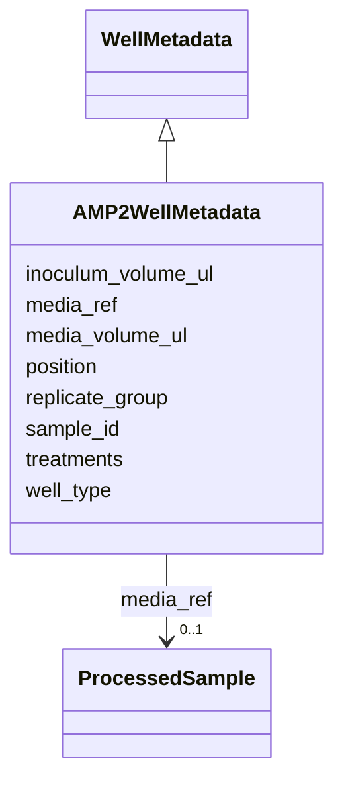

# Class: AMP2WellMetadata 


_AMP2-specific per-well metadata._

_Minimal   media composition comes from the Media entity referenced via_

_the activity's media_ref slot.  Per-well data is volumes and replicate info._


URI: [analysis_api_schema:AMP2WellMetadata](https://w3id.org/MONet/analysis-api-schema/AMP2WellMetadata)





## Inheritance
* [WellMetadata](WellMetadata.md)
    * **AMP2WellMetadata**


## Slots

| Name | Cardinality and Range | Description | Inheritance |
| ---  | --- | --- | --- |
| [media_ref](media_ref.md) | 0..1 <br/> [ProcessedSample](ProcessedSample.md) | FK to the prepared media processedSample used in this well | direct |
| [media_volume_ul](media_volume_ul.md) | 1 <br/> [Float](Float.md) | Volume of media added to this well (microlitres) | direct |
| [inoculum_volume_ul](inoculum_volume_ul.md) | 1 <br/> [Float](Float.md) | Volume of inoculum added (0 for blanks) | direct |
| [sample_id](sample_id.md) | 0..1 <br/> [String](String.md) | Optional FK to the specific sample in this well, if wells contain | direct |
| [treatments](treatments.md) | * <br/> [String](String.md) | Per-well treatments if applicable (e | direct |
| [position](position.md) | 1 <br/> [String](String.md) | Well position (e | [WellMetadata](WellMetadata.md) |
| [well_type](well_type.md) | 0..1 <br/> [String](String.md) | Role of this well   "sample", "blank", "uninoculated_control", "standard" | [WellMetadata](WellMetadata.md) |
| [replicate_group](replicate_group.md) | 0..1 <br/> [String](String.md) | Identifier linking technical replicates (e | [WellMetadata](WellMetadata.md) |


## Identifier and Mapping Information


### Schema Source


* from schema: https://w3id.org/MONet/analysis-api-schema


## Mappings

| Mapping Type | Mapped Value |
| ---  | ---  |
| self | analysis_api_schema:AMP2WellMetadata |
| native | analysis_api_schema:AMP2WellMetadata |


## LinkML Source

<!-- TODO: investigate https://stackoverflow.com/questions/37606292/how-to-create-tabbed-code-blocks-in-mkdocs-or-sphinx -->

### Direct

<details>
```yaml
name: AMP2WellMetadata
description: 'AMP2-specific per-well metadata.

  Minimal   media composition comes from the Media entity referenced via

  the activity''s media_ref slot.  Per-well data is volumes and replicate info.'
from_schema: https://w3id.org/MONet/analysis-api-schema
is_a: WellMetadata
attributes:
  media_ref:
    name: media_ref
    description: 'FK to the prepared media processedSample used in this well.

      NULL -> fall back to plate-level AMP2PlateSetupActivity.media_ref.

      Non-null -> this well uses a different media batch.'
    from_schema: https://w3id.org/MONet/analysis-api-schema/media-strain-culture-plate
    domain_of:
    - AMP2PlateSetupActivity
    - AMP2WellMetadata
    range: ProcessedSample
    required: false
  media_volume_ul:
    name: media_volume_ul
    description: Volume of media added to this well (microlitres)
    from_schema: https://w3id.org/MONet/analysis-api-schema/media-strain-culture-plate
    rank: 1000
    domain_of:
    - AMP2WellMetadata
    - EcoplateWellMetadata
    range: float
    required: true
  inoculum_volume_ul:
    name: inoculum_volume_ul
    description: Volume of inoculum added (0 for blanks)
    from_schema: https://w3id.org/MONet/analysis-api-schema/media-strain-culture-plate
    rank: 1000
    domain_of:
    - AMP2WellMetadata
    range: float
    required: true
  sample_id:
    name: sample_id
    description: 'Optional FK to the specific sample in this well, if wells contain

      different samples.  NULL if all wells use the same inoculum.'
    from_schema: https://w3id.org/MONet/analysis-api-schema/media-strain-culture-plate
    domain_of:
    - ProcessedData
    - AMP2WellMetadata
    - MetagenomicsProduct
    range: string
  treatments:
    name: treatments
    description: 'Per-well treatments if applicable (e.g. different mineral concentrations).

      NULL for uniform-treatment plates.'
    from_schema: https://w3id.org/MONet/analysis-api-schema/media-strain-culture-plate
    rank: 1000
    domain_of:
    - AMP2WellMetadata
    range: string
    multivalued: true

```
</details>

### Induced

<details>
```yaml
name: AMP2WellMetadata
description: 'AMP2-specific per-well metadata.

  Minimal   media composition comes from the Media entity referenced via

  the activity''s media_ref slot.  Per-well data is volumes and replicate info.'
from_schema: https://w3id.org/MONet/analysis-api-schema
is_a: WellMetadata
attributes:
  media_ref:
    name: media_ref
    description: 'FK to the prepared media processedSample used in this well.

      NULL -> fall back to plate-level AMP2PlateSetupActivity.media_ref.

      Non-null -> this well uses a different media batch.'
    from_schema: https://w3id.org/MONet/analysis-api-schema/media-strain-culture-plate
    alias: media_ref
    owner: AMP2WellMetadata
    domain_of:
    - AMP2PlateSetupActivity
    - AMP2WellMetadata
    range: ProcessedSample
    required: false
  media_volume_ul:
    name: media_volume_ul
    description: Volume of media added to this well (microlitres)
    from_schema: https://w3id.org/MONet/analysis-api-schema/media-strain-culture-plate
    rank: 1000
    alias: media_volume_ul
    owner: AMP2WellMetadata
    domain_of:
    - AMP2WellMetadata
    - EcoplateWellMetadata
    range: float
    required: true
  inoculum_volume_ul:
    name: inoculum_volume_ul
    description: Volume of inoculum added (0 for blanks)
    from_schema: https://w3id.org/MONet/analysis-api-schema/media-strain-culture-plate
    rank: 1000
    alias: inoculum_volume_ul
    owner: AMP2WellMetadata
    domain_of:
    - AMP2WellMetadata
    range: float
    required: true
  sample_id:
    name: sample_id
    description: 'Optional FK to the specific sample in this well, if wells contain

      different samples.  NULL if all wells use the same inoculum.'
    from_schema: https://w3id.org/MONet/analysis-api-schema/media-strain-culture-plate
    alias: sample_id
    owner: AMP2WellMetadata
    domain_of:
    - ProcessedData
    - AMP2WellMetadata
    - MetagenomicsProduct
    range: string
  treatments:
    name: treatments
    description: 'Per-well treatments if applicable (e.g. different mineral concentrations).

      NULL for uniform-treatment plates.'
    from_schema: https://w3id.org/MONet/analysis-api-schema/media-strain-culture-plate
    rank: 1000
    alias: treatments
    owner: AMP2WellMetadata
    domain_of:
    - AMP2WellMetadata
    range: string
    multivalued: true
  position:
    name: position
    description: Well position (e.g. "A01", "H12")
    from_schema: https://w3id.org/MONet/analysis-api-schema/media-strain-culture-plate
    rank: 1000
    alias: position
    owner: AMP2WellMetadata
    domain_of:
    - WellMetadata
    - WellReading
    range: string
    required: true
  well_type:
    name: well_type
    description: Role of this well   "sample", "blank", "uninoculated_control", "standard"
    from_schema: https://w3id.org/MONet/analysis-api-schema/media-strain-culture-plate
    rank: 1000
    alias: well_type
    owner: AMP2WellMetadata
    domain_of:
    - WellMetadata
    range: string
  replicate_group:
    name: replicate_group
    description: Identifier linking technical replicates (e.g. "rep1", "rep2")
    from_schema: https://w3id.org/MONet/analysis-api-schema/media-strain-culture-plate
    rank: 1000
    alias: replicate_group
    owner: AMP2WellMetadata
    domain_of:
    - WellMetadata
    range: string

```
</details>