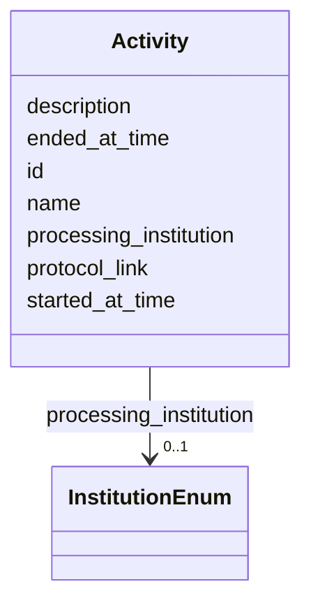

# Class: Activity 


_Something that happens over time and can use equipment._


* __NOTE__: this is an abstract class and should not be instantiated directly


URI: [analysis_api_schema:Activity](https://w3id.org/MONet/analysis-api-schema/Activity)





<!-- no inheritance hierarchy -->

## Slots

| Name | Cardinality and Range | Description | Inheritance |
| ---  | --- | --- | --- |
| [name](name.md) | 1 <br/> [String](String.md) | Human-readable name for the entity or activity | direct |
| [description](description.md) | 0..1 <br/> [String](String.md) | Human-readable description for the entity or activity | direct |
| [id](id.md) | 1 <br/> [Uuid](Uuid.md) |  | direct |
| [ended_at_time](ended_at_time.md) | 0..1 <br/> [Datetime](Datetime.md) |  | direct |
| [processing_institution](processing_institution.md) | 0..1 <br/> [InstitutionEnum](InstitutionEnum.md) | The institution where the activity took place | direct |
| [protocol_link](protocol_link.md) | 0..1 <br/> [String](String.md) | A link to a protocol that describes the steps and parameters of the activity | direct |
| [started_at_time](started_at_time.md) | 0..1 <br/> [Datetime](Datetime.md) |  | direct |


## Identifier and Mapping Information


### Schema Source


* from schema: https://w3id.org/MONet/analysis-api-schema


## Mappings

| Mapping Type | Mapped Value |
| ---  | ---  |
| self | analysis_api_schema:Activity |
| native | analysis_api_schema:Activity |


## LinkML Source

<!-- TODO: investigate https://stackoverflow.com/questions/37606292/how-to-create-tabbed-code-blocks-in-mkdocs-or-sphinx -->

### Direct

<details>
```yaml
name: Activity
description: Something that happens over time and can use equipment.
from_schema: https://w3id.org/MONet/analysis-api-schema
abstract: true
slots:
- name
- description
attributes:
  id:
    name: id
    from_schema: https://w3id.org/MONet/analysis-api-schema
    rank: 1000
    identifier: true
    domain_of:
    - Activity
    - Entity
    - DataProduct
    - DataGenerationActivity
    - DataProcessingActivity
    - AlternativeIdentifier
    - FunctionalAnnotationIdentifier
    - Instrument
    - OntologyClass
    - ContainerType
    - Custodian
    - InstrumentAlternativeIdentifier
    - LabDevice
    - SampleProcessing
    - ProcessingSampleLink
    - Configuration
    - MobilePhaseSegment
    - MassSpectrometryStandardRun
    - PurchasedMaterial
    - LabProcessingActivity
    - MAOMProduct
    - WEOMProduct
    - Site
    - Sample
    - AerosolArmSample
    - AerosolSample
    - AMP2UserSample
    - CommerciallyPurchasedSample
    - CultureEnvironmentalSample
    - EngineeredStrainSample
    - FieldDeployedTerraformSample
    - MixedCultureSample
    - MonetSoilSample
    - OtherUndescribedSample
    - PlantSample
    - PureCultureSample
    - SedimentSample
    - SoilSample
    - SynthesizedMaterialSample
    - TerraformSample
    - WaterSample
    - ProcessedSample
    - CoreSection
    - SamplingActivity
    - AerosolArmSamplingActivity
    - AerosolSamplingActivity
    - CommerciallyPurchasedSamplingActivity
    - CultureEnvironmentalSamplingActivity
    - EngineeredStrainSamplingActivity
    - FieldDeployedTerraformSamplingActivity
    - MixedCultureSamplingActivity
    - MonetSoilSamplingActivity
    - OtherUndescribedSamplingActivity
    - PlantSamplingActivity
    - PureCultureSamplingActivity
    - SedimentSamplingActivity
    - SoilSamplingActivity
    - SynthesizedMaterialSamplingActivity
    - TerraformSamplingActivity
    - WaterSamplingActivity
    - biological_entity
    - Study
    - ProjectParticipant
    - TimestampValue
    - TextValue
    - SoftwareControlledTermValue
    - ControlledTermValue
    - PersonValue
    - QuantityValue
    - ConditioningValue
    - zipDownload
    range: uuid
    required: true
  ended_at_time:
    name: ended_at_time
    from_schema: https://w3id.org/MONet/analysis-api-schema
    rank: 1000
    domain_of:
    - Activity
    - DataProcessingActivity
    range: datetime
  processing_institution:
    name: processing_institution
    description: The institution where the activity took place.
    from_schema: https://w3id.org/MONet/analysis-api-schema
    rank: 1000
    domain_of:
    - Activity
    range: InstitutionEnum
  protocol_link:
    name: protocol_link
    description: A link to a protocol that describes the steps and parameters of the
      activity.
    from_schema: https://w3id.org/MONet/analysis-api-schema
    rank: 1000
    domain_of:
    - Activity
    range: string
  started_at_time:
    name: started_at_time
    from_schema: https://w3id.org/MONet/analysis-api-schema
    rank: 1000
    domain_of:
    - Activity
    - DataProcessingActivity
    range: datetime

```
</details>

### Induced

<details>
```yaml
name: Activity
description: Something that happens over time and can use equipment.
from_schema: https://w3id.org/MONet/analysis-api-schema
abstract: true
attributes:
  id:
    name: id
    from_schema: https://w3id.org/MONet/analysis-api-schema
    rank: 1000
    identifier: true
    alias: id
    owner: Activity
    domain_of:
    - Activity
    - Entity
    - DataProduct
    - DataGenerationActivity
    - DataProcessingActivity
    - AlternativeIdentifier
    - FunctionalAnnotationIdentifier
    - Instrument
    - OntologyClass
    - ContainerType
    - Custodian
    - InstrumentAlternativeIdentifier
    - LabDevice
    - SampleProcessing
    - ProcessingSampleLink
    - Configuration
    - MobilePhaseSegment
    - MassSpectrometryStandardRun
    - PurchasedMaterial
    - LabProcessingActivity
    - MAOMProduct
    - WEOMProduct
    - Site
    - Sample
    - AerosolArmSample
    - AerosolSample
    - AMP2UserSample
    - CommerciallyPurchasedSample
    - CultureEnvironmentalSample
    - EngineeredStrainSample
    - FieldDeployedTerraformSample
    - MixedCultureSample
    - MonetSoilSample
    - OtherUndescribedSample
    - PlantSample
    - PureCultureSample
    - SedimentSample
    - SoilSample
    - SynthesizedMaterialSample
    - TerraformSample
    - WaterSample
    - ProcessedSample
    - CoreSection
    - SamplingActivity
    - AerosolArmSamplingActivity
    - AerosolSamplingActivity
    - CommerciallyPurchasedSamplingActivity
    - CultureEnvironmentalSamplingActivity
    - EngineeredStrainSamplingActivity
    - FieldDeployedTerraformSamplingActivity
    - MixedCultureSamplingActivity
    - MonetSoilSamplingActivity
    - OtherUndescribedSamplingActivity
    - PlantSamplingActivity
    - PureCultureSamplingActivity
    - SedimentSamplingActivity
    - SoilSamplingActivity
    - SynthesizedMaterialSamplingActivity
    - TerraformSamplingActivity
    - WaterSamplingActivity
    - biological_entity
    - Study
    - ProjectParticipant
    - TimestampValue
    - TextValue
    - SoftwareControlledTermValue
    - ControlledTermValue
    - PersonValue
    - QuantityValue
    - ConditioningValue
    - zipDownload
    range: uuid
  ended_at_time:
    name: ended_at_time
    from_schema: https://w3id.org/MONet/analysis-api-schema
    rank: 1000
    alias: ended_at_time
    owner: Activity
    domain_of:
    - Activity
    - DataProcessingActivity
    range: datetime
  processing_institution:
    name: processing_institution
    description: The institution where the activity took place.
    from_schema: https://w3id.org/MONet/analysis-api-schema
    rank: 1000
    alias: processing_institution
    owner: Activity
    domain_of:
    - Activity
    range: InstitutionEnum
  protocol_link:
    name: protocol_link
    description: A link to a protocol that describes the steps and parameters of the
      activity.
    from_schema: https://w3id.org/MONet/analysis-api-schema
    rank: 1000
    alias: protocol_link
    owner: Activity
    domain_of:
    - Activity
    range: string
  started_at_time:
    name: started_at_time
    from_schema: https://w3id.org/MONet/analysis-api-schema
    rank: 1000
    alias: started_at_time
    owner: Activity
    domain_of:
    - Activity
    - DataProcessingActivity
    range: datetime
  name:
    name: name
    description: Human-readable name for the entity or activity.
    from_schema: https://w3id.org/MONet/analysis-api-schema
    rank: 1000
    alias: name
    owner: Activity
    domain_of:
    - Activity
    - Entity
    - DataProduct
    - DataGenerationActivity
    - Instrument
    - OntologyClass
    - ContainerAxis
    - Configuration
    - MobilePhaseSegment
    - MassSpectrometryStandardRun
    - PurchasedMaterial
    - LabProcessingActivity
    - Site
    - Sample
    - SamplingActivity
    - SoilSamplingActivity
    - biological_entity
    - Study
    - SoftwareControlledTermValue
    range: string
    required: true
  description:
    name: description
    description: Human-readable description for the entity or activity
    title: description
    from_schema: https://w3id.org/MONet/analysis-api-schema
    rank: 1000
    alias: description
    owner: Activity
    domain_of:
    - Activity
    - Entity
    - DataProduct
    - DataGenerationActivity
    - DataProcessingActivity
    - OntologyClass
    - ContainerType
    - LabDevice
    - Configuration
    - MassSpectrometryStandardRun
    - PurchasedMaterial
    - LabProcessingActivity
    - Site
    - Sample
    - SamplingActivity
    - SoilSamplingActivity
    - biological_entity
    - Study
    - TimestampValue
    - TextValue
    - SoftwareControlledTermValue
    - ControlledTermValue
    - QuantityValue
    range: string

```
</details>