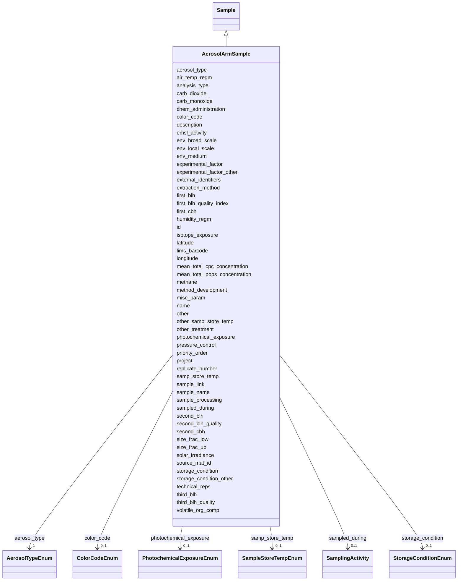

# Class: AerosolArmSample 


_An aerosol sample collected by the ARM facility._


URI: [analysis_api_schema:AerosolArmSample](https://w3id.org/MONet/analysis-api-schema/AerosolArmSample)





## Inheritance
* [Sample](Sample.md)
    * **AerosolArmSample**


## Slots

| Name | Cardinality and Range | Description | Inheritance |
| ---  | --- | --- | --- |
| [aerosol_type](aerosol_type.md) | 1 <br/> [AerosolTypeEnum](AerosolTypeEnum.md) | The type or method of aerosol collection | direct |
| [air_temp_regm](air_temp_regm.md) | 0..1 <br/> [String](String.md) | Information about treatment involving an exposure to varying temperatures; sh... | direct |
| [analysis_type](analysis_type.md) | 1 <br/> [String](String.md) | The type(s) of analysis planned for this sample | direct |
| [carb_dioxide](carb_dioxide.md) | 0..1 <br/> [String](String.md) | Amount of carbon dioxide measured in the air the day of sampling | direct |
| [carb_monoxide](carb_monoxide.md) | 0..1 <br/> [String](String.md) | Amount of carbon monoxide measured in the air the day of sampling | direct |
| [chem_administration](chem_administration.md) | 0..1 <br/> [String](String.md) | List of chemical compounds administered to the host or site where sampling oc... | direct |
| [color_code](color_code.md) | 0..1 <br/> [ColorCodeEnum](ColorCodeEnum.md) | Color indicates the max altitude | direct |
| [env_broad_scale](env_broad_scale.md) | 0..1 <br/> [String](String.md) | 'Report the major environmental system the sample or specimen came from | direct |
| [env_local_scale](env_local_scale.md) | 0..1 <br/> [String](String.md) | 'Report the entity which are in your sample or specimens local vicinity and w... | direct |
| [env_medium](env_medium.md) | 0..1 <br/> [String](String.md) | 'Report the environmental material immediately surrounding the sample or spec... | direct |
| [experimental_factor](experimental_factor.md) | 0..1 <br/> [String](String.md) | Experimental factors are essentially the variable aspects of an experiment de... | direct |
| [experimental_factor_other](experimental_factor_other.md) | 0..1 <br/> [String](String.md) | Other details about your sample that you feel can't be accurately represented... | direct |
| [external_identifiers](external_identifiers.md) | * <br/> [Uriorcurie](Uriorcurie.md) | List of external identifiers associated with this entity or activity | direct |
| [extraction_method](extraction_method.md) | 0..1 <br/> [String](String.md) | If you (the user) performed an extraction preparation or processing before se... | direct |
| [first_blh](first_blh.md) | 0..1 <br/> [Float](Float.md) | First boundary layer height candidate (meters) (Unit: m) | direct |
| [first_blh_quality_index](first_blh_quality_index.md) | 0..1 <br/> [String](String.md) | Quality index for first boundary layer height candidate (-999 if no candidate... | direct |
| [first_cbh](first_cbh.md) | 0..1 <br/> [Float](Float.md) | First cloud base (meters) or vertical visibility (meters) (-999 if no cloud b... | direct |
| [humidity_regm](humidity_regm.md) | 0..1 <br/> [String](String.md) | Information about treatment involving an exposure to varying degrees of humid... | direct |
| [isotope_exposure](isotope_exposure.md) | 0..1 <br/> [String](String.md) | List isotope exposure or addition applied to your sample | direct |
| [latitude](latitude.md) | 0..1 <br/> [Double](Double.md) | Latitude coordinate of the sampling site in WSG 84 format | direct |
| [longitude](longitude.md) | 0..1 <br/> [Double](Double.md) | Longitude coordinate of the sampling site in WSG 84 format | direct |
| [mean_total_cpc_concentration](mean_total_cpc_concentration.md) | 0..1 <br/> [Float](Float.md) | Mean concentration obtained from Condensation Particle Counter (Unit: μm) | direct |
| [mean_total_pops_concentration](mean_total_pops_concentration.md) | 0..1 <br/> [Float](Float.md) | Mean concentration obtained from Portable Optical Particle Spectrometer (Unit... | direct |
| [methane](methane.md) | 0..1 <br/> [String](String.md) | Methane (gas) amount or concentration at the time of sampling | direct |
| [method_development](method_development.md) | 0..1 <br/> [String](String.md) | If your samples are TEST sample ONLY, please provide information on what you'... | direct |
| [misc_param](misc_param.md) | 0..1 <br/> [String](String.md) | Any other measurement performed or parameter collected that is not listed her... | direct |
| [other](other.md) | 0..1 <br/> [String](String.md) | Other/additional details about your sample that you feel can't be accurately ... | direct |
| [other_treatment](other_treatment.md) | 0..1 <br/> [String](String.md) | Many sample treatment descriptor columns are available | direct |
| [other_samp_store_temp](other_samp_store_temp.md) | 0..1 <br/> [String](String.md) | Please specify sample storage temperature if you selected 'other' | direct |
| [photochemical_exposure](photochemical_exposure.md) | 0..1 <br/> [PhotochemicalExposureEnum](PhotochemicalExposureEnum.md) | This term is used to describe a chemical reaction caused by absorption of ult... | direct |
| [pressure_control](pressure_control.md) | 0..1 <br/> [String](String.md) | Measurment of pressure applied to the sample during experimentation (Unit: Pa... | direct |
| [priority_order](priority_order.md) | 0..1 <br/> [Float](Float.md) | Indicate the run order priority of your samples | direct |
| [project](project.md) | 0..1 <br/> [Integer](Integer.md) | Identifier for the user project associated with the entity or activity | direct |
| [replicate_number](replicate_number.md) | 0..1 <br/> [Integer](Integer.md) | The replicate number of the sample, if applicable | direct |
| [samp_store_temp](samp_store_temp.md) | 0..1 <br/> [SampleStoreTempEnum](SampleStoreTempEnum.md) | The temperature at which your samples should be stored upon arrival | direct |
| [sample_link](sample_link.md) | 0..1 <br/> [String](String.md) | 'A unique identifier to assign parent-child subsample or sibling samples | direct |
| [sample_name](sample_name.md) | 0..1 <br/> [String](String.md) | The name or label that is present on the shipped sample | direct |
| [sample_processing](sample_processing.md) | 0..1 <br/> [String](String.md) | A brief description of any processing applied to the sample during or after r... | direct |
| [sampled_during](sampled_during.md) | 0..1 <br/> [SamplingActivity](SamplingActivity.md) | Reference to the sampling activity during which this sample was collected | direct |
| [second_blh](second_blh.md) | 0..1 <br/> [Float](Float.md) | Second boundary layer height candidate (meters) (Unit: m) | direct |
| [second_blh_quality](second_blh_quality.md) | 0..1 <br/> [String](String.md) | Quality index for second boundary layer height candidate (-999 if no candidat... | direct |
| [second_cbh](second_cbh.md) | 0..1 <br/> [Float](Float.md) | Second cloud base (meters) or highest received signal in vertical visibility ... | direct |
| [size_frac_low](size_frac_low.md) | 0..1 <br/> [String](String.md) | Refers to the mesh/pore size used to pre-filter/pre-sort the sample | direct |
| [size_frac_up](size_frac_up.md) | 0..1 <br/> [String](String.md) | Refers to the mesh/pore size used to retain the sample | direct |
| [solar_irradiance](solar_irradiance.md) | 0..1 <br/> [String](String.md) | Solar irradiance is the power per unit area (surface power density) received ... | direct |
| [source_mat_id](source_mat_id.md) | 0..1 <br/> [String](String.md) | A unique identifier assigned to an original material sample collected or to a... | direct |
| [storage_condition](storage_condition.md) | 0..1 <br/> [StorageConditionEnum](StorageConditionEnum.md) | The storage condition of the sample | direct |
| [storage_condition_other](storage_condition_other.md) | 0..1 <br/> [String](String.md) | Free-text field for storage conditions when 'storage_condition' is 'other' | direct |
| [technical_reps](technical_reps.md) | 0..1 <br/> [Integer](Integer.md) | Number of technical replicates for the sample | direct |
| [third_blh](third_blh.md) | 0..1 <br/> [Float](Float.md) | Third boundary layer height candidate (meters) (Unit: m) | direct |
| [third_blh_quality](third_blh_quality.md) | 0..1 <br/> [String](String.md) | Quality index for third boundary layer height candidate (-999 if no candidate... | direct |
| [volatile_org_comp](volatile_org_comp.md) | 0..1 <br/> [String](String.md) | Volatile organic compounds are organic chemicals that have a high vapour pres... | direct |
| [id](id.md) | 1 <br/> [Uuid](Uuid.md) |  | direct |
| [name](name.md) | 1 <br/> [String](String.md) | Human-readable name for the entity or activity | [Sample](Sample.md) |
| [description](description.md) | 0..1 <br/> [String](String.md) | Human-readable description for the entity or activity | [Sample](Sample.md) |
| [emsl_activity](emsl_activity.md) | 0..1 <br/> [String](String.md) | Nullable string linking a Sample or SamplingActivity to a named EMSL activity... | [Sample](Sample.md) |
| [lims_barcode](lims_barcode.md) | 0..1 <br/> [String](String.md) | LIMS barcode identifier | [Sample](Sample.md) |


## Identifier and Mapping Information


### Schema Source


* from schema: https://w3id.org/MONet/analysis-api-schema


## Mappings

| Mapping Type | Mapped Value |
| ---  | ---  |
| self | analysis_api_schema:AerosolArmSample |
| native | analysis_api_schema:AerosolArmSample |


## LinkML Source

<!-- TODO: investigate https://stackoverflow.com/questions/37606292/how-to-create-tabbed-code-blocks-in-mkdocs-or-sphinx -->

### Direct

<details>
```yaml
name: AerosolArmSample
description: An aerosol sample collected by the ARM facility.
from_schema: https://w3id.org/MONet/analysis-api-schema
is_a: Sample
slots:
- aerosol_type
- air_temp_regm
- analysis_type
- carb_dioxide
- carb_monoxide
- chem_administration
- color_code
- env_broad_scale
- env_local_scale
- env_medium
- experimental_factor
- experimental_factor_other
- external_identifiers
- extraction_method
- first_blh
- first_blh_quality_index
- first_cbh
- humidity_regm
- isotope_exposure
- latitude
- longitude
- mean_total_cpc_concentration
- mean_total_pops_concentration
- methane
- method_development
- misc_param
- other
- other_treatment
- other_samp_store_temp
- photochemical_exposure
- pressure_control
- priority_order
- project
- replicate_number
- samp_store_temp
- sample_link
- sample_name
- sample_processing
- sampled_during
- second_blh
- second_blh_quality
- second_cbh
- size_frac_low
- size_frac_up
- solar_irradiance
- source_mat_id
- storage_condition
- storage_condition_other
- technical_reps
- third_blh
- third_blh_quality
- volatile_org_comp
slot_usage:
  analysis_type:
    name: analysis_type
    required: true
  carb_dioxide:
    name: carb_dioxide
    description: Amount of carbon dioxide measured in the air the day of sampling.
      Provided by ARM. Provide value and unit, any unit is valid
    pattern: ^\d+(\.\d+)?\s*[\w\s/]+$
  carb_monoxide:
    name: carb_monoxide
    description: Amount of carbon monoxide measured in the air the day of sampling.
      Provided by ARM. Provide value and unit any unit is valid
    pattern: ^\d+(\.\d+)?\s*[\w\s/]+$
  size_frac_low:
    name: size_frac_low
    description: 'Refers to the mesh/pore size used to pre-filter/pre-sort the sample.
      Materials larger than the size threshold are excluded from the sample (Unit:
      um)'
    pattern: ^\d+(\.\d+)?\s*um$
  size_frac_up:
    name: size_frac_up
    description: 'Refers to the mesh/pore size used to retain the sample. Materials
      smaller than the size threshold are excluded from the sample (Unit: um)'
    pattern: ^\d+(\.\d+)?\s*um$
attributes:
  id:
    name: id
    from_schema: https://w3id.org/MONet/analysis-api-schema/sample-classes
    identifier: true
    domain_of:
    - Activity
    - Entity
    - DataProduct
    - DataGenerationActivity
    - DataProcessingActivity
    - AlternativeIdentifier
    - FunctionalAnnotationIdentifier
    - Instrument
    - OntologyClass
    - ContainerType
    - Custodian
    - InstrumentAlternativeIdentifier
    - LabDevice
    - SampleProcessing
    - ProcessingSampleLink
    - Configuration
    - MobilePhaseSegment
    - MassSpectrometryStandardRun
    - PurchasedMaterial
    - LabProcessingActivity
    - organism
    - MAOMProduct
    - WEOMProduct
    - Site
    - Sample
    - AerosolArmSample
    - AerosolSample
    - AMP2UserSample
    - CommerciallyPurchasedSample
    - CultureEnvironmentalSample
    - EngineeredStrainSample
    - FieldDeployedTerraformSample
    - MixedCultureSample
    - MonetSoilSample
    - OtherUndescribedSample
    - PlantSample
    - PureCultureSample
    - SedimentSample
    - SoilSample
    - SynthesizedMaterialSample
    - TerraformSample
    - WaterSample
    - ProcessedSample
    - CoreSection
    - SamplingActivity
    - AerosolArmSamplingActivity
    - AerosolSamplingActivity
    - CommerciallyPurchasedSamplingActivity
    - CultureEnvironmentalSamplingActivity
    - EngineeredStrainSamplingActivity
    - FieldDeployedTerraformSamplingActivity
    - MixedCultureSamplingActivity
    - MonetSoilSamplingActivity
    - OtherUndescribedSamplingActivity
    - PlantSamplingActivity
    - PureCultureSamplingActivity
    - SedimentSamplingActivity
    - SoilSamplingActivity
    - SynthesizedMaterialSamplingActivity
    - TerraformSamplingActivity
    - WaterSamplingActivity
    - Study
    - ProjectParticipant
    - TimestampValue
    - TextValue
    - SoftwareControlledTermValue
    - ControlledTermValue
    - PersonValue
    - QuantityValue
    - ConditioningValue
    - zipDownload
    range: uuid
    required: true

```
</details>

### Induced

<details>
```yaml
name: AerosolArmSample
description: An aerosol sample collected by the ARM facility.
from_schema: https://w3id.org/MONet/analysis-api-schema
is_a: Sample
slot_usage:
  analysis_type:
    name: analysis_type
    required: true
  carb_dioxide:
    name: carb_dioxide
    description: Amount of carbon dioxide measured in the air the day of sampling.
      Provided by ARM. Provide value and unit, any unit is valid
    pattern: ^\d+(\.\d+)?\s*[\w\s/]+$
  carb_monoxide:
    name: carb_monoxide
    description: Amount of carbon monoxide measured in the air the day of sampling.
      Provided by ARM. Provide value and unit any unit is valid
    pattern: ^\d+(\.\d+)?\s*[\w\s/]+$
  size_frac_low:
    name: size_frac_low
    description: 'Refers to the mesh/pore size used to pre-filter/pre-sort the sample.
      Materials larger than the size threshold are excluded from the sample (Unit:
      um)'
    pattern: ^\d+(\.\d+)?\s*um$
  size_frac_up:
    name: size_frac_up
    description: 'Refers to the mesh/pore size used to retain the sample. Materials
      smaller than the size threshold are excluded from the sample (Unit: um)'
    pattern: ^\d+(\.\d+)?\s*um$
attributes:
  id:
    name: id
    from_schema: https://w3id.org/MONet/analysis-api-schema/sample-classes
    identifier: true
    alias: id
    owner: AerosolArmSample
    domain_of:
    - Activity
    - Entity
    - DataProduct
    - DataGenerationActivity
    - DataProcessingActivity
    - AlternativeIdentifier
    - FunctionalAnnotationIdentifier
    - Instrument
    - OntologyClass
    - ContainerType
    - Custodian
    - InstrumentAlternativeIdentifier
    - LabDevice
    - SampleProcessing
    - ProcessingSampleLink
    - Configuration
    - MobilePhaseSegment
    - MassSpectrometryStandardRun
    - PurchasedMaterial
    - LabProcessingActivity
    - organism
    - MAOMProduct
    - WEOMProduct
    - Site
    - Sample
    - AerosolArmSample
    - AerosolSample
    - AMP2UserSample
    - CommerciallyPurchasedSample
    - CultureEnvironmentalSample
    - EngineeredStrainSample
    - FieldDeployedTerraformSample
    - MixedCultureSample
    - MonetSoilSample
    - OtherUndescribedSample
    - PlantSample
    - PureCultureSample
    - SedimentSample
    - SoilSample
    - SynthesizedMaterialSample
    - TerraformSample
    - WaterSample
    - ProcessedSample
    - CoreSection
    - SamplingActivity
    - AerosolArmSamplingActivity
    - AerosolSamplingActivity
    - CommerciallyPurchasedSamplingActivity
    - CultureEnvironmentalSamplingActivity
    - EngineeredStrainSamplingActivity
    - FieldDeployedTerraformSamplingActivity
    - MixedCultureSamplingActivity
    - MonetSoilSamplingActivity
    - OtherUndescribedSamplingActivity
    - PlantSamplingActivity
    - PureCultureSamplingActivity
    - SedimentSamplingActivity
    - SoilSamplingActivity
    - SynthesizedMaterialSamplingActivity
    - TerraformSamplingActivity
    - WaterSamplingActivity
    - Study
    - ProjectParticipant
    - TimestampValue
    - TextValue
    - SoftwareControlledTermValue
    - ControlledTermValue
    - PersonValue
    - QuantityValue
    - ConditioningValue
    - zipDownload
    range: uuid
    required: true
  aerosol_type:
    name: aerosol_type
    description: The type or method of aerosol collection
    from_schema: https://w3id.org/MONet/analysis-api-schema
    rank: 1000
    alias: aerosol_type
    owner: AerosolArmSample
    domain_of:
    - AerosolArmSample
    - AerosolSample
    range: AerosolTypeEnum
    required: true
  air_temp_regm:
    name: air_temp_regm
    description: Information about treatment involving an exposure to varying temperatures;
      should include the temperature, treatment regimen including how many times the
      treatment was repeated, how long each treatment lasted, and the start and end
      time of the entire treatment; can include different temperature regimens
    title: air temperature regimen
    from_schema: https://w3id.org/MONet/analysis-api-schema
    exact_mappings:
    - MIXS:0000551
    rank: 1000
    alias: air_temp_regm
    owner: AerosolArmSample
    domain_of:
    - AerosolArmSample
    - AerosolSample
    - CultureEnvironmentalSample
    - FieldDeployedTerraformSample
    - MixedCultureSample
    - OtherUndescribedSample
    - PlantSample
    - PureCultureSample
    - SedimentSample
    - SoilSample
    - TerraformSample
    - WaterSample
    range: string
  analysis_type:
    name: analysis_type
    description: The type(s) of analysis planned for this sample.
    from_schema: https://w3id.org/MONet/analysis-api-schema
    rank: 1000
    alias: analysis_type
    owner: AerosolArmSample
    domain_of:
    - SampleProcessing
    - AerosolArmSample
    - AerosolSample
    - AMP2UserSample
    - CommerciallyPurchasedSample
    - CultureEnvironmentalSample
    - FieldDeployedTerraformSample
    - MixedCultureSample
    - OtherUndescribedSample
    - PlantSample
    - PureCultureSample
    - SedimentSample
    - SoilSample
    - SynthesizedMaterialSample
    - TerraformSample
    - WaterSample
    range: string
    required: true
  carb_dioxide:
    name: carb_dioxide
    description: Amount of carbon dioxide measured in the air the day of sampling.
      Provided by ARM. Provide value and unit, any unit is valid
    title: carbon dioxide
    from_schema: https://w3id.org/MONet/analysis-api-schema
    rank: 1000
    alias: carb_dioxide
    owner: AerosolArmSample
    domain_of:
    - AerosolArmSample
    - AerosolSample
    - OtherUndescribedSample
    range: string
    pattern: ^\d+(\.\d+)?\s*[\w\s/]+$
  carb_monoxide:
    name: carb_monoxide
    description: Amount of carbon monoxide measured in the air the day of sampling.
      Provided by ARM. Provide value and unit any unit is valid
    title: carbon monoxide
    from_schema: https://w3id.org/MONet/analysis-api-schema
    rank: 1000
    alias: carb_monoxide
    owner: AerosolArmSample
    domain_of:
    - AerosolArmSample
    - AerosolSample
    - OtherUndescribedSample
    range: string
    pattern: ^\d+(\.\d+)?\s*[\w\s/]+$
  chem_administration:
    name: chem_administration
    description: List of chemical compounds administered to the host or site where
      sampling occurred, and when (e.g. Antibiotics, n fertilizer, air filter); can
      include multiple compounds. For chemical entities of biological interest ontology
      (chebi) (v 163), http://purl.bioontology.org/ontology/chebi
    title: chemical administration
    from_schema: https://w3id.org/MONet/analysis-api-schema
    exact_mappings:
    - MIXS:0000751
    rank: 1000
    alias: chem_administration
    owner: AerosolArmSample
    domain_of:
    - AerosolArmSample
    - AerosolSample
    - CultureEnvironmentalSample
    - FieldDeployedTerraformSample
    - MixedCultureSample
    - MonetSoilSample
    - OtherUndescribedSample
    - PlantSample
    - PureCultureSample
    - SedimentSample
    - SoilSample
    - TerraformSample
    - WaterSample
    range: string
  color_code:
    name: color_code
    description: Color indicates the max altitude.
    title: color code
    from_schema: https://w3id.org/MONet/analysis-api-schema
    rank: 1000
    alias: color_code
    owner: AerosolArmSample
    domain_of:
    - AerosolArmSample
    range: ColorCodeEnum
  env_broad_scale:
    name: env_broad_scale
    description: '''Report the major environmental system the sample or specimen came
      from. The system identified should have a coarse spatial grain to provide the
      general environmental context of where the sampling was done (e.g. in the desert
      or a rainforest). We recommend using subclasses of EnvO''''s biome class: http://purl.obolibrary.org/obo/ENVO_00000428.
      EnvO documentation about how to use the field: https://github.com/EnvironmentOntology/envo/wiki/Using-ENVO-with-MIxS'''
    title: broad-scale environmental context
    from_schema: https://w3id.org/MONet/analysis-api-schema
    rank: 1000
    alias: env_broad_scale
    owner: AerosolArmSample
    domain_of:
    - AerosolArmSample
    - AerosolSample
    - CultureEnvironmentalSample
    - FieldDeployedTerraformSample
    - MonetSoilSample
    - OtherUndescribedSample
    - PlantSample
    - PureCultureSample
    - SedimentSample
    - SoilSample
    - TerraformSample
    - WaterSample
    range: string
    pattern: ^_*\s*[a-zA-Z\s]+\[ENVO:\d+\]$
  env_local_scale:
    name: env_local_scale
    description: '''Report the entity which are in your sample or specimens local
      vicinity and which you believe have significant causal influences on your sample
      or specimen. Please use terms that are present in ENVO and which are of smaller
      spatial grain than your entry for env_broad_scale.If needed, request new terms
      on the ENVO tracker identified here: http://www.obofoundry.org/ontology/envo.html'''
    title: local environmental context
    from_schema: https://w3id.org/MONet/analysis-api-schema
    rank: 1000
    alias: env_local_scale
    owner: AerosolArmSample
    domain_of:
    - AerosolArmSample
    - AerosolSample
    - CultureEnvironmentalSample
    - FieldDeployedTerraformSample
    - MonetSoilSample
    - OtherUndescribedSample
    - PlantSample
    - PureCultureSample
    - SedimentSample
    - SoilSample
    - TerraformSample
    - WaterSample
    range: string
    pattern: ^_*\s*[a-zA-Z\s]+\[ENVO:\d+\]$
  env_medium:
    name: env_medium
    description: '''Report the environmental material immediately surrounding the
      sample or specimen at the time of sampling. We recommend using subclasses of
      ''''environmental material'''' (http://purl.obolibrary.org/obo/ENVO_00010483).
      EnvO documentation about how to use the field: https://github.com/EnvironmentOntology/envo/wiki/Using-ENVO-with-MIxS.'''
    title: environmental medium
    from_schema: https://w3id.org/MONet/analysis-api-schema
    rank: 1000
    alias: env_medium
    owner: AerosolArmSample
    domain_of:
    - AerosolArmSample
    - AerosolSample
    - CultureEnvironmentalSample
    - FieldDeployedTerraformSample
    - MonetSoilSample
    - OtherUndescribedSample
    - PlantSample
    - PureCultureSample
    - SedimentSample
    - SoilSample
    - TerraformSample
    - WaterSample
    range: string
    pattern: ^_*\s*[a-zA-Z\s]+\[ENVO:\d+\]$
  experimental_factor:
    name: experimental_factor
    description: Experimental factors are essentially the variable aspects of an experiment
      design which can be used to describe an experiment or set of experiments in
      an increasingly detailed manner. This field accepts ontology terms from Experimental
      Factor Ontology (EFO) and/or Ontology for Biomedical Investigations (OBI). For
      a browser of EFO (v 2.95) terms please see http://purl.bioontology.org/ontology/EFO;
      for a browser of OBI (v 2018-02-12) terms please see http://purl.bioontology.org/ontology/OBI
    title: experimental factor
    from_schema: https://w3id.org/MONet/analysis-api-schema
    rank: 1000
    alias: experimental_factor
    owner: AerosolArmSample
    domain_of:
    - AerosolArmSample
    - AerosolSample
    - CommerciallyPurchasedSample
    - CultureEnvironmentalSample
    - MixedCultureSample
    - OtherUndescribedSample
    - PlantSample
    - PureCultureSample
    - SedimentSample
    - SoilSample
    - SynthesizedMaterialSample
    - WaterSample
    range: string
  experimental_factor_other:
    name: experimental_factor_other
    description: Other details about your sample that you feel can't be accurately
      represented in the available columns.
    title: other experimental factor
    from_schema: https://w3id.org/MONet/analysis-api-schema
    rank: 1000
    alias: experimental_factor_other
    owner: AerosolArmSample
    domain_of:
    - AerosolArmSample
    - AerosolSample
    - CommerciallyPurchasedSample
    - CultureEnvironmentalSample
    - MixedCultureSample
    - OtherUndescribedSample
    - PlantSample
    - PureCultureSample
    - SedimentSample
    - SoilSample
    - SynthesizedMaterialSample
    - WaterSample
    range: string
  external_identifiers:
    name: external_identifiers
    description: List of external identifiers associated with this entity or activity.
    from_schema: https://w3id.org/MONet/analysis-api-schema
    rank: 1000
    alias: external_identifiers
    owner: AerosolArmSample
    domain_of:
    - NucleotideSequencing
    - AerosolArmSample
    - AerosolSample
    - CommerciallyPurchasedSample
    - CultureEnvironmentalSample
    - EngineeredStrainSample
    - FieldDeployedTerraformSample
    - MixedCultureSample
    - MonetSoilSample
    - OtherUndescribedSample
    - PlantSample
    - PureCultureSample
    - SedimentSample
    - SoilSample
    - SynthesizedMaterialSample
    - TerraformSample
    - WaterSample
    - Study
    range: uriorcurie
    multivalued: true
  extraction_method:
    name: extraction_method
    description: If you (the user) performed an extraction preparation or processing
      before sending the sample to EMSL, what was it? This is only applicable when
      sending an 'analytical sample'. See README for more details on types of samples.
    title: extraction method
    from_schema: https://w3id.org/MONet/analysis-api-schema
    rank: 1000
    alias: extraction_method
    owner: AerosolArmSample
    domain_of:
    - PhosphorusAnalysisProduct
    - AerosolArmSample
    - AerosolSample
    - CultureEnvironmentalSample
    - MixedCultureSample
    - OtherUndescribedSample
    - PlantSample
    - PureCultureSample
    - SedimentSample
    - SoilSample
    - WaterSample
    range: string
  first_blh:
    name: first_blh
    description: 'First boundary layer height candidate (meters) (Unit: m)'
    title: first boundary layer height
    from_schema: https://w3id.org/MONet/analysis-api-schema
    rank: 1000
    alias: first_blh
    owner: AerosolArmSample
    domain_of:
    - AerosolArmSample
    range: float
  first_blh_quality_index:
    name: first_blh_quality_index
    description: Quality index for first boundary layer height candidate (-999 if
      no candidate)
    title: first boundary layer height quality
    from_schema: https://w3id.org/MONet/analysis-api-schema
    rank: 1000
    alias: first_blh_quality_index
    owner: AerosolArmSample
    domain_of:
    - AerosolArmSample
    range: string
  first_cbh:
    name: first_cbh
    description: 'First cloud base (meters) or vertical visibility (meters) (-999
      if no cloud base or vertical visibility) (Unit: m)'
    title: first cloud base height
    from_schema: https://w3id.org/MONet/analysis-api-schema
    rank: 1000
    alias: first_cbh
    owner: AerosolArmSample
    domain_of:
    - AerosolArmSample
    range: float
  humidity_regm:
    name: humidity_regm
    description: Information about treatment involving an exposure to varying degrees
      of humidity; should include amount of humidity administered, treatment regimen
      including how many times the treatment was repeated, how long each treatment
      lasted, and the start and end time of the entire treatment; can include multiple
      regimens
    title: humidity regimen
    from_schema: https://w3id.org/MONet/analysis-api-schema
    rank: 1000
    alias: humidity_regm
    owner: AerosolArmSample
    domain_of:
    - AerosolArmSample
    - AerosolSample
    - CultureEnvironmentalSample
    - FieldDeployedTerraformSample
    - MixedCultureSample
    - OtherUndescribedSample
    - PlantSample
    - PureCultureSample
    - SedimentSample
    - SoilSample
    - TerraformSample
    range: string
  isotope_exposure:
    name: isotope_exposure
    description: List isotope exposure or addition applied to your sample.
    title: isotope exposure
    from_schema: https://w3id.org/MONet/analysis-api-schema
    rank: 1000
    alias: isotope_exposure
    owner: AerosolArmSample
    domain_of:
    - AerosolArmSample
    - AerosolSample
    - CultureEnvironmentalSample
    - FieldDeployedTerraformSample
    - MixedCultureSample
    - OtherUndescribedSample
    - PlantSample
    - PureCultureSample
    - SedimentSample
    - SoilSample
    - TerraformSample
    - WaterSample
    range: string
  latitude:
    name: latitude
    description: Latitude coordinate of the sampling site in WSG 84 format.
    title: latitude
    from_schema: https://w3id.org/MONet/analysis-api-schema
    broad_mappings:
    - MIXS:0000009
    rank: 1000
    alias: latitude
    owner: AerosolArmSample
    domain_of:
    - Site
    - AerosolArmSample
    - AerosolSample
    - CultureEnvironmentalSample
    - FieldDeployedTerraformSample
    - MonetSoilSample
    - OtherUndescribedSample
    - PlantSample
    - SedimentSample
    - SoilSample
    - WaterSample
    range: double
  longitude:
    name: longitude
    description: Longitude coordinate of the sampling site in WSG 84 format.
    title: longitude
    from_schema: https://w3id.org/MONet/analysis-api-schema
    broad_mappings:
    - MIXS:0000009
    rank: 1000
    alias: longitude
    owner: AerosolArmSample
    domain_of:
    - Site
    - AerosolArmSample
    - AerosolSample
    - CultureEnvironmentalSample
    - FieldDeployedTerraformSample
    - MonetSoilSample
    - OtherUndescribedSample
    - PlantSample
    - SedimentSample
    - SoilSample
    - WaterSample
    range: double
  mean_total_cpc_concentration:
    name: mean_total_cpc_concentration
    description: 'Mean concentration obtained from Condensation Particle Counter (Unit:
      μm)'
    title: mean total C.P.C. concentration
    from_schema: https://w3id.org/MONet/analysis-api-schema
    rank: 1000
    alias: mean_total_cpc_concentration
    owner: AerosolArmSample
    domain_of:
    - AerosolArmSample
    range: float
  mean_total_pops_concentration:
    name: mean_total_pops_concentration
    description: 'Mean concentration obtained from Portable Optical Particle Spectrometer
      (Unit: μm)'
    title: mean total P.O.P. concentration
    from_schema: https://w3id.org/MONet/analysis-api-schema
    rank: 1000
    alias: mean_total_pops_concentration
    owner: AerosolArmSample
    domain_of:
    - AerosolArmSample
    range: float
  methane:
    name: methane
    description: 'Methane (gas) amount or concentration at the time of sampling. (Unit:
      umol/L or ppb or ppm)'
    title: methane
    from_schema: https://w3id.org/MONet/analysis-api-schema
    rank: 1000
    alias: methane
    owner: AerosolArmSample
    domain_of:
    - AerosolArmSample
    - AerosolSample
    - OtherUndescribedSample
    - SedimentSample
    range: string
    pattern: ^\d+(\.\d+)?\s*(umol/L|ppm|ppb)$
  method_development:
    name: method_development
    description: If your samples are TEST sample ONLY, please provide information
      on what you're hoping this test will resolve.
    title: method development
    from_schema: https://w3id.org/MONet/analysis-api-schema
    rank: 1000
    alias: method_development
    owner: AerosolArmSample
    domain_of:
    - AerosolArmSample
    - AerosolSample
    - CommerciallyPurchasedSample
    - CultureEnvironmentalSample
    - FieldDeployedTerraformSample
    - MixedCultureSample
    - OtherUndescribedSample
    - PlantSample
    - PureCultureSample
    - SedimentSample
    - SoilSample
    - TerraformSample
    - WaterSample
    range: string
  misc_param:
    name: misc_param
    description: Any other measurement performed or parameter collected that is not
      listed here
    title: miscellaneous parameter
    from_schema: https://w3id.org/MONet/analysis-api-schema
    rank: 1000
    alias: misc_param
    owner: AerosolArmSample
    domain_of:
    - AerosolArmSample
    - AerosolSample
    - FieldDeployedTerraformSample
    - MonetSoilSample
    - OtherUndescribedSample
    - PlantSample
    - SedimentSample
    - SoilSample
    - TerraformSample
    - WaterSample
    range: string
  other:
    name: other
    description: Other/additional details about your sample that you feel can't be
      accurately represented in ANY of the available columns.
    title: other
    from_schema: https://w3id.org/MONet/analysis-api-schema
    rank: 1000
    alias: other
    owner: AerosolArmSample
    domain_of:
    - AerosolArmSample
    - AerosolSample
    - CommerciallyPurchasedSample
    - CultureEnvironmentalSample
    - FieldDeployedTerraformSample
    - MixedCultureSample
    - MonetSoilSample
    - OtherUndescribedSample
    - PlantSample
    - PureCultureSample
    - SedimentSample
    - SoilSample
    - SynthesizedMaterialSample
    - TerraformSample
    - WaterSample
    range: string
  other_treatment:
    name: other_treatment
    description: Many sample treatment descriptor columns are available. If a treatment
      is applied to your samples and the provided treatment terms do not satisfy please
      add it here. Multiple treatments can be entered here separated by ;
    title: other treatment
    from_schema: https://w3id.org/MONet/analysis-api-schema
    rank: 1000
    alias: other_treatment
    owner: AerosolArmSample
    domain_of:
    - AerosolArmSample
    - AerosolSample
    - CommerciallyPurchasedSample
    - CultureEnvironmentalSample
    - FieldDeployedTerraformSample
    - MixedCultureSample
    - MonetSoilSample
    - OtherUndescribedSample
    - PlantSample
    - PureCultureSample
    - SedimentSample
    - SoilSample
    - TerraformSample
    - WaterSample
    range: string
  other_samp_store_temp:
    name: other_samp_store_temp
    description: Please specify sample storage temperature if you selected 'other'
    title: other sample storage temperature
    from_schema: https://w3id.org/MONet/analysis-api-schema
    rank: 1000
    alias: other_samp_store_temp
    owner: AerosolArmSample
    domain_of:
    - AerosolArmSample
    - AerosolSample
    - CommerciallyPurchasedSample
    - CultureEnvironmentalSample
    - FieldDeployedTerraformSample
    - MixedCultureSample
    - MonetSoilSample
    - OtherUndescribedSample
    - PlantSample
    - PureCultureSample
    - SedimentSample
    - SoilSample
    - SynthesizedMaterialSample
    - TerraformSample
    - WaterSample
    range: string
  photochemical_exposure:
    name: photochemical_exposure
    description: This term is used to describe a chemical reaction caused by absorption
      of ultraviolet (wavelength from 100 to 400 nm), visible light (400-750 nm),
      or infrared radiation (750-2500 nm)
    title: photochemical exposure
    from_schema: https://w3id.org/MONet/analysis-api-schema
    rank: 1000
    alias: photochemical_exposure
    owner: AerosolArmSample
    domain_of:
    - AerosolArmSample
    - AerosolSample
    - OtherUndescribedSample
    range: PhotochemicalExposureEnum
  pressure_control:
    name: pressure_control
    description: 'Measurment of pressure applied to the sample during experimentation
      (Unit: Pa)'
    title: pressure control
    from_schema: https://w3id.org/MONet/analysis-api-schema
    rank: 1000
    alias: pressure_control
    owner: AerosolArmSample
    domain_of:
    - AerosolArmSample
    - AerosolSample
    - OtherUndescribedSample
    range: string
    pattern: ^\d+(\.\d+)?\s*Pa$
  priority_order:
    name: priority_order
    description: Indicate the run order priority of your samples
    title: priority order
    from_schema: https://w3id.org/MONet/analysis-api-schema
    rank: 1000
    alias: priority_order
    owner: AerosolArmSample
    domain_of:
    - AerosolArmSample
    - AerosolSample
    - OtherUndescribedSample
    range: float
  project:
    name: project
    description: 'Identifier for the user project associated with the entity or activity. '
    title: Project
    todos:
    - should this be an ID? CURIE can use the one NMDC has https://bioregistry.io/reference/emsl.project:60141
      where emsl.project is the CURIE prefix
    from_schema: https://w3id.org/MONet/analysis-api-schema
    aliases:
    - study
    - study_id
    - project_id
    - proposal
    - proposal_id
    rank: 1000
    alias: project
    owner: AerosolArmSample
    domain_of:
    - DataProduct
    - AerosolArmSample
    - AerosolSample
    - CommerciallyPurchasedSample
    - CultureEnvironmentalSample
    - FieldDeployedTerraformSample
    - MixedCultureSample
    - MonetSoilSample
    - OtherUndescribedSample
    - PlantSample
    - PureCultureSample
    - SedimentSample
    - SoilSample
    - SynthesizedMaterialSample
    - TerraformSample
    - WaterSample
    - SamplingActivity
    range: integer
  replicate_number:
    name: replicate_number
    description: The replicate number of the sample, if applicable. Included for compatibility
      with submission schema.
    todos:
    - reconcile replicate modelling
    from_schema: https://w3id.org/MONet/analysis-api-schema
    rank: 1000
    alias: replicate_number
    owner: AerosolArmSample
    domain_of:
    - AerosolArmSample
    - AerosolSample
    - CommerciallyPurchasedSample
    - CultureEnvironmentalSample
    - FieldDeployedTerraformSample
    - MixedCultureSample
    - OtherUndescribedSample
    - PlantSample
    - PureCultureSample
    - SedimentSample
    - SoilSample
    - SynthesizedMaterialSample
    - TerraformSample
    - WaterSample
    range: integer
  samp_store_temp:
    name: samp_store_temp
    description: The temperature at which your samples should be stored upon arrival.
      This field is NOT multivalued. If selecting other add the `other_samp_store_temp`
      attribute to provide additional detail.
    title: sample storage temperature
    from_schema: https://w3id.org/MONet/analysis-api-schema
    aliases:
    - sample_storage_temperature
    - storage_temperature
    rank: 1000
    alias: samp_store_temp
    owner: AerosolArmSample
    domain_of:
    - AerosolArmSample
    - AerosolSample
    - CommerciallyPurchasedSample
    - CultureEnvironmentalSample
    - FieldDeployedTerraformSample
    - MixedCultureSample
    - MonetSoilSample
    - OtherUndescribedSample
    - PlantSample
    - PureCultureSample
    - SedimentSample
    - SoilSample
    - SynthesizedMaterialSample
    - TerraformSample
    - WaterSample
    range: SampleStoreTempEnum
  sample_link:
    name: sample_link
    description: '''A unique identifier to assign parent-child subsample or sibling
      samples. This is relevant when a sample or other material was used to generate
      the new sample. This field allows multiple entries separated by ; (Examples:
      Soil collected from the field will link with the soil used in an incubation.
      The soil a plant was grown in links to the plant sample. An original culture
      sample was transferred to a new vial and generated a new sample)'''
    todos:
    - EMSL and NMDC both need better modelling for this
    from_schema: https://w3id.org/MONet/analysis-api-schema
    rank: 1000
    alias: sample_link
    owner: AerosolArmSample
    domain_of:
    - AerosolArmSample
    - AerosolSample
    - CommerciallyPurchasedSample
    - CultureEnvironmentalSample
    - FieldDeployedTerraformSample
    - MixedCultureSample
    - OtherUndescribedSample
    - PlantSample
    - PureCultureSample
    - SedimentSample
    - SoilSample
    - SynthesizedMaterialSample
    - TerraformSample
    - WaterSample
    range: string
  sample_name:
    name: sample_name
    description: 'The name or label that is present on the shipped sample. This should

      be a human readable name.'
    title: sample name
    notes:
    - This is typically an alias for the inherited 'name' slot on Sample classes.
      Defined separately for compatibility with source data files using 'sample_name'
      column headers.
    from_schema: https://w3id.org/MONet/analysis-api-schema
    aliases:
    - samp_name
    rank: 1000
    alias: sample_name
    owner: AerosolArmSample
    domain_of:
    - DataProduct
    - AerosolArmSample
    - AerosolSample
    - CommerciallyPurchasedSample
    - CultureEnvironmentalSample
    - FieldDeployedTerraformSample
    - MixedCultureSample
    - MonetSoilSample
    - OtherUndescribedSample
    - PlantSample
    - PureCultureSample
    - SedimentSample
    - SoilSample
    - SynthesizedMaterialSample
    - TerraformSample
    - WaterSample
    range: string
  sample_processing:
    name: sample_processing
    description: A brief description of any processing applied to the sample during
      or after retrieving the sample from environment or a link to the relevant protocol(s)
      performed.
    title: sample processing
    from_schema: https://w3id.org/MONet/analysis-api-schema
    rank: 1000
    alias: sample_processing
    owner: AerosolArmSample
    domain_of:
    - AerosolArmSample
    - AerosolSample
    - CommerciallyPurchasedSample
    - CultureEnvironmentalSample
    - FieldDeployedTerraformSample
    - MixedCultureSample
    - OtherUndescribedSample
    - PlantSample
    - PureCultureSample
    - SedimentSample
    - SoilSample
    - SynthesizedMaterialSample
    - TerraformSample
    range: string
  sampled_during:
    name: sampled_during
    description: Reference to the sampling activity during which this sample was collected.
      This is a FK to the SamplingActivity class, which contains metadata about the
      sampling event, such as date, device, method.
    from_schema: https://w3id.org/MONet/analysis-api-schema
    rank: 1000
    alias: sampled_during
    owner: AerosolArmSample
    domain_of:
    - AerosolArmSample
    - AerosolSample
    - CommerciallyPurchasedSample
    - CultureEnvironmentalSample
    - FieldDeployedTerraformSample
    - MixedCultureSample
    - MonetSoilSample
    - OtherUndescribedSample
    - PlantSample
    - PureCultureSample
    - SedimentSample
    - SoilSample
    - SynthesizedMaterialSample
    - TerraformSample
    - WaterSample
    - ProcessedSample
    range: SamplingActivity
  second_blh:
    name: second_blh
    description: 'Second boundary layer height candidate (meters) (Unit: m)'
    title: second boundary layer height
    from_schema: https://w3id.org/MONet/analysis-api-schema
    rank: 1000
    alias: second_blh
    owner: AerosolArmSample
    domain_of:
    - AerosolArmSample
    range: float
  second_blh_quality:
    name: second_blh_quality
    description: Quality index for second boundary layer height candidate (-999 if
      no candidate)
    title: second boundary layer height quality
    from_schema: https://w3id.org/MONet/analysis-api-schema
    rank: 1000
    alias: second_blh_quality
    owner: AerosolArmSample
    domain_of:
    - AerosolArmSample
    range: string
  second_cbh:
    name: second_cbh
    description: 'Second cloud base (meters) or highest received signal in vertical
      visibility (meters) (-999 if no cloud base or vertical visibility) (Unit: m)'
    title: second cloud base height
    from_schema: https://w3id.org/MONet/analysis-api-schema
    rank: 1000
    alias: second_cbh
    owner: AerosolArmSample
    domain_of:
    - AerosolArmSample
    range: float
  size_frac_low:
    name: size_frac_low
    description: 'Refers to the mesh/pore size used to pre-filter/pre-sort the sample.
      Materials larger than the size threshold are excluded from the sample (Unit:
      um)'
    title: size fraction lower threshold
    from_schema: https://w3id.org/MONet/analysis-api-schema
    rank: 1000
    alias: size_frac_low
    owner: AerosolArmSample
    domain_of:
    - AerosolArmSample
    - AerosolSample
    - OtherUndescribedSample
    - SoilSample
    - WaterSample
    range: string
    pattern: ^\d+(\.\d+)?\s*um$
  size_frac_up:
    name: size_frac_up
    description: 'Refers to the mesh/pore size used to retain the sample. Materials
      smaller than the size threshold are excluded from the sample (Unit: um)'
    title: size fraction upper threshold
    from_schema: https://w3id.org/MONet/analysis-api-schema
    rank: 1000
    alias: size_frac_up
    owner: AerosolArmSample
    domain_of:
    - AerosolArmSample
    - AerosolSample
    - OtherUndescribedSample
    - SoilSample
    - WaterSample
    range: string
    pattern: ^\d+(\.\d+)?\s*um$
  solar_irradiance:
    name: solar_irradiance
    description: 'Solar irradiance is the power per unit area (surface power density)
      received from the Sun in the form of electromagnetic radiation in the wavelength
      range of the measuring instrument. (Unit: kW/m2/d or erg/cm2/s'
    title: solar irradiance
    from_schema: https://w3id.org/MONet/analysis-api-schema
    rank: 1000
    alias: solar_irradiance
    owner: AerosolArmSample
    domain_of:
    - AerosolArmSample
    - AerosolSample
    - OtherUndescribedSample
    range: string
    pattern: ^\d+(\.\d+)?\s*(kW/m2/d|erg/cm2/s)$
  source_mat_id:
    name: source_mat_id
    description: A unique identifier assigned to an original material sample collected
      or to any derived sub-samples. The source material should be listed as a sample
      to inform details about parent material relationship.
    title: source material identifier
    from_schema: https://w3id.org/MONet/analysis-api-schema
    rank: 1000
    alias: source_mat_id
    owner: AerosolArmSample
    domain_of:
    - AerosolArmSample
    - AerosolSample
    - CommerciallyPurchasedSample
    - CultureEnvironmentalSample
    - FieldDeployedTerraformSample
    - MixedCultureSample
    - OtherUndescribedSample
    - PlantSample
    - PureCultureSample
    - SedimentSample
    - SoilSample
    - SynthesizedMaterialSample
    - TerraformSample
    - WaterSample
    range: string
  storage_condition:
    name: storage_condition
    description: The storage condition of the sample. This field is NOT multivalued.
      If selecting other add the `other_storage_condt` attribute to provide additional
      detail.
    title: storage condition
    from_schema: https://w3id.org/MONet/analysis-api-schema
    aliases:
    - samp_store_cond
    - storage_cond
    - storage_condt
    exact_mappings:
    - MIXS:0000327
    rank: 1000
    alias: storage_condition
    owner: AerosolArmSample
    domain_of:
    - AerosolArmSample
    - AerosolSample
    - AMP2UserSample
    - CommerciallyPurchasedSample
    - CultureEnvironmentalSample
    - EngineeredStrainSample
    - FieldDeployedTerraformSample
    - MixedCultureSample
    - MonetSoilSample
    - OtherUndescribedSample
    - PlantSample
    - PureCultureSample
    - SedimentSample
    - SoilSample
    - SynthesizedMaterialSample
    - TerraformSample
    - WaterSample
    range: StorageConditionEnum
  storage_condition_other:
    name: storage_condition_other
    description: Free-text field for storage conditions when 'storage_condition' is
      'other'
    from_schema: https://w3id.org/MONet/analysis-api-schema
    aliases:
    - other_storage_condt
    - storage_condt_other
    rank: 1000
    alias: storage_condition_other
    owner: AerosolArmSample
    domain_of:
    - AerosolArmSample
    - AerosolSample
    - CommerciallyPurchasedSample
    - CultureEnvironmentalSample
    - FieldDeployedTerraformSample
    - MixedCultureSample
    - MonetSoilSample
    - OtherUndescribedSample
    - PlantSample
    - PureCultureSample
    - SedimentSample
    - SoilSample
    - SynthesizedMaterialSample
    - TerraformSample
    - WaterSample
    range: string
  technical_reps:
    name: technical_reps
    description: Number of technical replicates for the sample.
    title: technical replicates
    from_schema: https://w3id.org/MONet/analysis-api-schema
    rank: 1000
    alias: technical_reps
    owner: AerosolArmSample
    domain_of:
    - AerosolArmSample
    - AerosolSample
    - CommerciallyPurchasedSample
    - CultureEnvironmentalSample
    - FieldDeployedTerraformSample
    - MixedCultureSample
    - OtherUndescribedSample
    - PlantSample
    - PureCultureSample
    - SedimentSample
    - SoilSample
    - SynthesizedMaterialSample
    - TerraformSample
    - WaterSample
    range: integer
  third_blh:
    name: third_blh
    description: 'Third boundary layer height candidate (meters) (Unit: m)'
    title: third boundary layer height
    from_schema: https://w3id.org/MONet/analysis-api-schema
    rank: 1000
    alias: third_blh
    owner: AerosolArmSample
    domain_of:
    - AerosolArmSample
    range: float
  third_blh_quality:
    name: third_blh_quality
    description: Quality index for third boundary layer height candidate (-999 if
      no candidate)
    title: third boundary layer height quality
    from_schema: https://w3id.org/MONet/analysis-api-schema
    rank: 1000
    alias: third_blh_quality
    owner: AerosolArmSample
    domain_of:
    - AerosolArmSample
    range: string
  volatile_org_comp:
    name: volatile_org_comp
    description: Volatile organic compounds are organic chemicals that have a high
      vapour pressure at room temperature.
    title: volatile organic compounds
    from_schema: https://w3id.org/MONet/analysis-api-schema
    rank: 1000
    alias: volatile_org_comp
    owner: AerosolArmSample
    domain_of:
    - AerosolArmSample
    - AerosolSample
    - OtherUndescribedSample
    range: string
  name:
    name: name
    description: Human-readable name for the entity or activity.
    from_schema: https://w3id.org/MONet/analysis-api-schema
    rank: 1000
    alias: name
    owner: AerosolArmSample
    domain_of:
    - Activity
    - Entity
    - DataProduct
    - DataGenerationActivity
    - Instrument
    - OntologyClass
    - ContainerAxis
    - Configuration
    - MobilePhaseSegment
    - MassSpectrometryStandardRun
    - PurchasedMaterial
    - LabProcessingActivity
    - organism
    - Site
    - Sample
    - SamplingActivity
    - SoilSamplingActivity
    - Study
    - SoftwareControlledTermValue
    range: string
    required: true
  description:
    name: description
    description: Human-readable description for the entity or activity
    title: description
    from_schema: https://w3id.org/MONet/analysis-api-schema
    rank: 1000
    alias: description
    owner: AerosolArmSample
    domain_of:
    - Activity
    - Entity
    - DataProduct
    - DataGenerationActivity
    - DataProcessingActivity
    - OntologyClass
    - ContainerType
    - LabDevice
    - Configuration
    - MassSpectrometryStandardRun
    - PurchasedMaterial
    - LabProcessingActivity
    - organism
    - Site
    - Sample
    - SamplingActivity
    - SoilSamplingActivity
    - Study
    - TimestampValue
    - TextValue
    - SoftwareControlledTermValue
    - ControlledTermValue
    - QuantityValue
    range: string
  emsl_activity:
    name: emsl_activity
    description: 'Nullable string linking a Sample or SamplingActivity to a named
      EMSL activity or

      campaign (e.g., ''AMP2'', ''MONet_FY26''). Optional for historical records

      predating activity tracking.'
    todos:
    - Is sampling activity where we want to capture this?
    from_schema: https://w3id.org/MONet/analysis-api-schema
    rank: 1000
    alias: emsl_activity
    owner: AerosolArmSample
    domain_of:
    - Sample
    - SamplingActivity
    range: string
    required: false
  lims_barcode:
    name: lims_barcode
    description: LIMS barcode identifier
    from_schema: https://w3id.org/MONet/analysis-api-schema
    rank: 1000
    alias: lims_barcode
    owner: AerosolArmSample
    domain_of:
    - ProcessedData
    - Sample
    range: string
    required: false

```
</details>