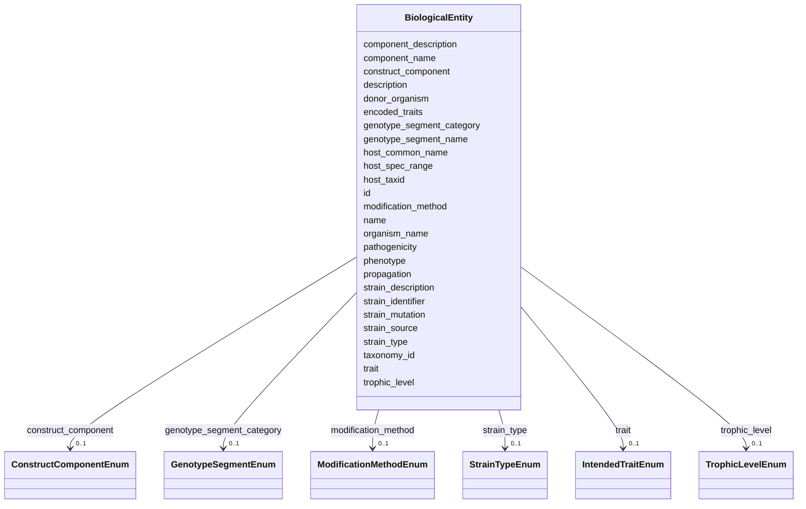

# Class: BiologicalEntity 


_Reference data representing a biological identity (strain, isolate,_

_engineered construct, etc.) that can be instantiated by multiple_

_physical samples._

__

_REPLACES: This class replaces the former Strain class, which was modeled_

_as a PurchasedMaterial subclass. That approach did not accommodate strains_

_engineered in-house or received from collaborators, nor did it cleanly_

_separate biological identity from physical samples. Additionally, the term_

_"strain" implies purity that cannot always be guaranteed; this class_

_represents the *intended* or *characterized* biological identity._

__

_Relationship to samples:_

_  - One biological_entity can have many AMP2UserSample instances_

_  - AMP2UserSample.biological_entity_ref points here_

_  - CultureGrowth activities reference via biological_entity_ref (aliased as strain_ref)_


URI: [analysis_api_schema:BiologicalEntity](https://w3id.org/MONet/analysis-api-schema/BiologicalEntity)





<!-- no inheritance hierarchy -->


## Slots

| Name | Cardinality and Range | Description | Inheritance |
| ---  | --- | --- | --- |
| [name](name.md) | 1 <br/> [String](String.md) | Human-readable name for the biological entity | direct |
| [description](description.md) | 0..1 <br/> [String](String.md) | Human-readable description for the entity or activity | direct |
| [strain_identifier](strain_identifier.md) | 1 <br/> [String](String.md) | Primary human-readable identifier for this biological entity | direct |
| [organism_name](organism_name.md) | 0..1 <br/> [String](String.md) | Scientific name of the organism (e | direct |
| [taxonomy_id](taxonomy_id.md) | 0..1 <br/> [String](String.md) | NCBI taxon ID for the organism | direct |
| [host_common_name](host_common_name.md) | 0..1 <br/> [String](String.md) | Common name for the host organism (e | direct |
| [host_taxid](host_taxid.md) | 0..1 <br/> [String](String.md) | NCBI taxon ID | direct |
| [strain_source](strain_source.md) | 0..1 <br/> [String](String.md) | Provenance of the biological entity | direct |
| [strain_type](strain_type.md) | 0..1 <br/> [StrainTypeEnum](StrainTypeEnum.md) | Type of strain/organism (bacterial, fungal, archaeal, etc | direct |
| [modification_method](modification_method.md) | 0..1 <br/> [ModificationMethodEnum](ModificationMethodEnum.md) | Method used to introduce genetic modification | direct |
| [strain_description](strain_description.md) | 0..1 <br/> [String](String.md) | A brief description of the modifications that comprise this strain | direct |
| [strain_mutation](strain_mutation.md) | 0..1 <br/> [String](String.md) | Primary genetic modification or plasmid carried (e | direct |
| [phenotype](phenotype.md) | 0..1 <br/> [String](String.md) | Provide the intedned phenotype of hte modified organism | direct |
| [trait](trait.md) | 0..1 <br/> [IntendedTraitEnum](IntendedTraitEnum.md) | Trait category for the biological entity | direct |
| [encoded_traits](encoded_traits.md) | 0..1 <br/> [String](String.md) | Should include key traits like antibiotic resistance or xenobiotic | direct |
| [genotype_segment_category](genotype_segment_category.md) | 0..1 <br/> [GenotypeSegmentEnum](GenotypeSegmentEnum.md) | Category of genetic modification or segment | direct |
| [genotype_segment_name](genotype_segment_name.md) | 0..1 <br/> [String](String.md) | Provide a name that describes the genotype modification engineered | direct |
| [component_name](component_name.md) | 0..1 <br/> [String](String.md) | Provide a one-to-three word name based on the component | direct |
| [construct_component](construct_component.md) | 0..1 <br/> [ConstructComponentEnum](ConstructComponentEnum.md) | Select the construct component type | direct |
| [donor_organism](donor_organism.md) | 0..1 <br/> [String](String.md) | Provide the scientific name (genus and species) of the organism from which th... | direct |
| [component_description](component_description.md) | 0..1 <br/> [String](String.md) | Provide a short statement describing the function of the construct | direct |
| [trophic_level](trophic_level.md) | 0..1 <br/> [TrophicLevelEnum](TrophicLevelEnum.md) | Trophic levels are the feeding position in a food chain | direct |
| [pathogenicity](pathogenicity.md) | 0..1 <br/> [String](String.md) | To what is the entity pathogenic, e | direct |
| [host_spec_range](host_spec_range.md) | 0..1 <br/> [String](String.md) | The range and diversity of host species that an organism is capable of infect... | direct |
| [propagation](propagation.md) | 0..1 <br/> [String](String.md) | The type of reproduction from the parent stock | direct |
| [id](id.md) | 1 <br/> uuid |  | direct |


## Usages

| used by | used in | type | used |
| ---  | --- | --- | --- |
| [CultureGrowth](CultureGrowth.md) | [biological_entity_ref](biological_entity_ref.md) | range | [BiologicalEntity](BiologicalEntity.md) |
| [StrainPurity](StrainPurity.md) | [biological_entity_ref](biological_entity_ref.md) | range | [BiologicalEntity](BiologicalEntity.md) |
| [StockCulturePreparation](StockCulturePreparation.md) | [biological_entity_ref](biological_entity_ref.md) | range | [BiologicalEntity](BiologicalEntity.md) |
| [PreCultureGrowth](PreCultureGrowth.md) | [biological_entity_ref](biological_entity_ref.md) | range | [BiologicalEntity](BiologicalEntity.md) |
| [ExperimentalCulture](ExperimentalCulture.md) | [biological_entity_ref](biological_entity_ref.md) | range | [BiologicalEntity](BiologicalEntity.md) |
| [AMP2UserSample](AMP2UserSample.md) | [biological_entity_ref](biological_entity_ref.md) | range | [BiologicalEntity](BiologicalEntity.md) |
| [EngineeredStrainSample](EngineeredStrainSample.md) | [biological_entity_ref](biological_entity_ref.md) | range | [BiologicalEntity](BiologicalEntity.md) |


## Identifier and Mapping Information


### Schema Source


* from schema: https://w3id.org/MONet/analysis-api-schema


## Mappings

| Mapping Type | Mapped Value |
| ---  | ---  |
| self | analysis_api_schema:BiologicalEntity |
| native | analysis_api_schema:BiologicalEntity |


## LinkML Source

<!-- TODO: investigate https://stackoverflow.com/questions/37606292/how-to-create-tabbed-code-blocks-in-mkdocs-or-sphinx -->

### Direct

<details>
```yaml
name: biological_entity
description: "Reference data representing a biological identity (strain, isolate,\n\
  engineered construct, etc.) that can be instantiated by multiple\nphysical samples.\n\
  \nREPLACES: This class replaces the former Strain class, which was modeled\nas a\
  \ PurchasedMaterial subclass. That approach did not accommodate strains\nengineered\
  \ in-house or received from collaborators, nor did it cleanly\nseparate biological\
  \ identity from physical samples. Additionally, the term\n\"strain\" implies purity\
  \ that cannot always be guaranteed; this class\nrepresents the *intended* or *characterized*\
  \ biological identity.\n\nRelationship to samples:\n  - One biological_entity can\
  \ have many AMP2UserSample instances\n  - AMP2UserSample.biological_entity_ref points\
  \ here\n  - CultureGrowth activities reference via biological_entity_ref (aliased\
  \ as strain_ref)"
from_schema: https://w3id.org/MONet/analysis-api-schema
rank: 1000
slots:
- name
- description
- strain_identifier
- organism_name
- taxonomy_id
- host_common_name
- host_taxid
- strain_source
- strain_type
- modification_method
- strain_description
- strain_mutation
- phenotype
- trait
- encoded_traits
- genotype_segment_category
- genotype_segment_name
- component_name
- construct_component
- donor_organism
- component_description
- trophic_level
- pathogenicity
- host_spec_range
- propagation
slot_usage:
  strain_identifier:
    name: strain_identifier
    description: 'Primary human-readable identifier for this biological entity.

      Examples: "KT2440_pTE314", "PP_0055", "AG5577-pJE2165"'
    required: true
  name:
    name: name
    description: 'Human-readable name for the biological entity.

      May be same as strain_identifier or more descriptive.'
  organism_name:
    name: organism_name
    description: Scientific name of the organism (e.g., "Pseudomonas putida").
  strain_source:
    name: strain_source
    description: 'Provenance of the biological entity. Can be an institution

      (e.g., "ATCC", "PNNL"), commercial source, or derivation note

      (e.g., "engineered from KT2440").'
  strain_mutation:
    name: strain_mutation
    description: 'Primary genetic modification or plasmid carried (e.g., "pTE314").

      For more detailed construct information, use the genotype_segment_*

      and component_* slots.'
  modification_method:
    name: modification_method
    description: 'Method used to introduce genetic modification.

      Examples: "Electroporation", "Conjugation", "CRISPR", "Transduction"'
  trophic_level:
    name: trophic_level
    required: false
attributes:
  id:
    name: id
    from_schema: https://w3id.org/MONet/analysis-api-schema/biological-entity
    identifier: true
    domain_of:
    - Activity
    - Entity
    - DataProduct
    - DataGenerationActivity
    - DataProcessingActivity
    - AlternativeIdentifier
    - FunctionalAnnotationIdentifier
    - Instrument
    - OntologyClass
    - ContainerType
    - Custodian
    - InstrumentAlternativeIdentifier
    - LabDevice
    - SampleProcessing
    - ProcessingSampleLink
    - Configuration
    - MobilePhaseSegment
    - MassSpectrometryStandardRun
    - PurchasedMaterial
    - LabProcessingActivity
    - MAOMProduct
    - WEOMProduct
    - Site
    - Sample
    - AerosolArmSample
    - AerosolSample
    - AMP2UserSample
    - CommerciallyPurchasedSample
    - CultureEnvironmentalSample
    - EngineeredStrainSample
    - FieldDeployedTerraformSample
    - MixedCultureSample
    - MonetSoilSample
    - OtherUndescribedSample
    - PlantSample
    - PureCultureSample
    - SedimentSample
    - SoilSample
    - SynthesizedMaterialSample
    - TerraformSample
    - WaterSample
    - ProcessedSample
    - CoreSection
    - SamplingActivity
    - AerosolArmSamplingActivity
    - AerosolSamplingActivity
    - CommerciallyPurchasedSamplingActivity
    - CultureEnvironmentalSamplingActivity
    - EngineeredStrainSamplingActivity
    - FieldDeployedTerraformSamplingActivity
    - MixedCultureSamplingActivity
    - MonetSoilSamplingActivity
    - OtherUndescribedSamplingActivity
    - PlantSamplingActivity
    - PureCultureSamplingActivity
    - SedimentSamplingActivity
    - SoilSamplingActivity
    - SynthesizedMaterialSamplingActivity
    - TerraformSamplingActivity
    - WaterSamplingActivity
    - biological_entity
    - Study
    - ProjectParticipant
    - TimestampValue
    - TextValue
    - SoftwareControlledTermValue
    - ControlledTermValue
    - PersonValue
    - QuantityValue
    - ConditioningValue
    - zipDownload
    range: uuid
    required: true

```
</details>

### Induced

<details>
```yaml
name: biological_entity
description: "Reference data representing a biological identity (strain, isolate,\n\
  engineered construct, etc.) that can be instantiated by multiple\nphysical samples.\n\
  \nREPLACES: This class replaces the former Strain class, which was modeled\nas a\
  \ PurchasedMaterial subclass. That approach did not accommodate strains\nengineered\
  \ in-house or received from collaborators, nor did it cleanly\nseparate biological\
  \ identity from physical samples. Additionally, the term\n\"strain\" implies purity\
  \ that cannot always be guaranteed; this class\nrepresents the *intended* or *characterized*\
  \ biological identity.\n\nRelationship to samples:\n  - One biological_entity can\
  \ have many AMP2UserSample instances\n  - AMP2UserSample.biological_entity_ref points\
  \ here\n  - CultureGrowth activities reference via biological_entity_ref (aliased\
  \ as strain_ref)"
from_schema: https://w3id.org/MONet/analysis-api-schema
rank: 1000
slot_usage:
  strain_identifier:
    name: strain_identifier
    description: 'Primary human-readable identifier for this biological entity.

      Examples: "KT2440_pTE314", "PP_0055", "AG5577-pJE2165"'
    required: true
  name:
    name: name
    description: 'Human-readable name for the biological entity.

      May be same as strain_identifier or more descriptive.'
  organism_name:
    name: organism_name
    description: Scientific name of the organism (e.g., "Pseudomonas putida").
  strain_source:
    name: strain_source
    description: 'Provenance of the biological entity. Can be an institution

      (e.g., "ATCC", "PNNL"), commercial source, or derivation note

      (e.g., "engineered from KT2440").'
  strain_mutation:
    name: strain_mutation
    description: 'Primary genetic modification or plasmid carried (e.g., "pTE314").

      For more detailed construct information, use the genotype_segment_*

      and component_* slots.'
  modification_method:
    name: modification_method
    description: 'Method used to introduce genetic modification.

      Examples: "Electroporation", "Conjugation", "CRISPR", "Transduction"'
  trophic_level:
    name: trophic_level
    required: false
attributes:
  id:
    name: id
    from_schema: https://w3id.org/MONet/analysis-api-schema/biological-entity
    identifier: true
    alias: id
    owner: biological_entity
    domain_of:
    - Activity
    - Entity
    - DataProduct
    - DataGenerationActivity
    - DataProcessingActivity
    - AlternativeIdentifier
    - FunctionalAnnotationIdentifier
    - Instrument
    - OntologyClass
    - ContainerType
    - Custodian
    - InstrumentAlternativeIdentifier
    - LabDevice
    - SampleProcessing
    - ProcessingSampleLink
    - Configuration
    - MobilePhaseSegment
    - MassSpectrometryStandardRun
    - PurchasedMaterial
    - LabProcessingActivity
    - MAOMProduct
    - WEOMProduct
    - Site
    - Sample
    - AerosolArmSample
    - AerosolSample
    - AMP2UserSample
    - CommerciallyPurchasedSample
    - CultureEnvironmentalSample
    - EngineeredStrainSample
    - FieldDeployedTerraformSample
    - MixedCultureSample
    - MonetSoilSample
    - OtherUndescribedSample
    - PlantSample
    - PureCultureSample
    - SedimentSample
    - SoilSample
    - SynthesizedMaterialSample
    - TerraformSample
    - WaterSample
    - ProcessedSample
    - CoreSection
    - SamplingActivity
    - AerosolArmSamplingActivity
    - AerosolSamplingActivity
    - CommerciallyPurchasedSamplingActivity
    - CultureEnvironmentalSamplingActivity
    - EngineeredStrainSamplingActivity
    - FieldDeployedTerraformSamplingActivity
    - MixedCultureSamplingActivity
    - MonetSoilSamplingActivity
    - OtherUndescribedSamplingActivity
    - PlantSamplingActivity
    - PureCultureSamplingActivity
    - SedimentSamplingActivity
    - SoilSamplingActivity
    - SynthesizedMaterialSamplingActivity
    - TerraformSamplingActivity
    - WaterSamplingActivity
    - biological_entity
    - Study
    - ProjectParticipant
    - TimestampValue
    - TextValue
    - SoftwareControlledTermValue
    - ControlledTermValue
    - PersonValue
    - QuantityValue
    - ConditioningValue
    - zipDownload
    range: uuid
    required: true
  name:
    name: name
    description: 'Human-readable name for the biological entity.

      May be same as strain_identifier or more descriptive.'
    from_schema: https://w3id.org/MONet/analysis-api-schema
    rank: 1000
    alias: name
    owner: biological_entity
    domain_of:
    - Activity
    - Entity
    - DataProduct
    - DataGenerationActivity
    - Instrument
    - OntologyClass
    - ContainerAxis
    - Configuration
    - MobilePhaseSegment
    - MassSpectrometryStandardRun
    - PurchasedMaterial
    - LabProcessingActivity
    - Site
    - Sample
    - SamplingActivity
    - SoilSamplingActivity
    - biological_entity
    - Study
    - SoftwareControlledTermValue
    range: string
    required: true
  description:
    name: description
    description: Human-readable description for the entity or activity
    title: description
    from_schema: https://w3id.org/MONet/analysis-api-schema
    rank: 1000
    alias: description
    owner: biological_entity
    domain_of:
    - Activity
    - Entity
    - DataProduct
    - DataGenerationActivity
    - DataProcessingActivity
    - OntologyClass
    - ContainerType
    - LabDevice
    - Configuration
    - MassSpectrometryStandardRun
    - PurchasedMaterial
    - LabProcessingActivity
    - Site
    - Sample
    - SamplingActivity
    - SoilSamplingActivity
    - biological_entity
    - Study
    - TimestampValue
    - TextValue
    - SoftwareControlledTermValue
    - ControlledTermValue
    - QuantityValue
    range: string
  strain_identifier:
    name: strain_identifier
    description: 'Primary human-readable identifier for this biological entity.

      Examples: "KT2440_pTE314", "PP_0055", "AG5577-pJE2165"'
    from_schema: https://w3id.org/MONet/analysis-api-schema
    aliases:
    - strain_id
    - strain_name
    rank: 1000
    alias: strain_identifier
    owner: biological_entity
    domain_of:
    - biological_entity
    range: string
    required: true
  organism_name:
    name: organism_name
    description: Scientific name of the organism (e.g., "Pseudomonas putida").
    title: organism name
    from_schema: https://w3id.org/MONet/analysis-api-schema
    aliases:
    - scientific_name
    - species_name
    rank: 1000
    alias: organism_name
    owner: biological_entity
    domain_of:
    - biological_entity
    range: string
  taxonomy_id:
    name: taxonomy_id
    description: NCBI taxon ID for the organism.
    from_schema: https://w3id.org/MONet/analysis-api-schema
    aliases:
    - ncbi_taxon_id
    - taxon_id
    rank: 1000
    alias: taxonomy_id
    owner: biological_entity
    domain_of:
    - biological_entity
    range: string
  host_common_name:
    name: host_common_name
    description: 'Common name for the host organism (e.g., "Pseudomonas putida").

      For microbes, this may be identical to organism_name.'
    title: host common name
    from_schema: https://w3id.org/MONet/analysis-api-schema
    aliases:
    - common_name
    rank: 1000
    alias: host_common_name
    owner: biological_entity
    domain_of:
    - CultureEnvironmentalSample
    - FieldDeployedTerraformSample
    - MixedCultureSample
    - OtherUndescribedSample
    - PureCultureSample
    - TerraformSample
    - biological_entity
    range: string
  host_taxid:
    name: host_taxid
    description: NCBI taxon ID. Format with prefix NCBITaxon:####
    title: host taxonomy identifier
    from_schema: https://w3id.org/MONet/analysis-api-schema
    aliases:
    - host_taxonomy_id
    - host_ncbi_taxon_id
    - host_taxa_id
    rank: 1000
    alias: host_taxid
    owner: biological_entity
    domain_of:
    - CultureEnvironmentalSample
    - FieldDeployedTerraformSample
    - MixedCultureSample
    - OtherUndescribedSample
    - PureCultureSample
    - TerraformSample
    - biological_entity
    range: string
    pattern: NCBITaxon:\d+
  strain_source:
    name: strain_source
    description: 'Provenance of the biological entity. Can be an institution

      (e.g., "ATCC", "PNNL"), commercial source, or derivation note

      (e.g., "engineered from KT2440").'
    title: strain source
    from_schema: https://w3id.org/MONet/analysis-api-schema
    aliases:
    - source_institution
    - strain_origin
    rank: 1000
    alias: strain_source
    owner: biological_entity
    domain_of:
    - biological_entity
    range: string
  strain_type:
    name: strain_type
    description: Type of strain/organism (bacterial, fungal, archaeal, etc.)
    from_schema: https://w3id.org/MONet/analysis-api-schema
    aliases:
    - organism_type
    rank: 1000
    alias: strain_type
    owner: biological_entity
    domain_of:
    - biological_entity
    range: StrainTypeEnum
  modification_method:
    name: modification_method
    description: 'Method used to introduce genetic modification.

      Examples: "Electroporation", "Conjugation", "CRISPR", "Transduction"'
    title: modification method
    from_schema: https://w3id.org/MONet/analysis-api-schema
    aliases:
    - genetic_modification_method
    - transformation_method
    rank: 1000
    alias: modification_method
    owner: biological_entity
    domain_of:
    - biological_entity
    range: ModificationMethodEnum
  strain_description:
    name: strain_description
    description: A brief description of the modifications that comprise this strain
    title: strain description
    from_schema: https://w3id.org/MONet/analysis-api-schema
    aliases:
    - strain_desc
    - strain_notes
    rank: 1000
    alias: strain_description
    owner: biological_entity
    domain_of:
    - biological_entity
    range: string
  strain_mutation:
    name: strain_mutation
    description: 'Primary genetic modification or plasmid carried (e.g., "pTE314").

      For more detailed construct information, use the genotype_segment_*

      and component_* slots.'
    from_schema: https://w3id.org/MONet/analysis-api-schema
    rank: 1000
    alias: strain_mutation
    owner: biological_entity
    domain_of:
    - biological_entity
    range: string
  phenotype:
    name: phenotype
    description: 'Provide the intedned phenotype of hte modified organism. Observable
      characteristics of the biological entity.

      Example: "aprimycin resistance, gene knockdown dCas12a construct"'
    title: phenotype
    from_schema: https://w3id.org/MONet/analysis-api-schema
    rank: 1000
    alias: phenotype
    owner: biological_entity
    domain_of:
    - biological_entity
    range: string
  trait:
    name: trait
    description: 'Trait category for the biological entity.

      Example: "Bacterial Resistance", "Other"'
    from_schema: https://w3id.org/MONet/analysis-api-schema
    rank: 1000
    alias: trait
    owner: biological_entity
    domain_of:
    - biological_entity
    range: IntendedTraitEnum
  encoded_traits:
    name: encoded_traits
    description: 'Should include key traits like antibiotic resistance or xenobiotic

      degradation phenotypes for plasmids, converting genes for phage'
    title: encoded traits
    from_schema: https://w3id.org/MONet/analysis-api-schema
    rank: 1000
    alias: encoded_traits
    owner: biological_entity
    domain_of:
    - CultureEnvironmentalSample
    - FieldDeployedTerraformSample
    - MixedCultureSample
    - OtherUndescribedSample
    - PureCultureSample
    - TerraformSample
    - biological_entity
    range: string
  genotype_segment_category:
    name: genotype_segment_category
    description: 'Category of genetic modification or segment.

      Examples: "Gene(s) of Interest", "Gene Silencer"'
    title: genotype segment category
    from_schema: https://w3id.org/MONet/analysis-api-schema
    rank: 1000
    alias: genotype_segment_category
    owner: biological_entity
    domain_of:
    - biological_entity
    range: GenotypeSegmentEnum
  genotype_segment_name:
    name: genotype_segment_name
    description: 'Provide a name that describes the genotype modification engineered

      relative to the reference unmodified genome. The name should describe the spatially

      grouped components or specific function of the modification.'
    title: genotype segment name
    from_schema: https://w3id.org/MONet/analysis-api-schema
    rank: 1000
    alias: genotype_segment_name
    owner: biological_entity
    domain_of:
    - biological_entity
    range: string
  component_name:
    name: component_name
    description: 'Provide a one-to-three word name based on the component. If using
      an

      acronym provide the full component name in the component description.'
    from_schema: https://w3id.org/MONet/analysis-api-schema
    rank: 1000
    alias: component_name
    owner: biological_entity
    domain_of:
    - biological_entity
    range: string
  construct_component:
    name: construct_component
    description: Select the construct component type.
    title: construct component
    from_schema: https://w3id.org/MONet/analysis-api-schema
    rank: 1000
    alias: construct_component
    owner: biological_entity
    domain_of:
    - biological_entity
    range: ConstructComponentEnum
  donor_organism:
    name: donor_organism
    description: "Provide the scientific name (genus and species) of the organism\
      \ from which the construct component was first described or obtained. \nYou\
      \ may enter 'synthetic' if relevant."
    title: donor organism
    from_schema: https://w3id.org/MONet/analysis-api-schema
    rank: 1000
    alias: donor_organism
    owner: biological_entity
    domain_of:
    - biological_entity
    range: string
  component_description:
    name: component_description
    description: 'Provide a short statement describing the function of the construct

      component. You may provide an optional literature reference for lesser-known
      components.

      Example: "d-Cfp1 to block gene expression", "recognition sequence for guide
      RNA processing"'
    from_schema: https://w3id.org/MONet/analysis-api-schema
    rank: 1000
    alias: component_description
    owner: biological_entity
    domain_of:
    - biological_entity
    range: string
  trophic_level:
    name: trophic_level
    description: 'Trophic levels are the feeding position in a food chain. Microbes
      can

      be a range of producers.'
    title: trophic level
    from_schema: https://w3id.org/MONet/analysis-api-schema
    rank: 1000
    alias: trophic_level
    owner: biological_entity
    domain_of:
    - CultureEnvironmentalSample
    - MixedCultureSample
    - OtherUndescribedSample
    - PureCultureSample
    - biological_entity
    range: TrophicLevelEnum
    required: false
  pathogenicity:
    name: pathogenicity
    description: To what is the entity pathogenic, e.g., humans, animals, plants,
      or specific tissues.
    title: pathogenicity
    from_schema: https://w3id.org/MONet/analysis-api-schema
    rank: 1000
    alias: pathogenicity
    owner: biological_entity
    domain_of:
    - CultureEnvironmentalSample
    - MixedCultureSample
    - OtherUndescribedSample
    - PureCultureSample
    - biological_entity
    range: string
  host_spec_range:
    name: host_spec_range
    description: The range and diversity of host species that an organism is capable
      of infecting, defined by NCBI taxonomy identifier. Format with prefix NCBITaxon:####
    title: host specificity or range
    from_schema: https://w3id.org/MONet/analysis-api-schema
    rank: 1000
    alias: host_spec_range
    owner: biological_entity
    domain_of:
    - CultureEnvironmentalSample
    - FieldDeployedTerraformSample
    - MixedCultureSample
    - OtherUndescribedSample
    - PureCultureSample
    - TerraformSample
    - biological_entity
    range: string
    pattern: NCBITaxon:\d+
  propagation:
    name: propagation
    description: 'The type of reproduction from the parent stock. Values for this
      field are specific to different taxa. For phage or virus: lytic/lysogenic/temperate/obligately
      lytic. For plasmids: incompatibility group. For eukaryotes: sexual/asexual'''
    title: propagation
    from_schema: https://w3id.org/MONet/analysis-api-schema
    rank: 1000
    alias: propagation
    owner: biological_entity
    domain_of:
    - CultureEnvironmentalSample
    - FieldDeployedTerraformSample
    - MixedCultureSample
    - OtherUndescribedSample
    - PureCultureSample
    - TerraformSample
    - biological_entity
    range: string

```
</details>