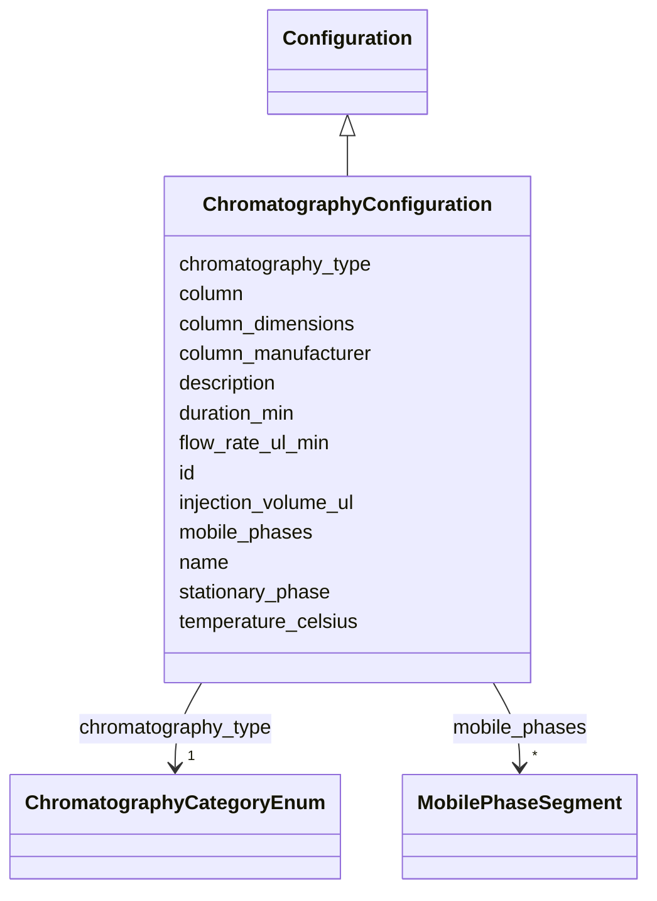

# Class: ChromatographyConfiguration 


_Configuration and settings for a chromatography run._


URI: [basalt_schema:ChromatographyConfiguration](https://w3id.org/MONet/basalt-schema/ChromatographyConfiguration)





## Inheritance
* [Configuration](Configuration.md)
    * **ChromatographyConfiguration**


## Slots

| Name | Cardinality and Range | Description | Inheritance |
| ---  | --- | --- | --- |
| [column](column.md) | 0..1 <br/> [String](String.md) | The name or identifier of the chromatography column used | direct |
| [column_dimensions](column_dimensions.md) | 0..1 <br/> [String](String.md) | Dimensions of the chromatography column used in the process | direct |
| [column_manufacturer](column_manufacturer.md) | 0..1 <br/> [String](String.md) | Name of the institution that manufactured the chromatography column | direct |
| [chromatography_type](chromatography_type.md) | 1 <br/> [ChromatographyCategoryEnum](ChromatographyCategoryEnum.md) | Type of chromatography used in the method (e | direct |
| [mobile_phases](mobile_phases.md) | * <br/> [MobilePhaseSegment](MobilePhaseSegment.md) | Description of the mobile phases used in the chromatography method (e | direct |
| [stationary_phase](stationary_phase.md) | 0..1 <br/> [String](String.md) | Description of the stationary phase used in the chromatography method (e | direct |
| [temperature_celsius](temperature_celsius.md) | 0..1 <br/> [Float](Float.md) | Temperature at which the method/process/activity was performed | direct |
| [duration_min](duration_min.md) | 0..1 <br/> [Float](Float.md) | how long something took, in minutes | direct |
| [flow_rate_ul_min](flow_rate_ul_min.md) | 0..1 <br/> [Float](Float.md) | Flow rate of the mobile phase, in microliters per minute | direct |
| [injection_volume_ul](injection_volume_ul.md) | 0..1 <br/> [Float](Float.md) |  | direct |
| [name](name.md) | 1 <br/> [String](String.md) | Human-readable name for the entity or activity | [Configuration](Configuration.md) |
| [description](description.md) | 0..1 <br/> [String](String.md) | Human-readable description for the entity or activity | [Configuration](Configuration.md) |
| [id](id.md) | 1 <br/> [Uuid](Uuid.md) |  | [Configuration](Configuration.md) |


## Usages

| used by | used in | type | used |
| ---  | --- | --- | --- |
| [MassSpectrometryDataGenerationActivity](MassSpectrometryDataGenerationActivity.md) | [uses_chromatography](uses_chromatography.md) | range | [ChromatographyConfiguration](ChromatographyConfiguration.md) |


## Identifier and Mapping Information


### Schema Source


* from schema: https://w3id.org/MONet/basalt-schema


## Mappings

| Mapping Type | Mapped Value |
| ---  | ---  |
| self | basalt_schema:ChromatographyConfiguration |
| native | basalt_schema:ChromatographyConfiguration |


## LinkML Source

<!-- TODO: investigate https://stackoverflow.com/questions/37606292/how-to-create-tabbed-code-blocks-in-mkdocs-or-sphinx -->

### Direct

<details>
```yaml
name: ChromatographyConfiguration
description: Configuration and settings for a chromatography run.
from_schema: https://w3id.org/MONet/basalt-schema
is_a: Configuration
slots:
- column
- column_dimensions
- column_manufacturer
- chromatography_type
- mobile_phases
- stationary_phase
- temperature_celsius
- duration_min
- flow_rate_ul_min
- injection_volume_ul

```
</details>

### Induced

<details>
```yaml
name: ChromatographyConfiguration
description: Configuration and settings for a chromatography run.
from_schema: https://w3id.org/MONet/basalt-schema
is_a: Configuration
attributes:
  column:
    name: column
    description: The name or identifier of the chromatography column used.
    from_schema: https://w3id.org/MONet/basalt-schema
    rank: 1000
    alias: column
    owner: ChromatographyConfiguration
    domain_of:
    - ChromatographyConfiguration
    - TOC_TN_Method
    range: string
  column_dimensions:
    name: column_dimensions
    description: Dimensions of the chromatography column used in the process.
    from_schema: https://w3id.org/MONet/basalt-schema
    rank: 1000
    alias: column_dimensions
    owner: ChromatographyConfiguration
    domain_of:
    - ChromatographyConfiguration
    range: string
  column_manufacturer:
    name: column_manufacturer
    description: Name of the institution that manufactured the chromatography column.
    from_schema: https://w3id.org/MONet/basalt-schema
    rank: 1000
    alias: column_manufacturer
    owner: ChromatographyConfiguration
    domain_of:
    - ChromatographyConfiguration
    range: string
  chromatography_type:
    name: chromatography_type
    description: Type of chromatography used in the method (e.g., GC, LC)
    from_schema: https://w3id.org/MONet/basalt-schema
    rank: 1000
    alias: chromatography_type
    owner: ChromatographyConfiguration
    domain_of:
    - ChromatographyConfiguration
    range: ChromatographyCategoryEnum
    required: true
  mobile_phases:
    name: mobile_phases
    description: Description of the mobile phases used in the chromatography method
      (e.g., solvents, gradients)
    from_schema: https://w3id.org/MONet/basalt-schema
    rank: 1000
    alias: mobile_phases
    owner: ChromatographyConfiguration
    domain_of:
    - ChromatographyConfiguration
    range: MobilePhaseSegment
    multivalued: true
  stationary_phase:
    name: stationary_phase
    description: Description of the stationary phase used in the chromatography method
      (e.g., column type)
    from_schema: https://w3id.org/MONet/basalt-schema
    rank: 1000
    alias: stationary_phase
    owner: ChromatographyConfiguration
    domain_of:
    - ChromatographyConfiguration
    range: string
  temperature_celsius:
    name: temperature_celsius
    description: Temperature at which the method/process/activity was performed
    from_schema: https://w3id.org/MONet/basalt-schema
    rank: 1000
    alias: temperature_celsius
    owner: ChromatographyConfiguration
    domain_of:
    - ChromatographyConfiguration
    - HasIncubationConditions
    range: float
  duration_min:
    name: duration_min
    description: how long something took, in minutes
    from_schema: https://w3id.org/MONet/basalt-schema
    rank: 1000
    alias: duration_min
    owner: ChromatographyConfiguration
    domain_of:
    - ChromatographyConfiguration
    - MobilePhaseSegment
    range: float
  flow_rate_ul_min:
    name: flow_rate_ul_min
    description: Flow rate of the mobile phase, in microliters per minute.
    title: flow rate (uL/min)
    from_schema: https://w3id.org/MONet/basalt-schema
    rank: 1000
    alias: flow_rate_ul_min
    owner: ChromatographyConfiguration
    domain_of:
    - ChromatographyConfiguration
    range: float
  injection_volume_ul:
    name: injection_volume_ul
    todos:
    - description - not sure what this is referencing
    from_schema: https://w3id.org/MONet/basalt-schema
    rank: 1000
    alias: injection_volume_ul
    owner: ChromatographyConfiguration
    domain_of:
    - ChromatographyConfiguration
    range: float
  name:
    name: name
    description: Human-readable name for the entity or activity.
    from_schema: https://w3id.org/MONet/basalt-schema
    rank: 1000
    alias: name
    owner: ChromatographyConfiguration
    domain_of:
    - Activity
    - Entity
    - DataProduct
    - DataGenerationActivity
    - Instrument
    - OntologyClass
    - ContainerAxis
    - Configuration
    - MobilePhaseSegment
    - MassSpectrometryStandardRun
    - PurchasedMaterial
    - LabProcessingActivity
    - organism
    - Site
    - Sample
    - SamplingActivity
    - SoilSamplingActivity
    - Study
    - SoftwareControlledTermValue
    range: string
    required: true
  description:
    name: description
    description: Human-readable description for the entity or activity
    title: description
    from_schema: https://w3id.org/MONet/basalt-schema
    rank: 1000
    alias: description
    owner: ChromatographyConfiguration
    domain_of:
    - Activity
    - Entity
    - DataProduct
    - DataGenerationActivity
    - DataProcessingActivity
    - OntologyClass
    - ContainerType
    - LabDevice
    - Configuration
    - MassSpectrometryStandardRun
    - PurchasedMaterial
    - LabProcessingActivity
    - organism
    - Site
    - Sample
    - SamplingActivity
    - SoilSamplingActivity
    - Study
    - TimestampValue
    - TextValue
    - SoftwareControlledTermValue
    - ControlledTermValue
    - QuantityValue
    range: string
  id:
    name: id
    from_schema: https://w3id.org/MONet/basalt-schema/mass-spec
    alias: id
    owner: ChromatographyConfiguration
    domain_of:
    - Activity
    - Entity
    - DataProduct
    - DataGenerationActivity
    - DataProcessingActivity
    - AlternativeIdentifier
    - FunctionalAnnotationIdentifier
    - Instrument
    - OntologyClass
    - ContainerType
    - Custodian
    - InstrumentAlternativeIdentifier
    - LabDevice
    - SampleProcessing
    - ProcessingSampleLink
    - Configuration
    - MobilePhaseSegment
    - MassSpectrometryStandardRun
    - PurchasedMaterial
    - LabProcessingActivity
    - organism
    - MAOMProduct
    - WEOMProduct
    - Site
    - Sample
    - AerosolArmSample
    - AerosolSample
    - AMP2UserSample
    - CommerciallyPurchasedSample
    - CultureEnvironmentalSample
    - EngineeredStrainSample
    - FieldDeployedTerraformSample
    - MixedCultureSample
    - MonetSoilSample
    - OtherUndescribedSample
    - PlantSample
    - PureCultureSample
    - SedimentSample
    - SoilSample
    - SynthesizedMaterialSample
    - TerraformSample
    - WaterSample
    - ProcessedSample
    - CoreSection
    - SamplingActivity
    - AerosolArmSamplingActivity
    - AerosolSamplingActivity
    - CommerciallyPurchasedSamplingActivity
    - CultureEnvironmentalSamplingActivity
    - EngineeredStrainSamplingActivity
    - FieldDeployedTerraformSamplingActivity
    - MixedCultureSamplingActivity
    - MonetSoilSamplingActivity
    - OtherUndescribedSamplingActivity
    - PlantSamplingActivity
    - PureCultureSamplingActivity
    - SedimentSamplingActivity
    - SoilSamplingActivity
    - SynthesizedMaterialSamplingActivity
    - TerraformSamplingActivity
    - WaterSamplingActivity
    - Study
    - ProjectParticipant
    - TimestampValue
    - TextValue
    - SoftwareControlledTermValue
    - ControlledTermValue
    - PersonValue
    - QuantityValue
    - ConditioningValue
    - zipDownload
    range: uuid
    required: true

```
</details>