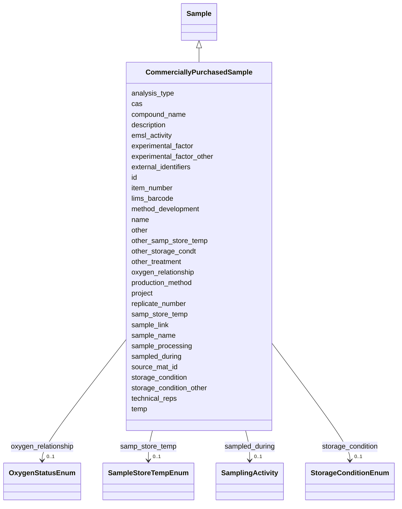

# Class: CommerciallyPurchasedSample 


_A sample containing commercially purchased material._


URI: [basalt_schema:CommerciallyPurchasedSample](https://EMSL-Computing.github.io/BASALT-Schema/CommerciallyPurchasedSample)





## Inheritance
* [Sample](Sample.md)
    * **CommerciallyPurchasedSample**


## Slots

| Name | Cardinality and Range | Description | Inheritance |
| ---  | --- | --- | --- |
| [analysis_type](analysis_type.md) | 1 <br/> [String](String.md) | The type(s) of analysis planned for this sample | direct |
| [cas](cas.md) | 0..1 <br/> [String](String.md) | A unique numerical identifier assigned by the Chemical Abstract Service (CAS)... | direct |
| [compound_name](compound_name.md) | 1 <br/> [String](String.md) | The name of the purchased material | direct |
| [experimental_factor](experimental_factor.md) | 0..1 <br/> [String](String.md) | Experimental factors are essentially the variable aspects of an experiment de... | direct |
| [experimental_factor_other](experimental_factor_other.md) | 0..1 <br/> [String](String.md) | Other details about your sample that you feel can't be accurately represented... | direct |
| [external_identifiers](external_identifiers.md) | * <br/> [Uriorcurie](Uriorcurie.md) | List of external identifiers associated with this entity or activity | direct |
| [item_number](item_number.md) | 0..1 <br/> [String](String.md) | The item number of the purchased material | direct |
| [method_development](method_development.md) | 0..1 <br/> [String](String.md) | If your samples are TEST sample ONLY, please provide information on what you'... | direct |
| [other](other.md) | 0..1 <br/> [String](String.md) | Other/additional details about your sample that you feel can't be accurately ... | direct |
| [other_samp_store_temp](other_samp_store_temp.md) | 0..1 <br/> [String](String.md) | Please specify sample storage temperature if you selected 'other' | direct |
| [other_storage_condt](other_storage_condt.md) | 0..1 <br/> [String](String.md) | Please specify your storage conditions if you selected 'other' and the availa... | direct |
| [other_treatment](other_treatment.md) | 0..1 <br/> [String](String.md) | Many sample treatment descriptor columns are available | direct |
| [oxygen_relationship](oxygen_relationship.md) | 0..1 <br/> [OxygenStatusEnum](OxygenStatusEnum.md) | The relationship of the sample to oxygen, such as aerobic or anaerobic | direct |
| [production_method](production_method.md) | 0..1 <br/> [String](String.md) | A DOI or description of how the compound was produced, if the commercially pu... | direct |
| [project](project.md) | 0..1 <br/> [Integer](Integer.md) | Identifier for the user project associated with the entity or activity | direct |
| [replicate_number](replicate_number.md) | 0..1 <br/> [Integer](Integer.md) | The replicate number of the sample, if applicable | direct |
| [sample_link](sample_link.md) | 0..1 <br/> [String](String.md) | 'A unique identifier to assign parent-child subsample or sibling samples | direct |
| [sample_name](sample_name.md) | 0..1 <br/> [String](String.md) | The name or label that is present on the shipped sample | direct |
| [sample_processing](sample_processing.md) | 0..1 <br/> [String](String.md) | A brief description of any processing applied to the sample during or after r... | direct |
| [samp_store_temp](samp_store_temp.md) | 0..1 <br/> [SampleStoreTempEnum](SampleStoreTempEnum.md) | The temperature at which your samples should be stored upon arrival | direct |
| [sampled_during](sampled_during.md) | 0..1 <br/> [SamplingActivity](SamplingActivity.md) | Reference to the sampling activity during which this sample was collected | direct |
| [source_mat_id](source_mat_id.md) | 0..1 <br/> [String](String.md) | A unique identifier assigned to an original material sample collected or to a... | direct |
| [storage_condition](storage_condition.md) | 0..1 <br/> [StorageConditionEnum](StorageConditionEnum.md) | The storage condition of the sample | direct |
| [storage_condition_other](storage_condition_other.md) | 0..1 <br/> [String](String.md) | Free-text field for storage conditions when 'storage_condition' is 'other' | direct |
| [technical_reps](technical_reps.md) | 0..1 <br/> [Integer](Integer.md) | Number of technical replicates for the sample | direct |
| [temp](temp.md) | 0..1 <br/> [String](String.md) | Temperature of the sample at the time of sampling | direct |
| [id](id.md) | 1 <br/> [Uuid](Uuid.md) |  | direct |
| [name](name.md) | 1 <br/> [String](String.md) | Human-readable name for the entity or activity | [Sample](Sample.md) |
| [description](description.md) | 0..1 <br/> [String](String.md) | Human-readable description for the entity or activity | [Sample](Sample.md) |
| [emsl_activity](emsl_activity.md) | 0..1 <br/> [String](String.md) | Nullable string linking a Sample or SamplingActivity to a named EMSL activity... | [Sample](Sample.md) |
| [lims_barcode](lims_barcode.md) | 0..1 <br/> [String](String.md) | LIMS barcode identifier | [Sample](Sample.md) |


## Identifier and Mapping Information


### Schema Source


* from schema: https://EMSL-Computing.github.io/BASALT-Schema


## Mappings

| Mapping Type | Mapped Value |
| ---  | ---  |
| self | basalt_schema:CommerciallyPurchasedSample |
| native | basalt_schema:CommerciallyPurchasedSample |


## LinkML Source

<!-- TODO: investigate https://stackoverflow.com/questions/37606292/how-to-create-tabbed-code-blocks-in-mkdocs-or-sphinx -->

### Direct

<details>
```yaml
name: CommerciallyPurchasedSample
description: A sample containing commercially purchased material.
from_schema: https://EMSL-Computing.github.io/BASALT-Schema
is_a: Sample
slots:
- analysis_type
- cas
- compound_name
- experimental_factor
- experimental_factor_other
- external_identifiers
- item_number
- method_development
- other
- other_samp_store_temp
- other_storage_condt
- other_treatment
- oxygen_relationship
- production_method
- project
- replicate_number
- sample_link
- sample_name
- sample_processing
- samp_store_temp
- sampled_during
- source_mat_id
- storage_condition
- storage_condition_other
- technical_reps
- temp
slot_usage:
  analysis_type:
    name: analysis_type
    required: true
  compound_name:
    name: compound_name
    required: true
attributes:
  id:
    name: id
    from_schema: https://EMSL-Computing.github.io/BASALT-Schema/sample-classes
    identifier: true
    domain_of:
    - Activity
    - Entity
    - DataProduct
    - DataGenerationActivity
    - DataProcessingActivity
    - AlternativeIdentifier
    - FunctionalAnnotationIdentifier
    - Instrument
    - OntologyClass
    - ContainerType
    - Custodian
    - InstrumentAlternativeIdentifier
    - LabDevice
    - SampleProcessing
    - ProcessingSampleLink
    - Configuration
    - MobilePhaseSegment
    - MassSpectrometryStandardRun
    - PurchasedMaterial
    - LabProcessingActivity
    - organism
    - MAOMProduct
    - WEOMProduct
    - Site
    - Sample
    - AerosolArmSample
    - AerosolSample
    - AMP2UserSample
    - CommerciallyPurchasedSample
    - CultureEnvironmentalSample
    - EngineeredStrainSample
    - FieldDeployedTerraformSample
    - MixedCultureSample
    - MonetSoilSample
    - OtherUndescribedSample
    - PlantSample
    - PureCultureSample
    - SedimentSample
    - SoilSample
    - SynthesizedMaterialSample
    - TerraformSample
    - WaterSample
    - ProcessedSample
    - CoreSection
    - SamplingActivity
    - AerosolArmSamplingActivity
    - AerosolSamplingActivity
    - CommerciallyPurchasedSamplingActivity
    - CultureEnvironmentalSamplingActivity
    - EngineeredStrainSamplingActivity
    - FieldDeployedTerraformSamplingActivity
    - MixedCultureSamplingActivity
    - MonetSoilSamplingActivity
    - OtherUndescribedSamplingActivity
    - PlantSamplingActivity
    - PureCultureSamplingActivity
    - SedimentSamplingActivity
    - SoilSamplingActivity
    - SynthesizedMaterialSamplingActivity
    - TerraformSamplingActivity
    - WaterSamplingActivity
    - Study
    - ProjectParticipant
    - TimestampValue
    - TextValue
    - SoftwareControlledTermValue
    - ControlledTermValue
    - PersonValue
    - QuantityValue
    - ConditioningValue
    - zipDownload
    range: uuid
    required: true

```
</details>

### Induced

<details>
```yaml
name: CommerciallyPurchasedSample
description: A sample containing commercially purchased material.
from_schema: https://EMSL-Computing.github.io/BASALT-Schema
is_a: Sample
slot_usage:
  analysis_type:
    name: analysis_type
    required: true
  compound_name:
    name: compound_name
    required: true
attributes:
  id:
    name: id
    from_schema: https://EMSL-Computing.github.io/BASALT-Schema/sample-classes
    identifier: true
    alias: id
    owner: CommerciallyPurchasedSample
    domain_of:
    - Activity
    - Entity
    - DataProduct
    - DataGenerationActivity
    - DataProcessingActivity
    - AlternativeIdentifier
    - FunctionalAnnotationIdentifier
    - Instrument
    - OntologyClass
    - ContainerType
    - Custodian
    - InstrumentAlternativeIdentifier
    - LabDevice
    - SampleProcessing
    - ProcessingSampleLink
    - Configuration
    - MobilePhaseSegment
    - MassSpectrometryStandardRun
    - PurchasedMaterial
    - LabProcessingActivity
    - organism
    - MAOMProduct
    - WEOMProduct
    - Site
    - Sample
    - AerosolArmSample
    - AerosolSample
    - AMP2UserSample
    - CommerciallyPurchasedSample
    - CultureEnvironmentalSample
    - EngineeredStrainSample
    - FieldDeployedTerraformSample
    - MixedCultureSample
    - MonetSoilSample
    - OtherUndescribedSample
    - PlantSample
    - PureCultureSample
    - SedimentSample
    - SoilSample
    - SynthesizedMaterialSample
    - TerraformSample
    - WaterSample
    - ProcessedSample
    - CoreSection
    - SamplingActivity
    - AerosolArmSamplingActivity
    - AerosolSamplingActivity
    - CommerciallyPurchasedSamplingActivity
    - CultureEnvironmentalSamplingActivity
    - EngineeredStrainSamplingActivity
    - FieldDeployedTerraformSamplingActivity
    - MixedCultureSamplingActivity
    - MonetSoilSamplingActivity
    - OtherUndescribedSamplingActivity
    - PlantSamplingActivity
    - PureCultureSamplingActivity
    - SedimentSamplingActivity
    - SoilSamplingActivity
    - SynthesizedMaterialSamplingActivity
    - TerraformSamplingActivity
    - WaterSamplingActivity
    - Study
    - ProjectParticipant
    - TimestampValue
    - TextValue
    - SoftwareControlledTermValue
    - ControlledTermValue
    - PersonValue
    - QuantityValue
    - ConditioningValue
    - zipDownload
    range: uuid
    required: true
  analysis_type:
    name: analysis_type
    description: The type(s) of analysis planned for this sample.
    from_schema: https://EMSL-Computing.github.io/BASALT-Schema
    rank: 1000
    alias: analysis_type
    owner: CommerciallyPurchasedSample
    domain_of:
    - SampleProcessing
    - AerosolArmSample
    - AerosolSample
    - AMP2UserSample
    - CommerciallyPurchasedSample
    - CultureEnvironmentalSample
    - FieldDeployedTerraformSample
    - MixedCultureSample
    - OtherUndescribedSample
    - PlantSample
    - PureCultureSample
    - SedimentSample
    - SoilSample
    - SynthesizedMaterialSample
    - TerraformSample
    - WaterSample
    range: string
    required: true
  cas:
    name: cas
    description: A unique numerical identifier assigned by the Chemical Abstract Service
      (CAS), a division of the American Chemical Society, to chemical compounds, polymers,
      biological sequences, mixtures, and alloys.
    title: CAS number
    from_schema: https://EMSL-Computing.github.io/BASALT-Schema
    aliases:
    - CAS
    rank: 1000
    alias: cas
    owner: CommerciallyPurchasedSample
    domain_of:
    - CommerciallyPurchasedSample
    - OtherUndescribedSample
    - SynthesizedMaterialSample
    range: string
  compound_name:
    name: compound_name
    description: The name of the purchased material. A substance formed by chemical
      union of two or more elements or ingredients in definite proportion by weight.
    title: compound name
    from_schema: https://EMSL-Computing.github.io/BASALT-Schema
    rank: 1000
    alias: compound_name
    owner: CommerciallyPurchasedSample
    domain_of:
    - CommerciallyPurchasedSample
    - OtherUndescribedSample
    - SynthesizedMaterialSample
    range: string
    required: true
  experimental_factor:
    name: experimental_factor
    description: Experimental factors are essentially the variable aspects of an experiment
      design which can be used to describe an experiment or set of experiments in
      an increasingly detailed manner. This field accepts ontology terms from Experimental
      Factor Ontology (EFO) and/or Ontology for Biomedical Investigations (OBI). For
      a browser of EFO (v 2.95) terms please see http://purl.bioontology.org/ontology/EFO;
      for a browser of OBI (v 2018-02-12) terms please see http://purl.bioontology.org/ontology/OBI
    title: experimental factor
    from_schema: https://EMSL-Computing.github.io/BASALT-Schema
    rank: 1000
    alias: experimental_factor
    owner: CommerciallyPurchasedSample
    domain_of:
    - AerosolArmSample
    - AerosolSample
    - CommerciallyPurchasedSample
    - CultureEnvironmentalSample
    - MixedCultureSample
    - OtherUndescribedSample
    - PlantSample
    - PureCultureSample
    - SedimentSample
    - SoilSample
    - SynthesizedMaterialSample
    - WaterSample
    range: string
  experimental_factor_other:
    name: experimental_factor_other
    description: Other details about your sample that you feel can't be accurately
      represented in the available columns.
    title: other experimental factor
    from_schema: https://EMSL-Computing.github.io/BASALT-Schema
    rank: 1000
    alias: experimental_factor_other
    owner: CommerciallyPurchasedSample
    domain_of:
    - AerosolArmSample
    - AerosolSample
    - CommerciallyPurchasedSample
    - CultureEnvironmentalSample
    - MixedCultureSample
    - OtherUndescribedSample
    - PlantSample
    - PureCultureSample
    - SedimentSample
    - SoilSample
    - SynthesizedMaterialSample
    - WaterSample
    range: string
  external_identifiers:
    name: external_identifiers
    description: List of external identifiers associated with this entity or activity.
    from_schema: https://EMSL-Computing.github.io/BASALT-Schema
    rank: 1000
    alias: external_identifiers
    owner: CommerciallyPurchasedSample
    domain_of:
    - NucleotideSequencing
    - AerosolArmSample
    - AerosolSample
    - CommerciallyPurchasedSample
    - CultureEnvironmentalSample
    - EngineeredStrainSample
    - FieldDeployedTerraformSample
    - MixedCultureSample
    - MonetSoilSample
    - OtherUndescribedSample
    - PlantSample
    - PureCultureSample
    - SedimentSample
    - SoilSample
    - SynthesizedMaterialSample
    - TerraformSample
    - WaterSample
    - Study
    range: uriorcurie
    multivalued: true
  item_number:
    name: item_number
    description: The item number of the purchased material
    title: item number
    from_schema: https://EMSL-Computing.github.io/BASALT-Schema
    rank: 1000
    alias: item_number
    owner: CommerciallyPurchasedSample
    domain_of:
    - CommerciallyPurchasedSample
    - OtherUndescribedSample
    - SynthesizedMaterialSample
    range: string
  method_development:
    name: method_development
    description: If your samples are TEST sample ONLY, please provide information
      on what you're hoping this test will resolve.
    title: method development
    from_schema: https://EMSL-Computing.github.io/BASALT-Schema
    rank: 1000
    alias: method_development
    owner: CommerciallyPurchasedSample
    domain_of:
    - AerosolArmSample
    - AerosolSample
    - CommerciallyPurchasedSample
    - CultureEnvironmentalSample
    - FieldDeployedTerraformSample
    - MixedCultureSample
    - OtherUndescribedSample
    - PlantSample
    - PureCultureSample
    - SedimentSample
    - SoilSample
    - TerraformSample
    - WaterSample
    range: string
  other:
    name: other
    description: Other/additional details about your sample that you feel can't be
      accurately represented in ANY of the available columns.
    title: other
    from_schema: https://EMSL-Computing.github.io/BASALT-Schema
    rank: 1000
    alias: other
    owner: CommerciallyPurchasedSample
    domain_of:
    - AerosolArmSample
    - AerosolSample
    - CommerciallyPurchasedSample
    - CultureEnvironmentalSample
    - FieldDeployedTerraformSample
    - MixedCultureSample
    - MonetSoilSample
    - OtherUndescribedSample
    - PlantSample
    - PureCultureSample
    - SedimentSample
    - SoilSample
    - SynthesizedMaterialSample
    - TerraformSample
    - WaterSample
    range: string
  other_samp_store_temp:
    name: other_samp_store_temp
    description: Please specify sample storage temperature if you selected 'other'
    title: other sample storage temperature
    from_schema: https://EMSL-Computing.github.io/BASALT-Schema
    rank: 1000
    alias: other_samp_store_temp
    owner: CommerciallyPurchasedSample
    domain_of:
    - AerosolArmSample
    - AerosolSample
    - CommerciallyPurchasedSample
    - CultureEnvironmentalSample
    - FieldDeployedTerraformSample
    - MixedCultureSample
    - MonetSoilSample
    - OtherUndescribedSample
    - PlantSample
    - PureCultureSample
    - SedimentSample
    - SoilSample
    - SynthesizedMaterialSample
    - TerraformSample
    - WaterSample
    range: string
  other_storage_condt:
    name: other_storage_condt
    description: Please specify your storage conditions if you selected 'other' and
      the available values are not appropriate
    title: other storage condition
    from_schema: https://EMSL-Computing.github.io/BASALT-Schema
    rank: 1000
    alias: other_storage_condt
    owner: CommerciallyPurchasedSample
    domain_of:
    - AerosolSample
    - CommerciallyPurchasedSample
    - CultureEnvironmentalSample
    - FieldDeployedTerraformSample
    - MixedCultureSample
    - MonetSoilSample
    - PlantSample
    - PureCultureSample
    - SedimentSample
    - SoilSample
    - SynthesizedMaterialSample
    - TerraformSample
    - WaterSample
    range: string
  other_treatment:
    name: other_treatment
    description: Many sample treatment descriptor columns are available. If a treatment
      is applied to your samples and the provided treatment terms do not satisfy please
      add it here. Multiple treatments can be entered here separated by ;
    title: other treatment
    from_schema: https://EMSL-Computing.github.io/BASALT-Schema
    rank: 1000
    alias: other_treatment
    owner: CommerciallyPurchasedSample
    domain_of:
    - AerosolArmSample
    - AerosolSample
    - CommerciallyPurchasedSample
    - CultureEnvironmentalSample
    - FieldDeployedTerraformSample
    - MixedCultureSample
    - MonetSoilSample
    - OtherUndescribedSample
    - PlantSample
    - PureCultureSample
    - SedimentSample
    - SoilSample
    - TerraformSample
    - WaterSample
    range: string
  oxygen_relationship:
    name: oxygen_relationship
    description: The relationship of the sample to oxygen, such as aerobic or anaerobic.
    title: oxygen relationship
    from_schema: https://EMSL-Computing.github.io/BASALT-Schema
    exact_mappings:
    - MIXS:0000015
    rank: 1000
    alias: oxygen_status
    owner: CommerciallyPurchasedSample
    domain_of:
    - HasIncubationConditions
    - CommerciallyPurchasedSample
    - CultureEnvironmentalSample
    - FieldDeployedTerraformSample
    - MixedCultureSample
    - OtherUndescribedSample
    - PureCultureSample
    - SedimentSample
    - SoilSample
    - SynthesizedMaterialSample
    - TerraformSample
    - WaterSample
    range: OxygenStatusEnum
  production_method:
    name: production_method
    description: A DOI or description of how the compound was produced, if the commercially
      purchased material was altered
    title: production method
    from_schema: https://EMSL-Computing.github.io/BASALT-Schema
    rank: 1000
    alias: production_method
    owner: CommerciallyPurchasedSample
    domain_of:
    - CommerciallyPurchasedSample
    - OtherUndescribedSample
    - SynthesizedMaterialSample
    range: string
  project:
    name: project
    description: 'Identifier for the user project associated with the entity or activity. '
    title: Project
    todos:
    - should this be an ID? CURIE can use the one NMDC has https://bioregistry.io/reference/emsl.project:60141
      where emsl.project is the CURIE prefix
    from_schema: https://EMSL-Computing.github.io/BASALT-Schema
    aliases:
    - study
    - study_id
    - project_id
    - proposal
    - proposal_id
    rank: 1000
    alias: project
    owner: CommerciallyPurchasedSample
    domain_of:
    - DataProduct
    - AerosolArmSample
    - AerosolSample
    - CommerciallyPurchasedSample
    - CultureEnvironmentalSample
    - FieldDeployedTerraformSample
    - MixedCultureSample
    - MonetSoilSample
    - OtherUndescribedSample
    - PlantSample
    - PureCultureSample
    - SedimentSample
    - SoilSample
    - SynthesizedMaterialSample
    - TerraformSample
    - WaterSample
    - SamplingActivity
    range: integer
  replicate_number:
    name: replicate_number
    description: The replicate number of the sample, if applicable. Included for compatibility
      with submission schema.
    todos:
    - reconcile replicate modelling
    from_schema: https://EMSL-Computing.github.io/BASALT-Schema
    rank: 1000
    alias: replicate_number
    owner: CommerciallyPurchasedSample
    domain_of:
    - AerosolArmSample
    - AerosolSample
    - CommerciallyPurchasedSample
    - CultureEnvironmentalSample
    - FieldDeployedTerraformSample
    - MixedCultureSample
    - OtherUndescribedSample
    - PlantSample
    - PureCultureSample
    - SedimentSample
    - SoilSample
    - SynthesizedMaterialSample
    - TerraformSample
    - WaterSample
    range: integer
  sample_link:
    name: sample_link
    description: '''A unique identifier to assign parent-child subsample or sibling
      samples. This is relevant when a sample or other material was used to generate
      the new sample. This field allows multiple entries separated by ; (Examples:
      Soil collected from the field will link with the soil used in an incubation.
      The soil a plant was grown in links to the plant sample. An original culture
      sample was transferred to a new vial and generated a new sample)'''
    todos:
    - EMSL and NMDC both need better modelling for this
    from_schema: https://EMSL-Computing.github.io/BASALT-Schema
    rank: 1000
    alias: sample_link
    owner: CommerciallyPurchasedSample
    domain_of:
    - AerosolArmSample
    - AerosolSample
    - CommerciallyPurchasedSample
    - CultureEnvironmentalSample
    - FieldDeployedTerraformSample
    - MixedCultureSample
    - OtherUndescribedSample
    - PlantSample
    - PureCultureSample
    - SedimentSample
    - SoilSample
    - SynthesizedMaterialSample
    - TerraformSample
    - WaterSample
    range: string
  sample_name:
    name: sample_name
    description: 'The name or label that is present on the shipped sample. This should

      be a human readable name.'
    title: sample name
    notes:
    - This is typically an alias for the inherited 'name' slot on Sample classes.
      Defined separately for compatibility with source data files using 'sample_name'
      column headers.
    from_schema: https://EMSL-Computing.github.io/BASALT-Schema
    aliases:
    - samp_name
    rank: 1000
    alias: sample_name
    owner: CommerciallyPurchasedSample
    domain_of:
    - DataProduct
    - AerosolArmSample
    - AerosolSample
    - CommerciallyPurchasedSample
    - CultureEnvironmentalSample
    - FieldDeployedTerraformSample
    - MixedCultureSample
    - MonetSoilSample
    - OtherUndescribedSample
    - PlantSample
    - PureCultureSample
    - SedimentSample
    - SoilSample
    - SynthesizedMaterialSample
    - TerraformSample
    - WaterSample
    range: string
  sample_processing:
    name: sample_processing
    description: A brief description of any processing applied to the sample during
      or after retrieving the sample from environment or a link to the relevant protocol(s)
      performed.
    title: sample processing
    from_schema: https://EMSL-Computing.github.io/BASALT-Schema
    rank: 1000
    alias: sample_processing
    owner: CommerciallyPurchasedSample
    domain_of:
    - AerosolArmSample
    - AerosolSample
    - CommerciallyPurchasedSample
    - CultureEnvironmentalSample
    - FieldDeployedTerraformSample
    - MixedCultureSample
    - OtherUndescribedSample
    - PlantSample
    - PureCultureSample
    - SedimentSample
    - SoilSample
    - SynthesizedMaterialSample
    - TerraformSample
    range: string
  samp_store_temp:
    name: samp_store_temp
    description: The temperature at which your samples should be stored upon arrival.
      This field is NOT multivalued. If selecting other add the `other_samp_store_temp`
      attribute to provide additional detail.
    title: sample storage temperature
    from_schema: https://EMSL-Computing.github.io/BASALT-Schema
    aliases:
    - sample_storage_temperature
    - storage_temperature
    rank: 1000
    alias: samp_store_temp
    owner: CommerciallyPurchasedSample
    domain_of:
    - AerosolArmSample
    - AerosolSample
    - CommerciallyPurchasedSample
    - CultureEnvironmentalSample
    - FieldDeployedTerraformSample
    - MixedCultureSample
    - MonetSoilSample
    - OtherUndescribedSample
    - PlantSample
    - PureCultureSample
    - SedimentSample
    - SoilSample
    - SynthesizedMaterialSample
    - TerraformSample
    - WaterSample
    range: SampleStoreTempEnum
  sampled_during:
    name: sampled_during
    description: Reference to the sampling activity during which this sample was collected.
      This is a FK to the SamplingActivity class, which contains metadata about the
      sampling event, such as date, device, method.
    from_schema: https://EMSL-Computing.github.io/BASALT-Schema
    rank: 1000
    alias: sampled_during
    owner: CommerciallyPurchasedSample
    domain_of:
    - AerosolArmSample
    - AerosolSample
    - CommerciallyPurchasedSample
    - CultureEnvironmentalSample
    - FieldDeployedTerraformSample
    - MixedCultureSample
    - MonetSoilSample
    - OtherUndescribedSample
    - PlantSample
    - PureCultureSample
    - SedimentSample
    - SoilSample
    - SynthesizedMaterialSample
    - TerraformSample
    - WaterSample
    - ProcessedSample
    range: SamplingActivity
  source_mat_id:
    name: source_mat_id
    description: A unique identifier assigned to an original material sample collected
      or to any derived sub-samples. The source material should be listed as a sample
      to inform details about parent material relationship.
    title: source material identifier
    from_schema: https://EMSL-Computing.github.io/BASALT-Schema
    rank: 1000
    alias: source_mat_id
    owner: CommerciallyPurchasedSample
    domain_of:
    - AerosolArmSample
    - AerosolSample
    - CommerciallyPurchasedSample
    - CultureEnvironmentalSample
    - FieldDeployedTerraformSample
    - MixedCultureSample
    - OtherUndescribedSample
    - PlantSample
    - PureCultureSample
    - SedimentSample
    - SoilSample
    - SynthesizedMaterialSample
    - TerraformSample
    - WaterSample
    range: string
  storage_condition:
    name: storage_condition
    description: The storage condition of the sample. This field is NOT multivalued.
      If selecting other add the `other_storage_condt` attribute to provide additional
      detail.
    title: storage condition
    from_schema: https://EMSL-Computing.github.io/BASALT-Schema
    aliases:
    - samp_store_cond
    - storage_cond
    - storage_condt
    exact_mappings:
    - MIXS:0000327
    rank: 1000
    alias: storage_condition
    owner: CommerciallyPurchasedSample
    domain_of:
    - AerosolArmSample
    - AerosolSample
    - AMP2UserSample
    - CommerciallyPurchasedSample
    - CultureEnvironmentalSample
    - EngineeredStrainSample
    - FieldDeployedTerraformSample
    - MixedCultureSample
    - MonetSoilSample
    - OtherUndescribedSample
    - PlantSample
    - PureCultureSample
    - SedimentSample
    - SoilSample
    - SynthesizedMaterialSample
    - TerraformSample
    - WaterSample
    range: StorageConditionEnum
  storage_condition_other:
    name: storage_condition_other
    description: Free-text field for storage conditions when 'storage_condition' is
      'other'
    from_schema: https://EMSL-Computing.github.io/BASALT-Schema
    aliases:
    - other_storage_condt
    - storage_condt_other
    rank: 1000
    alias: storage_condition_other
    owner: CommerciallyPurchasedSample
    domain_of:
    - AerosolArmSample
    - AerosolSample
    - CommerciallyPurchasedSample
    - CultureEnvironmentalSample
    - FieldDeployedTerraformSample
    - MixedCultureSample
    - MonetSoilSample
    - OtherUndescribedSample
    - PlantSample
    - PureCultureSample
    - SedimentSample
    - SoilSample
    - SynthesizedMaterialSample
    - TerraformSample
    - WaterSample
    range: string
  technical_reps:
    name: technical_reps
    description: Number of technical replicates for the sample.
    title: technical replicates
    from_schema: https://EMSL-Computing.github.io/BASALT-Schema
    rank: 1000
    alias: technical_reps
    owner: CommerciallyPurchasedSample
    domain_of:
    - AerosolArmSample
    - AerosolSample
    - CommerciallyPurchasedSample
    - CultureEnvironmentalSample
    - FieldDeployedTerraformSample
    - MixedCultureSample
    - OtherUndescribedSample
    - PlantSample
    - PureCultureSample
    - SedimentSample
    - SoilSample
    - SynthesizedMaterialSample
    - TerraformSample
    - WaterSample
    range: integer
  temp:
    name: temp
    description: 'Temperature of the sample at the time of sampling. (Units: C)'
    title: temperature
    from_schema: https://EMSL-Computing.github.io/BASALT-Schema
    rank: 1000
    alias: temp
    owner: CommerciallyPurchasedSample
    domain_of:
    - CommerciallyPurchasedSample
    - FieldDeployedTerraformSample
    - MonetSoilSample
    - OtherUndescribedSample
    - PlantSample
    - SedimentSample
    - SoilSample
    - SynthesizedMaterialSample
    - TerraformSample
    - WaterSample
    range: string
    pattern: ^-?\d+(\.\d+)?\s*C$
  name:
    name: name
    description: Human-readable name for the entity or activity.
    from_schema: https://EMSL-Computing.github.io/BASALT-Schema
    rank: 1000
    alias: name
    owner: CommerciallyPurchasedSample
    domain_of:
    - Activity
    - Entity
    - DataProduct
    - DataGenerationActivity
    - Instrument
    - OntologyClass
    - ContainerAxis
    - Configuration
    - MobilePhaseSegment
    - MassSpectrometryStandardRun
    - PurchasedMaterial
    - LabProcessingActivity
    - organism
    - Site
    - Sample
    - SamplingActivity
    - SoilSamplingActivity
    - Study
    - SoftwareControlledTermValue
    range: string
    required: true
  description:
    name: description
    description: Human-readable description for the entity or activity
    title: description
    from_schema: https://EMSL-Computing.github.io/BASALT-Schema
    rank: 1000
    alias: description
    owner: CommerciallyPurchasedSample
    domain_of:
    - Activity
    - Entity
    - DataProduct
    - DataGenerationActivity
    - DataProcessingActivity
    - OntologyClass
    - ContainerType
    - LabDevice
    - Configuration
    - MassSpectrometryStandardRun
    - PurchasedMaterial
    - LabProcessingActivity
    - organism
    - Site
    - Sample
    - SamplingActivity
    - SoilSamplingActivity
    - Study
    - TimestampValue
    - TextValue
    - SoftwareControlledTermValue
    - ControlledTermValue
    - QuantityValue
    range: string
  emsl_activity:
    name: emsl_activity
    description: 'Nullable string linking a Sample or SamplingActivity to a named
      EMSL activity or

      campaign (e.g., ''AMP2'', ''MONet_FY26''). Optional for historical records

      predating activity tracking.'
    todos:
    - Is sampling activity where we want to capture this?
    from_schema: https://EMSL-Computing.github.io/BASALT-Schema
    rank: 1000
    alias: emsl_activity
    owner: CommerciallyPurchasedSample
    domain_of:
    - Sample
    - SamplingActivity
    range: string
    required: false
  lims_barcode:
    name: lims_barcode
    description: LIMS barcode identifier
    from_schema: https://EMSL-Computing.github.io/BASALT-Schema
    rank: 1000
    alias: lims_barcode
    owner: CommerciallyPurchasedSample
    domain_of:
    - ProcessedData
    - Sample
    range: string
    required: false

```
</details>