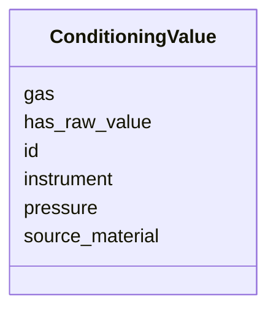

# Class: ConditioningValue 


URI: [basalt_schema:ConditioningValue](https://emsl-computing.github.io/BASALT-Schema/elements/ConditioningValue)





<!-- no inheritance hierarchy -->

## Slots

| Name | Cardinality and Range | Description | Inheritance |
| ---  | --- | --- | --- |
| [id](id.md) | 1 <br/> [String](String.md) |  | direct |
| [source_material](source_material.md) | 0..1 <br/> [String](String.md) |  | direct |
| [instrument](instrument.md) | 0..1 <br/> [String](String.md) |  | direct |
| [gas](gas.md) | 0..1 <br/> [String](String.md) |  | direct |
| [pressure](pressure.md) | 0..1 <br/> [String](String.md) |  | direct |
| [has_raw_value](has_raw_value.md) | 0..1 <br/> [String](String.md) |  | direct |


## Identifier and Mapping Information


### Schema Source


* from schema: https://emsl-computing.github.io/BASALT-Schema


## Mappings

| Mapping Type | Mapped Value |
| ---  | ---  |
| self | basalt_schema:ConditioningValue |
| native | basalt_schema:ConditioningValue |


## LinkML Source

<!-- TODO: investigate https://stackoverflow.com/questions/37606292/how-to-create-tabbed-code-blocks-in-mkdocs-or-sphinx -->

### Direct

<details>
```yaml
name: ConditioningValue
from_schema: https://emsl-computing.github.io/BASALT-Schema
attributes:
  id:
    name: id
    from_schema: https://emsl-computing.github.io/BASALT-Schema/value-tables
    identifier: true
    domain_of:
    - Activity
    - Entity
    - DataProduct
    - DataGenerationActivity
    - DataProcessingActivity
    - AlternativeIdentifier
    - FunctionalAnnotationIdentifier
    - Instrument
    - OntologyClass
    - ContainerType
    - Custodian
    - InstrumentAlternativeIdentifier
    - LabDevice
    - SampleProcessing
    - ProcessingSampleLink
    - Configuration
    - MobilePhaseSegment
    - MassSpectrometryStandardRun
    - PurchasedMaterial
    - LabProcessingActivity
    - organism
    - MAOMProduct
    - WEOMProduct
    - Site
    - Sample
    - AerosolArmSample
    - AerosolSample
    - AMP2UserSample
    - CommerciallyPurchasedSample
    - CultureEnvironmentalSample
    - EngineeredStrainSample
    - FieldDeployedTerraformSample
    - MixedCultureSample
    - MonetSoilSample
    - OtherUndescribedSample
    - PlantSample
    - PureCultureSample
    - SedimentSample
    - SoilSample
    - SynthesizedMaterialSample
    - TerraformSample
    - WaterSample
    - ProcessedSample
    - CoreSection
    - SamplingActivity
    - AerosolArmSamplingActivity
    - AerosolSamplingActivity
    - CommerciallyPurchasedSamplingActivity
    - CultureEnvironmentalSamplingActivity
    - EngineeredStrainSamplingActivity
    - FieldDeployedTerraformSamplingActivity
    - MixedCultureSamplingActivity
    - MonetSoilSamplingActivity
    - OtherUndescribedSamplingActivity
    - PlantSamplingActivity
    - PureCultureSamplingActivity
    - SedimentSamplingActivity
    - SoilSamplingActivity
    - SynthesizedMaterialSamplingActivity
    - TerraformSamplingActivity
    - WaterSamplingActivity
    - Study
    - ProjectParticipant
    - TimestampValue
    - TextValue
    - SoftwareControlledTermValue
    - ControlledTermValue
    - PersonValue
    - QuantityValue
    - ConditioningValue
    - zipDownload
    range: string
    required: true
  source_material:
    name: source_material
    from_schema: https://emsl-computing.github.io/BASALT-Schema/value-tables
    rank: 1000
    domain_of:
    - ConditioningValue
    range: string
  instrument:
    name: instrument
    from_schema: https://emsl-computing.github.io/BASALT-Schema/value-tables
    rank: 1000
    domain_of:
    - ConditioningValue
    range: string
  gas:
    name: gas
    from_schema: https://emsl-computing.github.io/BASALT-Schema/value-tables
    rank: 1000
    domain_of:
    - ConditioningValue
    range: string
  pressure:
    name: pressure
    from_schema: https://emsl-computing.github.io/BASALT-Schema/value-tables
    domain_of:
    - FieldDeployedTerraformSample
    - OtherUndescribedSample
    - SedimentSample
    - TerraformSample
    - WaterSample
    - ConditioningValue
    range: string
  has_raw_value:
    name: has_raw_value
    from_schema: https://emsl-computing.github.io/BASALT-Schema/value-tables
    domain_of:
    - TimestampValue
    - TextValue
    - SoftwareControlledTermValue
    - ControlledTermValue
    - QuantityValue
    - ConditioningValue
    range: string

```
</details>

### Induced

<details>
```yaml
name: ConditioningValue
from_schema: https://emsl-computing.github.io/BASALT-Schema
attributes:
  id:
    name: id
    from_schema: https://emsl-computing.github.io/BASALT-Schema/value-tables
    identifier: true
    alias: id
    owner: ConditioningValue
    domain_of:
    - Activity
    - Entity
    - DataProduct
    - DataGenerationActivity
    - DataProcessingActivity
    - AlternativeIdentifier
    - FunctionalAnnotationIdentifier
    - Instrument
    - OntologyClass
    - ContainerType
    - Custodian
    - InstrumentAlternativeIdentifier
    - LabDevice
    - SampleProcessing
    - ProcessingSampleLink
    - Configuration
    - MobilePhaseSegment
    - MassSpectrometryStandardRun
    - PurchasedMaterial
    - LabProcessingActivity
    - organism
    - MAOMProduct
    - WEOMProduct
    - Site
    - Sample
    - AerosolArmSample
    - AerosolSample
    - AMP2UserSample
    - CommerciallyPurchasedSample
    - CultureEnvironmentalSample
    - EngineeredStrainSample
    - FieldDeployedTerraformSample
    - MixedCultureSample
    - MonetSoilSample
    - OtherUndescribedSample
    - PlantSample
    - PureCultureSample
    - SedimentSample
    - SoilSample
    - SynthesizedMaterialSample
    - TerraformSample
    - WaterSample
    - ProcessedSample
    - CoreSection
    - SamplingActivity
    - AerosolArmSamplingActivity
    - AerosolSamplingActivity
    - CommerciallyPurchasedSamplingActivity
    - CultureEnvironmentalSamplingActivity
    - EngineeredStrainSamplingActivity
    - FieldDeployedTerraformSamplingActivity
    - MixedCultureSamplingActivity
    - MonetSoilSamplingActivity
    - OtherUndescribedSamplingActivity
    - PlantSamplingActivity
    - PureCultureSamplingActivity
    - SedimentSamplingActivity
    - SoilSamplingActivity
    - SynthesizedMaterialSamplingActivity
    - TerraformSamplingActivity
    - WaterSamplingActivity
    - Study
    - ProjectParticipant
    - TimestampValue
    - TextValue
    - SoftwareControlledTermValue
    - ControlledTermValue
    - PersonValue
    - QuantityValue
    - ConditioningValue
    - zipDownload
    range: string
    required: true
  source_material:
    name: source_material
    from_schema: https://emsl-computing.github.io/BASALT-Schema/value-tables
    rank: 1000
    alias: source_material
    owner: ConditioningValue
    domain_of:
    - ConditioningValue
    range: string
  instrument:
    name: instrument
    from_schema: https://emsl-computing.github.io/BASALT-Schema/value-tables
    rank: 1000
    alias: instrument
    owner: ConditioningValue
    domain_of:
    - ConditioningValue
    range: string
  gas:
    name: gas
    from_schema: https://emsl-computing.github.io/BASALT-Schema/value-tables
    rank: 1000
    alias: gas
    owner: ConditioningValue
    domain_of:
    - ConditioningValue
    range: string
  pressure:
    name: pressure
    from_schema: https://emsl-computing.github.io/BASALT-Schema/value-tables
    alias: pressure
    owner: ConditioningValue
    domain_of:
    - FieldDeployedTerraformSample
    - OtherUndescribedSample
    - SedimentSample
    - TerraformSample
    - WaterSample
    - ConditioningValue
    range: string
  has_raw_value:
    name: has_raw_value
    from_schema: https://emsl-computing.github.io/BASALT-Schema/value-tables
    alias: has_raw_value
    owner: ConditioningValue
    domain_of:
    - TimestampValue
    - TextValue
    - SoftwareControlledTermValue
    - ControlledTermValue
    - QuantityValue
    - ConditioningValue
    range: string

```
</details>