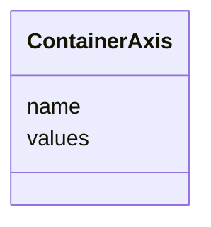

# Class: ContainerAxis 


URI: [basalt_schema:ContainerAxis](https://emsl-computing.github.io/BASALT-Schema/elements/ContainerAxis)





<!-- no inheritance hierarchy -->

## Slots

| Name | Cardinality and Range | Description | Inheritance |
| ---  | --- | --- | --- |
| [name](name.md) | 0..1 <br/> [String](String.md) |  | direct |
| [values](values.md) | * <br/> [String](String.md) |  | direct |


## Usages

| used by | used in | type | used |
| ---  | --- | --- | --- |
| [ContainerType](ContainerType.md) | [axes](axes.md) | range | [ContainerAxis](ContainerAxis.md) |


## TODOs

* I'm only including this in case we need it to sync up with L7 in some way


## Identifier and Mapping Information


### Schema Source


* from schema: https://emsl-computing.github.io/BASALT-Schema


## Mappings

| Mapping Type | Mapped Value |
| ---  | ---  |
| self | basalt_schema:ContainerAxis |
| native | basalt_schema:ContainerAxis |


## LinkML Source

<!-- TODO: investigate https://stackoverflow.com/questions/37606292/how-to-create-tabbed-code-blocks-in-mkdocs-or-sphinx -->

### Direct

<details>
```yaml
name: ContainerAxis
todos:
- I'm only including this in case we need it to sync up with L7 in some way
from_schema: https://emsl-computing.github.io/BASALT-Schema
attributes:
  name:
    name: name
    from_schema: https://emsl-computing.github.io/BASALT-Schema
    domain_of:
    - Activity
    - Entity
    - DataProduct
    - DataGenerationActivity
    - Instrument
    - OntologyClass
    - ContainerAxis
    - Configuration
    - MobilePhaseSegment
    - MassSpectrometryStandardRun
    - PurchasedMaterial
    - LabProcessingActivity
    - organism
    - Site
    - Sample
    - SamplingActivity
    - SoilSamplingActivity
    - Study
    - SoftwareControlledTermValue
    range: string
  values:
    name: values
    from_schema: https://emsl-computing.github.io/BASALT-Schema
    rank: 1000
    domain_of:
    - ContainerAxis
    range: string
    multivalued: true

```
</details>

### Induced

<details>
```yaml
name: ContainerAxis
todos:
- I'm only including this in case we need it to sync up with L7 in some way
from_schema: https://emsl-computing.github.io/BASALT-Schema
attributes:
  name:
    name: name
    from_schema: https://emsl-computing.github.io/BASALT-Schema
    alias: name
    owner: ContainerAxis
    domain_of:
    - Activity
    - Entity
    - DataProduct
    - DataGenerationActivity
    - Instrument
    - OntologyClass
    - ContainerAxis
    - Configuration
    - MobilePhaseSegment
    - MassSpectrometryStandardRun
    - PurchasedMaterial
    - LabProcessingActivity
    - organism
    - Site
    - Sample
    - SamplingActivity
    - SoilSamplingActivity
    - Study
    - SoftwareControlledTermValue
    range: string
  values:
    name: values
    from_schema: https://emsl-computing.github.io/BASALT-Schema
    rank: 1000
    alias: values
    owner: ContainerAxis
    domain_of:
    - ContainerAxis
    range: string
    multivalued: true

```
</details>