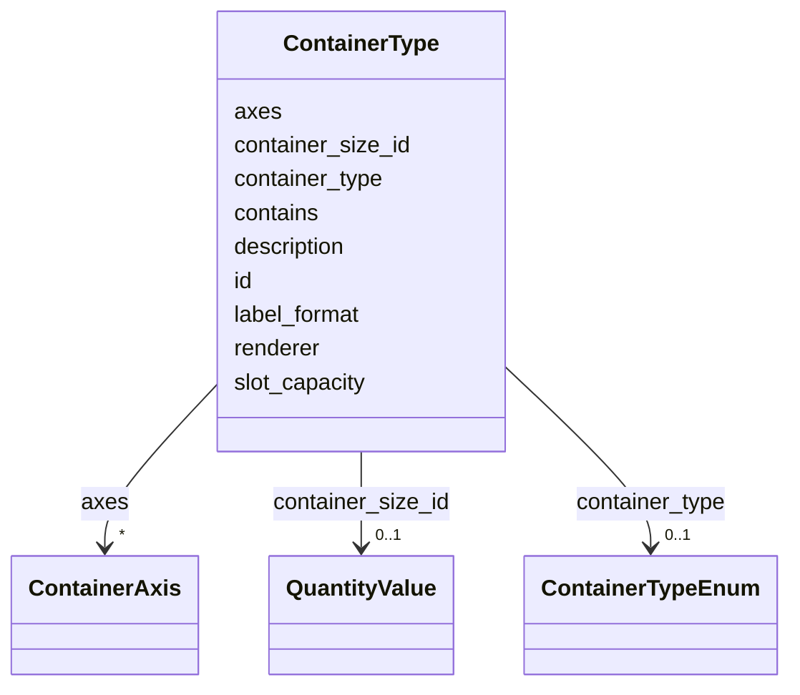

# Class: ContainerType 


URI: [basalt_schema:ContainerType](https://emsl-computing.github.io/BASALT-Schema/elements/ContainerType)





<!-- no inheritance hierarchy -->

## Slots

| Name | Cardinality and Range | Description | Inheritance |
| ---  | --- | --- | --- |
| [id](id.md) | 1 <br/> [Uuid](Uuid.md) |  | direct |
| [description](description.md) | 0..1 <br/> [String](String.md) |  | direct |
| [container_type](container_type.md) | 0..1 <br/> [ContainerTypeEnum](ContainerTypeEnum.md) |  | direct |
| [container_size_id](container_size_id.md) | 0..1 <br/> [QuantityValue](QuantityValue.md) |  | direct |
| [axes](axes.md) | * <br/> [ContainerAxis](ContainerAxis.md) |  | direct |
| [contains](contains.md) | * <br/> [Uriorcurie](Uriorcurie.md) |  | direct |
| [label_format](label_format.md) | 0..1 <br/> [String](String.md) |  | direct |
| [renderer](renderer.md) | 0..1 <br/> [String](String.md) | UI renderer to use for this container type (e | direct |
| [slot_capacity](slot_capacity.md) | 0..1 <br/> [String](String.md) |  | direct |


## TODOs

* reconcile with enums and in media_strain_culture_plate.yaml
* potentially delete along with ContainerAxis? What are these for?


## Identifier and Mapping Information


### Schema Source


* from schema: https://emsl-computing.github.io/BASALT-Schema


## Mappings

| Mapping Type | Mapped Value |
| ---  | ---  |
| self | basalt_schema:ContainerType |
| native | basalt_schema:ContainerType |


## LinkML Source

<!-- TODO: investigate https://stackoverflow.com/questions/37606292/how-to-create-tabbed-code-blocks-in-mkdocs-or-sphinx -->

### Direct

<details>
```yaml
name: ContainerType
todos:
- reconcile with enums and in media_strain_culture_plate.yaml
- potentially delete along with ContainerAxis? What are these for?
from_schema: https://emsl-computing.github.io/BASALT-Schema
attributes:
  id:
    name: id
    from_schema: https://emsl-computing.github.io/BASALT-Schema
    identifier: true
    domain_of:
    - Activity
    - Entity
    - DataProduct
    - DataGenerationActivity
    - DataProcessingActivity
    - AlternativeIdentifier
    - FunctionalAnnotationIdentifier
    - Instrument
    - OntologyClass
    - ContainerType
    - Custodian
    - InstrumentAlternativeIdentifier
    - LabDevice
    - SampleProcessing
    - ProcessingSampleLink
    - Configuration
    - MobilePhaseSegment
    - MassSpectrometryStandardRun
    - PurchasedMaterial
    - LabProcessingActivity
    - organism
    - MAOMProduct
    - WEOMProduct
    - Site
    - Sample
    - AerosolArmSample
    - AerosolSample
    - AMP2UserSample
    - CommerciallyPurchasedSample
    - CultureEnvironmentalSample
    - EngineeredStrainSample
    - FieldDeployedTerraformSample
    - MixedCultureSample
    - MonetSoilSample
    - OtherUndescribedSample
    - PlantSample
    - PureCultureSample
    - SedimentSample
    - SoilSample
    - SynthesizedMaterialSample
    - TerraformSample
    - WaterSample
    - ProcessedSample
    - CoreSection
    - SamplingActivity
    - AerosolArmSamplingActivity
    - AerosolSamplingActivity
    - CommerciallyPurchasedSamplingActivity
    - CultureEnvironmentalSamplingActivity
    - EngineeredStrainSamplingActivity
    - FieldDeployedTerraformSamplingActivity
    - MixedCultureSamplingActivity
    - MonetSoilSamplingActivity
    - OtherUndescribedSamplingActivity
    - PlantSamplingActivity
    - PureCultureSamplingActivity
    - SedimentSamplingActivity
    - SoilSamplingActivity
    - SynthesizedMaterialSamplingActivity
    - TerraformSamplingActivity
    - WaterSamplingActivity
    - Study
    - ProjectParticipant
    - TimestampValue
    - TextValue
    - SoftwareControlledTermValue
    - ControlledTermValue
    - PersonValue
    - QuantityValue
    - ConditioningValue
    - zipDownload
    range: uuid
    required: true
  description:
    name: description
    from_schema: https://emsl-computing.github.io/BASALT-Schema
    domain_of:
    - Activity
    - Entity
    - DataProduct
    - DataGenerationActivity
    - DataProcessingActivity
    - OntologyClass
    - ContainerType
    - LabDevice
    - Configuration
    - MassSpectrometryStandardRun
    - PurchasedMaterial
    - LabProcessingActivity
    - organism
    - Site
    - Sample
    - SamplingActivity
    - SoilSamplingActivity
    - Study
    - TimestampValue
    - TextValue
    - SoftwareControlledTermValue
    - ControlledTermValue
    - QuantityValue
    range: string
  container_type:
    name: container_type
    from_schema: https://emsl-computing.github.io/BASALT-Schema
    domain_of:
    - ContainerType
    - CultureGrowth
    range: ContainerTypeEnum
  container_size_id:
    name: container_size_id
    from_schema: https://emsl-computing.github.io/BASALT-Schema
    rank: 1000
    domain_of:
    - ContainerType
    range: QuantityValue
  axes:
    name: axes
    from_schema: https://emsl-computing.github.io/BASALT-Schema
    rank: 1000
    domain_of:
    - ContainerType
    range: ContainerAxis
    multivalued: true
  contains:
    name: contains
    from_schema: https://emsl-computing.github.io/BASALT-Schema
    rank: 1000
    domain_of:
    - ContainerType
    range: uriorcurie
    multivalued: true
  label_format:
    name: label_format
    from_schema: https://emsl-computing.github.io/BASALT-Schema
    rank: 1000
    domain_of:
    - ContainerType
    range: string
  renderer:
    name: renderer
    description: UI renderer to use for this container type (e.g., defaultcontainer.js).
    from_schema: https://emsl-computing.github.io/BASALT-Schema
    rank: 1000
    domain_of:
    - ContainerType
    range: string
  slot_capacity:
    name: slot_capacity
    from_schema: https://emsl-computing.github.io/BASALT-Schema
    rank: 1000
    domain_of:
    - ContainerType
    range: string

```
</details>

### Induced

<details>
```yaml
name: ContainerType
todos:
- reconcile with enums and in media_strain_culture_plate.yaml
- potentially delete along with ContainerAxis? What are these for?
from_schema: https://emsl-computing.github.io/BASALT-Schema
attributes:
  id:
    name: id
    from_schema: https://emsl-computing.github.io/BASALT-Schema
    identifier: true
    alias: id
    owner: ContainerType
    domain_of:
    - Activity
    - Entity
    - DataProduct
    - DataGenerationActivity
    - DataProcessingActivity
    - AlternativeIdentifier
    - FunctionalAnnotationIdentifier
    - Instrument
    - OntologyClass
    - ContainerType
    - Custodian
    - InstrumentAlternativeIdentifier
    - LabDevice
    - SampleProcessing
    - ProcessingSampleLink
    - Configuration
    - MobilePhaseSegment
    - MassSpectrometryStandardRun
    - PurchasedMaterial
    - LabProcessingActivity
    - organism
    - MAOMProduct
    - WEOMProduct
    - Site
    - Sample
    - AerosolArmSample
    - AerosolSample
    - AMP2UserSample
    - CommerciallyPurchasedSample
    - CultureEnvironmentalSample
    - EngineeredStrainSample
    - FieldDeployedTerraformSample
    - MixedCultureSample
    - MonetSoilSample
    - OtherUndescribedSample
    - PlantSample
    - PureCultureSample
    - SedimentSample
    - SoilSample
    - SynthesizedMaterialSample
    - TerraformSample
    - WaterSample
    - ProcessedSample
    - CoreSection
    - SamplingActivity
    - AerosolArmSamplingActivity
    - AerosolSamplingActivity
    - CommerciallyPurchasedSamplingActivity
    - CultureEnvironmentalSamplingActivity
    - EngineeredStrainSamplingActivity
    - FieldDeployedTerraformSamplingActivity
    - MixedCultureSamplingActivity
    - MonetSoilSamplingActivity
    - OtherUndescribedSamplingActivity
    - PlantSamplingActivity
    - PureCultureSamplingActivity
    - SedimentSamplingActivity
    - SoilSamplingActivity
    - SynthesizedMaterialSamplingActivity
    - TerraformSamplingActivity
    - WaterSamplingActivity
    - Study
    - ProjectParticipant
    - TimestampValue
    - TextValue
    - SoftwareControlledTermValue
    - ControlledTermValue
    - PersonValue
    - QuantityValue
    - ConditioningValue
    - zipDownload
    range: uuid
    required: true
  description:
    name: description
    from_schema: https://emsl-computing.github.io/BASALT-Schema
    alias: description
    owner: ContainerType
    domain_of:
    - Activity
    - Entity
    - DataProduct
    - DataGenerationActivity
    - DataProcessingActivity
    - OntologyClass
    - ContainerType
    - LabDevice
    - Configuration
    - MassSpectrometryStandardRun
    - PurchasedMaterial
    - LabProcessingActivity
    - organism
    - Site
    - Sample
    - SamplingActivity
    - SoilSamplingActivity
    - Study
    - TimestampValue
    - TextValue
    - SoftwareControlledTermValue
    - ControlledTermValue
    - QuantityValue
    range: string
  container_type:
    name: container_type
    from_schema: https://emsl-computing.github.io/BASALT-Schema
    alias: container_type
    owner: ContainerType
    domain_of:
    - ContainerType
    - CultureGrowth
    range: ContainerTypeEnum
  container_size_id:
    name: container_size_id
    from_schema: https://emsl-computing.github.io/BASALT-Schema
    rank: 1000
    alias: container_size_id
    owner: ContainerType
    domain_of:
    - ContainerType
    range: QuantityValue
  axes:
    name: axes
    from_schema: https://emsl-computing.github.io/BASALT-Schema
    rank: 1000
    alias: axes
    owner: ContainerType
    domain_of:
    - ContainerType
    range: ContainerAxis
    multivalued: true
  contains:
    name: contains
    from_schema: https://emsl-computing.github.io/BASALT-Schema
    rank: 1000
    alias: contains
    owner: ContainerType
    domain_of:
    - ContainerType
    range: uriorcurie
    multivalued: true
  label_format:
    name: label_format
    from_schema: https://emsl-computing.github.io/BASALT-Schema
    rank: 1000
    alias: label_format
    owner: ContainerType
    domain_of:
    - ContainerType
    range: string
  renderer:
    name: renderer
    description: UI renderer to use for this container type (e.g., defaultcontainer.js).
    from_schema: https://emsl-computing.github.io/BASALT-Schema
    rank: 1000
    alias: renderer
    owner: ContainerType
    domain_of:
    - ContainerType
    range: string
  slot_capacity:
    name: slot_capacity
    from_schema: https://emsl-computing.github.io/BASALT-Schema
    rank: 1000
    alias: slot_capacity
    owner: ContainerType
    domain_of:
    - ContainerType
    range: string

```
</details>