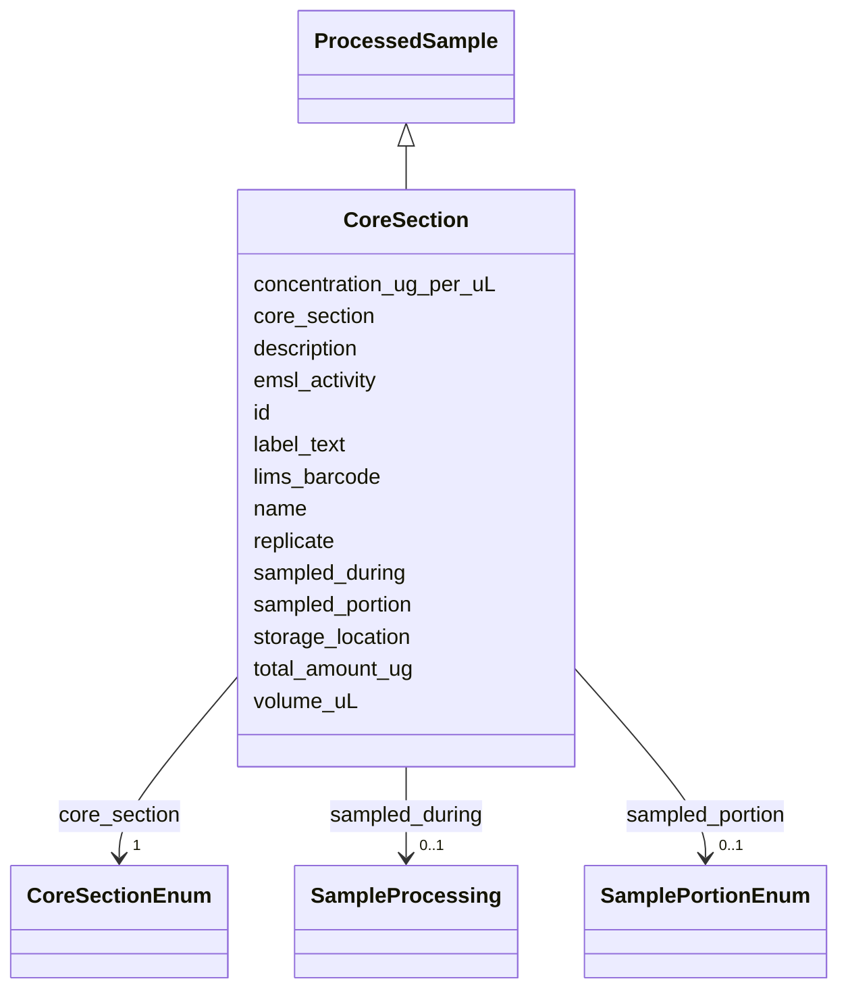

# Class: CoreSection 


_A section of a core sample (TOP, MID, BTM)._


URI: [analysis_api_schema:CoreSection](https://w3id.org/MONet/analysis-api-schema/CoreSection)





## Inheritance
* [Sample](Sample.md)
    * [ProcessedSample](ProcessedSample.md)
        * **CoreSection**


## Slots

| Name | Cardinality and Range | Description | Inheritance |
| ---  | --- | --- | --- |
| [core_section](core_section.md) | 1 <br/> [CoreSectionEnum](CoreSectionEnum.md) | The section of the core | direct |
| [id](id.md) | 1 <br/> [Uuid](Uuid.md) |  | direct |
| [storage_location](storage_location.md) | 0..1 <br/> [String](String.md) | The physical or digital location where the processed sample is stored (e | [ProcessedSample](ProcessedSample.md) |
| [label_text](label_text.md) | 0..1 <br/> [String](String.md) | The label on the stored processed sample, if applicable (e | [ProcessedSample](ProcessedSample.md) |
| [concentration_ug_per_uL](concentration_ug_per_uL.md) | 0..1 <br/> [Float](Float.md) | Concentration of the substance in micrograms per microliter | [ProcessedSample](ProcessedSample.md) |
| [total_amount_ug](total_amount_ug.md) | 0..1 <br/> [Float](Float.md) | Total amount of analyte in micrograms | [ProcessedSample](ProcessedSample.md) |
| [volume_uL](volume_uL.md) | 0..1 <br/> [Float](Float.md) | Volume of the entity in microliters | [ProcessedSample](ProcessedSample.md) |
| [sampled_portion](sampled_portion.md) | 0..1 <br/> [SamplePortionEnum](SamplePortionEnum.md) | The portion of the original sample used in creating this processed sample (e | [ProcessedSample](ProcessedSample.md) |
| [sampled_during](sampled_during.md) | 0..1 <br/> [SampleProcessing](SampleProcessing.md) | A reference to the sample processing activity (generally lab work) that gener... | [ProcessedSample](ProcessedSample.md) |
| [replicate](replicate.md) | 0..1 <br/> [Integer](Integer.md) | The TECHNICAL replicate number of the processed sample, if applicable | [ProcessedSample](ProcessedSample.md) |
| [name](name.md) | 1 <br/> [String](String.md) | Human-readable name for the entity or activity | [Sample](Sample.md) |
| [description](description.md) | 0..1 <br/> [String](String.md) | Human-readable description for the entity or activity | [Sample](Sample.md) |
| [emsl_activity](emsl_activity.md) | 0..1 <br/> [String](String.md) | Nullable string linking a Sample or SamplingActivity to a named EMSL activity... | [Sample](Sample.md) |
| [lims_barcode](lims_barcode.md) | 0..1 <br/> [String](String.md) | LIMS barcode identifier | [Sample](Sample.md) |


## Identifier and Mapping Information


### Schema Source


* from schema: https://w3id.org/MONet/analysis-api-schema


## Mappings

| Mapping Type | Mapped Value |
| ---  | ---  |
| self | analysis_api_schema:CoreSection |
| native | analysis_api_schema:CoreSection |


## LinkML Source

<!-- TODO: investigate https://stackoverflow.com/questions/37606292/how-to-create-tabbed-code-blocks-in-mkdocs-or-sphinx -->

### Direct

<details>
```yaml
name: CoreSection
description: A section of a core sample (TOP, MID, BTM).
from_schema: https://w3id.org/MONet/analysis-api-schema
is_a: ProcessedSample
slots:
- core_section
slot_usage:
  core_section:
    name: core_section
    required: true
attributes:
  id:
    name: id
    from_schema: https://w3id.org/MONet/analysis-api-schema/sample-classes
    identifier: true
    domain_of:
    - Activity
    - Entity
    - DataProduct
    - DataGenerationActivity
    - DataProcessingActivity
    - AlternativeIdentifier
    - FunctionalAnnotationIdentifier
    - Instrument
    - OntologyClass
    - ContainerType
    - Custodian
    - InstrumentAlternativeIdentifier
    - LabDevice
    - SampleProcessing
    - ProcessingSampleLink
    - Configuration
    - MobilePhaseSegment
    - MassSpectrometryStandardRun
    - PurchasedMaterial
    - LabProcessingActivity
    - MAOMProduct
    - WEOMProduct
    - Site
    - Sample
    - AerosolArmSample
    - AerosolSample
    - AMP2UserSample
    - CommerciallyPurchasedSample
    - CultureEnvironmentalSample
    - EngineeredStrainSample
    - FieldDeployedTerraformSample
    - MixedCultureSample
    - MonetSoilSample
    - OtherUndescribedSample
    - PlantSample
    - PureCultureSample
    - SedimentSample
    - SoilSample
    - SynthesizedMaterialSample
    - TerraformSample
    - WaterSample
    - ProcessedSample
    - CoreSection
    - SamplingActivity
    - AerosolArmSamplingActivity
    - AerosolSamplingActivity
    - CommerciallyPurchasedSamplingActivity
    - CultureEnvironmentalSamplingActivity
    - EngineeredStrainSamplingActivity
    - FieldDeployedTerraformSamplingActivity
    - MixedCultureSamplingActivity
    - MonetSoilSamplingActivity
    - OtherUndescribedSamplingActivity
    - PlantSamplingActivity
    - PureCultureSamplingActivity
    - SedimentSamplingActivity
    - SoilSamplingActivity
    - SynthesizedMaterialSamplingActivity
    - TerraformSamplingActivity
    - WaterSamplingActivity
    - biological_entity
    - Study
    - ProjectParticipant
    - TimestampValue
    - TextValue
    - SoftwareControlledTermValue
    - ControlledTermValue
    - PersonValue
    - QuantityValue
    - ConditioningValue
    - zipDownload
    range: uuid
    required: true

```
</details>

### Induced

<details>
```yaml
name: CoreSection
description: A section of a core sample (TOP, MID, BTM).
from_schema: https://w3id.org/MONet/analysis-api-schema
is_a: ProcessedSample
slot_usage:
  core_section:
    name: core_section
    required: true
attributes:
  id:
    name: id
    from_schema: https://w3id.org/MONet/analysis-api-schema/sample-classes
    identifier: true
    alias: id
    owner: CoreSection
    domain_of:
    - Activity
    - Entity
    - DataProduct
    - DataGenerationActivity
    - DataProcessingActivity
    - AlternativeIdentifier
    - FunctionalAnnotationIdentifier
    - Instrument
    - OntologyClass
    - ContainerType
    - Custodian
    - InstrumentAlternativeIdentifier
    - LabDevice
    - SampleProcessing
    - ProcessingSampleLink
    - Configuration
    - MobilePhaseSegment
    - MassSpectrometryStandardRun
    - PurchasedMaterial
    - LabProcessingActivity
    - MAOMProduct
    - WEOMProduct
    - Site
    - Sample
    - AerosolArmSample
    - AerosolSample
    - AMP2UserSample
    - CommerciallyPurchasedSample
    - CultureEnvironmentalSample
    - EngineeredStrainSample
    - FieldDeployedTerraformSample
    - MixedCultureSample
    - MonetSoilSample
    - OtherUndescribedSample
    - PlantSample
    - PureCultureSample
    - SedimentSample
    - SoilSample
    - SynthesizedMaterialSample
    - TerraformSample
    - WaterSample
    - ProcessedSample
    - CoreSection
    - SamplingActivity
    - AerosolArmSamplingActivity
    - AerosolSamplingActivity
    - CommerciallyPurchasedSamplingActivity
    - CultureEnvironmentalSamplingActivity
    - EngineeredStrainSamplingActivity
    - FieldDeployedTerraformSamplingActivity
    - MixedCultureSamplingActivity
    - MonetSoilSamplingActivity
    - OtherUndescribedSamplingActivity
    - PlantSamplingActivity
    - PureCultureSamplingActivity
    - SedimentSamplingActivity
    - SoilSamplingActivity
    - SynthesizedMaterialSamplingActivity
    - TerraformSamplingActivity
    - WaterSamplingActivity
    - biological_entity
    - Study
    - ProjectParticipant
    - TimestampValue
    - TextValue
    - SoftwareControlledTermValue
    - ControlledTermValue
    - PersonValue
    - QuantityValue
    - ConditioningValue
    - zipDownload
    range: uuid
    required: true
  core_section:
    name: core_section
    description: The section of the core.
    title: core section
    examples:
    - value: TOP
    - value: MID
    - value: BTM
    from_schema: https://w3id.org/MONet/analysis-api-schema
    rank: 1000
    alias: core_section
    owner: CoreSection
    domain_of:
    - DataProduct
    - CoreSection
    range: CoreSectionEnum
    required: true
  storage_location:
    name: storage_location
    description: The physical or digital location where the processed sample is stored
      (e.g., freezer location, database ID).
    from_schema: https://w3id.org/MONet/analysis-api-schema
    rank: 1000
    alias: storage_location
    owner: CoreSection
    domain_of:
    - ProcessedSample
    range: string
  label_text:
    name: label_text
    description: The label on the stored processed sample, if applicable (e.g., "f01").
    from_schema: https://w3id.org/MONet/analysis-api-schema
    rank: 1000
    alias: label_text
    owner: CoreSection
    domain_of:
    - ProcessedSample
    range: string
  concentration_ug_per_uL:
    name: concentration_ug_per_uL
    description: Concentration of the substance in micrograms per microliter.
    title: concentration (ug/uL)
    from_schema: https://w3id.org/MONet/analysis-api-schema
    rank: 1000
    alias: concentration_ug_per_uL
    owner: CoreSection
    domain_of:
    - ProcessedSample
    range: float
  total_amount_ug:
    name: total_amount_ug
    description: Total amount of analyte in micrograms
    from_schema: https://w3id.org/MONet/analysis-api-schema
    rank: 1000
    alias: total_amount_ug
    owner: CoreSection
    domain_of:
    - ProcessedSample
    range: float
  volume_uL:
    name: volume_uL
    description: Volume of the entity in microliters
    from_schema: https://w3id.org/MONet/analysis-api-schema
    rank: 1000
    alias: volume_uL
    owner: CoreSection
    domain_of:
    - ProcessedSample
    range: float
  sampled_portion:
    name: sampled_portion
    description: The portion of the original sample used in creating this processed
      sample (e.g., "interlayer", "supernatant", "pellet").
    from_schema: https://w3id.org/MONet/analysis-api-schema
    rank: 1000
    alias: sampled_portion
    owner: CoreSection
    domain_of:
    - ProcessedSample
    range: SamplePortionEnum
  sampled_during:
    name: sampled_during
    description: A reference to the sample processing activity (generally lab work)
      that generated this processed_sample.
    from_schema: https://w3id.org/MONet/analysis-api-schema
    rank: 1000
    alias: sampled_during
    owner: CoreSection
    domain_of:
    - AerosolArmSample
    - AerosolSample
    - CommerciallyPurchasedSample
    - CultureEnvironmentalSample
    - FieldDeployedTerraformSample
    - MixedCultureSample
    - MonetSoilSample
    - OtherUndescribedSample
    - PlantSample
    - PureCultureSample
    - SedimentSample
    - SoilSample
    - SynthesizedMaterialSample
    - TerraformSample
    - WaterSample
    - ProcessedSample
    range: SampleProcessing
  replicate:
    name: replicate
    description: The TECHNICAL replicate number of the processed sample, if applicable.
    todos:
    - reconcile replicate modelling
    from_schema: https://w3id.org/MONet/analysis-api-schema
    rank: 1000
    alias: replicate
    owner: CoreSection
    domain_of:
    - MAOMProduct
    - MicrobialBiomassProduct
    - NitrogenAnalysisProduct
    - PhosphorusAnalysisProduct
    - WEOMProduct
    - ProcessedSample
    range: integer
  name:
    name: name
    description: Human-readable name for the entity or activity.
    from_schema: https://w3id.org/MONet/analysis-api-schema
    rank: 1000
    alias: name
    owner: CoreSection
    domain_of:
    - Activity
    - Entity
    - DataProduct
    - DataGenerationActivity
    - Instrument
    - OntologyClass
    - ContainerAxis
    - Configuration
    - MobilePhaseSegment
    - MassSpectrometryStandardRun
    - PurchasedMaterial
    - LabProcessingActivity
    - Site
    - Sample
    - SamplingActivity
    - SoilSamplingActivity
    - biological_entity
    - Study
    - SoftwareControlledTermValue
    range: string
    required: true
  description:
    name: description
    description: Human-readable description for the entity or activity
    title: description
    from_schema: https://w3id.org/MONet/analysis-api-schema
    rank: 1000
    alias: description
    owner: CoreSection
    domain_of:
    - Activity
    - Entity
    - DataProduct
    - DataGenerationActivity
    - DataProcessingActivity
    - OntologyClass
    - ContainerType
    - LabDevice
    - Configuration
    - MassSpectrometryStandardRun
    - PurchasedMaterial
    - LabProcessingActivity
    - Site
    - Sample
    - SamplingActivity
    - SoilSamplingActivity
    - biological_entity
    - Study
    - TimestampValue
    - TextValue
    - SoftwareControlledTermValue
    - ControlledTermValue
    - QuantityValue
    range: string
  emsl_activity:
    name: emsl_activity
    description: 'Nullable string linking a Sample or SamplingActivity to a named
      EMSL activity or

      campaign (e.g., ''AMP2'', ''MONet_FY26''). Optional for historical records

      predating activity tracking.'
    todos:
    - Is sampling activity where we want to capture this?
    from_schema: https://w3id.org/MONet/analysis-api-schema
    rank: 1000
    alias: emsl_activity
    owner: CoreSection
    domain_of:
    - Sample
    - SamplingActivity
    range: string
    required: false
  lims_barcode:
    name: lims_barcode
    description: LIMS barcode identifier
    from_schema: https://w3id.org/MONet/analysis-api-schema
    rank: 1000
    alias: lims_barcode
    owner: CoreSection
    domain_of:
    - ProcessedData
    - Sample
    range: string
    required: false

```
</details>