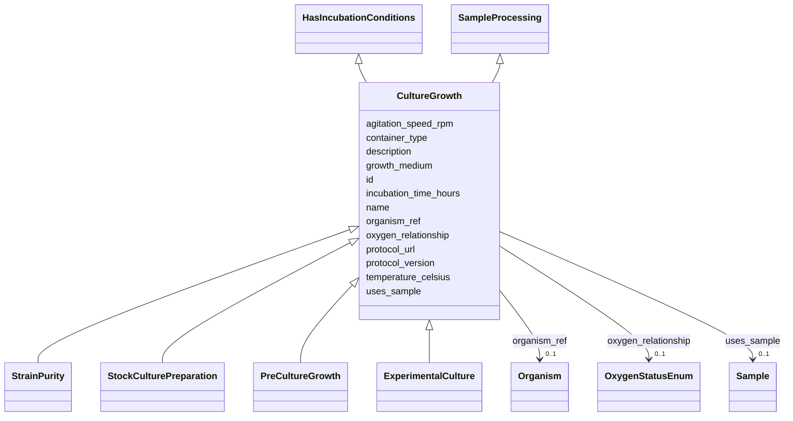

# Class: CultureGrowth 


_Abstract activity for growing cultures from samples or other cultures._

__

_Concrete subclasses: StrainPurity, StockCulturePreparation, _

_PreCultureGrowth, ExperimentalCulture._


URI: [basalt_schema:CultureGrowth](https://emsl-computing.github.io/BASALT-Schema/elements/CultureGrowth)



```mermaid
 classDiagram
    class CultureGrowth
    click CultureGrowth href "../CultureGrowth/"
      HasIncubationConditions <|-- CultureGrowth
        click HasIncubationConditions href "../HasIncubationConditions/"
      SampleProcessing <|-- CultureGrowth
        click SampleProcessing href "../SampleProcessing/"
      

      CultureGrowth <|-- StrainPurity
        click StrainPurity href "../StrainPurity/"
      CultureGrowth <|-- StockCulturePreparation
        click StockCulturePreparation href "../StockCulturePreparation/"
      CultureGrowth <|-- PreCultureGrowth
        click PreCultureGrowth href "../PreCultureGrowth/"
      CultureGrowth <|-- ExperimentalCulture
        click ExperimentalCulture href "../ExperimentalCulture/"
      

      CultureGrowth : agitation_speed_rpm
        
      CultureGrowth : container_type
        
      CultureGrowth : description
        
      CultureGrowth : growth_medium
        
      CultureGrowth : id
        
      CultureGrowth : incubation_time_hours
        
      CultureGrowth : name
        
      CultureGrowth : organism_ref
        
          
    
        
        
        CultureGrowth --> "0..1" Organism : organism_ref
        click Organism href "../Organism/"
    

        
      CultureGrowth : oxygen_relationship
        
          
    
        
        
        CultureGrowth --> "0..1" OxygenStatusEnum : oxygen_relationship
        click OxygenStatusEnum href "../OxygenStatusEnum/"
    

        
      CultureGrowth : protocol_url
        
      CultureGrowth : protocol_version
        
      CultureGrowth : temperature_celsius
        
      CultureGrowth : uses_sample
        
          
    
        
        
        CultureGrowth --> "0..1" Sample : uses_sample
        click Sample href "../Sample/"
    

        
      
```


## Inheritance
* [SampleProcessing](SampleProcessing.md)
    * **CultureGrowth** [ [HasIncubationConditions](HasIncubationConditions.md)]
        * [StrainPurity](StrainPurity.md)
        * [StockCulturePreparation](StockCulturePreparation.md)
        * [PreCultureGrowth](PreCultureGrowth.md)
        * [ExperimentalCulture](ExperimentalCulture.md)


## Slots

| Name | Cardinality and Range | Description | Inheritance |
| ---  | --- | --- | --- |
| [organism_ref](organism_ref.md) | 0..1 <br/> [Organism](Organism.md) | FK reference to an organism representing the biological identity | direct |
| [growth_medium](growth_medium.md) | 0..1 <br/> [String](String.md) | Method of growth and medium/materials used | direct |
| [incubation_time_hours](incubation_time_hours.md) | 0..1 <br/> [Float](Float.md) | Incubation duration in hours | direct |
| [container_type](container_type.md) | 0..1 <br/> [String](String.md) | Physical container used for the culture (flask, tube, plate, etc | direct |
| [temperature_celsius](temperature_celsius.md) | 0..1 <br/> [Float](Float.md) | Temperature at which the method/process/activity was performed | [HasIncubationConditions](HasIncubationConditions.md) |
| [agitation_speed_rpm](agitation_speed_rpm.md) | 0..1 <br/> [Integer](Integer.md) | Agitation/shaking speed in RPM (0 for static) | [HasIncubationConditions](HasIncubationConditions.md) |
| [oxygen_relationship](oxygen_relationship.md) | 0..1 <br/> [OxygenStatusEnum](OxygenStatusEnum.md) | The relationship of the sample to oxygen, such as aerobic or anaerobic | [HasIncubationConditions](HasIncubationConditions.md) |
| [name](name.md) | 1 <br/> [String](String.md) | Human-readable name for the entity or activity | [SampleProcessing](SampleProcessing.md) |
| [description](description.md) | 0..1 <br/> [String](String.md) | Human-readable description for the entity or activity | [SampleProcessing](SampleProcessing.md) |
| [protocol_url](protocol_url.md) | 0..1 <br/> [String](String.md) | URL pointing to the protocol used in the activity, if applicable | [SampleProcessing](SampleProcessing.md) |
| [protocol_version](protocol_version.md) | 0..1 <br/> [String](String.md) | Version of the protocol used in the activity, if applicable | [SampleProcessing](SampleProcessing.md) |
| [uses_sample](uses_sample.md) | 0..1 <br/> [Sample](Sample.md) | The starting sample that is being processed or analyzed | [SampleProcessing](SampleProcessing.md) |
| [id](id.md) | 1 <br/> [Uuid](Uuid.md) |  | [SampleProcessing](SampleProcessing.md) |


## Identifier and Mapping Information


### Schema Source


* from schema: https://emsl-computing.github.io/BASALT-Schema


## Mappings

| Mapping Type | Mapped Value |
| ---  | ---  |
| self | basalt_schema:CultureGrowth |
| native | basalt_schema:CultureGrowth |


## LinkML Source

<!-- TODO: investigate https://stackoverflow.com/questions/37606292/how-to-create-tabbed-code-blocks-in-mkdocs-or-sphinx -->

### Direct

<details>
```yaml
name: CultureGrowth
description: "Abstract activity for growing cultures from samples or other cultures.\n\
  \nConcrete subclasses: StrainPurity, StockCulturePreparation, \nPreCultureGrowth,\
  \ ExperimentalCulture."
from_schema: https://emsl-computing.github.io/BASALT-Schema
is_a: SampleProcessing
mixins:
- HasIncubationConditions
slots:
- organism_ref
- growth_medium
- incubation_time_hours
- container_type

```
</details>

### Induced

<details>
```yaml
name: CultureGrowth
description: "Abstract activity for growing cultures from samples or other cultures.\n\
  \nConcrete subclasses: StrainPurity, StockCulturePreparation, \nPreCultureGrowth,\
  \ ExperimentalCulture."
from_schema: https://emsl-computing.github.io/BASALT-Schema
is_a: SampleProcessing
mixins:
- HasIncubationConditions
attributes:
  organism_ref:
    name: organism_ref
    description: 'FK reference to an organism representing the biological identity

      strain, isolate, engineered construct) that this sample or activity

      is associated with.'
    from_schema: https://emsl-computing.github.io/BASALT-Schema
    aliases:
    - strain_ref
    - strain_id
    rank: 1000
    alias: organism_ref
    owner: CultureGrowth
    domain_of:
    - CultureGrowth
    - AMP2UserSample
    - EngineeredStrainSample
    range: organism
    required: false
  growth_medium:
    name: growth_medium
    description: Method of growth and medium/materials used. Indicate broth, gel,
      3-D structure, bioreactor, etc. followed by the formula, recipe, or components
      used to create the growth medium.
    title: growth medium
    from_schema: https://emsl-computing.github.io/BASALT-Schema
    rank: 1000
    alias: growth_medium
    owner: CultureGrowth
    domain_of:
    - CultureGrowth
    - CultureEnvironmentalSample
    - FieldDeployedTerraformSample
    - MixedCultureSample
    - OtherUndescribedSample
    - PureCultureSample
    - TerraformSample
    range: string
  incubation_time_hours:
    name: incubation_time_hours
    description: Incubation duration in hours
    from_schema: https://emsl-computing.github.io/BASALT-Schema
    rank: 1000
    alias: incubation_time_hours
    owner: CultureGrowth
    domain_of:
    - CultureGrowth
    range: float
  container_type:
    name: container_type
    description: Physical container used for the culture (flask, tube, plate, etc.)
    from_schema: https://emsl-computing.github.io/BASALT-Schema
    rank: 1000
    alias: container_type
    owner: CultureGrowth
    domain_of:
    - ContainerType
    - CultureGrowth
    range: string
  temperature_celsius:
    name: temperature_celsius
    description: Temperature at which the method/process/activity was performed
    from_schema: https://emsl-computing.github.io/BASALT-Schema
    rank: 1000
    alias: temperature_celsius
    owner: CultureGrowth
    domain_of:
    - ChromatographyConfiguration
    - HasIncubationConditions
    - ChemicalConversionProcess
    range: float
  agitation_speed_rpm:
    name: agitation_speed_rpm
    description: Agitation/shaking speed in RPM (0 for static)
    from_schema: https://emsl-computing.github.io/BASALT-Schema
    rank: 1000
    alias: agitation_speed_rpm
    owner: CultureGrowth
    domain_of:
    - HasIncubationConditions
    range: integer
  oxygen_relationship:
    name: oxygen_relationship
    description: The relationship of the sample to oxygen, such as aerobic or anaerobic.
    title: oxygen relationship
    from_schema: https://emsl-computing.github.io/BASALT-Schema
    exact_mappings:
    - MIXS:0000015
    rank: 1000
    alias: oxygen_status
    owner: CultureGrowth
    domain_of:
    - HasIncubationConditions
    - CommerciallyPurchasedSample
    - CultureEnvironmentalSample
    - FieldDeployedTerraformSample
    - MixedCultureSample
    - OtherUndescribedSample
    - PureCultureSample
    - SedimentSample
    - SoilSample
    - SynthesizedMaterialSample
    - TerraformSample
    - WaterSample
    range: OxygenStatusEnum
  name:
    name: name
    description: Human-readable name for the entity or activity.
    from_schema: https://emsl-computing.github.io/BASALT-Schema
    rank: 1000
    alias: name
    owner: CultureGrowth
    domain_of:
    - Activity
    - Entity
    - DataProduct
    - DataGenerationActivity
    - Instrument
    - OntologyClass
    - ContainerAxis
    - SampleProcessing
    - Configuration
    - MobilePhaseSegment
    - MassSpectrometryStandardRun
    - PurchasedMaterial
    - LabProcessingActivity
    - organism
    - Site
    - Sample
    - SamplingActivity
    - SoilSamplingActivity
    - SampleProcessingProtocol
    - Study
    - SoftwareControlledTermValue
    range: string
    required: true
  description:
    name: description
    description: Human-readable description for the entity or activity
    title: description
    from_schema: https://emsl-computing.github.io/BASALT-Schema
    rank: 1000
    alias: description
    owner: CultureGrowth
    domain_of:
    - Activity
    - Entity
    - DataProduct
    - DataGenerationActivity
    - DataProcessingActivity
    - OntologyClass
    - ContainerType
    - LabDevice
    - SampleProcessing
    - Configuration
    - MassSpectrometryStandardRun
    - PurchasedMaterial
    - LabProcessingActivity
    - organism
    - Site
    - Sample
    - SamplingActivity
    - SoilSamplingActivity
    - SampleProcessingProtocol
    - Study
    - TimestampValue
    - TextValue
    - SoftwareControlledTermValue
    - ControlledTermValue
    - QuantityValue
    range: string
  protocol_url:
    name: protocol_url
    description: URL pointing to the protocol used in the activity, if applicable.
    from_schema: https://emsl-computing.github.io/BASALT-Schema
    rank: 1000
    alias: protocol_url
    owner: CultureGrowth
    domain_of:
    - DataGenerationActivity
    - SampleProcessing
    - SampleProcessingProtocol
    range: string
  protocol_version:
    name: protocol_version
    description: Version of the protocol used in the activity, if applicable.
    from_schema: https://emsl-computing.github.io/BASALT-Schema
    rank: 1000
    alias: protocol_version
    owner: CultureGrowth
    domain_of:
    - DataGenerationActivity
    - SampleProcessing
    - SampleProcessingProtocol
    range: string
  uses_sample:
    name: uses_sample
    description: The starting sample that is being processed or analyzed. This slot
      should only be used on an Activity class.
    from_schema: https://emsl-computing.github.io/BASALT-Schema
    rank: 1000
    alias: uses_sample
    owner: CultureGrowth
    domain_of:
    - SampleProcessing
    range: Sample
  id:
    name: id
    from_schema: https://emsl-computing.github.io/BASALT-Schema
    identifier: true
    alias: id
    owner: CultureGrowth
    domain_of:
    - Activity
    - Entity
    - DataProduct
    - DataGenerationActivity
    - DataProcessingActivity
    - AlternativeIdentifier
    - FunctionalAnnotationIdentifier
    - Instrument
    - OntologyClass
    - ContainerType
    - Custodian
    - InstrumentAlternativeIdentifier
    - LabDevice
    - SampleProcessing
    - ProcessingSampleLink
    - Configuration
    - MobilePhaseSegment
    - MassSpectrometryStandardRun
    - PurchasedMaterial
    - LabProcessingActivity
    - MAOMProduct
    - WEOMProduct
    - organism
    - Site
    - Sample
    - AerosolArmSample
    - AerosolSample
    - AMP2UserSample
    - CommerciallyPurchasedSample
    - CultureEnvironmentalSample
    - EngineeredStrainSample
    - FieldDeployedTerraformSample
    - MixedCultureSample
    - MonetSoilSample
    - OtherUndescribedSample
    - PlantSample
    - PureCultureSample
    - SedimentSample
    - SoilSample
    - SynthesizedMaterialSample
    - TerraformSample
    - WaterSample
    - ProcessedSample
    - CoreSection
    - SamplingActivity
    - AerosolArmSamplingActivity
    - AerosolSamplingActivity
    - CommerciallyPurchasedSamplingActivity
    - CultureEnvironmentalSamplingActivity
    - EngineeredStrainSamplingActivity
    - FieldDeployedTerraformSamplingActivity
    - MixedCultureSamplingActivity
    - MonetSoilSamplingActivity
    - OtherUndescribedSamplingActivity
    - PlantSamplingActivity
    - PureCultureSamplingActivity
    - SedimentSamplingActivity
    - SoilSamplingActivity
    - SynthesizedMaterialSamplingActivity
    - TerraformSamplingActivity
    - WaterSamplingActivity
    - SampleProcessingProtocol
    - Study
    - ProjectParticipant
    - TimestampValue
    - TextValue
    - SoftwareControlledTermValue
    - ControlledTermValue
    - PersonValue
    - QuantityValue
    - ConditioningValue
    - zipDownload
    range: uuid
    required: true

```
</details>