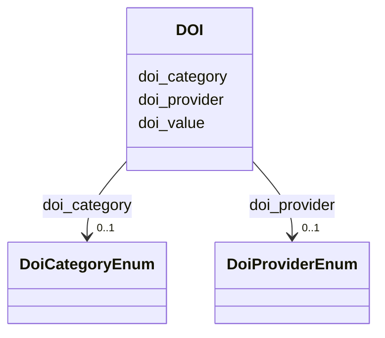

# Class: DOI 


_A digital object identifier (DOI) representing a persistent link to a digital resource._


URI: [analysis_api_schema:DOI](https://w3id.org/MONet/analysis-api-schema/DOI)





<!-- no inheritance hierarchy -->

## Slots

| Name | Cardinality and Range | Description | Inheritance |
| ---  | --- | --- | --- |
| [doi_value](doi_value.md) | 1 <br/> [Uriorcurie](Uriorcurie.md) |  | direct |
| [doi_category](doi_category.md) | 0..1 <br/> [DoiCategoryEnum](DoiCategoryEnum.md) | The resource type the corresponding doi resolves to | direct |
| [doi_provider](doi_provider.md) | 0..1 <br/> [DoiProviderEnum](DoiProviderEnum.md) | The authority, or organization, the DOI is associated with | direct |


## Usages

| used by | used in | type | used |
| ---  | --- | --- | --- |
| [Study](Study.md) | [associated_dois](associated_dois.md) | range | [DOI](DOI.md) |
| [Study](Study.md) | [funding_sources](funding_sources.md) | range | [DOI](DOI.md) |


## Identifier and Mapping Information


### Schema Source


* from schema: https://w3id.org/MONet/analysis-api-schema


## Mappings

| Mapping Type | Mapped Value |
| ---  | ---  |
| self | analysis_api_schema:DOI |
| native | analysis_api_schema:DOI |


## LinkML Source

<!-- TODO: investigate https://stackoverflow.com/questions/37606292/how-to-create-tabbed-code-blocks-in-mkdocs-or-sphinx -->

### Direct

<details>
```yaml
name: DOI
description: A digital object identifier (DOI) representing a persistent link to a
  digital resource.
from_schema: https://w3id.org/MONet/analysis-api-schema
attributes:
  doi_value:
    name: doi_value
    from_schema: https://w3id.org/MONet/analysis-api-schema/study
    rank: 1000
    domain_of:
    - DOI
    range: uriorcurie
    required: true
  doi_category:
    name: doi_category
    description: The resource type the corresponding doi resolves to
    from_schema: https://w3id.org/MONet/analysis-api-schema/study
    rank: 1000
    domain_of:
    - DOI
    range: DoiCategoryEnum
  doi_provider:
    name: doi_provider
    description: The authority, or organization, the DOI is associated with.
    from_schema: https://w3id.org/MONet/analysis-api-schema/study
    rank: 1000
    domain_of:
    - DOI
    range: DoiProviderEnum

```
</details>

### Induced

<details>
```yaml
name: DOI
description: A digital object identifier (DOI) representing a persistent link to a
  digital resource.
from_schema: https://w3id.org/MONet/analysis-api-schema
attributes:
  doi_value:
    name: doi_value
    from_schema: https://w3id.org/MONet/analysis-api-schema/study
    rank: 1000
    alias: doi_value
    owner: DOI
    domain_of:
    - DOI
    range: uriorcurie
    required: true
  doi_category:
    name: doi_category
    description: The resource type the corresponding doi resolves to
    from_schema: https://w3id.org/MONet/analysis-api-schema/study
    rank: 1000
    alias: doi_category
    owner: DOI
    domain_of:
    - DOI
    range: DoiCategoryEnum
  doi_provider:
    name: doi_provider
    description: The authority, or organization, the DOI is associated with.
    from_schema: https://w3id.org/MONet/analysis-api-schema/study
    rank: 1000
    alias: doi_provider
    owner: DOI
    domain_of:
    - DOI
    range: DoiProviderEnum

```
</details>