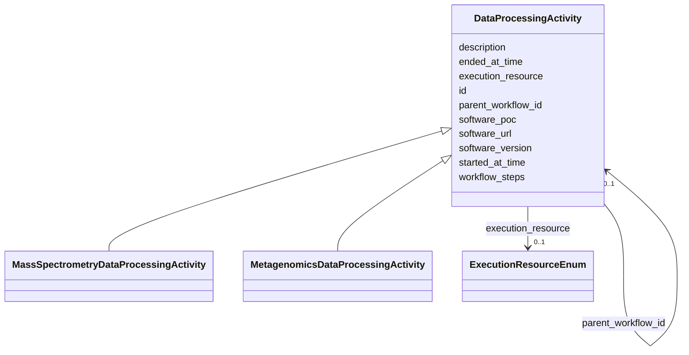

# Class: DataProcessingActivity 


_Abstract base for any data processing activity. Input data should _

_be specified on workflow subclasses._


* __NOTE__: this is an abstract class and should not be instantiated directly


URI: [analysis_api_schema:DataProcessingActivity](https://w3id.org/MONet/analysis-api-schema/DataProcessingActivity)





## Inheritance
* **DataProcessingActivity**
    * [MassSpectrometryDataProcessingActivity](MassSpectrometryDataProcessingActivity.md)
    * [MetagenomicsDataProcessingActivity](MetagenomicsDataProcessingActivity.md)


## Slots

| Name | Cardinality and Range | Description | Inheritance |
| ---  | --- | --- | --- |
| [parent_workflow_id](parent_workflow_id.md) | 0..1 <br/> [DataProcessingActivity](DataProcessingActivity.md) | Self-referential FK to the preceding DataProcessingActivity in a chain | direct |
| [workflow_steps](workflow_steps.md) | 0..1 <br/> [String](String.md) | Per-run workflow parameters | direct |
| [description](description.md) | 0..1 <br/> [String](String.md) | A human-readable description of the data analysis workflow | direct |
| [id](id.md) | 1 <br/> [Uuid](Uuid.md) |  | direct |
| [started_at_time](started_at_time.md) | 1 <br/> [Datetime](Datetime.md) |  | direct |
| [ended_at_time](ended_at_time.md) | 0..1 <br/> [Datetime](Datetime.md) |  | direct |
| [software_url](software_url.md) | 0..1 <br/> [String](String.md) |  | direct |
| [software_version](software_version.md) | 0..1 <br/> [String](String.md) |  | direct |
| [software_poc](software_poc.md) | 0..1 <br/> [String](String.md) |  | direct |
| [execution_resource](execution_resource.md) | 0..1 <br/> [ExecutionResourceEnum](ExecutionResourceEnum.md) |  | direct |


## Usages

| used by | used in | type | used |
| ---  | --- | --- | --- |
| [DataProcessingActivity](DataProcessingActivity.md) | [parent_workflow_id](parent_workflow_id.md) | range | [DataProcessingActivity](DataProcessingActivity.md) |
| [WorkflowExecutionFunctionalAnnotation](WorkflowExecutionFunctionalAnnotation.md) | [workflow_id](workflow_id.md) | range | [DataProcessingActivity](DataProcessingActivity.md) |
| [MassSpectrometryDataProcessingActivity](MassSpectrometryDataProcessingActivity.md) | [parent_workflow_id](parent_workflow_id.md) | range | [DataProcessingActivity](DataProcessingActivity.md) |
| [MetagenomicsDataProcessingActivity](MetagenomicsDataProcessingActivity.md) | [parent_workflow_id](parent_workflow_id.md) | range | [DataProcessingActivity](DataProcessingActivity.md) |


## Identifier and Mapping Information


### Schema Source


* from schema: https://w3id.org/MONet/analysis-api-schema


## Mappings

| Mapping Type | Mapped Value |
| ---  | ---  |
| self | analysis_api_schema:DataProcessingActivity |
| native | analysis_api_schema:DataProcessingActivity |


## LinkML Source

<!-- TODO: investigate https://stackoverflow.com/questions/37606292/how-to-create-tabbed-code-blocks-in-mkdocs-or-sphinx -->

### Direct

<details>
```yaml
name: DataProcessingActivity
description: "Abstract base for any data processing activity. Input data should \n\
  be specified on workflow subclasses."
from_schema: https://w3id.org/MONet/analysis-api-schema
abstract: true
slots:
- parent_workflow_id
- workflow_steps
- description
slot_usage:
  description:
    name: description
    description: A human-readable description of the data analysis workflow. May  include
      details such as the purpose, output, and/or main steps of  the workflow.
attributes:
  id:
    name: id
    from_schema: https://w3id.org/MONet/analysis-api-schema
    identifier: true
    domain_of:
    - Activity
    - Entity
    - DataProduct
    - DataGenerationActivity
    - DataProcessingActivity
    - AlternativeIdentifier
    - FunctionalAnnotationIdentifier
    - Instrument
    - OntologyClass
    - ContainerType
    - Custodian
    - InstrumentAlternativeIdentifier
    - LabDevice
    - SampleProcessing
    - ProcessingSampleLink
    - Configuration
    - MobilePhaseSegment
    - MassSpectrometryStandardRun
    - PurchasedMaterial
    - LabProcessingActivity
    - MAOMProduct
    - WEOMProduct
    - Site
    - Sample
    - AerosolArmSample
    - AerosolSample
    - AMP2UserSample
    - CommerciallyPurchasedSample
    - CultureEnvironmentalSample
    - EngineeredStrainSample
    - FieldDeployedTerraformSample
    - MixedCultureSample
    - MonetSoilSample
    - OtherUndescribedSample
    - PlantSample
    - PureCultureSample
    - SedimentSample
    - SoilSample
    - SynthesizedMaterialSample
    - TerraformSample
    - WaterSample
    - ProcessedSample
    - CoreSection
    - SamplingActivity
    - AerosolArmSamplingActivity
    - AerosolSamplingActivity
    - CommerciallyPurchasedSamplingActivity
    - CultureEnvironmentalSamplingActivity
    - EngineeredStrainSamplingActivity
    - FieldDeployedTerraformSamplingActivity
    - MixedCultureSamplingActivity
    - MonetSoilSamplingActivity
    - OtherUndescribedSamplingActivity
    - PlantSamplingActivity
    - PureCultureSamplingActivity
    - SedimentSamplingActivity
    - SoilSamplingActivity
    - SynthesizedMaterialSamplingActivity
    - TerraformSamplingActivity
    - WaterSamplingActivity
    - biological_entity
    - Study
    - ProjectParticipant
    - TimestampValue
    - TextValue
    - SoftwareControlledTermValue
    - ControlledTermValue
    - PersonValue
    - QuantityValue
    - ConditioningValue
    - zipDownload
    range: uuid
    required: true
  started_at_time:
    name: started_at_time
    from_schema: https://w3id.org/MONet/analysis-api-schema
    domain_of:
    - Activity
    - DataProcessingActivity
    range: datetime
    required: true
  ended_at_time:
    name: ended_at_time
    from_schema: https://w3id.org/MONet/analysis-api-schema
    domain_of:
    - Activity
    - DataProcessingActivity
    range: datetime
  software_url:
    name: software_url
    from_schema: https://w3id.org/MONet/analysis-api-schema
    rank: 1000
    domain_of:
    - DataProcessingActivity
    range: string
  software_version:
    name: software_version
    from_schema: https://w3id.org/MONet/analysis-api-schema
    domain_of:
    - InstrumentData
    - DataProcessingActivity
    range: string
  software_poc:
    name: software_poc
    from_schema: https://w3id.org/MONet/analysis-api-schema
    rank: 1000
    domain_of:
    - DataProcessingActivity
    range: string
  execution_resource:
    name: execution_resource
    from_schema: https://w3id.org/MONet/analysis-api-schema
    rank: 1000
    domain_of:
    - DataProcessingActivity
    range: ExecutionResourceEnum

```
</details>

### Induced

<details>
```yaml
name: DataProcessingActivity
description: "Abstract base for any data processing activity. Input data should \n\
  be specified on workflow subclasses."
from_schema: https://w3id.org/MONet/analysis-api-schema
abstract: true
slot_usage:
  description:
    name: description
    description: A human-readable description of the data analysis workflow. May  include
      details such as the purpose, output, and/or main steps of  the workflow.
attributes:
  id:
    name: id
    from_schema: https://w3id.org/MONet/analysis-api-schema
    identifier: true
    alias: id
    owner: DataProcessingActivity
    domain_of:
    - Activity
    - Entity
    - DataProduct
    - DataGenerationActivity
    - DataProcessingActivity
    - AlternativeIdentifier
    - FunctionalAnnotationIdentifier
    - Instrument
    - OntologyClass
    - ContainerType
    - Custodian
    - InstrumentAlternativeIdentifier
    - LabDevice
    - SampleProcessing
    - ProcessingSampleLink
    - Configuration
    - MobilePhaseSegment
    - MassSpectrometryStandardRun
    - PurchasedMaterial
    - LabProcessingActivity
    - MAOMProduct
    - WEOMProduct
    - Site
    - Sample
    - AerosolArmSample
    - AerosolSample
    - AMP2UserSample
    - CommerciallyPurchasedSample
    - CultureEnvironmentalSample
    - EngineeredStrainSample
    - FieldDeployedTerraformSample
    - MixedCultureSample
    - MonetSoilSample
    - OtherUndescribedSample
    - PlantSample
    - PureCultureSample
    - SedimentSample
    - SoilSample
    - SynthesizedMaterialSample
    - TerraformSample
    - WaterSample
    - ProcessedSample
    - CoreSection
    - SamplingActivity
    - AerosolArmSamplingActivity
    - AerosolSamplingActivity
    - CommerciallyPurchasedSamplingActivity
    - CultureEnvironmentalSamplingActivity
    - EngineeredStrainSamplingActivity
    - FieldDeployedTerraformSamplingActivity
    - MixedCultureSamplingActivity
    - MonetSoilSamplingActivity
    - OtherUndescribedSamplingActivity
    - PlantSamplingActivity
    - PureCultureSamplingActivity
    - SedimentSamplingActivity
    - SoilSamplingActivity
    - SynthesizedMaterialSamplingActivity
    - TerraformSamplingActivity
    - WaterSamplingActivity
    - biological_entity
    - Study
    - ProjectParticipant
    - TimestampValue
    - TextValue
    - SoftwareControlledTermValue
    - ControlledTermValue
    - PersonValue
    - QuantityValue
    - ConditioningValue
    - zipDownload
    range: uuid
    required: true
  started_at_time:
    name: started_at_time
    from_schema: https://w3id.org/MONet/analysis-api-schema
    alias: started_at_time
    owner: DataProcessingActivity
    domain_of:
    - Activity
    - DataProcessingActivity
    range: datetime
    required: true
  ended_at_time:
    name: ended_at_time
    from_schema: https://w3id.org/MONet/analysis-api-schema
    alias: ended_at_time
    owner: DataProcessingActivity
    domain_of:
    - Activity
    - DataProcessingActivity
    range: datetime
  software_url:
    name: software_url
    from_schema: https://w3id.org/MONet/analysis-api-schema
    rank: 1000
    alias: software_url
    owner: DataProcessingActivity
    domain_of:
    - DataProcessingActivity
    range: string
  software_version:
    name: software_version
    from_schema: https://w3id.org/MONet/analysis-api-schema
    alias: software_version
    owner: DataProcessingActivity
    domain_of:
    - InstrumentData
    - DataProcessingActivity
    range: string
  software_poc:
    name: software_poc
    from_schema: https://w3id.org/MONet/analysis-api-schema
    rank: 1000
    alias: software_poc
    owner: DataProcessingActivity
    domain_of:
    - DataProcessingActivity
    range: string
  execution_resource:
    name: execution_resource
    from_schema: https://w3id.org/MONet/analysis-api-schema
    rank: 1000
    alias: execution_resource
    owner: DataProcessingActivity
    domain_of:
    - DataProcessingActivity
    range: ExecutionResourceEnum
  parent_workflow_id:
    name: parent_workflow_id
    description: "Self-referential FK to the preceding DataProcessingActivity in a\
      \ chain.\nNULL -> first (or standalone) step.\nNon-null -> this execution directly\
      \ follows parent_workflow_id.\nEnables single-hop chaining queries; full traversal\
      \ via linkage_cache.\n\nDDL: ALTER TABLE \"DataProcessingActivity\"\n      \
      \ ADD COLUMN parent_workflow_id UUID\n       REFERENCES \"DataProcessingActivity\"\
      (id);"
    from_schema: https://w3id.org/MONet/analysis-api-schema
    rank: 1000
    alias: parent_workflow_id
    owner: DataProcessingActivity
    domain_of:
    - DataProcessingActivity
    range: DataProcessingActivity
    required: false
  workflow_steps:
    name: workflow_steps
    description: 'Per-run workflow parameters. Previously annotated TODO JSONB in
      schema.

      Direction: structured key-value pairs keyed by workflow type.

      Schema for allowed keys TBD per workflow type before full implementation.'
    from_schema: https://w3id.org/MONet/analysis-api-schema
    rank: 1000
    alias: workflow_steps
    owner: DataProcessingActivity
    domain_of:
    - DataProcessingActivity
    range: string
    required: false
  description:
    name: description
    description: A human-readable description of the data analysis workflow. May  include
      details such as the purpose, output, and/or main steps of  the workflow.
    title: description
    from_schema: https://w3id.org/MONet/analysis-api-schema
    rank: 1000
    alias: description
    owner: DataProcessingActivity
    domain_of:
    - Activity
    - Entity
    - DataProduct
    - DataGenerationActivity
    - DataProcessingActivity
    - OntologyClass
    - ContainerType
    - LabDevice
    - Configuration
    - MassSpectrometryStandardRun
    - PurchasedMaterial
    - LabProcessingActivity
    - Site
    - Sample
    - SamplingActivity
    - SoilSamplingActivity
    - biological_entity
    - Study
    - TimestampValue
    - TextValue
    - SoftwareControlledTermValue
    - ControlledTermValue
    - QuantityValue
    range: string

```
</details>