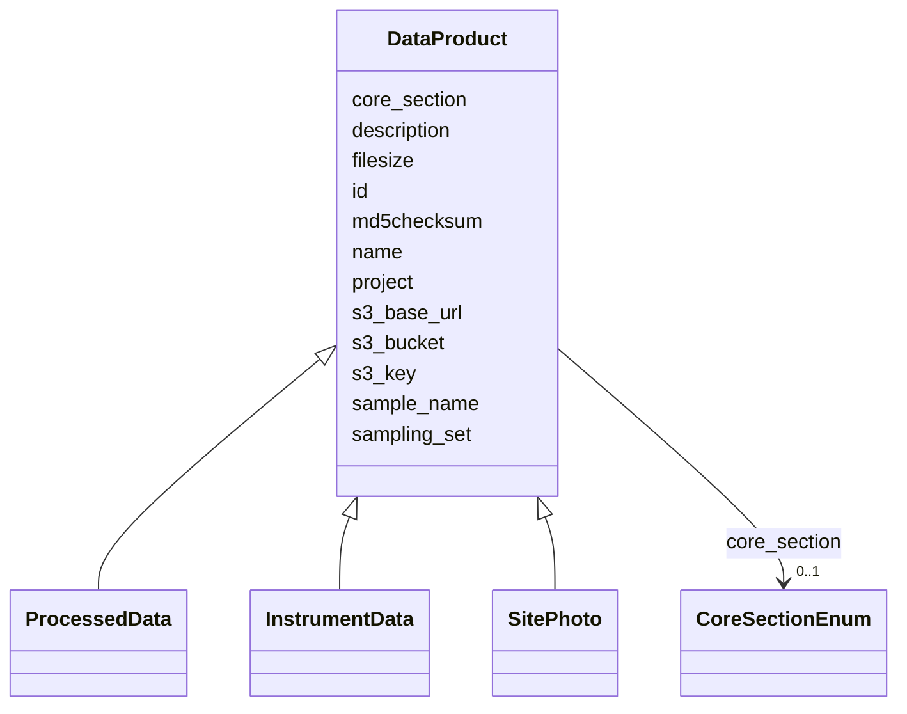

# Class: DataProduct 


_Abstract base class for raw or processed data accessible in S3 storage._

_Carries S3-pointer and sample-linkage slots shared across product types._

_processedData and future sitePhoto extend this via is_a._

_No direct database table, subclasses map to tables._


* __NOTE__: this is an abstract class and should not be instantiated directly


URI: [analysis_api_schema:DataProduct](https://w3id.org/MONet/analysis-api-schema/DataProduct)





## Inheritance
* **DataProduct**
    * [ProcessedData](ProcessedData.md)
    * [InstrumentData](InstrumentData.md)
    * [SitePhoto](SitePhoto.md)


## Slots

| Name | Cardinality and Range | Description | Inheritance |
| ---  | --- | --- | --- |
| [name](name.md) | 1 <br/> [String](String.md) | Human-readable name for the entity or activity | direct |
| [description](description.md) | 0..1 <br/> [String](String.md) | Human-readable description for the entity or activity | direct |
| [project](project.md) | 0..1 <br/> [Integer](Integer.md) | Identifier for the user project associated with the entity or activity | direct |
| [sampling_set](sampling_set.md) | 0..1 <br/> [Integer](Integer.md) | Sampling set number for grouping related samples collected together | direct |
| [core_section](core_section.md) | 0..1 <br/> [CoreSectionEnum](CoreSectionEnum.md) | The section of the core | direct |
| [sample_name](sample_name.md) | 0..1 <br/> [String](String.md) | The name or label that is present on the shipped sample | direct |
| [s3_base_url](s3_base_url.md) | 0..1 <br/> [String](String.md) |  | direct |
| [s3_bucket](s3_bucket.md) | 0..1 <br/> [String](String.md) |  | direct |
| [s3_key](s3_key.md) | 1 <br/> [String](String.md) | MinIO/S3 object key; required for all data products | direct |
| [filesize](filesize.md) | 0..1 <br/> [Integer](Integer.md) | Size of the file in bytes | direct |
| [md5checksum](md5checksum.md) | 0..1 <br/> [String](String.md) |  | direct |
| [id](id.md) | 1 <br/> [Uuid](Uuid.md) |  | direct |


## Identifier and Mapping Information


### Schema Source


* from schema: https://w3id.org/MONet/analysis-api-schema


## Mappings

| Mapping Type | Mapped Value |
| ---  | ---  |
| self | analysis_api_schema:DataProduct |
| native | analysis_api_schema:DataProduct |


## LinkML Source

<!-- TODO: investigate https://stackoverflow.com/questions/37606292/how-to-create-tabbed-code-blocks-in-mkdocs-or-sphinx -->

### Direct

<details>
```yaml
name: DataProduct
description: 'Abstract base class for raw or processed data accessible in S3 storage.

  Carries S3-pointer and sample-linkage slots shared across product types.

  processedData and future sitePhoto extend this via is_a.

  No direct database table, subclasses map to tables.'
from_schema: https://w3id.org/MONet/analysis-api-schema
abstract: true
slots:
- name
- description
- project
- sampling_set
- core_section
- sample_name
- s3_base_url
- s3_bucket
- s3_key
- filesize
- md5checksum
attributes:
  id:
    name: id
    from_schema: https://w3id.org/MONet/analysis-api-schema
    identifier: true
    domain_of:
    - Activity
    - Entity
    - DataProduct
    - DataGenerationActivity
    - DataProcessingActivity
    - AlternativeIdentifier
    - FunctionalAnnotationIdentifier
    - Instrument
    - OntologyClass
    - ContainerType
    - Custodian
    - InstrumentAlternativeIdentifier
    - LabDevice
    - SampleProcessing
    - ProcessingSampleLink
    - Configuration
    - MobilePhaseSegment
    - MassSpectrometryStandardRun
    - PurchasedMaterial
    - LabProcessingActivity
    - organism
    - MAOMProduct
    - WEOMProduct
    - Site
    - Sample
    - AerosolArmSample
    - AerosolSample
    - AMP2UserSample
    - CommerciallyPurchasedSample
    - CultureEnvironmentalSample
    - EngineeredStrainSample
    - FieldDeployedTerraformSample
    - MixedCultureSample
    - MonetSoilSample
    - OtherUndescribedSample
    - PlantSample
    - PureCultureSample
    - SedimentSample
    - SoilSample
    - SynthesizedMaterialSample
    - TerraformSample
    - WaterSample
    - ProcessedSample
    - CoreSection
    - SamplingActivity
    - AerosolArmSamplingActivity
    - AerosolSamplingActivity
    - CommerciallyPurchasedSamplingActivity
    - CultureEnvironmentalSamplingActivity
    - EngineeredStrainSamplingActivity
    - FieldDeployedTerraformSamplingActivity
    - MixedCultureSamplingActivity
    - MonetSoilSamplingActivity
    - OtherUndescribedSamplingActivity
    - PlantSamplingActivity
    - PureCultureSamplingActivity
    - SedimentSamplingActivity
    - SoilSamplingActivity
    - SynthesizedMaterialSamplingActivity
    - TerraformSamplingActivity
    - WaterSamplingActivity
    - Study
    - ProjectParticipant
    - TimestampValue
    - TextValue
    - SoftwareControlledTermValue
    - ControlledTermValue
    - PersonValue
    - QuantityValue
    - ConditioningValue
    - zipDownload
    range: uuid
    required: true

```
</details>

### Induced

<details>
```yaml
name: DataProduct
description: 'Abstract base class for raw or processed data accessible in S3 storage.

  Carries S3-pointer and sample-linkage slots shared across product types.

  processedData and future sitePhoto extend this via is_a.

  No direct database table, subclasses map to tables.'
from_schema: https://w3id.org/MONet/analysis-api-schema
abstract: true
attributes:
  id:
    name: id
    from_schema: https://w3id.org/MONet/analysis-api-schema
    identifier: true
    alias: id
    owner: DataProduct
    domain_of:
    - Activity
    - Entity
    - DataProduct
    - DataGenerationActivity
    - DataProcessingActivity
    - AlternativeIdentifier
    - FunctionalAnnotationIdentifier
    - Instrument
    - OntologyClass
    - ContainerType
    - Custodian
    - InstrumentAlternativeIdentifier
    - LabDevice
    - SampleProcessing
    - ProcessingSampleLink
    - Configuration
    - MobilePhaseSegment
    - MassSpectrometryStandardRun
    - PurchasedMaterial
    - LabProcessingActivity
    - organism
    - MAOMProduct
    - WEOMProduct
    - Site
    - Sample
    - AerosolArmSample
    - AerosolSample
    - AMP2UserSample
    - CommerciallyPurchasedSample
    - CultureEnvironmentalSample
    - EngineeredStrainSample
    - FieldDeployedTerraformSample
    - MixedCultureSample
    - MonetSoilSample
    - OtherUndescribedSample
    - PlantSample
    - PureCultureSample
    - SedimentSample
    - SoilSample
    - SynthesizedMaterialSample
    - TerraformSample
    - WaterSample
    - ProcessedSample
    - CoreSection
    - SamplingActivity
    - AerosolArmSamplingActivity
    - AerosolSamplingActivity
    - CommerciallyPurchasedSamplingActivity
    - CultureEnvironmentalSamplingActivity
    - EngineeredStrainSamplingActivity
    - FieldDeployedTerraformSamplingActivity
    - MixedCultureSamplingActivity
    - MonetSoilSamplingActivity
    - OtherUndescribedSamplingActivity
    - PlantSamplingActivity
    - PureCultureSamplingActivity
    - SedimentSamplingActivity
    - SoilSamplingActivity
    - SynthesizedMaterialSamplingActivity
    - TerraformSamplingActivity
    - WaterSamplingActivity
    - Study
    - ProjectParticipant
    - TimestampValue
    - TextValue
    - SoftwareControlledTermValue
    - ControlledTermValue
    - PersonValue
    - QuantityValue
    - ConditioningValue
    - zipDownload
    range: uuid
    required: true
  name:
    name: name
    description: Human-readable name for the entity or activity.
    from_schema: https://w3id.org/MONet/analysis-api-schema
    rank: 1000
    alias: name
    owner: DataProduct
    domain_of:
    - Activity
    - Entity
    - DataProduct
    - DataGenerationActivity
    - Instrument
    - OntologyClass
    - ContainerAxis
    - Configuration
    - MobilePhaseSegment
    - MassSpectrometryStandardRun
    - PurchasedMaterial
    - LabProcessingActivity
    - organism
    - Site
    - Sample
    - SamplingActivity
    - SoilSamplingActivity
    - Study
    - SoftwareControlledTermValue
    range: string
    required: true
  description:
    name: description
    description: Human-readable description for the entity or activity
    title: description
    from_schema: https://w3id.org/MONet/analysis-api-schema
    rank: 1000
    alias: description
    owner: DataProduct
    domain_of:
    - Activity
    - Entity
    - DataProduct
    - DataGenerationActivity
    - DataProcessingActivity
    - OntologyClass
    - ContainerType
    - LabDevice
    - Configuration
    - MassSpectrometryStandardRun
    - PurchasedMaterial
    - LabProcessingActivity
    - organism
    - Site
    - Sample
    - SamplingActivity
    - SoilSamplingActivity
    - Study
    - TimestampValue
    - TextValue
    - SoftwareControlledTermValue
    - ControlledTermValue
    - QuantityValue
    range: string
  project:
    name: project
    description: 'Identifier for the user project associated with the entity or activity. '
    title: Project
    todos:
    - should this be an ID? CURIE can use the one NMDC has https://bioregistry.io/reference/emsl.project:60141
      where emsl.project is the CURIE prefix
    from_schema: https://w3id.org/MONet/analysis-api-schema
    aliases:
    - study
    - study_id
    - project_id
    - proposal
    - proposal_id
    rank: 1000
    alias: project
    owner: DataProduct
    domain_of:
    - DataProduct
    - AerosolArmSample
    - AerosolSample
    - CommerciallyPurchasedSample
    - CultureEnvironmentalSample
    - FieldDeployedTerraformSample
    - MixedCultureSample
    - MonetSoilSample
    - OtherUndescribedSample
    - PlantSample
    - PureCultureSample
    - SedimentSample
    - SoilSample
    - SynthesizedMaterialSample
    - TerraformSample
    - WaterSample
    - SamplingActivity
    range: integer
  sampling_set:
    name: sampling_set
    description: 'Sampling set number for grouping related samples collected together.

      This is a user-defined sequential integer that can be used to link samples collected

      in the same sampling event or campaign.'
    title: sampling set
    from_schema: https://w3id.org/MONet/analysis-api-schema
    rank: 1000
    alias: sampling_set
    owner: DataProduct
    domain_of:
    - DataProduct
    - MonetSoilSample
    range: integer
  core_section:
    name: core_section
    description: The section of the core.
    title: core section
    examples:
    - value: TOP
    - value: MID
    - value: BTM
    from_schema: https://w3id.org/MONet/analysis-api-schema
    rank: 1000
    alias: core_section
    owner: DataProduct
    domain_of:
    - DataProduct
    - CoreSection
    range: CoreSectionEnum
  sample_name:
    name: sample_name
    description: 'The name or label that is present on the shipped sample. This should

      be a human readable name.'
    title: sample name
    notes:
    - This is typically an alias for the inherited 'name' slot on Sample classes.
      Defined separately for compatibility with source data files using 'sample_name'
      column headers.
    from_schema: https://w3id.org/MONet/analysis-api-schema
    aliases:
    - samp_name
    rank: 1000
    alias: sample_name
    owner: DataProduct
    domain_of:
    - DataProduct
    - AerosolArmSample
    - AerosolSample
    - CommerciallyPurchasedSample
    - CultureEnvironmentalSample
    - FieldDeployedTerraformSample
    - MixedCultureSample
    - MonetSoilSample
    - OtherUndescribedSample
    - PlantSample
    - PureCultureSample
    - SedimentSample
    - SoilSample
    - SynthesizedMaterialSample
    - TerraformSample
    - WaterSample
    range: string
  s3_base_url:
    name: s3_base_url
    from_schema: https://w3id.org/MONet/analysis-api-schema
    rank: 1000
    alias: s3_base_url
    owner: DataProduct
    domain_of:
    - DataProduct
    range: string
  s3_bucket:
    name: s3_bucket
    from_schema: https://w3id.org/MONet/analysis-api-schema
    rank: 1000
    alias: s3_bucket
    owner: DataProduct
    domain_of:
    - DataProduct
    range: string
  s3_key:
    name: s3_key
    description: MinIO/S3 object key; required for all data products
    from_schema: https://w3id.org/MONet/analysis-api-schema
    rank: 1000
    alias: s3_key
    owner: DataProduct
    domain_of:
    - DataProduct
    range: string
    required: true
  filesize:
    name: filesize
    description: Size of the file in bytes
    from_schema: https://w3id.org/MONet/analysis-api-schema
    rank: 1000
    alias: filesize
    owner: DataProduct
    domain_of:
    - DataProduct
    range: integer
  md5checksum:
    name: md5checksum
    from_schema: https://w3id.org/MONet/analysis-api-schema
    rank: 1000
    alias: md5checksum
    owner: DataProduct
    domain_of:
    - DataProduct
    range: string

```
</details>