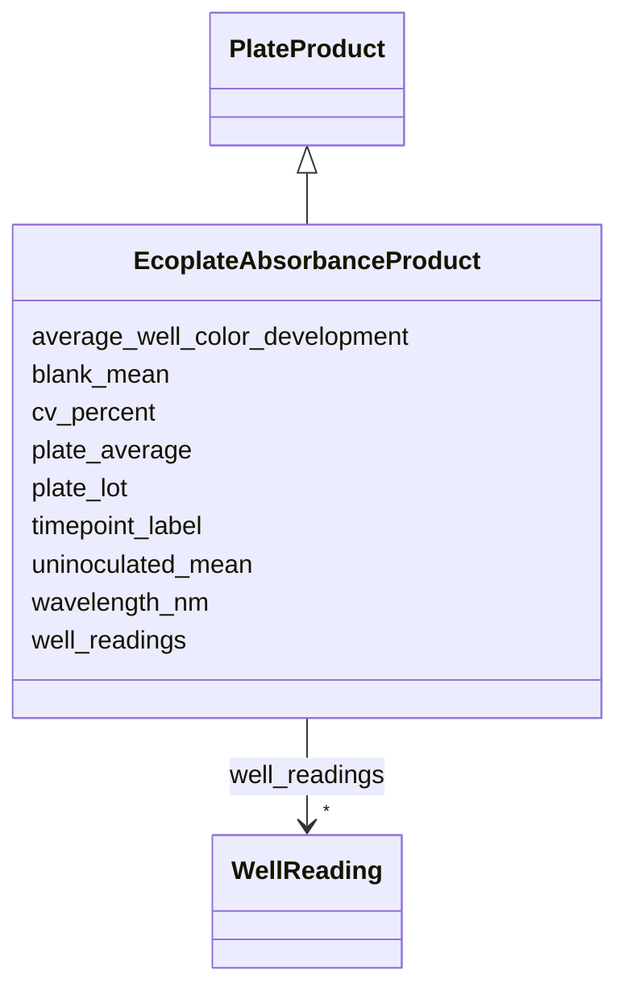

# Class: EcoplateAbsorbanceProduct 


_Ecoplate absorbance measurement product._

_One row per plate × timepoint._

_processedData.type = 'ecoplate_absorbance'_

__

_v1 origin: plate-general.yaml EcoplateAbsorbanceProduct_


URI: [analysis_api_schema:EcoplateAbsorbanceProduct](https://w3id.org/MONet/analysis-api-schema/EcoplateAbsorbanceProduct)





## Inheritance
* [PlateProduct](PlateProduct.md)
    * **EcoplateAbsorbanceProduct**


## Slots

| Name | Cardinality and Range | Description | Inheritance |
| ---  | --- | --- | --- |
| [plate_lot](plate_lot.md) | 0..1 <br/> [String](String.md) | Manufacturer lot number for Biolog EcoPlate QC | direct |
| [uninoculated_mean](uninoculated_mean.md) | 0..1 <br/> [Float](Float.md) | Mean measurement of uninoculated control wells (baseline for Ecoplate) | direct |
| [average_well_color_development](average_well_color_development.md) | 0..1 <br/> [Float](Float.md) | Average Well Color Development (AWCD) metric for Ecoplate | direct |
| [wavelength_nm](wavelength_nm.md) | 1 <br/> [Integer](Integer.md) | Measurement wavelength in nanometres (e | [PlateProduct](PlateProduct.md) |
| [timepoint_label](timepoint_label.md) | 1 <br/> [String](String.md) | Human-readable timepoint label for repeated-measurement series | [PlateProduct](PlateProduct.md) |
| [plate_average](plate_average.md) | 0..1 <br/> [Float](Float.md) | Mean measurement across all sample wells (excludes blanks) | [PlateProduct](PlateProduct.md) |
| [blank_mean](blank_mean.md) | 0..1 <br/> [Float](Float.md) | Mean measurement of uninoculated control wells | [PlateProduct](PlateProduct.md) |
| [cv_percent](cv_percent.md) | 0..1 <br/> [Float](Float.md) | Coefficient of variation across technical replicates | [PlateProduct](PlateProduct.md) |
| [well_readings](well_readings.md) | * <br/> [WellReading](WellReading.md) | Structured per-well measurement data array | [PlateProduct](PlateProduct.md) |


## Identifier and Mapping Information


### Schema Source


* from schema: https://w3id.org/MONet/analysis-api-schema


## Mappings

| Mapping Type | Mapped Value |
| ---  | ---  |
| self | analysis_api_schema:EcoplateAbsorbanceProduct |
| native | analysis_api_schema:EcoplateAbsorbanceProduct |


## LinkML Source

<!-- TODO: investigate https://stackoverflow.com/questions/37606292/how-to-create-tabbed-code-blocks-in-mkdocs-or-sphinx -->

### Direct

<details>
```yaml
name: EcoplateAbsorbanceProduct
description: 'Ecoplate absorbance measurement product.

  One row per plate × timepoint.

  processedData.type = ''ecoplate_absorbance''


  v1 origin: plate-general.yaml EcoplateAbsorbanceProduct'
from_schema: https://w3id.org/MONet/analysis-api-schema
is_a: PlateProduct
slots:
- plate_lot
- uninoculated_mean
- average_well_color_development

```
</details>

### Induced

<details>
```yaml
name: EcoplateAbsorbanceProduct
description: 'Ecoplate absorbance measurement product.

  One row per plate × timepoint.

  processedData.type = ''ecoplate_absorbance''


  v1 origin: plate-general.yaml EcoplateAbsorbanceProduct'
from_schema: https://w3id.org/MONet/analysis-api-schema
is_a: PlateProduct
attributes:
  plate_lot:
    name: plate_lot
    description: Manufacturer lot number for Biolog EcoPlate QC
    from_schema: https://w3id.org/MONet/analysis-api-schema
    rank: 1000
    alias: plate_lot
    owner: EcoplateAbsorbanceProduct
    domain_of:
    - EcoplateAbsorbanceProduct
    range: string
  uninoculated_mean:
    name: uninoculated_mean
    description: Mean measurement of uninoculated control wells (baseline for Ecoplate)
    todos:
    - units
    from_schema: https://w3id.org/MONet/analysis-api-schema
    rank: 1000
    alias: uninoculated_mean
    owner: EcoplateAbsorbanceProduct
    domain_of:
    - EcoplateAbsorbanceProduct
    range: float
  average_well_color_development:
    name: average_well_color_development
    description: Average Well Color Development (AWCD) metric for Ecoplate
    todos:
    - units
    from_schema: https://w3id.org/MONet/analysis-api-schema
    rank: 1000
    alias: average_well_color_development
    owner: EcoplateAbsorbanceProduct
    domain_of:
    - EcoplateAbsorbanceProduct
    range: float
  wavelength_nm:
    name: wavelength_nm
    description: Measurement wavelength in nanometres (e.g. 590 Ecoplate, 610 AMP2
      OD)
    from_schema: https://w3id.org/MONet/analysis-api-schema
    rank: 1000
    alias: wavelength_nm
    owner: EcoplateAbsorbanceProduct
    domain_of:
    - AMP2DataGenerationActivity
    - EcoplateDataGenerationActivity
    - PlateProduct
    range: integer
    required: true
  timepoint_label:
    name: timepoint_label
    description: 'Human-readable timepoint label for repeated-measurement series.

      Examples: "t=0", "t=24h", "t=48h".

      Lives on concrete analysis/product subclasses, NOT on base DataGenerationActivity'
    from_schema: https://w3id.org/MONet/analysis-api-schema
    rank: 1000
    alias: timepoint_label
    owner: EcoplateAbsorbanceProduct
    domain_of:
    - PlateDataGenerationActivity
    - PlateProduct
    range: string
    required: true
  plate_average:
    name: plate_average
    description: Mean measurement across all sample wells (excludes blanks)
    todos:
    - units
    from_schema: https://w3id.org/MONet/analysis-api-schema
    rank: 1000
    alias: plate_average
    owner: EcoplateAbsorbanceProduct
    domain_of:
    - PlateProduct
    range: float
  blank_mean:
    name: blank_mean
    description: Mean measurement of uninoculated control wells
    todos:
    - units
    from_schema: https://w3id.org/MONet/analysis-api-schema
    rank: 1000
    alias: blank_mean
    owner: EcoplateAbsorbanceProduct
    domain_of:
    - PlateProduct
    range: float
  cv_percent:
    name: cv_percent
    description: Coefficient of variation across technical replicates
    from_schema: https://w3id.org/MONet/analysis-api-schema
    rank: 1000
    alias: cv_percent
    owner: EcoplateAbsorbanceProduct
    domain_of:
    - PlateProduct
    range: float
  well_readings:
    name: well_readings
    description: 'Structured per-well measurement data array.

      Lightweight summary for SQL queries without full file download.

      Raw data still accessible via processedData.s3_key in MinIO.

      typed via LinkML inlined class.'
    todos:
    - decide how to represent in backend (normalized child table with FK to PlateSetupActivity,
      array column, or other)
    from_schema: https://w3id.org/MONet/analysis-api-schema
    rank: 1000
    alias: well_readings
    owner: EcoplateAbsorbanceProduct
    domain_of:
    - PlateProduct
    range: WellReading
    multivalued: true
    inlined: true
    inlined_as_list: true

```
</details>