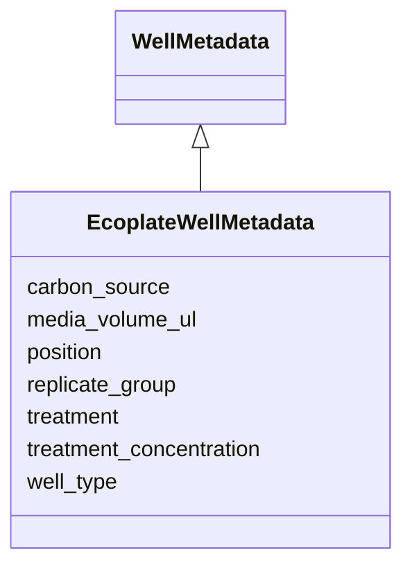

# Class: EcoplateWellMetadata 


_Ecoplate-specific per-well metadata._

_Rich   no media entity; carbon source and treatment are per-well_

_experimental design variables._

__

_v1 origin: plate-general.yaml EcoplateWellMetadata_


URI: [basalt_schema:EcoplateWellMetadata](https://emsl-computing.github.io/BASALT-Schema/elements/EcoplateWellMetadata)





## Inheritance
* [WellMetadata](WellMetadata.md)
    * **EcoplateWellMetadata**


## Slots

| Name | Cardinality and Range | Description | Inheritance |
| ---  | --- | --- | --- |
| [media_volume_ul](media_volume_ul.md) | 1 <br/> [Float](Float.md) | Volume of inoculum suspension added (microlitres) | direct |
| [carbon_source](carbon_source.md) | 1 <br/> [String](String.md) | Carbon source in this well (e | direct |
| [treatment](treatment.md) | 0..1 <br/> [String](String.md) | Experimental treatment (e | direct |
| [treatment_concentration](treatment_concentration.md) | 0..1 <br/> [String](String.md) | Treatment concentration with unit (e | direct |
| [position](position.md) | 1 <br/> [String](String.md) | Well position (e | [WellMetadata](WellMetadata.md) |
| [well_type](well_type.md) | 0..1 <br/> [String](String.md) | Role of this well   "sample", "blank", "uninoculated_control", "standard" | [WellMetadata](WellMetadata.md) |
| [replicate_group](replicate_group.md) | 0..1 <br/> [String](String.md) | Identifier linking technical replicates (e | [WellMetadata](WellMetadata.md) |


## Identifier and Mapping Information


### Schema Source


* from schema: https://emsl-computing.github.io/BASALT-Schema


## Mappings

| Mapping Type | Mapped Value |
| ---  | ---  |
| self | basalt_schema:EcoplateWellMetadata |
| native | basalt_schema:EcoplateWellMetadata |


## LinkML Source

<!-- TODO: investigate https://stackoverflow.com/questions/37606292/how-to-create-tabbed-code-blocks-in-mkdocs-or-sphinx -->

### Direct

<details>
```yaml
name: EcoplateWellMetadata
description: 'Ecoplate-specific per-well metadata.

  Rich   no media entity; carbon source and treatment are per-well

  experimental design variables.


  v1 origin: plate-general.yaml EcoplateWellMetadata'
from_schema: https://emsl-computing.github.io/BASALT-Schema
is_a: WellMetadata
attributes:
  media_volume_ul:
    name: media_volume_ul
    description: Volume of inoculum suspension added (microlitres)
    from_schema: https://emsl-computing.github.io/BASALT-Schema/media-strain-culture-plate
    domain_of:
    - AMP2WellMetadata
    - EcoplateWellMetadata
    range: float
    required: true
  carbon_source:
    name: carbon_source
    description: Carbon source in this well (e.g. "L-malic acid", "glucose")
    from_schema: https://emsl-computing.github.io/BASALT-Schema/media-strain-culture-plate
    rank: 1000
    domain_of:
    - EcoplateWellMetadata
    range: string
    required: true
  treatment:
    name: treatment
    description: Experimental treatment (e.g. "control", "nickel_1pct")
    from_schema: https://emsl-computing.github.io/BASALT-Schema/media-strain-culture-plate
    rank: 1000
    domain_of:
    - EcoplateWellMetadata
    range: string
  treatment_concentration:
    name: treatment_concentration
    description: Treatment concentration with unit (e.g. "1.0 pct", "10 mM")
    from_schema: https://emsl-computing.github.io/BASALT-Schema/media-strain-culture-plate
    rank: 1000
    domain_of:
    - EcoplateWellMetadata
    range: string

```
</details>

### Induced

<details>
```yaml
name: EcoplateWellMetadata
description: 'Ecoplate-specific per-well metadata.

  Rich   no media entity; carbon source and treatment are per-well

  experimental design variables.


  v1 origin: plate-general.yaml EcoplateWellMetadata'
from_schema: https://emsl-computing.github.io/BASALT-Schema
is_a: WellMetadata
attributes:
  media_volume_ul:
    name: media_volume_ul
    description: Volume of inoculum suspension added (microlitres)
    from_schema: https://emsl-computing.github.io/BASALT-Schema/media-strain-culture-plate
    alias: media_volume_ul
    owner: EcoplateWellMetadata
    domain_of:
    - AMP2WellMetadata
    - EcoplateWellMetadata
    range: float
    required: true
  carbon_source:
    name: carbon_source
    description: Carbon source in this well (e.g. "L-malic acid", "glucose")
    from_schema: https://emsl-computing.github.io/BASALT-Schema/media-strain-culture-plate
    rank: 1000
    alias: carbon_source
    owner: EcoplateWellMetadata
    domain_of:
    - EcoplateWellMetadata
    range: string
    required: true
  treatment:
    name: treatment
    description: Experimental treatment (e.g. "control", "nickel_1pct")
    from_schema: https://emsl-computing.github.io/BASALT-Schema/media-strain-culture-plate
    rank: 1000
    alias: treatment
    owner: EcoplateWellMetadata
    domain_of:
    - EcoplateWellMetadata
    range: string
  treatment_concentration:
    name: treatment_concentration
    description: Treatment concentration with unit (e.g. "1.0 pct", "10 mM")
    from_schema: https://emsl-computing.github.io/BASALT-Schema/media-strain-culture-plate
    rank: 1000
    alias: treatment_concentration
    owner: EcoplateWellMetadata
    domain_of:
    - EcoplateWellMetadata
    range: string
  position:
    name: position
    description: Well position (e.g. "A01", "H12")
    from_schema: https://emsl-computing.github.io/BASALT-Schema/media-strain-culture-plate
    rank: 1000
    alias: position
    owner: EcoplateWellMetadata
    domain_of:
    - WellMetadata
    - WellReading
    range: string
    required: true
  well_type:
    name: well_type
    description: Role of this well   "sample", "blank", "uninoculated_control", "standard"
    from_schema: https://emsl-computing.github.io/BASALT-Schema/media-strain-culture-plate
    rank: 1000
    alias: well_type
    owner: EcoplateWellMetadata
    domain_of:
    - WellMetadata
    range: string
  replicate_group:
    name: replicate_group
    description: Identifier linking technical replicates (e.g. "rep1", "rep2")
    from_schema: https://emsl-computing.github.io/BASALT-Schema/media-strain-culture-plate
    rank: 1000
    alias: replicate_group
    owner: EcoplateWellMetadata
    domain_of:
    - WellMetadata
    range: string

```
</details>