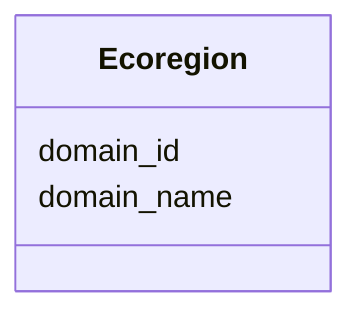

# Class: Ecoregion 


URI: [analysis_api_schema:Ecoregion](https://w3id.org/MONet/analysis-api-schema/Ecoregion)





<!-- no inheritance hierarchy -->


## Slots

| Name | Cardinality and Range | Description | Inheritance |
| ---  | --- | --- | --- |
| [domain_id](domain_id.md) | 1 <br/> [Integer](Integer.md) |  | direct |
| [domain_name](domain_name.md) | 1 <br/> [String](String.md) |  | direct |


## Identifier and Mapping Information


### Schema Source


* from schema: https://w3id.org/MONet/analysis-api-schema


## Mappings

| Mapping Type | Mapped Value |
| ---  | ---  |
| self | analysis_api_schema:Ecoregion |
| native | analysis_api_schema:Ecoregion |


## LinkML Source

<!-- TODO: investigate https://stackoverflow.com/questions/37606292/how-to-create-tabbed-code-blocks-in-mkdocs-or-sphinx -->

### Direct

<details>
```yaml
name: Ecoregion
from_schema: https://w3id.org/MONet/analysis-api-schema
rank: 1000
attributes:
  domain_id:
    name: domain_id
    from_schema: https://w3id.org/MONet/analysis-api-schema
    rank: 1000
    identifier: true
    domain_of:
    - Ecoregion
    range: integer
    required: true
  domain_name:
    name: domain_name
    from_schema: https://w3id.org/MONet/analysis-api-schema
    rank: 1000
    domain_of:
    - Ecoregion
    range: string
    required: true

```
</details>

### Induced

<details>
```yaml
name: Ecoregion
from_schema: https://w3id.org/MONet/analysis-api-schema
rank: 1000
attributes:
  domain_id:
    name: domain_id
    from_schema: https://w3id.org/MONet/analysis-api-schema
    rank: 1000
    identifier: true
    alias: domain_id
    owner: Ecoregion
    domain_of:
    - Ecoregion
    range: integer
    required: true
  domain_name:
    name: domain_name
    from_schema: https://w3id.org/MONet/analysis-api-schema
    rank: 1000
    alias: domain_name
    owner: Ecoregion
    domain_of:
    - Ecoregion
    range: string
    required: true

```
</details>