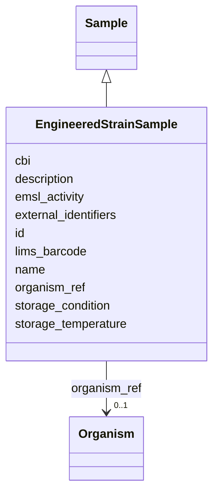

# Class: EngineeredStrainSample 


_A sample containing a strain of an organism that has been subjected to genetic engineering._

__

_This class references an organism for strain identity information (organism_name,_

_strain_source, modification_method, genotype_segment_*, component_*, phenotype, trait, etc.)_

_and carries only sample-instance-specific slots._

_  _


URI: [basalt_schema:EngineeredStrainSample](https://EMSL-Computing.github.io/basalt-schema/EngineeredStrainSample)





## Inheritance
* [Sample](Sample.md)
    * **EngineeredStrainSample**


## Slots

| Name | Cardinality and Range | Description | Inheritance |
| ---  | --- | --- | --- |
| [organism_ref](organism_ref.md) | 0..1 <br/> [Organism](Organism.md) | FK reference to an organism representing the biological identity | direct |
| [cbi](cbi.md) | 1 <br/> [String](String.md) | Controlled Biological Information flag (yes/no) | direct |
| [storage_condition](storage_condition.md) | 1 <br/> [String](String.md) | Storage condition for this sample (frozen, fresh, etc | direct |
| [storage_temperature](storage_temperature.md) | 0..1 <br/> [String](String.md) | Storage temperature for this sample (e | direct |
| [external_identifiers](external_identifiers.md) | * <br/> [Uriorcurie](Uriorcurie.md) | List of external identifiers associated with this entity or activity | direct |
| [id](id.md) | 1 <br/> [Uuid](Uuid.md) |  | direct |
| [cbi](cbi.md) | 1 <br/> [String](String.md) | Controlled Biological Information flag (yes/no) | direct |
| [storage_condition](storage_condition.md) | 1 <br/> [String](String.md) | Storage condition for this sample (frozen, fresh, etc | direct |
| [storage_temperature](storage_temperature.md) | 0..1 <br/> [String](String.md) | Storage temperature for this sample (e | direct |
| [name](name.md) | 1 <br/> [String](String.md) | Human-readable name for the entity or activity | [Sample](Sample.md) |
| [description](description.md) | 0..1 <br/> [String](String.md) | Human-readable description for the entity or activity | [Sample](Sample.md) |
| [emsl_activity](emsl_activity.md) | 0..1 <br/> [String](String.md) | Nullable string linking a Sample or SamplingActivity to a named EMSL activity... | [Sample](Sample.md) |
| [lims_barcode](lims_barcode.md) | 0..1 <br/> [String](String.md) | LIMS barcode identifier | [Sample](Sample.md) |


## Identifier and Mapping Information


### Schema Source


* from schema: https://EMSL-Computing.github.io/basalt-schema


## Mappings

| Mapping Type | Mapped Value |
| ---  | ---  |
| self | basalt_schema:EngineeredStrainSample |
| native | basalt_schema:EngineeredStrainSample |


## LinkML Source

<!-- TODO: investigate https://stackoverflow.com/questions/37606292/how-to-create-tabbed-code-blocks-in-mkdocs-or-sphinx -->

### Direct

<details>
```yaml
name: EngineeredStrainSample
description: "A sample containing a strain of an organism that has been subjected\
  \ to genetic engineering.\n\nThis class references an organism for strain identity\
  \ information (organism_name,\nstrain_source, modification_method, genotype_segment_*,\
  \ component_*, phenotype, trait, etc.)\nand carries only sample-instance-specific\
  \ slots.\n  "
from_schema: https://EMSL-Computing.github.io/basalt-schema
is_a: Sample
slots:
- organism_ref
- cbi
- storage_condition
- storage_temperature
- external_identifiers
attributes:
  id:
    name: id
    from_schema: https://EMSL-Computing.github.io/basalt-schema/sample-classes
    identifier: true
    domain_of:
    - Activity
    - Entity
    - DataProduct
    - DataGenerationActivity
    - DataProcessingActivity
    - AlternativeIdentifier
    - FunctionalAnnotationIdentifier
    - Instrument
    - OntologyClass
    - ContainerType
    - Custodian
    - InstrumentAlternativeIdentifier
    - LabDevice
    - SampleProcessing
    - ProcessingSampleLink
    - Configuration
    - MobilePhaseSegment
    - MassSpectrometryStandardRun
    - PurchasedMaterial
    - LabProcessingActivity
    - organism
    - MAOMProduct
    - WEOMProduct
    - Site
    - Sample
    - AerosolArmSample
    - AerosolSample
    - AMP2UserSample
    - CommerciallyPurchasedSample
    - CultureEnvironmentalSample
    - EngineeredStrainSample
    - FieldDeployedTerraformSample
    - MixedCultureSample
    - MonetSoilSample
    - OtherUndescribedSample
    - PlantSample
    - PureCultureSample
    - SedimentSample
    - SoilSample
    - SynthesizedMaterialSample
    - TerraformSample
    - WaterSample
    - ProcessedSample
    - CoreSection
    - SamplingActivity
    - AerosolArmSamplingActivity
    - AerosolSamplingActivity
    - CommerciallyPurchasedSamplingActivity
    - CultureEnvironmentalSamplingActivity
    - EngineeredStrainSamplingActivity
    - FieldDeployedTerraformSamplingActivity
    - MixedCultureSamplingActivity
    - MonetSoilSamplingActivity
    - OtherUndescribedSamplingActivity
    - PlantSamplingActivity
    - PureCultureSamplingActivity
    - SedimentSamplingActivity
    - SoilSamplingActivity
    - SynthesizedMaterialSamplingActivity
    - TerraformSamplingActivity
    - WaterSamplingActivity
    - Study
    - ProjectParticipant
    - TimestampValue
    - TextValue
    - SoftwareControlledTermValue
    - ControlledTermValue
    - PersonValue
    - QuantityValue
    - ConditioningValue
    - zipDownload
    range: uuid
    required: true
  cbi:
    name: cbi
    description: Controlled Biological Information flag (yes/no).
    from_schema: https://EMSL-Computing.github.io/basalt-schema/sample-classes
    domain_of:
    - AMP2UserSample
    - EngineeredStrainSample
    required: true
  storage_condition:
    name: storage_condition
    description: 'Storage condition for this sample (frozen, fresh, etc.).

      Aliases: samp_store_cond, storage_cond, storage_condt'
    from_schema: https://EMSL-Computing.github.io/basalt-schema/sample-classes
    domain_of:
    - AerosolArmSample
    - AerosolSample
    - AMP2UserSample
    - CommerciallyPurchasedSample
    - CultureEnvironmentalSample
    - EngineeredStrainSample
    - FieldDeployedTerraformSample
    - MixedCultureSample
    - MonetSoilSample
    - OtherUndescribedSample
    - PlantSample
    - PureCultureSample
    - SedimentSample
    - SoilSample
    - SynthesizedMaterialSample
    - TerraformSample
    - WaterSample
    required: true
  storage_temperature:
    name: storage_temperature
    description: 'Storage temperature for this sample (e.g., "-80 C").

      Aliases: samp_store_temp'
    from_schema: https://EMSL-Computing.github.io/basalt-schema/sample-classes
    domain_of:
    - MediaPreparation
    - AMP2UserSample
    - EngineeredStrainSample

```
</details>

### Induced

<details>
```yaml
name: EngineeredStrainSample
description: "A sample containing a strain of an organism that has been subjected\
  \ to genetic engineering.\n\nThis class references an organism for strain identity\
  \ information (organism_name,\nstrain_source, modification_method, genotype_segment_*,\
  \ component_*, phenotype, trait, etc.)\nand carries only sample-instance-specific\
  \ slots.\n  "
from_schema: https://EMSL-Computing.github.io/basalt-schema
is_a: Sample
attributes:
  id:
    name: id
    from_schema: https://EMSL-Computing.github.io/basalt-schema/sample-classes
    identifier: true
    alias: id
    owner: EngineeredStrainSample
    domain_of:
    - Activity
    - Entity
    - DataProduct
    - DataGenerationActivity
    - DataProcessingActivity
    - AlternativeIdentifier
    - FunctionalAnnotationIdentifier
    - Instrument
    - OntologyClass
    - ContainerType
    - Custodian
    - InstrumentAlternativeIdentifier
    - LabDevice
    - SampleProcessing
    - ProcessingSampleLink
    - Configuration
    - MobilePhaseSegment
    - MassSpectrometryStandardRun
    - PurchasedMaterial
    - LabProcessingActivity
    - organism
    - MAOMProduct
    - WEOMProduct
    - Site
    - Sample
    - AerosolArmSample
    - AerosolSample
    - AMP2UserSample
    - CommerciallyPurchasedSample
    - CultureEnvironmentalSample
    - EngineeredStrainSample
    - FieldDeployedTerraformSample
    - MixedCultureSample
    - MonetSoilSample
    - OtherUndescribedSample
    - PlantSample
    - PureCultureSample
    - SedimentSample
    - SoilSample
    - SynthesizedMaterialSample
    - TerraformSample
    - WaterSample
    - ProcessedSample
    - CoreSection
    - SamplingActivity
    - AerosolArmSamplingActivity
    - AerosolSamplingActivity
    - CommerciallyPurchasedSamplingActivity
    - CultureEnvironmentalSamplingActivity
    - EngineeredStrainSamplingActivity
    - FieldDeployedTerraformSamplingActivity
    - MixedCultureSamplingActivity
    - MonetSoilSamplingActivity
    - OtherUndescribedSamplingActivity
    - PlantSamplingActivity
    - PureCultureSamplingActivity
    - SedimentSamplingActivity
    - SoilSamplingActivity
    - SynthesizedMaterialSamplingActivity
    - TerraformSamplingActivity
    - WaterSamplingActivity
    - Study
    - ProjectParticipant
    - TimestampValue
    - TextValue
    - SoftwareControlledTermValue
    - ControlledTermValue
    - PersonValue
    - QuantityValue
    - ConditioningValue
    - zipDownload
    range: uuid
    required: true
  cbi:
    name: cbi
    description: Controlled Biological Information flag (yes/no).
    from_schema: https://EMSL-Computing.github.io/basalt-schema/sample-classes
    alias: cbi
    owner: EngineeredStrainSample
    domain_of:
    - AMP2UserSample
    - EngineeredStrainSample
    range: string
    required: true
  storage_condition:
    name: storage_condition
    description: 'Storage condition for this sample (frozen, fresh, etc.).

      Aliases: samp_store_cond, storage_cond, storage_condt'
    from_schema: https://EMSL-Computing.github.io/basalt-schema/sample-classes
    alias: storage_condition
    owner: EngineeredStrainSample
    domain_of:
    - AerosolArmSample
    - AerosolSample
    - AMP2UserSample
    - CommerciallyPurchasedSample
    - CultureEnvironmentalSample
    - EngineeredStrainSample
    - FieldDeployedTerraformSample
    - MixedCultureSample
    - MonetSoilSample
    - OtherUndescribedSample
    - PlantSample
    - PureCultureSample
    - SedimentSample
    - SoilSample
    - SynthesizedMaterialSample
    - TerraformSample
    - WaterSample
    range: string
    required: true
  storage_temperature:
    name: storage_temperature
    description: 'Storage temperature for this sample (e.g., "-80 C").

      Aliases: samp_store_temp'
    from_schema: https://EMSL-Computing.github.io/basalt-schema/sample-classes
    alias: storage_temperature
    owner: EngineeredStrainSample
    domain_of:
    - MediaPreparation
    - AMP2UserSample
    - EngineeredStrainSample
    range: string
  organism_ref:
    name: organism_ref
    description: 'FK reference to an organism representing the biological identity

      strain, isolate, engineered construct) that this sample or activity

      is associated with.'
    from_schema: https://EMSL-Computing.github.io/basalt-schema
    aliases:
    - strain_ref
    - strain_id
    rank: 1000
    alias: organism_ref
    owner: EngineeredStrainSample
    domain_of:
    - CultureGrowth
    - AMP2UserSample
    - EngineeredStrainSample
    range: organism
    required: false
  external_identifiers:
    name: external_identifiers
    description: List of external identifiers associated with this entity or activity.
    from_schema: https://EMSL-Computing.github.io/basalt-schema
    rank: 1000
    alias: external_identifiers
    owner: EngineeredStrainSample
    domain_of:
    - NucleotideSequencing
    - AerosolArmSample
    - AerosolSample
    - CommerciallyPurchasedSample
    - CultureEnvironmentalSample
    - EngineeredStrainSample
    - FieldDeployedTerraformSample
    - MixedCultureSample
    - MonetSoilSample
    - OtherUndescribedSample
    - PlantSample
    - PureCultureSample
    - SedimentSample
    - SoilSample
    - SynthesizedMaterialSample
    - TerraformSample
    - WaterSample
    - Study
    range: uriorcurie
    multivalued: true
  name:
    name: name
    description: Human-readable name for the entity or activity.
    from_schema: https://EMSL-Computing.github.io/basalt-schema
    rank: 1000
    alias: name
    owner: EngineeredStrainSample
    domain_of:
    - Activity
    - Entity
    - DataProduct
    - DataGenerationActivity
    - Instrument
    - OntologyClass
    - ContainerAxis
    - Configuration
    - MobilePhaseSegment
    - MassSpectrometryStandardRun
    - PurchasedMaterial
    - LabProcessingActivity
    - organism
    - Site
    - Sample
    - SamplingActivity
    - SoilSamplingActivity
    - Study
    - SoftwareControlledTermValue
    range: string
    required: true
  description:
    name: description
    description: Human-readable description for the entity or activity
    title: description
    from_schema: https://EMSL-Computing.github.io/basalt-schema
    rank: 1000
    alias: description
    owner: EngineeredStrainSample
    domain_of:
    - Activity
    - Entity
    - DataProduct
    - DataGenerationActivity
    - DataProcessingActivity
    - OntologyClass
    - ContainerType
    - LabDevice
    - Configuration
    - MassSpectrometryStandardRun
    - PurchasedMaterial
    - LabProcessingActivity
    - organism
    - Site
    - Sample
    - SamplingActivity
    - SoilSamplingActivity
    - Study
    - TimestampValue
    - TextValue
    - SoftwareControlledTermValue
    - ControlledTermValue
    - QuantityValue
    range: string
  emsl_activity:
    name: emsl_activity
    description: 'Nullable string linking a Sample or SamplingActivity to a named
      EMSL activity or

      campaign (e.g., ''AMP2'', ''MONet_FY26''). Optional for historical records

      predating activity tracking.'
    todos:
    - Is sampling activity where we want to capture this?
    from_schema: https://EMSL-Computing.github.io/basalt-schema
    rank: 1000
    alias: emsl_activity
    owner: EngineeredStrainSample
    domain_of:
    - Sample
    - SamplingActivity
    range: string
    required: false
  lims_barcode:
    name: lims_barcode
    description: LIMS barcode identifier
    from_schema: https://EMSL-Computing.github.io/basalt-schema
    rank: 1000
    alias: lims_barcode
    owner: EngineeredStrainSample
    domain_of:
    - ProcessedData
    - Sample
    range: string
    required: false

```
</details>