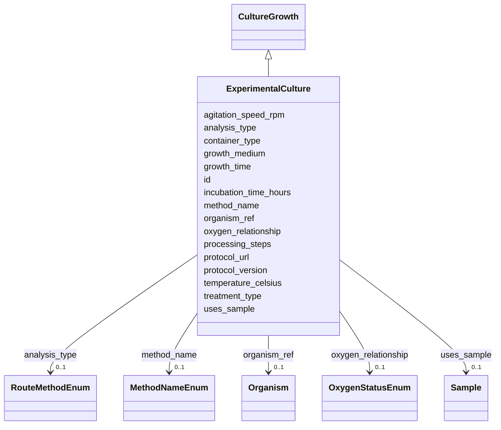

# Class: ExperimentalCulture 


_Growth of an experimental culture for downstream analysis._

_This is the terminal culture step before plate setup or direct measurement._

__

_Input:  processedSample(type='pre_culture') via processingSampleLink_

_Output: processedSample(type='experimental_culture') via processingSampleLink_

_Refs:   Media (growth medium), Strain_


URI: [analysis_api_schema:ExperimentalCulture](https://w3id.org/MONet/analysis-api-schema/ExperimentalCulture)





## Inheritance
* [SampleProcessing](SampleProcessing.md)
    * [CultureGrowth](CultureGrowth.md) [ [HasIncubationConditions](HasIncubationConditions.md)]
        * **ExperimentalCulture**


## Slots

| Name | Cardinality and Range | Description | Inheritance |
| ---  | --- | --- | --- |
| [treatment_type](treatment_type.md) | 0..1 <br/> [String](String.md) | Type of treatment applied in experimental culture growth | direct |
| [growth_time](growth_time.md) | 0..1 <br/> [String](String.md) | Total growth time for the culture | direct |
| [organism_ref](organism_ref.md) | 0..1 <br/> [Organism](Organism.md) | FK reference to an organism representing the biological identity | [CultureGrowth](CultureGrowth.md) |
| [growth_medium](growth_medium.md) | 0..1 <br/> [String](String.md) | Method of growth and medium/materials used | [CultureGrowth](CultureGrowth.md) |
| [incubation_time_hours](incubation_time_hours.md) | 0..1 <br/> [Float](Float.md) | Incubation duration in hours | [CultureGrowth](CultureGrowth.md) |
| [container_type](container_type.md) | 0..1 <br/> [String](String.md) | Physical container used for the culture (flask, tube, plate, etc | [CultureGrowth](CultureGrowth.md) |
| [temperature_celsius](temperature_celsius.md) | 0..1 <br/> [Float](Float.md) | Temperature at which the method/process/activity was performed | [HasIncubationConditions](HasIncubationConditions.md) |
| [agitation_speed_rpm](agitation_speed_rpm.md) | 0..1 <br/> [Integer](Integer.md) | Agitation/shaking speed in RPM (0 for static) | [HasIncubationConditions](HasIncubationConditions.md) |
| [oxygen_relationship](oxygen_relationship.md) | 0..1 <br/> [OxygenStatusEnum](OxygenStatusEnum.md) | The relationship of the sample to oxygen, such as aerobic or anaerobic | [HasIncubationConditions](HasIncubationConditions.md) |
| [protocol_url](protocol_url.md) | 0..1 <br/> [String](String.md) | URL pointing to the protocol used in the activity, if applicable | [SampleProcessing](SampleProcessing.md) |
| [protocol_version](protocol_version.md) | 0..1 <br/> [String](String.md) | Version of the protocol used in the activity, if applicable | [SampleProcessing](SampleProcessing.md) |
| [id](id.md) | 1 <br/> [Uuid](Uuid.md) |  | [SampleProcessing](SampleProcessing.md) |
| [analysis_type](analysis_type.md) | 0..1 <br/> [RouteMethodEnum](RouteMethodEnum.md) |  | [SampleProcessing](SampleProcessing.md) |
| [method_name](method_name.md) | 0..1 <br/> [MethodNameEnum](MethodNameEnum.md) |  | [SampleProcessing](SampleProcessing.md) |
| [processing_steps](processing_steps.md) | 1 <br/> [String](String.md) |  | [SampleProcessing](SampleProcessing.md) |
| [uses_sample](uses_sample.md) | 0..1 <br/> [Sample](Sample.md) |  | [SampleProcessing](SampleProcessing.md) |


## Identifier and Mapping Information


### Schema Source


* from schema: https://w3id.org/MONet/analysis-api-schema


## Mappings

| Mapping Type | Mapped Value |
| ---  | ---  |
| self | analysis_api_schema:ExperimentalCulture |
| native | analysis_api_schema:ExperimentalCulture |


## LinkML Source

<!-- TODO: investigate https://stackoverflow.com/questions/37606292/how-to-create-tabbed-code-blocks-in-mkdocs-or-sphinx -->

### Direct

<details>
```yaml
name: ExperimentalCulture
description: 'Growth of an experimental culture for downstream analysis.

  This is the terminal culture step before plate setup or direct measurement.


  Input:  processedSample(type=''pre_culture'') via processingSampleLink

  Output: processedSample(type=''experimental_culture'') via processingSampleLink

  Refs:   Media (growth medium), Strain'
from_schema: https://w3id.org/MONet/analysis-api-schema
is_a: CultureGrowth
slots:
- treatment_type
- growth_time

```
</details>

### Induced

<details>
```yaml
name: ExperimentalCulture
description: 'Growth of an experimental culture for downstream analysis.

  This is the terminal culture step before plate setup or direct measurement.


  Input:  processedSample(type=''pre_culture'') via processingSampleLink

  Output: processedSample(type=''experimental_culture'') via processingSampleLink

  Refs:   Media (growth medium), Strain'
from_schema: https://w3id.org/MONet/analysis-api-schema
is_a: CultureGrowth
attributes:
  treatment_type:
    name: treatment_type
    description: Type of treatment applied in experimental culture growth
    from_schema: https://w3id.org/MONet/analysis-api-schema
    rank: 1000
    alias: treatment_type
    owner: ExperimentalCulture
    domain_of:
    - ExperimentalCulture
    range: string
  growth_time:
    name: growth_time
    description: 'Total growth time for the culture.

      Required for ExperimentalCulture activities.'
    from_schema: https://w3id.org/MONet/analysis-api-schema
    rank: 1000
    alias: growth_time
    owner: ExperimentalCulture
    domain_of:
    - ExperimentalCulture
    range: string
  organism_ref:
    name: organism_ref
    description: 'FK reference to an organism representing the biological identity

      strain, isolate, engineered construct) that this sample or activity

      is associated with.'
    from_schema: https://w3id.org/MONet/analysis-api-schema
    aliases:
    - strain_ref
    - strain_id
    rank: 1000
    alias: organism_ref
    owner: ExperimentalCulture
    domain_of:
    - CultureGrowth
    - AMP2UserSample
    - EngineeredStrainSample
    range: organism
    required: false
  growth_medium:
    name: growth_medium
    description: Method of growth and medium/materials used. Indicate broth, gel,
      3-D structure, bioreactor, etc. followed by the formula, recipe, or components
      used to create the growth medium.
    title: growth medium
    from_schema: https://w3id.org/MONet/analysis-api-schema
    rank: 1000
    alias: growth_medium
    owner: ExperimentalCulture
    domain_of:
    - CultureGrowth
    - CultureEnvironmentalSample
    - FieldDeployedTerraformSample
    - MixedCultureSample
    - OtherUndescribedSample
    - PureCultureSample
    - TerraformSample
    range: string
  incubation_time_hours:
    name: incubation_time_hours
    description: Incubation duration in hours
    from_schema: https://w3id.org/MONet/analysis-api-schema
    rank: 1000
    alias: incubation_time_hours
    owner: ExperimentalCulture
    domain_of:
    - CultureGrowth
    range: float
  container_type:
    name: container_type
    description: Physical container used for the culture (flask, tube, plate, etc.)
    from_schema: https://w3id.org/MONet/analysis-api-schema
    rank: 1000
    alias: container_type
    owner: ExperimentalCulture
    domain_of:
    - ContainerType
    - CultureGrowth
    range: string
  temperature_celsius:
    name: temperature_celsius
    description: Temperature at which the method/process/activity was performed
    from_schema: https://w3id.org/MONet/analysis-api-schema
    rank: 1000
    alias: temperature_celsius
    owner: ExperimentalCulture
    domain_of:
    - ChromatographyConfiguration
    - HasIncubationConditions
    range: float
  agitation_speed_rpm:
    name: agitation_speed_rpm
    description: Agitation/shaking speed in RPM (0 for static)
    from_schema: https://w3id.org/MONet/analysis-api-schema
    rank: 1000
    alias: agitation_speed_rpm
    owner: ExperimentalCulture
    domain_of:
    - HasIncubationConditions
    range: integer
  oxygen_relationship:
    name: oxygen_relationship
    description: The relationship of the sample to oxygen, such as aerobic or anaerobic.
    title: oxygen relationship
    from_schema: https://w3id.org/MONet/analysis-api-schema
    exact_mappings:
    - MIXS:0000015
    rank: 1000
    alias: oxygen_status
    owner: ExperimentalCulture
    domain_of:
    - HasIncubationConditions
    - CommerciallyPurchasedSample
    - CultureEnvironmentalSample
    - FieldDeployedTerraformSample
    - MixedCultureSample
    - OtherUndescribedSample
    - PureCultureSample
    - SedimentSample
    - SoilSample
    - SynthesizedMaterialSample
    - TerraformSample
    - WaterSample
    range: OxygenStatusEnum
  protocol_url:
    name: protocol_url
    description: URL pointing to the protocol used in the activity, if applicable.
    from_schema: https://w3id.org/MONet/analysis-api-schema
    rank: 1000
    alias: protocol_url
    owner: ExperimentalCulture
    domain_of:
    - DataGenerationActivity
    - SampleProcessing
    range: string
  protocol_version:
    name: protocol_version
    description: Version of the protocol used in the activity, if applicable.
    from_schema: https://w3id.org/MONet/analysis-api-schema
    rank: 1000
    alias: protocol_version
    owner: ExperimentalCulture
    domain_of:
    - DataGenerationActivity
    - SampleProcessing
    range: string
  id:
    name: id
    from_schema: https://w3id.org/MONet/analysis-api-schema
    identifier: true
    alias: id
    owner: ExperimentalCulture
    domain_of:
    - Activity
    - Entity
    - DataProduct
    - DataGenerationActivity
    - DataProcessingActivity
    - AlternativeIdentifier
    - FunctionalAnnotationIdentifier
    - Instrument
    - OntologyClass
    - ContainerType
    - Custodian
    - InstrumentAlternativeIdentifier
    - LabDevice
    - SampleProcessing
    - ProcessingSampleLink
    - Configuration
    - MobilePhaseSegment
    - MassSpectrometryStandardRun
    - PurchasedMaterial
    - LabProcessingActivity
    - organism
    - MAOMProduct
    - WEOMProduct
    - Site
    - Sample
    - AerosolArmSample
    - AerosolSample
    - AMP2UserSample
    - CommerciallyPurchasedSample
    - CultureEnvironmentalSample
    - EngineeredStrainSample
    - FieldDeployedTerraformSample
    - MixedCultureSample
    - MonetSoilSample
    - OtherUndescribedSample
    - PlantSample
    - PureCultureSample
    - SedimentSample
    - SoilSample
    - SynthesizedMaterialSample
    - TerraformSample
    - WaterSample
    - ProcessedSample
    - CoreSection
    - SamplingActivity
    - AerosolArmSamplingActivity
    - AerosolSamplingActivity
    - CommerciallyPurchasedSamplingActivity
    - CultureEnvironmentalSamplingActivity
    - EngineeredStrainSamplingActivity
    - FieldDeployedTerraformSamplingActivity
    - MixedCultureSamplingActivity
    - MonetSoilSamplingActivity
    - OtherUndescribedSamplingActivity
    - PlantSamplingActivity
    - PureCultureSamplingActivity
    - SedimentSamplingActivity
    - SoilSamplingActivity
    - SynthesizedMaterialSamplingActivity
    - TerraformSamplingActivity
    - WaterSamplingActivity
    - Study
    - ProjectParticipant
    - TimestampValue
    - TextValue
    - SoftwareControlledTermValue
    - ControlledTermValue
    - PersonValue
    - QuantityValue
    - ConditioningValue
    - zipDownload
    range: uuid
    required: true
  analysis_type:
    name: analysis_type
    from_schema: https://w3id.org/MONet/analysis-api-schema
    alias: analysis_type
    owner: ExperimentalCulture
    domain_of:
    - SampleProcessing
    - AerosolArmSample
    - AerosolSample
    - AMP2UserSample
    - CommerciallyPurchasedSample
    - CultureEnvironmentalSample
    - FieldDeployedTerraformSample
    - MixedCultureSample
    - OtherUndescribedSample
    - PlantSample
    - PureCultureSample
    - SedimentSample
    - SoilSample
    - SynthesizedMaterialSample
    - TerraformSample
    - WaterSample
    range: RouteMethodEnum
  method_name:
    name: method_name
    from_schema: https://w3id.org/MONet/analysis-api-schema
    rank: 1000
    alias: method_name
    owner: ExperimentalCulture
    domain_of:
    - SampleProcessing
    range: MethodNameEnum
  processing_steps:
    name: processing_steps
    from_schema: https://w3id.org/MONet/analysis-api-schema
    rank: 1000
    alias: processing_steps
    owner: ExperimentalCulture
    domain_of:
    - SampleProcessing
    range: string
    required: true
  uses_sample:
    name: uses_sample
    from_schema: https://w3id.org/MONet/analysis-api-schema
    rank: 1000
    alias: uses_sample
    owner: ExperimentalCulture
    domain_of:
    - SampleProcessing
    range: Sample

```
</details>