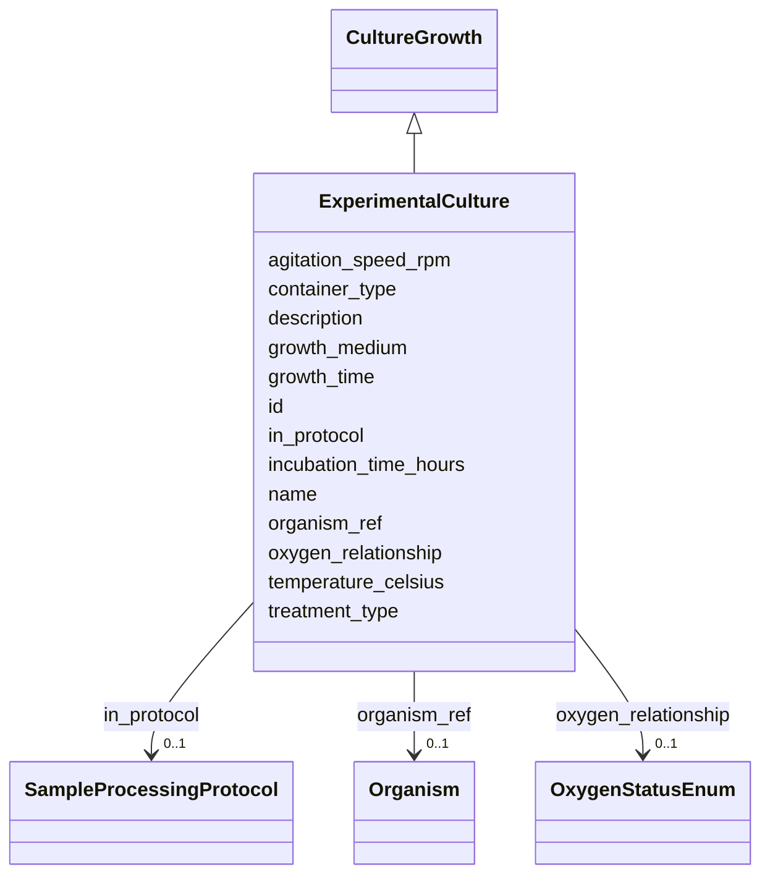

# Class: ExperimentalCulture 


_Growth of an experimental culture for downstream analysis._

_This is the terminal culture step before plate setup or direct measurement._

__

_Input:  processedSample(type='pre_culture') via processingSampleLink_

_Output: processedSample(type='experimental_culture') via processingSampleLink_

_Refs:   Media (growth medium), Strain_


URI: [basalt_schema:ExperimentalCulture](https://emsl-computing.github.io/BASALT-Schema/elements/ExperimentalCulture)



```mermaid
 classDiagram
    class ExperimentalCulture
    click ExperimentalCulture href "../ExperimentalCulture/"
      CultureGrowth <|-- ExperimentalCulture
        click CultureGrowth href "../CultureGrowth/"
      
      ExperimentalCulture : agitation_speed_rpm
        
      ExperimentalCulture : container_type
        
      ExperimentalCulture : description
        
      ExperimentalCulture : growth_medium
        
      ExperimentalCulture : growth_time
        
      ExperimentalCulture : id
        
      ExperimentalCulture : in_protocol
        
          
    
        
        
        ExperimentalCulture --> "0..1" SampleProcessingProtocol : in_protocol
        click SampleProcessingProtocol href "../SampleProcessingProtocol/"
    

        
      ExperimentalCulture : incubation_time_hours
        
      ExperimentalCulture : name
        
      ExperimentalCulture : organism_ref
        
          
    
        
        
        ExperimentalCulture --> "0..1" Organism : organism_ref
        click Organism href "../Organism/"
    

        
      ExperimentalCulture : oxygen_relationship
        
          
    
        
        
        ExperimentalCulture --> "0..1" OxygenStatusEnum : oxygen_relationship
        click OxygenStatusEnum href "../OxygenStatusEnum/"
    

        
      ExperimentalCulture : temperature_celsius
        
      ExperimentalCulture : treatment_type
        
      
```


## Inheritance
* [SampleProcessing](SampleProcessing.md)
    * [CultureGrowth](CultureGrowth.md) [ [HasIncubationConditions](HasIncubationConditions.md)]
        * **ExperimentalCulture**


## Slots

| Name | Cardinality and Range | Description | Inheritance |
| ---  | --- | --- | --- |
| [treatment_type](treatment_type.md) | 0..1 <br/> [String](String.md) | Type of treatment applied in experimental culture growth | direct |
| [growth_time](growth_time.md) | 0..1 <br/> [String](String.md) | Total growth time for the culture | direct |
| [organism_ref](organism_ref.md) | 0..1 <br/> [Organism](Organism.md) | FK reference to an organism representing the biological identity | [CultureGrowth](CultureGrowth.md) |
| [growth_medium](growth_medium.md) | 0..1 <br/> [String](String.md) | Method of growth and medium/materials used | [CultureGrowth](CultureGrowth.md) |
| [incubation_time_hours](incubation_time_hours.md) | 0..1 <br/> [Float](Float.md) | Incubation duration in hours | [CultureGrowth](CultureGrowth.md) |
| [container_type](container_type.md) | 0..1 <br/> [String](String.md) | Physical container used for the culture (flask, tube, plate, etc | [CultureGrowth](CultureGrowth.md) |
| [temperature_celsius](temperature_celsius.md) | 0..1 <br/> [Float](Float.md) | Temperature at which the method/process/activity was performed | [HasIncubationConditions](HasIncubationConditions.md) |
| [agitation_speed_rpm](agitation_speed_rpm.md) | 0..1 <br/> [Integer](Integer.md) | Agitation/shaking speed in RPM (0 for static) | [HasIncubationConditions](HasIncubationConditions.md) |
| [oxygen_relationship](oxygen_relationship.md) | 0..1 <br/> [OxygenStatusEnum](OxygenStatusEnum.md) | The relationship of the sample to oxygen, such as aerobic or anaerobic | [HasIncubationConditions](HasIncubationConditions.md) |
| [name](name.md) | 1 <br/> [String](String.md) | Human-readable name for the entity or activity | [SampleProcessing](SampleProcessing.md) |
| [description](description.md) | 0..1 <br/> [String](String.md) | Human-readable description for the entity or activity | [SampleProcessing](SampleProcessing.md) |
| [in_protocol](in_protocol.md) | 0..1 <br/> [SampleProcessingProtocol](SampleProcessingProtocol.md) | The SampleProcessingProtocol (the recipe) that this step follows | [SampleProcessing](SampleProcessing.md) |
| [id](id.md) | 1 <br/> [Uuid](Uuid.md) |  | [SampleProcessing](SampleProcessing.md) |


## Identifier and Mapping Information


### Schema Source


* from schema: https://emsl-computing.github.io/BASALT-Schema


## Mappings

| Mapping Type | Mapped Value |
| ---  | ---  |
| self | basalt_schema:ExperimentalCulture |
| native | basalt_schema:ExperimentalCulture |


## LinkML Source

<!-- TODO: investigate https://stackoverflow.com/questions/37606292/how-to-create-tabbed-code-blocks-in-mkdocs-or-sphinx -->

### Direct

<details>
```yaml
name: ExperimentalCulture
description: 'Growth of an experimental culture for downstream analysis.

  This is the terminal culture step before plate setup or direct measurement.


  Input:  processedSample(type=''pre_culture'') via processingSampleLink

  Output: processedSample(type=''experimental_culture'') via processingSampleLink

  Refs:   Media (growth medium), Strain'
from_schema: https://emsl-computing.github.io/BASALT-Schema
is_a: CultureGrowth
slots:
- treatment_type
- growth_time

```
</details>

### Induced

<details>
```yaml
name: ExperimentalCulture
description: 'Growth of an experimental culture for downstream analysis.

  This is the terminal culture step before plate setup or direct measurement.


  Input:  processedSample(type=''pre_culture'') via processingSampleLink

  Output: processedSample(type=''experimental_culture'') via processingSampleLink

  Refs:   Media (growth medium), Strain'
from_schema: https://emsl-computing.github.io/BASALT-Schema
is_a: CultureGrowth
attributes:
  treatment_type:
    name: treatment_type
    description: Type of treatment applied in experimental culture growth
    from_schema: https://emsl-computing.github.io/BASALT-Schema
    rank: 1000
    alias: treatment_type
    owner: ExperimentalCulture
    domain_of:
    - ExperimentalCulture
    range: string
  growth_time:
    name: growth_time
    description: 'Total growth time for the culture.

      Required for ExperimentalCulture activities.'
    from_schema: https://emsl-computing.github.io/BASALT-Schema
    rank: 1000
    alias: growth_time
    owner: ExperimentalCulture
    domain_of:
    - ExperimentalCulture
    range: string
  organism_ref:
    name: organism_ref
    description: 'FK reference to an organism representing the biological identity

      strain, isolate, engineered construct) that this sample or activity

      is associated with.'
    from_schema: https://emsl-computing.github.io/BASALT-Schema
    aliases:
    - strain_ref
    - strain_id
    rank: 1000
    alias: organism_ref
    owner: ExperimentalCulture
    domain_of:
    - CultureGrowth
    - AMP2UserSample
    - EngineeredStrainSample
    range: organism
    required: false
  growth_medium:
    name: growth_medium
    description: Method of growth and medium/materials used. Indicate broth, gel,
      3-D structure, bioreactor, etc. followed by the formula, recipe, or components
      used to create the growth medium.
    title: growth medium
    from_schema: https://emsl-computing.github.io/BASALT-Schema
    rank: 1000
    alias: growth_medium
    owner: ExperimentalCulture
    domain_of:
    - CultureGrowth
    - CultureEnvironmentalSample
    - FieldDeployedTerraformSample
    - MixedCultureSample
    - OtherUndescribedSample
    - PureCultureSample
    - TerraformSample
    range: string
  incubation_time_hours:
    name: incubation_time_hours
    description: Incubation duration in hours
    from_schema: https://emsl-computing.github.io/BASALT-Schema
    rank: 1000
    alias: incubation_time_hours
    owner: ExperimentalCulture
    domain_of:
    - CultureGrowth
    range: float
  container_type:
    name: container_type
    description: Physical container used for the culture (flask, tube, plate, etc.)
    from_schema: https://emsl-computing.github.io/BASALT-Schema
    rank: 1000
    alias: container_type
    owner: ExperimentalCulture
    domain_of:
    - ContainerType
    - CultureGrowth
    range: string
  temperature_celsius:
    name: temperature_celsius
    description: Temperature at which the method/process/activity was performed
    from_schema: https://emsl-computing.github.io/BASALT-Schema
    rank: 1000
    alias: temperature_celsius
    owner: ExperimentalCulture
    domain_of:
    - ChromatographyConfiguration
    - HasIncubationConditions
    - ChemicalConversionProcess
    range: float
  agitation_speed_rpm:
    name: agitation_speed_rpm
    description: Agitation/shaking speed in RPM (0 for static)
    from_schema: https://emsl-computing.github.io/BASALT-Schema
    rank: 1000
    alias: agitation_speed_rpm
    owner: ExperimentalCulture
    domain_of:
    - HasIncubationConditions
    range: integer
  oxygen_relationship:
    name: oxygen_relationship
    description: The relationship of the sample to oxygen, such as aerobic or anaerobic.
    title: oxygen relationship
    from_schema: https://emsl-computing.github.io/BASALT-Schema
    exact_mappings:
    - MIXS:0000015
    rank: 1000
    alias: oxygen_status
    owner: ExperimentalCulture
    domain_of:
    - HasIncubationConditions
    - CommerciallyPurchasedSample
    - CultureEnvironmentalSample
    - FieldDeployedTerraformSample
    - MixedCultureSample
    - OtherUndescribedSample
    - PureCultureSample
    - SedimentSample
    - SoilSample
    - SynthesizedMaterialSample
    - TerraformSample
    - WaterSample
    range: OxygenStatusEnum
  name:
    name: name
    description: Human-readable name for the entity or activity.
    from_schema: https://emsl-computing.github.io/BASALT-Schema
    rank: 1000
    alias: name
    owner: ExperimentalCulture
    domain_of:
    - Activity
    - Entity
    - DataProduct
    - DataGenerationActivity
    - Instrument
    - OntologyClass
    - ContainerAxis
    - SampleProcessing
    - Configuration
    - MobilePhaseSegment
    - MassSpectrometryStandardRun
    - PurchasedMaterial
    - organism
    - Site
    - Sample
    - SamplingActivity
    - SoilSamplingActivity
    - SampleProcessingProtocol
    - SampleProcessingRun
    - Study
    - SoftwareControlledTermValue
    range: string
    required: true
  description:
    name: description
    description: Human-readable description for the entity or activity
    title: description
    from_schema: https://emsl-computing.github.io/BASALT-Schema
    rank: 1000
    alias: description
    owner: ExperimentalCulture
    domain_of:
    - Activity
    - Entity
    - DataProduct
    - DataGenerationActivity
    - DataProcessingActivity
    - OntologyClass
    - ContainerType
    - LabDevice
    - SampleProcessing
    - Configuration
    - MassSpectrometryStandardRun
    - PurchasedMaterial
    - organism
    - Site
    - Sample
    - SamplingActivity
    - SoilSamplingActivity
    - SampleProcessingProtocol
    - SampleProcessingRun
    - Study
    - TimestampValue
    - TextValue
    - SoftwareControlledTermValue
    - ControlledTermValue
    - QuantityValue
    range: string
  in_protocol:
    name: in_protocol
    description: 'The SampleProcessingProtocol (the recipe) that this step follows.
      Type-level, not instance-level: every execution of the same SOP points at the
      same record, so this does NOT identify a particular chain. Use in_run for that.
      A chain may mix protocols, so this is recorded per step rather than per run.'
    from_schema: https://emsl-computing.github.io/BASALT-Schema
    rank: 1000
    alias: in_protocol
    owner: ExperimentalCulture
    domain_of:
    - SampleProcessing
    range: SampleProcessingProtocol
  id:
    name: id
    from_schema: https://emsl-computing.github.io/BASALT-Schema
    identifier: true
    alias: id
    owner: ExperimentalCulture
    domain_of:
    - Activity
    - Entity
    - DataProduct
    - DataGenerationActivity
    - DataProcessingActivity
    - AlternativeIdentifier
    - FunctionalAnnotationIdentifier
    - Instrument
    - OntologyClass
    - ContainerType
    - Custodian
    - InstrumentAlternativeIdentifier
    - LabDevice
    - SampleProcessing
    - ProcessingSampleLink
    - Configuration
    - MobilePhaseSegment
    - MassSpectrometryStandardRun
    - PurchasedMaterial
    - MAOMProduct
    - WEOMProduct
    - organism
    - Site
    - Sample
    - AerosolArmSample
    - AerosolSample
    - AMP2UserSample
    - CommerciallyPurchasedSample
    - CultureEnvironmentalSample
    - EngineeredStrainSample
    - FieldDeployedTerraformSample
    - MixedCultureSample
    - MonetSoilSample
    - OtherUndescribedSample
    - PlantSample
    - PureCultureSample
    - SedimentSample
    - SoilSample
    - SynthesizedMaterialSample
    - TerraformSample
    - WaterSample
    - ProcessedSample
    - CoreSection
    - SamplingActivity
    - AerosolArmSamplingActivity
    - AerosolSamplingActivity
    - CommerciallyPurchasedSamplingActivity
    - CultureEnvironmentalSamplingActivity
    - EngineeredStrainSamplingActivity
    - FieldDeployedTerraformSamplingActivity
    - MixedCultureSamplingActivity
    - MonetSoilSamplingActivity
    - OtherUndescribedSamplingActivity
    - PlantSamplingActivity
    - PureCultureSamplingActivity
    - SedimentSamplingActivity
    - SoilSamplingActivity
    - SynthesizedMaterialSamplingActivity
    - TerraformSamplingActivity
    - WaterSamplingActivity
    - SampleProcessingProtocol
    - SampleProcessingRun
    - Study
    - ProjectParticipant
    - TimestampValue
    - TextValue
    - SoftwareControlledTermValue
    - ControlledTermValue
    - PersonValue
    - QuantityValue
    - ConditioningValue
    - zipDownload
    range: uuid
    required: true

```
</details>