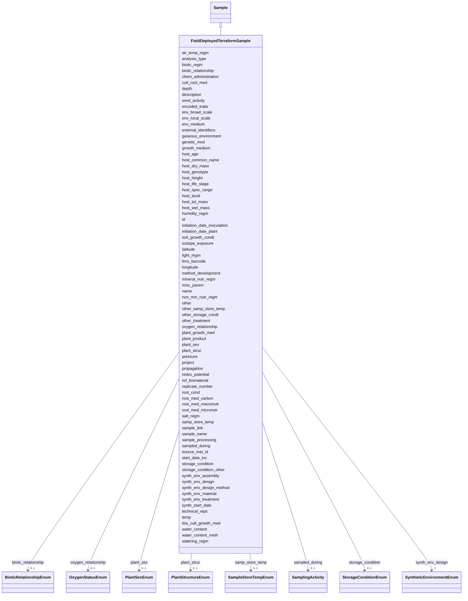

# Class: FieldDeployedTerraformSample 


_A sample collected from a field-deployed Terraform experiment._


URI: [analysis_api_schema:FieldDeployedTerraformSample](https://w3id.org/MONet/analysis-api-schema/FieldDeployedTerraformSample)





## Inheritance
* [Sample](Sample.md)
    * **FieldDeployedTerraformSample**


## Slots

| Name | Cardinality and Range | Description | Inheritance |
| ---  | --- | --- | --- |
| [air_temp_regm](air_temp_regm.md) | 0..1 <br/> [String](String.md) | Information about treatment involving an exposure to varying temperatures; sh... | direct |
| [analysis_type](analysis_type.md) | 1 <br/> [String](String.md) | The type(s) of analysis planned for this sample | direct |
| [biotic_regm](biotic_regm.md) | 0..1 <br/> [String](String.md) | Information about treatment(s) involving use of biotic factors such as bacter... | direct |
| [chem_administration](chem_administration.md) | 0..1 <br/> [String](String.md) | List of chemical compounds administered to the host or site where sampling oc... | direct |
| [cult_root_med](cult_root_med.md) | 0..1 <br/> [String](String.md) | Name or reference for the hydroponic or in vitro culture rooting medium; can ... | direct |
| [depth](depth.md) | 0..1 <br/> [String](String.md) | The vertical distance below local surface | direct |
| [encoded_traits](encoded_traits.md) | 0..1 <br/> [String](String.md) | Should include key traits like antibiotic resistance or xenobiotic | direct |
| [env_broad_scale](env_broad_scale.md) | 0..1 <br/> [String](String.md) | 'Report the major environmental system the sample or specimen came from | direct |
| [env_local_scale](env_local_scale.md) | 0..1 <br/> [String](String.md) | 'Report the entity which are in your sample or specimens local vicinity and w... | direct |
| [env_medium](env_medium.md) | 0..1 <br/> [String](String.md) | 'Report the environmental material immediately surrounding the sample or spec... | direct |
| [external_identifiers](external_identifiers.md) | * <br/> [Uriorcurie](Uriorcurie.md) | List of external identifiers associated with this entity or activity | direct |
| [gaseous_environment](gaseous_environment.md) | 0..1 <br/> [String](String.md) | Use of conditions with differing gaseous environments; should include the nam... | direct |
| [genetic_mod](genetic_mod.md) | 0..1 <br/> [String](String.md) | Genetic modifications of the genome of an organism, which may occur naturally... | direct |
| [growth_medium](growth_medium.md) | 0..1 <br/> [String](String.md) | Method of growth and medium/materials used | direct |
| [host_age](host_age.md) | 0..1 <br/> [String](String.md) | Age of host at the time of sampling; relevant scale depends on species and st... | direct |
| [host_common_name](host_common_name.md) | 0..1 <br/> [String](String.md) | Common name for the host organism (e | direct |
| [host_dry_mass](host_dry_mass.md) | 0..1 <br/> [String](String.md) | Measurement of dry mass | direct |
| [host_genotype](host_genotype.md) | 0..1 <br/> [String](String.md) | Observed genotype | direct |
| [host_height](host_height.md) | 0..1 <br/> [String](String.md) | The height of subject | direct |
| [host_life_stage](host_life_stage.md) | 0..1 <br/> [String](String.md) | Description of life stage of host | direct |
| [host_spec_range](host_spec_range.md) | 0..1 <br/> [String](String.md) | The range and diversity of host species that an organism is capable of infect... | direct |
| [host_taxid](host_taxid.md) | 0..1 <br/> [String](String.md) | NCBI taxon ID | direct |
| [host_tot_mass](host_tot_mass.md) | 0..1 <br/> [String](String.md) | Total mass of the host at collection | direct |
| [host_wet_mass](host_wet_mass.md) | 0..1 <br/> [String](String.md) | Measurement of wet mass | direct |
| [humidity_regm](humidity_regm.md) | 0..1 <br/> [String](String.md) | Information about treatment involving an exposure to varying degrees of humid... | direct |
| [initiation_date_inoculation](initiation_date_inoculation.md) | 1 <br/> [String](String.md) | The date the sample was inoculated | direct |
| [initiation_date_plant](initiation_date_plant.md) | 1 <br/> [String](String.md) | The date the plant part of the sample was initiated | direct |
| [isol_growth_condt](isol_growth_condt.md) | 0..1 <br/> [String](String.md) | Publication reference in the form of pubmed ID (PMID), digital object | direct |
| [isotope_exposure](isotope_exposure.md) | 0..1 <br/> [String](String.md) | List isotope exposure or addition applied to your sample | direct |
| [latitude](latitude.md) | 1 <br/> [Double](Double.md) | Latitude coordinate of the sampling site in WSG 84 format | direct |
| [longitude](longitude.md) | 1 <br/> [Double](Double.md) | Longitude coordinate of the sampling site in WSG 84 format | direct |
| [light_regm](light_regm.md) | 0..1 <br/> [String](String.md) | Information about treatment(s) involving exposure to light including both lig... | direct |
| [method_development](method_development.md) | 0..1 <br/> [String](String.md) | If your samples are TEST sample ONLY, please provide information on what you'... | direct |
| [mineral_nutr_regm](mineral_nutr_regm.md) | 0..1 <br/> [String](String.md) | Information about treatment involving the use of mineral supplements; should ... | direct |
| [misc_param](misc_param.md) | 0..1 <br/> [String](String.md) | Any other measurement performed or parameter collected that is not listed her... | direct |
| [non_min_nutr_regm](non_min_nutr_regm.md) | 0..1 <br/> [String](String.md) | Information about treatment involving the exposure of plant to non-mineral nu... | direct |
| [other](other.md) | 0..1 <br/> [String](String.md) | Other/additional details about your sample that you feel can't be accurately ... | direct |
| [other_samp_store_temp](other_samp_store_temp.md) | 0..1 <br/> [String](String.md) | Please specify sample storage temperature if you selected 'other' | direct |
| [other_storage_condt](other_storage_condt.md) | 0..1 <br/> [String](String.md) | Please specify your storage conditions if you selected 'other' and the availa... | direct |
| [other_treatment](other_treatment.md) | 0..1 <br/> [String](String.md) | Many sample treatment descriptor columns are available | direct |
| [oxygen_relationship](oxygen_relationship.md) | 0..1 <br/> [OxygenStatusEnum](OxygenStatusEnum.md) | The relationship of the sample to oxygen, such as aerobic or anaerobic | direct |
| [plant_growth_med](plant_growth_med.md) | 0..1 <br/> [String](String.md) | Specification of the media for growing the plants or tissue cultured samples ... | direct |
| [plant_product](plant_product.md) | 0..1 <br/> [String](String.md) | Substance produced by the plant where the sample was obtained from | direct |
| [plant_sex](plant_sex.md) | 0..1 <br/> [PlantSexEnum](PlantSexEnum.md) | Sex of the reproductive parts on the whole plant | direct |
| [plant_struc](plant_struc.md) | 0..1 <br/> [PlantStructureEnum](PlantStructureEnum.md) | Name of plant structure the sample was obtained from; for Plant Ontology (PO)... | direct |
| [pressure](pressure.md) | 0..1 <br/> [String](String.md) | Pressure to which the sample is subject, in atmospheres (Unit: atm) | direct |
| [project](project.md) | 0..1 <br/> [Integer](Integer.md) | Identifier for the user project associated with the entity or activity | direct |
| [propagation](propagation.md) | 0..1 <br/> [String](String.md) | The type of reproduction from the parent stock | direct |
| [redox_potential](redox_potential.md) | 0..1 <br/> [String](String.md) | Redox potential measured relative to a hydrogen cell indicating oxidation or ... | direct |
| [ref_biomaterial](ref_biomaterial.md) | 0..1 <br/> [String](String.md) | Primary publication if isolated before genome publication; otherwise primary ... | direct |
| [replicate_number](replicate_number.md) | 0..1 <br/> [Integer](Integer.md) | The replicate number of the sample, if applicable | direct |
| [root_cond](root_cond.md) | 0..1 <br/> [String](String.md) | Relevant rooting conditions such as field plot size, sowing density, containe... | direct |
| [root_med_carbon](root_med_carbon.md) | 0..1 <br/> [String](String.md) | Source of organic carbon in the culture rooting medium | direct |
| [root_med_macronutr](root_med_macronutr.md) | 0..1 <br/> [String](String.md) | Measurement of the culture rooting medium macronutrients (NP K Ca Mg S) | direct |
| [root_med_micronutr](root_med_micronutr.md) | 0..1 <br/> [String](String.md) | Measurement of the culture rooting medium micronutrients (Fe Mn Zn B Cu Mo) | direct |
| [salt_regm](salt_regm.md) | 0..1 <br/> [String](String.md) | Information about treatment involving use of salts as supplement to liquid an... | direct |
| [sample_link](sample_link.md) | 0..1 <br/> [String](String.md) | 'A unique identifier to assign parent-child subsample or sibling samples | direct |
| [sample_name](sample_name.md) | 0..1 <br/> [String](String.md) | The name or label that is present on the shipped sample | direct |
| [sample_processing](sample_processing.md) | 0..1 <br/> [String](String.md) | A brief description of any processing applied to the sample during or after r... | direct |
| [biotic_relationship](biotic_relationship.md) | 0..1 <br/> [BioticRelationshipEnum](BioticRelationshipEnum.md) | Description of relationship(s) between the subject organism and other organis... | direct |
| [samp_store_temp](samp_store_temp.md) | 0..1 <br/> [SampleStoreTempEnum](SampleStoreTempEnum.md) | The temperature at which your samples should be stored upon arrival | direct |
| [sampled_during](sampled_during.md) | 0..1 <br/> [SamplingActivity](SamplingActivity.md) | Reference to the sampling activity during which this sample was collected | direct |
| [source_mat_id](source_mat_id.md) | 0..1 <br/> [String](String.md) | A unique identifier assigned to an original material sample collected or to a... | direct |
| [start_date_inc](start_date_inc.md) | 0..1 <br/> [String](String.md) | Date the incubation was started | direct |
| [storage_condition](storage_condition.md) | 0..1 <br/> [StorageConditionEnum](StorageConditionEnum.md) | The storage condition of the sample | direct |
| [storage_condition_other](storage_condition_other.md) | 0..1 <br/> [String](String.md) | Free-text field for storage conditions when 'storage_condition' is 'other' | direct |
| [synth_env_assembly](synth_env_assembly.md) | 1 <br/> [String](String.md) | Describes how the synthetic environments parts are contained and assembled | direct |
| [synth_env_design](synth_env_design.md) | 1 <br/> [SyntheticEnvironmentEnum](SyntheticEnvironmentEnum.md) | The design of the synthetic environment that was created for experimentation | direct |
| [synth_env_design_method](synth_env_design_method.md) | 1 <br/> [String](String.md) | A citation for how the synthetic environment was designed | direct |
| [synth_env_material](synth_env_material.md) | 1 <br/> [String](String.md) | Describes the fabrication material used to create the synthetic environment a... | direct |
| [synth_env_treatment](synth_env_treatment.md) | 1 <br/> [String](String.md) | Describes any treatments that are built into the synthetic environment | direct |
| [synth_start_date](synth_start_date.md) | 1 <br/> [String](String.md) | Provide the date the sample was transferred to the synthetic environment | direct |
| [technical_reps](technical_reps.md) | 0..1 <br/> [Integer](Integer.md) | Number of technical replicates for the sample | direct |
| [temp](temp.md) | 0..1 <br/> [String](String.md) | Temperature of the sample at the time of sampling | direct |
| [tiss_cult_growth_med](tiss_cult_growth_med.md) | 0..1 <br/> [String](String.md) | Description of plant tissue culture growth media used | direct |
| [water_content](water_content.md) | 0..1 <br/> [String](String.md) | Water content measurement | direct |
| [water_content_meth](water_content_meth.md) | 0..1 <br/> [String](String.md) | Reference or method used in determining the water content of soil | direct |
| [watering_regm](watering_regm.md) | 0..1 <br/> [String](String.md) | Information about treatment involving an exposure to watering frequencies, tr... | direct |
| [id](id.md) | 1 <br/> uuid |  | direct |
| [name](name.md) | 1 <br/> [String](String.md) | Human-readable name for the entity or activity | [Sample](Sample.md) |
| [description](description.md) | 0..1 <br/> [String](String.md) | Human-readable description for the entity or activity | [Sample](Sample.md) |
| [emsl_activity](emsl_activity.md) | 0..1 <br/> [String](String.md) | Nullable string linking a Sample or SamplingActivity to a named EMSL activity... | [Sample](Sample.md) |
| [lims_barcode](lims_barcode.md) | 0..1 <br/> [String](String.md) | LIMS barcode identifier | [Sample](Sample.md) |


## Identifier and Mapping Information


### Schema Source


* from schema: https://w3id.org/MONet/analysis-api-schema


## Mappings

| Mapping Type | Mapped Value |
| ---  | ---  |
| self | analysis_api_schema:FieldDeployedTerraformSample |
| native | analysis_api_schema:FieldDeployedTerraformSample |


## LinkML Source

<!-- TODO: investigate https://stackoverflow.com/questions/37606292/how-to-create-tabbed-code-blocks-in-mkdocs-or-sphinx -->

### Direct

<details>
```yaml
name: FieldDeployedTerraformSample
description: A sample collected from a field-deployed Terraform experiment.
from_schema: https://w3id.org/MONet/analysis-api-schema
rank: 1000
is_a: Sample
slots:
- air_temp_regm
- analysis_type
- biotic_regm
- chem_administration
- cult_root_med
- depth
- encoded_traits
- env_broad_scale
- env_local_scale
- env_medium
- external_identifiers
- gaseous_environment
- genetic_mod
- growth_medium
- host_age
- host_common_name
- host_dry_mass
- host_genotype
- host_height
- host_life_stage
- host_spec_range
- host_taxid
- host_tot_mass
- host_wet_mass
- humidity_regm
- initiation_date_inoculation
- initiation_date_plant
- isol_growth_condt
- isotope_exposure
- latitude
- longitude
- light_regm
- method_development
- mineral_nutr_regm
- misc_param
- non_min_nutr_regm
- other
- other_samp_store_temp
- other_storage_condt
- other_treatment
- oxygen_relationship
- plant_growth_med
- plant_product
- plant_sex
- plant_struc
- pressure
- project
- propagation
- redox_potential
- ref_biomaterial
- replicate_number
- root_cond
- root_med_carbon
- root_med_macronutr
- root_med_micronutr
- salt_regm
- sample_link
- sample_name
- sample_processing
- biotic_relationship
- samp_store_temp
- sampled_during
- source_mat_id
- start_date_inc
- storage_condition
- storage_condition_other
- synth_env_assembly
- synth_env_design
- synth_env_design_method
- synth_env_material
- synth_env_treatment
- synth_start_date
- technical_reps
- temp
- tiss_cult_growth_med
- water_content
- water_content_meth
- watering_regm
slot_usage:
  analysis_type:
    name: analysis_type
    required: true
  initiation_date_inoculation:
    name: initiation_date_inoculation
    required: true
  initiation_date_plant:
    name: initiation_date_plant
    required: true
  latitude:
    name: latitude
    required: true
  longitude:
    name: longitude
    required: true
  synth_env_assembly:
    name: synth_env_assembly
    required: true
  synth_env_design:
    name: synth_env_design
    required: true
  synth_env_design_method:
    name: synth_env_design_method
    required: true
  synth_env_material:
    name: synth_env_material
    required: true
  synth_env_treatment:
    name: synth_env_treatment
    required: true
  synth_start_date:
    name: synth_start_date
    required: true
attributes:
  id:
    name: id
    from_schema: https://w3id.org/MONet/analysis-api-schema/sample-classes
    identifier: true
    domain_of:
    - Activity
    - Entity
    - DataProduct
    - DataGenerationActivity
    - DataProcessingActivity
    - AlternativeIdentifier
    - FunctionalAnnotationIdentifier
    - Instrument
    - OntologyClass
    - ContainerType
    - Custodian
    - InstrumentAlternativeIdentifier
    - LabDevice
    - SampleProcessing
    - ProcessingSampleLink
    - Configuration
    - MobilePhaseSegment
    - MassSpectrometryStandardRun
    - PurchasedMaterial
    - LabProcessingActivity
    - MAOMProduct
    - WEOMProduct
    - Site
    - Sample
    - AerosolArmSample
    - AerosolSample
    - AMP2UserSample
    - CommerciallyPurchasedSample
    - CultureEnvironmentalSample
    - EngineeredStrainSample
    - FieldDeployedTerraformSample
    - MixedCultureSample
    - MonetSoilSample
    - OtherUndescribedSample
    - PlantSample
    - PureCultureSample
    - SedimentSample
    - SoilSample
    - SynthesizedMaterialSample
    - TerraformSample
    - WaterSample
    - ProcessedSample
    - CoreSection
    - SamplingActivity
    - AerosolArmSamplingActivity
    - AerosolSamplingActivity
    - CommerciallyPurchasedSamplingActivity
    - CultureEnvironmentalSamplingActivity
    - EngineeredStrainSamplingActivity
    - FieldDeployedTerraformSamplingActivity
    - MixedCultureSamplingActivity
    - MonetSoilSamplingActivity
    - OtherUndescribedSamplingActivity
    - PlantSamplingActivity
    - PureCultureSamplingActivity
    - SedimentSamplingActivity
    - SoilSamplingActivity
    - SynthesizedMaterialSamplingActivity
    - TerraformSamplingActivity
    - WaterSamplingActivity
    - biological_entity
    - Study
    - ProjectParticipant
    - TimestampValue
    - TextValue
    - SoftwareControlledTermValue
    - ControlledTermValue
    - PersonValue
    - QuantityValue
    - ConditioningValue
    - zipDownload
    range: uuid
    required: true

```
</details>

### Induced

<details>
```yaml
name: FieldDeployedTerraformSample
description: A sample collected from a field-deployed Terraform experiment.
from_schema: https://w3id.org/MONet/analysis-api-schema
rank: 1000
is_a: Sample
slot_usage:
  analysis_type:
    name: analysis_type
    required: true
  initiation_date_inoculation:
    name: initiation_date_inoculation
    required: true
  initiation_date_plant:
    name: initiation_date_plant
    required: true
  latitude:
    name: latitude
    required: true
  longitude:
    name: longitude
    required: true
  synth_env_assembly:
    name: synth_env_assembly
    required: true
  synth_env_design:
    name: synth_env_design
    required: true
  synth_env_design_method:
    name: synth_env_design_method
    required: true
  synth_env_material:
    name: synth_env_material
    required: true
  synth_env_treatment:
    name: synth_env_treatment
    required: true
  synth_start_date:
    name: synth_start_date
    required: true
attributes:
  id:
    name: id
    from_schema: https://w3id.org/MONet/analysis-api-schema/sample-classes
    identifier: true
    alias: id
    owner: FieldDeployedTerraformSample
    domain_of:
    - Activity
    - Entity
    - DataProduct
    - DataGenerationActivity
    - DataProcessingActivity
    - AlternativeIdentifier
    - FunctionalAnnotationIdentifier
    - Instrument
    - OntologyClass
    - ContainerType
    - Custodian
    - InstrumentAlternativeIdentifier
    - LabDevice
    - SampleProcessing
    - ProcessingSampleLink
    - Configuration
    - MobilePhaseSegment
    - MassSpectrometryStandardRun
    - PurchasedMaterial
    - LabProcessingActivity
    - MAOMProduct
    - WEOMProduct
    - Site
    - Sample
    - AerosolArmSample
    - AerosolSample
    - AMP2UserSample
    - CommerciallyPurchasedSample
    - CultureEnvironmentalSample
    - EngineeredStrainSample
    - FieldDeployedTerraformSample
    - MixedCultureSample
    - MonetSoilSample
    - OtherUndescribedSample
    - PlantSample
    - PureCultureSample
    - SedimentSample
    - SoilSample
    - SynthesizedMaterialSample
    - TerraformSample
    - WaterSample
    - ProcessedSample
    - CoreSection
    - SamplingActivity
    - AerosolArmSamplingActivity
    - AerosolSamplingActivity
    - CommerciallyPurchasedSamplingActivity
    - CultureEnvironmentalSamplingActivity
    - EngineeredStrainSamplingActivity
    - FieldDeployedTerraformSamplingActivity
    - MixedCultureSamplingActivity
    - MonetSoilSamplingActivity
    - OtherUndescribedSamplingActivity
    - PlantSamplingActivity
    - PureCultureSamplingActivity
    - SedimentSamplingActivity
    - SoilSamplingActivity
    - SynthesizedMaterialSamplingActivity
    - TerraformSamplingActivity
    - WaterSamplingActivity
    - biological_entity
    - Study
    - ProjectParticipant
    - TimestampValue
    - TextValue
    - SoftwareControlledTermValue
    - ControlledTermValue
    - PersonValue
    - QuantityValue
    - ConditioningValue
    - zipDownload
    range: uuid
    required: true
  air_temp_regm:
    name: air_temp_regm
    description: Information about treatment involving an exposure to varying temperatures;
      should include the temperature, treatment regimen including how many times the
      treatment was repeated, how long each treatment lasted, and the start and end
      time of the entire treatment; can include different temperature regimens
    title: air temperature regimen
    from_schema: https://w3id.org/MONet/analysis-api-schema
    exact_mappings:
    - MIXS:0000551
    rank: 1000
    alias: air_temp_regm
    owner: FieldDeployedTerraformSample
    domain_of:
    - AerosolArmSample
    - AerosolSample
    - CultureEnvironmentalSample
    - FieldDeployedTerraformSample
    - MixedCultureSample
    - OtherUndescribedSample
    - PlantSample
    - PureCultureSample
    - SedimentSample
    - SoilSample
    - TerraformSample
    - WaterSample
    range: string
  analysis_type:
    name: analysis_type
    description: The type(s) of analysis planned for this sample.
    from_schema: https://w3id.org/MONet/analysis-api-schema
    rank: 1000
    alias: analysis_type
    owner: FieldDeployedTerraformSample
    domain_of:
    - SampleProcessing
    - AerosolArmSample
    - AerosolSample
    - AMP2UserSample
    - CommerciallyPurchasedSample
    - CultureEnvironmentalSample
    - FieldDeployedTerraformSample
    - MixedCultureSample
    - OtherUndescribedSample
    - PlantSample
    - PureCultureSample
    - SedimentSample
    - SoilSample
    - SynthesizedMaterialSample
    - TerraformSample
    - WaterSample
    range: string
    required: true
  biotic_regm:
    name: biotic_regm
    description: Information about treatment(s) involving use of biotic factors such
      as bacteria, viruses, or fungi.
    title: biotic regimen
    from_schema: https://w3id.org/MONet/analysis-api-schema
    rank: 1000
    alias: biotic_regm
    owner: FieldDeployedTerraformSample
    domain_of:
    - CultureEnvironmentalSample
    - FieldDeployedTerraformSample
    - MixedCultureSample
    - OtherUndescribedSample
    - PlantSample
    - PureCultureSample
    - SedimentSample
    - SoilSample
    - TerraformSample
    - WaterSample
    range: string
  chem_administration:
    name: chem_administration
    description: List of chemical compounds administered to the host or site where
      sampling occurred, and when (e.g. Antibiotics, n fertilizer, air filter); can
      include multiple compounds. For chemical entities of biological interest ontology
      (chebi) (v 163), http://purl.bioontology.org/ontology/chebi
    title: chemical administration
    from_schema: https://w3id.org/MONet/analysis-api-schema
    exact_mappings:
    - MIXS:0000751
    rank: 1000
    alias: chem_administration
    owner: FieldDeployedTerraformSample
    domain_of:
    - AerosolArmSample
    - AerosolSample
    - CultureEnvironmentalSample
    - FieldDeployedTerraformSample
    - MixedCultureSample
    - MonetSoilSample
    - OtherUndescribedSample
    - PlantSample
    - PureCultureSample
    - SedimentSample
    - SoilSample
    - TerraformSample
    - WaterSample
    range: string
  cult_root_med:
    name: cult_root_med
    description: Name or reference for the hydroponic or in vitro culture rooting
      medium; can be the name of a commonly used medium or reference to a specific
      medium, e.g. Murashige and Skoog medium. If the medium has not been formally
      published use the rooting medium descriptors.
    title: culture rooting medium
    from_schema: https://w3id.org/MONet/analysis-api-schema
    rank: 1000
    alias: cult_root_med
    owner: FieldDeployedTerraformSample
    domain_of:
    - FieldDeployedTerraformSample
    - TerraformSample
    range: string
  depth:
    name: depth
    description: 'The vertical distance below local surface. For sediment or soil
      samples, depth is measured from sediment or soil surface respectively. Depth
      is required to be reported as an interval for subsurface samples. (Units: m)'
    title: depth
    from_schema: https://w3id.org/MONet/analysis-api-schema
    rank: 1000
    alias: depth
    owner: FieldDeployedTerraformSample
    domain_of:
    - FieldDeployedTerraformSample
    - MonetSoilSample
    - OtherUndescribedSample
    - SedimentSample
    - SoilSample
    - WaterSample
    range: string
    pattern: ^\d+(\.\d+)?(-\d+(\.\d+)?)?\s*m$
  encoded_traits:
    name: encoded_traits
    description: 'Should include key traits like antibiotic resistance or xenobiotic

      degradation phenotypes for plasmids, converting genes for phage'
    title: encoded traits
    from_schema: https://w3id.org/MONet/analysis-api-schema
    rank: 1000
    alias: encoded_traits
    owner: FieldDeployedTerraformSample
    domain_of:
    - CultureEnvironmentalSample
    - FieldDeployedTerraformSample
    - MixedCultureSample
    - OtherUndescribedSample
    - PureCultureSample
    - TerraformSample
    - biological_entity
    range: string
  env_broad_scale:
    name: env_broad_scale
    description: '''Report the major environmental system the sample or specimen came
      from. The system identified should have a coarse spatial grain to provide the
      general environmental context of where the sampling was done (e.g. in the desert
      or a rainforest). We recommend using subclasses of EnvO''''s biome class: http://purl.obolibrary.org/obo/ENVO_00000428.
      EnvO documentation about how to use the field: https://github.com/EnvironmentOntology/envo/wiki/Using-ENVO-with-MIxS'''
    title: broad-scale environmental context
    from_schema: https://w3id.org/MONet/analysis-api-schema
    rank: 1000
    alias: env_broad_scale
    owner: FieldDeployedTerraformSample
    domain_of:
    - AerosolArmSample
    - AerosolSample
    - CultureEnvironmentalSample
    - FieldDeployedTerraformSample
    - MonetSoilSample
    - OtherUndescribedSample
    - PlantSample
    - PureCultureSample
    - SedimentSample
    - SoilSample
    - TerraformSample
    - WaterSample
    range: string
    pattern: ^_*\s*[a-zA-Z\s]+\[ENVO:\d+\]$
  env_local_scale:
    name: env_local_scale
    description: '''Report the entity which are in your sample or specimens local
      vicinity and which you believe have significant causal influences on your sample
      or specimen. Please use terms that are present in ENVO and which are of smaller
      spatial grain than your entry for env_broad_scale.If needed, request new terms
      on the ENVO tracker identified here: http://www.obofoundry.org/ontology/envo.html'''
    title: local environmental context
    from_schema: https://w3id.org/MONet/analysis-api-schema
    rank: 1000
    alias: env_local_scale
    owner: FieldDeployedTerraformSample
    domain_of:
    - AerosolArmSample
    - AerosolSample
    - CultureEnvironmentalSample
    - FieldDeployedTerraformSample
    - MonetSoilSample
    - OtherUndescribedSample
    - PlantSample
    - PureCultureSample
    - SedimentSample
    - SoilSample
    - TerraformSample
    - WaterSample
    range: string
    pattern: ^_*\s*[a-zA-Z\s]+\[ENVO:\d+\]$
  env_medium:
    name: env_medium
    description: '''Report the environmental material immediately surrounding the
      sample or specimen at the time of sampling. We recommend using subclasses of
      ''''environmental material'''' (http://purl.obolibrary.org/obo/ENVO_00010483).
      EnvO documentation about how to use the field: https://github.com/EnvironmentOntology/envo/wiki/Using-ENVO-with-MIxS.'''
    title: environmental medium
    from_schema: https://w3id.org/MONet/analysis-api-schema
    rank: 1000
    alias: env_medium
    owner: FieldDeployedTerraformSample
    domain_of:
    - AerosolArmSample
    - AerosolSample
    - CultureEnvironmentalSample
    - FieldDeployedTerraformSample
    - MonetSoilSample
    - OtherUndescribedSample
    - PlantSample
    - PureCultureSample
    - SedimentSample
    - SoilSample
    - TerraformSample
    - WaterSample
    range: string
    pattern: ^_*\s*[a-zA-Z\s]+\[ENVO:\d+\]$
  external_identifiers:
    name: external_identifiers
    description: List of external identifiers associated with this entity or activity.
    from_schema: https://w3id.org/MONet/analysis-api-schema
    rank: 1000
    alias: external_identifiers
    owner: FieldDeployedTerraformSample
    domain_of:
    - NucleotideSequencing
    - AerosolArmSample
    - AerosolSample
    - CommerciallyPurchasedSample
    - CultureEnvironmentalSample
    - EngineeredStrainSample
    - FieldDeployedTerraformSample
    - MixedCultureSample
    - MonetSoilSample
    - OtherUndescribedSample
    - PlantSample
    - PureCultureSample
    - SedimentSample
    - SoilSample
    - SynthesizedMaterialSample
    - TerraformSample
    - WaterSample
    - Study
    range: uriorcurie
    multivalued: true
  gaseous_environment:
    name: gaseous_environment
    description: Use of conditions with differing gaseous environments; should include
      the name of gaseous compound, amount administered, treatment duration, interval,
      and total experimental duration; can include multiple gaseous environment regimens
    title: gaseous environment
    from_schema: https://w3id.org/MONet/analysis-api-schema
    rank: 1000
    alias: gaseous_environment
    owner: FieldDeployedTerraformSample
    domain_of:
    - CultureEnvironmentalSample
    - FieldDeployedTerraformSample
    - MixedCultureSample
    - OtherUndescribedSample
    - PlantSample
    - PureCultureSample
    - SedimentSample
    - SoilSample
    - TerraformSample
    - WaterSample
    range: string
  genetic_mod:
    name: genetic_mod
    description: Genetic modifications of the genome of an organism, which may occur
      naturally by spontaneous mutation or be introduced by some experimental means,
      e.g. specification of a transgene or the gene knocked-out or details of transient
      transfection
    title: genetic modifications
    from_schema: https://w3id.org/MONet/analysis-api-schema
    rank: 1000
    alias: genetic_mod
    owner: FieldDeployedTerraformSample
    domain_of:
    - CultureEnvironmentalSample
    - FieldDeployedTerraformSample
    - MixedCultureSample
    - OtherUndescribedSample
    - PlantSample
    - PureCultureSample
    - SynthesizedMaterialSample
    - TerraformSample
    range: string
  growth_medium:
    name: growth_medium
    description: Method of growth and medium/materials used. Indicate broth, gel,
      3-D structure, bioreactor, etc. followed by the formula, recipe, or components
      used to create the growth medium.
    title: growth medium
    from_schema: https://w3id.org/MONet/analysis-api-schema
    rank: 1000
    alias: growth_medium
    owner: FieldDeployedTerraformSample
    domain_of:
    - CultureGrowth
    - CultureEnvironmentalSample
    - FieldDeployedTerraformSample
    - MixedCultureSample
    - OtherUndescribedSample
    - PureCultureSample
    - TerraformSample
    range: string
  host_age:
    name: host_age
    description: 'Age of host at the time of sampling; relevant scale depends on species
      and study, e.g. Could be seconds for amoebae or centuries for trees. (Unit:
      a (year) or d (day) or h (hour). Do not include the additional information in
      ().)'
    title: host age
    from_schema: https://w3id.org/MONet/analysis-api-schema
    rank: 1000
    alias: host_age
    owner: FieldDeployedTerraformSample
    domain_of:
    - FieldDeployedTerraformSample
    - OtherUndescribedSample
    - TerraformSample
    range: string
    pattern: ^\d+(\.\d+)?\s*(a|d|h)$
  host_common_name:
    name: host_common_name
    description: 'Common name for the host organism (e.g., "Pseudomonas putida").

      For microbes, this may be identical to organism_name.'
    title: host common name
    from_schema: https://w3id.org/MONet/analysis-api-schema
    aliases:
    - common_name
    rank: 1000
    alias: host_common_name
    owner: FieldDeployedTerraformSample
    domain_of:
    - CultureEnvironmentalSample
    - FieldDeployedTerraformSample
    - MixedCultureSample
    - OtherUndescribedSample
    - PureCultureSample
    - TerraformSample
    - biological_entity
    range: string
  host_dry_mass:
    name: host_dry_mass
    description: 'Measurement of dry mass. (Unit: kg or g)'
    title: host dry mass
    from_schema: https://w3id.org/MONet/analysis-api-schema
    rank: 1000
    alias: host_dry_mass
    owner: FieldDeployedTerraformSample
    domain_of:
    - FieldDeployedTerraformSample
    - OtherUndescribedSample
    - TerraformSample
    range: string
    pattern: ^\d+(\.\d+)?\s*(kg|g)$
  host_genotype:
    name: host_genotype
    description: Observed genotype
    title: host genotype
    from_schema: https://w3id.org/MONet/analysis-api-schema
    rank: 1000
    alias: host_genotype
    owner: FieldDeployedTerraformSample
    domain_of:
    - FieldDeployedTerraformSample
    - TerraformSample
    range: string
  host_height:
    name: host_height
    description: 'The height of subject. (Unit: cm or mm or m)'
    title: host height
    from_schema: https://w3id.org/MONet/analysis-api-schema
    rank: 1000
    alias: host_height
    owner: FieldDeployedTerraformSample
    domain_of:
    - FieldDeployedTerraformSample
    - OtherUndescribedSample
    - PlantSample
    - TerraformSample
    range: string
    pattern: ^\d+(\.\d+)?\s*(cm|mm|m)$
  host_life_stage:
    name: host_life_stage
    description: Description of life stage of host
    title: host life stage
    from_schema: https://w3id.org/MONet/analysis-api-schema
    rank: 1000
    alias: host_life_stage
    owner: FieldDeployedTerraformSample
    domain_of:
    - FieldDeployedTerraformSample
    - OtherUndescribedSample
    - PlantSample
    - TerraformSample
    range: string
  host_spec_range:
    name: host_spec_range
    description: The range and diversity of host species that an organism is capable
      of infecting, defined by NCBI taxonomy identifier. Format with prefix NCBITaxon:####
    title: host specificity or range
    from_schema: https://w3id.org/MONet/analysis-api-schema
    rank: 1000
    alias: host_spec_range
    owner: FieldDeployedTerraformSample
    domain_of:
    - CultureEnvironmentalSample
    - FieldDeployedTerraformSample
    - MixedCultureSample
    - OtherUndescribedSample
    - PureCultureSample
    - TerraformSample
    - biological_entity
    range: string
    pattern: NCBITaxon:\d+
  host_taxid:
    name: host_taxid
    description: NCBI taxon ID. Format with prefix NCBITaxon:####
    title: host taxonomy identifier
    from_schema: https://w3id.org/MONet/analysis-api-schema
    aliases:
    - host_taxonomy_id
    - host_ncbi_taxon_id
    - host_taxa_id
    rank: 1000
    alias: host_taxid
    owner: FieldDeployedTerraformSample
    domain_of:
    - CultureEnvironmentalSample
    - FieldDeployedTerraformSample
    - MixedCultureSample
    - OtherUndescribedSample
    - PureCultureSample
    - TerraformSample
    - biological_entity
    range: string
    pattern: NCBITaxon:\d+
  host_tot_mass:
    name: host_tot_mass
    description: 'Total mass of the host at collection. (Unit: kg or g)'
    title: host total mass
    from_schema: https://w3id.org/MONet/analysis-api-schema
    rank: 1000
    alias: host_tot_mass
    owner: FieldDeployedTerraformSample
    domain_of:
    - FieldDeployedTerraformSample
    - OtherUndescribedSample
    - TerraformSample
    range: string
    pattern: ^\d+(\.\d+)?\s*(kg|g)$
  host_wet_mass:
    name: host_wet_mass
    description: 'Measurement of wet mass. (Unit: kg or g)'
    title: host wet mass
    from_schema: https://w3id.org/MONet/analysis-api-schema
    rank: 1000
    alias: host_wet_mass
    owner: FieldDeployedTerraformSample
    domain_of:
    - FieldDeployedTerraformSample
    - OtherUndescribedSample
    - TerraformSample
    range: string
    pattern: ^\d+(\.\d+)?\s*(kg|g)$
  humidity_regm:
    name: humidity_regm
    description: Information about treatment involving an exposure to varying degrees
      of humidity; should include amount of humidity administered, treatment regimen
      including how many times the treatment was repeated, how long each treatment
      lasted, and the start and end time of the entire treatment; can include multiple
      regimens
    title: humidity regimen
    from_schema: https://w3id.org/MONet/analysis-api-schema
    rank: 1000
    alias: humidity_regm
    owner: FieldDeployedTerraformSample
    domain_of:
    - AerosolArmSample
    - AerosolSample
    - CultureEnvironmentalSample
    - FieldDeployedTerraformSample
    - MixedCultureSample
    - OtherUndescribedSample
    - PlantSample
    - PureCultureSample
    - SedimentSample
    - SoilSample
    - TerraformSample
    range: string
  initiation_date_inoculation:
    name: initiation_date_inoculation
    description: The date the sample was inoculated. This can be the date of inoculation,
      isolation, etc. If providing a sequential initiation, the sample should be linked
      to the sample it originated from. Formatted as YYYY-MM-DD
    title: initiation date of inoculation
    from_schema: https://w3id.org/MONet/analysis-api-schema
    rank: 1000
    alias: initiation_date_inoculation
    owner: FieldDeployedTerraformSample
    domain_of:
    - FieldDeployedTerraformSample
    - TerraformSample
    range: string
    required: true
    pattern: ^[12]\d{3}(?:(?:-(?:0[1-9]|1[0-2]))(?:-(?:0[1-9]|[12]\d|3[01]))?)?$
  initiation_date_plant:
    name: initiation_date_plant
    description: The date the plant part of the sample was initiated. This can be
      the date of germination or propagation. If providing a sequential initiation
      (propagation), the sample should be linked to the sample it originated from.
      Formatted as YYYY-MM-DD
    title: initiation date of plant
    from_schema: https://w3id.org/MONet/analysis-api-schema
    rank: 1000
    alias: initiation_date_plant
    owner: FieldDeployedTerraformSample
    domain_of:
    - FieldDeployedTerraformSample
    - TerraformSample
    range: string
    required: true
    pattern: ^[12]\d{3}(?:(?:-(?:0[1-9]|1[0-2]))(?:-(?:0[1-9]|[12]\d|3[01]))?)?$
  isol_growth_condt:
    name: isol_growth_condt
    description: 'Publication reference in the form of pubmed ID (PMID), digital object

      identifier (DOI), or URL for isolation and growth condition specifications of
      the

      organism/material'
    title: isolation and growth conditions
    from_schema: https://w3id.org/MONet/analysis-api-schema
    rank: 1000
    alias: isol_growth_condt
    owner: FieldDeployedTerraformSample
    domain_of:
    - AMP2UserSample
    - CultureEnvironmentalSample
    - FieldDeployedTerraformSample
    - MixedCultureSample
    - OtherUndescribedSample
    - PureCultureSample
    - TerraformSample
    range: string
  isotope_exposure:
    name: isotope_exposure
    description: List isotope exposure or addition applied to your sample.
    title: isotope exposure
    from_schema: https://w3id.org/MONet/analysis-api-schema
    rank: 1000
    alias: isotope_exposure
    owner: FieldDeployedTerraformSample
    domain_of:
    - AerosolArmSample
    - AerosolSample
    - CultureEnvironmentalSample
    - FieldDeployedTerraformSample
    - MixedCultureSample
    - OtherUndescribedSample
    - PlantSample
    - PureCultureSample
    - SedimentSample
    - SoilSample
    - TerraformSample
    - WaterSample
    range: string
  latitude:
    name: latitude
    description: Latitude coordinate of the sampling site in WSG 84 format.
    title: latitude
    from_schema: https://w3id.org/MONet/analysis-api-schema
    broad_mappings:
    - MIXS:0000009
    rank: 1000
    alias: latitude
    owner: FieldDeployedTerraformSample
    domain_of:
    - Site
    - AerosolArmSample
    - AerosolSample
    - CultureEnvironmentalSample
    - FieldDeployedTerraformSample
    - MonetSoilSample
    - OtherUndescribedSample
    - PlantSample
    - SedimentSample
    - SoilSample
    - WaterSample
    range: double
    required: true
  longitude:
    name: longitude
    description: Longitude coordinate of the sampling site in WSG 84 format.
    title: longitude
    from_schema: https://w3id.org/MONet/analysis-api-schema
    broad_mappings:
    - MIXS:0000009
    rank: 1000
    alias: longitude
    owner: FieldDeployedTerraformSample
    domain_of:
    - Site
    - AerosolArmSample
    - AerosolSample
    - CultureEnvironmentalSample
    - FieldDeployedTerraformSample
    - MonetSoilSample
    - OtherUndescribedSample
    - PlantSample
    - SedimentSample
    - SoilSample
    - WaterSample
    range: double
    required: true
  light_regm:
    name: light_regm
    description: Information about treatment(s) involving exposure to light including
      both light intensity and quality.
    title: light regimen
    from_schema: https://w3id.org/MONet/analysis-api-schema
    rank: 1000
    alias: light_regm
    owner: FieldDeployedTerraformSample
    domain_of:
    - CultureEnvironmentalSample
    - FieldDeployedTerraformSample
    - MixedCultureSample
    - OtherUndescribedSample
    - PlantSample
    - PureCultureSample
    - SedimentSample
    - SoilSample
    - TerraformSample
    range: string
  method_development:
    name: method_development
    description: If your samples are TEST sample ONLY, please provide information
      on what you're hoping this test will resolve.
    title: method development
    from_schema: https://w3id.org/MONet/analysis-api-schema
    rank: 1000
    alias: method_development
    owner: FieldDeployedTerraformSample
    domain_of:
    - AerosolArmSample
    - AerosolSample
    - CommerciallyPurchasedSample
    - CultureEnvironmentalSample
    - FieldDeployedTerraformSample
    - MixedCultureSample
    - OtherUndescribedSample
    - PlantSample
    - PureCultureSample
    - SedimentSample
    - SoilSample
    - TerraformSample
    - WaterSample
    range: string
  mineral_nutr_regm:
    name: mineral_nutr_regm
    description: Information about treatment involving the use of mineral supplements;
      should include the name of mineral nutrient, amount administered, treatment
      regimen including how many times the treatment was repeated, how long each treatment
      lasted, and the start and end time of the entire treatment; can include multiple
      mineral nutrient regimens
    title: mineral nutrient regimen
    from_schema: https://w3id.org/MONet/analysis-api-schema
    rank: 1000
    alias: mineral_nutr_regm
    owner: FieldDeployedTerraformSample
    domain_of:
    - FieldDeployedTerraformSample
    - OtherUndescribedSample
    - PlantSample
    - TerraformSample
    range: string
  misc_param:
    name: misc_param
    description: Any other measurement performed or parameter collected that is not
      listed here
    title: miscellaneous parameter
    from_schema: https://w3id.org/MONet/analysis-api-schema
    rank: 1000
    alias: misc_param
    owner: FieldDeployedTerraformSample
    domain_of:
    - AerosolArmSample
    - AerosolSample
    - FieldDeployedTerraformSample
    - MonetSoilSample
    - OtherUndescribedSample
    - PlantSample
    - SedimentSample
    - SoilSample
    - TerraformSample
    - WaterSample
    range: string
  non_min_nutr_regm:
    name: non_min_nutr_regm
    description: Information about treatment involving the exposure of plant to non-mineral
      nutrient such as oxygen, hydrogen, or carbon; should include the name of non-mineral
      nutrient, amount administered, treatment regimen including how many times the
      treatment was repeated, how long each treatment lasted, and the start and end
      time of the entire treatment; can include multiple non-mineral nutrient regimens
    title: non mineral nutrient regimen
    from_schema: https://w3id.org/MONet/analysis-api-schema
    rank: 1000
    alias: non_min_nutr_regm
    owner: FieldDeployedTerraformSample
    domain_of:
    - FieldDeployedTerraformSample
    - OtherUndescribedSample
    - PlantSample
    - TerraformSample
    range: string
  other:
    name: other
    description: Other/additional details about your sample that you feel can't be
      accurately represented in ANY of the available columns.
    title: other
    from_schema: https://w3id.org/MONet/analysis-api-schema
    rank: 1000
    alias: other
    owner: FieldDeployedTerraformSample
    domain_of:
    - AerosolArmSample
    - AerosolSample
    - CommerciallyPurchasedSample
    - CultureEnvironmentalSample
    - FieldDeployedTerraformSample
    - MixedCultureSample
    - MonetSoilSample
    - OtherUndescribedSample
    - PlantSample
    - PureCultureSample
    - SedimentSample
    - SoilSample
    - SynthesizedMaterialSample
    - TerraformSample
    - WaterSample
    range: string
  other_samp_store_temp:
    name: other_samp_store_temp
    description: Please specify sample storage temperature if you selected 'other'
    title: other sample storage temperature
    from_schema: https://w3id.org/MONet/analysis-api-schema
    rank: 1000
    alias: other_samp_store_temp
    owner: FieldDeployedTerraformSample
    domain_of:
    - AerosolArmSample
    - AerosolSample
    - CommerciallyPurchasedSample
    - CultureEnvironmentalSample
    - FieldDeployedTerraformSample
    - MixedCultureSample
    - MonetSoilSample
    - OtherUndescribedSample
    - PlantSample
    - PureCultureSample
    - SedimentSample
    - SoilSample
    - SynthesizedMaterialSample
    - TerraformSample
    - WaterSample
    range: string
  other_storage_condt:
    name: other_storage_condt
    description: Please specify your storage conditions if you selected 'other' and
      the available values are not appropriate
    title: other storage condition
    from_schema: https://w3id.org/MONet/analysis-api-schema
    rank: 1000
    alias: other_storage_condt
    owner: FieldDeployedTerraformSample
    domain_of:
    - AerosolSample
    - CommerciallyPurchasedSample
    - CultureEnvironmentalSample
    - FieldDeployedTerraformSample
    - MixedCultureSample
    - MonetSoilSample
    - PlantSample
    - PureCultureSample
    - SedimentSample
    - SoilSample
    - SynthesizedMaterialSample
    - TerraformSample
    - WaterSample
    range: string
  other_treatment:
    name: other_treatment
    description: Many sample treatment descriptor columns are available. If a treatment
      is applied to your samples and the provided treatment terms do not satisfy please
      add it here. Multiple treatments can be entered here separated by ;
    title: other treatment
    from_schema: https://w3id.org/MONet/analysis-api-schema
    rank: 1000
    alias: other_treatment
    owner: FieldDeployedTerraformSample
    domain_of:
    - AerosolArmSample
    - AerosolSample
    - CommerciallyPurchasedSample
    - CultureEnvironmentalSample
    - FieldDeployedTerraformSample
    - MixedCultureSample
    - MonetSoilSample
    - OtherUndescribedSample
    - PlantSample
    - PureCultureSample
    - SedimentSample
    - SoilSample
    - TerraformSample
    - WaterSample
    range: string
  oxygen_relationship:
    name: oxygen_relationship
    description: The relationship of the sample to oxygen, such as aerobic or anaerobic.
    title: oxygen relationship
    from_schema: https://w3id.org/MONet/analysis-api-schema
    exact_mappings:
    - MIXS:0000015
    rank: 1000
    alias: oxygen_status
    owner: FieldDeployedTerraformSample
    domain_of:
    - HasIncubationConditions
    - CommerciallyPurchasedSample
    - CultureEnvironmentalSample
    - FieldDeployedTerraformSample
    - MixedCultureSample
    - OtherUndescribedSample
    - PureCultureSample
    - SedimentSample
    - SoilSample
    - SynthesizedMaterialSample
    - TerraformSample
    - WaterSample
    range: OxygenStatusEnum
  plant_growth_med:
    name: plant_growth_med
    description: Specification of the media for growing the plants or tissue cultured
      samples e.g. soil, aeroponic, hydroponic, in vitro, solid culture medium, in
      vitro, liquid culture medium. Value is required to be a subclass from the PECO
      ontology (http://purl.bioontology.org/ontology/PECO). The value should be formatted
      as the name of the media followed by the PECO identifier in brackets, e.g. aeroponic
      plant growth media exposure [PECO:0001073]
    title: plant growth medium
    from_schema: https://w3id.org/MONet/analysis-api-schema
    rank: 1000
    alias: plant_growth_med
    owner: FieldDeployedTerraformSample
    domain_of:
    - FieldDeployedTerraformSample
    - PlantSample
    - TerraformSample
    range: string
    pattern: ^_*\s*[a-zA-Z\s]+\[PECO:\d+\]$
  plant_product:
    name: plant_product
    description: Substance produced by the plant where the sample was obtained from
    title: plant product
    from_schema: https://w3id.org/MONet/analysis-api-schema
    rank: 1000
    alias: plant_product
    owner: FieldDeployedTerraformSample
    domain_of:
    - FieldDeployedTerraformSample
    - TerraformSample
    range: string
  plant_sex:
    name: plant_sex
    description: Sex of the reproductive parts on the whole plant.
    title: plant sex
    from_schema: https://w3id.org/MONet/analysis-api-schema
    rank: 1000
    alias: plant_sex
    owner: FieldDeployedTerraformSample
    domain_of:
    - FieldDeployedTerraformSample
    - PlantSample
    - TerraformSample
    range: PlantSexEnum
  plant_struc:
    name: plant_struc
    description: Name of plant structure the sample was obtained from; for Plant Ontology
      (PO) (v releases/2017-12-14) terms see http://purl.bioontology.org/ontology/PO
      e.g. petiole epidermis (PO_0000051). If an individual flower is sampled the
      sex of it can be recorded here.
    title: plant structure
    from_schema: https://w3id.org/MONet/analysis-api-schema
    rank: 1000
    alias: plant_struc
    owner: FieldDeployedTerraformSample
    domain_of:
    - FieldDeployedTerraformSample
    - PlantSample
    - TerraformSample
    range: PlantStructureEnum
  pressure:
    name: pressure
    description: 'Pressure to which the sample is subject, in atmospheres (Unit: atm)'
    title: pressure
    from_schema: https://w3id.org/MONet/analysis-api-schema
    rank: 1000
    alias: pressure
    owner: FieldDeployedTerraformSample
    domain_of:
    - FieldDeployedTerraformSample
    - OtherUndescribedSample
    - SedimentSample
    - TerraformSample
    - WaterSample
    - ConditioningValue
    range: string
    pattern: ^\d+(\.\d+)?\s*atm$
  project:
    name: project
    description: 'Identifier for the user project associated with the entity or activity. '
    title: Project
    todos:
    - should this be an ID? CURIE can use the one NMDC has https://bioregistry.io/reference/emsl.project:60141
      where emsl.project is the CURIE prefix
    from_schema: https://w3id.org/MONet/analysis-api-schema
    rank: 1000
    alias: '[''study'', ''study_id'', ''project_id'', ''proposal'', ''proposal_id'']'
    owner: FieldDeployedTerraformSample
    domain_of:
    - DataProduct
    - AerosolArmSample
    - AerosolSample
    - CommerciallyPurchasedSample
    - CultureEnvironmentalSample
    - FieldDeployedTerraformSample
    - MixedCultureSample
    - MonetSoilSample
    - OtherUndescribedSample
    - PlantSample
    - PureCultureSample
    - SedimentSample
    - SoilSample
    - SynthesizedMaterialSample
    - TerraformSample
    - WaterSample
    - SamplingActivity
    range: integer
  propagation:
    name: propagation
    description: 'The type of reproduction from the parent stock. Values for this
      field are specific to different taxa. For phage or virus: lytic/lysogenic/temperate/obligately
      lytic. For plasmids: incompatibility group. For eukaryotes: sexual/asexual'''
    title: propagation
    from_schema: https://w3id.org/MONet/analysis-api-schema
    rank: 1000
    alias: propagation
    owner: FieldDeployedTerraformSample
    domain_of:
    - CultureEnvironmentalSample
    - FieldDeployedTerraformSample
    - MixedCultureSample
    - OtherUndescribedSample
    - PureCultureSample
    - TerraformSample
    - biological_entity
    range: string
  redox_potential:
    name: redox_potential
    description: 'Redox potential measured relative to a hydrogen cell indicating
      oxidation or reduction potential (Unit: mV)'
    title: redox potential
    from_schema: https://w3id.org/MONet/analysis-api-schema
    rank: 1000
    alias: redox_potential
    owner: FieldDeployedTerraformSample
    domain_of:
    - FieldDeployedTerraformSample
    - OtherUndescribedSample
    - SedimentSample
    - TerraformSample
    - WaterSample
    range: string
    pattern: ^\d+(\.\d+)?\s*mV$
  ref_biomaterial:
    name: ref_biomaterial
    description: Primary publication if isolated before genome publication; otherwise
      primary genome report.
    title: reference for biomaterial
    from_schema: https://w3id.org/MONet/analysis-api-schema
    rank: 1000
    alias: ref_biomaterial
    owner: FieldDeployedTerraformSample
    domain_of:
    - CultureEnvironmentalSample
    - FieldDeployedTerraformSample
    - MixedCultureSample
    - OtherUndescribedSample
    - PureCultureSample
    - TerraformSample
    range: string
  replicate_number:
    name: replicate_number
    description: The replicate number of the sample, if applicable. Included for compatibility
      with submission schema.
    todos:
    - reconcile replicate modelling
    from_schema: https://w3id.org/MONet/analysis-api-schema
    rank: 1000
    alias: replicate_number
    owner: FieldDeployedTerraformSample
    domain_of:
    - AerosolArmSample
    - AerosolSample
    - CommerciallyPurchasedSample
    - CultureEnvironmentalSample
    - FieldDeployedTerraformSample
    - MixedCultureSample
    - OtherUndescribedSample
    - PlantSample
    - PureCultureSample
    - SedimentSample
    - SoilSample
    - SynthesizedMaterialSample
    - TerraformSample
    - WaterSample
    range: integer
  root_cond:
    name: root_cond
    description: Relevant rooting conditions such as field plot size, sowing density,
      container dimensions, number of plants per container.
    title: rooting conditions
    from_schema: https://w3id.org/MONet/analysis-api-schema
    rank: 1000
    alias: root_cond
    owner: FieldDeployedTerraformSample
    domain_of:
    - FieldDeployedTerraformSample
    - PlantSample
    - TerraformSample
    range: string
  root_med_carbon:
    name: root_med_carbon
    description: Source of organic carbon in the culture rooting medium. Provide as
      {carbon source}, {value}{unit}. Can be multivalued, separated by ;. Preferred
      unit mg/L.
    title: rooting medium carbon
    from_schema: https://w3id.org/MONet/analysis-api-schema
    rank: 1000
    alias: root_med_carbon
    owner: FieldDeployedTerraformSample
    domain_of:
    - FieldDeployedTerraformSample
    - PlantSample
    - TerraformSample
    range: string
  root_med_macronutr:
    name: root_med_macronutr
    description: Measurement of the culture rooting medium macronutrients (NP K Ca
      Mg S). Can be multivalued separated by ;. e.g. KH2PO4 170 mg/L
    title: rooting medium macronutrients
    from_schema: https://w3id.org/MONet/analysis-api-schema
    rank: 1000
    alias: root_med_macronutr
    owner: FieldDeployedTerraformSample
    domain_of:
    - FieldDeployedTerraformSample
    - PlantSample
    - TerraformSample
    range: string
  root_med_micronutr:
    name: root_med_micronutr
    description: Measurement of the culture rooting medium micronutrients (Fe Mn Zn
      B Cu Mo). Can be multivalued separated by ;. e.g. H3BO3 6.2 mg/L
    title: rooting medium micronutrients
    from_schema: https://w3id.org/MONet/analysis-api-schema
    rank: 1000
    alias: root_med_micronutr
    owner: FieldDeployedTerraformSample
    domain_of:
    - FieldDeployedTerraformSample
    - PlantSample
    - TerraformSample
    range: string
  salt_regm:
    name: salt_regm
    description: Information about treatment involving use of salts as supplement
      to liquid and soil growth media; should include the name of salt, amount administered,
      treatment regimen including how many times the treatment was repeated, how long
      each treatment lasted, and the start and end time of the entire treatment; can
      include multiple salt regimens.
    title: salt regimen
    from_schema: https://w3id.org/MONet/analysis-api-schema
    rank: 1000
    alias: salt_regm
    owner: FieldDeployedTerraformSample
    domain_of:
    - FieldDeployedTerraformSample
    - OtherUndescribedSample
    - PlantSample
    - TerraformSample
    range: string
  sample_link:
    name: sample_link
    description: '''A unique identifier to assign parent-child subsample or sibling
      samples. This is relevant when a sample or other material was used to generate
      the new sample. This field allows multiple entries separated by ; (Examples:
      Soil collected from the field will link with the soil used in an incubation.
      The soil a plant was grown in links to the plant sample. An original culture
      sample was transferred to a new vial and generated a new sample)'''
    todos:
    - EMSL and NMDC both need better modelling for this
    from_schema: https://w3id.org/MONet/analysis-api-schema
    rank: 1000
    alias: sample_link
    owner: FieldDeployedTerraformSample
    domain_of:
    - AerosolArmSample
    - AerosolSample
    - CommerciallyPurchasedSample
    - CultureEnvironmentalSample
    - FieldDeployedTerraformSample
    - MixedCultureSample
    - OtherUndescribedSample
    - PlantSample
    - PureCultureSample
    - SedimentSample
    - SoilSample
    - SynthesizedMaterialSample
    - TerraformSample
    - WaterSample
    range: string
  sample_name:
    name: sample_name
    description: 'The name or label that is present on the shipped sample. This should

      be a human readable name.'
    title: sample name
    notes:
    - This is typically an alias for the inherited 'name' slot on Sample classes.
      Defined separately for compatibility with source data files using 'sample_name'
      column headers.
    from_schema: https://w3id.org/MONet/analysis-api-schema
    aliases:
    - samp_name
    rank: 1000
    alias: sample_name
    owner: FieldDeployedTerraformSample
    domain_of:
    - DataProduct
    - AerosolArmSample
    - AerosolSample
    - CommerciallyPurchasedSample
    - CultureEnvironmentalSample
    - FieldDeployedTerraformSample
    - MixedCultureSample
    - MonetSoilSample
    - OtherUndescribedSample
    - PlantSample
    - PureCultureSample
    - SedimentSample
    - SoilSample
    - SynthesizedMaterialSample
    - TerraformSample
    - WaterSample
    range: string
  sample_processing:
    name: sample_processing
    description: A brief description of any processing applied to the sample during
      or after retrieving the sample from environment or a link to the relevant protocol(s)
      performed.
    title: sample processing
    from_schema: https://w3id.org/MONet/analysis-api-schema
    rank: 1000
    alias: sample_processing
    owner: FieldDeployedTerraformSample
    domain_of:
    - AerosolArmSample
    - AerosolSample
    - CommerciallyPurchasedSample
    - CultureEnvironmentalSample
    - FieldDeployedTerraformSample
    - MixedCultureSample
    - OtherUndescribedSample
    - PlantSample
    - PureCultureSample
    - SedimentSample
    - SoilSample
    - SynthesizedMaterialSample
    - TerraformSample
    range: string
  biotic_relationship:
    name: biotic_relationship
    description: Description of relationship(s) between the subject organism and other
      organism(s) it is associated with. E.g. parasite on species X; mutualist with
      species Y. The target organism is the subject of the relationship and the other
      organism(s) is the object
    title: observed biotic relationship
    from_schema: https://w3id.org/MONet/analysis-api-schema
    aliases:
    - samp_biotic_relationship
    exact_mappings:
    - MIXS:0000016
    rank: 1000
    alias: biotic_relationship
    owner: FieldDeployedTerraformSample
    domain_of:
    - CultureEnvironmentalSample
    - FieldDeployedTerraformSample
    - MixedCultureSample
    - OtherUndescribedSample
    - PureCultureSample
    - SedimentSample
    - SoilSample
    - TerraformSample
    range: BioticRelationshipEnum
  samp_store_temp:
    name: samp_store_temp
    description: The temperature at which your samples should be stored upon arrival.
      This field is NOT multivalued. If selecting other add the `other_samp_store_temp`
      attribute to provide additional detail.
    title: sample storage temperature
    from_schema: https://w3id.org/MONet/analysis-api-schema
    aliases:
    - sample_storage_temperature
    - storage_temperature
    rank: 1000
    alias: samp_store_temp
    owner: FieldDeployedTerraformSample
    domain_of:
    - AerosolArmSample
    - AerosolSample
    - CommerciallyPurchasedSample
    - CultureEnvironmentalSample
    - FieldDeployedTerraformSample
    - MixedCultureSample
    - MonetSoilSample
    - OtherUndescribedSample
    - PlantSample
    - PureCultureSample
    - SedimentSample
    - SoilSample
    - SynthesizedMaterialSample
    - TerraformSample
    - WaterSample
    range: SampleStoreTempEnum
  sampled_during:
    name: sampled_during
    description: Reference to the sampling activity during which this sample was collected.
      This is a FK to the SamplingActivity class, which contains metadata about the
      sampling event, such as date, device, method.
    from_schema: https://w3id.org/MONet/analysis-api-schema
    rank: 1000
    alias: sampled_during
    owner: FieldDeployedTerraformSample
    domain_of:
    - AerosolArmSample
    - AerosolSample
    - CommerciallyPurchasedSample
    - CultureEnvironmentalSample
    - FieldDeployedTerraformSample
    - MixedCultureSample
    - MonetSoilSample
    - OtherUndescribedSample
    - PlantSample
    - PureCultureSample
    - SedimentSample
    - SoilSample
    - SynthesizedMaterialSample
    - TerraformSample
    - WaterSample
    - ProcessedSample
    range: SamplingActivity
  source_mat_id:
    name: source_mat_id
    description: A unique identifier assigned to an original material sample collected
      or to any derived sub-samples. The source material should be listed as a sample
      to inform details about parent material relationship.
    title: source material identifier
    from_schema: https://w3id.org/MONet/analysis-api-schema
    rank: 1000
    alias: source_mat_id
    owner: FieldDeployedTerraformSample
    domain_of:
    - AerosolArmSample
    - AerosolSample
    - CommerciallyPurchasedSample
    - CultureEnvironmentalSample
    - FieldDeployedTerraformSample
    - MixedCultureSample
    - OtherUndescribedSample
    - PlantSample
    - PureCultureSample
    - SedimentSample
    - SoilSample
    - SynthesizedMaterialSample
    - TerraformSample
    - WaterSample
    range: string
  start_date_inc:
    name: start_date_inc
    description: 'Date the incubation was started. Only relevant for incubation samples.
      Format: YYYY-MM-DD'
    title: incubation start date
    from_schema: https://w3id.org/MONet/analysis-api-schema
    rank: 1000
    alias: start_date_inc
    owner: FieldDeployedTerraformSample
    domain_of:
    - AMP2UserSample
    - CultureEnvironmentalSample
    - FieldDeployedTerraformSample
    - MixedCultureSample
    - OtherUndescribedSample
    - PlantSample
    - PureCultureSample
    - SedimentSample
    - SoilSample
    - WaterSample
    range: string
    pattern: ^[12]\d{3}(?:(?:-(?:0[1-9]|1[0-2]))(?:-(?:0[1-9]|[12]\d|3[01]))?)?$
  storage_condition:
    name: storage_condition
    description: The storage condition of the sample. This field is NOT multivalued.
      If selecting other add the `other_storage_condt` attribute to provide additional
      detail.
    title: storage condition
    from_schema: https://w3id.org/MONet/analysis-api-schema
    aliases:
    - samp_store_cond
    - storage_cond
    - storage_condt
    exact_mappings:
    - MIXS:0000327
    rank: 1000
    alias: storage_condition
    owner: FieldDeployedTerraformSample
    domain_of:
    - AerosolArmSample
    - AerosolSample
    - AMP2UserSample
    - CommerciallyPurchasedSample
    - CultureEnvironmentalSample
    - EngineeredStrainSample
    - FieldDeployedTerraformSample
    - MixedCultureSample
    - MonetSoilSample
    - OtherUndescribedSample
    - PlantSample
    - PureCultureSample
    - SedimentSample
    - SoilSample
    - SynthesizedMaterialSample
    - TerraformSample
    - WaterSample
    range: StorageConditionEnum
  storage_condition_other:
    name: storage_condition_other
    description: Free-text field for storage conditions when 'storage_condition' is
      'other'
    from_schema: https://w3id.org/MONet/analysis-api-schema
    aliases:
    - other_storage_condt
    - storage_condt_other
    rank: 1000
    alias: storage_condition_other
    owner: FieldDeployedTerraformSample
    domain_of:
    - AerosolArmSample
    - AerosolSample
    - CommerciallyPurchasedSample
    - CultureEnvironmentalSample
    - FieldDeployedTerraformSample
    - MixedCultureSample
    - MonetSoilSample
    - OtherUndescribedSample
    - PlantSample
    - PureCultureSample
    - SedimentSample
    - SoilSample
    - SynthesizedMaterialSample
    - TerraformSample
    - WaterSample
    range: string
  synth_env_assembly:
    name: synth_env_assembly
    description: Describes how the synthetic environments parts are contained and
      assembled
    title: synthetic environment assembly
    from_schema: https://w3id.org/MONet/analysis-api-schema
    rank: 1000
    alias: synth_env_assembly
    owner: FieldDeployedTerraformSample
    domain_of:
    - FieldDeployedTerraformSample
    - TerraformSample
    range: string
    required: true
  synth_env_design:
    name: synth_env_design
    description: The design of the synthetic environment that was created for experimentation
    title: synthetic environment design
    from_schema: https://w3id.org/MONet/analysis-api-schema
    rank: 1000
    alias: synth_env_design
    owner: FieldDeployedTerraformSample
    domain_of:
    - FieldDeployedTerraformSample
    - TerraformSample
    range: SyntheticEnvironmentEnum
    required: true
  synth_env_design_method:
    name: synth_env_design_method
    description: A citation for how the synthetic environment was designed
    title: synthetic environment design method
    from_schema: https://w3id.org/MONet/analysis-api-schema
    rank: 1000
    alias: synth_env_design_method
    owner: FieldDeployedTerraformSample
    domain_of:
    - FieldDeployedTerraformSample
    - TerraformSample
    range: string
    required: true
  synth_env_material:
    name: synth_env_material
    description: Describes the fabrication material used to create the synthetic environment
      and what the structure is made of
    title: synthetic environment material
    from_schema: https://w3id.org/MONet/analysis-api-schema
    rank: 1000
    alias: synth_env_material
    owner: FieldDeployedTerraformSample
    domain_of:
    - FieldDeployedTerraformSample
    - TerraformSample
    range: string
    required: true
  synth_env_treatment:
    name: synth_env_treatment
    description: Describes any treatments that are built into the synthetic environment
    title: synthetic environment treatment
    from_schema: https://w3id.org/MONet/analysis-api-schema
    rank: 1000
    alias: synth_env_treatment
    owner: FieldDeployedTerraformSample
    domain_of:
    - FieldDeployedTerraformSample
    - TerraformSample
    range: string
    required: true
  synth_start_date:
    name: synth_start_date
    description: Provide the date the sample was transferred to the synthetic environment.
      Formatted as YYYY-MM-DD
    title: synthetic environment start date
    from_schema: https://w3id.org/MONet/analysis-api-schema
    rank: 1000
    alias: synth_start_date
    owner: FieldDeployedTerraformSample
    domain_of:
    - FieldDeployedTerraformSample
    - TerraformSample
    range: string
    required: true
    pattern: ^[12]\d{3}(?:(?:-(?:0[1-9]|1[0-2]))(?:-(?:0[1-9]|[12]\d|3[01]))?)?$
  technical_reps:
    name: technical_reps
    description: Number of technical replicates for the sample.
    title: technical replicates
    from_schema: https://w3id.org/MONet/analysis-api-schema
    rank: 1000
    alias: technical_reps
    owner: FieldDeployedTerraformSample
    domain_of:
    - AerosolArmSample
    - AerosolSample
    - CommerciallyPurchasedSample
    - CultureEnvironmentalSample
    - FieldDeployedTerraformSample
    - MixedCultureSample
    - OtherUndescribedSample
    - PlantSample
    - PureCultureSample
    - SedimentSample
    - SoilSample
    - SynthesizedMaterialSample
    - TerraformSample
    - WaterSample
    range: integer
  temp:
    name: temp
    description: 'Temperature of the sample at the time of sampling. (Units: C)'
    title: temperature
    from_schema: https://w3id.org/MONet/analysis-api-schema
    rank: 1000
    alias: temp
    owner: FieldDeployedTerraformSample
    domain_of:
    - CommerciallyPurchasedSample
    - FieldDeployedTerraformSample
    - MonetSoilSample
    - OtherUndescribedSample
    - PlantSample
    - SedimentSample
    - SoilSample
    - SynthesizedMaterialSample
    - TerraformSample
    - WaterSample
    range: string
    pattern: ^-?\d+(\.\d+)?\s*C$
  tiss_cult_growth_med:
    name: tiss_cult_growth_med
    description: Description of plant tissue culture growth media used
    title: tissue culture growth media
    from_schema: https://w3id.org/MONet/analysis-api-schema
    rank: 1000
    alias: tiss_cult_growth_med
    owner: FieldDeployedTerraformSample
    domain_of:
    - FieldDeployedTerraformSample
    - OtherUndescribedSample
    - TerraformSample
    range: string
  water_content:
    name: water_content
    description: Water content measurement. Provide value and unit any unit is valid
    title: water content
    from_schema: https://w3id.org/MONet/analysis-api-schema
    rank: 1000
    alias: water_content
    owner: FieldDeployedTerraformSample
    domain_of:
    - FieldDeployedTerraformSample
    - MonetSoilSample
    - OtherUndescribedSample
    - SedimentSample
    - SoilSample
    - TerraformSample
    range: string
    pattern: ^\d+(\.\d+)?\s*[\w\s/]+$
  water_content_meth:
    name: water_content_meth
    description: Reference or method used in determining the water content of soil
    title: water content method
    from_schema: https://w3id.org/MONet/analysis-api-schema
    rank: 1000
    alias: water_content_meth
    owner: FieldDeployedTerraformSample
    domain_of:
    - FieldDeployedTerraformSample
    - MonetSoilSample
    - SedimentSample
    - SoilSample
    - TerraformSample
    range: string
  watering_regm:
    name: watering_regm
    description: Information about treatment involving an exposure to watering frequencies,
      treatment regimen including how many times the treatment was repeated, how long
      each treatment lasted, and the start and end time of the entire treatment; can
      include multiple regimens
    title: watering regimen
    from_schema: https://w3id.org/MONet/analysis-api-schema
    rank: 1000
    alias: watering_regm
    owner: FieldDeployedTerraformSample
    domain_of:
    - CultureEnvironmentalSample
    - FieldDeployedTerraformSample
    - MixedCultureSample
    - MonetSoilSample
    - OtherUndescribedSample
    - PlantSample
    - PureCultureSample
    - SedimentSample
    - SoilSample
    - TerraformSample
    range: string
  name:
    name: name
    description: Human-readable name for the entity or activity.
    from_schema: https://w3id.org/MONet/analysis-api-schema
    rank: 1000
    alias: name
    owner: FieldDeployedTerraformSample
    domain_of:
    - Activity
    - Entity
    - DataProduct
    - DataGenerationActivity
    - Instrument
    - OntologyClass
    - ContainerAxis
    - Configuration
    - MobilePhaseSegment
    - MassSpectrometryStandardRun
    - PurchasedMaterial
    - LabProcessingActivity
    - Site
    - Sample
    - SamplingActivity
    - SoilSamplingActivity
    - biological_entity
    - Study
    - SoftwareControlledTermValue
    range: string
    required: true
  description:
    name: description
    description: Human-readable description for the entity or activity
    title: description
    from_schema: https://w3id.org/MONet/analysis-api-schema
    rank: 1000
    alias: description
    owner: FieldDeployedTerraformSample
    domain_of:
    - Activity
    - Entity
    - DataProduct
    - DataGenerationActivity
    - DataProcessingActivity
    - OntologyClass
    - ContainerType
    - LabDevice
    - Configuration
    - MassSpectrometryStandardRun
    - PurchasedMaterial
    - LabProcessingActivity
    - Site
    - Sample
    - SamplingActivity
    - SoilSamplingActivity
    - biological_entity
    - Study
    - TimestampValue
    - TextValue
    - SoftwareControlledTermValue
    - ControlledTermValue
    - QuantityValue
    range: string
  emsl_activity:
    name: emsl_activity
    description: 'Nullable string linking a Sample or SamplingActivity to a named
      EMSL activity or

      campaign (e.g., ''AMP2'', ''MONet_FY26''). Optional for historical records

      predating activity tracking.'
    todos:
    - Is sampling activity where we want to capture this?
    from_schema: https://w3id.org/MONet/analysis-api-schema
    rank: 1000
    alias: emsl_activity
    owner: FieldDeployedTerraformSample
    domain_of:
    - Sample
    - SamplingActivity
    range: string
    required: false
  lims_barcode:
    name: lims_barcode
    description: LIMS barcode identifier
    from_schema: https://w3id.org/MONet/analysis-api-schema
    rank: 1000
    alias: lims_barcode
    owner: FieldDeployedTerraformSample
    domain_of:
    - ProcessedData
    - Sample
    range: string
    required: false

```
</details>