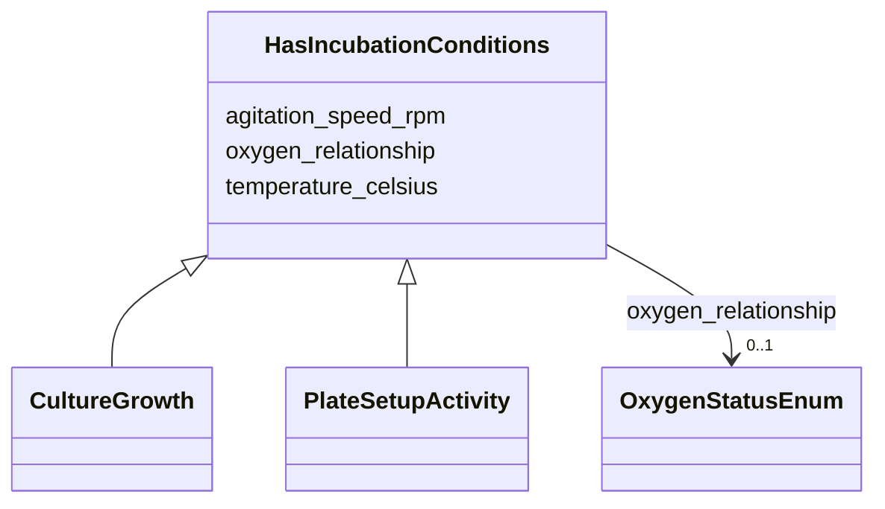

# Class: HasIncubationConditions 


_Mixin for activities/setups that involve controlled incubation._

_Used by CultureGrowth activities AND PlateSetupActivity, which share_

_temperature and agitation parameters but live in different branches_

_of the sampleProcessing is_a tree._


URI: [basalt_schema:HasIncubationConditions](https://emsl-computing.github.io/BASALT-Schema/elements/HasIncubationConditions)





<!-- no inheritance hierarchy -->

## Class Properties

| Property | Value |
| --- | --- |
| Mixin | Yes |


## Slots

| Name | Cardinality and Range | Description | Inheritance |
| ---  | --- | --- | --- |
| [temperature_celsius](temperature_celsius.md) | 0..1 <br/> [Float](Float.md) | Temperature at which the method/process/activity was performed | direct |
| [agitation_speed_rpm](agitation_speed_rpm.md) | 0..1 <br/> [Integer](Integer.md) | Agitation/shaking speed in RPM (0 for static) | direct |
| [oxygen_relationship](oxygen_relationship.md) | 0..1 <br/> [OxygenStatusEnum](OxygenStatusEnum.md) | The relationship of the sample to oxygen, such as aerobic or anaerobic | direct |


## Mixin Usage

| mixed into | description |
| --- | --- |
| [CultureGrowth](CultureGrowth.md) | Abstract activity for growing cultures from samples or other cultures |
| [PlateSetupActivity](PlateSetupActivity.md) | Abstract base for 96-well plate setup activities |


## Identifier and Mapping Information


### Schema Source


* from schema: https://emsl-computing.github.io/BASALT-Schema


## Mappings

| Mapping Type | Mapped Value |
| ---  | ---  |
| self | basalt_schema:HasIncubationConditions |
| native | basalt_schema:HasIncubationConditions |


## LinkML Source

<!-- TODO: investigate https://stackoverflow.com/questions/37606292/how-to-create-tabbed-code-blocks-in-mkdocs-or-sphinx -->

### Direct

<details>
```yaml
name: HasIncubationConditions
description: 'Mixin for activities/setups that involve controlled incubation.

  Used by CultureGrowth activities AND PlateSetupActivity, which share

  temperature and agitation parameters but live in different branches

  of the sampleProcessing is_a tree.'
from_schema: https://emsl-computing.github.io/BASALT-Schema
mixin: true
slots:
- temperature_celsius
- agitation_speed_rpm
- oxygen_relationship

```
</details>

### Induced

<details>
```yaml
name: HasIncubationConditions
description: 'Mixin for activities/setups that involve controlled incubation.

  Used by CultureGrowth activities AND PlateSetupActivity, which share

  temperature and agitation parameters but live in different branches

  of the sampleProcessing is_a tree.'
from_schema: https://emsl-computing.github.io/BASALT-Schema
mixin: true
attributes:
  temperature_celsius:
    name: temperature_celsius
    description: Temperature at which the method/process/activity was performed
    from_schema: https://emsl-computing.github.io/BASALT-Schema
    rank: 1000
    alias: temperature_celsius
    owner: HasIncubationConditions
    domain_of:
    - ChromatographyConfiguration
    - HasIncubationConditions
    range: float
  agitation_speed_rpm:
    name: agitation_speed_rpm
    description: Agitation/shaking speed in RPM (0 for static)
    from_schema: https://emsl-computing.github.io/BASALT-Schema
    rank: 1000
    alias: agitation_speed_rpm
    owner: HasIncubationConditions
    domain_of:
    - HasIncubationConditions
    range: integer
  oxygen_relationship:
    name: oxygen_relationship
    description: The relationship of the sample to oxygen, such as aerobic or anaerobic.
    title: oxygen relationship
    from_schema: https://emsl-computing.github.io/BASALT-Schema
    exact_mappings:
    - MIXS:0000015
    rank: 1000
    alias: oxygen_status
    owner: HasIncubationConditions
    domain_of:
    - HasIncubationConditions
    - CommerciallyPurchasedSample
    - CultureEnvironmentalSample
    - FieldDeployedTerraformSample
    - MixedCultureSample
    - OtherUndescribedSample
    - PureCultureSample
    - SedimentSample
    - SoilSample
    - SynthesizedMaterialSample
    - TerraformSample
    - WaterSample
    range: OxygenStatusEnum

```
</details>