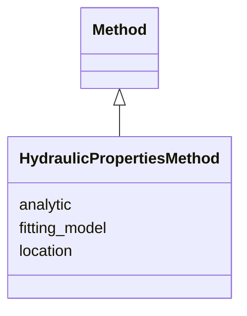

# Class: HydraulicPropertiesMethod 


URI: [analysis_api_schema:HydraulicPropertiesMethod](https://w3id.org/MONet/analysis-api-schema/HydraulicPropertiesMethod)





## Inheritance
* [Method](Method.md)
    * **HydraulicPropertiesMethod**


## Slots

| Name | Cardinality and Range | Description | Inheritance |
| ---  | --- | --- | --- |
| [location](location.md) | 1 <br/> [String](String.md) |  | direct |
| [fitting_model](fitting_model.md) | 1 <br/> [String](String.md) |  | direct |
| [analytic](analytic.md) | 1 <br/> [String](String.md) |  | [Method](Method.md) |


## Identifier and Mapping Information


### Schema Source


* from schema: https://w3id.org/MONet/analysis-api-schema


## Mappings

| Mapping Type | Mapped Value |
| ---  | ---  |
| self | analysis_api_schema:HydraulicPropertiesMethod |
| native | analysis_api_schema:HydraulicPropertiesMethod |


## LinkML Source

<!-- TODO: investigate https://stackoverflow.com/questions/37606292/how-to-create-tabbed-code-blocks-in-mkdocs-or-sphinx -->

### Direct

<details>
```yaml
name: HydraulicPropertiesMethod
from_schema: https://w3id.org/MONet/analysis-api-schema
rank: 1000
is_a: Method
slots:
- location
attributes:
  fitting_model:
    name: fitting_model
    from_schema: https://w3id.org/MONet/analysis-api-schema/methods
    rank: 1000
    domain_of:
    - HydraulicPropertiesMethod
    range: string
    required: true

```
</details>

### Induced

<details>
```yaml
name: HydraulicPropertiesMethod
from_schema: https://w3id.org/MONet/analysis-api-schema
rank: 1000
is_a: Method
attributes:
  fitting_model:
    name: fitting_model
    from_schema: https://w3id.org/MONet/analysis-api-schema/methods
    rank: 1000
    alias: fitting_model
    owner: HydraulicPropertiesMethod
    domain_of:
    - HydraulicPropertiesMethod
    range: string
    required: true
  location:
    name: location
    todos:
    - used on many method classes. no description. what was this meant to mean?
    from_schema: https://w3id.org/MONet/analysis-api-schema
    rank: 1000
    alias: location
    owner: HydraulicPropertiesMethod
    domain_of:
    - Instrument
    - EnzymeActivityMethod
    - GravimetricWaterContentMethod
    - HydraulicPropertiesMethod
    - KuoMethod
    - MicrobialBiomassMethod
    - PH_Method
    - TOC_TN_Method
    - TextureMethod
    - XrayComputedTomographyMethod
    range: string
    required: true
  analytic:
    name: analytic
    todos:
    - what does this mean
    from_schema: https://w3id.org/MONet/analysis-api-schema
    rank: 1000
    alias: analytic
    owner: HydraulicPropertiesMethod
    domain_of:
    - Method
    range: string
    required: true

```
</details>