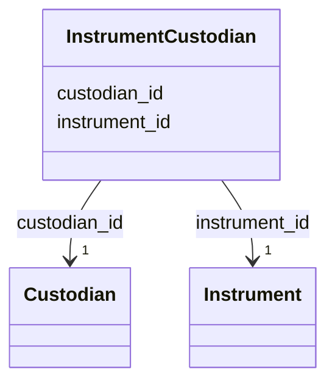

# Class: InstrumentCustodian 


URI: [analysis_api_schema:InstrumentCustodian](https://w3id.org/MONet/analysis-api-schema/InstrumentCustodian)





<!-- no inheritance hierarchy -->

## Slots

| Name | Cardinality and Range | Description | Inheritance |
| ---  | --- | --- | --- |
| [instrument_id](instrument_id.md) | 1 <br/> [Instrument](Instrument.md) |  | direct |
| [custodian_id](custodian_id.md) | 1 <br/> [Custodian](Custodian.md) |  | direct |


## Identifier and Mapping Information


### Schema Source


* from schema: https://w3id.org/MONet/analysis-api-schema


## Mappings

| Mapping Type | Mapped Value |
| ---  | ---  |
| self | analysis_api_schema:InstrumentCustodian |
| native | analysis_api_schema:InstrumentCustodian |


## LinkML Source

<!-- TODO: investigate https://stackoverflow.com/questions/37606292/how-to-create-tabbed-code-blocks-in-mkdocs-or-sphinx -->

### Direct

<details>
```yaml
name: InstrumentCustodian
from_schema: https://w3id.org/MONet/analysis-api-schema
attributes:
  instrument_id:
    name: instrument_id
    from_schema: https://w3id.org/MONet/analysis-api-schema
    domain_of:
    - InstrumentAlternativeIdentifier
    - InstrumentCustodian
    range: Instrument
    required: true
  custodian_id:
    name: custodian_id
    from_schema: https://w3id.org/MONet/analysis-api-schema
    rank: 1000
    domain_of:
    - InstrumentCustodian
    range: Custodian
    required: true

```
</details>

### Induced

<details>
```yaml
name: InstrumentCustodian
from_schema: https://w3id.org/MONet/analysis-api-schema
attributes:
  instrument_id:
    name: instrument_id
    from_schema: https://w3id.org/MONet/analysis-api-schema
    alias: instrument_id
    owner: InstrumentCustodian
    domain_of:
    - InstrumentAlternativeIdentifier
    - InstrumentCustodian
    range: Instrument
    required: true
  custodian_id:
    name: custodian_id
    from_schema: https://w3id.org/MONet/analysis-api-schema
    rank: 1000
    alias: custodian_id
    owner: InstrumentCustodian
    domain_of:
    - InstrumentCustodian
    range: Custodian
    required: true

```
</details>