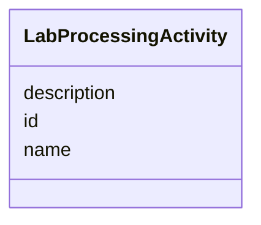

# Class: LabProcessingActivity 


_[NEW ABSTRACT CLASS] Higher-level abstract base for any activity that_

_transforms or creates physical lab materials._

__

_sampleProcessing inherits from this via is_a.  This class provides the_

_common identity layer, allowing future extensions (e.g. non-sample_

_consuming activities) without forcing them into the sampleProcessing branch._

__

_NOTE: In the live schema, sampleProcessing should gain_

_  is_a: labProcessingActivity_

_and its existing id attribute can be retained or removed (inherited)._


* __NOTE__: this is an abstract class and should not be instantiated directly


URI: [basalt_schema:LabProcessingActivity](https://EMSL-Computing.github.io/basalt-schema/LabProcessingActivity)





<!-- no inheritance hierarchy -->

## Slots

| Name | Cardinality and Range | Description | Inheritance |
| ---  | --- | --- | --- |
| [id](id.md) | 1 <br/> [Uuid](Uuid.md) |  | direct |
| [name](name.md) | 0..1 <br/> [String](String.md) | Human-readable name for the activity | direct |
| [description](description.md) | 0..1 <br/> [String](String.md) | Free-text description of the activity | direct |


## Identifier and Mapping Information


### Schema Source


* from schema: https://EMSL-Computing.github.io/basalt-schema


## Mappings

| Mapping Type | Mapped Value |
| ---  | ---  |
| self | basalt_schema:LabProcessingActivity |
| native | basalt_schema:LabProcessingActivity |


## LinkML Source

<!-- TODO: investigate https://stackoverflow.com/questions/37606292/how-to-create-tabbed-code-blocks-in-mkdocs-or-sphinx -->

### Direct

<details>
```yaml
name: LabProcessingActivity
description: "[NEW ABSTRACT CLASS] Higher-level abstract base for any activity that\n\
  transforms or creates physical lab materials.\n\nsampleProcessing inherits from\
  \ this via is_a.  This class provides the\ncommon identity layer, allowing future\
  \ extensions (e.g. non-sample\nconsuming activities) without forcing them into the\
  \ sampleProcessing branch.\n\nNOTE: In the live schema, sampleProcessing should\
  \ gain\n  is_a: labProcessingActivity\nand its existing id attribute can be retained\
  \ or removed (inherited)."
from_schema: https://EMSL-Computing.github.io/basalt-schema
abstract: true
attributes:
  id:
    name: id
    from_schema: https://EMSL-Computing.github.io/basalt-schema/media-strain-culture-plate
    identifier: true
    domain_of:
    - Activity
    - Entity
    - DataProduct
    - DataGenerationActivity
    - DataProcessingActivity
    - AlternativeIdentifier
    - FunctionalAnnotationIdentifier
    - Instrument
    - OntologyClass
    - ContainerType
    - Custodian
    - InstrumentAlternativeIdentifier
    - LabDevice
    - SampleProcessing
    - ProcessingSampleLink
    - Configuration
    - MobilePhaseSegment
    - MassSpectrometryStandardRun
    - PurchasedMaterial
    - LabProcessingActivity
    - organism
    - MAOMProduct
    - WEOMProduct
    - Site
    - Sample
    - AerosolArmSample
    - AerosolSample
    - AMP2UserSample
    - CommerciallyPurchasedSample
    - CultureEnvironmentalSample
    - EngineeredStrainSample
    - FieldDeployedTerraformSample
    - MixedCultureSample
    - MonetSoilSample
    - OtherUndescribedSample
    - PlantSample
    - PureCultureSample
    - SedimentSample
    - SoilSample
    - SynthesizedMaterialSample
    - TerraformSample
    - WaterSample
    - ProcessedSample
    - CoreSection
    - SamplingActivity
    - AerosolArmSamplingActivity
    - AerosolSamplingActivity
    - CommerciallyPurchasedSamplingActivity
    - CultureEnvironmentalSamplingActivity
    - EngineeredStrainSamplingActivity
    - FieldDeployedTerraformSamplingActivity
    - MixedCultureSamplingActivity
    - MonetSoilSamplingActivity
    - OtherUndescribedSamplingActivity
    - PlantSamplingActivity
    - PureCultureSamplingActivity
    - SedimentSamplingActivity
    - SoilSamplingActivity
    - SynthesizedMaterialSamplingActivity
    - TerraformSamplingActivity
    - WaterSamplingActivity
    - Study
    - ProjectParticipant
    - TimestampValue
    - TextValue
    - SoftwareControlledTermValue
    - ControlledTermValue
    - PersonValue
    - QuantityValue
    - ConditioningValue
    - zipDownload
    range: uuid
    required: true
  name:
    name: name
    description: Human-readable name for the activity
    from_schema: https://EMSL-Computing.github.io/basalt-schema/media-strain-culture-plate
    domain_of:
    - Activity
    - Entity
    - DataProduct
    - DataGenerationActivity
    - Instrument
    - OntologyClass
    - ContainerAxis
    - Configuration
    - MobilePhaseSegment
    - MassSpectrometryStandardRun
    - PurchasedMaterial
    - LabProcessingActivity
    - organism
    - Site
    - Sample
    - SamplingActivity
    - SoilSamplingActivity
    - Study
    - SoftwareControlledTermValue
    range: string
  description:
    name: description
    description: Free-text description of the activity
    from_schema: https://EMSL-Computing.github.io/basalt-schema/media-strain-culture-plate
    domain_of:
    - Activity
    - Entity
    - DataProduct
    - DataGenerationActivity
    - DataProcessingActivity
    - OntologyClass
    - ContainerType
    - LabDevice
    - Configuration
    - MassSpectrometryStandardRun
    - PurchasedMaterial
    - LabProcessingActivity
    - organism
    - Site
    - Sample
    - SamplingActivity
    - SoilSamplingActivity
    - Study
    - TimestampValue
    - TextValue
    - SoftwareControlledTermValue
    - ControlledTermValue
    - QuantityValue
    range: string

```
</details>

### Induced

<details>
```yaml
name: LabProcessingActivity
description: "[NEW ABSTRACT CLASS] Higher-level abstract base for any activity that\n\
  transforms or creates physical lab materials.\n\nsampleProcessing inherits from\
  \ this via is_a.  This class provides the\ncommon identity layer, allowing future\
  \ extensions (e.g. non-sample\nconsuming activities) without forcing them into the\
  \ sampleProcessing branch.\n\nNOTE: In the live schema, sampleProcessing should\
  \ gain\n  is_a: labProcessingActivity\nand its existing id attribute can be retained\
  \ or removed (inherited)."
from_schema: https://EMSL-Computing.github.io/basalt-schema
abstract: true
attributes:
  id:
    name: id
    from_schema: https://EMSL-Computing.github.io/basalt-schema/media-strain-culture-plate
    identifier: true
    alias: id
    owner: LabProcessingActivity
    domain_of:
    - Activity
    - Entity
    - DataProduct
    - DataGenerationActivity
    - DataProcessingActivity
    - AlternativeIdentifier
    - FunctionalAnnotationIdentifier
    - Instrument
    - OntologyClass
    - ContainerType
    - Custodian
    - InstrumentAlternativeIdentifier
    - LabDevice
    - SampleProcessing
    - ProcessingSampleLink
    - Configuration
    - MobilePhaseSegment
    - MassSpectrometryStandardRun
    - PurchasedMaterial
    - LabProcessingActivity
    - organism
    - MAOMProduct
    - WEOMProduct
    - Site
    - Sample
    - AerosolArmSample
    - AerosolSample
    - AMP2UserSample
    - CommerciallyPurchasedSample
    - CultureEnvironmentalSample
    - EngineeredStrainSample
    - FieldDeployedTerraformSample
    - MixedCultureSample
    - MonetSoilSample
    - OtherUndescribedSample
    - PlantSample
    - PureCultureSample
    - SedimentSample
    - SoilSample
    - SynthesizedMaterialSample
    - TerraformSample
    - WaterSample
    - ProcessedSample
    - CoreSection
    - SamplingActivity
    - AerosolArmSamplingActivity
    - AerosolSamplingActivity
    - CommerciallyPurchasedSamplingActivity
    - CultureEnvironmentalSamplingActivity
    - EngineeredStrainSamplingActivity
    - FieldDeployedTerraformSamplingActivity
    - MixedCultureSamplingActivity
    - MonetSoilSamplingActivity
    - OtherUndescribedSamplingActivity
    - PlantSamplingActivity
    - PureCultureSamplingActivity
    - SedimentSamplingActivity
    - SoilSamplingActivity
    - SynthesizedMaterialSamplingActivity
    - TerraformSamplingActivity
    - WaterSamplingActivity
    - Study
    - ProjectParticipant
    - TimestampValue
    - TextValue
    - SoftwareControlledTermValue
    - ControlledTermValue
    - PersonValue
    - QuantityValue
    - ConditioningValue
    - zipDownload
    range: uuid
    required: true
  name:
    name: name
    description: Human-readable name for the activity
    from_schema: https://EMSL-Computing.github.io/basalt-schema/media-strain-culture-plate
    alias: name
    owner: LabProcessingActivity
    domain_of:
    - Activity
    - Entity
    - DataProduct
    - DataGenerationActivity
    - Instrument
    - OntologyClass
    - ContainerAxis
    - Configuration
    - MobilePhaseSegment
    - MassSpectrometryStandardRun
    - PurchasedMaterial
    - LabProcessingActivity
    - organism
    - Site
    - Sample
    - SamplingActivity
    - SoilSamplingActivity
    - Study
    - SoftwareControlledTermValue
    range: string
  description:
    name: description
    description: Free-text description of the activity
    from_schema: https://EMSL-Computing.github.io/basalt-schema/media-strain-culture-plate
    alias: description
    owner: LabProcessingActivity
    domain_of:
    - Activity
    - Entity
    - DataProduct
    - DataGenerationActivity
    - DataProcessingActivity
    - OntologyClass
    - ContainerType
    - LabDevice
    - Configuration
    - MassSpectrometryStandardRun
    - PurchasedMaterial
    - LabProcessingActivity
    - organism
    - Site
    - Sample
    - SamplingActivity
    - SoilSamplingActivity
    - Study
    - TimestampValue
    - TextValue
    - SoftwareControlledTermValue
    - ControlledTermValue
    - QuantityValue
    range: string

```
</details>