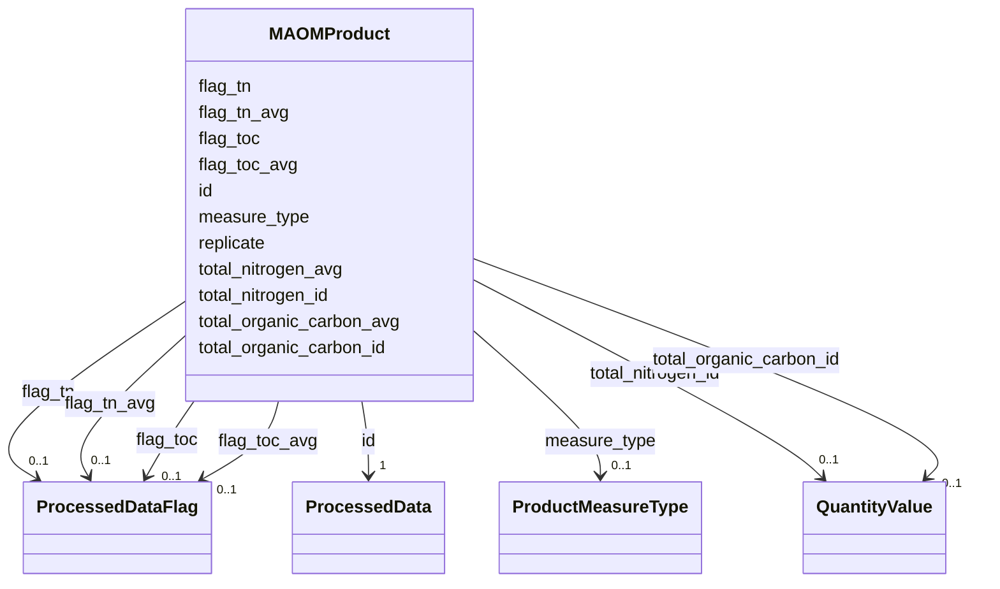

# Class: MAOMProduct 


_Mineral-Associated Organic Matter (MAOM) analysis product, typically derived via HCl extraction and TOC/TN measurement._

_One row per sample with columns for total organic carbon and total nitrogen._

_Individual QC flags for each measurement using ProcessedDataFlag enum. TO BE RENAMED TO HClExtOMProduct_


URI: [basalt_schema:MAOMProduct](https://EMSL-Computing.github.io/BASALT-Schema/MAOMProduct)





<!-- no inheritance hierarchy -->

## Slots

| Name | Cardinality and Range | Description | Inheritance |
| ---  | --- | --- | --- |
| [measure_type](measure_type.md) | 0..1 <br/> [ProductMeasureType](ProductMeasureType.md) | Whether the measurement recorded is a single measurement, one of a set of  re... | direct |
| [replicate](replicate.md) | 0..1 <br/> [Integer](Integer.md) | The replicate number of the sample or measurement, if applicable | direct |
| [id](id.md) | 1 <br/> [ProcessedData](ProcessedData.md) |  | direct |
| [total_organic_carbon_id](total_organic_carbon_id.md) | 0..1 <br/> [QuantityValue](QuantityValue.md) |  | direct |
| [total_organic_carbon_avg](total_organic_carbon_avg.md) | 0..1 <br/> [Double](Double.md) |  | direct |
| [total_nitrogen_id](total_nitrogen_id.md) | 0..1 <br/> [QuantityValue](QuantityValue.md) |  | direct |
| [total_nitrogen_avg](total_nitrogen_avg.md) | 0..1 <br/> [Double](Double.md) |  | direct |
| [flag_toc](flag_toc.md) | 0..1 <br/> [ProcessedDataFlag](ProcessedDataFlag.md) |  | direct |
| [flag_tn](flag_tn.md) | 0..1 <br/> [ProcessedDataFlag](ProcessedDataFlag.md) |  | direct |
| [flag_toc_avg](flag_toc_avg.md) | 0..1 <br/> [ProcessedDataFlag](ProcessedDataFlag.md) |  | direct |
| [flag_tn_avg](flag_tn_avg.md) | 0..1 <br/> [ProcessedDataFlag](ProcessedDataFlag.md) |  | direct |


## Identifier and Mapping Information


### Schema Source


* from schema: https://EMSL-Computing.github.io/BASALT-Schema


## Mappings

| Mapping Type | Mapped Value |
| ---  | ---  |
| self | basalt_schema:MAOMProduct |
| native | basalt_schema:MAOMProduct |


## LinkML Source

<!-- TODO: investigate https://stackoverflow.com/questions/37606292/how-to-create-tabbed-code-blocks-in-mkdocs-or-sphinx -->

### Direct

<details>
```yaml
name: MAOMProduct
description: 'Mineral-Associated Organic Matter (MAOM) analysis product, typically
  derived via HCl extraction and TOC/TN measurement.

  One row per sample with columns for total organic carbon and total nitrogen.

  Individual QC flags for each measurement using ProcessedDataFlag enum. TO BE RENAMED
  TO HClExtOMProduct'
from_schema: https://EMSL-Computing.github.io/BASALT-Schema
slots:
- measure_type
- replicate
attributes:
  id:
    name: id
    from_schema: https://EMSL-Computing.github.io/BASALT-Schema/products
    identifier: true
    domain_of:
    - Activity
    - Entity
    - DataProduct
    - DataGenerationActivity
    - DataProcessingActivity
    - AlternativeIdentifier
    - FunctionalAnnotationIdentifier
    - Instrument
    - OntologyClass
    - ContainerType
    - Custodian
    - InstrumentAlternativeIdentifier
    - LabDevice
    - SampleProcessing
    - ProcessingSampleLink
    - Configuration
    - MobilePhaseSegment
    - MassSpectrometryStandardRun
    - PurchasedMaterial
    - LabProcessingActivity
    - organism
    - MAOMProduct
    - WEOMProduct
    - Site
    - Sample
    - AerosolArmSample
    - AerosolSample
    - AMP2UserSample
    - CommerciallyPurchasedSample
    - CultureEnvironmentalSample
    - EngineeredStrainSample
    - FieldDeployedTerraformSample
    - MixedCultureSample
    - MonetSoilSample
    - OtherUndescribedSample
    - PlantSample
    - PureCultureSample
    - SedimentSample
    - SoilSample
    - SynthesizedMaterialSample
    - TerraformSample
    - WaterSample
    - ProcessedSample
    - CoreSection
    - SamplingActivity
    - AerosolArmSamplingActivity
    - AerosolSamplingActivity
    - CommerciallyPurchasedSamplingActivity
    - CultureEnvironmentalSamplingActivity
    - EngineeredStrainSamplingActivity
    - FieldDeployedTerraformSamplingActivity
    - MixedCultureSamplingActivity
    - MonetSoilSamplingActivity
    - OtherUndescribedSamplingActivity
    - PlantSamplingActivity
    - PureCultureSamplingActivity
    - SedimentSamplingActivity
    - SoilSamplingActivity
    - SynthesizedMaterialSamplingActivity
    - TerraformSamplingActivity
    - WaterSamplingActivity
    - Study
    - ProjectParticipant
    - TimestampValue
    - TextValue
    - SoftwareControlledTermValue
    - ControlledTermValue
    - PersonValue
    - QuantityValue
    - ConditioningValue
    - zipDownload
    range: ProcessedData
    required: true
  total_organic_carbon_id:
    name: total_organic_carbon_id
    from_schema: https://EMSL-Computing.github.io/BASALT-Schema/products
    rank: 1000
    domain_of:
    - MAOMProduct
    - WEOMProduct
    range: QuantityValue
  total_organic_carbon_avg:
    name: total_organic_carbon_avg
    from_schema: https://EMSL-Computing.github.io/BASALT-Schema/products
    rank: 1000
    domain_of:
    - MAOMProduct
    - WEOMProduct
    range: double
  total_nitrogen_id:
    name: total_nitrogen_id
    from_schema: https://EMSL-Computing.github.io/BASALT-Schema/products
    domain_of:
    - ElementalAnalysisProduct
    - MAOMProduct
    - WEOMProduct
    range: QuantityValue
  total_nitrogen_avg:
    name: total_nitrogen_avg
    from_schema: https://EMSL-Computing.github.io/BASALT-Schema/products
    rank: 1000
    domain_of:
    - MAOMProduct
    - WEOMProduct
    range: double
  flag_toc:
    name: flag_toc
    from_schema: https://EMSL-Computing.github.io/BASALT-Schema/products
    rank: 1000
    domain_of:
    - MAOMProduct
    - WEOMProduct
    range: ProcessedDataFlag
  flag_tn:
    name: flag_tn
    from_schema: https://EMSL-Computing.github.io/BASALT-Schema/products
    rank: 1000
    domain_of:
    - MAOMProduct
    - WEOMProduct
    range: ProcessedDataFlag
  flag_toc_avg:
    name: flag_toc_avg
    from_schema: https://EMSL-Computing.github.io/BASALT-Schema/products
    rank: 1000
    domain_of:
    - MAOMProduct
    - WEOMProduct
    range: ProcessedDataFlag
  flag_tn_avg:
    name: flag_tn_avg
    from_schema: https://EMSL-Computing.github.io/BASALT-Schema/products
    rank: 1000
    domain_of:
    - MAOMProduct
    - WEOMProduct
    range: ProcessedDataFlag

```
</details>

### Induced

<details>
```yaml
name: MAOMProduct
description: 'Mineral-Associated Organic Matter (MAOM) analysis product, typically
  derived via HCl extraction and TOC/TN measurement.

  One row per sample with columns for total organic carbon and total nitrogen.

  Individual QC flags for each measurement using ProcessedDataFlag enum. TO BE RENAMED
  TO HClExtOMProduct'
from_schema: https://EMSL-Computing.github.io/BASALT-Schema
attributes:
  id:
    name: id
    from_schema: https://EMSL-Computing.github.io/BASALT-Schema/products
    identifier: true
    alias: id
    owner: MAOMProduct
    domain_of:
    - Activity
    - Entity
    - DataProduct
    - DataGenerationActivity
    - DataProcessingActivity
    - AlternativeIdentifier
    - FunctionalAnnotationIdentifier
    - Instrument
    - OntologyClass
    - ContainerType
    - Custodian
    - InstrumentAlternativeIdentifier
    - LabDevice
    - SampleProcessing
    - ProcessingSampleLink
    - Configuration
    - MobilePhaseSegment
    - MassSpectrometryStandardRun
    - PurchasedMaterial
    - LabProcessingActivity
    - organism
    - MAOMProduct
    - WEOMProduct
    - Site
    - Sample
    - AerosolArmSample
    - AerosolSample
    - AMP2UserSample
    - CommerciallyPurchasedSample
    - CultureEnvironmentalSample
    - EngineeredStrainSample
    - FieldDeployedTerraformSample
    - MixedCultureSample
    - MonetSoilSample
    - OtherUndescribedSample
    - PlantSample
    - PureCultureSample
    - SedimentSample
    - SoilSample
    - SynthesizedMaterialSample
    - TerraformSample
    - WaterSample
    - ProcessedSample
    - CoreSection
    - SamplingActivity
    - AerosolArmSamplingActivity
    - AerosolSamplingActivity
    - CommerciallyPurchasedSamplingActivity
    - CultureEnvironmentalSamplingActivity
    - EngineeredStrainSamplingActivity
    - FieldDeployedTerraformSamplingActivity
    - MixedCultureSamplingActivity
    - MonetSoilSamplingActivity
    - OtherUndescribedSamplingActivity
    - PlantSamplingActivity
    - PureCultureSamplingActivity
    - SedimentSamplingActivity
    - SoilSamplingActivity
    - SynthesizedMaterialSamplingActivity
    - TerraformSamplingActivity
    - WaterSamplingActivity
    - Study
    - ProjectParticipant
    - TimestampValue
    - TextValue
    - SoftwareControlledTermValue
    - ControlledTermValue
    - PersonValue
    - QuantityValue
    - ConditioningValue
    - zipDownload
    range: ProcessedData
    required: true
  total_organic_carbon_id:
    name: total_organic_carbon_id
    from_schema: https://EMSL-Computing.github.io/BASALT-Schema/products
    rank: 1000
    alias: total_organic_carbon_id
    owner: MAOMProduct
    domain_of:
    - MAOMProduct
    - WEOMProduct
    range: QuantityValue
  total_organic_carbon_avg:
    name: total_organic_carbon_avg
    from_schema: https://EMSL-Computing.github.io/BASALT-Schema/products
    rank: 1000
    alias: total_organic_carbon_avg
    owner: MAOMProduct
    domain_of:
    - MAOMProduct
    - WEOMProduct
    range: double
  total_nitrogen_id:
    name: total_nitrogen_id
    from_schema: https://EMSL-Computing.github.io/BASALT-Schema/products
    alias: total_nitrogen_id
    owner: MAOMProduct
    domain_of:
    - ElementalAnalysisProduct
    - MAOMProduct
    - WEOMProduct
    range: QuantityValue
  total_nitrogen_avg:
    name: total_nitrogen_avg
    from_schema: https://EMSL-Computing.github.io/BASALT-Schema/products
    rank: 1000
    alias: total_nitrogen_avg
    owner: MAOMProduct
    domain_of:
    - MAOMProduct
    - WEOMProduct
    range: double
  flag_toc:
    name: flag_toc
    from_schema: https://EMSL-Computing.github.io/BASALT-Schema/products
    rank: 1000
    alias: flag_toc
    owner: MAOMProduct
    domain_of:
    - MAOMProduct
    - WEOMProduct
    range: ProcessedDataFlag
  flag_tn:
    name: flag_tn
    from_schema: https://EMSL-Computing.github.io/BASALT-Schema/products
    rank: 1000
    alias: flag_tn
    owner: MAOMProduct
    domain_of:
    - MAOMProduct
    - WEOMProduct
    range: ProcessedDataFlag
  flag_toc_avg:
    name: flag_toc_avg
    from_schema: https://EMSL-Computing.github.io/BASALT-Schema/products
    rank: 1000
    alias: flag_toc_avg
    owner: MAOMProduct
    domain_of:
    - MAOMProduct
    - WEOMProduct
    range: ProcessedDataFlag
  flag_tn_avg:
    name: flag_tn_avg
    from_schema: https://EMSL-Computing.github.io/BASALT-Schema/products
    rank: 1000
    alias: flag_tn_avg
    owner: MAOMProduct
    domain_of:
    - MAOMProduct
    - WEOMProduct
    range: ProcessedDataFlag
  measure_type:
    name: measure_type
    description: Whether the measurement recorded is a single measurement, one of
      a set of  replicate measurements, or an average of several replicate measurements.
    from_schema: https://EMSL-Computing.github.io/BASALT-Schema
    rank: 1000
    alias: measure_type
    owner: MAOMProduct
    domain_of:
    - BulkDensityProduct
    - ElementalAnalysisProduct
    - EnzymeProduct
    - GWCMoistureProduct
    - HydraulicPropertiesProduct
    - IonsAnalysisProduct
    - MAOMProduct
    - MicrobialBiomassProduct
    - NitrogenAnalysisProduct
    - PhosphorusAnalysisProduct
    - RespirationProduct
    - TextureProduct
    - TomographyProduct
    - WEOMProduct
    - pHProduct
    - XRFElementalProduct
    - XRDPhaseProduct
    range: ProductMeasureType
  replicate:
    name: replicate
    description: The replicate number of the sample or measurement, if applicable.
    todos:
    - reconcile replicate modelling
    from_schema: https://EMSL-Computing.github.io/BASALT-Schema
    rank: 1000
    alias: replicate
    owner: MAOMProduct
    domain_of:
    - MAOMProduct
    - MicrobialBiomassProduct
    - NitrogenAnalysisProduct
    - PhosphorusAnalysisProduct
    - WEOMProduct
    - ProcessedSample
    range: integer

```
</details>