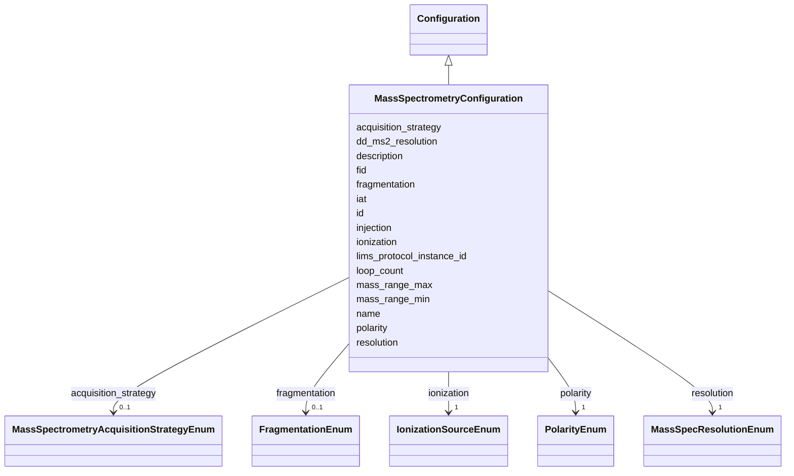

# Class: MassSpectrometryConfiguration 


_Instrument configuration and setup for a mass spectrometry run._


URI: [basalt_schema:MassSpectrometryConfiguration](https://emsl-computing.github.io/BASALT-Schema/elements/MassSpectrometryConfiguration)





## Inheritance
* [Configuration](Configuration.md)
    * **MassSpectrometryConfiguration**


## Slots

| Name | Cardinality and Range | Description | Inheritance |
| ---  | --- | --- | --- |
| [injection](injection.md) | 1 <br/> [String](String.md) | Type of injection used in the mass spectrometry method | direct |
| [ionization](ionization.md) | 1 <br/> [IonizationSourceEnum](IonizationSourceEnum.md) | Type of ionization used in the mass spectrometry method | direct |
| [fragmentation](fragmentation.md) | 0..1 <br/> [FragmentationEnum](FragmentationEnum.md) | fragmentation technique used in the mass spectrometry run | direct |
| [polarity](polarity.md) | 1 <br/> [PolarityEnum](PolarityEnum.md) | Polarity setting used in the mass spectrometry method | direct |
| [resolution](resolution.md) | 1 <br/> [MassSpecResolutionEnum](MassSpecResolutionEnum.md) |  | direct |
| [dd_ms2_resolution](dd_ms2_resolution.md) | 1 <br/> [Double](Double.md) | Data-dependent MS2 resolution setting used in the mass spectrometry method | direct |
| [loop_count](loop_count.md) | 1 <br/> [String](String.md) | Number of MS2 scans to be acquired between each full MS scan | direct |
| [iat](iat.md) | 0..1 <br/> [Double](Double.md) | Ion accumulation time setting used in the mass spectrometry method | direct |
| [fid](fid.md) | 0..1 <br/> [Double](Double.md) | Free induction decay | direct |
| [mass_range_max](mass_range_max.md) | 0..1 <br/> [Float](Float.md) | The maximum mass observable by this run (in m/z) | direct |
| [mass_range_min](mass_range_min.md) | 0..1 <br/> [Float](Float.md) | The minimum mass observable by this run (in m/z) | direct |
| [acquisition_strategy](acquisition_strategy.md) | 0..1 <br/> [MassSpectrometryAcquisitionStrategyEnum](MassSpectrometryAcquisitionStrategyEnum.md) | The acquisition strategy used in the mass spectrometry run | direct |
| [lims_protocol_instance_id](lims_protocol_instance_id.md) | 0..1 <br/> [Integer](Integer.md) | Reference to the L7 protocol_instance that corresponds to this sample process... | direct |
| [name](name.md) | 1 <br/> [String](String.md) | Human-readable name for the entity or activity | [Configuration](Configuration.md) |
| [description](description.md) | 0..1 <br/> [String](String.md) | Human-readable description for the entity or activity | [Configuration](Configuration.md) |
| [id](id.md) | 1 <br/> [Uuid](Uuid.md) |  | [Configuration](Configuration.md) |


## Usages

| used by | used in | type | used |
| ---  | --- | --- | --- |
| [MassSpectrometryDataGenerationActivity](MassSpectrometryDataGenerationActivity.md) | [uses_ms_configuration](uses_ms_configuration.md) | range | [MassSpectrometryConfiguration](MassSpectrometryConfiguration.md) |


## Identifier and Mapping Information


### Schema Source


* from schema: https://emsl-computing.github.io/BASALT-Schema


## Mappings

| Mapping Type | Mapped Value |
| ---  | ---  |
| self | basalt_schema:MassSpectrometryConfiguration |
| native | basalt_schema:MassSpectrometryConfiguration |


## LinkML Source

<!-- TODO: investigate https://stackoverflow.com/questions/37606292/how-to-create-tabbed-code-blocks-in-mkdocs-or-sphinx -->

### Direct

<details>
```yaml
name: MassSpectrometryConfiguration
description: Instrument configuration and setup for a mass spectrometry run.
from_schema: https://emsl-computing.github.io/BASALT-Schema
is_a: Configuration
slots:
- injection
- ionization
- fragmentation
- polarity
- resolution
- dd_ms2_resolution
- loop_count
- iat
- fid
- mass_range_max
- mass_range_min
- acquisition_strategy
- lims_protocol_instance_id

```
</details>

### Induced

<details>
```yaml
name: MassSpectrometryConfiguration
description: Instrument configuration and setup for a mass spectrometry run.
from_schema: https://emsl-computing.github.io/BASALT-Schema
is_a: Configuration
attributes:
  injection:
    name: injection
    description: Type of injection used in the mass spectrometry method
    from_schema: https://emsl-computing.github.io/BASALT-Schema
    rank: 1000
    alias: injection
    owner: MassSpectrometryConfiguration
    domain_of:
    - MassSpectrometryConfiguration
    range: string
    required: true
  ionization:
    name: ionization
    description: Type of ionization used in the mass spectrometry method
    from_schema: https://emsl-computing.github.io/BASALT-Schema
    rank: 1000
    alias: ionization
    owner: MassSpectrometryConfiguration
    domain_of:
    - MassSpectrometryConfiguration
    range: IonizationSourceEnum
    required: true
  fragmentation:
    name: fragmentation
    description: fragmentation technique used in the mass spectrometry run
    from_schema: https://emsl-computing.github.io/BASALT-Schema
    rank: 1000
    alias: fragmentation
    owner: MassSpectrometryConfiguration
    domain_of:
    - MassSpectrometryConfiguration
    range: FragmentationEnum
  polarity:
    name: polarity
    description: Polarity setting used in the mass spectrometry method
    from_schema: https://emsl-computing.github.io/BASALT-Schema
    rank: 1000
    alias: polarity
    owner: MassSpectrometryConfiguration
    domain_of:
    - MassSpectrometryConfiguration
    range: PolarityEnum
    required: true
  resolution:
    name: resolution
    from_schema: https://emsl-computing.github.io/BASALT-Schema
    rank: 1000
    alias: resolution
    owner: MassSpectrometryConfiguration
    domain_of:
    - MassSpectrometryConfiguration
    range: MassSpecResolutionEnum
    required: true
  dd_ms2_resolution:
    name: dd_ms2_resolution
    description: Data-dependent MS2 resolution setting used in the mass spectrometry
      method
    from_schema: https://emsl-computing.github.io/BASALT-Schema
    rank: 1000
    alias: dd_ms2_resolution
    owner: MassSpectrometryConfiguration
    domain_of:
    - MassSpectrometryConfiguration
    range: double
    required: true
  loop_count:
    name: loop_count
    description: Number of MS2 scans to be acquired between each full MS scan.
    from_schema: https://emsl-computing.github.io/BASALT-Schema
    rank: 1000
    alias: loop_count
    owner: MassSpectrometryConfiguration
    domain_of:
    - MassSpectrometryConfiguration
    range: string
    required: true
  iat:
    name: iat
    description: Ion accumulation time setting used in the mass spectrometry method.
    from_schema: https://emsl-computing.github.io/BASALT-Schema
    rank: 1000
    alias: iat
    owner: MassSpectrometryConfiguration
    domain_of:
    - MassSpectrometryConfiguration
    range: double
  fid:
    name: fid
    description: Free induction decay
    todos:
    - is this a setting or a result?
    from_schema: https://emsl-computing.github.io/BASALT-Schema
    rank: 1000
    alias: fid
    owner: MassSpectrometryConfiguration
    domain_of:
    - MassSpectrometryConfiguration
    range: double
  mass_range_max:
    name: mass_range_max
    description: The maximum mass observable by this run (in m/z).
    from_schema: https://emsl-computing.github.io/BASALT-Schema
    rank: 1000
    alias: mass_range_max
    owner: MassSpectrometryConfiguration
    domain_of:
    - MassSpectrometryConfiguration
    range: float
  mass_range_min:
    name: mass_range_min
    description: The minimum mass observable by this run (in m/z).
    from_schema: https://emsl-computing.github.io/BASALT-Schema
    rank: 1000
    alias: mass_range_min
    owner: MassSpectrometryConfiguration
    domain_of:
    - MassSpectrometryConfiguration
    range: float
  acquisition_strategy:
    name: acquisition_strategy
    description: The acquisition strategy used in the mass spectrometry run.
    from_schema: https://emsl-computing.github.io/BASALT-Schema
    rank: 1000
    alias: acquisition_strategy
    owner: MassSpectrometryConfiguration
    domain_of:
    - MassSpectrometryConfiguration
    range: MassSpectrometryAcquisitionStrategyEnum
  lims_protocol_instance_id:
    name: lims_protocol_instance_id
    description: Reference to the L7 protocol_instance that corresponds to this sample
      processing step, if applicable.
    from_schema: https://emsl-computing.github.io/BASALT-Schema
    rank: 1000
    alias: lims_protocol_instance_id
    owner: MassSpectrometryConfiguration
    domain_of:
    - MassSpectrometryConfiguration
    range: integer
  name:
    name: name
    description: Human-readable name for the entity or activity.
    from_schema: https://emsl-computing.github.io/BASALT-Schema
    rank: 1000
    alias: name
    owner: MassSpectrometryConfiguration
    domain_of:
    - Activity
    - Entity
    - DataProduct
    - DataGenerationActivity
    - Instrument
    - OntologyClass
    - ContainerAxis
    - Configuration
    - MobilePhaseSegment
    - MassSpectrometryStandardRun
    - PurchasedMaterial
    - LabProcessingActivity
    - organism
    - Site
    - Sample
    - SamplingActivity
    - SoilSamplingActivity
    - Study
    - SoftwareControlledTermValue
    range: string
    required: true
  description:
    name: description
    description: Human-readable description for the entity or activity
    title: description
    from_schema: https://emsl-computing.github.io/BASALT-Schema
    rank: 1000
    alias: description
    owner: MassSpectrometryConfiguration
    domain_of:
    - Activity
    - Entity
    - DataProduct
    - DataGenerationActivity
    - DataProcessingActivity
    - OntologyClass
    - ContainerType
    - LabDevice
    - Configuration
    - MassSpectrometryStandardRun
    - PurchasedMaterial
    - LabProcessingActivity
    - organism
    - Site
    - Sample
    - SamplingActivity
    - SoilSamplingActivity
    - Study
    - TimestampValue
    - TextValue
    - SoftwareControlledTermValue
    - ControlledTermValue
    - QuantityValue
    range: string
  id:
    name: id
    from_schema: https://emsl-computing.github.io/BASALT-Schema/mass-spec
    alias: id
    owner: MassSpectrometryConfiguration
    domain_of:
    - Activity
    - Entity
    - DataProduct
    - DataGenerationActivity
    - DataProcessingActivity
    - AlternativeIdentifier
    - FunctionalAnnotationIdentifier
    - Instrument
    - OntologyClass
    - ContainerType
    - Custodian
    - InstrumentAlternativeIdentifier
    - LabDevice
    - SampleProcessing
    - ProcessingSampleLink
    - Configuration
    - MobilePhaseSegment
    - MassSpectrometryStandardRun
    - PurchasedMaterial
    - LabProcessingActivity
    - organism
    - MAOMProduct
    - WEOMProduct
    - Site
    - Sample
    - AerosolArmSample
    - AerosolSample
    - AMP2UserSample
    - CommerciallyPurchasedSample
    - CultureEnvironmentalSample
    - EngineeredStrainSample
    - FieldDeployedTerraformSample
    - MixedCultureSample
    - MonetSoilSample
    - OtherUndescribedSample
    - PlantSample
    - PureCultureSample
    - SedimentSample
    - SoilSample
    - SynthesizedMaterialSample
    - TerraformSample
    - WaterSample
    - ProcessedSample
    - CoreSection
    - SamplingActivity
    - AerosolArmSamplingActivity
    - AerosolSamplingActivity
    - CommerciallyPurchasedSamplingActivity
    - CultureEnvironmentalSamplingActivity
    - EngineeredStrainSamplingActivity
    - FieldDeployedTerraformSamplingActivity
    - MixedCultureSamplingActivity
    - MonetSoilSamplingActivity
    - OtherUndescribedSamplingActivity
    - PlantSamplingActivity
    - PureCultureSamplingActivity
    - SedimentSamplingActivity
    - SoilSamplingActivity
    - SynthesizedMaterialSamplingActivity
    - TerraformSamplingActivity
    - WaterSamplingActivity
    - Study
    - ProjectParticipant
    - TimestampValue
    - TextValue
    - SoftwareControlledTermValue
    - ControlledTermValue
    - PersonValue
    - QuantityValue
    - ConditioningValue
    - zipDownload
    range: uuid
    required: true

```
</details>