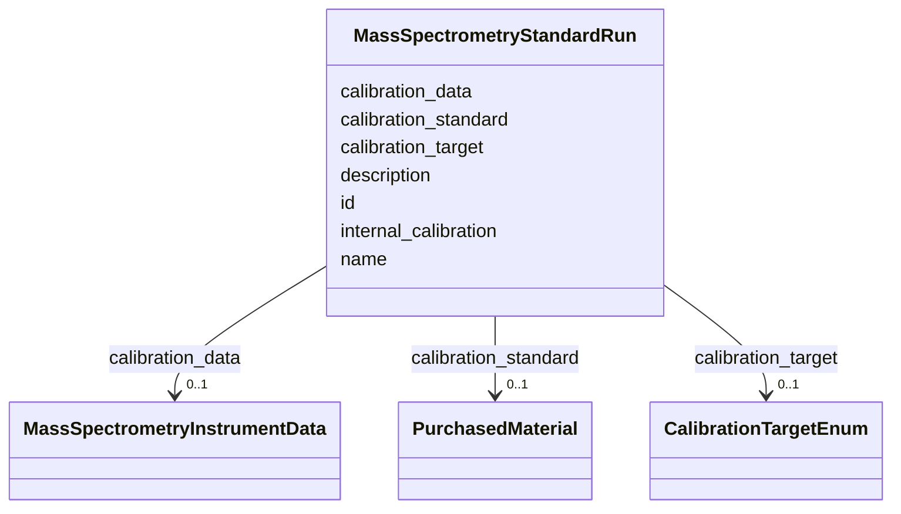

# Class: MassSpectrometryStandardRun 


URI: [analysis_api_schema:MassSpectrometryStandardRun](https://w3id.org/MONet/analysis-api-schema/MassSpectrometryStandardRun)





<!-- no inheritance hierarchy -->


## Slots

| Name | Cardinality and Range | Description | Inheritance |
| ---  | --- | --- | --- |
| [name](name.md) | 1 <br/> [String](String.md) | Human-readable name for the entity or activity | direct |
| [description](description.md) | 0..1 <br/> [String](String.md) | Human-readable description for the entity or activity | direct |
| [internal_calibration](internal_calibration.md) | 0..1 <br/> [Boolean](Boolean.md) | Whether internal calibration was used | direct |
| [calibration_target](calibration_target.md) | 0..1 <br/> [CalibrationTargetEnum](CalibrationTargetEnum.md) | The measurement being calibrated | direct |
| [calibration_standard](calibration_standard.md) | 0..1 <br/> [PurchasedMaterial](PurchasedMaterial.md) | The reference standard used for calibration | direct |
| [calibration_data](calibration_data.md) | 0..1 <br/> [MassSpectrometryInstrumentData](MassSpectrometryInstrumentData.md) | Reference to the raw instrument data file used for calibration | direct |
| [id](id.md) | 1 <br/> uuid |  | direct |


## Usages

| used by | used in | type | used |
| ---  | --- | --- | --- |
| [MassSpectrometryDataProcessingActivity](MassSpectrometryDataProcessingActivity.md) | [uses_calibration](uses_calibration.md) | range | [MassSpectrometryStandardRun](MassSpectrometryStandardRun.md) |


## Identifier and Mapping Information


### Schema Source


* from schema: https://w3id.org/MONet/analysis-api-schema


## Mappings

| Mapping Type | Mapped Value |
| ---  | ---  |
| self | analysis_api_schema:MassSpectrometryStandardRun |
| native | analysis_api_schema:MassSpectrometryStandardRun |


## LinkML Source

<!-- TODO: investigate https://stackoverflow.com/questions/37606292/how-to-create-tabbed-code-blocks-in-mkdocs-or-sphinx -->

### Direct

<details>
```yaml
name: MassSpectrometryStandardRun
from_schema: https://w3id.org/MONet/analysis-api-schema
rank: 1000
slots:
- name
- description
- internal_calibration
- calibration_target
- calibration_standard
- calibration_data
attributes:
  id:
    name: id
    from_schema: https://w3id.org/MONet/analysis-api-schema/mass-spec
    identifier: true
    domain_of:
    - Activity
    - Entity
    - DataProduct
    - DataGenerationActivity
    - DataProcessingActivity
    - AlternativeIdentifier
    - FunctionalAnnotationIdentifier
    - Instrument
    - OntologyClass
    - ContainerType
    - Custodian
    - InstrumentAlternativeIdentifier
    - LabDevice
    - SampleProcessing
    - ProcessingSampleLink
    - Configuration
    - MobilePhaseSegment
    - MassSpectrometryStandardRun
    - PurchasedMaterial
    - LabProcessingActivity
    - MAOMProduct
    - WEOMProduct
    - Site
    - Sample
    - AerosolArmSample
    - AerosolSample
    - AMP2UserSample
    - CommerciallyPurchasedSample
    - CultureEnvironmentalSample
    - EngineeredStrainSample
    - FieldDeployedTerraformSample
    - MixedCultureSample
    - MonetSoilSample
    - OtherUndescribedSample
    - PlantSample
    - PureCultureSample
    - SedimentSample
    - SoilSample
    - SynthesizedMaterialSample
    - TerraformSample
    - WaterSample
    - ProcessedSample
    - CoreSection
    - SamplingActivity
    - AerosolArmSamplingActivity
    - AerosolSamplingActivity
    - CommerciallyPurchasedSamplingActivity
    - CultureEnvironmentalSamplingActivity
    - EngineeredStrainSamplingActivity
    - FieldDeployedTerraformSamplingActivity
    - MixedCultureSamplingActivity
    - MonetSoilSamplingActivity
    - OtherUndescribedSamplingActivity
    - PlantSamplingActivity
    - PureCultureSamplingActivity
    - SedimentSamplingActivity
    - SoilSamplingActivity
    - SynthesizedMaterialSamplingActivity
    - TerraformSamplingActivity
    - WaterSamplingActivity
    - biological_entity
    - Study
    - ProjectParticipant
    - TimestampValue
    - TextValue
    - SoftwareControlledTermValue
    - ControlledTermValue
    - PersonValue
    - QuantityValue
    - ConditioningValue
    - zipDownload
    range: uuid
    required: true

```
</details>

### Induced

<details>
```yaml
name: MassSpectrometryStandardRun
from_schema: https://w3id.org/MONet/analysis-api-schema
rank: 1000
attributes:
  id:
    name: id
    from_schema: https://w3id.org/MONet/analysis-api-schema/mass-spec
    identifier: true
    alias: id
    owner: MassSpectrometryStandardRun
    domain_of:
    - Activity
    - Entity
    - DataProduct
    - DataGenerationActivity
    - DataProcessingActivity
    - AlternativeIdentifier
    - FunctionalAnnotationIdentifier
    - Instrument
    - OntologyClass
    - ContainerType
    - Custodian
    - InstrumentAlternativeIdentifier
    - LabDevice
    - SampleProcessing
    - ProcessingSampleLink
    - Configuration
    - MobilePhaseSegment
    - MassSpectrometryStandardRun
    - PurchasedMaterial
    - LabProcessingActivity
    - MAOMProduct
    - WEOMProduct
    - Site
    - Sample
    - AerosolArmSample
    - AerosolSample
    - AMP2UserSample
    - CommerciallyPurchasedSample
    - CultureEnvironmentalSample
    - EngineeredStrainSample
    - FieldDeployedTerraformSample
    - MixedCultureSample
    - MonetSoilSample
    - OtherUndescribedSample
    - PlantSample
    - PureCultureSample
    - SedimentSample
    - SoilSample
    - SynthesizedMaterialSample
    - TerraformSample
    - WaterSample
    - ProcessedSample
    - CoreSection
    - SamplingActivity
    - AerosolArmSamplingActivity
    - AerosolSamplingActivity
    - CommerciallyPurchasedSamplingActivity
    - CultureEnvironmentalSamplingActivity
    - EngineeredStrainSamplingActivity
    - FieldDeployedTerraformSamplingActivity
    - MixedCultureSamplingActivity
    - MonetSoilSamplingActivity
    - OtherUndescribedSamplingActivity
    - PlantSamplingActivity
    - PureCultureSamplingActivity
    - SedimentSamplingActivity
    - SoilSamplingActivity
    - SynthesizedMaterialSamplingActivity
    - TerraformSamplingActivity
    - WaterSamplingActivity
    - biological_entity
    - Study
    - ProjectParticipant
    - TimestampValue
    - TextValue
    - SoftwareControlledTermValue
    - ControlledTermValue
    - PersonValue
    - QuantityValue
    - ConditioningValue
    - zipDownload
    range: uuid
    required: true
  name:
    name: name
    description: Human-readable name for the entity or activity.
    from_schema: https://w3id.org/MONet/analysis-api-schema
    rank: 1000
    alias: name
    owner: MassSpectrometryStandardRun
    domain_of:
    - Activity
    - Entity
    - DataProduct
    - DataGenerationActivity
    - Instrument
    - OntologyClass
    - ContainerAxis
    - Configuration
    - MobilePhaseSegment
    - MassSpectrometryStandardRun
    - PurchasedMaterial
    - LabProcessingActivity
    - Site
    - Sample
    - SamplingActivity
    - SoilSamplingActivity
    - biological_entity
    - Study
    - SoftwareControlledTermValue
    range: string
    required: true
  description:
    name: description
    description: Human-readable description for the entity or activity
    title: description
    from_schema: https://w3id.org/MONet/analysis-api-schema
    rank: 1000
    alias: description
    owner: MassSpectrometryStandardRun
    domain_of:
    - Activity
    - Entity
    - DataProduct
    - DataGenerationActivity
    - DataProcessingActivity
    - OntologyClass
    - ContainerType
    - LabDevice
    - Configuration
    - MassSpectrometryStandardRun
    - PurchasedMaterial
    - LabProcessingActivity
    - Site
    - Sample
    - SamplingActivity
    - SoilSamplingActivity
    - biological_entity
    - Study
    - TimestampValue
    - TextValue
    - SoftwareControlledTermValue
    - ControlledTermValue
    - QuantityValue
    range: string
  internal_calibration:
    name: internal_calibration
    description: Whether internal calibration was used
    from_schema: https://w3id.org/MONet/analysis-api-schema
    rank: 1000
    alias: internal_calibration
    owner: MassSpectrometryStandardRun
    domain_of:
    - MassSpectrometryStandardRun
    range: boolean
  calibration_target:
    name: calibration_target
    description: The measurement being calibrated
    from_schema: https://w3id.org/MONet/analysis-api-schema
    rank: 1000
    alias: calibration_target
    owner: MassSpectrometryStandardRun
    domain_of:
    - MassSpectrometryStandardRun
    range: CalibrationTargetEnum
  calibration_standard:
    name: calibration_standard
    description: The reference standard used for calibration
    from_schema: https://w3id.org/MONet/analysis-api-schema
    rank: 1000
    alias: calibration_standard
    owner: MassSpectrometryStandardRun
    domain_of:
    - MassSpectrometryStandardRun
    range: PurchasedMaterial
  calibration_data:
    name: calibration_data
    description: Reference to the raw instrument data file used for calibration
    from_schema: https://w3id.org/MONet/analysis-api-schema
    rank: 1000
    alias: calibration_data
    owner: MassSpectrometryStandardRun
    domain_of:
    - MassSpectrometryStandardRun
    range: MassSpectrometryInstrumentData

```
</details>