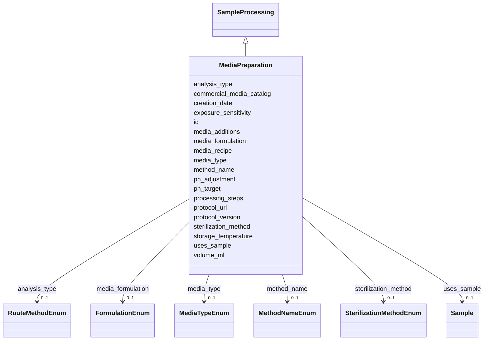

# Class: MediaPreparation 


_Activity that prepares a batch of growth media._

_Replaces the former labPreparationActivity + MediaCreation pattern._

__

_Media details (recipe, formulation, sterilisation, etc.) are carried as_

_slots on this activity.  The physical media batch is represented as a_

_processedSample(type='prepared_media') linked via processingSampleLink_

_(role: output_sample).  Downstream CultureGrowth and AMP2PlateSetupActivity_

_activities reference that processedSample via the media_ref FK slot._

__

_Lifecycle:_

_  MediaPreparation activity_

_    -> processingSampleLink(role=output_sample)_

_    -> processedSample(type='prepared_media'); media_ref points here_

_    -> CultureGrowth / AMP2PlateSetupActivity.media_ref_


URI: [basalt_schema:MediaPreparation](https://emsl-computing.github.io/BASALT-Schema/elements/MediaPreparation)





## Inheritance
* [SampleProcessing](SampleProcessing.md)
    * **MediaPreparation**


## Slots

| Name | Cardinality and Range | Description | Inheritance |
| ---  | --- | --- | --- |
| [media_type](media_type.md) | 0..1 <br/> [MediaTypeEnum](MediaTypeEnum.md) | Purpose/context of the media preparation | direct |
| [volume_ml](volume_ml.md) | 0..1 <br/> [Float](Float.md) | Volume of the entity in milliliters | direct |
| [media_recipe](media_recipe.md) | 0..1 <br/> [String](String.md) | Reference or description of recipe used to prepare media | direct |
| [media_formulation](media_formulation.md) | 0..1 <br/> [FormulationEnum](FormulationEnum.md) | Formulation method of the media (manual mix, commercial, etc | direct |
| [commercial_media_catalog](commercial_media_catalog.md) | 0..1 <br/> [String](String.md) | Reference to commercial media catalog entry if applicable | direct |
| [sterilization_method](sterilization_method.md) | 0..1 <br/> [SterilizationMethodEnum](SterilizationMethodEnum.md) | Method used to sterilize the entity (autoclave, filter, UV, etc | direct |
| [ph_adjustment](ph_adjustment.md) | 0..1 <br/> [Boolean](Boolean.md) | Whether the entity was pH-adjusted | direct |
| [ph_target](ph_target.md) | 0..1 <br/> [Float](Float.md) | Target pH value (required if ph_adjustment is true) | direct |
| [exposure_sensitivity](exposure_sensitivity.md) | * <br/> [String](String.md) | Sensitivity the entity has if exposed (e | direct |
| [media_additions](media_additions.md) | * <br/> [String](String.md) | Additional components added to the media (antibiotics, inducers, etc | direct |
| [storage_temperature](storage_temperature.md) | 0..1 <br/> [String](String.md) | Storage temperature for the sample (e | direct |
| [creation_date](creation_date.md) | 0..1 <br/> [Date](Date.md) | Date the entity or preparation was created | direct |
| [protocol_url](protocol_url.md) | 0..1 <br/> [String](String.md) | URL pointing to the protocol used in the activity, if applicable | [SampleProcessing](SampleProcessing.md) |
| [protocol_version](protocol_version.md) | 0..1 <br/> [String](String.md) | Version of the protocol used in the activity, if applicable | [SampleProcessing](SampleProcessing.md) |
| [id](id.md) | 1 <br/> [Uuid](Uuid.md) |  | [SampleProcessing](SampleProcessing.md) |
| [analysis_type](analysis_type.md) | 0..1 <br/> [RouteMethodEnum](RouteMethodEnum.md) |  | [SampleProcessing](SampleProcessing.md) |
| [method_name](method_name.md) | 0..1 <br/> [MethodNameEnum](MethodNameEnum.md) |  | [SampleProcessing](SampleProcessing.md) |
| [processing_steps](processing_steps.md) | 1 <br/> [String](String.md) |  | [SampleProcessing](SampleProcessing.md) |
| [uses_sample](uses_sample.md) | 0..1 <br/> [Sample](Sample.md) |  | [SampleProcessing](SampleProcessing.md) |


## TODOs

* storage_condt as enum?
* media range?


## Identifier and Mapping Information


### Schema Source


* from schema: https://emsl-computing.github.io/BASALT-Schema


## Mappings

| Mapping Type | Mapped Value |
| ---  | ---  |
| self | basalt_schema:MediaPreparation |
| native | basalt_schema:MediaPreparation |


## LinkML Source

<!-- TODO: investigate https://stackoverflow.com/questions/37606292/how-to-create-tabbed-code-blocks-in-mkdocs-or-sphinx -->

### Direct

<details>
```yaml
name: MediaPreparation
description: "Activity that prepares a batch of growth media.\nReplaces the former\
  \ labPreparationActivity + MediaCreation pattern.\n\nMedia details (recipe, formulation,\
  \ sterilisation, etc.) are carried as\nslots on this activity.  The physical media\
  \ batch is represented as a\nprocessedSample(type='prepared_media') linked via processingSampleLink\n\
  (role: output_sample).  Downstream CultureGrowth and AMP2PlateSetupActivity\nactivities\
  \ reference that processedSample via the media_ref FK slot.\n\nLifecycle:\n  MediaPreparation\
  \ activity\n    -> processingSampleLink(role=output_sample)\n    -> processedSample(type='prepared_media');\
  \ media_ref points here\n    -> CultureGrowth / AMP2PlateSetupActivity.media_ref"
todos:
- storage_condt as enum?
- media range?
from_schema: https://emsl-computing.github.io/BASALT-Schema
is_a: SampleProcessing
slots:
- media_type
- volume_ml
- media_recipe
- media_formulation
- commercial_media_catalog
- sterilization_method
- ph_adjustment
- ph_target
- exposure_sensitivity
- media_additions
- storage_temperature
- creation_date

```
</details>

### Induced

<details>
```yaml
name: MediaPreparation
description: "Activity that prepares a batch of growth media.\nReplaces the former\
  \ labPreparationActivity + MediaCreation pattern.\n\nMedia details (recipe, formulation,\
  \ sterilisation, etc.) are carried as\nslots on this activity.  The physical media\
  \ batch is represented as a\nprocessedSample(type='prepared_media') linked via processingSampleLink\n\
  (role: output_sample).  Downstream CultureGrowth and AMP2PlateSetupActivity\nactivities\
  \ reference that processedSample via the media_ref FK slot.\n\nLifecycle:\n  MediaPreparation\
  \ activity\n    -> processingSampleLink(role=output_sample)\n    -> processedSample(type='prepared_media');\
  \ media_ref points here\n    -> CultureGrowth / AMP2PlateSetupActivity.media_ref"
todos:
- storage_condt as enum?
- media range?
from_schema: https://emsl-computing.github.io/BASALT-Schema
is_a: SampleProcessing
attributes:
  media_type:
    name: media_type
    description: 'Purpose/context of the media preparation.

      Examples: strain_purity, stock_culture, pre_culture, rich_media.'
    from_schema: https://emsl-computing.github.io/BASALT-Schema
    rank: 1000
    alias: media_type
    owner: MediaPreparation
    domain_of:
    - MediaPreparation
    range: MediaTypeEnum
  volume_ml:
    name: volume_ml
    description: Volume of the entity in milliliters
    from_schema: https://emsl-computing.github.io/BASALT-Schema
    rank: 1000
    alias: volume_ml
    owner: MediaPreparation
    domain_of:
    - MediaPreparation
    range: float
  media_recipe:
    name: media_recipe
    description: 'Reference or description of recipe used to prepare media.

      Examples: "M9 media with 1% Glucose", "rich media with 10% LB and 90% glycerol"'
    from_schema: https://emsl-computing.github.io/BASALT-Schema
    rank: 1000
    alias: media_recipe
    owner: MediaPreparation
    domain_of:
    - MediaPreparation
    range: string
  media_formulation:
    name: media_formulation
    description: Formulation method of the media (manual mix, commercial, etc.)
    from_schema: https://emsl-computing.github.io/BASALT-Schema
    rank: 1000
    alias: media_formulation
    owner: MediaPreparation
    domain_of:
    - MediaPreparation
    range: FormulationEnum
  commercial_media_catalog:
    name: commercial_media_catalog
    description: 'Reference to commercial media catalog entry if applicable.

      Required if media_formulation is ''commercial'', otherwise null.'
    from_schema: https://emsl-computing.github.io/BASALT-Schema
    rank: 1000
    alias: commercial_media_catalog
    owner: MediaPreparation
    domain_of:
    - MediaPreparation
    range: string
  sterilization_method:
    name: sterilization_method
    description: Method used to sterilize the entity (autoclave, filter, UV, etc.)
    from_schema: https://emsl-computing.github.io/BASALT-Schema
    rank: 1000
    alias: sterilization_method
    owner: MediaPreparation
    domain_of:
    - MediaPreparation
    range: SterilizationMethodEnum
    required: false
  ph_adjustment:
    name: ph_adjustment
    description: Whether the entity was pH-adjusted
    from_schema: https://emsl-computing.github.io/BASALT-Schema
    rank: 1000
    alias: ph_adjustment
    owner: MediaPreparation
    domain_of:
    - MediaPreparation
    range: boolean
    required: false
  ph_target:
    name: ph_target
    description: Target pH value (required if ph_adjustment is true)
    from_schema: https://emsl-computing.github.io/BASALT-Schema
    rank: 1000
    alias: ph_target
    owner: MediaPreparation
    domain_of:
    - MediaPreparation
    range: float
    required: false
  exposure_sensitivity:
    name: exposure_sensitivity
    description: Sensitivity the entity has if exposed (e.g. light-sensitive, oxygen-sensitive)
    from_schema: https://emsl-computing.github.io/BASALT-Schema
    rank: 1000
    alias: exposure_sensitivity
    owner: MediaPreparation
    domain_of:
    - MediaPreparation
    range: string
    multivalued: true
  media_additions:
    name: media_additions
    description: 'Additional components added to the media (antibiotics, inducers,
      etc.).

      Examples: "100 ug/mL ampicillin", "1 mM IPTG"'
    from_schema: https://emsl-computing.github.io/BASALT-Schema
    rank: 1000
    alias: media_additions
    owner: MediaPreparation
    domain_of:
    - MediaPreparation
    range: string
    multivalued: true
  storage_temperature:
    name: storage_temperature
    description: Storage temperature for the sample (e.g., "-80 C", "4 C").
    from_schema: https://emsl-computing.github.io/BASALT-Schema
    rank: 1000
    alias: storage_temperature
    owner: MediaPreparation
    domain_of:
    - MediaPreparation
    - AMP2UserSample
    - EngineeredStrainSample
    range: string
  creation_date:
    name: creation_date
    description: Date the entity or preparation was created
    from_schema: https://emsl-computing.github.io/BASALT-Schema
    rank: 1000
    alias: creation_date
    owner: MediaPreparation
    domain_of:
    - MediaPreparation
    range: date
  protocol_url:
    name: protocol_url
    description: URL pointing to the protocol used in the activity, if applicable.
    from_schema: https://emsl-computing.github.io/BASALT-Schema
    rank: 1000
    alias: protocol_url
    owner: MediaPreparation
    domain_of:
    - DataGenerationActivity
    - SampleProcessing
    range: string
  protocol_version:
    name: protocol_version
    description: Version of the protocol used in the activity, if applicable.
    from_schema: https://emsl-computing.github.io/BASALT-Schema
    rank: 1000
    alias: protocol_version
    owner: MediaPreparation
    domain_of:
    - DataGenerationActivity
    - SampleProcessing
    range: string
  id:
    name: id
    from_schema: https://emsl-computing.github.io/BASALT-Schema
    identifier: true
    alias: id
    owner: MediaPreparation
    domain_of:
    - Activity
    - Entity
    - DataProduct
    - DataGenerationActivity
    - DataProcessingActivity
    - AlternativeIdentifier
    - FunctionalAnnotationIdentifier
    - Instrument
    - OntologyClass
    - ContainerType
    - Custodian
    - InstrumentAlternativeIdentifier
    - LabDevice
    - SampleProcessing
    - ProcessingSampleLink
    - Configuration
    - MobilePhaseSegment
    - MassSpectrometryStandardRun
    - PurchasedMaterial
    - LabProcessingActivity
    - organism
    - MAOMProduct
    - WEOMProduct
    - Site
    - Sample
    - AerosolArmSample
    - AerosolSample
    - AMP2UserSample
    - CommerciallyPurchasedSample
    - CultureEnvironmentalSample
    - EngineeredStrainSample
    - FieldDeployedTerraformSample
    - MixedCultureSample
    - MonetSoilSample
    - OtherUndescribedSample
    - PlantSample
    - PureCultureSample
    - SedimentSample
    - SoilSample
    - SynthesizedMaterialSample
    - TerraformSample
    - WaterSample
    - ProcessedSample
    - CoreSection
    - SamplingActivity
    - AerosolArmSamplingActivity
    - AerosolSamplingActivity
    - CommerciallyPurchasedSamplingActivity
    - CultureEnvironmentalSamplingActivity
    - EngineeredStrainSamplingActivity
    - FieldDeployedTerraformSamplingActivity
    - MixedCultureSamplingActivity
    - MonetSoilSamplingActivity
    - OtherUndescribedSamplingActivity
    - PlantSamplingActivity
    - PureCultureSamplingActivity
    - SedimentSamplingActivity
    - SoilSamplingActivity
    - SynthesizedMaterialSamplingActivity
    - TerraformSamplingActivity
    - WaterSamplingActivity
    - Study
    - ProjectParticipant
    - TimestampValue
    - TextValue
    - SoftwareControlledTermValue
    - ControlledTermValue
    - PersonValue
    - QuantityValue
    - ConditioningValue
    - zipDownload
    range: uuid
    required: true
  analysis_type:
    name: analysis_type
    from_schema: https://emsl-computing.github.io/BASALT-Schema
    alias: analysis_type
    owner: MediaPreparation
    domain_of:
    - SampleProcessing
    - AerosolArmSample
    - AerosolSample
    - AMP2UserSample
    - CommerciallyPurchasedSample
    - CultureEnvironmentalSample
    - FieldDeployedTerraformSample
    - MixedCultureSample
    - OtherUndescribedSample
    - PlantSample
    - PureCultureSample
    - SedimentSample
    - SoilSample
    - SynthesizedMaterialSample
    - TerraformSample
    - WaterSample
    range: RouteMethodEnum
  method_name:
    name: method_name
    from_schema: https://emsl-computing.github.io/BASALT-Schema
    rank: 1000
    alias: method_name
    owner: MediaPreparation
    domain_of:
    - SampleProcessing
    range: MethodNameEnum
  processing_steps:
    name: processing_steps
    from_schema: https://emsl-computing.github.io/BASALT-Schema
    rank: 1000
    alias: processing_steps
    owner: MediaPreparation
    domain_of:
    - SampleProcessing
    range: string
    required: true
  uses_sample:
    name: uses_sample
    from_schema: https://emsl-computing.github.io/BASALT-Schema
    rank: 1000
    alias: uses_sample
    owner: MediaPreparation
    domain_of:
    - SampleProcessing
    range: Sample

```
</details>