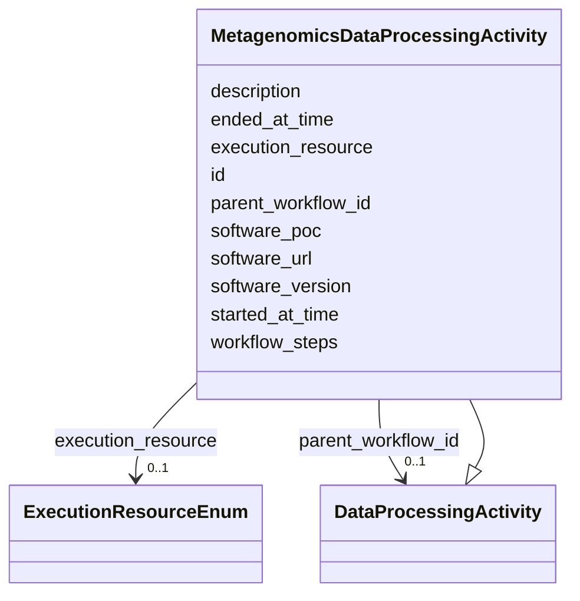

# Class: MetagenomicsDataProcessingActivity 


_Concrete metagenomics workflow run. Inherits all DataProcessingActivity_

_slots including parent_workflow_id (chain link) and workflow_steps_

_(key-value, schema TBD). Specific workflow step type is captured via the_

_inherited type attribute (string); expected values: _

_'metagenomics_annotation', 'metagenomics_binning', 'metagenomics_phylogeny'._


URI: [basalt_schema:MetagenomicsDataProcessingActivity](https://emsl-computing.github.io/BASALT-Schema/elements/MetagenomicsDataProcessingActivity)





## Inheritance
* [DataProcessingActivity](DataProcessingActivity.md)
    * **MetagenomicsDataProcessingActivity**


## Slots

| Name | Cardinality and Range | Description | Inheritance |
| ---  | --- | --- | --- |
| [parent_workflow_id](parent_workflow_id.md) | 0..1 <br/> [DataProcessingActivity](DataProcessingActivity.md) | Self-referential FK to the preceding DataProcessingActivity in a chain | [DataProcessingActivity](DataProcessingActivity.md) |
| [workflow_steps](workflow_steps.md) | 0..1 <br/> [String](String.md) | Per-run workflow parameters | [DataProcessingActivity](DataProcessingActivity.md) |
| [description](description.md) | 0..1 <br/> [String](String.md) | A human-readable description of the data analysis workflow | [DataProcessingActivity](DataProcessingActivity.md) |
| [id](id.md) | 1 <br/> [Uuid](Uuid.md) |  | [DataProcessingActivity](DataProcessingActivity.md) |
| [started_at_time](started_at_time.md) | 1 <br/> [Datetime](Datetime.md) |  | [DataProcessingActivity](DataProcessingActivity.md) |
| [ended_at_time](ended_at_time.md) | 0..1 <br/> [Datetime](Datetime.md) |  | [DataProcessingActivity](DataProcessingActivity.md) |
| [software_url](software_url.md) | 0..1 <br/> [String](String.md) |  | [DataProcessingActivity](DataProcessingActivity.md) |
| [software_version](software_version.md) | 0..1 <br/> [String](String.md) |  | [DataProcessingActivity](DataProcessingActivity.md) |
| [software_poc](software_poc.md) | 0..1 <br/> [String](String.md) |  | [DataProcessingActivity](DataProcessingActivity.md) |
| [execution_resource](execution_resource.md) | 0..1 <br/> [ExecutionResourceEnum](ExecutionResourceEnum.md) |  | [DataProcessingActivity](DataProcessingActivity.md) |


## Identifier and Mapping Information


### Schema Source


* from schema: https://emsl-computing.github.io/BASALT-Schema


## Mappings

| Mapping Type | Mapped Value |
| ---  | ---  |
| self | basalt_schema:MetagenomicsDataProcessingActivity |
| native | basalt_schema:MetagenomicsDataProcessingActivity |


## LinkML Source

<!-- TODO: investigate https://stackoverflow.com/questions/37606292/how-to-create-tabbed-code-blocks-in-mkdocs-or-sphinx -->

### Direct

<details>
```yaml
name: MetagenomicsDataProcessingActivity
description: "Concrete metagenomics workflow run. Inherits all DataProcessingActivity\n\
  slots including parent_workflow_id (chain link) and workflow_steps\n(key-value,\
  \ schema TBD). Specific workflow step type is captured via the\ninherited type attribute\
  \ (string); expected values: \n'metagenomics_annotation', 'metagenomics_binning',\
  \ 'metagenomics_phylogeny'."
from_schema: https://emsl-computing.github.io/BASALT-Schema
is_a: DataProcessingActivity

```
</details>

### Induced

<details>
```yaml
name: MetagenomicsDataProcessingActivity
description: "Concrete metagenomics workflow run. Inherits all DataProcessingActivity\n\
  slots including parent_workflow_id (chain link) and workflow_steps\n(key-value,\
  \ schema TBD). Specific workflow step type is captured via the\ninherited type attribute\
  \ (string); expected values: \n'metagenomics_annotation', 'metagenomics_binning',\
  \ 'metagenomics_phylogeny'."
from_schema: https://emsl-computing.github.io/BASALT-Schema
is_a: DataProcessingActivity
attributes:
  parent_workflow_id:
    name: parent_workflow_id
    description: "Self-referential FK to the preceding DataProcessingActivity in a\
      \ chain.\nNULL -> first (or standalone) step.\nNon-null -> this execution directly\
      \ follows parent_workflow_id.\nEnables single-hop chaining queries; full traversal\
      \ via linkage_cache.\n\nDDL: ALTER TABLE \"DataProcessingActivity\"\n      \
      \ ADD COLUMN parent_workflow_id UUID\n       REFERENCES \"DataProcessingActivity\"\
      (id);"
    from_schema: https://emsl-computing.github.io/BASALT-Schema
    rank: 1000
    alias: parent_workflow_id
    owner: MetagenomicsDataProcessingActivity
    domain_of:
    - DataProcessingActivity
    range: DataProcessingActivity
    required: false
  workflow_steps:
    name: workflow_steps
    description: 'Per-run workflow parameters. Previously annotated TODO JSONB in
      schema.

      Direction: structured key-value pairs keyed by workflow type.

      Schema for allowed keys TBD per workflow type before full implementation.'
    from_schema: https://emsl-computing.github.io/BASALT-Schema
    rank: 1000
    alias: workflow_steps
    owner: MetagenomicsDataProcessingActivity
    domain_of:
    - DataProcessingActivity
    range: string
    required: false
  description:
    name: description
    description: A human-readable description of the data analysis workflow. May  include
      details such as the purpose, output, and/or main steps of  the workflow.
    title: description
    from_schema: https://emsl-computing.github.io/BASALT-Schema
    rank: 1000
    alias: description
    owner: MetagenomicsDataProcessingActivity
    domain_of:
    - Activity
    - Entity
    - DataProduct
    - DataGenerationActivity
    - DataProcessingActivity
    - OntologyClass
    - ContainerType
    - LabDevice
    - Configuration
    - MassSpectrometryStandardRun
    - PurchasedMaterial
    - LabProcessingActivity
    - organism
    - Site
    - Sample
    - SamplingActivity
    - SoilSamplingActivity
    - Study
    - TimestampValue
    - TextValue
    - SoftwareControlledTermValue
    - ControlledTermValue
    - QuantityValue
    range: string
  id:
    name: id
    from_schema: https://emsl-computing.github.io/BASALT-Schema
    identifier: true
    alias: id
    owner: MetagenomicsDataProcessingActivity
    domain_of:
    - Activity
    - Entity
    - DataProduct
    - DataGenerationActivity
    - DataProcessingActivity
    - AlternativeIdentifier
    - FunctionalAnnotationIdentifier
    - Instrument
    - OntologyClass
    - ContainerType
    - Custodian
    - InstrumentAlternativeIdentifier
    - LabDevice
    - SampleProcessing
    - ProcessingSampleLink
    - Configuration
    - MobilePhaseSegment
    - MassSpectrometryStandardRun
    - PurchasedMaterial
    - LabProcessingActivity
    - organism
    - MAOMProduct
    - WEOMProduct
    - Site
    - Sample
    - AerosolArmSample
    - AerosolSample
    - AMP2UserSample
    - CommerciallyPurchasedSample
    - CultureEnvironmentalSample
    - EngineeredStrainSample
    - FieldDeployedTerraformSample
    - MixedCultureSample
    - MonetSoilSample
    - OtherUndescribedSample
    - PlantSample
    - PureCultureSample
    - SedimentSample
    - SoilSample
    - SynthesizedMaterialSample
    - TerraformSample
    - WaterSample
    - ProcessedSample
    - CoreSection
    - SamplingActivity
    - AerosolArmSamplingActivity
    - AerosolSamplingActivity
    - CommerciallyPurchasedSamplingActivity
    - CultureEnvironmentalSamplingActivity
    - EngineeredStrainSamplingActivity
    - FieldDeployedTerraformSamplingActivity
    - MixedCultureSamplingActivity
    - MonetSoilSamplingActivity
    - OtherUndescribedSamplingActivity
    - PlantSamplingActivity
    - PureCultureSamplingActivity
    - SedimentSamplingActivity
    - SoilSamplingActivity
    - SynthesizedMaterialSamplingActivity
    - TerraformSamplingActivity
    - WaterSamplingActivity
    - Study
    - ProjectParticipant
    - TimestampValue
    - TextValue
    - SoftwareControlledTermValue
    - ControlledTermValue
    - PersonValue
    - QuantityValue
    - ConditioningValue
    - zipDownload
    range: uuid
    required: true
  started_at_time:
    name: started_at_time
    from_schema: https://emsl-computing.github.io/BASALT-Schema
    alias: started_at_time
    owner: MetagenomicsDataProcessingActivity
    domain_of:
    - Activity
    - DataProcessingActivity
    range: datetime
    required: true
  ended_at_time:
    name: ended_at_time
    from_schema: https://emsl-computing.github.io/BASALT-Schema
    alias: ended_at_time
    owner: MetagenomicsDataProcessingActivity
    domain_of:
    - Activity
    - DataProcessingActivity
    range: datetime
  software_url:
    name: software_url
    from_schema: https://emsl-computing.github.io/BASALT-Schema
    rank: 1000
    alias: software_url
    owner: MetagenomicsDataProcessingActivity
    domain_of:
    - DataProcessingActivity
    range: string
  software_version:
    name: software_version
    from_schema: https://emsl-computing.github.io/BASALT-Schema
    alias: software_version
    owner: MetagenomicsDataProcessingActivity
    domain_of:
    - InstrumentData
    - DataProcessingActivity
    range: string
  software_poc:
    name: software_poc
    from_schema: https://emsl-computing.github.io/BASALT-Schema
    rank: 1000
    alias: software_poc
    owner: MetagenomicsDataProcessingActivity
    domain_of:
    - DataProcessingActivity
    range: string
  execution_resource:
    name: execution_resource
    from_schema: https://emsl-computing.github.io/BASALT-Schema
    rank: 1000
    alias: execution_resource
    owner: MetagenomicsDataProcessingActivity
    domain_of:
    - DataProcessingActivity
    range: ExecutionResourceEnum

```
</details>