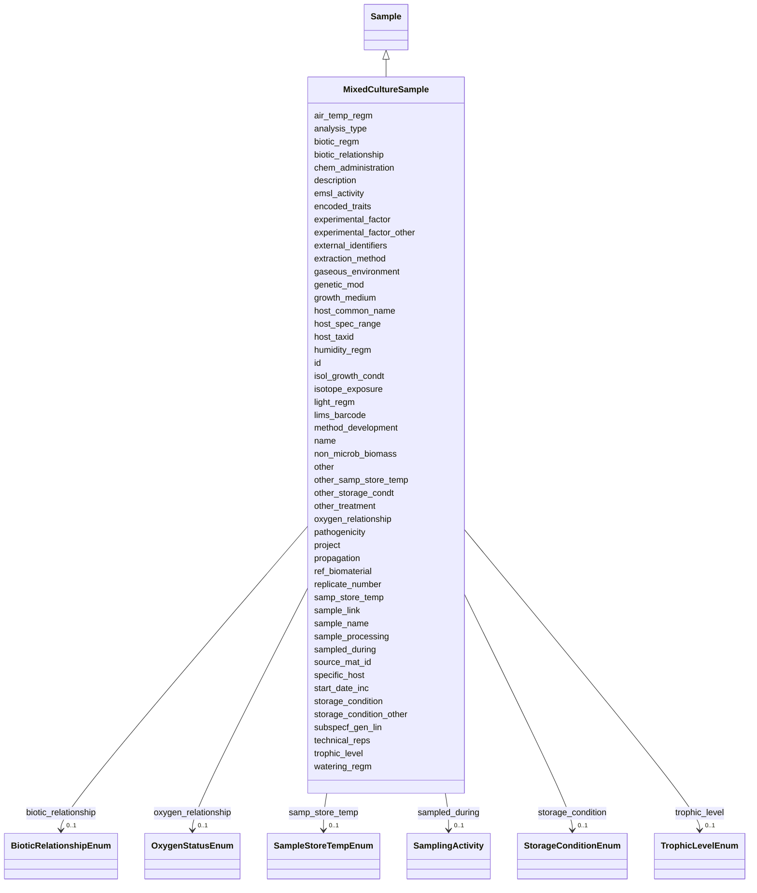

# Class: MixedCultureSample 


_A sample containing multiple cultured organisms._


URI: [analysis_api_schema:MixedCultureSample](https://w3id.org/MONet/analysis-api-schema/MixedCultureSample)





## Inheritance
* [Sample](Sample.md)
    * **MixedCultureSample**


## Slots

| Name | Cardinality and Range | Description | Inheritance |
| ---  | --- | --- | --- |
| [air_temp_regm](air_temp_regm.md) | 0..1 <br/> [String](String.md) | Information about treatment involving an exposure to varying temperatures; sh... | direct |
| [analysis_type](analysis_type.md) | 1 <br/> [String](String.md) | The type(s) of analysis planned for this sample | direct |
| [biotic_regm](biotic_regm.md) | 0..1 <br/> [String](String.md) | Information about treatment(s) involving use of biotic factors such as bacter... | direct |
| [chem_administration](chem_administration.md) | 0..1 <br/> [String](String.md) | List of chemical compounds administered to the host or site where sampling oc... | direct |
| [encoded_traits](encoded_traits.md) | 0..1 <br/> [String](String.md) | Should include key traits like antibiotic resistance or xenobiotic | direct |
| [experimental_factor](experimental_factor.md) | 0..1 <br/> [String](String.md) | Experimental factors are essentially the variable aspects of an experiment de... | direct |
| [experimental_factor_other](experimental_factor_other.md) | 0..1 <br/> [String](String.md) | Other details about your sample that you feel can't be accurately represented... | direct |
| [external_identifiers](external_identifiers.md) | * <br/> [Uriorcurie](Uriorcurie.md) | List of external identifiers associated with this entity or activity | direct |
| [extraction_method](extraction_method.md) | 0..1 <br/> [String](String.md) | If you (the user) performed an extraction preparation or processing before se... | direct |
| [gaseous_environment](gaseous_environment.md) | 0..1 <br/> [String](String.md) | Use of conditions with differing gaseous environments; should include the nam... | direct |
| [genetic_mod](genetic_mod.md) | 0..1 <br/> [String](String.md) | Genetic modifications of the genome of an organism, which may occur naturally... | direct |
| [growth_medium](growth_medium.md) | 1 <br/> [String](String.md) | Method of growth and medium/materials used | direct |
| [host_common_name](host_common_name.md) | 1 <br/> [String](String.md) | Common name for the host organism (e | direct |
| [host_spec_range](host_spec_range.md) | 0..1 <br/> [String](String.md) | The range and diversity of host species that an organism is capable of infect... | direct |
| [host_taxid](host_taxid.md) | 1 <br/> [String](String.md) | NCBI taxon ID | direct |
| [humidity_regm](humidity_regm.md) | 0..1 <br/> [String](String.md) | Information about treatment involving an exposure to varying degrees of humid... | direct |
| [isol_growth_condt](isol_growth_condt.md) | 1 <br/> [String](String.md) | Publication reference in the form of pubmed ID (PMID), digital object | direct |
| [isotope_exposure](isotope_exposure.md) | 0..1 <br/> [String](String.md) | List isotope exposure or addition applied to your sample | direct |
| [light_regm](light_regm.md) | 0..1 <br/> [String](String.md) | Information about treatment(s) involving exposure to light including both lig... | direct |
| [method_development](method_development.md) | 0..1 <br/> [String](String.md) | If your samples are TEST sample ONLY, please provide information on what you'... | direct |
| [non_microb_biomass](non_microb_biomass.md) | 0..1 <br/> [String](String.md) | Amount of biomass; should include the name for the part of biomass measured, ... | direct |
| [other](other.md) | 0..1 <br/> [String](String.md) | Other/additional details about your sample that you feel can't be accurately ... | direct |
| [other_samp_store_temp](other_samp_store_temp.md) | 0..1 <br/> [String](String.md) | Please specify sample storage temperature if you selected 'other' | direct |
| [other_storage_condt](other_storage_condt.md) | 0..1 <br/> [String](String.md) | Please specify your storage conditions if you selected 'other' and the availa... | direct |
| [other_treatment](other_treatment.md) | 0..1 <br/> [String](String.md) | Many sample treatment descriptor columns are available | direct |
| [oxygen_relationship](oxygen_relationship.md) | 0..1 <br/> [OxygenStatusEnum](OxygenStatusEnum.md) | The relationship of the sample to oxygen, such as aerobic or anaerobic | direct |
| [pathogenicity](pathogenicity.md) | 0..1 <br/> [String](String.md) | To what is the entity pathogenic, e | direct |
| [project](project.md) | 0..1 <br/> [Integer](Integer.md) | Identifier for the user project associated with the entity or activity | direct |
| [propagation](propagation.md) | 0..1 <br/> [String](String.md) | The type of reproduction from the parent stock | direct |
| [ref_biomaterial](ref_biomaterial.md) | 0..1 <br/> [String](String.md) | Primary publication if isolated before genome publication; otherwise primary ... | direct |
| [replicate_number](replicate_number.md) | 0..1 <br/> [Integer](Integer.md) | The replicate number of the sample, if applicable | direct |
| [biotic_relationship](biotic_relationship.md) | 0..1 <br/> [BioticRelationshipEnum](BioticRelationshipEnum.md) | Description of relationship(s) between the subject organism and other organis... | direct |
| [sample_link](sample_link.md) | 0..1 <br/> [String](String.md) | 'A unique identifier to assign parent-child subsample or sibling samples | direct |
| [sample_name](sample_name.md) | 0..1 <br/> [String](String.md) | The name or label that is present on the shipped sample | direct |
| [sample_processing](sample_processing.md) | 0..1 <br/> [String](String.md) | A brief description of any processing applied to the sample during or after r... | direct |
| [sampled_during](sampled_during.md) | 0..1 <br/> [SamplingActivity](SamplingActivity.md) | Reference to the sampling activity during which this sample was collected | direct |
| [samp_store_temp](samp_store_temp.md) | 0..1 <br/> [SampleStoreTempEnum](SampleStoreTempEnum.md) | The temperature at which your samples should be stored upon arrival | direct |
| [source_mat_id](source_mat_id.md) | 0..1 <br/> [String](String.md) | A unique identifier assigned to an original material sample collected or to a... | direct |
| [specific_host](specific_host.md) | 0..1 <br/> [String](String.md) | If there is a host involved please provide its taxid (or environmental if not... | direct |
| [start_date_inc](start_date_inc.md) | 1 <br/> [String](String.md) | Date the incubation was started | direct |
| [storage_condition](storage_condition.md) | 0..1 <br/> [StorageConditionEnum](StorageConditionEnum.md) | The storage condition of the sample | direct |
| [storage_condition_other](storage_condition_other.md) | 0..1 <br/> [String](String.md) | Free-text field for storage conditions when 'storage_condition' is 'other' | direct |
| [subspecf_gen_lin](subspecf_gen_lin.md) | 0..1 <br/> [String](String.md) | Information about the genetic distinctness of the sequenced organism below th... | direct |
| [technical_reps](technical_reps.md) | 0..1 <br/> [Integer](Integer.md) | Number of technical replicates for the sample | direct |
| [trophic_level](trophic_level.md) | 0..1 <br/> [TrophicLevelEnum](TrophicLevelEnum.md) | Trophic levels are the feeding position in a food chain | direct |
| [watering_regm](watering_regm.md) | 0..1 <br/> [String](String.md) | Information about treatment involving an exposure to watering frequencies, tr... | direct |
| [id](id.md) | 1 <br/> [Uuid](Uuid.md) |  | direct |
| [name](name.md) | 1 <br/> [String](String.md) | Human-readable name for the entity or activity | [Sample](Sample.md) |
| [description](description.md) | 0..1 <br/> [String](String.md) | Human-readable description for the entity or activity | [Sample](Sample.md) |
| [emsl_activity](emsl_activity.md) | 0..1 <br/> [String](String.md) | Nullable string linking a Sample or SamplingActivity to a named EMSL activity... | [Sample](Sample.md) |
| [lims_barcode](lims_barcode.md) | 0..1 <br/> [String](String.md) | LIMS barcode identifier | [Sample](Sample.md) |


## Identifier and Mapping Information


### Schema Source


* from schema: https://w3id.org/MONet/analysis-api-schema


## Mappings

| Mapping Type | Mapped Value |
| ---  | ---  |
| self | analysis_api_schema:MixedCultureSample |
| native | analysis_api_schema:MixedCultureSample |


## LinkML Source

<!-- TODO: investigate https://stackoverflow.com/questions/37606292/how-to-create-tabbed-code-blocks-in-mkdocs-or-sphinx -->

### Direct

<details>
```yaml
name: MixedCultureSample
description: A sample containing multiple cultured organisms.
from_schema: https://w3id.org/MONet/analysis-api-schema
is_a: Sample
slots:
- air_temp_regm
- analysis_type
- biotic_regm
- chem_administration
- encoded_traits
- experimental_factor
- experimental_factor_other
- external_identifiers
- extraction_method
- gaseous_environment
- genetic_mod
- growth_medium
- host_common_name
- host_spec_range
- host_taxid
- humidity_regm
- isol_growth_condt
- isotope_exposure
- light_regm
- method_development
- non_microb_biomass
- other
- other_samp_store_temp
- other_storage_condt
- other_treatment
- oxygen_relationship
- pathogenicity
- project
- propagation
- ref_biomaterial
- replicate_number
- biotic_relationship
- sample_link
- sample_name
- sample_processing
- sampled_during
- samp_store_temp
- source_mat_id
- specific_host
- start_date_inc
- storage_condition
- storage_condition_other
- subspecf_gen_lin
- technical_reps
- trophic_level
- watering_regm
slot_usage:
  analysis_type:
    name: analysis_type
    required: true
  growth_medium:
    name: growth_medium
    required: true
  host_common_name:
    name: host_common_name
    required: true
  host_taxid:
    name: host_taxid
    required: true
  isol_growth_condt:
    name: isol_growth_condt
    required: true
  start_date_inc:
    name: start_date_inc
    required: true
  subspecf_gen_lin:
    name: subspecf_gen_lin
    description: Information about the genetic distinctness of the sequenced organism
      below the subspecies level, e.g. serovar, serotype, biotype, ecotype, or any
      relevant genetic typing schemes like Group I plasmid. Supply both the lineage
      name and the lineage rank separated by a colon, e.g. biovar:abc123. Subspecies
      should not be recorded in this slot but in the taxid slot.
attributes:
  id:
    name: id
    from_schema: https://w3id.org/MONet/analysis-api-schema/sample-classes
    identifier: true
    domain_of:
    - Activity
    - Entity
    - DataProduct
    - DataGenerationActivity
    - DataProcessingActivity
    - AlternativeIdentifier
    - FunctionalAnnotationIdentifier
    - Instrument
    - OntologyClass
    - ContainerType
    - Custodian
    - InstrumentAlternativeIdentifier
    - LabDevice
    - SampleProcessing
    - ProcessingSampleLink
    - Configuration
    - MobilePhaseSegment
    - MassSpectrometryStandardRun
    - PurchasedMaterial
    - LabProcessingActivity
    - organism
    - MAOMProduct
    - WEOMProduct
    - Site
    - Sample
    - AerosolArmSample
    - AerosolSample
    - AMP2UserSample
    - CommerciallyPurchasedSample
    - CultureEnvironmentalSample
    - EngineeredStrainSample
    - FieldDeployedTerraformSample
    - MixedCultureSample
    - MonetSoilSample
    - OtherUndescribedSample
    - PlantSample
    - PureCultureSample
    - SedimentSample
    - SoilSample
    - SynthesizedMaterialSample
    - TerraformSample
    - WaterSample
    - ProcessedSample
    - CoreSection
    - SamplingActivity
    - AerosolArmSamplingActivity
    - AerosolSamplingActivity
    - CommerciallyPurchasedSamplingActivity
    - CultureEnvironmentalSamplingActivity
    - EngineeredStrainSamplingActivity
    - FieldDeployedTerraformSamplingActivity
    - MixedCultureSamplingActivity
    - MonetSoilSamplingActivity
    - OtherUndescribedSamplingActivity
    - PlantSamplingActivity
    - PureCultureSamplingActivity
    - SedimentSamplingActivity
    - SoilSamplingActivity
    - SynthesizedMaterialSamplingActivity
    - TerraformSamplingActivity
    - WaterSamplingActivity
    - Study
    - ProjectParticipant
    - TimestampValue
    - TextValue
    - SoftwareControlledTermValue
    - ControlledTermValue
    - PersonValue
    - QuantityValue
    - ConditioningValue
    - zipDownload
    range: uuid
    required: true

```
</details>

### Induced

<details>
```yaml
name: MixedCultureSample
description: A sample containing multiple cultured organisms.
from_schema: https://w3id.org/MONet/analysis-api-schema
is_a: Sample
slot_usage:
  analysis_type:
    name: analysis_type
    required: true
  growth_medium:
    name: growth_medium
    required: true
  host_common_name:
    name: host_common_name
    required: true
  host_taxid:
    name: host_taxid
    required: true
  isol_growth_condt:
    name: isol_growth_condt
    required: true
  start_date_inc:
    name: start_date_inc
    required: true
  subspecf_gen_lin:
    name: subspecf_gen_lin
    description: Information about the genetic distinctness of the sequenced organism
      below the subspecies level, e.g. serovar, serotype, biotype, ecotype, or any
      relevant genetic typing schemes like Group I plasmid. Supply both the lineage
      name and the lineage rank separated by a colon, e.g. biovar:abc123. Subspecies
      should not be recorded in this slot but in the taxid slot.
attributes:
  id:
    name: id
    from_schema: https://w3id.org/MONet/analysis-api-schema/sample-classes
    identifier: true
    alias: id
    owner: MixedCultureSample
    domain_of:
    - Activity
    - Entity
    - DataProduct
    - DataGenerationActivity
    - DataProcessingActivity
    - AlternativeIdentifier
    - FunctionalAnnotationIdentifier
    - Instrument
    - OntologyClass
    - ContainerType
    - Custodian
    - InstrumentAlternativeIdentifier
    - LabDevice
    - SampleProcessing
    - ProcessingSampleLink
    - Configuration
    - MobilePhaseSegment
    - MassSpectrometryStandardRun
    - PurchasedMaterial
    - LabProcessingActivity
    - organism
    - MAOMProduct
    - WEOMProduct
    - Site
    - Sample
    - AerosolArmSample
    - AerosolSample
    - AMP2UserSample
    - CommerciallyPurchasedSample
    - CultureEnvironmentalSample
    - EngineeredStrainSample
    - FieldDeployedTerraformSample
    - MixedCultureSample
    - MonetSoilSample
    - OtherUndescribedSample
    - PlantSample
    - PureCultureSample
    - SedimentSample
    - SoilSample
    - SynthesizedMaterialSample
    - TerraformSample
    - WaterSample
    - ProcessedSample
    - CoreSection
    - SamplingActivity
    - AerosolArmSamplingActivity
    - AerosolSamplingActivity
    - CommerciallyPurchasedSamplingActivity
    - CultureEnvironmentalSamplingActivity
    - EngineeredStrainSamplingActivity
    - FieldDeployedTerraformSamplingActivity
    - MixedCultureSamplingActivity
    - MonetSoilSamplingActivity
    - OtherUndescribedSamplingActivity
    - PlantSamplingActivity
    - PureCultureSamplingActivity
    - SedimentSamplingActivity
    - SoilSamplingActivity
    - SynthesizedMaterialSamplingActivity
    - TerraformSamplingActivity
    - WaterSamplingActivity
    - Study
    - ProjectParticipant
    - TimestampValue
    - TextValue
    - SoftwareControlledTermValue
    - ControlledTermValue
    - PersonValue
    - QuantityValue
    - ConditioningValue
    - zipDownload
    range: uuid
    required: true
  air_temp_regm:
    name: air_temp_regm
    description: Information about treatment involving an exposure to varying temperatures;
      should include the temperature, treatment regimen including how many times the
      treatment was repeated, how long each treatment lasted, and the start and end
      time of the entire treatment; can include different temperature regimens
    title: air temperature regimen
    from_schema: https://w3id.org/MONet/analysis-api-schema
    exact_mappings:
    - MIXS:0000551
    rank: 1000
    alias: air_temp_regm
    owner: MixedCultureSample
    domain_of:
    - AerosolArmSample
    - AerosolSample
    - CultureEnvironmentalSample
    - FieldDeployedTerraformSample
    - MixedCultureSample
    - OtherUndescribedSample
    - PlantSample
    - PureCultureSample
    - SedimentSample
    - SoilSample
    - TerraformSample
    - WaterSample
    range: string
  analysis_type:
    name: analysis_type
    description: The type(s) of analysis planned for this sample.
    from_schema: https://w3id.org/MONet/analysis-api-schema
    rank: 1000
    alias: analysis_type
    owner: MixedCultureSample
    domain_of:
    - SampleProcessing
    - AerosolArmSample
    - AerosolSample
    - AMP2UserSample
    - CommerciallyPurchasedSample
    - CultureEnvironmentalSample
    - FieldDeployedTerraformSample
    - MixedCultureSample
    - OtherUndescribedSample
    - PlantSample
    - PureCultureSample
    - SedimentSample
    - SoilSample
    - SynthesizedMaterialSample
    - TerraformSample
    - WaterSample
    range: string
    required: true
  biotic_regm:
    name: biotic_regm
    description: Information about treatment(s) involving use of biotic factors such
      as bacteria, viruses, or fungi.
    title: biotic regimen
    from_schema: https://w3id.org/MONet/analysis-api-schema
    rank: 1000
    alias: biotic_regm
    owner: MixedCultureSample
    domain_of:
    - CultureEnvironmentalSample
    - FieldDeployedTerraformSample
    - MixedCultureSample
    - OtherUndescribedSample
    - PlantSample
    - PureCultureSample
    - SedimentSample
    - SoilSample
    - TerraformSample
    - WaterSample
    range: string
  chem_administration:
    name: chem_administration
    description: List of chemical compounds administered to the host or site where
      sampling occurred, and when (e.g. Antibiotics, n fertilizer, air filter); can
      include multiple compounds. For chemical entities of biological interest ontology
      (chebi) (v 163), http://purl.bioontology.org/ontology/chebi
    title: chemical administration
    from_schema: https://w3id.org/MONet/analysis-api-schema
    exact_mappings:
    - MIXS:0000751
    rank: 1000
    alias: chem_administration
    owner: MixedCultureSample
    domain_of:
    - AerosolArmSample
    - AerosolSample
    - CultureEnvironmentalSample
    - FieldDeployedTerraformSample
    - MixedCultureSample
    - MonetSoilSample
    - OtherUndescribedSample
    - PlantSample
    - PureCultureSample
    - SedimentSample
    - SoilSample
    - TerraformSample
    - WaterSample
    range: string
  encoded_traits:
    name: encoded_traits
    description: 'Should include key traits like antibiotic resistance or xenobiotic

      degradation phenotypes for plasmids, converting genes for phage'
    title: encoded traits
    from_schema: https://w3id.org/MONet/analysis-api-schema
    rank: 1000
    alias: encoded_traits
    owner: MixedCultureSample
    domain_of:
    - organism
    - CultureEnvironmentalSample
    - FieldDeployedTerraformSample
    - MixedCultureSample
    - OtherUndescribedSample
    - PureCultureSample
    - TerraformSample
    range: string
  experimental_factor:
    name: experimental_factor
    description: Experimental factors are essentially the variable aspects of an experiment
      design which can be used to describe an experiment or set of experiments in
      an increasingly detailed manner. This field accepts ontology terms from Experimental
      Factor Ontology (EFO) and/or Ontology for Biomedical Investigations (OBI). For
      a browser of EFO (v 2.95) terms please see http://purl.bioontology.org/ontology/EFO;
      for a browser of OBI (v 2018-02-12) terms please see http://purl.bioontology.org/ontology/OBI
    title: experimental factor
    from_schema: https://w3id.org/MONet/analysis-api-schema
    rank: 1000
    alias: experimental_factor
    owner: MixedCultureSample
    domain_of:
    - AerosolArmSample
    - AerosolSample
    - CommerciallyPurchasedSample
    - CultureEnvironmentalSample
    - MixedCultureSample
    - OtherUndescribedSample
    - PlantSample
    - PureCultureSample
    - SedimentSample
    - SoilSample
    - SynthesizedMaterialSample
    - WaterSample
    range: string
  experimental_factor_other:
    name: experimental_factor_other
    description: Other details about your sample that you feel can't be accurately
      represented in the available columns.
    title: other experimental factor
    from_schema: https://w3id.org/MONet/analysis-api-schema
    rank: 1000
    alias: experimental_factor_other
    owner: MixedCultureSample
    domain_of:
    - AerosolArmSample
    - AerosolSample
    - CommerciallyPurchasedSample
    - CultureEnvironmentalSample
    - MixedCultureSample
    - OtherUndescribedSample
    - PlantSample
    - PureCultureSample
    - SedimentSample
    - SoilSample
    - SynthesizedMaterialSample
    - WaterSample
    range: string
  external_identifiers:
    name: external_identifiers
    description: List of external identifiers associated with this entity or activity.
    from_schema: https://w3id.org/MONet/analysis-api-schema
    rank: 1000
    alias: external_identifiers
    owner: MixedCultureSample
    domain_of:
    - NucleotideSequencing
    - AerosolArmSample
    - AerosolSample
    - CommerciallyPurchasedSample
    - CultureEnvironmentalSample
    - EngineeredStrainSample
    - FieldDeployedTerraformSample
    - MixedCultureSample
    - MonetSoilSample
    - OtherUndescribedSample
    - PlantSample
    - PureCultureSample
    - SedimentSample
    - SoilSample
    - SynthesizedMaterialSample
    - TerraformSample
    - WaterSample
    - Study
    range: uriorcurie
    multivalued: true
  extraction_method:
    name: extraction_method
    description: If you (the user) performed an extraction preparation or processing
      before sending the sample to EMSL, what was it? This is only applicable when
      sending an 'analytical sample'. See README for more details on types of samples.
    title: extraction method
    from_schema: https://w3id.org/MONet/analysis-api-schema
    rank: 1000
    alias: extraction_method
    owner: MixedCultureSample
    domain_of:
    - PhosphorusAnalysisProduct
    - AerosolArmSample
    - AerosolSample
    - CultureEnvironmentalSample
    - MixedCultureSample
    - OtherUndescribedSample
    - PlantSample
    - PureCultureSample
    - SedimentSample
    - SoilSample
    - WaterSample
    range: string
  gaseous_environment:
    name: gaseous_environment
    description: Use of conditions with differing gaseous environments; should include
      the name of gaseous compound, amount administered, treatment duration, interval,
      and total experimental duration; can include multiple gaseous environment regimens
    title: gaseous environment
    from_schema: https://w3id.org/MONet/analysis-api-schema
    rank: 1000
    alias: gaseous_environment
    owner: MixedCultureSample
    domain_of:
    - CultureEnvironmentalSample
    - FieldDeployedTerraformSample
    - MixedCultureSample
    - OtherUndescribedSample
    - PlantSample
    - PureCultureSample
    - SedimentSample
    - SoilSample
    - TerraformSample
    - WaterSample
    range: string
  genetic_mod:
    name: genetic_mod
    description: Genetic modifications of the genome of an organism, which may occur
      naturally by spontaneous mutation or be introduced by some experimental means,
      e.g. specification of a transgene or the gene knocked-out or details of transient
      transfection
    title: genetic modifications
    from_schema: https://w3id.org/MONet/analysis-api-schema
    rank: 1000
    alias: genetic_mod
    owner: MixedCultureSample
    domain_of:
    - CultureEnvironmentalSample
    - FieldDeployedTerraformSample
    - MixedCultureSample
    - OtherUndescribedSample
    - PlantSample
    - PureCultureSample
    - SynthesizedMaterialSample
    - TerraformSample
    range: string
  growth_medium:
    name: growth_medium
    description: Method of growth and medium/materials used. Indicate broth, gel,
      3-D structure, bioreactor, etc. followed by the formula, recipe, or components
      used to create the growth medium.
    title: growth medium
    from_schema: https://w3id.org/MONet/analysis-api-schema
    rank: 1000
    alias: growth_medium
    owner: MixedCultureSample
    domain_of:
    - CultureGrowth
    - CultureEnvironmentalSample
    - FieldDeployedTerraformSample
    - MixedCultureSample
    - OtherUndescribedSample
    - PureCultureSample
    - TerraformSample
    range: string
    required: true
  host_common_name:
    name: host_common_name
    description: 'Common name for the host organism (e.g., "Pseudomonas putida").

      For microbes, this may be identical to organism_name.'
    title: host common name
    from_schema: https://w3id.org/MONet/analysis-api-schema
    aliases:
    - common_name
    rank: 1000
    alias: host_common_name
    owner: MixedCultureSample
    domain_of:
    - organism
    - CultureEnvironmentalSample
    - FieldDeployedTerraformSample
    - MixedCultureSample
    - OtherUndescribedSample
    - PureCultureSample
    - TerraformSample
    range: string
    required: true
  host_spec_range:
    name: host_spec_range
    description: The range and diversity of host species that an organism is capable
      of infecting, defined by NCBI taxonomy identifier. Format with prefix NCBITaxon:####
    title: host specificity or range
    from_schema: https://w3id.org/MONet/analysis-api-schema
    rank: 1000
    alias: host_spec_range
    owner: MixedCultureSample
    domain_of:
    - organism
    - CultureEnvironmentalSample
    - FieldDeployedTerraformSample
    - MixedCultureSample
    - OtherUndescribedSample
    - PureCultureSample
    - TerraformSample
    range: string
    pattern: NCBITaxon:\d+
  host_taxid:
    name: host_taxid
    description: NCBI taxon ID. Format with prefix NCBITaxon:####
    title: host taxonomy identifier
    from_schema: https://w3id.org/MONet/analysis-api-schema
    aliases:
    - host_taxonomy_id
    - host_ncbi_taxon_id
    - host_taxa_id
    rank: 1000
    alias: host_taxid
    owner: MixedCultureSample
    domain_of:
    - organism
    - CultureEnvironmentalSample
    - FieldDeployedTerraformSample
    - MixedCultureSample
    - OtherUndescribedSample
    - PureCultureSample
    - TerraformSample
    range: string
    required: true
    pattern: NCBITaxon:\d+
  humidity_regm:
    name: humidity_regm
    description: Information about treatment involving an exposure to varying degrees
      of humidity; should include amount of humidity administered, treatment regimen
      including how many times the treatment was repeated, how long each treatment
      lasted, and the start and end time of the entire treatment; can include multiple
      regimens
    title: humidity regimen
    from_schema: https://w3id.org/MONet/analysis-api-schema
    rank: 1000
    alias: humidity_regm
    owner: MixedCultureSample
    domain_of:
    - AerosolArmSample
    - AerosolSample
    - CultureEnvironmentalSample
    - FieldDeployedTerraformSample
    - MixedCultureSample
    - OtherUndescribedSample
    - PlantSample
    - PureCultureSample
    - SedimentSample
    - SoilSample
    - TerraformSample
    range: string
  isol_growth_condt:
    name: isol_growth_condt
    description: 'Publication reference in the form of pubmed ID (PMID), digital object

      identifier (DOI), or URL for isolation and growth condition specifications of
      the

      organism/material'
    title: isolation and growth conditions
    from_schema: https://w3id.org/MONet/analysis-api-schema
    rank: 1000
    alias: isol_growth_condt
    owner: MixedCultureSample
    domain_of:
    - AMP2UserSample
    - CultureEnvironmentalSample
    - FieldDeployedTerraformSample
    - MixedCultureSample
    - OtherUndescribedSample
    - PureCultureSample
    - TerraformSample
    range: string
    required: true
  isotope_exposure:
    name: isotope_exposure
    description: List isotope exposure or addition applied to your sample.
    title: isotope exposure
    from_schema: https://w3id.org/MONet/analysis-api-schema
    rank: 1000
    alias: isotope_exposure
    owner: MixedCultureSample
    domain_of:
    - AerosolArmSample
    - AerosolSample
    - CultureEnvironmentalSample
    - FieldDeployedTerraformSample
    - MixedCultureSample
    - OtherUndescribedSample
    - PlantSample
    - PureCultureSample
    - SedimentSample
    - SoilSample
    - TerraformSample
    - WaterSample
    range: string
  light_regm:
    name: light_regm
    description: Information about treatment(s) involving exposure to light including
      both light intensity and quality.
    title: light regimen
    from_schema: https://w3id.org/MONet/analysis-api-schema
    rank: 1000
    alias: light_regm
    owner: MixedCultureSample
    domain_of:
    - CultureEnvironmentalSample
    - FieldDeployedTerraformSample
    - MixedCultureSample
    - OtherUndescribedSample
    - PlantSample
    - PureCultureSample
    - SedimentSample
    - SoilSample
    - TerraformSample
    range: string
  method_development:
    name: method_development
    description: If your samples are TEST sample ONLY, please provide information
      on what you're hoping this test will resolve.
    title: method development
    from_schema: https://w3id.org/MONet/analysis-api-schema
    rank: 1000
    alias: method_development
    owner: MixedCultureSample
    domain_of:
    - AerosolArmSample
    - AerosolSample
    - CommerciallyPurchasedSample
    - CultureEnvironmentalSample
    - FieldDeployedTerraformSample
    - MixedCultureSample
    - OtherUndescribedSample
    - PlantSample
    - PureCultureSample
    - SedimentSample
    - SoilSample
    - TerraformSample
    - WaterSample
    range: string
  non_microb_biomass:
    name: non_microb_biomass
    description: Amount of biomass; should include the name for the part of biomass
      measured, e.g.insect, plant, total. Can include multiple measurements separated
      by ;
    title: non microbial biomass
    from_schema: https://w3id.org/MONet/analysis-api-schema
    rank: 1000
    alias: non_microb_biomass
    owner: MixedCultureSample
    domain_of:
    - CultureEnvironmentalSample
    - MixedCultureSample
    - OtherUndescribedSample
    - PlantSample
    - PureCultureSample
    - SedimentSample
    - SoilSample
    - WaterSample
    range: string
  other:
    name: other
    description: Other/additional details about your sample that you feel can't be
      accurately represented in ANY of the available columns.
    title: other
    from_schema: https://w3id.org/MONet/analysis-api-schema
    rank: 1000
    alias: other
    owner: MixedCultureSample
    domain_of:
    - AerosolArmSample
    - AerosolSample
    - CommerciallyPurchasedSample
    - CultureEnvironmentalSample
    - FieldDeployedTerraformSample
    - MixedCultureSample
    - MonetSoilSample
    - OtherUndescribedSample
    - PlantSample
    - PureCultureSample
    - SedimentSample
    - SoilSample
    - SynthesizedMaterialSample
    - TerraformSample
    - WaterSample
    range: string
  other_samp_store_temp:
    name: other_samp_store_temp
    description: Please specify sample storage temperature if you selected 'other'
    title: other sample storage temperature
    from_schema: https://w3id.org/MONet/analysis-api-schema
    rank: 1000
    alias: other_samp_store_temp
    owner: MixedCultureSample
    domain_of:
    - AerosolArmSample
    - AerosolSample
    - CommerciallyPurchasedSample
    - CultureEnvironmentalSample
    - FieldDeployedTerraformSample
    - MixedCultureSample
    - MonetSoilSample
    - OtherUndescribedSample
    - PlantSample
    - PureCultureSample
    - SedimentSample
    - SoilSample
    - SynthesizedMaterialSample
    - TerraformSample
    - WaterSample
    range: string
  other_storage_condt:
    name: other_storage_condt
    description: Please specify your storage conditions if you selected 'other' and
      the available values are not appropriate
    title: other storage condition
    from_schema: https://w3id.org/MONet/analysis-api-schema
    rank: 1000
    alias: other_storage_condt
    owner: MixedCultureSample
    domain_of:
    - AerosolSample
    - CommerciallyPurchasedSample
    - CultureEnvironmentalSample
    - FieldDeployedTerraformSample
    - MixedCultureSample
    - MonetSoilSample
    - PlantSample
    - PureCultureSample
    - SedimentSample
    - SoilSample
    - SynthesizedMaterialSample
    - TerraformSample
    - WaterSample
    range: string
  other_treatment:
    name: other_treatment
    description: Many sample treatment descriptor columns are available. If a treatment
      is applied to your samples and the provided treatment terms do not satisfy please
      add it here. Multiple treatments can be entered here separated by ;
    title: other treatment
    from_schema: https://w3id.org/MONet/analysis-api-schema
    rank: 1000
    alias: other_treatment
    owner: MixedCultureSample
    domain_of:
    - AerosolArmSample
    - AerosolSample
    - CommerciallyPurchasedSample
    - CultureEnvironmentalSample
    - FieldDeployedTerraformSample
    - MixedCultureSample
    - MonetSoilSample
    - OtherUndescribedSample
    - PlantSample
    - PureCultureSample
    - SedimentSample
    - SoilSample
    - TerraformSample
    - WaterSample
    range: string
  oxygen_relationship:
    name: oxygen_relationship
    description: The relationship of the sample to oxygen, such as aerobic or anaerobic.
    title: oxygen relationship
    from_schema: https://w3id.org/MONet/analysis-api-schema
    exact_mappings:
    - MIXS:0000015
    rank: 1000
    alias: oxygen_status
    owner: MixedCultureSample
    domain_of:
    - HasIncubationConditions
    - CommerciallyPurchasedSample
    - CultureEnvironmentalSample
    - FieldDeployedTerraformSample
    - MixedCultureSample
    - OtherUndescribedSample
    - PureCultureSample
    - SedimentSample
    - SoilSample
    - SynthesizedMaterialSample
    - TerraformSample
    - WaterSample
    range: OxygenStatusEnum
  pathogenicity:
    name: pathogenicity
    description: To what is the entity pathogenic, e.g., humans, animals, plants,
      or specific tissues.
    title: pathogenicity
    from_schema: https://w3id.org/MONet/analysis-api-schema
    rank: 1000
    alias: pathogenicity
    owner: MixedCultureSample
    domain_of:
    - organism
    - CultureEnvironmentalSample
    - MixedCultureSample
    - OtherUndescribedSample
    - PureCultureSample
    range: string
  project:
    name: project
    description: 'Identifier for the user project associated with the entity or activity. '
    title: Project
    todos:
    - should this be an ID? CURIE can use the one NMDC has https://bioregistry.io/reference/emsl.project:60141
      where emsl.project is the CURIE prefix
    from_schema: https://w3id.org/MONet/analysis-api-schema
    aliases:
    - study
    - study_id
    - project_id
    - proposal
    - proposal_id
    rank: 1000
    alias: project
    owner: MixedCultureSample
    domain_of:
    - DataProduct
    - AerosolArmSample
    - AerosolSample
    - CommerciallyPurchasedSample
    - CultureEnvironmentalSample
    - FieldDeployedTerraformSample
    - MixedCultureSample
    - MonetSoilSample
    - OtherUndescribedSample
    - PlantSample
    - PureCultureSample
    - SedimentSample
    - SoilSample
    - SynthesizedMaterialSample
    - TerraformSample
    - WaterSample
    - SamplingActivity
    range: integer
  propagation:
    name: propagation
    description: 'The type of reproduction from the parent stock. Values for this
      field are specific to different taxa. For phage or virus: lytic/lysogenic/temperate/obligately
      lytic. For plasmids: incompatibility group. For eukaryotes: sexual/asexual'''
    title: propagation
    from_schema: https://w3id.org/MONet/analysis-api-schema
    rank: 1000
    alias: propagation
    owner: MixedCultureSample
    domain_of:
    - organism
    - CultureEnvironmentalSample
    - FieldDeployedTerraformSample
    - MixedCultureSample
    - OtherUndescribedSample
    - PureCultureSample
    - TerraformSample
    range: string
  ref_biomaterial:
    name: ref_biomaterial
    description: Primary publication if isolated before genome publication; otherwise
      primary genome report.
    title: reference for biomaterial
    from_schema: https://w3id.org/MONet/analysis-api-schema
    rank: 1000
    alias: ref_biomaterial
    owner: MixedCultureSample
    domain_of:
    - CultureEnvironmentalSample
    - FieldDeployedTerraformSample
    - MixedCultureSample
    - OtherUndescribedSample
    - PureCultureSample
    - TerraformSample
    range: string
  replicate_number:
    name: replicate_number
    description: The replicate number of the sample, if applicable. Included for compatibility
      with submission schema.
    todos:
    - reconcile replicate modelling
    from_schema: https://w3id.org/MONet/analysis-api-schema
    rank: 1000
    alias: replicate_number
    owner: MixedCultureSample
    domain_of:
    - AerosolArmSample
    - AerosolSample
    - CommerciallyPurchasedSample
    - CultureEnvironmentalSample
    - FieldDeployedTerraformSample
    - MixedCultureSample
    - OtherUndescribedSample
    - PlantSample
    - PureCultureSample
    - SedimentSample
    - SoilSample
    - SynthesizedMaterialSample
    - TerraformSample
    - WaterSample
    range: integer
  biotic_relationship:
    name: biotic_relationship
    description: Description of relationship(s) between the subject organism and other
      organism(s) it is associated with. E.g. parasite on species X; mutualist with
      species Y. The target organism is the subject of the relationship and the other
      organism(s) is the object
    title: observed biotic relationship
    from_schema: https://w3id.org/MONet/analysis-api-schema
    aliases:
    - samp_biotic_relationship
    exact_mappings:
    - MIXS:0000016
    rank: 1000
    alias: biotic_relationship
    owner: MixedCultureSample
    domain_of:
    - CultureEnvironmentalSample
    - FieldDeployedTerraformSample
    - MixedCultureSample
    - OtherUndescribedSample
    - PureCultureSample
    - SedimentSample
    - SoilSample
    - TerraformSample
    range: BioticRelationshipEnum
  sample_link:
    name: sample_link
    description: '''A unique identifier to assign parent-child subsample or sibling
      samples. This is relevant when a sample or other material was used to generate
      the new sample. This field allows multiple entries separated by ; (Examples:
      Soil collected from the field will link with the soil used in an incubation.
      The soil a plant was grown in links to the plant sample. An original culture
      sample was transferred to a new vial and generated a new sample)'''
    todos:
    - EMSL and NMDC both need better modelling for this
    from_schema: https://w3id.org/MONet/analysis-api-schema
    rank: 1000
    alias: sample_link
    owner: MixedCultureSample
    domain_of:
    - AerosolArmSample
    - AerosolSample
    - CommerciallyPurchasedSample
    - CultureEnvironmentalSample
    - FieldDeployedTerraformSample
    - MixedCultureSample
    - OtherUndescribedSample
    - PlantSample
    - PureCultureSample
    - SedimentSample
    - SoilSample
    - SynthesizedMaterialSample
    - TerraformSample
    - WaterSample
    range: string
  sample_name:
    name: sample_name
    description: 'The name or label that is present on the shipped sample. This should

      be a human readable name.'
    title: sample name
    notes:
    - This is typically an alias for the inherited 'name' slot on Sample classes.
      Defined separately for compatibility with source data files using 'sample_name'
      column headers.
    from_schema: https://w3id.org/MONet/analysis-api-schema
    aliases:
    - samp_name
    rank: 1000
    alias: sample_name
    owner: MixedCultureSample
    domain_of:
    - DataProduct
    - AerosolArmSample
    - AerosolSample
    - CommerciallyPurchasedSample
    - CultureEnvironmentalSample
    - FieldDeployedTerraformSample
    - MixedCultureSample
    - MonetSoilSample
    - OtherUndescribedSample
    - PlantSample
    - PureCultureSample
    - SedimentSample
    - SoilSample
    - SynthesizedMaterialSample
    - TerraformSample
    - WaterSample
    range: string
  sample_processing:
    name: sample_processing
    description: A brief description of any processing applied to the sample during
      or after retrieving the sample from environment or a link to the relevant protocol(s)
      performed.
    title: sample processing
    from_schema: https://w3id.org/MONet/analysis-api-schema
    rank: 1000
    alias: sample_processing
    owner: MixedCultureSample
    domain_of:
    - AerosolArmSample
    - AerosolSample
    - CommerciallyPurchasedSample
    - CultureEnvironmentalSample
    - FieldDeployedTerraformSample
    - MixedCultureSample
    - OtherUndescribedSample
    - PlantSample
    - PureCultureSample
    - SedimentSample
    - SoilSample
    - SynthesizedMaterialSample
    - TerraformSample
    range: string
  sampled_during:
    name: sampled_during
    description: Reference to the sampling activity during which this sample was collected.
      This is a FK to the SamplingActivity class, which contains metadata about the
      sampling event, such as date, device, method.
    from_schema: https://w3id.org/MONet/analysis-api-schema
    rank: 1000
    alias: sampled_during
    owner: MixedCultureSample
    domain_of:
    - AerosolArmSample
    - AerosolSample
    - CommerciallyPurchasedSample
    - CultureEnvironmentalSample
    - FieldDeployedTerraformSample
    - MixedCultureSample
    - MonetSoilSample
    - OtherUndescribedSample
    - PlantSample
    - PureCultureSample
    - SedimentSample
    - SoilSample
    - SynthesizedMaterialSample
    - TerraformSample
    - WaterSample
    - ProcessedSample
    range: SamplingActivity
  samp_store_temp:
    name: samp_store_temp
    description: The temperature at which your samples should be stored upon arrival.
      This field is NOT multivalued. If selecting other add the `other_samp_store_temp`
      attribute to provide additional detail.
    title: sample storage temperature
    from_schema: https://w3id.org/MONet/analysis-api-schema
    aliases:
    - sample_storage_temperature
    - storage_temperature
    rank: 1000
    alias: samp_store_temp
    owner: MixedCultureSample
    domain_of:
    - AerosolArmSample
    - AerosolSample
    - CommerciallyPurchasedSample
    - CultureEnvironmentalSample
    - FieldDeployedTerraformSample
    - MixedCultureSample
    - MonetSoilSample
    - OtherUndescribedSample
    - PlantSample
    - PureCultureSample
    - SedimentSample
    - SoilSample
    - SynthesizedMaterialSample
    - TerraformSample
    - WaterSample
    range: SampleStoreTempEnum
  source_mat_id:
    name: source_mat_id
    description: A unique identifier assigned to an original material sample collected
      or to any derived sub-samples. The source material should be listed as a sample
      to inform details about parent material relationship.
    title: source material identifier
    from_schema: https://w3id.org/MONet/analysis-api-schema
    rank: 1000
    alias: source_mat_id
    owner: MixedCultureSample
    domain_of:
    - AerosolArmSample
    - AerosolSample
    - CommerciallyPurchasedSample
    - CultureEnvironmentalSample
    - FieldDeployedTerraformSample
    - MixedCultureSample
    - OtherUndescribedSample
    - PlantSample
    - PureCultureSample
    - SedimentSample
    - SoilSample
    - SynthesizedMaterialSample
    - TerraformSample
    - WaterSample
    range: string
  specific_host:
    name: specific_host
    description: If there is a host involved please provide its taxid (or environmental
      if not actually isolated from the dead or alive host - i.e. a pathogen could
      be isolated from a swipe of a bench etc) and report whether it is a laboratory
      or natural host
    title: host specific name
    from_schema: https://w3id.org/MONet/analysis-api-schema
    rank: 1000
    alias: specific_host
    owner: MixedCultureSample
    domain_of:
    - MixedCultureSample
    range: string
  start_date_inc:
    name: start_date_inc
    description: 'Date the incubation was started. Only relevant for incubation samples.
      Format: YYYY-MM-DD'
    title: incubation start date
    from_schema: https://w3id.org/MONet/analysis-api-schema
    rank: 1000
    alias: start_date_inc
    owner: MixedCultureSample
    domain_of:
    - AMP2UserSample
    - CultureEnvironmentalSample
    - FieldDeployedTerraformSample
    - MixedCultureSample
    - OtherUndescribedSample
    - PlantSample
    - PureCultureSample
    - SedimentSample
    - SoilSample
    - WaterSample
    range: string
    required: true
    pattern: ^[12]\d{3}(?:(?:-(?:0[1-9]|1[0-2]))(?:-(?:0[1-9]|[12]\d|3[01]))?)?$
  storage_condition:
    name: storage_condition
    description: The storage condition of the sample. This field is NOT multivalued.
      If selecting other add the `other_storage_condt` attribute to provide additional
      detail.
    title: storage condition
    from_schema: https://w3id.org/MONet/analysis-api-schema
    aliases:
    - samp_store_cond
    - storage_cond
    - storage_condt
    exact_mappings:
    - MIXS:0000327
    rank: 1000
    alias: storage_condition
    owner: MixedCultureSample
    domain_of:
    - AerosolArmSample
    - AerosolSample
    - AMP2UserSample
    - CommerciallyPurchasedSample
    - CultureEnvironmentalSample
    - EngineeredStrainSample
    - FieldDeployedTerraformSample
    - MixedCultureSample
    - MonetSoilSample
    - OtherUndescribedSample
    - PlantSample
    - PureCultureSample
    - SedimentSample
    - SoilSample
    - SynthesizedMaterialSample
    - TerraformSample
    - WaterSample
    range: StorageConditionEnum
  storage_condition_other:
    name: storage_condition_other
    description: Free-text field for storage conditions when 'storage_condition' is
      'other'
    from_schema: https://w3id.org/MONet/analysis-api-schema
    aliases:
    - other_storage_condt
    - storage_condt_other
    rank: 1000
    alias: storage_condition_other
    owner: MixedCultureSample
    domain_of:
    - AerosolArmSample
    - AerosolSample
    - CommerciallyPurchasedSample
    - CultureEnvironmentalSample
    - FieldDeployedTerraformSample
    - MixedCultureSample
    - MonetSoilSample
    - OtherUndescribedSample
    - PlantSample
    - PureCultureSample
    - SedimentSample
    - SoilSample
    - SynthesizedMaterialSample
    - TerraformSample
    - WaterSample
    range: string
  subspecf_gen_lin:
    name: subspecf_gen_lin
    description: Information about the genetic distinctness of the sequenced organism
      below the subspecies level, e.g. serovar, serotype, biotype, ecotype, or any
      relevant genetic typing schemes like Group I plasmid. Supply both the lineage
      name and the lineage rank separated by a colon, e.g. biovar:abc123. Subspecies
      should not be recorded in this slot but in the taxid slot.
    title: subspecific genetic lineage
    todos:
    - make this inlined/multivalued?
    from_schema: https://w3id.org/MONet/analysis-api-schema
    rank: 1000
    alias: subspecf_gen_lin
    owner: MixedCultureSample
    domain_of:
    - CultureEnvironmentalSample
    - MixedCultureSample
    - OtherUndescribedSample
    - PureCultureSample
    range: string
  technical_reps:
    name: technical_reps
    description: Number of technical replicates for the sample.
    title: technical replicates
    from_schema: https://w3id.org/MONet/analysis-api-schema
    rank: 1000
    alias: technical_reps
    owner: MixedCultureSample
    domain_of:
    - AerosolArmSample
    - AerosolSample
    - CommerciallyPurchasedSample
    - CultureEnvironmentalSample
    - FieldDeployedTerraformSample
    - MixedCultureSample
    - OtherUndescribedSample
    - PlantSample
    - PureCultureSample
    - SedimentSample
    - SoilSample
    - SynthesizedMaterialSample
    - TerraformSample
    - WaterSample
    range: integer
  trophic_level:
    name: trophic_level
    description: 'Trophic levels are the feeding position in a food chain. Microbes
      can

      be a range of producers.'
    title: trophic level
    from_schema: https://w3id.org/MONet/analysis-api-schema
    rank: 1000
    alias: trophic_level
    owner: MixedCultureSample
    domain_of:
    - organism
    - CultureEnvironmentalSample
    - MixedCultureSample
    - OtherUndescribedSample
    - PureCultureSample
    range: TrophicLevelEnum
  watering_regm:
    name: watering_regm
    description: Information about treatment involving an exposure to watering frequencies,
      treatment regimen including how many times the treatment was repeated, how long
      each treatment lasted, and the start and end time of the entire treatment; can
      include multiple regimens
    title: watering regimen
    from_schema: https://w3id.org/MONet/analysis-api-schema
    rank: 1000
    alias: watering_regm
    owner: MixedCultureSample
    domain_of:
    - CultureEnvironmentalSample
    - FieldDeployedTerraformSample
    - MixedCultureSample
    - MonetSoilSample
    - OtherUndescribedSample
    - PlantSample
    - PureCultureSample
    - SedimentSample
    - SoilSample
    - TerraformSample
    range: string
  name:
    name: name
    description: Human-readable name for the entity or activity.
    from_schema: https://w3id.org/MONet/analysis-api-schema
    rank: 1000
    alias: name
    owner: MixedCultureSample
    domain_of:
    - Activity
    - Entity
    - DataProduct
    - DataGenerationActivity
    - Instrument
    - OntologyClass
    - ContainerAxis
    - Configuration
    - MobilePhaseSegment
    - MassSpectrometryStandardRun
    - PurchasedMaterial
    - LabProcessingActivity
    - organism
    - Site
    - Sample
    - SamplingActivity
    - SoilSamplingActivity
    - Study
    - SoftwareControlledTermValue
    range: string
    required: true
  description:
    name: description
    description: Human-readable description for the entity or activity
    title: description
    from_schema: https://w3id.org/MONet/analysis-api-schema
    rank: 1000
    alias: description
    owner: MixedCultureSample
    domain_of:
    - Activity
    - Entity
    - DataProduct
    - DataGenerationActivity
    - DataProcessingActivity
    - OntologyClass
    - ContainerType
    - LabDevice
    - Configuration
    - MassSpectrometryStandardRun
    - PurchasedMaterial
    - LabProcessingActivity
    - organism
    - Site
    - Sample
    - SamplingActivity
    - SoilSamplingActivity
    - Study
    - TimestampValue
    - TextValue
    - SoftwareControlledTermValue
    - ControlledTermValue
    - QuantityValue
    range: string
  emsl_activity:
    name: emsl_activity
    description: 'Nullable string linking a Sample or SamplingActivity to a named
      EMSL activity or

      campaign (e.g., ''AMP2'', ''MONet_FY26''). Optional for historical records

      predating activity tracking.'
    todos:
    - Is sampling activity where we want to capture this?
    from_schema: https://w3id.org/MONet/analysis-api-schema
    rank: 1000
    alias: emsl_activity
    owner: MixedCultureSample
    domain_of:
    - Sample
    - SamplingActivity
    range: string
    required: false
  lims_barcode:
    name: lims_barcode
    description: LIMS barcode identifier
    from_schema: https://w3id.org/MONet/analysis-api-schema
    rank: 1000
    alias: lims_barcode
    owner: MixedCultureSample
    domain_of:
    - ProcessedData
    - Sample
    range: string
    required: false

```
</details>