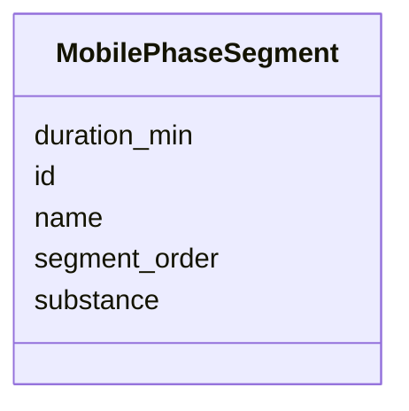

# Class: MobilePhaseSegment 


_A segment of the mobile phase used in chromatography during mass spectrometry._


URI: [analysis_api_schema:MobilePhaseSegment](https://w3id.org/MONet/analysis-api-schema/MobilePhaseSegment)





<!-- no inheritance hierarchy -->


## Slots

| Name | Cardinality and Range | Description | Inheritance |
| ---  | --- | --- | --- |
| [name](name.md) | 1 <br/> [String](String.md) | Human-readable name for the entity or activity | direct |
| [duration_min](duration_min.md) | 0..1 <br/> [Float](Float.md) | how long something took, in minutes | direct |
| [id](id.md) | 1 <br/> uuid |  | direct |
| [segment_order](segment_order.md) | 0..1 <br/> [Integer](Integer.md) | The order of this segment in the overall chromatography protocol | direct |
| [substance](substance.md) | 0..1 <br/> [String](String.md) | The name of the substance used in this mobile phase segment | direct |


## Usages

| used by | used in | type | used |
| ---  | --- | --- | --- |
| [ChromatographyConfiguration](ChromatographyConfiguration.md) | [mobile_phases](mobile_phases.md) | range | [MobilePhaseSegment](MobilePhaseSegment.md) |


## TODOs

* inheritance? substances_used modelling

## Identifier and Mapping Information


### Schema Source


* from schema: https://w3id.org/MONet/analysis-api-schema


## Mappings

| Mapping Type | Mapped Value |
| ---  | ---  |
| self | analysis_api_schema:MobilePhaseSegment |
| native | analysis_api_schema:MobilePhaseSegment |


## LinkML Source

<!-- TODO: investigate https://stackoverflow.com/questions/37606292/how-to-create-tabbed-code-blocks-in-mkdocs-or-sphinx -->

### Direct

<details>
```yaml
name: MobilePhaseSegment
description: A segment of the mobile phase used in chromatography during mass spectrometry.
todos:
- inheritance? substances_used modelling
from_schema: https://w3id.org/MONet/analysis-api-schema
rank: 1000
slots:
- name
- duration_min
attributes:
  id:
    name: id
    from_schema: https://w3id.org/MONet/analysis-api-schema/mass-spec
    identifier: true
    domain_of:
    - Activity
    - Entity
    - DataProduct
    - DataGenerationActivity
    - DataProcessingActivity
    - AlternativeIdentifier
    - FunctionalAnnotationIdentifier
    - Instrument
    - OntologyClass
    - ContainerType
    - Custodian
    - InstrumentAlternativeIdentifier
    - LabDevice
    - SampleProcessing
    - ProcessingSampleLink
    - Configuration
    - MobilePhaseSegment
    - MassSpectrometryStandardRun
    - PurchasedMaterial
    - LabProcessingActivity
    - MAOMProduct
    - WEOMProduct
    - Site
    - Sample
    - AerosolArmSample
    - AerosolSample
    - AMP2UserSample
    - CommerciallyPurchasedSample
    - CultureEnvironmentalSample
    - EngineeredStrainSample
    - FieldDeployedTerraformSample
    - MixedCultureSample
    - MonetSoilSample
    - OtherUndescribedSample
    - PlantSample
    - PureCultureSample
    - SedimentSample
    - SoilSample
    - SynthesizedMaterialSample
    - TerraformSample
    - WaterSample
    - ProcessedSample
    - CoreSection
    - SamplingActivity
    - AerosolArmSamplingActivity
    - AerosolSamplingActivity
    - CommerciallyPurchasedSamplingActivity
    - CultureEnvironmentalSamplingActivity
    - EngineeredStrainSamplingActivity
    - FieldDeployedTerraformSamplingActivity
    - MixedCultureSamplingActivity
    - MonetSoilSamplingActivity
    - OtherUndescribedSamplingActivity
    - PlantSamplingActivity
    - PureCultureSamplingActivity
    - SedimentSamplingActivity
    - SoilSamplingActivity
    - SynthesizedMaterialSamplingActivity
    - TerraformSamplingActivity
    - WaterSamplingActivity
    - biological_entity
    - Study
    - ProjectParticipant
    - TimestampValue
    - TextValue
    - SoftwareControlledTermValue
    - ControlledTermValue
    - PersonValue
    - QuantityValue
    - ConditioningValue
    - zipDownload
    range: uuid
    required: true
  segment_order:
    name: segment_order
    description: The order of this segment in the overall chromatography protocol.
    from_schema: https://w3id.org/MONet/analysis-api-schema/mass-spec
    rank: 1000
    domain_of:
    - MobilePhaseSegment
    range: integer
  substance:
    name: substance
    description: The name of the substance used in this mobile phase segment.
    from_schema: https://w3id.org/MONet/analysis-api-schema/mass-spec
    rank: 1000
    domain_of:
    - MobilePhaseSegment
    range: string

```
</details>

### Induced

<details>
```yaml
name: MobilePhaseSegment
description: A segment of the mobile phase used in chromatography during mass spectrometry.
todos:
- inheritance? substances_used modelling
from_schema: https://w3id.org/MONet/analysis-api-schema
rank: 1000
attributes:
  id:
    name: id
    from_schema: https://w3id.org/MONet/analysis-api-schema/mass-spec
    identifier: true
    alias: id
    owner: MobilePhaseSegment
    domain_of:
    - Activity
    - Entity
    - DataProduct
    - DataGenerationActivity
    - DataProcessingActivity
    - AlternativeIdentifier
    - FunctionalAnnotationIdentifier
    - Instrument
    - OntologyClass
    - ContainerType
    - Custodian
    - InstrumentAlternativeIdentifier
    - LabDevice
    - SampleProcessing
    - ProcessingSampleLink
    - Configuration
    - MobilePhaseSegment
    - MassSpectrometryStandardRun
    - PurchasedMaterial
    - LabProcessingActivity
    - MAOMProduct
    - WEOMProduct
    - Site
    - Sample
    - AerosolArmSample
    - AerosolSample
    - AMP2UserSample
    - CommerciallyPurchasedSample
    - CultureEnvironmentalSample
    - EngineeredStrainSample
    - FieldDeployedTerraformSample
    - MixedCultureSample
    - MonetSoilSample
    - OtherUndescribedSample
    - PlantSample
    - PureCultureSample
    - SedimentSample
    - SoilSample
    - SynthesizedMaterialSample
    - TerraformSample
    - WaterSample
    - ProcessedSample
    - CoreSection
    - SamplingActivity
    - AerosolArmSamplingActivity
    - AerosolSamplingActivity
    - CommerciallyPurchasedSamplingActivity
    - CultureEnvironmentalSamplingActivity
    - EngineeredStrainSamplingActivity
    - FieldDeployedTerraformSamplingActivity
    - MixedCultureSamplingActivity
    - MonetSoilSamplingActivity
    - OtherUndescribedSamplingActivity
    - PlantSamplingActivity
    - PureCultureSamplingActivity
    - SedimentSamplingActivity
    - SoilSamplingActivity
    - SynthesizedMaterialSamplingActivity
    - TerraformSamplingActivity
    - WaterSamplingActivity
    - biological_entity
    - Study
    - ProjectParticipant
    - TimestampValue
    - TextValue
    - SoftwareControlledTermValue
    - ControlledTermValue
    - PersonValue
    - QuantityValue
    - ConditioningValue
    - zipDownload
    range: uuid
    required: true
  segment_order:
    name: segment_order
    description: The order of this segment in the overall chromatography protocol.
    from_schema: https://w3id.org/MONet/analysis-api-schema/mass-spec
    rank: 1000
    alias: segment_order
    owner: MobilePhaseSegment
    domain_of:
    - MobilePhaseSegment
    range: integer
  substance:
    name: substance
    description: The name of the substance used in this mobile phase segment.
    from_schema: https://w3id.org/MONet/analysis-api-schema/mass-spec
    rank: 1000
    alias: substance
    owner: MobilePhaseSegment
    domain_of:
    - MobilePhaseSegment
    range: string
  name:
    name: name
    description: Human-readable name for the entity or activity.
    from_schema: https://w3id.org/MONet/analysis-api-schema
    rank: 1000
    alias: name
    owner: MobilePhaseSegment
    domain_of:
    - Activity
    - Entity
    - DataProduct
    - DataGenerationActivity
    - Instrument
    - OntologyClass
    - ContainerAxis
    - Configuration
    - MobilePhaseSegment
    - MassSpectrometryStandardRun
    - PurchasedMaterial
    - LabProcessingActivity
    - Site
    - Sample
    - SamplingActivity
    - SoilSamplingActivity
    - biological_entity
    - Study
    - SoftwareControlledTermValue
    range: string
    required: true
  duration_min:
    name: duration_min
    description: how long something took, in minutes
    from_schema: https://w3id.org/MONet/analysis-api-schema
    rank: 1000
    alias: duration_min
    owner: MobilePhaseSegment
    domain_of:
    - ChromatographyConfiguration
    - MobilePhaseSegment
    range: float

```
</details>