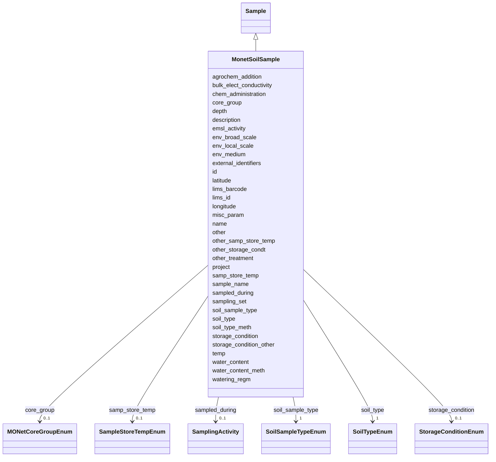

# Class: MonetSoilSample 


_A soil sample that has been collected according to the MONet soil sampling protocol. This sample type has specific slot requirements related to the MONet soil sampling method, such as infiltration rates._


URI: [basalt_schema:MonetSoilSample](https://w3id.org/MONet/basalt-schema/MonetSoilSample)





## Inheritance
* [Sample](Sample.md)
    * **MonetSoilSample**


## Slots

| Name | Cardinality and Range | Description | Inheritance |
| ---  | --- | --- | --- |
| [agrochem_addition](agrochem_addition.md) | 0..1 <br/> [String](String.md) | Addition of fertilizers, pesticides, etc | direct |
| [bulk_elect_conductivity](bulk_elect_conductivity.md) | 1 <br/> [String](String.md) | Provide the bulk electrical conductivity readout from the Teros ZSC bluetooth... | direct |
| [chem_administration](chem_administration.md) | 0..1 <br/> [String](String.md) | List of chemical compounds administered to the host or site where sampling oc... | direct |
| [core_group](core_group.md) | 0..1 <br/> [MONetCoreGroupEnum](MONetCoreGroupEnum.md) | The category of soil core taken according to the MONet sampling protocol | direct |
| [depth](depth.md) | 1 <br/> [String](String.md) | The vertical distance below local surface | direct |
| [env_broad_scale](env_broad_scale.md) | 0..1 <br/> [String](String.md) | 'Report the major environmental system the sample or specimen came from | direct |
| [env_local_scale](env_local_scale.md) | 0..1 <br/> [String](String.md) | 'Report the entity which are in your sample or specimens local vicinity and w... | direct |
| [env_medium](env_medium.md) | 0..1 <br/> [String](String.md) | 'Report the environmental material immediately surrounding the sample or spec... | direct |
| [external_identifiers](external_identifiers.md) | * <br/> [Uriorcurie](Uriorcurie.md) | List of external identifiers associated with this entity or activity | direct |
| [latitude](latitude.md) | 1 <br/> [Double](Double.md) | Latitude coordinate of the sampling site in WSG 84 format | direct |
| [longitude](longitude.md) | 1 <br/> [Double](Double.md) | Longitude coordinate of the sampling site in WSG 84 format | direct |
| [lims_id](lims_id.md) | 0..1 <br/> [String](String.md) | An EMSL internal LIMS identifier for your sample | direct |
| [misc_param](misc_param.md) | 0..1 <br/> [String](String.md) | Any other measurement performed or parameter collected that is not listed her... | direct |
| [other](other.md) | 0..1 <br/> [String](String.md) | Other/additional details about your sample that you feel can't be accurately ... | direct |
| [other_samp_store_temp](other_samp_store_temp.md) | 0..1 <br/> [String](String.md) | Please specify sample storage temperature if you selected 'other' | direct |
| [other_storage_condt](other_storage_condt.md) | 0..1 <br/> [String](String.md) | Please specify your storage conditions if you selected 'other' and the availa... | direct |
| [other_treatment](other_treatment.md) | 0..1 <br/> [String](String.md) | Many sample treatment descriptor columns are available | direct |
| [project](project.md) | 0..1 <br/> [Integer](Integer.md) | Identifier for the user project associated with the entity or activity | direct |
| [sample_name](sample_name.md) | 0..1 <br/> [String](String.md) | The name or label that is present on the shipped sample | direct |
| [samp_store_temp](samp_store_temp.md) | 0..1 <br/> [SampleStoreTempEnum](SampleStoreTempEnum.md) | The temperature at which your samples should be stored upon arrival | direct |
| [sampled_during](sampled_during.md) | 0..1 <br/> [SamplingActivity](SamplingActivity.md) | Reference to the sampling activity during which this sample was collected | direct |
| [sampling_set](sampling_set.md) | 1 <br/> [Integer](Integer.md) | Sampling set number for grouping related samples collected together | direct |
| [soil_sample_type](soil_sample_type.md) | 1 <br/> [SoilSampleTypeEnum](SoilSampleTypeEnum.md) | The specific type of soil sample (e | direct |
| [soil_type](soil_type.md) | 1 <br/> [SoilTypeEnum](SoilTypeEnum.md) | Soil series name or other lower-level classification | direct |
| [soil_type_meth](soil_type_meth.md) | 1 <br/> [String](String.md) | Reference or method used in determining soil series name or other lower-level... | direct |
| [storage_condition](storage_condition.md) | 0..1 <br/> [StorageConditionEnum](StorageConditionEnum.md) | The storage condition of the sample | direct |
| [storage_condition_other](storage_condition_other.md) | 0..1 <br/> [String](String.md) | Free-text field for storage conditions when 'storage_condition' is 'other' | direct |
| [temp](temp.md) | 1 <br/> [String](String.md) | Temperature of the sample at the time of sampling | direct |
| [water_content](water_content.md) | 1 <br/> [String](String.md) | Water content measurement | direct |
| [water_content_meth](water_content_meth.md) | 0..1 <br/> [String](String.md) | Reference or method used in determining the water content of soil | direct |
| [watering_regm](watering_regm.md) | 0..1 <br/> [String](String.md) | Information about treatment involving an exposure to watering frequencies, tr... | direct |
| [id](id.md) | 1 <br/> [Uuid](Uuid.md) |  | direct |
| [name](name.md) | 1 <br/> [String](String.md) | Human-readable name for the entity or activity | [Sample](Sample.md) |
| [description](description.md) | 0..1 <br/> [String](String.md) | Human-readable description for the entity or activity | [Sample](Sample.md) |
| [emsl_activity](emsl_activity.md) | 0..1 <br/> [String](String.md) | Nullable string linking a Sample or SamplingActivity to a named EMSL activity... | [Sample](Sample.md) |
| [lims_barcode](lims_barcode.md) | 0..1 <br/> [String](String.md) | LIMS barcode identifier | [Sample](Sample.md) |


## Identifier and Mapping Information


### Schema Source


* from schema: https://w3id.org/MONet/basalt-schema


## Mappings

| Mapping Type | Mapped Value |
| ---  | ---  |
| self | basalt_schema:MonetSoilSample |
| native | basalt_schema:MonetSoilSample |


## LinkML Source

<!-- TODO: investigate https://stackoverflow.com/questions/37606292/how-to-create-tabbed-code-blocks-in-mkdocs-or-sphinx -->

### Direct

<details>
```yaml
name: MonetSoilSample
description: A soil sample that has been collected according to the MONet soil sampling
  protocol. This sample type has specific slot requirements related to the MONet soil
  sampling method, such as infiltration rates.
from_schema: https://w3id.org/MONet/basalt-schema
is_a: Sample
slots:
- agrochem_addition
- bulk_elect_conductivity
- chem_administration
- core_group
- depth
- env_broad_scale
- env_local_scale
- env_medium
- external_identifiers
- latitude
- longitude
- lims_id
- misc_param
- other
- other_samp_store_temp
- other_storage_condt
- other_treatment
- project
- sample_name
- samp_store_temp
- sampled_during
- sampling_set
- soil_sample_type
- soil_type
- soil_type_meth
- storage_condition
- storage_condition_other
- temp
- water_content
- water_content_meth
- watering_regm
slot_usage:
  bulk_elect_conductivity:
    name: bulk_elect_conductivity
    description: 'Provide the bulk electrical conductivity readout from the Teros
      ZSC bluetooth sensor. If measurement was started and unsuccessful enter ''failed''
      if measurement was not attempted enter ''did not collect''. (Unit: mS/cm)'
    required: true
    pattern: ^\d+(\.\d+)?\s*mS/cm|did not collect|failed
  depth:
    name: depth
    description: 'The vertical distance below local surface. For sediment or soil
      samples, depth is measured from sediment or soil surface respectively. Depth
      is required to be reported as an interval for subsurface samples. (Units: cm
      or m)'
    required: true
    pattern: ^\d+(\.\d+)?-\d+(\.\d+)?\s*(m|cm)$
  latitude:
    name: latitude
    required: true
  longitude:
    name: longitude
    required: true
  sampling_set:
    name: sampling_set
    required: true
  soil_sample_type:
    name: soil_sample_type
    required: true
  soil_type:
    name: soil_type
    required: true
  soil_type_meth:
    name: soil_type_meth
    required: true
  temp:
    name: temp
    description: 'Temperature of the sample at the time of sampling. If measurement
      was started and unsuccessful enter ''failed'' if measurement was not attempted
      enter ''did not collect''. (Units: C)'
    required: true
    pattern: ^-?\d+(\.\d+)?\s*C|did not collect|failed
  water_content:
    name: water_content
    description: Water content measurement. This will be a readout from the Teros
      ZSC bluetooth sensor and requires a unit of 'm3/m3'. If measurement was started
      and unsuccessful enter 'failed' if measurement was not attempted enter 'did
      not collect'.
    required: true
    pattern: ^\d+(\.\d+)?\s*m3/m3|did not collect|failed
attributes:
  id:
    name: id
    from_schema: https://w3id.org/MONet/basalt-schema/sample-classes
    identifier: true
    domain_of:
    - Activity
    - Entity
    - DataProduct
    - DataGenerationActivity
    - DataProcessingActivity
    - AlternativeIdentifier
    - FunctionalAnnotationIdentifier
    - Instrument
    - OntologyClass
    - ContainerType
    - Custodian
    - InstrumentAlternativeIdentifier
    - LabDevice
    - SampleProcessing
    - ProcessingSampleLink
    - Configuration
    - MobilePhaseSegment
    - MassSpectrometryStandardRun
    - PurchasedMaterial
    - LabProcessingActivity
    - organism
    - MAOMProduct
    - WEOMProduct
    - Site
    - Sample
    - AerosolArmSample
    - AerosolSample
    - AMP2UserSample
    - CommerciallyPurchasedSample
    - CultureEnvironmentalSample
    - EngineeredStrainSample
    - FieldDeployedTerraformSample
    - MixedCultureSample
    - MonetSoilSample
    - OtherUndescribedSample
    - PlantSample
    - PureCultureSample
    - SedimentSample
    - SoilSample
    - SynthesizedMaterialSample
    - TerraformSample
    - WaterSample
    - ProcessedSample
    - CoreSection
    - SamplingActivity
    - AerosolArmSamplingActivity
    - AerosolSamplingActivity
    - CommerciallyPurchasedSamplingActivity
    - CultureEnvironmentalSamplingActivity
    - EngineeredStrainSamplingActivity
    - FieldDeployedTerraformSamplingActivity
    - MixedCultureSamplingActivity
    - MonetSoilSamplingActivity
    - OtherUndescribedSamplingActivity
    - PlantSamplingActivity
    - PureCultureSamplingActivity
    - SedimentSamplingActivity
    - SoilSamplingActivity
    - SynthesizedMaterialSamplingActivity
    - TerraformSamplingActivity
    - WaterSamplingActivity
    - Study
    - ProjectParticipant
    - TimestampValue
    - TextValue
    - SoftwareControlledTermValue
    - ControlledTermValue
    - PersonValue
    - QuantityValue
    - ConditioningValue
    - zipDownload
    range: uuid
    required: true

```
</details>

### Induced

<details>
```yaml
name: MonetSoilSample
description: A soil sample that has been collected according to the MONet soil sampling
  protocol. This sample type has specific slot requirements related to the MONet soil
  sampling method, such as infiltration rates.
from_schema: https://w3id.org/MONet/basalt-schema
is_a: Sample
slot_usage:
  bulk_elect_conductivity:
    name: bulk_elect_conductivity
    description: 'Provide the bulk electrical conductivity readout from the Teros
      ZSC bluetooth sensor. If measurement was started and unsuccessful enter ''failed''
      if measurement was not attempted enter ''did not collect''. (Unit: mS/cm)'
    required: true
    pattern: ^\d+(\.\d+)?\s*mS/cm|did not collect|failed
  depth:
    name: depth
    description: 'The vertical distance below local surface. For sediment or soil
      samples, depth is measured from sediment or soil surface respectively. Depth
      is required to be reported as an interval for subsurface samples. (Units: cm
      or m)'
    required: true
    pattern: ^\d+(\.\d+)?-\d+(\.\d+)?\s*(m|cm)$
  latitude:
    name: latitude
    required: true
  longitude:
    name: longitude
    required: true
  sampling_set:
    name: sampling_set
    required: true
  soil_sample_type:
    name: soil_sample_type
    required: true
  soil_type:
    name: soil_type
    required: true
  soil_type_meth:
    name: soil_type_meth
    required: true
  temp:
    name: temp
    description: 'Temperature of the sample at the time of sampling. If measurement
      was started and unsuccessful enter ''failed'' if measurement was not attempted
      enter ''did not collect''. (Units: C)'
    required: true
    pattern: ^-?\d+(\.\d+)?\s*C|did not collect|failed
  water_content:
    name: water_content
    description: Water content measurement. This will be a readout from the Teros
      ZSC bluetooth sensor and requires a unit of 'm3/m3'. If measurement was started
      and unsuccessful enter 'failed' if measurement was not attempted enter 'did
      not collect'.
    required: true
    pattern: ^\d+(\.\d+)?\s*m3/m3|did not collect|failed
attributes:
  id:
    name: id
    from_schema: https://w3id.org/MONet/basalt-schema/sample-classes
    identifier: true
    alias: id
    owner: MonetSoilSample
    domain_of:
    - Activity
    - Entity
    - DataProduct
    - DataGenerationActivity
    - DataProcessingActivity
    - AlternativeIdentifier
    - FunctionalAnnotationIdentifier
    - Instrument
    - OntologyClass
    - ContainerType
    - Custodian
    - InstrumentAlternativeIdentifier
    - LabDevice
    - SampleProcessing
    - ProcessingSampleLink
    - Configuration
    - MobilePhaseSegment
    - MassSpectrometryStandardRun
    - PurchasedMaterial
    - LabProcessingActivity
    - organism
    - MAOMProduct
    - WEOMProduct
    - Site
    - Sample
    - AerosolArmSample
    - AerosolSample
    - AMP2UserSample
    - CommerciallyPurchasedSample
    - CultureEnvironmentalSample
    - EngineeredStrainSample
    - FieldDeployedTerraformSample
    - MixedCultureSample
    - MonetSoilSample
    - OtherUndescribedSample
    - PlantSample
    - PureCultureSample
    - SedimentSample
    - SoilSample
    - SynthesizedMaterialSample
    - TerraformSample
    - WaterSample
    - ProcessedSample
    - CoreSection
    - SamplingActivity
    - AerosolArmSamplingActivity
    - AerosolSamplingActivity
    - CommerciallyPurchasedSamplingActivity
    - CultureEnvironmentalSamplingActivity
    - EngineeredStrainSamplingActivity
    - FieldDeployedTerraformSamplingActivity
    - MixedCultureSamplingActivity
    - MonetSoilSamplingActivity
    - OtherUndescribedSamplingActivity
    - PlantSamplingActivity
    - PureCultureSamplingActivity
    - SedimentSamplingActivity
    - SoilSamplingActivity
    - SynthesizedMaterialSamplingActivity
    - TerraformSamplingActivity
    - WaterSamplingActivity
    - Study
    - ProjectParticipant
    - TimestampValue
    - TextValue
    - SoftwareControlledTermValue
    - ControlledTermValue
    - PersonValue
    - QuantityValue
    - ConditioningValue
    - zipDownload
    range: uuid
    required: true
  agrochem_addition:
    name: agrochem_addition
    description: Addition of fertilizers, pesticides, etc. - amount and time of applications
    title: agrochemical additions
    from_schema: https://w3id.org/MONet/basalt-schema
    rank: 1000
    alias: agrochem_addition
    owner: MonetSoilSample
    domain_of:
    - MonetSoilSample
    - OtherUndescribedSample
    - SoilSample
    range: string
  bulk_elect_conductivity:
    name: bulk_elect_conductivity
    description: 'Provide the bulk electrical conductivity readout from the Teros
      ZSC bluetooth sensor. If measurement was started and unsuccessful enter ''failed''
      if measurement was not attempted enter ''did not collect''. (Unit: mS/cm)'
    title: bulk electrical conductivity
    from_schema: https://w3id.org/MONet/basalt-schema
    rank: 1000
    alias: bulk_elect_conductivity
    owner: MonetSoilSample
    domain_of:
    - MonetSoilSample
    - OtherUndescribedSample
    - SoilSample
    range: string
    required: true
    pattern: ^\d+(\.\d+)?\s*mS/cm|did not collect|failed
  chem_administration:
    name: chem_administration
    description: List of chemical compounds administered to the host or site where
      sampling occurred, and when (e.g. Antibiotics, n fertilizer, air filter); can
      include multiple compounds. For chemical entities of biological interest ontology
      (chebi) (v 163), http://purl.bioontology.org/ontology/chebi
    title: chemical administration
    from_schema: https://w3id.org/MONet/basalt-schema
    exact_mappings:
    - MIXS:0000751
    rank: 1000
    alias: chem_administration
    owner: MonetSoilSample
    domain_of:
    - AerosolArmSample
    - AerosolSample
    - CultureEnvironmentalSample
    - FieldDeployedTerraformSample
    - MixedCultureSample
    - MonetSoilSample
    - OtherUndescribedSample
    - PlantSample
    - PureCultureSample
    - SedimentSample
    - SoilSample
    - TerraformSample
    - WaterSample
    range: string
  core_group:
    name: core_group
    description: The category of soil core taken according to the MONet sampling protocol.
    title: core group
    from_schema: https://w3id.org/MONet/basalt-schema
    rank: 1000
    alias: core_group
    owner: MonetSoilSample
    domain_of:
    - MonetSoilSample
    range: MONetCoreGroupEnum
  depth:
    name: depth
    description: 'The vertical distance below local surface. For sediment or soil
      samples, depth is measured from sediment or soil surface respectively. Depth
      is required to be reported as an interval for subsurface samples. (Units: cm
      or m)'
    title: depth
    from_schema: https://w3id.org/MONet/basalt-schema
    rank: 1000
    alias: depth
    owner: MonetSoilSample
    domain_of:
    - FieldDeployedTerraformSample
    - MonetSoilSample
    - OtherUndescribedSample
    - SedimentSample
    - SoilSample
    - WaterSample
    range: string
    required: true
    pattern: ^\d+(\.\d+)?-\d+(\.\d+)?\s*(m|cm)$
  env_broad_scale:
    name: env_broad_scale
    description: '''Report the major environmental system the sample or specimen came
      from. The system identified should have a coarse spatial grain to provide the
      general environmental context of where the sampling was done (e.g. in the desert
      or a rainforest). We recommend using subclasses of EnvO''''s biome class: http://purl.obolibrary.org/obo/ENVO_00000428.
      EnvO documentation about how to use the field: https://github.com/EnvironmentOntology/envo/wiki/Using-ENVO-with-MIxS'''
    title: broad-scale environmental context
    from_schema: https://w3id.org/MONet/basalt-schema
    rank: 1000
    alias: env_broad_scale
    owner: MonetSoilSample
    domain_of:
    - AerosolArmSample
    - AerosolSample
    - CultureEnvironmentalSample
    - FieldDeployedTerraformSample
    - MonetSoilSample
    - OtherUndescribedSample
    - PlantSample
    - PureCultureSample
    - SedimentSample
    - SoilSample
    - TerraformSample
    - WaterSample
    range: string
    pattern: ^_*\s*[a-zA-Z\s]+\[ENVO:\d+\]$
  env_local_scale:
    name: env_local_scale
    description: '''Report the entity which are in your sample or specimens local
      vicinity and which you believe have significant causal influences on your sample
      or specimen. Please use terms that are present in ENVO and which are of smaller
      spatial grain than your entry for env_broad_scale.If needed, request new terms
      on the ENVO tracker identified here: http://www.obofoundry.org/ontology/envo.html'''
    title: local environmental context
    from_schema: https://w3id.org/MONet/basalt-schema
    rank: 1000
    alias: env_local_scale
    owner: MonetSoilSample
    domain_of:
    - AerosolArmSample
    - AerosolSample
    - CultureEnvironmentalSample
    - FieldDeployedTerraformSample
    - MonetSoilSample
    - OtherUndescribedSample
    - PlantSample
    - PureCultureSample
    - SedimentSample
    - SoilSample
    - TerraformSample
    - WaterSample
    range: string
    pattern: ^_*\s*[a-zA-Z\s]+\[ENVO:\d+\]$
  env_medium:
    name: env_medium
    description: '''Report the environmental material immediately surrounding the
      sample or specimen at the time of sampling. We recommend using subclasses of
      ''''environmental material'''' (http://purl.obolibrary.org/obo/ENVO_00010483).
      EnvO documentation about how to use the field: https://github.com/EnvironmentOntology/envo/wiki/Using-ENVO-with-MIxS.'''
    title: environmental medium
    from_schema: https://w3id.org/MONet/basalt-schema
    rank: 1000
    alias: env_medium
    owner: MonetSoilSample
    domain_of:
    - AerosolArmSample
    - AerosolSample
    - CultureEnvironmentalSample
    - FieldDeployedTerraformSample
    - MonetSoilSample
    - OtherUndescribedSample
    - PlantSample
    - PureCultureSample
    - SedimentSample
    - SoilSample
    - TerraformSample
    - WaterSample
    range: string
    pattern: ^_*\s*[a-zA-Z\s]+\[ENVO:\d+\]$
  external_identifiers:
    name: external_identifiers
    description: List of external identifiers associated with this entity or activity.
    from_schema: https://w3id.org/MONet/basalt-schema
    rank: 1000
    alias: external_identifiers
    owner: MonetSoilSample
    domain_of:
    - NucleotideSequencing
    - AerosolArmSample
    - AerosolSample
    - CommerciallyPurchasedSample
    - CultureEnvironmentalSample
    - EngineeredStrainSample
    - FieldDeployedTerraformSample
    - MixedCultureSample
    - MonetSoilSample
    - OtherUndescribedSample
    - PlantSample
    - PureCultureSample
    - SedimentSample
    - SoilSample
    - SynthesizedMaterialSample
    - TerraformSample
    - WaterSample
    - Study
    range: uriorcurie
    multivalued: true
  latitude:
    name: latitude
    description: Latitude coordinate of the sampling site in WSG 84 format.
    title: latitude
    from_schema: https://w3id.org/MONet/basalt-schema
    broad_mappings:
    - MIXS:0000009
    rank: 1000
    alias: latitude
    owner: MonetSoilSample
    domain_of:
    - Site
    - AerosolArmSample
    - AerosolSample
    - CultureEnvironmentalSample
    - FieldDeployedTerraformSample
    - MonetSoilSample
    - OtherUndescribedSample
    - PlantSample
    - SedimentSample
    - SoilSample
    - WaterSample
    range: double
    required: true
  longitude:
    name: longitude
    description: Longitude coordinate of the sampling site in WSG 84 format.
    title: longitude
    from_schema: https://w3id.org/MONet/basalt-schema
    broad_mappings:
    - MIXS:0000009
    rank: 1000
    alias: longitude
    owner: MonetSoilSample
    domain_of:
    - Site
    - AerosolArmSample
    - AerosolSample
    - CultureEnvironmentalSample
    - FieldDeployedTerraformSample
    - MonetSoilSample
    - OtherUndescribedSample
    - PlantSample
    - SedimentSample
    - SoilSample
    - WaterSample
    range: double
    required: true
  lims_id:
    name: lims_id
    description: An EMSL internal LIMS identifier for your sample. This will be provided
      by the MPOC and should not be edited.
    title: LIMS ID
    from_schema: https://w3id.org/MONet/basalt-schema
    rank: 1000
    alias: lims_id
    owner: MonetSoilSample
    domain_of:
    - MonetSoilSample
    range: string
    pattern: ^INGEST_SAMPLE_\d{9}$
  misc_param:
    name: misc_param
    description: Any other measurement performed or parameter collected that is not
      listed here
    title: miscellaneous parameter
    from_schema: https://w3id.org/MONet/basalt-schema
    rank: 1000
    alias: misc_param
    owner: MonetSoilSample
    domain_of:
    - AerosolArmSample
    - AerosolSample
    - FieldDeployedTerraformSample
    - MonetSoilSample
    - OtherUndescribedSample
    - PlantSample
    - SedimentSample
    - SoilSample
    - TerraformSample
    - WaterSample
    range: string
  other:
    name: other
    description: Other/additional details about your sample that you feel can't be
      accurately represented in ANY of the available columns.
    title: other
    from_schema: https://w3id.org/MONet/basalt-schema
    rank: 1000
    alias: other
    owner: MonetSoilSample
    domain_of:
    - AerosolArmSample
    - AerosolSample
    - CommerciallyPurchasedSample
    - CultureEnvironmentalSample
    - FieldDeployedTerraformSample
    - MixedCultureSample
    - MonetSoilSample
    - OtherUndescribedSample
    - PlantSample
    - PureCultureSample
    - SedimentSample
    - SoilSample
    - SynthesizedMaterialSample
    - TerraformSample
    - WaterSample
    range: string
  other_samp_store_temp:
    name: other_samp_store_temp
    description: Please specify sample storage temperature if you selected 'other'
    title: other sample storage temperature
    from_schema: https://w3id.org/MONet/basalt-schema
    rank: 1000
    alias: other_samp_store_temp
    owner: MonetSoilSample
    domain_of:
    - AerosolArmSample
    - AerosolSample
    - CommerciallyPurchasedSample
    - CultureEnvironmentalSample
    - FieldDeployedTerraformSample
    - MixedCultureSample
    - MonetSoilSample
    - OtherUndescribedSample
    - PlantSample
    - PureCultureSample
    - SedimentSample
    - SoilSample
    - SynthesizedMaterialSample
    - TerraformSample
    - WaterSample
    range: string
  other_storage_condt:
    name: other_storage_condt
    description: Please specify your storage conditions if you selected 'other' and
      the available values are not appropriate
    title: other storage condition
    from_schema: https://w3id.org/MONet/basalt-schema
    rank: 1000
    alias: other_storage_condt
    owner: MonetSoilSample
    domain_of:
    - AerosolSample
    - CommerciallyPurchasedSample
    - CultureEnvironmentalSample
    - FieldDeployedTerraformSample
    - MixedCultureSample
    - MonetSoilSample
    - PlantSample
    - PureCultureSample
    - SedimentSample
    - SoilSample
    - SynthesizedMaterialSample
    - TerraformSample
    - WaterSample
    range: string
  other_treatment:
    name: other_treatment
    description: Many sample treatment descriptor columns are available. If a treatment
      is applied to your samples and the provided treatment terms do not satisfy please
      add it here. Multiple treatments can be entered here separated by ;
    title: other treatment
    from_schema: https://w3id.org/MONet/basalt-schema
    rank: 1000
    alias: other_treatment
    owner: MonetSoilSample
    domain_of:
    - AerosolArmSample
    - AerosolSample
    - CommerciallyPurchasedSample
    - CultureEnvironmentalSample
    - FieldDeployedTerraformSample
    - MixedCultureSample
    - MonetSoilSample
    - OtherUndescribedSample
    - PlantSample
    - PureCultureSample
    - SedimentSample
    - SoilSample
    - TerraformSample
    - WaterSample
    range: string
  project:
    name: project
    description: 'Identifier for the user project associated with the entity or activity. '
    title: Project
    todos:
    - should this be an ID? CURIE can use the one NMDC has https://bioregistry.io/reference/emsl.project:60141
      where emsl.project is the CURIE prefix
    from_schema: https://w3id.org/MONet/basalt-schema
    aliases:
    - study
    - study_id
    - project_id
    - proposal
    - proposal_id
    rank: 1000
    alias: project
    owner: MonetSoilSample
    domain_of:
    - DataProduct
    - AerosolArmSample
    - AerosolSample
    - CommerciallyPurchasedSample
    - CultureEnvironmentalSample
    - FieldDeployedTerraformSample
    - MixedCultureSample
    - MonetSoilSample
    - OtherUndescribedSample
    - PlantSample
    - PureCultureSample
    - SedimentSample
    - SoilSample
    - SynthesizedMaterialSample
    - TerraformSample
    - WaterSample
    - SamplingActivity
    range: integer
  sample_name:
    name: sample_name
    description: 'The name or label that is present on the shipped sample. This should

      be a human readable name.'
    title: sample name
    notes:
    - This is typically an alias for the inherited 'name' slot on Sample classes.
      Defined separately for compatibility with source data files using 'sample_name'
      column headers.
    from_schema: https://w3id.org/MONet/basalt-schema
    aliases:
    - samp_name
    rank: 1000
    alias: sample_name
    owner: MonetSoilSample
    domain_of:
    - DataProduct
    - AerosolArmSample
    - AerosolSample
    - CommerciallyPurchasedSample
    - CultureEnvironmentalSample
    - FieldDeployedTerraformSample
    - MixedCultureSample
    - MonetSoilSample
    - OtherUndescribedSample
    - PlantSample
    - PureCultureSample
    - SedimentSample
    - SoilSample
    - SynthesizedMaterialSample
    - TerraformSample
    - WaterSample
    range: string
  samp_store_temp:
    name: samp_store_temp
    description: The temperature at which your samples should be stored upon arrival.
      This field is NOT multivalued. If selecting other add the `other_samp_store_temp`
      attribute to provide additional detail.
    title: sample storage temperature
    from_schema: https://w3id.org/MONet/basalt-schema
    aliases:
    - sample_storage_temperature
    - storage_temperature
    rank: 1000
    alias: samp_store_temp
    owner: MonetSoilSample
    domain_of:
    - AerosolArmSample
    - AerosolSample
    - CommerciallyPurchasedSample
    - CultureEnvironmentalSample
    - FieldDeployedTerraformSample
    - MixedCultureSample
    - MonetSoilSample
    - OtherUndescribedSample
    - PlantSample
    - PureCultureSample
    - SedimentSample
    - SoilSample
    - SynthesizedMaterialSample
    - TerraformSample
    - WaterSample
    range: SampleStoreTempEnum
  sampled_during:
    name: sampled_during
    description: Reference to the sampling activity during which this sample was collected.
      This is a FK to the SamplingActivity class, which contains metadata about the
      sampling event, such as date, device, method.
    from_schema: https://w3id.org/MONet/basalt-schema
    rank: 1000
    alias: sampled_during
    owner: MonetSoilSample
    domain_of:
    - AerosolArmSample
    - AerosolSample
    - CommerciallyPurchasedSample
    - CultureEnvironmentalSample
    - FieldDeployedTerraformSample
    - MixedCultureSample
    - MonetSoilSample
    - OtherUndescribedSample
    - PlantSample
    - PureCultureSample
    - SedimentSample
    - SoilSample
    - SynthesizedMaterialSample
    - TerraformSample
    - WaterSample
    - ProcessedSample
    range: SamplingActivity
  sampling_set:
    name: sampling_set
    description: 'Sampling set number for grouping related samples collected together.

      This is a user-defined sequential integer that can be used to link samples collected

      in the same sampling event or campaign.'
    title: sampling set
    from_schema: https://w3id.org/MONet/basalt-schema
    rank: 1000
    alias: sampling_set
    owner: MonetSoilSample
    domain_of:
    - DataProduct
    - MonetSoilSample
    range: integer
    required: true
  soil_sample_type:
    name: soil_sample_type
    description: The specific type of soil sample (e.g. soil core, surface layer).
    title: soil type
    todos:
    - this is a GSC slot but it's not constrined by an enum, it's a string. where
      did this come from?
    - BJM 060626 - clarified this slot and enum name from 'soil_type' but I'm still
      not sure we need it. it is populated in the current database though.
    from_schema: https://w3id.org/MONet/basalt-schema
    rank: 1000
    alias: soil_sample_type
    owner: MonetSoilSample
    domain_of:
    - MonetSoilSample
    - SoilSample
    range: SoilSampleTypeEnum
    required: true
  soil_type:
    name: soil_type
    description: Soil series name or other lower-level classification
    title: soil type
    from_schema: https://w3id.org/MONet/basalt-schema
    rank: 1000
    alias: soil_type
    owner: MonetSoilSample
    domain_of:
    - MonetSoilSample
    - SoilSample
    range: SoilTypeEnum
    required: true
  soil_type_meth:
    name: soil_type_meth
    description: Reference or method used in determining soil series name or other
      lower-level classification
    title: soil type method
    from_schema: https://w3id.org/MONet/basalt-schema
    rank: 1000
    alias: soil_type_meth
    owner: MonetSoilSample
    domain_of:
    - MonetSoilSample
    - SoilSample
    range: string
    required: true
  storage_condition:
    name: storage_condition
    description: The storage condition of the sample. This field is NOT multivalued.
      If selecting other add the `other_storage_condt` attribute to provide additional
      detail.
    title: storage condition
    from_schema: https://w3id.org/MONet/basalt-schema
    aliases:
    - samp_store_cond
    - storage_cond
    - storage_condt
    exact_mappings:
    - MIXS:0000327
    rank: 1000
    alias: storage_condition
    owner: MonetSoilSample
    domain_of:
    - AerosolArmSample
    - AerosolSample
    - AMP2UserSample
    - CommerciallyPurchasedSample
    - CultureEnvironmentalSample
    - EngineeredStrainSample
    - FieldDeployedTerraformSample
    - MixedCultureSample
    - MonetSoilSample
    - OtherUndescribedSample
    - PlantSample
    - PureCultureSample
    - SedimentSample
    - SoilSample
    - SynthesizedMaterialSample
    - TerraformSample
    - WaterSample
    range: StorageConditionEnum
  storage_condition_other:
    name: storage_condition_other
    description: Free-text field for storage conditions when 'storage_condition' is
      'other'
    from_schema: https://w3id.org/MONet/basalt-schema
    aliases:
    - other_storage_condt
    - storage_condt_other
    rank: 1000
    alias: storage_condition_other
    owner: MonetSoilSample
    domain_of:
    - AerosolArmSample
    - AerosolSample
    - CommerciallyPurchasedSample
    - CultureEnvironmentalSample
    - FieldDeployedTerraformSample
    - MixedCultureSample
    - MonetSoilSample
    - OtherUndescribedSample
    - PlantSample
    - PureCultureSample
    - SedimentSample
    - SoilSample
    - SynthesizedMaterialSample
    - TerraformSample
    - WaterSample
    range: string
  temp:
    name: temp
    description: 'Temperature of the sample at the time of sampling. If measurement
      was started and unsuccessful enter ''failed'' if measurement was not attempted
      enter ''did not collect''. (Units: C)'
    title: temperature
    from_schema: https://w3id.org/MONet/basalt-schema
    rank: 1000
    alias: temp
    owner: MonetSoilSample
    domain_of:
    - CommerciallyPurchasedSample
    - FieldDeployedTerraformSample
    - MonetSoilSample
    - OtherUndescribedSample
    - PlantSample
    - SedimentSample
    - SoilSample
    - SynthesizedMaterialSample
    - TerraformSample
    - WaterSample
    range: string
    required: true
    pattern: ^-?\d+(\.\d+)?\s*C|did not collect|failed
  water_content:
    name: water_content
    description: Water content measurement. This will be a readout from the Teros
      ZSC bluetooth sensor and requires a unit of 'm3/m3'. If measurement was started
      and unsuccessful enter 'failed' if measurement was not attempted enter 'did
      not collect'.
    title: water content
    from_schema: https://w3id.org/MONet/basalt-schema
    rank: 1000
    alias: water_content
    owner: MonetSoilSample
    domain_of:
    - FieldDeployedTerraformSample
    - MonetSoilSample
    - OtherUndescribedSample
    - SedimentSample
    - SoilSample
    - TerraformSample
    range: string
    required: true
    pattern: ^\d+(\.\d+)?\s*m3/m3|did not collect|failed
  water_content_meth:
    name: water_content_meth
    description: Reference or method used in determining the water content of soil
    title: water content method
    from_schema: https://w3id.org/MONet/basalt-schema
    rank: 1000
    alias: water_content_meth
    owner: MonetSoilSample
    domain_of:
    - FieldDeployedTerraformSample
    - MonetSoilSample
    - SedimentSample
    - SoilSample
    - TerraformSample
    range: string
  watering_regm:
    name: watering_regm
    description: Information about treatment involving an exposure to watering frequencies,
      treatment regimen including how many times the treatment was repeated, how long
      each treatment lasted, and the start and end time of the entire treatment; can
      include multiple regimens
    title: watering regimen
    from_schema: https://w3id.org/MONet/basalt-schema
    rank: 1000
    alias: watering_regm
    owner: MonetSoilSample
    domain_of:
    - CultureEnvironmentalSample
    - FieldDeployedTerraformSample
    - MixedCultureSample
    - MonetSoilSample
    - OtherUndescribedSample
    - PlantSample
    - PureCultureSample
    - SedimentSample
    - SoilSample
    - TerraformSample
    range: string
  name:
    name: name
    description: Human-readable name for the entity or activity.
    from_schema: https://w3id.org/MONet/basalt-schema
    rank: 1000
    alias: name
    owner: MonetSoilSample
    domain_of:
    - Activity
    - Entity
    - DataProduct
    - DataGenerationActivity
    - Instrument
    - OntologyClass
    - ContainerAxis
    - Configuration
    - MobilePhaseSegment
    - MassSpectrometryStandardRun
    - PurchasedMaterial
    - LabProcessingActivity
    - organism
    - Site
    - Sample
    - SamplingActivity
    - SoilSamplingActivity
    - Study
    - SoftwareControlledTermValue
    range: string
    required: true
  description:
    name: description
    description: Human-readable description for the entity or activity
    title: description
    from_schema: https://w3id.org/MONet/basalt-schema
    rank: 1000
    alias: description
    owner: MonetSoilSample
    domain_of:
    - Activity
    - Entity
    - DataProduct
    - DataGenerationActivity
    - DataProcessingActivity
    - OntologyClass
    - ContainerType
    - LabDevice
    - Configuration
    - MassSpectrometryStandardRun
    - PurchasedMaterial
    - LabProcessingActivity
    - organism
    - Site
    - Sample
    - SamplingActivity
    - SoilSamplingActivity
    - Study
    - TimestampValue
    - TextValue
    - SoftwareControlledTermValue
    - ControlledTermValue
    - QuantityValue
    range: string
  emsl_activity:
    name: emsl_activity
    description: 'Nullable string linking a Sample or SamplingActivity to a named
      EMSL activity or

      campaign (e.g., ''AMP2'', ''MONet_FY26''). Optional for historical records

      predating activity tracking.'
    todos:
    - Is sampling activity where we want to capture this?
    from_schema: https://w3id.org/MONet/basalt-schema
    rank: 1000
    alias: emsl_activity
    owner: MonetSoilSample
    domain_of:
    - Sample
    - SamplingActivity
    range: string
    required: false
  lims_barcode:
    name: lims_barcode
    description: LIMS barcode identifier
    from_schema: https://w3id.org/MONet/basalt-schema
    rank: 1000
    alias: lims_barcode
    owner: MonetSoilSample
    domain_of:
    - ProcessedData
    - Sample
    range: string
    required: false

```
</details>