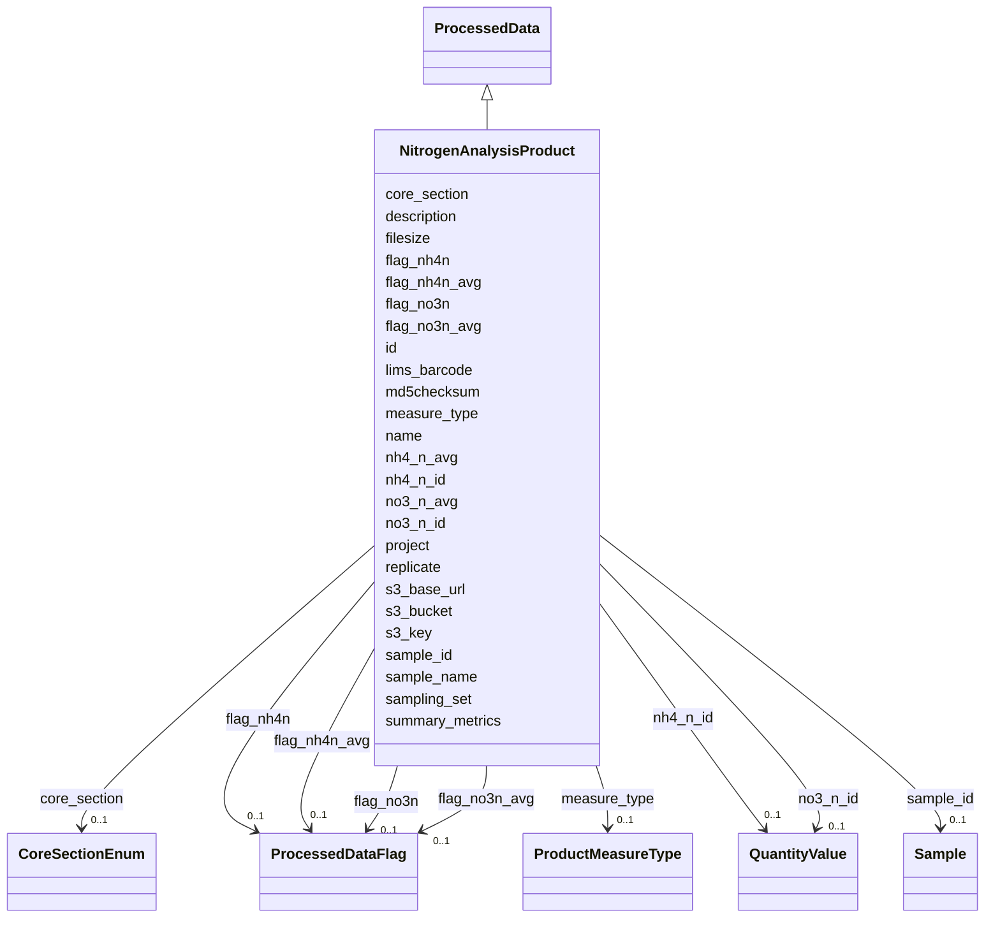

# Class: NitrogenAnalysisProduct 


_Nitrogen analysis product, typically derived via colorimetric assay of soil extracts._

_One row per sample with columns for nitrate and ammonium concentrations._

_Individual QC flags for each measurement using ProcessedDataFlag enum._


URI: [analysis_api_schema:NitrogenAnalysisProduct](https://w3id.org/MONet/analysis-api-schema/NitrogenAnalysisProduct)





## Inheritance
* [DataProduct](DataProduct.md)
    * [ProcessedData](ProcessedData.md)
        * **NitrogenAnalysisProduct**


## Slots

| Name | Cardinality and Range | Description | Inheritance |
| ---  | --- | --- | --- |
| [measure_type](measure_type.md) | 0..1 <br/> [ProductMeasureType](ProductMeasureType.md) | Whether the measurement recorded is a single measurement, one of a set of  re... | direct |
| [replicate](replicate.md) | 0..1 <br/> [Integer](Integer.md) | The replicate number of the sample or measurement, if applicable | direct |
| [no3_n_id](no3_n_id.md) | 0..1 <br/> [QuantityValue](QuantityValue.md) |  | direct |
| [no3_n_avg](no3_n_avg.md) | 0..1 <br/> [Double](Double.md) |  | direct |
| [nh4_n_id](nh4_n_id.md) | 0..1 <br/> [QuantityValue](QuantityValue.md) |  | direct |
| [nh4_n_avg](nh4_n_avg.md) | 0..1 <br/> [Double](Double.md) |  | direct |
| [flag_no3n](flag_no3n.md) | 0..1 <br/> [ProcessedDataFlag](ProcessedDataFlag.md) |  | direct |
| [flag_nh4n](flag_nh4n.md) | 0..1 <br/> [ProcessedDataFlag](ProcessedDataFlag.md) |  | direct |
| [flag_no3n_avg](flag_no3n_avg.md) | 0..1 <br/> [ProcessedDataFlag](ProcessedDataFlag.md) |  | direct |
| [flag_nh4n_avg](flag_nh4n_avg.md) | 0..1 <br/> [ProcessedDataFlag](ProcessedDataFlag.md) |  | direct |
| [summary_metrics](summary_metrics.md) | 0..1 <br/> [String](String.md) | Lightweight per-product summary for common queries that avoid full file downl... | [ProcessedData](ProcessedData.md) |
| [lims_barcode](lims_barcode.md) | 0..1 <br/> [String](String.md) | LIMS barcode identifier | [ProcessedData](ProcessedData.md) |
| [sample_id](sample_id.md) | 0..1 <br/> [Sample](Sample.md) | Link back to the originating sample | [ProcessedData](ProcessedData.md) |
| [name](name.md) | 1 <br/> [String](String.md) | Human-readable name for the entity or activity | [DataProduct](DataProduct.md) |
| [description](description.md) | 0..1 <br/> [String](String.md) | Human-readable description for the entity or activity | [DataProduct](DataProduct.md) |
| [project](project.md) | 0..1 <br/> [Integer](Integer.md) | Identifier for the user project associated with the entity or activity | [DataProduct](DataProduct.md) |
| [sampling_set](sampling_set.md) | 0..1 <br/> [Integer](Integer.md) | Sampling set number for grouping related samples collected together | [DataProduct](DataProduct.md) |
| [core_section](core_section.md) | 0..1 <br/> [CoreSectionEnum](CoreSectionEnum.md) | The section of the core | [DataProduct](DataProduct.md) |
| [sample_name](sample_name.md) | 0..1 <br/> [String](String.md) | The name or label that is present on the shipped sample | [DataProduct](DataProduct.md) |
| [s3_base_url](s3_base_url.md) | 0..1 <br/> [String](String.md) |  | [DataProduct](DataProduct.md) |
| [s3_bucket](s3_bucket.md) | 0..1 <br/> [String](String.md) |  | [DataProduct](DataProduct.md) |
| [s3_key](s3_key.md) | 1 <br/> [String](String.md) | MinIO/S3 object key; required for all data products | [DataProduct](DataProduct.md) |
| [filesize](filesize.md) | 0..1 <br/> [Integer](Integer.md) | Size of the file in bytes | [DataProduct](DataProduct.md) |
| [md5checksum](md5checksum.md) | 0..1 <br/> [String](String.md) |  | [DataProduct](DataProduct.md) |
| [id](id.md) | 1 <br/> [Uuid](Uuid.md) |  | [DataProduct](DataProduct.md) |


## Identifier and Mapping Information


### Schema Source


* from schema: https://w3id.org/MONet/analysis-api-schema


## Mappings

| Mapping Type | Mapped Value |
| ---  | ---  |
| self | analysis_api_schema:NitrogenAnalysisProduct |
| native | analysis_api_schema:NitrogenAnalysisProduct |


## LinkML Source

<!-- TODO: investigate https://stackoverflow.com/questions/37606292/how-to-create-tabbed-code-blocks-in-mkdocs-or-sphinx -->

### Direct

<details>
```yaml
name: NitrogenAnalysisProduct
description: 'Nitrogen analysis product, typically derived via colorimetric assay
  of soil extracts.

  One row per sample with columns for nitrate and ammonium concentrations.

  Individual QC flags for each measurement using ProcessedDataFlag enum.'
from_schema: https://w3id.org/MONet/analysis-api-schema
is_a: ProcessedData
slots:
- measure_type
- replicate
attributes:
  no3_n_id:
    name: no3_n_id
    from_schema: https://w3id.org/MONet/analysis-api-schema/products
    rank: 1000
    domain_of:
    - NitrogenAnalysisProduct
    range: QuantityValue
  no3_n_avg:
    name: no3_n_avg
    from_schema: https://w3id.org/MONet/analysis-api-schema/products
    rank: 1000
    domain_of:
    - NitrogenAnalysisProduct
    range: double
  nh4_n_id:
    name: nh4_n_id
    from_schema: https://w3id.org/MONet/analysis-api-schema/products
    rank: 1000
    domain_of:
    - NitrogenAnalysisProduct
    range: QuantityValue
  nh4_n_avg:
    name: nh4_n_avg
    from_schema: https://w3id.org/MONet/analysis-api-schema/products
    rank: 1000
    domain_of:
    - NitrogenAnalysisProduct
    range: double
  flag_no3n:
    name: flag_no3n
    from_schema: https://w3id.org/MONet/analysis-api-schema/products
    rank: 1000
    domain_of:
    - NitrogenAnalysisProduct
    range: ProcessedDataFlag
  flag_nh4n:
    name: flag_nh4n
    from_schema: https://w3id.org/MONet/analysis-api-schema/products
    rank: 1000
    domain_of:
    - NitrogenAnalysisProduct
    range: ProcessedDataFlag
  flag_no3n_avg:
    name: flag_no3n_avg
    from_schema: https://w3id.org/MONet/analysis-api-schema/products
    rank: 1000
    domain_of:
    - NitrogenAnalysisProduct
    range: ProcessedDataFlag
  flag_nh4n_avg:
    name: flag_nh4n_avg
    from_schema: https://w3id.org/MONet/analysis-api-schema/products
    rank: 1000
    domain_of:
    - NitrogenAnalysisProduct
    range: ProcessedDataFlag

```
</details>

### Induced

<details>
```yaml
name: NitrogenAnalysisProduct
description: 'Nitrogen analysis product, typically derived via colorimetric assay
  of soil extracts.

  One row per sample with columns for nitrate and ammonium concentrations.

  Individual QC flags for each measurement using ProcessedDataFlag enum.'
from_schema: https://w3id.org/MONet/analysis-api-schema
is_a: ProcessedData
attributes:
  no3_n_id:
    name: no3_n_id
    from_schema: https://w3id.org/MONet/analysis-api-schema/products
    rank: 1000
    alias: no3_n_id
    owner: NitrogenAnalysisProduct
    domain_of:
    - NitrogenAnalysisProduct
    range: QuantityValue
  no3_n_avg:
    name: no3_n_avg
    from_schema: https://w3id.org/MONet/analysis-api-schema/products
    rank: 1000
    alias: no3_n_avg
    owner: NitrogenAnalysisProduct
    domain_of:
    - NitrogenAnalysisProduct
    range: double
  nh4_n_id:
    name: nh4_n_id
    from_schema: https://w3id.org/MONet/analysis-api-schema/products
    rank: 1000
    alias: nh4_n_id
    owner: NitrogenAnalysisProduct
    domain_of:
    - NitrogenAnalysisProduct
    range: QuantityValue
  nh4_n_avg:
    name: nh4_n_avg
    from_schema: https://w3id.org/MONet/analysis-api-schema/products
    rank: 1000
    alias: nh4_n_avg
    owner: NitrogenAnalysisProduct
    domain_of:
    - NitrogenAnalysisProduct
    range: double
  flag_no3n:
    name: flag_no3n
    from_schema: https://w3id.org/MONet/analysis-api-schema/products
    rank: 1000
    alias: flag_no3n
    owner: NitrogenAnalysisProduct
    domain_of:
    - NitrogenAnalysisProduct
    range: ProcessedDataFlag
  flag_nh4n:
    name: flag_nh4n
    from_schema: https://w3id.org/MONet/analysis-api-schema/products
    rank: 1000
    alias: flag_nh4n
    owner: NitrogenAnalysisProduct
    domain_of:
    - NitrogenAnalysisProduct
    range: ProcessedDataFlag
  flag_no3n_avg:
    name: flag_no3n_avg
    from_schema: https://w3id.org/MONet/analysis-api-schema/products
    rank: 1000
    alias: flag_no3n_avg
    owner: NitrogenAnalysisProduct
    domain_of:
    - NitrogenAnalysisProduct
    range: ProcessedDataFlag
  flag_nh4n_avg:
    name: flag_nh4n_avg
    from_schema: https://w3id.org/MONet/analysis-api-schema/products
    rank: 1000
    alias: flag_nh4n_avg
    owner: NitrogenAnalysisProduct
    domain_of:
    - NitrogenAnalysisProduct
    range: ProcessedDataFlag
  measure_type:
    name: measure_type
    description: Whether the measurement recorded is a single measurement, one of
      a set of  replicate measurements, or an average of several replicate measurements.
    from_schema: https://w3id.org/MONet/analysis-api-schema
    rank: 1000
    alias: measure_type
    owner: NitrogenAnalysisProduct
    domain_of:
    - BulkDensityProduct
    - ElementalAnalysisProduct
    - EnzymeProduct
    - GWCMoistureProduct
    - HydraulicPropertiesProduct
    - IonsAnalysisProduct
    - MAOMProduct
    - MicrobialBiomassProduct
    - NitrogenAnalysisProduct
    - PhosphorusAnalysisProduct
    - RespirationProduct
    - TextureProduct
    - TomographyProduct
    - WEOMProduct
    - pHProduct
    - XRFElementalProduct
    - XRDPhaseProduct
    range: ProductMeasureType
  replicate:
    name: replicate
    description: The replicate number of the sample or measurement, if applicable.
    todos:
    - reconcile replicate modelling
    from_schema: https://w3id.org/MONet/analysis-api-schema
    rank: 1000
    alias: replicate
    owner: NitrogenAnalysisProduct
    domain_of:
    - MAOMProduct
    - MicrobialBiomassProduct
    - NitrogenAnalysisProduct
    - PhosphorusAnalysisProduct
    - WEOMProduct
    - ProcessedSample
    range: integer
  summary_metrics:
    name: summary_metrics
    description: "Lightweight per-product summary for common queries that avoid full\
      \ file download.\nDirection: structured key-value pairs; per-type schemas TBD:\n\
      \  ecoplate:  well-level absorbance summaries (position, timepoint, absorbance)\n\
      \  xrf:       per-element concentration results + QC flag\n  lcms:      feature\
      \ count, identification count, MSI-2 fraction\nInterim DB storage: JSONB column\
      \ retained until formal typed class exists."
    todos:
    - make this inined/multivalued?
    from_schema: https://w3id.org/MONet/analysis-api-schema
    rank: 1000
    alias: summary_metrics
    owner: NitrogenAnalysisProduct
    domain_of:
    - ProcessedData
    range: string
    required: false
  lims_barcode:
    name: lims_barcode
    description: LIMS barcode identifier
    from_schema: https://w3id.org/MONet/analysis-api-schema
    rank: 1000
    alias: lims_barcode
    owner: NitrogenAnalysisProduct
    domain_of:
    - ProcessedData
    - Sample
    range: string
    required: false
  sample_id:
    name: sample_id
    description: Link back to the originating sample
    from_schema: https://w3id.org/MONet/analysis-api-schema
    rank: 1000
    alias: sample_id
    owner: NitrogenAnalysisProduct
    domain_of:
    - ProcessedData
    - AMP2WellMetadata
    - MetagenomicsProduct
    range: Sample
    required: false
  name:
    name: name
    description: Human-readable name for the entity or activity.
    from_schema: https://w3id.org/MONet/analysis-api-schema
    rank: 1000
    alias: name
    owner: NitrogenAnalysisProduct
    domain_of:
    - Activity
    - Entity
    - DataProduct
    - DataGenerationActivity
    - Instrument
    - OntologyClass
    - ContainerAxis
    - Configuration
    - MobilePhaseSegment
    - MassSpectrometryStandardRun
    - PurchasedMaterial
    - LabProcessingActivity
    - Site
    - Sample
    - SamplingActivity
    - SoilSamplingActivity
    - biological_entity
    - Study
    - SoftwareControlledTermValue
    range: string
    required: true
  description:
    name: description
    description: Human-readable description for the entity or activity
    title: description
    from_schema: https://w3id.org/MONet/analysis-api-schema
    rank: 1000
    alias: description
    owner: NitrogenAnalysisProduct
    domain_of:
    - Activity
    - Entity
    - DataProduct
    - DataGenerationActivity
    - DataProcessingActivity
    - OntologyClass
    - ContainerType
    - LabDevice
    - Configuration
    - MassSpectrometryStandardRun
    - PurchasedMaterial
    - LabProcessingActivity
    - Site
    - Sample
    - SamplingActivity
    - SoilSamplingActivity
    - biological_entity
    - Study
    - TimestampValue
    - TextValue
    - SoftwareControlledTermValue
    - ControlledTermValue
    - QuantityValue
    range: string
  project:
    name: project
    description: 'Identifier for the user project associated with the entity or activity. '
    title: Project
    todos:
    - should this be an ID? CURIE can use the one NMDC has https://bioregistry.io/reference/emsl.project:60141
      where emsl.project is the CURIE prefix
    from_schema: https://w3id.org/MONet/analysis-api-schema
    aliases:
    - study
    - study_id
    - project_id
    - proposal
    - proposal_id
    rank: 1000
    alias: project
    owner: NitrogenAnalysisProduct
    domain_of:
    - DataProduct
    - AerosolArmSample
    - AerosolSample
    - CommerciallyPurchasedSample
    - CultureEnvironmentalSample
    - FieldDeployedTerraformSample
    - MixedCultureSample
    - MonetSoilSample
    - OtherUndescribedSample
    - PlantSample
    - PureCultureSample
    - SedimentSample
    - SoilSample
    - SynthesizedMaterialSample
    - TerraformSample
    - WaterSample
    - SamplingActivity
    range: integer
  sampling_set:
    name: sampling_set
    description: 'Sampling set number for grouping related samples collected together.

      This is a user-defined sequential integer that can be used to link samples collected

      in the same sampling event or campaign.'
    title: sampling set
    from_schema: https://w3id.org/MONet/analysis-api-schema
    rank: 1000
    alias: sampling_set
    owner: NitrogenAnalysisProduct
    domain_of:
    - DataProduct
    - MonetSoilSample
    range: integer
  core_section:
    name: core_section
    description: The section of the core.
    title: core section
    examples:
    - value: TOP
    - value: MID
    - value: BTM
    from_schema: https://w3id.org/MONet/analysis-api-schema
    rank: 1000
    alias: core_section
    owner: NitrogenAnalysisProduct
    domain_of:
    - DataProduct
    - CoreSection
    range: CoreSectionEnum
  sample_name:
    name: sample_name
    description: 'The name or label that is present on the shipped sample. This should

      be a human readable name.'
    title: sample name
    notes:
    - This is typically an alias for the inherited 'name' slot on Sample classes.
      Defined separately for compatibility with source data files using 'sample_name'
      column headers.
    from_schema: https://w3id.org/MONet/analysis-api-schema
    aliases:
    - samp_name
    rank: 1000
    alias: sample_name
    owner: NitrogenAnalysisProduct
    domain_of:
    - DataProduct
    - AerosolArmSample
    - AerosolSample
    - CommerciallyPurchasedSample
    - CultureEnvironmentalSample
    - FieldDeployedTerraformSample
    - MixedCultureSample
    - MonetSoilSample
    - OtherUndescribedSample
    - PlantSample
    - PureCultureSample
    - SedimentSample
    - SoilSample
    - SynthesizedMaterialSample
    - TerraformSample
    - WaterSample
    range: string
  s3_base_url:
    name: s3_base_url
    from_schema: https://w3id.org/MONet/analysis-api-schema
    rank: 1000
    alias: s3_base_url
    owner: NitrogenAnalysisProduct
    domain_of:
    - DataProduct
    range: string
  s3_bucket:
    name: s3_bucket
    from_schema: https://w3id.org/MONet/analysis-api-schema
    rank: 1000
    alias: s3_bucket
    owner: NitrogenAnalysisProduct
    domain_of:
    - DataProduct
    range: string
  s3_key:
    name: s3_key
    description: MinIO/S3 object key; required for all data products
    from_schema: https://w3id.org/MONet/analysis-api-schema
    rank: 1000
    alias: s3_key
    owner: NitrogenAnalysisProduct
    domain_of:
    - DataProduct
    range: string
    required: true
  filesize:
    name: filesize
    description: Size of the file in bytes
    from_schema: https://w3id.org/MONet/analysis-api-schema
    rank: 1000
    alias: filesize
    owner: NitrogenAnalysisProduct
    domain_of:
    - DataProduct
    range: integer
  md5checksum:
    name: md5checksum
    from_schema: https://w3id.org/MONet/analysis-api-schema
    rank: 1000
    alias: md5checksum
    owner: NitrogenAnalysisProduct
    domain_of:
    - DataProduct
    range: string
  id:
    name: id
    from_schema: https://w3id.org/MONet/analysis-api-schema
    identifier: true
    alias: id
    owner: NitrogenAnalysisProduct
    domain_of:
    - Activity
    - Entity
    - DataProduct
    - DataGenerationActivity
    - DataProcessingActivity
    - AlternativeIdentifier
    - FunctionalAnnotationIdentifier
    - Instrument
    - OntologyClass
    - ContainerType
    - Custodian
    - InstrumentAlternativeIdentifier
    - LabDevice
    - SampleProcessing
    - ProcessingSampleLink
    - Configuration
    - MobilePhaseSegment
    - MassSpectrometryStandardRun
    - PurchasedMaterial
    - LabProcessingActivity
    - MAOMProduct
    - WEOMProduct
    - Site
    - Sample
    - AerosolArmSample
    - AerosolSample
    - AMP2UserSample
    - CommerciallyPurchasedSample
    - CultureEnvironmentalSample
    - EngineeredStrainSample
    - FieldDeployedTerraformSample
    - MixedCultureSample
    - MonetSoilSample
    - OtherUndescribedSample
    - PlantSample
    - PureCultureSample
    - SedimentSample
    - SoilSample
    - SynthesizedMaterialSample
    - TerraformSample
    - WaterSample
    - ProcessedSample
    - CoreSection
    - SamplingActivity
    - AerosolArmSamplingActivity
    - AerosolSamplingActivity
    - CommerciallyPurchasedSamplingActivity
    - CultureEnvironmentalSamplingActivity
    - EngineeredStrainSamplingActivity
    - FieldDeployedTerraformSamplingActivity
    - MixedCultureSamplingActivity
    - MonetSoilSamplingActivity
    - OtherUndescribedSamplingActivity
    - PlantSamplingActivity
    - PureCultureSamplingActivity
    - SedimentSamplingActivity
    - SoilSamplingActivity
    - SynthesizedMaterialSamplingActivity
    - TerraformSamplingActivity
    - WaterSamplingActivity
    - biological_entity
    - Study
    - ProjectParticipant
    - TimestampValue
    - TextValue
    - SoftwareControlledTermValue
    - ControlledTermValue
    - PersonValue
    - QuantityValue
    - ConditioningValue
    - zipDownload
    range: uuid
    required: true

```
</details>