# Class: OtherUndescribedSample 


_A sample that does not fit into any of the other described sample types._


URI: [basalt_schema:OtherUndescribedSample](https://w3id.org/MONet/basalt-schema/OtherUndescribedSample)

```mermaid
 classDiagram
    class OtherUndescribedSample
    click OtherUndescribedSample href "../OtherUndescribedSample/"
      Sample <|-- OtherUndescribedSample
        click Sample href "../Sample/"
      
      OtherUndescribedSample : agrochem_addition
        
      OtherUndescribedSample : air_temp_regm
        
      OtherUndescribedSample : al_sat
        
      OtherUndescribedSample : al_sat_meth
        
      OtherUndescribedSample : alkalinity
        
      OtherUndescribedSample : alkalinity_method
        
      OtherUndescribedSample : alkyl_diethers
        
      OtherUndescribedSample : aminopept_act
        
      OtherUndescribedSample : ammonium
        
      OtherUndescribedSample : analysis_type
        
      OtherUndescribedSample : ances_data
        
      OtherUndescribedSample : antibiotic_regm
        
      OtherUndescribedSample : bac_prod
        
      OtherUndescribedSample : bac_resp
        
      OtherUndescribedSample : bacteria_carb_prod
        
      OtherUndescribedSample : biochem_oxygen_dem
        
      OtherUndescribedSample : biol_stat
        
          
    
        
        
        OtherUndescribedSample --> "0..1" BiolStatEnum : biol_stat
        click BiolStatEnum href "../BiolStatEnum/"
    

        
      OtherUndescribedSample : biotic_regm
        
      OtherUndescribedSample : biotic_relationship
        
          
    
        
        
        OtherUndescribedSample --> "0..1" BioticRelationshipEnum : biotic_relationship
        click BioticRelationshipEnum href "../BioticRelationshipEnum/"
    

        
      OtherUndescribedSample : bishomohopanol
        
      OtherUndescribedSample : bromide
        
      OtherUndescribedSample : bulk_elect_conductivity
        
      OtherUndescribedSample : calcium
        
      OtherUndescribedSample : carb_dioxide
        
      OtherUndescribedSample : carb_monoxide
        
      OtherUndescribedSample : carb_nitro_ratio
        
      OtherUndescribedSample : cas
        
      OtherUndescribedSample : chem_administration
        
      OtherUndescribedSample : chem_mutagen
        
      OtherUndescribedSample : chem_oxygen_dem
        
      OtherUndescribedSample : chloride
        
      OtherUndescribedSample : chlorophyll
        
      OtherUndescribedSample : compound_name
        
      OtherUndescribedSample : conduc
        
      OtherUndescribedSample : density
        
      OtherUndescribedSample : depth
        
      OtherUndescribedSample : description
        
      OtherUndescribedSample : diether_lipids
        
      OtherUndescribedSample : diss_carb_dioxide
        
      OtherUndescribedSample : diss_hydrogen
        
      OtherUndescribedSample : diss_inorg_carb
        
      OtherUndescribedSample : diss_inorg_nitro
        
      OtherUndescribedSample : diss_inorg_phosp
        
      OtherUndescribedSample : diss_org_carb
        
      OtherUndescribedSample : diss_org_nitro
        
      OtherUndescribedSample : diss_oxygen
        
      OtherUndescribedSample : down_par
        
      OtherUndescribedSample : efficiency_percent
        
      OtherUndescribedSample : emsl_activity
        
      OtherUndescribedSample : emulsions
        
      OtherUndescribedSample : encoded_traits
        
      OtherUndescribedSample : env_broad_scale
        
      OtherUndescribedSample : env_local_scale
        
      OtherUndescribedSample : env_medium
        
      OtherUndescribedSample : experimental_factor
        
      OtherUndescribedSample : experimental_factor_other
        
      OtherUndescribedSample : external_identifiers
        
      OtherUndescribedSample : extraction_method
        
      OtherUndescribedSample : fertilizer_regm
        
      OtherUndescribedSample : filter_method
        
      OtherUndescribedSample : fluor
        
      OtherUndescribedSample : fungicide_regm
        
      OtherUndescribedSample : gaseous_environment
        
      OtherUndescribedSample : gaseous_substances
        
      OtherUndescribedSample : genetic_mod
        
      OtherUndescribedSample : glucosidase_act
        
      OtherUndescribedSample : gravity
        
      OtherUndescribedSample : growth_habit
        
          
    
        
        
        OtherUndescribedSample --> "0..1" GrowthHabitEnum : growth_habit
        click GrowthHabitEnum href "../GrowthHabitEnum/"
    

        
      OtherUndescribedSample : growth_hormone_regm
        
      OtherUndescribedSample : growth_medium
        
      OtherUndescribedSample : heavy_metals
        
      OtherUndescribedSample : heavy_metals_meth
        
      OtherUndescribedSample : herbicide_regm
        
      OtherUndescribedSample : host_age
        
      OtherUndescribedSample : host_common_name
        
      OtherUndescribedSample : host_disease_stat
        
      OtherUndescribedSample : host_dry_mass
        
      OtherUndescribedSample : host_height
        
      OtherUndescribedSample : host_infra_spec_name
        
      OtherUndescribedSample : host_infra_spec_rank
        
      OtherUndescribedSample : host_length
        
      OtherUndescribedSample : host_life_stage
        
      OtherUndescribedSample : host_phenotype
        
      OtherUndescribedSample : host_spec_range
        
      OtherUndescribedSample : host_symbiont
        
      OtherUndescribedSample : host_taxid
        
      OtherUndescribedSample : host_tot_mass
        
      OtherUndescribedSample : host_wet_mass
        
      OtherUndescribedSample : humidity_regm
        
      OtherUndescribedSample : id
        
      OtherUndescribedSample : indust_eff_percent
        
      OtherUndescribedSample : inorg_particles
        
      OtherUndescribedSample : isol_growth_condt
        
      OtherUndescribedSample : isotope_exposure
        
      OtherUndescribedSample : item_number
        
      OtherUndescribedSample : latitude
        
      OtherUndescribedSample : light_intensity
        
      OtherUndescribedSample : light_regm
        
      OtherUndescribedSample : lims_barcode
        
      OtherUndescribedSample : link_addit_analys
        
      OtherUndescribedSample : longitude
        
      OtherUndescribedSample : magnesium
        
      OtherUndescribedSample : mean_frict_vel
        
      OtherUndescribedSample : mean_peak_frict_vel
        
      OtherUndescribedSample : mechanical_damage
        
      OtherUndescribedSample : methane
        
      OtherUndescribedSample : method_development
        
      OtherUndescribedSample : micro_biomass_C_meth
        
      OtherUndescribedSample : micro_biomass_N_meth
        
      OtherUndescribedSample : microbial_biomass
        
      OtherUndescribedSample : microbial_biomass_c
        
      OtherUndescribedSample : microbial_biomass_meth
        
      OtherUndescribedSample : microbial_biomass_n
        
      OtherUndescribedSample : mineral_nutr_regm
        
      OtherUndescribedSample : misc_param
        
      OtherUndescribedSample : n_alkanes
        
      OtherUndescribedSample : name
        
      OtherUndescribedSample : nitrate
        
      OtherUndescribedSample : nitrite
        
      OtherUndescribedSample : nitro
        
      OtherUndescribedSample : non_microb_biomass
        
      OtherUndescribedSample : non_microb_biomass_method
        
      OtherUndescribedSample : non_min_nutr_regm
        
      OtherUndescribedSample : org_carb
        
      OtherUndescribedSample : org_matter
        
      OtherUndescribedSample : org_nitro
        
      OtherUndescribedSample : org_nitro_method
        
      OtherUndescribedSample : org_particles
        
      OtherUndescribedSample : organism_count
        
      OtherUndescribedSample : other
        
      OtherUndescribedSample : other_samp_store_temp
        
      OtherUndescribedSample : other_treatment
        
      OtherUndescribedSample : oxygen
        
      OtherUndescribedSample : oxygen_relationship
        
          
    
        
        
        OtherUndescribedSample --> "0..1" OxygenStatusEnum : oxygen_relationship
        click OxygenStatusEnum href "../OxygenStatusEnum/"
    

        
      OtherUndescribedSample : part_org_carb
        
      OtherUndescribedSample : part_org_nitro
        
      OtherUndescribedSample : particle_class
        
      OtherUndescribedSample : pathogenicity
        
      OtherUndescribedSample : perturbation
        
      OtherUndescribedSample : pesticide_regm
        
      OtherUndescribedSample : petroleum_hydrocarb
        
      OtherUndescribedSample : ph
        
      OtherUndescribedSample : ph_meth
        
      OtherUndescribedSample : ph_regm
        
      OtherUndescribedSample : phaeopigments
        
      OtherUndescribedSample : phosphate
        
      OtherUndescribedSample : phosplipid_fatt_acid
        
      OtherUndescribedSample : photochemical_exposure
        
          
    
        
        
        OtherUndescribedSample --> "0..1" PhotochemicalExposureEnum : photochemical_exposure
        click PhotochemicalExposureEnum href "../PhotochemicalExposureEnum/"
    

        
      OtherUndescribedSample : photon_flux
        
      OtherUndescribedSample : porosity
        
      OtherUndescribedSample : potassium
        
      OtherUndescribedSample : pre_treatment
        
      OtherUndescribedSample : pressure
        
      OtherUndescribedSample : pressure_control
        
      OtherUndescribedSample : primary_prod
        
      OtherUndescribedSample : primary_treatment
        
      OtherUndescribedSample : priority_order
        
      OtherUndescribedSample : production_method
        
      OtherUndescribedSample : project
        
      OtherUndescribedSample : propagation
        
      OtherUndescribedSample : radiation_regm
        
      OtherUndescribedSample : rainfall_regm
        
      OtherUndescribedSample : reactor_type
        
      OtherUndescribedSample : redox_potential
        
      OtherUndescribedSample : ref_biomaterial
        
      OtherUndescribedSample : replicate_number
        
      OtherUndescribedSample : salinity
        
      OtherUndescribedSample : salinity_method
        
      OtherUndescribedSample : salt_regm
        
      OtherUndescribedSample : samp_capt_status
        
      OtherUndescribedSample : samp_dis_stage
        
      OtherUndescribedSample : samp_store_temp
        
          
    
        
        
        OtherUndescribedSample --> "0..1" SampleStoreTempEnum : samp_store_temp
        click SampleStoreTempEnum href "../SampleStoreTempEnum/"
    

        
      OtherUndescribedSample : sample_link
        
      OtherUndescribedSample : sample_name
        
      OtherUndescribedSample : sample_processing
        
      OtherUndescribedSample : sample_type
        
      OtherUndescribedSample : sampled_during
        
          
    
        
        
        OtherUndescribedSample --> "0..1" SamplingActivity : sampled_during
        click SamplingActivity href "../SamplingActivity/"
    

        
      OtherUndescribedSample : season_environment
        
      OtherUndescribedSample : secondary_treatment
        
      OtherUndescribedSample : sewage_type
        
      OtherUndescribedSample : sieving
        
      OtherUndescribedSample : silicate
        
      OtherUndescribedSample : size_frac_low
        
      OtherUndescribedSample : size_frac_up
        
      OtherUndescribedSample : sludge_retent_time
        
      OtherUndescribedSample : sodium
        
      OtherUndescribedSample : solar_irradiance
        
      OtherUndescribedSample : soluble_inorg_mat
        
      OtherUndescribedSample : soluble_org_mat
        
      OtherUndescribedSample : soluble_react_phosp
        
      OtherUndescribedSample : source_mat_id
        
      OtherUndescribedSample : standing_water_regm
        
      OtherUndescribedSample : start_date_inc
        
      OtherUndescribedSample : storage_condition
        
          
    
        
        
        OtherUndescribedSample --> "0..1" StorageConditionEnum : storage_condition
        click StorageConditionEnum href "../StorageConditionEnum/"
    

        
      OtherUndescribedSample : storage_condition_other
        
      OtherUndescribedSample : subspecf_gen_lin
        
      OtherUndescribedSample : sulfate
        
      OtherUndescribedSample : sulfide
        
      OtherUndescribedSample : suspend_part_matter
        
      OtherUndescribedSample : suspend_solids
        
      OtherUndescribedSample : synth_instrument
        
      OtherUndescribedSample : synth_process
        
      OtherUndescribedSample : synth_reagents
        
      OtherUndescribedSample : technical_reps
        
      OtherUndescribedSample : temp
        
      OtherUndescribedSample : temperature_exposure
        
      OtherUndescribedSample : tertiary_treatment
        
      OtherUndescribedSample : tidal_stage
        
          
    
        
        
        OtherUndescribedSample --> "0..1" TidalStageEnum : tidal_stage
        click TidalStageEnum href "../TidalStageEnum/"
    

        
      OtherUndescribedSample : tiss_cult_growth_med
        
      OtherUndescribedSample : tot_carb
        
      OtherUndescribedSample : tot_depth_water_col
        
      OtherUndescribedSample : tot_diss_nitro
        
      OtherUndescribedSample : tot_inorg_nitro
        
      OtherUndescribedSample : tot_nitro
        
      OtherUndescribedSample : tot_nitro_cont_meth
        
      OtherUndescribedSample : tot_nitro_content
        
      OtherUndescribedSample : tot_org_c_meth
        
      OtherUndescribedSample : tot_org_carb
        
      OtherUndescribedSample : tot_part_carb
        
      OtherUndescribedSample : tot_phosp
        
      OtherUndescribedSample : tot_phosphate
        
      OtherUndescribedSample : trophic_level
        
          
    
        
        
        OtherUndescribedSample --> "0..1" TrophicLevelEnum : trophic_level
        click TrophicLevelEnum href "../TrophicLevelEnum/"
    

        
      OtherUndescribedSample : turbidity
        
      OtherUndescribedSample : volatile_org_comp
        
      OtherUndescribedSample : wastewater_type
        
      OtherUndescribedSample : water_content
        
      OtherUndescribedSample : water_current
        
      OtherUndescribedSample : water_temp_regm
        
      OtherUndescribedSample : watering_regm
        
      
```





## Inheritance
* [Sample](Sample.md)
    * **OtherUndescribedSample**


## Slots

| Name | Cardinality and Range | Description | Inheritance |
| ---  | --- | --- | --- |
| [agrochem_addition](agrochem_addition.md) | 0..1 <br/> [String](String.md) | Addition of fertilizers, pesticides, etc | direct |
| [air_temp_regm](air_temp_regm.md) | 0..1 <br/> [String](String.md) | Information about treatment involving an exposure to varying temperatures; sh... | direct |
| [al_sat](al_sat.md) | 0..1 <br/> [String](String.md) | Aluminum saturation (esp | direct |
| [al_sat_meth](al_sat_meth.md) | 0..1 <br/> [String](String.md) | Reference or method used in determining Al saturation | direct |
| [alkalinity](alkalinity.md) | 0..1 <br/> [String](String.md) | The ability of a solution to neutralize acids to the equivalence point of car... | direct |
| [alkalinity_method](alkalinity_method.md) | 0..1 <br/> [String](String.md) | Method used for alkalinity measurement | direct |
| [alkyl_diethers](alkyl_diethers.md) | 0..1 <br/> [String](String.md) | Concentration of alkyl diethers | direct |
| [aminopept_act](aminopept_act.md) | 0..1 <br/> [String](String.md) | Measurement of aminopeptidase activity (Unit: mol/L/h) | direct |
| [ammonium](ammonium.md) | 0..1 <br/> [String](String.md) | Concentration of ammonium in the sample | direct |
| [analysis_type](analysis_type.md) | 1 <br/> [String](String.md) | The type(s) of analysis planned for this sample | direct |
| [ances_data](ances_data.md) | 0..1 <br/> [String](String.md) | Information about either pedigree or other ancestral information description | direct |
| [antibiotic_regm](antibiotic_regm.md) | 0..1 <br/> [String](String.md) | Information about treatment involving antibiotic administration; should inclu... | direct |
| [bac_prod](bac_prod.md) | 0..1 <br/> [String](String.md) | Bacterial production in the water column measured by isotope uptake | direct |
| [bac_resp](bac_resp.md) | 0..1 <br/> [String](String.md) | Measurement of bacterial respiration in the water column | direct |
| [bacteria_carb_prod](bacteria_carb_prod.md) | 0..1 <br/> [String](String.md) | Measurement of bacterial carbon production | direct |
| [biochem_oxygen_dem](biochem_oxygen_dem.md) | 0..1 <br/> [String](String.md) | a measure of the relative oxygen-depletion effect of a waste contaminant | direct |
| [biol_stat](biol_stat.md) | 0..1 <br/> [BiolStatEnum](BiolStatEnum.md) | The level of genome modification | direct |
| [biotic_regm](biotic_regm.md) | 0..1 <br/> [String](String.md) | Information about treatment(s) involving use of biotic factors such as bacter... | direct |
| [bishomohopanol](bishomohopanol.md) | 0..1 <br/> [String](String.md) | Concentration of bishomohopanol | direct |
| [bromide](bromide.md) | 0..1 <br/> [String](String.md) | Concentration of bromide (Unit: ppm) | direct |
| [bulk_elect_conductivity](bulk_elect_conductivity.md) | 0..1 <br/> [String](String.md) | Electrical conductivity is a measure of the bulk soil ability to carry electr... | direct |
| [calcium](calcium.md) | 0..1 <br/> [String](String.md) | Concentration of calcium in the sample (Unit: mg/L or umol/L or ppm) | direct |
| [carb_dioxide](carb_dioxide.md) | 0..1 <br/> [String](String.md) | Amount of carbon dioxide measured in the air the day of sampling | direct |
| [carb_monoxide](carb_monoxide.md) | 0..1 <br/> [String](String.md) | Amount of carbon monoxide measured in the air the day of sampling | direct |
| [carb_nitro_ratio](carb_nitro_ratio.md) | 0..1 <br/> [String](String.md) | Ratio of amount or concentrations of carbon to nitrogen | direct |
| [cas](cas.md) | 0..1 <br/> [String](String.md) | A unique numerical identifier assigned by the Chemical Abstract Service (CAS)... | direct |
| [chem_administration](chem_administration.md) | 0..1 <br/> [String](String.md) | List of chemical compounds administered to the host or site where sampling oc... | direct |
| [chem_mutagen](chem_mutagen.md) | 0..1 <br/> [String](String.md) | Treatment involving use of mutagens; should include the name of mutagen, amou... | direct |
| [chem_oxygen_dem](chem_oxygen_dem.md) | 0..1 <br/> [String](String.md) | a measure of the relative oxygen-depletion effect of a waste contaminant | direct |
| [chloride](chloride.md) | 0..1 <br/> [String](String.md) | Concentration of chloride in the sample (Unit: mg/L or ppm) | direct |
| [chlorophyll](chlorophyll.md) | 0..1 <br/> [String](String.md) | Concentration of chlorophyll (Unit: mg/m3 or ug/L) | direct |
| [compound_name](compound_name.md) | 0..1 <br/> [String](String.md) | The name of the purchased material | direct |
| [conduc](conduc.md) | 0..1 <br/> [String](String.md) | Electrical conductivity of water | direct |
| [density](density.md) | 0..1 <br/> [String](String.md) | Density of the sample, which is its mass per unit volume (aka volumetric mass... | direct |
| [depth](depth.md) | 0..1 <br/> [String](String.md) | The vertical distance below local surface | direct |
| [diether_lipids](diether_lipids.md) | 0..1 <br/> [String](String.md) | Concentration of diether lipids; can include multiple types of diether lipids... | direct |
| [diss_carb_dioxide](diss_carb_dioxide.md) | 0..1 <br/> [String](String.md) | Concentration of dissolved carbon dioxide in the sample or liquid portion of ... | direct |
| [diss_hydrogen](diss_hydrogen.md) | 0..1 <br/> [String](String.md) | Concentration of dissolved hydrogens (Unit: umol/L) | direct |
| [diss_inorg_carb](diss_inorg_carb.md) | 0..1 <br/> [String](String.md) | Dissolved inorganic carbon concentration in the sample, typically measured af... | direct |
| [diss_inorg_nitro](diss_inorg_nitro.md) | 0..1 <br/> [String](String.md) | Concentration of dissolved inorganic nitrogen | direct |
| [diss_inorg_phosp](diss_inorg_phosp.md) | 0..1 <br/> [String](String.md) | Concentration of dissolved inorganic phosphorus in the sample | direct |
| [diss_org_carb](diss_org_carb.md) | 0..1 <br/> [String](String.md) | Concentration of dissolved organic carbon in the sample, liquid portion of th... | direct |
| [diss_org_nitro](diss_org_nitro.md) | 0..1 <br/> [String](String.md) | Dissolved organic nitrogen concentration measured as: total dissolved nitroge... | direct |
| [diss_oxygen](diss_oxygen.md) | 0..1 <br/> [String](String.md) | Concentration of dissolved oxygen | direct |
| [down_par](down_par.md) | 0..1 <br/> [String](String.md) | Visible waveband radiance and irradiance measurements in the water column | direct |
| [efficiency_percent](efficiency_percent.md) | 0..1 <br/> [String](String.md) | percentage of volatile solids removed from the anaerobic digestor | direct |
| [emulsions](emulsions.md) | 0..1 <br/> [String](String.md) | amount or concentration of substances such as paints, adhesives, mayonnaise, ... | direct |
| [encoded_traits](encoded_traits.md) | 0..1 <br/> [String](String.md) | Should include key traits like antibiotic resistance or xenobiotic | direct |
| [env_broad_scale](env_broad_scale.md) | 0..1 <br/> [String](String.md) | 'Report the major environmental system the sample or specimen came from | direct |
| [env_local_scale](env_local_scale.md) | 0..1 <br/> [String](String.md) | 'Report the entity which are in your sample or specimens local vicinity and w... | direct |
| [env_medium](env_medium.md) | 0..1 <br/> [String](String.md) | 'Report the environmental material immediately surrounding the sample or spec... | direct |
| [experimental_factor](experimental_factor.md) | 0..1 <br/> [String](String.md) | Experimental factors are essentially the variable aspects of an experiment de... | direct |
| [experimental_factor_other](experimental_factor_other.md) | 0..1 <br/> [String](String.md) | Other details about your sample that you feel can't be accurately represented... | direct |
| [extraction_method](extraction_method.md) | 0..1 <br/> [String](String.md) | If you (the user) performed an extraction preparation or processing before se... | direct |
| [external_identifiers](external_identifiers.md) | * <br/> [Uriorcurie](Uriorcurie.md) | List of external identifiers associated with this entity or activity | direct |
| [fertilizer_regm](fertilizer_regm.md) | 0..1 <br/> [String](String.md) | Information about treatment involving the use of fertilizers; should include ... | direct |
| [filter_method](filter_method.md) | 0..1 <br/> [String](String.md) | Type of filter used or how the sample was filtered | direct |
| [fluor](fluor.md) | 0..1 <br/> [String](String.md) | Raw or converted fluorescence of water | direct |
| [fungicide_regm](fungicide_regm.md) | 0..1 <br/> [String](String.md) | Information about treatment involving use of fungicides; should include the n... | direct |
| [gaseous_environment](gaseous_environment.md) | 0..1 <br/> [String](String.md) | Use of conditions with differing gaseous environments; should include the nam... | direct |
| [gaseous_substances](gaseous_substances.md) | 0..1 <br/> [String](String.md) | amount or concentration of substances such as hydrogen sulfide carbon dioxide... | direct |
| [genetic_mod](genetic_mod.md) | 0..1 <br/> [String](String.md) | Genetic modifications of the genome of an organism, which may occur naturally... | direct |
| [glucosidase_act](glucosidase_act.md) | 0..1 <br/> [String](String.md) | Measurement of glucosidase activity (Unit: mol/L/h) | direct |
| [gravity](gravity.md) | 0..1 <br/> [String](String.md) | Information about treatment involving use of gravity factor to study various ... | direct |
| [growth_habit](growth_habit.md) | 0..1 <br/> [GrowthHabitEnum](GrowthHabitEnum.md) | Characteristic shape appearance or growth form of a plant species | direct |
| [growth_hormone_regm](growth_hormone_regm.md) | 0..1 <br/> [String](String.md) | Information about treatment involving use of growth hormones; should include ... | direct |
| [growth_medium](growth_medium.md) | 0..1 <br/> [String](String.md) | Method of growth and medium/materials used | direct |
| [heavy_metals](heavy_metals.md) | 0..1 <br/> [String](String.md) | Heavy metals present and concentrations; can include multiple heavy metals an... | direct |
| [heavy_metals_meth](heavy_metals_meth.md) | 0..1 <br/> [String](String.md) | Reference or method used in determining heavy metals | direct |
| [herbicide_regm](herbicide_regm.md) | 0..1 <br/> [String](String.md) | Information about treatment involving use of herbicides; information about tr... | direct |
| [host_age](host_age.md) | 0..1 <br/> [String](String.md) | Age of host at the time of sampling; relevant scale depends on species and st... | direct |
| [host_common_name](host_common_name.md) | 0..1 <br/> [String](String.md) | Common name for the host organism (e | direct |
| [host_disease_stat](host_disease_stat.md) | 0..1 <br/> [String](String.md) | List of diseases with which the host has been diagnosed; can include multiple... | direct |
| [host_dry_mass](host_dry_mass.md) | 0..1 <br/> [String](String.md) | Measurement of dry mass | direct |
| [host_height](host_height.md) | 0..1 <br/> [String](String.md) | The height of subject | direct |
| [host_infra_spec_name](host_infra_spec_name.md) | 0..1 <br/> [String](String.md) | Taxonomic information about the host below subspecies level | direct |
| [host_infra_spec_rank](host_infra_spec_rank.md) | 0..1 <br/> [String](String.md) | Taxonomic rank information about the host below subspecies level, such as var... | direct |
| [host_length](host_length.md) | 0..1 <br/> [String](String.md) | The length of subject | direct |
| [host_life_stage](host_life_stage.md) | 0..1 <br/> [String](String.md) | Description of life stage of host | direct |
| [host_phenotype](host_phenotype.md) | 0..1 <br/> [String](String.md) | Phenotype of human or other host | direct |
| [host_spec_range](host_spec_range.md) | 0..1 <br/> [String](String.md) | The range and diversity of host species that an organism is capable of infect... | direct |
| [host_symbiont](host_symbiont.md) | 0..1 <br/> [String](String.md) | The taxonomic name of the organism(s) found living in mutualistic, commensali... | direct |
| [host_taxid](host_taxid.md) | 0..1 <br/> [String](String.md) | NCBI taxon ID | direct |
| [host_tot_mass](host_tot_mass.md) | 0..1 <br/> [String](String.md) | Total mass of the host at collection | direct |
| [host_wet_mass](host_wet_mass.md) | 0..1 <br/> [String](String.md) | Measurement of wet mass | direct |
| [humidity_regm](humidity_regm.md) | 0..1 <br/> [String](String.md) | Information about treatment involving an exposure to varying degrees of humid... | direct |
| [indust_eff_percent](indust_eff_percent.md) | 0..1 <br/> [String](String.md) | percentage of industrial effluents received by wastewater treatment plant | direct |
| [inorg_particles](inorg_particles.md) | 0..1 <br/> [String](String.md) | concentration of particles such as sand, grit, metal particles, ceramics, etc | direct |
| [isol_growth_condt](isol_growth_condt.md) | 0..1 <br/> [String](String.md) | Publication reference in the form of pubmed ID (PMID), digital object | direct |
| [isotope_exposure](isotope_exposure.md) | 0..1 <br/> [String](String.md) | List isotope exposure or addition applied to your sample | direct |
| [item_number](item_number.md) | 0..1 <br/> [String](String.md) | The item number of the purchased material | direct |
| [latitude](latitude.md) | 1 <br/> [Double](Double.md) | Latitude coordinate of the sampling site in WSG 84 format | direct |
| [longitude](longitude.md) | 1 <br/> [Double](Double.md) | Longitude coordinate of the sampling site in WSG 84 format | direct |
| [light_intensity](light_intensity.md) | 0..1 <br/> [String](String.md) | Measurement of light intensity | direct |
| [light_regm](light_regm.md) | 0..1 <br/> [String](String.md) | Information about treatment(s) involving exposure to light including both lig... | direct |
| [link_addit_analys](link_addit_analys.md) | 0..1 <br/> [String](String.md) | Link to additional analysis results performed on the sample | direct |
| [magnesium](magnesium.md) | 0..1 <br/> [String](String.md) | Concentration of magnesium in the sample (Unit: umol/kg or mol/L or mg/L or p... | direct |
| [mean_frict_vel](mean_frict_vel.md) | 0..1 <br/> [String](String.md) | Measurement of mean friction velocity (Unit: m/s) | direct |
| [mean_peak_frict_vel](mean_peak_frict_vel.md) | 0..1 <br/> [String](String.md) | Measurement of mean peak friction velocity (Unit: m/s) | direct |
| [mechanical_damage](mechanical_damage.md) | 0..1 <br/> [String](String.md) | Information about any mechanical damage exerted on the plant; can include mul... | direct |
| [method_development](method_development.md) | 0..1 <br/> [String](String.md) | If your samples are TEST sample ONLY, please provide information on what you'... | direct |
| [methane](methane.md) | 0..1 <br/> [String](String.md) | Methane (gas) amount or concentration at the time of sampling | direct |
| [micro_biomass_C_meth](micro_biomass_C_meth.md) | 0..1 <br/> [String](String.md) | Reference or method used in determining microbial biomass | direct |
| [micro_biomass_N_meth](micro_biomass_N_meth.md) | 0..1 <br/> [String](String.md) | Reference or method used in determining microbial biomass nitrogen | direct |
| [microbial_biomass](microbial_biomass.md) | 0..1 <br/> [String](String.md) | The part of the organic matter in the soil that constitutes living microorgan... | direct |
| [microbial_biomass_c](microbial_biomass_c.md) | 0..1 <br/> [String](String.md) | The part of the organic matter in the soil that constitutes living microorgan... | direct |
| [microbial_biomass_n](microbial_biomass_n.md) | 0..1 <br/> [String](String.md) | The part of the organic matter in the soil that constitutes living microorgan... | direct |
| [microbial_biomass_meth](microbial_biomass_meth.md) | 0..1 <br/> [String](String.md) | Reference or method used in determining microbial biomass | direct |
| [mineral_nutr_regm](mineral_nutr_regm.md) | 0..1 <br/> [String](String.md) | Information about treatment involving the use of mineral supplements; should ... | direct |
| [misc_param](misc_param.md) | 0..1 <br/> [String](String.md) | Any other measurement performed or parameter collected that is not listed her... | direct |
| [n_alkanes](n_alkanes.md) | 0..1 <br/> [String](String.md) | Concentration of n-alkanes; can include multiple n-alkanes (Unit: ug/mL) | direct |
| [nitrate](nitrate.md) | 0..1 <br/> [String](String.md) | Concentration of nitrate in the sample (Unit: umol/L or mg/L or ppm) | direct |
| [nitrite](nitrite.md) | 0..1 <br/> [String](String.md) | Concentration of nitrite in the sample (Unit: umol/L or mg/L or ppm) | direct |
| [nitro](nitro.md) | 0..1 <br/> [String](String.md) | Concentration of nitrogen (total) (Unit: umol/L) | direct |
| [non_microb_biomass](non_microb_biomass.md) | 0..1 <br/> [String](String.md) | Amount of biomass; should include the name for the part of biomass measured, ... | direct |
| [non_microb_biomass_method](non_microb_biomass_method.md) | 0..1 <br/> [String](String.md) | Reference or method used in determining biomass | direct |
| [non_min_nutr_regm](non_min_nutr_regm.md) | 0..1 <br/> [String](String.md) | Information about treatment involving the exposure of plant to non-mineral nu... | direct |
| [org_carb](org_carb.md) | 0..1 <br/> [String](String.md) | Concentration of organic carbon | direct |
| [org_matter](org_matter.md) | 0..1 <br/> [String](String.md) | Concentration of organic matter (Unit: mg/L) | direct |
| [org_nitro](org_nitro.md) | 0..1 <br/> [String](String.md) | Concentration of organic nitrogen | direct |
| [org_nitro_method](org_nitro_method.md) | 0..1 <br/> [String](String.md) | Method used for obtaining organic nitrogen | direct |
| [org_particles](org_particles.md) | 0..1 <br/> [String](String.md) | concentration of particles such as faeces, hairs, food, vomit, paper, fibers,... | direct |
| [organism_count](organism_count.md) | 0..1 <br/> [String](String.md) | Total cell count of any organism (or group of organisms) per gram volume or a... | direct |
| [other](other.md) | 0..1 <br/> [String](String.md) | Other/additional details about your sample that you feel can't be accurately ... | direct |
| [other_samp_store_temp](other_samp_store_temp.md) | 0..1 <br/> [String](String.md) | Please specify sample storage temperature if you selected 'other' | direct |
| [other_treatment](other_treatment.md) | 0..1 <br/> [String](String.md) | Many sample treatment descriptor columns are available | direct |
| [oxygen](oxygen.md) | 0..1 <br/> [String](String.md) | Amount of oxygen measured in the air the day of sampling | direct |
| [oxygen_relationship](oxygen_relationship.md) | 0..1 <br/> [OxygenStatusEnum](OxygenStatusEnum.md) | The relationship of the sample to oxygen, such as aerobic or anaerobic | direct |
| [part_org_carb](part_org_carb.md) | 0..1 <br/> [String](String.md) | Concentration of particulate organic carbon | direct |
| [part_org_nitro](part_org_nitro.md) | 0..1 <br/> [String](String.md) | Concentration of particulate organic nitrogen | direct |
| [particle_class](particle_class.md) | 0..1 <br/> [String](String.md) | Particles are classified based on their size into six general categories: cla... | direct |
| [pathogenicity](pathogenicity.md) | 0..1 <br/> [String](String.md) | To what is the entity pathogenic, e | direct |
| [perturbation](perturbation.md) | 0..1 <br/> [String](String.md) | Type of perturbation, e | direct |
| [pesticide_regm](pesticide_regm.md) | 0..1 <br/> [String](String.md) | Information about treatment involving use of insecticides; should include the... | direct |
| [petroleum_hydrocarb](petroleum_hydrocarb.md) | 0..1 <br/> [String](String.md) | Concentration of petroleum hydrocarbon (Unit: umol/L) | direct |
| [ph](ph.md) | 0..1 <br/> [Float](Float.md) | pH measurement of the sample or liquid portion of sample or aqueous phase of ... | direct |
| [ph_meth](ph_meth.md) | 0..1 <br/> [String](String.md) | Reference or method used in determining ph of the sample | direct |
| [ph_regm](ph_regm.md) | 0..1 <br/> [String](String.md) | Information about treatment involving exposure of plants to varying levels of... | direct |
| [phaeopigments](phaeopigments.md) | 0..1 <br/> [String](String.md) | Concentration of phaeopigments; can include multiple phaeopigments separated ... | direct |
| [phosphate](phosphate.md) | 0..1 <br/> [String](String.md) | Concentration of phosphate (Unit: umol/L) | direct |
| [phosplipid_fatt_acid](phosplipid_fatt_acid.md) | 0..1 <br/> [String](String.md) | Concentration of phospholipid fatty acids; can include multiple values separa... | direct |
| [photochemical_exposure](photochemical_exposure.md) | 0..1 <br/> [PhotochemicalExposureEnum](PhotochemicalExposureEnum.md) | This term is used to describe a chemical reaction caused by absorption of ult... | direct |
| [photon_flux](photon_flux.md) | 0..1 <br/> [String](String.md) | Measurement of photon flux | direct |
| [porosity](porosity.md) | 0..1 <br/> [String](String.md) | Porosity of deposited sediment is volume of voids divided by the total volume... | direct |
| [potassium](potassium.md) | 0..1 <br/> [String](String.md) | Concentration of potassium in the sample (Unit: mg/L) | direct |
| [pre_treatment](pre_treatment.md) | 0..1 <br/> [String](String.md) | the process of pre-treatment removes materials that can be easily collected f... | direct |
| [pressure](pressure.md) | 0..1 <br/> [String](String.md) | Pressure to which the sample is subject, in atmospheres (Unit: atm) | direct |
| [pressure_control](pressure_control.md) | 0..1 <br/> [String](String.md) | Measurment of pressure applied to the sample during experimentation (Unit: Pa... | direct |
| [primary_prod](primary_prod.md) | 0..1 <br/> [String](String.md) | Measurement of primary production generally measured as isotope uptake | direct |
| [primary_treatment](primary_treatment.md) | 0..1 <br/> [String](String.md) | the process to produce both a generally homogeneous liquid capable of being t... | direct |
| [priority_order](priority_order.md) | 0..1 <br/> [Float](Float.md) | Indicate the run order priority of your samples | direct |
| [production_method](production_method.md) | 0..1 <br/> [String](String.md) | A DOI or description of how the compound was produced, if the commercially pu... | direct |
| [project](project.md) | 0..1 <br/> [Integer](Integer.md) | Identifier for the user project associated with the entity or activity | direct |
| [propagation](propagation.md) | 0..1 <br/> [String](String.md) | The type of reproduction from the parent stock | direct |
| [radiation_regm](radiation_regm.md) | 0..1 <br/> [String](String.md) | Information about treatment involving exposure of plant or a plant part to a ... | direct |
| [rainfall_regm](rainfall_regm.md) | 0..1 <br/> [String](String.md) | Information about treatment involving an exposure to a given amount of rainfa... | direct |
| [reactor_type](reactor_type.md) | 0..1 <br/> [String](String.md) | anaerobic digesters can be designed and engineered to operate using a number ... | direct |
| [redox_potential](redox_potential.md) | 0..1 <br/> [String](String.md) | Redox potential measured relative to a hydrogen cell indicating oxidation or ... | direct |
| [ref_biomaterial](ref_biomaterial.md) | 0..1 <br/> [String](String.md) | Primary publication if isolated before genome publication; otherwise primary ... | direct |
| [replicate_number](replicate_number.md) | 0..1 <br/> [Integer](Integer.md) | The replicate number of the sample, if applicable | direct |
| [salinity](salinity.md) | 0..1 <br/> [String](String.md) | Salinity is the total concentration of all dissolved salts in a sample | direct |
| [salinity_method](salinity_method.md) | 0..1 <br/> [String](String.md) | Method used to determine sample salinity | direct |
| [salt_regm](salt_regm.md) | 0..1 <br/> [String](String.md) | Information about treatment involving use of salts as supplement to liquid an... | direct |
| [biotic_relationship](biotic_relationship.md) | 0..1 <br/> [BioticRelationshipEnum](BioticRelationshipEnum.md) | Description of relationship(s) between the subject organism and other organis... | direct |
| [samp_capt_status](samp_capt_status.md) | 0..1 <br/> [String](String.md) | Reason for the sample | direct |
| [samp_dis_stage](samp_dis_stage.md) | 0..1 <br/> [String](String.md) | Stage of the disease at the time of sample collection e | direct |
| [samp_store_temp](samp_store_temp.md) | 0..1 <br/> [SampleStoreTempEnum](SampleStoreTempEnum.md) | The temperature at which your samples should be stored upon arrival | direct |
| [sample_link](sample_link.md) | 0..1 <br/> [String](String.md) | 'A unique identifier to assign parent-child subsample or sibling samples | direct |
| [sample_name](sample_name.md) | 0..1 <br/> [String](String.md) | The name or label that is present on the shipped sample | direct |
| [sample_processing](sample_processing.md) | 0..1 <br/> [String](String.md) | A brief description of any processing applied to the sample during or after r... | direct |
| [sample_type](sample_type.md) | 1 <br/> [String](String.md) | Requires a standardized ontology term to describe what your sample is | direct |
| [sampled_during](sampled_during.md) | 0..1 <br/> [SamplingActivity](SamplingActivity.md) | Reference to the sampling activity during which this sample was collected | direct |
| [season_environment](season_environment.md) | 0..1 <br/> [String](String.md) | Treatment involving an exposure to a particular season (e | direct |
| [secondary_treatment](secondary_treatment.md) | 0..1 <br/> [String](String.md) | the process for substantially degrading the biological content of the sewage | direct |
| [sewage_type](sewage_type.md) | 0..1 <br/> [String](String.md) | type of wastewater treatment plant as municipial or industrial | direct |
| [sieving](sieving.md) | 0..1 <br/> [String](String.md) | Collection design of pooled samples and/or sieve size and amount of sample si... | direct |
| [silicate](silicate.md) | 0..1 <br/> [String](String.md) | Concentration of silicate (Unit: umol/L) | direct |
| [size_frac_low](size_frac_low.md) | 0..1 <br/> [String](String.md) | Refers to the mesh/pore size used to pre-filter/pre-sort the sample | direct |
| [size_frac_up](size_frac_up.md) | 0..1 <br/> [String](String.md) | Refers to the mesh/pore size used to retain the sample | direct |
| [sludge_retent_time](sludge_retent_time.md) | 0..1 <br/> [String](String.md) | the time activated sludge remains in reactor | direct |
| [sodium](sodium.md) | 0..1 <br/> [String](String.md) | Sodium concentration in the sample (Unit: ug/mL) | direct |
| [solar_irradiance](solar_irradiance.md) | 0..1 <br/> [String](String.md) | Solar irradiance is the power per unit area (surface power density) received ... | direct |
| [soluble_inorg_mat](soluble_inorg_mat.md) | 0..1 <br/> [String](String.md) | concentration of substances such as ammonia, road-salt, sea-salt, cyanide, hy... | direct |
| [soluble_org_mat](soluble_org_mat.md) | 0..1 <br/> [String](String.md) | concentration of substances such as urea, fruit sugars, soluble proteins, dru... | direct |
| [soluble_react_phosp](soluble_react_phosp.md) | 0..1 <br/> [String](String.md) | Concentration of soluble reactive phosphorus | direct |
| [source_mat_id](source_mat_id.md) | 0..1 <br/> [String](String.md) | A unique identifier assigned to an original material sample collected or to a... | direct |
| [standing_water_regm](standing_water_regm.md) | 0..1 <br/> [String](String.md) | Treatment involving an exposure to standing water during a plant's life span;... | direct |
| [start_date_inc](start_date_inc.md) | 0..1 <br/> [String](String.md) | Date the incubation was started | direct |
| [storage_condition](storage_condition.md) | 0..1 <br/> [StorageConditionEnum](StorageConditionEnum.md) | The storage condition of the sample | direct |
| [storage_condition_other](storage_condition_other.md) | 0..1 <br/> [String](String.md) | Free-text field for storage conditions when 'storage_condition' is 'other' | direct |
| [subspecf_gen_lin](subspecf_gen_lin.md) | 0..1 <br/> [String](String.md) | Information about the genetic distinctness of the sequenced organism below th... | direct |
| [sulfate](sulfate.md) | 0..1 <br/> [String](String.md) | Concentration of sulfate in the sample | direct |
| [sulfide](sulfide.md) | 0..1 <br/> [String](String.md) | Concentration of sulfide in the sample | direct |
| [suspend_part_matter](suspend_part_matter.md) | 0..1 <br/> [String](String.md) | Concentration of suspended particulate matter | direct |
| [suspend_solids](suspend_solids.md) | 0..1 <br/> [String](String.md) | concentration of substances including a wide variety of material such as silt... | direct |
| [synth_instrument](synth_instrument.md) | 0..1 <br/> [String](String.md) | The instrumentation used to synthesize the material sample | direct |
| [synth_process](synth_process.md) | 0..1 <br/> [String](String.md) | Provide the citation or describe the method of synthesis | direct |
| [synth_reagents](synth_reagents.md) | 0..1 <br/> [String](String.md) | The reagents used in the material synthesis | direct |
| [technical_reps](technical_reps.md) | 0..1 <br/> [Integer](Integer.md) | Number of technical replicates for the sample | direct |
| [temp](temp.md) | 0..1 <br/> [String](String.md) | Temperature of the sample at the time of sampling | direct |
| [temperature_exposure](temperature_exposure.md) | 0..1 <br/> [String](String.md) | The range of temperatures at which it is safe to store a label that has been ... | direct |
| [tertiary_treatment](tertiary_treatment.md) | 0..1 <br/> [String](String.md) | the process providing a final treatment stage to raise the effluent quality b... | direct |
| [tidal_stage](tidal_stage.md) | 0..1 <br/> [TidalStageEnum](TidalStageEnum.md) | Stage of tide | direct |
| [tiss_cult_growth_med](tiss_cult_growth_med.md) | 0..1 <br/> [String](String.md) | Description of plant tissue culture growth media used | direct |
| [tot_carb](tot_carb.md) | 0..1 <br/> [String](String.md) | Total carbon content | direct |
| [tot_depth_water_col](tot_depth_water_col.md) | 0..1 <br/> [String](String.md) | Measurement of total depth of water column (Unit: m) | direct |
| [tot_diss_nitro](tot_diss_nitro.md) | 0..1 <br/> [String](String.md) | Total dissolved nitrogen concentration reported as nitrogen measured by: tota... | direct |
| [tot_inorg_nitro](tot_inorg_nitro.md) | 0..1 <br/> [String](String.md) | Total inorganic nitrogen content | direct |
| [tot_nitro](tot_nitro.md) | 0..1 <br/> [String](String.md) | Total nitrogen concentration of water samples calculated by: total nitrogen =... | direct |
| [tot_nitro_cont_meth](tot_nitro_cont_meth.md) | 0..1 <br/> [String](String.md) | Reference or method used in determining the total nitrogen | direct |
| [tot_nitro_content](tot_nitro_content.md) | 0..1 <br/> [String](String.md) | Total nitrogen content of the sample | direct |
| [tot_org_c_meth](tot_org_c_meth.md) | 0..1 <br/> [String](String.md) | Reference or method used in determining total organic carbon | direct |
| [tot_org_carb](tot_org_carb.md) | 0..1 <br/> [String](String.md) | Total organic carbon content | direct |
| [tot_part_carb](tot_part_carb.md) | 0..1 <br/> [String](String.md) | Total particulate carbon content | direct |
| [tot_phosp](tot_phosp.md) | 0..1 <br/> [String](String.md) | Total phosphorus concentration in the sample calculated by: total phosphorus ... | direct |
| [tot_phosphate](tot_phosphate.md) | 0..1 <br/> [String](String.md) | total amount or concentration of phosphate | direct |
| [trophic_level](trophic_level.md) | 0..1 <br/> [TrophicLevelEnum](TrophicLevelEnum.md) | Trophic levels are the feeding position in a food chain | direct |
| [turbidity](turbidity.md) | 0..1 <br/> [String](String.md) | Measure of the amount of cloudiness or haziness in water caused by individual... | direct |
| [volatile_org_comp](volatile_org_comp.md) | 0..1 <br/> [String](String.md) | Volatile organic compounds are organic chemicals that have a high vapour pres... | direct |
| [wastewater_type](wastewater_type.md) | 0..1 <br/> [String](String.md) | the origin of wastewater such as human waste rainfall storm drains etc | direct |
| [water_content](water_content.md) | 0..1 <br/> [String](String.md) | Water content measurement | direct |
| [water_current](water_current.md) | 0..1 <br/> [String](String.md) | Measurement of magnitude and direction of flow within a fluid | direct |
| [water_temp_regm](water_temp_regm.md) | 0..1 <br/> [String](String.md) | Information about treatment involving an exposure to water with varying degre... | direct |
| [watering_regm](watering_regm.md) | 0..1 <br/> [String](String.md) | Information about treatment involving an exposure to watering frequencies, tr... | direct |
| [id](id.md) | 1 <br/> [Uuid](Uuid.md) |  | direct |
| [name](name.md) | 1 <br/> [String](String.md) | Human-readable name for the entity or activity | [Sample](Sample.md) |
| [description](description.md) | 0..1 <br/> [String](String.md) | Human-readable description for the entity or activity | [Sample](Sample.md) |
| [emsl_activity](emsl_activity.md) | 0..1 <br/> [String](String.md) | Nullable string linking a Sample or SamplingActivity to a named EMSL activity... | [Sample](Sample.md) |
| [lims_barcode](lims_barcode.md) | 0..1 <br/> [String](String.md) | LIMS barcode identifier | [Sample](Sample.md) |


## Identifier and Mapping Information


### Schema Source


* from schema: https://w3id.org/MONet/basalt-schema


## Mappings

| Mapping Type | Mapped Value |
| ---  | ---  |
| self | basalt_schema:OtherUndescribedSample |
| native | basalt_schema:OtherUndescribedSample |


## LinkML Source

<!-- TODO: investigate https://stackoverflow.com/questions/37606292/how-to-create-tabbed-code-blocks-in-mkdocs-or-sphinx -->

### Direct

<details>
```yaml
name: OtherUndescribedSample
description: A sample that does not fit into any of the other described sample types.
from_schema: https://w3id.org/MONet/basalt-schema
is_a: Sample
slots:
- agrochem_addition
- air_temp_regm
- al_sat
- al_sat_meth
- alkalinity
- alkalinity_method
- alkyl_diethers
- aminopept_act
- ammonium
- analysis_type
- ances_data
- antibiotic_regm
- bac_prod
- bac_resp
- bacteria_carb_prod
- biochem_oxygen_dem
- biol_stat
- biotic_regm
- bishomohopanol
- bromide
- bulk_elect_conductivity
- calcium
- carb_dioxide
- carb_monoxide
- carb_nitro_ratio
- cas
- chem_administration
- chem_mutagen
- chem_oxygen_dem
- chloride
- chlorophyll
- compound_name
- conduc
- density
- depth
- diether_lipids
- diss_carb_dioxide
- diss_hydrogen
- diss_inorg_carb
- diss_inorg_nitro
- diss_inorg_phosp
- diss_org_carb
- diss_org_nitro
- diss_oxygen
- down_par
- efficiency_percent
- emulsions
- encoded_traits
- env_broad_scale
- env_local_scale
- env_medium
- experimental_factor
- experimental_factor_other
- extraction_method
- external_identifiers
- fertilizer_regm
- filter_method
- fluor
- fungicide_regm
- gaseous_environment
- gaseous_substances
- genetic_mod
- glucosidase_act
- gravity
- growth_habit
- growth_hormone_regm
- growth_medium
- heavy_metals
- heavy_metals_meth
- herbicide_regm
- host_age
- host_common_name
- host_disease_stat
- host_dry_mass
- host_height
- host_infra_spec_name
- host_infra_spec_rank
- host_length
- host_life_stage
- host_phenotype
- host_spec_range
- host_symbiont
- host_taxid
- host_tot_mass
- host_wet_mass
- humidity_regm
- indust_eff_percent
- inorg_particles
- isol_growth_condt
- isotope_exposure
- item_number
- latitude
- longitude
- light_intensity
- light_regm
- link_addit_analys
- magnesium
- mean_frict_vel
- mean_peak_frict_vel
- mechanical_damage
- method_development
- methane
- micro_biomass_C_meth
- micro_biomass_N_meth
- microbial_biomass
- microbial_biomass_c
- microbial_biomass_n
- microbial_biomass_meth
- mineral_nutr_regm
- misc_param
- n_alkanes
- nitrate
- nitrite
- nitro
- non_microb_biomass
- non_microb_biomass_method
- non_min_nutr_regm
- org_carb
- org_matter
- org_nitro
- org_nitro_method
- org_particles
- organism_count
- other
- other_samp_store_temp
- other_treatment
- oxygen
- oxygen_relationship
- part_org_carb
- part_org_nitro
- particle_class
- pathogenicity
- perturbation
- pesticide_regm
- petroleum_hydrocarb
- ph
- ph_meth
- ph_regm
- phaeopigments
- phosphate
- phosplipid_fatt_acid
- photochemical_exposure
- photon_flux
- porosity
- potassium
- pre_treatment
- pressure
- pressure_control
- primary_prod
- primary_treatment
- priority_order
- production_method
- project
- propagation
- radiation_regm
- rainfall_regm
- reactor_type
- redox_potential
- ref_biomaterial
- replicate_number
- salinity
- salinity_method
- salt_regm
- biotic_relationship
- samp_capt_status
- samp_dis_stage
- samp_store_temp
- sample_link
- sample_name
- sample_processing
- sample_type
- sampled_during
- season_environment
- secondary_treatment
- sewage_type
- sieving
- silicate
- size_frac_low
- size_frac_up
- sludge_retent_time
- sodium
- solar_irradiance
- soluble_inorg_mat
- soluble_org_mat
- soluble_react_phosp
- source_mat_id
- standing_water_regm
- start_date_inc
- storage_condition
- storage_condition_other
- subspecf_gen_lin
- sulfate
- sulfide
- suspend_part_matter
- suspend_solids
- synth_instrument
- synth_process
- synth_reagents
- technical_reps
- temp
- temperature_exposure
- tertiary_treatment
- tidal_stage
- tiss_cult_growth_med
- tot_carb
- tot_depth_water_col
- tot_diss_nitro
- tot_inorg_nitro
- tot_nitro
- tot_nitro_cont_meth
- tot_nitro_content
- tot_org_c_meth
- tot_org_carb
- tot_part_carb
- tot_phosp
- tot_phosphate
- trophic_level
- turbidity
- volatile_org_comp
- wastewater_type
- water_content
- water_current
- water_temp_regm
- watering_regm
slot_usage:
  analysis_type:
    name: analysis_type
    required: true
  carb_dioxide:
    name: carb_dioxide
    description: Amount of carbon dioxide measured in the air the day of sampling.
      Provided by ARM
  carb_monoxide:
    name: carb_monoxide
    description: Amount of carbon monoxide measured in the air the day of sampling.
      Provided by ARM
  latitude:
    name: latitude
    required: true
  longitude:
    name: longitude
    required: true
  oxygen:
    name: oxygen
    description: Amount of oxygen measured in the air the day of sampling. Provided
      by ARM
  sample_type:
    name: sample_type
    required: true
  subspecf_gen_lin:
    name: subspecf_gen_lin
    description: Information about the genetic distinctness of the sequenced organism
      below the subspecies level, e.g. serovar, serotype, biotype, ecotype, or any
      relevant genetic typing schemes like Group I plasmid. Supply both the lineage
      name and the lineage rank separated by a colon, e.g. biovar:abc123. Subspecies
      should not be recorded in this slot but in the taxid slot.
attributes:
  id:
    name: id
    from_schema: https://w3id.org/MONet/basalt-schema/sample-classes
    identifier: true
    domain_of:
    - Activity
    - Entity
    - DataProduct
    - DataGenerationActivity
    - DataProcessingActivity
    - AlternativeIdentifier
    - FunctionalAnnotationIdentifier
    - Instrument
    - OntologyClass
    - ContainerType
    - Custodian
    - InstrumentAlternativeIdentifier
    - LabDevice
    - SampleProcessing
    - ProcessingSampleLink
    - Configuration
    - MobilePhaseSegment
    - MassSpectrometryStandardRun
    - PurchasedMaterial
    - LabProcessingActivity
    - organism
    - MAOMProduct
    - WEOMProduct
    - Site
    - Sample
    - AerosolArmSample
    - AerosolSample
    - AMP2UserSample
    - CommerciallyPurchasedSample
    - CultureEnvironmentalSample
    - EngineeredStrainSample
    - FieldDeployedTerraformSample
    - MixedCultureSample
    - MonetSoilSample
    - OtherUndescribedSample
    - PlantSample
    - PureCultureSample
    - SedimentSample
    - SoilSample
    - SynthesizedMaterialSample
    - TerraformSample
    - WaterSample
    - ProcessedSample
    - CoreSection
    - SamplingActivity
    - AerosolArmSamplingActivity
    - AerosolSamplingActivity
    - CommerciallyPurchasedSamplingActivity
    - CultureEnvironmentalSamplingActivity
    - EngineeredStrainSamplingActivity
    - FieldDeployedTerraformSamplingActivity
    - MixedCultureSamplingActivity
    - MonetSoilSamplingActivity
    - OtherUndescribedSamplingActivity
    - PlantSamplingActivity
    - PureCultureSamplingActivity
    - SedimentSamplingActivity
    - SoilSamplingActivity
    - SynthesizedMaterialSamplingActivity
    - TerraformSamplingActivity
    - WaterSamplingActivity
    - Study
    - ProjectParticipant
    - TimestampValue
    - TextValue
    - SoftwareControlledTermValue
    - ControlledTermValue
    - PersonValue
    - QuantityValue
    - ConditioningValue
    - zipDownload
    range: uuid
    required: true

```
</details>

### Induced

<details>
```yaml
name: OtherUndescribedSample
description: A sample that does not fit into any of the other described sample types.
from_schema: https://w3id.org/MONet/basalt-schema
is_a: Sample
slot_usage:
  analysis_type:
    name: analysis_type
    required: true
  carb_dioxide:
    name: carb_dioxide
    description: Amount of carbon dioxide measured in the air the day of sampling.
      Provided by ARM
  carb_monoxide:
    name: carb_monoxide
    description: Amount of carbon monoxide measured in the air the day of sampling.
      Provided by ARM
  latitude:
    name: latitude
    required: true
  longitude:
    name: longitude
    required: true
  oxygen:
    name: oxygen
    description: Amount of oxygen measured in the air the day of sampling. Provided
      by ARM
  sample_type:
    name: sample_type
    required: true
  subspecf_gen_lin:
    name: subspecf_gen_lin
    description: Information about the genetic distinctness of the sequenced organism
      below the subspecies level, e.g. serovar, serotype, biotype, ecotype, or any
      relevant genetic typing schemes like Group I plasmid. Supply both the lineage
      name and the lineage rank separated by a colon, e.g. biovar:abc123. Subspecies
      should not be recorded in this slot but in the taxid slot.
attributes:
  id:
    name: id
    from_schema: https://w3id.org/MONet/basalt-schema/sample-classes
    identifier: true
    alias: id
    owner: OtherUndescribedSample
    domain_of:
    - Activity
    - Entity
    - DataProduct
    - DataGenerationActivity
    - DataProcessingActivity
    - AlternativeIdentifier
    - FunctionalAnnotationIdentifier
    - Instrument
    - OntologyClass
    - ContainerType
    - Custodian
    - InstrumentAlternativeIdentifier
    - LabDevice
    - SampleProcessing
    - ProcessingSampleLink
    - Configuration
    - MobilePhaseSegment
    - MassSpectrometryStandardRun
    - PurchasedMaterial
    - LabProcessingActivity
    - organism
    - MAOMProduct
    - WEOMProduct
    - Site
    - Sample
    - AerosolArmSample
    - AerosolSample
    - AMP2UserSample
    - CommerciallyPurchasedSample
    - CultureEnvironmentalSample
    - EngineeredStrainSample
    - FieldDeployedTerraformSample
    - MixedCultureSample
    - MonetSoilSample
    - OtherUndescribedSample
    - PlantSample
    - PureCultureSample
    - SedimentSample
    - SoilSample
    - SynthesizedMaterialSample
    - TerraformSample
    - WaterSample
    - ProcessedSample
    - CoreSection
    - SamplingActivity
    - AerosolArmSamplingActivity
    - AerosolSamplingActivity
    - CommerciallyPurchasedSamplingActivity
    - CultureEnvironmentalSamplingActivity
    - EngineeredStrainSamplingActivity
    - FieldDeployedTerraformSamplingActivity
    - MixedCultureSamplingActivity
    - MonetSoilSamplingActivity
    - OtherUndescribedSamplingActivity
    - PlantSamplingActivity
    - PureCultureSamplingActivity
    - SedimentSamplingActivity
    - SoilSamplingActivity
    - SynthesizedMaterialSamplingActivity
    - TerraformSamplingActivity
    - WaterSamplingActivity
    - Study
    - ProjectParticipant
    - TimestampValue
    - TextValue
    - SoftwareControlledTermValue
    - ControlledTermValue
    - PersonValue
    - QuantityValue
    - ConditioningValue
    - zipDownload
    range: uuid
    required: true
  agrochem_addition:
    name: agrochem_addition
    description: Addition of fertilizers, pesticides, etc. - amount and time of applications
    title: agrochemical additions
    from_schema: https://w3id.org/MONet/basalt-schema
    rank: 1000
    alias: agrochem_addition
    owner: OtherUndescribedSample
    domain_of:
    - MonetSoilSample
    - OtherUndescribedSample
    - SoilSample
    range: string
  air_temp_regm:
    name: air_temp_regm
    description: Information about treatment involving an exposure to varying temperatures;
      should include the temperature, treatment regimen including how many times the
      treatment was repeated, how long each treatment lasted, and the start and end
      time of the entire treatment; can include different temperature regimens
    title: air temperature regimen
    from_schema: https://w3id.org/MONet/basalt-schema
    exact_mappings:
    - MIXS:0000551
    rank: 1000
    alias: air_temp_regm
    owner: OtherUndescribedSample
    domain_of:
    - AerosolArmSample
    - AerosolSample
    - CultureEnvironmentalSample
    - FieldDeployedTerraformSample
    - MixedCultureSample
    - OtherUndescribedSample
    - PlantSample
    - PureCultureSample
    - SedimentSample
    - SoilSample
    - TerraformSample
    - WaterSample
    range: string
  al_sat:
    name: al_sat
    description: Aluminum saturation (esp. For tropical soils)
    title: aluminum saturation
    from_schema: https://w3id.org/MONet/basalt-schema
    rank: 1000
    alias: al_sat
    owner: OtherUndescribedSample
    domain_of:
    - OtherUndescribedSample
    - SoilSample
    range: string
  al_sat_meth:
    name: al_sat_meth
    description: Reference or method used in determining Al saturation
    title: aluminum saturation method
    from_schema: https://w3id.org/MONet/basalt-schema
    rank: 1000
    alias: al_sat_meth
    owner: OtherUndescribedSample
    domain_of:
    - OtherUndescribedSample
    - SoilSample
    range: string
  alkalinity:
    name: alkalinity
    description: 'The ability of a solution to neutralize acids to the equivalence
      point of carbonate or bicarbonate (Unit: mg/L or meq/L)'
    title: alkalinity
    from_schema: https://w3id.org/MONet/basalt-schema
    rank: 1000
    alias: alkalinity
    owner: OtherUndescribedSample
    domain_of:
    - OtherUndescribedSample
    - SedimentSample
    - WaterSample
    range: string
    pattern: ^\d+(\.\d+)?\s*(mg|meq)/L$
  alkalinity_method:
    name: alkalinity_method
    description: Method used for alkalinity measurement
    title: alkalinity method
    from_schema: https://w3id.org/MONet/basalt-schema
    rank: 1000
    alias: alkalinity_method
    owner: OtherUndescribedSample
    domain_of:
    - OtherUndescribedSample
    - SedimentSample
    - WaterSample
    range: string
  alkyl_diethers:
    name: alkyl_diethers
    description: Concentration of alkyl diethers. Provide value and unit, any unit
      is valid
    title: alkyl diethers
    from_schema: https://w3id.org/MONet/basalt-schema
    rank: 1000
    alias: alkyl_diethers
    owner: OtherUndescribedSample
    domain_of:
    - OtherUndescribedSample
    - SedimentSample
    - WaterSample
    range: string
    pattern: ^\d+(\.\d+)?\s*[\w\s/]+$
  aminopept_act:
    name: aminopept_act
    description: 'Measurement of aminopeptidase activity (Unit: mol/L/h)'
    title: aminopeptidase activity
    from_schema: https://w3id.org/MONet/basalt-schema
    rank: 1000
    alias: aminopept_act
    owner: OtherUndescribedSample
    domain_of:
    - OtherUndescribedSample
    - SedimentSample
    - WaterSample
    range: string
    pattern: ^\d+(\.\d+)?\s*mol/L/h$
  ammonium:
    name: ammonium
    description: 'Concentration of ammonium in the sample. (Units: umol/L or mg/Liter
      or ppm)'
    title: ammonium
    from_schema: https://w3id.org/MONet/basalt-schema
    rank: 1000
    alias: ammonium
    owner: OtherUndescribedSample
    domain_of:
    - OtherUndescribedSample
    - SedimentSample
    - WaterSample
    range: string
    pattern: ^\d+(\.\d+)?\s*(umol/L|mg/L|ppm)$
  analysis_type:
    name: analysis_type
    description: The type(s) of analysis planned for this sample.
    from_schema: https://w3id.org/MONet/basalt-schema
    rank: 1000
    alias: analysis_type
    owner: OtherUndescribedSample
    domain_of:
    - SampleProcessing
    - AerosolArmSample
    - AerosolSample
    - AMP2UserSample
    - CommerciallyPurchasedSample
    - CultureEnvironmentalSample
    - FieldDeployedTerraformSample
    - MixedCultureSample
    - OtherUndescribedSample
    - PlantSample
    - PureCultureSample
    - SedimentSample
    - SoilSample
    - SynthesizedMaterialSample
    - TerraformSample
    - WaterSample
    range: string
    required: true
  ances_data:
    name: ances_data
    description: Information about either pedigree or other ancestral information
      description
    title: ancestral data
    from_schema: https://w3id.org/MONet/basalt-schema
    rank: 1000
    alias: ances_data
    owner: OtherUndescribedSample
    domain_of:
    - OtherUndescribedSample
    - PlantSample
    range: string
  antibiotic_regm:
    name: antibiotic_regm
    description: Information about treatment involving antibiotic administration;
      should include the name of antibiotic, amount administered, treatment regimen
      including how many times the treatment was repeated, how long each treatment
      lasted, and the start and end time of the entire treatment; can include multiple
      antibiotic regimens
    title: antibiotic regimen
    from_schema: https://w3id.org/MONet/basalt-schema
    rank: 1000
    alias: antibiotic_regm
    owner: OtherUndescribedSample
    domain_of:
    - OtherUndescribedSample
    range: string
  bac_prod:
    name: bac_prod
    description: Bacterial production in the water column measured by isotope uptake.
      Provide value and unit, any unit is valid.
    title: bacterial production
    from_schema: https://w3id.org/MONet/basalt-schema
    rank: 1000
    alias: bac_prod
    owner: OtherUndescribedSample
    domain_of:
    - OtherUndescribedSample
    - WaterSample
    range: string
    pattern: ^\d+(\.\d+)?\s*[\w\s/]+$
  bac_resp:
    name: bac_resp
    description: Measurement of bacterial respiration in the water column. Provide
      value and unit,any unit is valid.
    title: bacterial respiration
    from_schema: https://w3id.org/MONet/basalt-schema
    rank: 1000
    alias: bac_resp
    owner: OtherUndescribedSample
    domain_of:
    - OtherUndescribedSample
    - WaterSample
    range: string
    pattern: ^\d+(\.\d+)?\s*[\w\s/]+$
  bacteria_carb_prod:
    name: bacteria_carb_prod
    description: Measurement of bacterial carbon production. Provide value and unit,
      any unit is valid
    title: bacterial carbon production
    from_schema: https://w3id.org/MONet/basalt-schema
    rank: 1000
    alias: bacteria_carb_prod
    owner: OtherUndescribedSample
    domain_of:
    - OtherUndescribedSample
    - SedimentSample
    - WaterSample
    range: string
    pattern: ^\d+(\.\d+)?\s*[\w\s/]+$
  biochem_oxygen_dem:
    name: biochem_oxygen_dem
    description: a measure of the relative oxygen-depletion effect of a waste contaminant
    title: biochemical oxygen demand
    from_schema: https://w3id.org/MONet/basalt-schema
    rank: 1000
    alias: biochem_oxygen_dem
    owner: OtherUndescribedSample
    domain_of:
    - OtherUndescribedSample
    range: string
  biol_stat:
    name: biol_stat
    description: The level of genome modification.
    title: biological status
    from_schema: https://w3id.org/MONet/basalt-schema
    rank: 1000
    alias: biol_stat
    owner: OtherUndescribedSample
    domain_of:
    - OtherUndescribedSample
    - PlantSample
    range: BiolStatEnum
  biotic_regm:
    name: biotic_regm
    description: Information about treatment(s) involving use of biotic factors such
      as bacteria, viruses, or fungi.
    title: biotic regimen
    from_schema: https://w3id.org/MONet/basalt-schema
    rank: 1000
    alias: biotic_regm
    owner: OtherUndescribedSample
    domain_of:
    - CultureEnvironmentalSample
    - FieldDeployedTerraformSample
    - MixedCultureSample
    - OtherUndescribedSample
    - PlantSample
    - PureCultureSample
    - SedimentSample
    - SoilSample
    - TerraformSample
    - WaterSample
    range: string
  bishomohopanol:
    name: bishomohopanol
    description: 'Concentration of bishomohopanol. (Unit: ug/L or ug/g)'
    title: bishomohopanol
    from_schema: https://w3id.org/MONet/basalt-schema
    rank: 1000
    alias: bishomohopanol
    owner: OtherUndescribedSample
    domain_of:
    - OtherUndescribedSample
    - SedimentSample
    - WaterSample
    range: string
    pattern: ^\d+(\.\d+)?\s*(ug/L|ug/g)$
  bromide:
    name: bromide
    description: 'Concentration of bromide (Unit: ppm)'
    title: bromide
    from_schema: https://w3id.org/MONet/basalt-schema
    rank: 1000
    alias: bromide
    owner: OtherUndescribedSample
    domain_of:
    - OtherUndescribedSample
    - SedimentSample
    - WaterSample
    range: string
    pattern: ^\d+(\.\d+)?\s*ppm$
  bulk_elect_conductivity:
    name: bulk_elect_conductivity
    description: 'Electrical conductivity is a measure of the bulk soil ability to
      carry electric current which is mostly dictated by the chemistry of and amount
      of soil water. (Unit: mS/cm)'
    title: bulk electrical conductivity
    from_schema: https://w3id.org/MONet/basalt-schema
    rank: 1000
    alias: bulk_elect_conductivity
    owner: OtherUndescribedSample
    domain_of:
    - MonetSoilSample
    - OtherUndescribedSample
    - SoilSample
    range: string
    pattern: ^\d+(\.\d+)?\s*mS/cm$
  calcium:
    name: calcium
    description: 'Concentration of calcium in the sample (Unit: mg/L or umol/L or
      ppm)'
    title: calcium
    from_schema: https://w3id.org/MONet/basalt-schema
    rank: 1000
    alias: calcium
    owner: OtherUndescribedSample
    domain_of:
    - OtherUndescribedSample
    - SedimentSample
    - WaterSample
    range: string
    pattern: ^\d+(\.\d+)?\s*(mg/L|umol/L|ppm)$
  carb_dioxide:
    name: carb_dioxide
    description: Amount of carbon dioxide measured in the air the day of sampling.
      Provided by ARM
    title: carbon dioxide
    from_schema: https://w3id.org/MONet/basalt-schema
    rank: 1000
    alias: carb_dioxide
    owner: OtherUndescribedSample
    domain_of:
    - AerosolArmSample
    - AerosolSample
    - OtherUndescribedSample
    range: string
    pattern: ^\d+(\.\d+)?\s*(umol/L|ppm)$
  carb_monoxide:
    name: carb_monoxide
    description: Amount of carbon monoxide measured in the air the day of sampling.
      Provided by ARM
    title: carbon monoxide
    from_schema: https://w3id.org/MONet/basalt-schema
    rank: 1000
    alias: carb_monoxide
    owner: OtherUndescribedSample
    domain_of:
    - AerosolArmSample
    - AerosolSample
    - OtherUndescribedSample
    range: string
    pattern: ^\d+(\.\d+)?\s*(umol/L|ppm)$
  carb_nitro_ratio:
    name: carb_nitro_ratio
    description: Ratio of amount or concentrations of carbon to nitrogen.
    title: carbon nitrogen ratio
    from_schema: https://w3id.org/MONet/basalt-schema
    rank: 1000
    alias: carb_nitro_ratio
    owner: OtherUndescribedSample
    domain_of:
    - OtherUndescribedSample
    - SedimentSample
    - WaterSample
    range: string
  cas:
    name: cas
    description: A unique numerical identifier assigned by the Chemical Abstract Service
      (CAS), a division of the American Chemical Society, to chemical compounds, polymers,
      biological sequences, mixtures, and alloys.
    title: CAS number
    from_schema: https://w3id.org/MONet/basalt-schema
    aliases:
    - CAS
    rank: 1000
    alias: cas
    owner: OtherUndescribedSample
    domain_of:
    - CommerciallyPurchasedSample
    - OtherUndescribedSample
    - SynthesizedMaterialSample
    range: string
  chem_administration:
    name: chem_administration
    description: List of chemical compounds administered to the host or site where
      sampling occurred, and when (e.g. Antibiotics, n fertilizer, air filter); can
      include multiple compounds. For chemical entities of biological interest ontology
      (chebi) (v 163), http://purl.bioontology.org/ontology/chebi
    title: chemical administration
    from_schema: https://w3id.org/MONet/basalt-schema
    exact_mappings:
    - MIXS:0000751
    rank: 1000
    alias: chem_administration
    owner: OtherUndescribedSample
    domain_of:
    - AerosolArmSample
    - AerosolSample
    - CultureEnvironmentalSample
    - FieldDeployedTerraformSample
    - MixedCultureSample
    - MonetSoilSample
    - OtherUndescribedSample
    - PlantSample
    - PureCultureSample
    - SedimentSample
    - SoilSample
    - TerraformSample
    - WaterSample
    range: string
  chem_mutagen:
    name: chem_mutagen
    description: Treatment involving use of mutagens; should include the name of mutagen,
      amount administered, treatment regimen, including how many times the treatment
      was repeated, how long each treatment lasted, and the start and end time of
      the entire treatment; can include multiple mutagen regimens
    title: chemical mutagen
    from_schema: https://w3id.org/MONet/basalt-schema
    rank: 1000
    alias: chem_mutagen
    owner: OtherUndescribedSample
    domain_of:
    - OtherUndescribedSample
    - PlantSample
    range: string
  chem_oxygen_dem:
    name: chem_oxygen_dem
    description: a measure of the relative oxygen-depletion effect of a waste contaminant
    title: chemical oxygen demand
    from_schema: https://w3id.org/MONet/basalt-schema
    rank: 1000
    alias: chem_oxygen_dem
    owner: OtherUndescribedSample
    domain_of:
    - OtherUndescribedSample
    range: string
  chloride:
    name: chloride
    description: 'Concentration of chloride in the sample (Unit: mg/L or ppm)'
    title: chloride
    from_schema: https://w3id.org/MONet/basalt-schema
    rank: 1000
    alias: chloride
    owner: OtherUndescribedSample
    domain_of:
    - OtherUndescribedSample
    - SedimentSample
    - WaterSample
    range: string
    pattern: ^\d+(\.\d+)?\s*(mg/L|ppm)$
  chlorophyll:
    name: chlorophyll
    description: 'Concentration of chlorophyll (Unit: mg/m3 or ug/L)'
    title: chlorophyll
    from_schema: https://w3id.org/MONet/basalt-schema
    rank: 1000
    alias: chlorophyll
    owner: OtherUndescribedSample
    domain_of:
    - OtherUndescribedSample
    - SedimentSample
    - WaterSample
    range: string
    pattern: ^\d+(\.\d+)?\s*(mg/m3|ug/L)$
  compound_name:
    name: compound_name
    description: The name of the purchased material. A substance formed by chemical
      union of two or more elements or ingredients in definite proportion by weight.
    title: compound name
    from_schema: https://w3id.org/MONet/basalt-schema
    rank: 1000
    alias: compound_name
    owner: OtherUndescribedSample
    domain_of:
    - CommerciallyPurchasedSample
    - OtherUndescribedSample
    - SynthesizedMaterialSample
    range: string
  conduc:
    name: conduc
    description: Electrical conductivity of water. Provide value and unit, any unit
      is valid.
    title: conductivity
    from_schema: https://w3id.org/MONet/basalt-schema
    rank: 1000
    alias: conduc
    owner: OtherUndescribedSample
    domain_of:
    - OtherUndescribedSample
    - WaterSample
    range: string
    pattern: ^\d+(\.\d+)?\s*[\w\s/]+$
  density:
    name: density
    description: 'Density of the sample, which is its mass per unit volume (aka volumetric
      mass density) (Unit: g/m3 or g/cm3)'
    title: density
    from_schema: https://w3id.org/MONet/basalt-schema
    rank: 1000
    alias: density
    owner: OtherUndescribedSample
    domain_of:
    - OtherUndescribedSample
    - SedimentSample
    - WaterSample
    range: string
    pattern: ^\d+(\.\d+)?\s*(g/m3|g/cm3)$
  depth:
    name: depth
    description: 'The vertical distance below local surface. For sediment or soil
      samples, depth is measured from sediment or soil surface respectively. Depth
      is required to be reported as an interval for subsurface samples. (Units: m)'
    title: depth
    from_schema: https://w3id.org/MONet/basalt-schema
    rank: 1000
    alias: depth
    owner: OtherUndescribedSample
    domain_of:
    - FieldDeployedTerraformSample
    - MonetSoilSample
    - OtherUndescribedSample
    - SedimentSample
    - SoilSample
    - WaterSample
    range: string
    pattern: ^\d+(\.\d+)?(-\d+(\.\d+)?)?\s*m$
  diether_lipids:
    name: diether_lipids
    description: 'Concentration of diether lipids; can include multiple types of diether
      lipids (Unit: ng/L)'
    title: diether lipids
    from_schema: https://w3id.org/MONet/basalt-schema
    rank: 1000
    alias: diether_lipids
    owner: OtherUndescribedSample
    domain_of:
    - OtherUndescribedSample
    - SedimentSample
    - WaterSample
    range: string
    pattern: ^\d+(\.\d+)?\s*ng/L$
  diss_carb_dioxide:
    name: diss_carb_dioxide
    description: 'Concentration of dissolved carbon dioxide in the sample or liquid
      portion of the sample (Unit: umol/L or mg/L)'
    title: dissolved carbon dioxide
    from_schema: https://w3id.org/MONet/basalt-schema
    rank: 1000
    alias: diss_carb_dioxide
    owner: OtherUndescribedSample
    domain_of:
    - OtherUndescribedSample
    - SedimentSample
    - WaterSample
    range: string
    pattern: ^\d+(\.\d+)?\s*(umol|mg)/L$
  diss_hydrogen:
    name: diss_hydrogen
    description: 'Concentration of dissolved hydrogens (Unit: umol/L)'
    title: dissolved hydrogen
    from_schema: https://w3id.org/MONet/basalt-schema
    rank: 1000
    alias: diss_hydrogen
    owner: OtherUndescribedSample
    domain_of:
    - OtherUndescribedSample
    - SedimentSample
    - WaterSample
    range: string
    pattern: ^\d+(\.\d+)?\s*umol/L$
  diss_inorg_carb:
    name: diss_inorg_carb
    description: 'Dissolved inorganic carbon concentration in the sample, typically
      measured after filtering the sample using a 0.45 micrometer filter (Unit:  ug/L
      or mg/L or ppm)'
    title: dissolved inorganic carbon
    from_schema: https://w3id.org/MONet/basalt-schema
    rank: 1000
    alias: diss_inorg_carb
    owner: OtherUndescribedSample
    domain_of:
    - OtherUndescribedSample
    - SedimentSample
    - WaterSample
    range: string
    pattern: ^\d+(\.\d+)?\s*(ug/L|mg/L|ppm)$
  diss_inorg_nitro:
    name: diss_inorg_nitro
    description: 'Concentration of dissolved inorganic nitrogen. (Unit: ug/L or umol/L)'
    title: dissolved inorganic nitrogen
    from_schema: https://w3id.org/MONet/basalt-schema
    rank: 1000
    alias: diss_inorg_nitro
    owner: OtherUndescribedSample
    domain_of:
    - OtherUndescribedSample
    - WaterSample
    range: string
    pattern: ^\d+(\.\d+)?\s*(umol/L|ug/L)$
  diss_inorg_phosp:
    name: diss_inorg_phosp
    description: Concentration of dissolved inorganic phosphorus in the sample. Provide
      value and unit, any unit is valid.
    title: dissolved inorganic phosphate
    from_schema: https://w3id.org/MONet/basalt-schema
    rank: 1000
    alias: diss_inorg_phosp
    owner: OtherUndescribedSample
    domain_of:
    - OtherUndescribedSample
    - WaterSample
    range: string
    pattern: ^\d+(\.\d+)?\s*[\w\s/]+$
  diss_org_carb:
    name: diss_org_carb
    description: 'Concentration of dissolved organic carbon in the sample, liquid
      portion of the sample, or aqueous phase of the fluid. (Unit:  umol/L or mg/L)'
    title: dissolved organic carbon
    from_schema: https://w3id.org/MONet/basalt-schema
    rank: 1000
    alias: diss_org_carb
    owner: OtherUndescribedSample
    domain_of:
    - OtherUndescribedSample
    - SedimentSample
    - WaterSample
    range: string
    pattern: ^\d+(\.\d+)?\s*(umol/L|mg/L)$
  diss_org_nitro:
    name: diss_org_nitro
    description: 'Dissolved organic nitrogen concentration measured as: total dissolved
      nitrogen - NH4 - NO3 - NO2. Provide value and unit, any unit is valid'
    title: dissolved organic nitrogen
    from_schema: https://w3id.org/MONet/basalt-schema
    rank: 1000
    alias: diss_org_nitro
    owner: OtherUndescribedSample
    domain_of:
    - OtherUndescribedSample
    - SedimentSample
    - WaterSample
    range: string
    pattern: ^\d+(\.\d+)?\s*[\w\s/]+$
  diss_oxygen:
    name: diss_oxygen
    description: 'Concentration of dissolved oxygen. (Unit: umol/kg or mg/L)'
    title: dissolved oxygen
    from_schema: https://w3id.org/MONet/basalt-schema
    rank: 1000
    alias: diss_oxygen
    owner: OtherUndescribedSample
    domain_of:
    - OtherUndescribedSample
    - SedimentSample
    - WaterSample
    range: string
    pattern: ^\d+(\.\d+)?\s*(umol/kg|mg/L)$
  down_par:
    name: down_par
    description: Visible waveband radiance and irradiance measurements in the water
      column. Provide value and unit, any unit is valid.
    title: downward PAR
    from_schema: https://w3id.org/MONet/basalt-schema
    rank: 1000
    alias: down_par
    owner: OtherUndescribedSample
    domain_of:
    - OtherUndescribedSample
    - WaterSample
    range: string
    pattern: ^\d+(\.\d+)?\s*[\w\s/]+$
  efficiency_percent:
    name: efficiency_percent
    description: percentage of volatile solids removed from the anaerobic digestor
    title: efficiency percent
    from_schema: https://w3id.org/MONet/basalt-schema
    rank: 1000
    alias: efficiency_percent
    owner: OtherUndescribedSample
    domain_of:
    - OtherUndescribedSample
    range: string
  emulsions:
    name: emulsions
    description: amount or concentration of substances such as paints, adhesives,
      mayonnaise, hair colorants, emulsified oils, etc.; can include multiple emulsion
      types
    title: emulsions
    from_schema: https://w3id.org/MONet/basalt-schema
    rank: 1000
    alias: emulsions
    owner: OtherUndescribedSample
    domain_of:
    - OtherUndescribedSample
    range: string
  encoded_traits:
    name: encoded_traits
    description: 'Should include key traits like antibiotic resistance or xenobiotic

      degradation phenotypes for plasmids, converting genes for phage'
    title: encoded traits
    from_schema: https://w3id.org/MONet/basalt-schema
    rank: 1000
    alias: encoded_traits
    owner: OtherUndescribedSample
    domain_of:
    - organism
    - CultureEnvironmentalSample
    - FieldDeployedTerraformSample
    - MixedCultureSample
    - OtherUndescribedSample
    - PureCultureSample
    - TerraformSample
    range: string
  env_broad_scale:
    name: env_broad_scale
    description: '''Report the major environmental system the sample or specimen came
      from. The system identified should have a coarse spatial grain to provide the
      general environmental context of where the sampling was done (e.g. in the desert
      or a rainforest). We recommend using subclasses of EnvO''''s biome class: http://purl.obolibrary.org/obo/ENVO_00000428.
      EnvO documentation about how to use the field: https://github.com/EnvironmentOntology/envo/wiki/Using-ENVO-with-MIxS'''
    title: broad-scale environmental context
    from_schema: https://w3id.org/MONet/basalt-schema
    rank: 1000
    alias: env_broad_scale
    owner: OtherUndescribedSample
    domain_of:
    - AerosolArmSample
    - AerosolSample
    - CultureEnvironmentalSample
    - FieldDeployedTerraformSample
    - MonetSoilSample
    - OtherUndescribedSample
    - PlantSample
    - PureCultureSample
    - SedimentSample
    - SoilSample
    - TerraformSample
    - WaterSample
    range: string
    pattern: ^_*\s*[a-zA-Z\s]+\[ENVO:\d+\]$
  env_local_scale:
    name: env_local_scale
    description: '''Report the entity which are in your sample or specimens local
      vicinity and which you believe have significant causal influences on your sample
      or specimen. Please use terms that are present in ENVO and which are of smaller
      spatial grain than your entry for env_broad_scale.If needed, request new terms
      on the ENVO tracker identified here: http://www.obofoundry.org/ontology/envo.html'''
    title: local environmental context
    from_schema: https://w3id.org/MONet/basalt-schema
    rank: 1000
    alias: env_local_scale
    owner: OtherUndescribedSample
    domain_of:
    - AerosolArmSample
    - AerosolSample
    - CultureEnvironmentalSample
    - FieldDeployedTerraformSample
    - MonetSoilSample
    - OtherUndescribedSample
    - PlantSample
    - PureCultureSample
    - SedimentSample
    - SoilSample
    - TerraformSample
    - WaterSample
    range: string
    pattern: ^_*\s*[a-zA-Z\s]+\[ENVO:\d+\]$
  env_medium:
    name: env_medium
    description: '''Report the environmental material immediately surrounding the
      sample or specimen at the time of sampling. We recommend using subclasses of
      ''''environmental material'''' (http://purl.obolibrary.org/obo/ENVO_00010483).
      EnvO documentation about how to use the field: https://github.com/EnvironmentOntology/envo/wiki/Using-ENVO-with-MIxS.'''
    title: environmental medium
    from_schema: https://w3id.org/MONet/basalt-schema
    rank: 1000
    alias: env_medium
    owner: OtherUndescribedSample
    domain_of:
    - AerosolArmSample
    - AerosolSample
    - CultureEnvironmentalSample
    - FieldDeployedTerraformSample
    - MonetSoilSample
    - OtherUndescribedSample
    - PlantSample
    - PureCultureSample
    - SedimentSample
    - SoilSample
    - TerraformSample
    - WaterSample
    range: string
    pattern: ^_*\s*[a-zA-Z\s]+\[ENVO:\d+\]$
  experimental_factor:
    name: experimental_factor
    description: Experimental factors are essentially the variable aspects of an experiment
      design which can be used to describe an experiment or set of experiments in
      an increasingly detailed manner. This field accepts ontology terms from Experimental
      Factor Ontology (EFO) and/or Ontology for Biomedical Investigations (OBI). For
      a browser of EFO (v 2.95) terms please see http://purl.bioontology.org/ontology/EFO;
      for a browser of OBI (v 2018-02-12) terms please see http://purl.bioontology.org/ontology/OBI
    title: experimental factor
    from_schema: https://w3id.org/MONet/basalt-schema
    rank: 1000
    alias: experimental_factor
    owner: OtherUndescribedSample
    domain_of:
    - AerosolArmSample
    - AerosolSample
    - CommerciallyPurchasedSample
    - CultureEnvironmentalSample
    - MixedCultureSample
    - OtherUndescribedSample
    - PlantSample
    - PureCultureSample
    - SedimentSample
    - SoilSample
    - SynthesizedMaterialSample
    - WaterSample
    range: string
  experimental_factor_other:
    name: experimental_factor_other
    description: Other details about your sample that you feel can't be accurately
      represented in the available columns.
    title: other experimental factor
    from_schema: https://w3id.org/MONet/basalt-schema
    rank: 1000
    alias: experimental_factor_other
    owner: OtherUndescribedSample
    domain_of:
    - AerosolArmSample
    - AerosolSample
    - CommerciallyPurchasedSample
    - CultureEnvironmentalSample
    - MixedCultureSample
    - OtherUndescribedSample
    - PlantSample
    - PureCultureSample
    - SedimentSample
    - SoilSample
    - SynthesizedMaterialSample
    - WaterSample
    range: string
  extraction_method:
    name: extraction_method
    description: If you (the user) performed an extraction preparation or processing
      before sending the sample to EMSL, what was it? This is only applicable when
      sending an 'analytical sample'. See README for more details on types of samples.
    title: extraction method
    from_schema: https://w3id.org/MONet/basalt-schema
    rank: 1000
    alias: extraction_method
    owner: OtherUndescribedSample
    domain_of:
    - PhosphorusAnalysisProduct
    - AerosolArmSample
    - AerosolSample
    - CultureEnvironmentalSample
    - MixedCultureSample
    - OtherUndescribedSample
    - PlantSample
    - PureCultureSample
    - SedimentSample
    - SoilSample
    - WaterSample
    range: string
  external_identifiers:
    name: external_identifiers
    description: List of external identifiers associated with this entity or activity.
    from_schema: https://w3id.org/MONet/basalt-schema
    rank: 1000
    alias: external_identifiers
    owner: OtherUndescribedSample
    domain_of:
    - NucleotideSequencing
    - AerosolArmSample
    - AerosolSample
    - CommerciallyPurchasedSample
    - CultureEnvironmentalSample
    - EngineeredStrainSample
    - FieldDeployedTerraformSample
    - MixedCultureSample
    - MonetSoilSample
    - OtherUndescribedSample
    - PlantSample
    - PureCultureSample
    - SedimentSample
    - SoilSample
    - SynthesizedMaterialSample
    - TerraformSample
    - WaterSample
    - Study
    range: uriorcurie
    multivalued: true
  fertilizer_regm:
    name: fertilizer_regm
    description: Information about treatment involving the use of fertilizers; should
      include the name of fertilizer, amount administered, treatment regimen including
      how many times the treatment was repeated, how long each treatment lasted, and
      the start and end time of the entire treatment; can include multiple fertilizer
      regimens
    title: fertilizer regimen
    from_schema: https://w3id.org/MONet/basalt-schema
    rank: 1000
    alias: fertilizer_regm
    owner: OtherUndescribedSample
    domain_of:
    - OtherUndescribedSample
    - PlantSample
    range: string
  filter_method:
    name: filter_method
    description: Type of filter used or how the sample was filtered
    title: filter method
    from_schema: https://w3id.org/MONet/basalt-schema
    rank: 1000
    alias: filter_method
    owner: OtherUndescribedSample
    domain_of:
    - CultureEnvironmentalSample
    - OtherUndescribedSample
    - PureCultureSample
    - SoilSample
    - WaterSample
    range: string
  fluor:
    name: fluor
    description: Raw or converted fluorescence of water. Provide value and unit, any
      unit is valid.
    title: fluorescence
    from_schema: https://w3id.org/MONet/basalt-schema
    rank: 1000
    alias: fluor
    owner: OtherUndescribedSample
    domain_of:
    - OtherUndescribedSample
    - WaterSample
    range: string
    pattern: ^\d+(\.\d+)?\s*[\w\s/]+$
  fungicide_regm:
    name: fungicide_regm
    description: Information about treatment involving use of fungicides; should include
      the name of fungicide, amount administered, treatment regimen including how
      many times the treatment was repeated, how long each treatment lasted, and the
      start and end time of the entire treatment; can include multiple fungicide regimens
    title: fungicide regimen
    from_schema: https://w3id.org/MONet/basalt-schema
    rank: 1000
    alias: fungicide_regm
    owner: OtherUndescribedSample
    domain_of:
    - OtherUndescribedSample
    - PlantSample
    range: string
  gaseous_environment:
    name: gaseous_environment
    description: Use of conditions with differing gaseous environments; should include
      the name of gaseous compound, amount administered, treatment duration, interval,
      and total experimental duration; can include multiple gaseous environment regimens
    title: gaseous environment
    from_schema: https://w3id.org/MONet/basalt-schema
    rank: 1000
    alias: gaseous_environment
    owner: OtherUndescribedSample
    domain_of:
    - CultureEnvironmentalSample
    - FieldDeployedTerraformSample
    - MixedCultureSample
    - OtherUndescribedSample
    - PlantSample
    - PureCultureSample
    - SedimentSample
    - SoilSample
    - TerraformSample
    - WaterSample
    range: string
  gaseous_substances:
    name: gaseous_substances
    description: amount or concentration of substances such as hydrogen sulfide carbon
      dioxide methane etc.; can include multiple substances
    title: gaseous substances
    from_schema: https://w3id.org/MONet/basalt-schema
    rank: 1000
    alias: gaseous_substances
    owner: OtherUndescribedSample
    domain_of:
    - OtherUndescribedSample
    range: string
  genetic_mod:
    name: genetic_mod
    description: Genetic modifications of the genome of an organism, which may occur
      naturally by spontaneous mutation or be introduced by some experimental means,
      e.g. specification of a transgene or the gene knocked-out or details of transient
      transfection
    title: genetic modifications
    from_schema: https://w3id.org/MONet/basalt-schema
    rank: 1000
    alias: genetic_mod
    owner: OtherUndescribedSample
    domain_of:
    - CultureEnvironmentalSample
    - FieldDeployedTerraformSample
    - MixedCultureSample
    - OtherUndescribedSample
    - PlantSample
    - PureCultureSample
    - SynthesizedMaterialSample
    - TerraformSample
    range: string
  glucosidase_act:
    name: glucosidase_act
    description: 'Measurement of glucosidase activity (Unit: mol/L/h)'
    title: glucosidase activity
    from_schema: https://w3id.org/MONet/basalt-schema
    rank: 1000
    alias: glucosidase_act
    owner: OtherUndescribedSample
    domain_of:
    - OtherUndescribedSample
    - SedimentSample
    - WaterSample
    range: string
    pattern: ^\d+(\.\d+)?\s*mol/L/h$
  gravity:
    name: gravity
    description: Information about treatment involving use of gravity factor to study
      various types of responses in presence, absence, or modified levels of gravity;
      treatment regimen including how many times the treatment was repeated, how long
      each treatment lasted, and the start and end time of the entire treatment; can
      include multiple treatments
    title: gravity
    from_schema: https://w3id.org/MONet/basalt-schema
    rank: 1000
    alias: gravity
    owner: OtherUndescribedSample
    domain_of:
    - OtherUndescribedSample
    - PlantSample
    range: string
  growth_habit:
    name: growth_habit
    description: Characteristic shape appearance or growth form of a plant species
    title: growth habit
    from_schema: https://w3id.org/MONet/basalt-schema
    rank: 1000
    alias: growth_habit
    owner: OtherUndescribedSample
    domain_of:
    - OtherUndescribedSample
    - PlantSample
    range: GrowthHabitEnum
  growth_hormone_regm:
    name: growth_hormone_regm
    description: Information about treatment involving use of growth hormones; should
      include the name of growth hormone, amount administered, treatment regimen including
      how many times the treatment was repeated, how long each treatment lasted, and
      the start and end time of the entire treatment; can include multiple growth
      hormone regimens
    title: growth hormone regimen
    from_schema: https://w3id.org/MONet/basalt-schema
    rank: 1000
    alias: growth_hormone_regm
    owner: OtherUndescribedSample
    domain_of:
    - OtherUndescribedSample
    - PlantSample
    range: string
  growth_medium:
    name: growth_medium
    description: Method of growth and medium/materials used. Indicate broth, gel,
      3-D structure, bioreactor, etc. followed by the formula, recipe, or components
      used to create the growth medium.
    title: growth medium
    from_schema: https://w3id.org/MONet/basalt-schema
    rank: 1000
    alias: growth_medium
    owner: OtherUndescribedSample
    domain_of:
    - CultureGrowth
    - CultureEnvironmentalSample
    - FieldDeployedTerraformSample
    - MixedCultureSample
    - OtherUndescribedSample
    - PureCultureSample
    - TerraformSample
    range: string
  heavy_metals:
    name: heavy_metals
    description: Heavy metals present and concentrations; can include multiple heavy
      metals and concentrations
    title: heavy metals
    from_schema: https://w3id.org/MONet/basalt-schema
    rank: 1000
    alias: heavy_metals
    owner: OtherUndescribedSample
    domain_of:
    - OtherUndescribedSample
    - SoilSample
    range: string
  heavy_metals_meth:
    name: heavy_metals_meth
    description: Reference or method used in determining heavy metals
    title: heavy metals method
    from_schema: https://w3id.org/MONet/basalt-schema
    rank: 1000
    alias: heavy_metals_meth
    owner: OtherUndescribedSample
    domain_of:
    - OtherUndescribedSample
    - SoilSample
    range: string
  herbicide_regm:
    name: herbicide_regm
    description: Information about treatment involving use of herbicides; information
      about treatment involving use of growth hormones; should include the name of
      herbicide, amount administered, treatment regimen including how many times the
      treatment was repeated, how long each treatment lasted, and the start and end
      time of the entire treatment; can include multiple regimens
    title: herbicide regimen
    from_schema: https://w3id.org/MONet/basalt-schema
    rank: 1000
    alias: herbicide_regm
    owner: OtherUndescribedSample
    domain_of:
    - OtherUndescribedSample
    - PlantSample
    range: string
  host_age:
    name: host_age
    description: 'Age of host at the time of sampling; relevant scale depends on species
      and study, e.g. Could be seconds for amoebae or centuries for trees. (Unit:
      a (year) or d (day) or h (hour). Do not include the additional information in
      ().)'
    title: host age
    from_schema: https://w3id.org/MONet/basalt-schema
    rank: 1000
    alias: host_age
    owner: OtherUndescribedSample
    domain_of:
    - FieldDeployedTerraformSample
    - OtherUndescribedSample
    - TerraformSample
    range: string
    pattern: ^\d+(\.\d+)?\s*(a|d|h)$
  host_common_name:
    name: host_common_name
    description: 'Common name for the host organism (e.g., "Pseudomonas putida").

      For microbes, this may be identical to organism_name.'
    title: host common name
    from_schema: https://w3id.org/MONet/basalt-schema
    aliases:
    - common_name
    rank: 1000
    alias: host_common_name
    owner: OtherUndescribedSample
    domain_of:
    - organism
    - CultureEnvironmentalSample
    - FieldDeployedTerraformSample
    - MixedCultureSample
    - OtherUndescribedSample
    - PureCultureSample
    - TerraformSample
    range: string
  host_disease_stat:
    name: host_disease_stat
    description: List of diseases with which the host has been diagnosed; can include
      multiple diagnoses. The value of the field depends on host; for humans the terms
      should be chosen from the DO (Human Disease Ontology) at https://www.disease-ontology.org
      non-human host diseases are free text
    title: host disease status
    from_schema: https://w3id.org/MONet/basalt-schema
    rank: 1000
    alias: host_disease_stat
    owner: OtherUndescribedSample
    domain_of:
    - OtherUndescribedSample
    range: string
  host_dry_mass:
    name: host_dry_mass
    description: 'Measurement of dry mass. (Unit: kg or g)'
    title: host dry mass
    from_schema: https://w3id.org/MONet/basalt-schema
    rank: 1000
    alias: host_dry_mass
    owner: OtherUndescribedSample
    domain_of:
    - FieldDeployedTerraformSample
    - OtherUndescribedSample
    - TerraformSample
    range: string
    pattern: ^\d+(\.\d+)?\s*(kg|g)$
  host_height:
    name: host_height
    description: 'The height of subject. (Unit: cm or mm or m)'
    title: host height
    from_schema: https://w3id.org/MONet/basalt-schema
    rank: 1000
    alias: host_height
    owner: OtherUndescribedSample
    domain_of:
    - FieldDeployedTerraformSample
    - OtherUndescribedSample
    - PlantSample
    - TerraformSample
    range: string
    pattern: ^\d+(\.\d+)?\s*(cm|mm|m)$
  host_infra_spec_name:
    name: host_infra_spec_name
    description: Taxonomic information about the host below subspecies level
    title: host infra-specific name
    from_schema: https://w3id.org/MONet/basalt-schema
    rank: 1000
    alias: host_infra_spec_name
    owner: OtherUndescribedSample
    domain_of:
    - OtherUndescribedSample
    range: string
  host_infra_spec_rank:
    name: host_infra_spec_rank
    description: Taxonomic rank information about the host below subspecies level,
      such as variety, form, rank, etc.
    title: host infra-specific rank
    from_schema: https://w3id.org/MONet/basalt-schema
    rank: 1000
    alias: host_infra_spec_rank
    owner: OtherUndescribedSample
    domain_of:
    - OtherUndescribedSample
    range: string
  host_length:
    name: host_length
    description: The length of subject
    title: host length
    from_schema: https://w3id.org/MONet/basalt-schema
    rank: 1000
    alias: host_length
    owner: OtherUndescribedSample
    domain_of:
    - OtherUndescribedSample
    - PlantSample
    range: string
  host_life_stage:
    name: host_life_stage
    description: Description of life stage of host
    title: host life stage
    from_schema: https://w3id.org/MONet/basalt-schema
    rank: 1000
    alias: host_life_stage
    owner: OtherUndescribedSample
    domain_of:
    - FieldDeployedTerraformSample
    - OtherUndescribedSample
    - PlantSample
    - TerraformSample
    range: string
  host_phenotype:
    name: host_phenotype
    description: Phenotype of human or other host. For phenotypic quality ontology
      (pato) (v 2018-03-27) terms please see http://purl.bioontology.org/ontology/pato.
      For Human Phenotype Ontology (HP) (v 2018-06-13) please see http://purl.bioontology.org/ontology/HP
    title: host phenotype
    from_schema: https://w3id.org/MONet/basalt-schema
    rank: 1000
    alias: host_phenotype
    owner: OtherUndescribedSample
    domain_of:
    - OtherUndescribedSample
    range: string
  host_spec_range:
    name: host_spec_range
    description: The range and diversity of host species that an organism is capable
      of infecting, defined by NCBI taxonomy identifier. Format with prefix NCBITaxon:####
    title: host specificity or range
    from_schema: https://w3id.org/MONet/basalt-schema
    rank: 1000
    alias: host_spec_range
    owner: OtherUndescribedSample
    domain_of:
    - organism
    - CultureEnvironmentalSample
    - FieldDeployedTerraformSample
    - MixedCultureSample
    - OtherUndescribedSample
    - PureCultureSample
    - TerraformSample
    range: string
    pattern: NCBITaxon:\d+
  host_symbiont:
    name: host_symbiont
    description: The taxonomic name of the organism(s) found living in mutualistic,
      commensalistic, or parasitic symbiosis with the specific host.
    title: observed host symbionts
    from_schema: https://w3id.org/MONet/basalt-schema
    rank: 1000
    alias: host_symbiont
    owner: OtherUndescribedSample
    domain_of:
    - OtherUndescribedSample
    range: string
  host_taxid:
    name: host_taxid
    description: NCBI taxon ID. Format with prefix NCBITaxon:####
    title: host taxonomy identifier
    from_schema: https://w3id.org/MONet/basalt-schema
    aliases:
    - host_taxonomy_id
    - host_ncbi_taxon_id
    - host_taxa_id
    rank: 1000
    alias: host_taxid
    owner: OtherUndescribedSample
    domain_of:
    - organism
    - CultureEnvironmentalSample
    - FieldDeployedTerraformSample
    - MixedCultureSample
    - OtherUndescribedSample
    - PureCultureSample
    - TerraformSample
    range: string
    pattern: NCBITaxon:\d+
  host_tot_mass:
    name: host_tot_mass
    description: 'Total mass of the host at collection. (Unit: kg or g)'
    title: host total mass
    from_schema: https://w3id.org/MONet/basalt-schema
    rank: 1000
    alias: host_tot_mass
    owner: OtherUndescribedSample
    domain_of:
    - FieldDeployedTerraformSample
    - OtherUndescribedSample
    - TerraformSample
    range: string
    pattern: ^\d+(\.\d+)?\s*(kg|g)$
  host_wet_mass:
    name: host_wet_mass
    description: 'Measurement of wet mass. (Unit: kg or g)'
    title: host wet mass
    from_schema: https://w3id.org/MONet/basalt-schema
    rank: 1000
    alias: host_wet_mass
    owner: OtherUndescribedSample
    domain_of:
    - FieldDeployedTerraformSample
    - OtherUndescribedSample
    - TerraformSample
    range: string
    pattern: ^\d+(\.\d+)?\s*(kg|g)$
  humidity_regm:
    name: humidity_regm
    description: Information about treatment involving an exposure to varying degrees
      of humidity; should include amount of humidity administered, treatment regimen
      including how many times the treatment was repeated, how long each treatment
      lasted, and the start and end time of the entire treatment; can include multiple
      regimens
    title: humidity regimen
    from_schema: https://w3id.org/MONet/basalt-schema
    rank: 1000
    alias: humidity_regm
    owner: OtherUndescribedSample
    domain_of:
    - AerosolArmSample
    - AerosolSample
    - CultureEnvironmentalSample
    - FieldDeployedTerraformSample
    - MixedCultureSample
    - OtherUndescribedSample
    - PlantSample
    - PureCultureSample
    - SedimentSample
    - SoilSample
    - TerraformSample
    range: string
  indust_eff_percent:
    name: indust_eff_percent
    description: percentage of industrial effluents received by wastewater treatment
      plant
    title: industrial effluent percent
    from_schema: https://w3id.org/MONet/basalt-schema
    rank: 1000
    alias: indust_eff_percent
    owner: OtherUndescribedSample
    domain_of:
    - OtherUndescribedSample
    range: string
  inorg_particles:
    name: inorg_particles
    description: concentration of particles such as sand, grit, metal particles, ceramics,
      etc.; can include multiple particles
    title: inorganic particles
    from_schema: https://w3id.org/MONet/basalt-schema
    rank: 1000
    alias: inorg_particles
    owner: OtherUndescribedSample
    domain_of:
    - OtherUndescribedSample
    range: string
  isol_growth_condt:
    name: isol_growth_condt
    description: 'Publication reference in the form of pubmed ID (PMID), digital object

      identifier (DOI), or URL for isolation and growth condition specifications of
      the

      organism/material'
    title: isolation and growth conditions
    from_schema: https://w3id.org/MONet/basalt-schema
    rank: 1000
    alias: isol_growth_condt
    owner: OtherUndescribedSample
    domain_of:
    - AMP2UserSample
    - CultureEnvironmentalSample
    - FieldDeployedTerraformSample
    - MixedCultureSample
    - OtherUndescribedSample
    - PureCultureSample
    - TerraformSample
    range: string
  isotope_exposure:
    name: isotope_exposure
    description: List isotope exposure or addition applied to your sample.
    title: isotope exposure
    from_schema: https://w3id.org/MONet/basalt-schema
    rank: 1000
    alias: isotope_exposure
    owner: OtherUndescribedSample
    domain_of:
    - AerosolArmSample
    - AerosolSample
    - CultureEnvironmentalSample
    - FieldDeployedTerraformSample
    - MixedCultureSample
    - OtherUndescribedSample
    - PlantSample
    - PureCultureSample
    - SedimentSample
    - SoilSample
    - TerraformSample
    - WaterSample
    range: string
  item_number:
    name: item_number
    description: The item number of the purchased material
    title: item number
    from_schema: https://w3id.org/MONet/basalt-schema
    rank: 1000
    alias: item_number
    owner: OtherUndescribedSample
    domain_of:
    - CommerciallyPurchasedSample
    - OtherUndescribedSample
    - SynthesizedMaterialSample
    range: string
  latitude:
    name: latitude
    description: Latitude coordinate of the sampling site in WSG 84 format.
    title: latitude
    from_schema: https://w3id.org/MONet/basalt-schema
    broad_mappings:
    - MIXS:0000009
    rank: 1000
    alias: latitude
    owner: OtherUndescribedSample
    domain_of:
    - Site
    - AerosolArmSample
    - AerosolSample
    - CultureEnvironmentalSample
    - FieldDeployedTerraformSample
    - MonetSoilSample
    - OtherUndescribedSample
    - PlantSample
    - SedimentSample
    - SoilSample
    - WaterSample
    range: double
    required: true
  longitude:
    name: longitude
    description: Longitude coordinate of the sampling site in WSG 84 format.
    title: longitude
    from_schema: https://w3id.org/MONet/basalt-schema
    broad_mappings:
    - MIXS:0000009
    rank: 1000
    alias: longitude
    owner: OtherUndescribedSample
    domain_of:
    - Site
    - AerosolArmSample
    - AerosolSample
    - CultureEnvironmentalSample
    - FieldDeployedTerraformSample
    - MonetSoilSample
    - OtherUndescribedSample
    - PlantSample
    - SedimentSample
    - SoilSample
    - WaterSample
    range: double
    required: true
  light_intensity:
    name: light_intensity
    description: Measurement of light intensity. Provide value and unit, any unit
      is valid.
    title: light intensity
    from_schema: https://w3id.org/MONet/basalt-schema
    rank: 1000
    alias: light_intensity
    owner: OtherUndescribedSample
    domain_of:
    - OtherUndescribedSample
    - WaterSample
    range: string
    pattern: ^\d+(\.\d+)?\s*[\w\s/]+$
  light_regm:
    name: light_regm
    description: Information about treatment(s) involving exposure to light including
      both light intensity and quality.
    title: light regimen
    from_schema: https://w3id.org/MONet/basalt-schema
    rank: 1000
    alias: light_regm
    owner: OtherUndescribedSample
    domain_of:
    - CultureEnvironmentalSample
    - FieldDeployedTerraformSample
    - MixedCultureSample
    - OtherUndescribedSample
    - PlantSample
    - PureCultureSample
    - SedimentSample
    - SoilSample
    - TerraformSample
    range: string
  link_addit_analys:
    name: link_addit_analys
    description: Link to additional analysis results performed on the sample
    title: link to additional analysis
    from_schema: https://w3id.org/MONet/basalt-schema
    rank: 1000
    alias: link_addit_analys
    owner: OtherUndescribedSample
    domain_of:
    - OtherUndescribedSample
    - SoilSample
    range: string
  magnesium:
    name: magnesium
    description: 'Concentration of magnesium in the sample (Unit: umol/kg or mol/L
      or mg/L or ppm)'
    title: magnesium
    from_schema: https://w3id.org/MONet/basalt-schema
    rank: 1000
    alias: magnesium
    owner: OtherUndescribedSample
    domain_of:
    - OtherUndescribedSample
    - SedimentSample
    - WaterSample
    range: string
    pattern: ^\d+(\.\d+)?\s*(umol/kg|mol/L|mg/L|ppm)$
  mean_frict_vel:
    name: mean_frict_vel
    description: 'Measurement of mean friction velocity (Unit: m/s)'
    title: mean friction velocity
    from_schema: https://w3id.org/MONet/basalt-schema
    rank: 1000
    alias: mean_frict_vel
    owner: OtherUndescribedSample
    domain_of:
    - OtherUndescribedSample
    - SedimentSample
    - WaterSample
    range: string
    pattern: ^\d+(\.\d+)?\s*m/s$
  mean_peak_frict_vel:
    name: mean_peak_frict_vel
    description: 'Measurement of mean peak friction velocity (Unit: m/s)'
    title: mean peak friction velocity
    from_schema: https://w3id.org/MONet/basalt-schema
    rank: 1000
    alias: mean_peak_frict_vel
    owner: OtherUndescribedSample
    domain_of:
    - OtherUndescribedSample
    - SedimentSample
    - WaterSample
    range: string
    pattern: ^\d+(\.\d+)?\s*m/s$
  mechanical_damage:
    name: mechanical_damage
    description: Information about any mechanical damage exerted on the plant; can
      include multiple damages and sites
    title: mechanical damage
    from_schema: https://w3id.org/MONet/basalt-schema
    rank: 1000
    alias: mechanical_damage
    owner: OtherUndescribedSample
    domain_of:
    - OtherUndescribedSample
    - PlantSample
    range: string
  method_development:
    name: method_development
    description: If your samples are TEST sample ONLY, please provide information
      on what you're hoping this test will resolve.
    title: method development
    from_schema: https://w3id.org/MONet/basalt-schema
    rank: 1000
    alias: method_development
    owner: OtherUndescribedSample
    domain_of:
    - AerosolArmSample
    - AerosolSample
    - CommerciallyPurchasedSample
    - CultureEnvironmentalSample
    - FieldDeployedTerraformSample
    - MixedCultureSample
    - OtherUndescribedSample
    - PlantSample
    - PureCultureSample
    - SedimentSample
    - SoilSample
    - TerraformSample
    - WaterSample
    range: string
  methane:
    name: methane
    description: 'Methane (gas) amount or concentration at the time of sampling. (Unit:
      umol/L or ppb or ppm)'
    title: methane
    from_schema: https://w3id.org/MONet/basalt-schema
    rank: 1000
    alias: methane
    owner: OtherUndescribedSample
    domain_of:
    - AerosolArmSample
    - AerosolSample
    - OtherUndescribedSample
    - SedimentSample
    range: string
    pattern: ^\d+(\.\d+)?\s*(umol/L|ppm|ppb)$
  micro_biomass_C_meth:
    name: micro_biomass_C_meth
    description: Reference or method used in determining microbial biomass
    title: microbial biomass carbon method
    from_schema: https://w3id.org/MONet/basalt-schema
    rank: 1000
    alias: micro_biomass_C_meth
    owner: OtherUndescribedSample
    domain_of:
    - OtherUndescribedSample
    range: string
  micro_biomass_N_meth:
    name: micro_biomass_N_meth
    description: Reference or method used in determining microbial biomass nitrogen
    title: microbial biomass nitrogen method
    from_schema: https://w3id.org/MONet/basalt-schema
    rank: 1000
    alias: micro_biomass_N_meth
    owner: OtherUndescribedSample
    domain_of:
    - OtherUndescribedSample
    range: string
  microbial_biomass:
    name: microbial_biomass
    description: The part of the organic matter in the soil that constitutes living
      microorganisms smaller than 5-10 micrometer. If you keep this, you would need
      to have correction factors used for conversion to the final units
    title: microbial biomass
    from_schema: https://w3id.org/MONet/basalt-schema
    rank: 1000
    alias: microbial_biomass
    owner: OtherUndescribedSample
    domain_of:
    - OtherUndescribedSample
    - SedimentSample
    - SoilSample
    range: string
  microbial_biomass_c:
    name: microbial_biomass_c
    description: The part of the organic matter in the soil that constitutes living
      microorganisms smaller than 5-10 micrometer. If you keep this, you would need
      to have correction factors used for conversion to the final units. Provide value
      and unit, any unit is valid
    title: microbial biomass carbon
    from_schema: https://w3id.org/MONet/basalt-schema
    rank: 1000
    alias: microbial_biomass_c
    owner: OtherUndescribedSample
    domain_of:
    - OtherUndescribedSample
    - SedimentSample
    - SoilSample
    range: string
    pattern: ^\d+(\.\d+)?\s*[\w\s/]+$
  microbial_biomass_n:
    name: microbial_biomass_n
    description: The part of the organic matter in the soil that constitutes living
      microorganisms smaller than 5-10 micrometer. If you keep this, you would need
      to have correction factors used for conversion to the final units. Provide value
      and unit, any unit is valid
    title: microbial biomass nitrogen
    from_schema: https://w3id.org/MONet/basalt-schema
    rank: 1000
    alias: microbial_biomass_n
    owner: OtherUndescribedSample
    domain_of:
    - OtherUndescribedSample
    - SedimentSample
    - SoilSample
    range: string
    pattern: ^\d+(\.\d+)?\s*[\w\s/]+$
  microbial_biomass_meth:
    name: microbial_biomass_meth
    description: Reference or method used in determining microbial biomass
    title: microbial biomass method
    from_schema: https://w3id.org/MONet/basalt-schema
    rank: 1000
    alias: microbial_biomass_meth
    owner: OtherUndescribedSample
    domain_of:
    - OtherUndescribedSample
    - SedimentSample
    - SoilSample
    range: string
  mineral_nutr_regm:
    name: mineral_nutr_regm
    description: Information about treatment involving the use of mineral supplements;
      should include the name of mineral nutrient, amount administered, treatment
      regimen including how many times the treatment was repeated, how long each treatment
      lasted, and the start and end time of the entire treatment; can include multiple
      mineral nutrient regimens
    title: mineral nutrient regimen
    from_schema: https://w3id.org/MONet/basalt-schema
    rank: 1000
    alias: mineral_nutr_regm
    owner: OtherUndescribedSample
    domain_of:
    - FieldDeployedTerraformSample
    - OtherUndescribedSample
    - PlantSample
    - TerraformSample
    range: string
  misc_param:
    name: misc_param
    description: Any other measurement performed or parameter collected that is not
      listed here
    title: miscellaneous parameter
    from_schema: https://w3id.org/MONet/basalt-schema
    rank: 1000
    alias: misc_param
    owner: OtherUndescribedSample
    domain_of:
    - AerosolArmSample
    - AerosolSample
    - FieldDeployedTerraformSample
    - MonetSoilSample
    - OtherUndescribedSample
    - PlantSample
    - SedimentSample
    - SoilSample
    - TerraformSample
    - WaterSample
    range: string
  n_alkanes:
    name: n_alkanes
    description: 'Concentration of n-alkanes; can include multiple n-alkanes (Unit:
      ug/mL)'
    title: n-alkanes
    from_schema: https://w3id.org/MONet/basalt-schema
    rank: 1000
    alias: n_alkanes
    owner: OtherUndescribedSample
    domain_of:
    - OtherUndescribedSample
    - SedimentSample
    - WaterSample
    range: string
  nitrate:
    name: nitrate
    description: 'Concentration of nitrate in the sample (Unit: umol/L or mg/L or
      ppm)'
    title: nitrate
    from_schema: https://w3id.org/MONet/basalt-schema
    rank: 1000
    alias: nitrate
    owner: OtherUndescribedSample
    domain_of:
    - OtherUndescribedSample
    - SedimentSample
    - WaterSample
    range: string
    pattern: ^\d+(\.\d+)?\s*(umol/L|mg/L|ppm)$
  nitrite:
    name: nitrite
    description: 'Concentration of nitrite in the sample (Unit: umol/L or mg/L or
      ppm)'
    title: nitrite
    from_schema: https://w3id.org/MONet/basalt-schema
    rank: 1000
    alias: nitrite
    owner: OtherUndescribedSample
    domain_of:
    - OtherUndescribedSample
    - SedimentSample
    - WaterSample
    range: string
    pattern: ^\d+(\.\d+)?\s*(umol/L|mg/L|ppm)$
  nitro:
    name: nitro
    description: 'Concentration of nitrogen (total) (Unit: umol/L)'
    title: nitrogen
    from_schema: https://w3id.org/MONet/basalt-schema
    rank: 1000
    alias: nitro
    owner: OtherUndescribedSample
    domain_of:
    - OtherUndescribedSample
    - SedimentSample
    - WaterSample
    range: string
    pattern: ^\d+(\.\d+)?\s*umol/L$
  non_microb_biomass:
    name: non_microb_biomass
    description: Amount of biomass; should include the name for the part of biomass
      measured, e.g.insect, plant, total. Can include multiple measurements separated
      by ;
    title: non microbial biomass
    from_schema: https://w3id.org/MONet/basalt-schema
    rank: 1000
    alias: non_microb_biomass
    owner: OtherUndescribedSample
    domain_of:
    - CultureEnvironmentalSample
    - MixedCultureSample
    - OtherUndescribedSample
    - PlantSample
    - PureCultureSample
    - SedimentSample
    - SoilSample
    - WaterSample
    range: string
  non_microb_biomass_method:
    name: non_microb_biomass_method
    description: Reference or method used in determining biomass
    title: non microbial biomass method
    from_schema: https://w3id.org/MONet/basalt-schema
    rank: 1000
    alias: non_microb_biomass_method
    owner: OtherUndescribedSample
    domain_of:
    - CultureEnvironmentalSample
    - OtherUndescribedSample
    - PlantSample
    - PureCultureSample
    - SedimentSample
    - SoilSample
    - WaterSample
    range: string
  non_min_nutr_regm:
    name: non_min_nutr_regm
    description: Information about treatment involving the exposure of plant to non-mineral
      nutrient such as oxygen, hydrogen, or carbon; should include the name of non-mineral
      nutrient, amount administered, treatment regimen including how many times the
      treatment was repeated, how long each treatment lasted, and the start and end
      time of the entire treatment; can include multiple non-mineral nutrient regimens
    title: non mineral nutrient regimen
    from_schema: https://w3id.org/MONet/basalt-schema
    rank: 1000
    alias: non_min_nutr_regm
    owner: OtherUndescribedSample
    domain_of:
    - FieldDeployedTerraformSample
    - OtherUndescribedSample
    - PlantSample
    - TerraformSample
    range: string
  org_carb:
    name: org_carb
    description: Concentration of organic carbon. Provide value and unit any unit
      is valid
    title: organic carbon
    from_schema: https://w3id.org/MONet/basalt-schema
    rank: 1000
    alias: org_carb
    owner: OtherUndescribedSample
    domain_of:
    - OtherUndescribedSample
    - SedimentSample
    - WaterSample
    range: string
    pattern: ^\d+(\.\d+)?\s*[\w\s/]+$
  org_matter:
    name: org_matter
    description: 'Concentration of organic matter (Unit: mg/L)'
    title: organic matter
    from_schema: https://w3id.org/MONet/basalt-schema
    rank: 1000
    alias: org_matter
    owner: OtherUndescribedSample
    domain_of:
    - OtherUndescribedSample
    - SedimentSample
    - WaterSample
    range: string
    pattern: ^\d+(\.\d+)?\s*mg/L$
  org_nitro:
    name: org_nitro
    description: Concentration of organic nitrogen. Provide value and unit any unit
      is valid
    title: organic nitrogen
    from_schema: https://w3id.org/MONet/basalt-schema
    rank: 1000
    alias: org_nitro
    owner: OtherUndescribedSample
    domain_of:
    - OtherUndescribedSample
    - SedimentSample
    - WaterSample
    range: string
    pattern: ^\d+(\.\d+)?\s*[\w\s/]+$
  org_nitro_method:
    name: org_nitro_method
    description: Method used for obtaining organic nitrogen
    title: organic nitrogen method
    from_schema: https://w3id.org/MONet/basalt-schema
    rank: 1000
    alias: org_nitro_method
    owner: OtherUndescribedSample
    domain_of:
    - OtherUndescribedSample
    - SedimentSample
    - WaterSample
    range: string
  org_particles:
    name: org_particles
    description: concentration of particles such as faeces, hairs, food, vomit, paper,
      fibers, plant material, humus etc.
    title: organic particles
    from_schema: https://w3id.org/MONet/basalt-schema
    rank: 1000
    alias: org_particles
    owner: OtherUndescribedSample
    domain_of:
    - OtherUndescribedSample
    range: string
  organism_count:
    name: organism_count
    description: 'Total cell count of any organism (or group of organisms) per gram
      volume or area of sample, should include name of organism followed by count.
      The method that was used for the enumeration (e.g. qPCR atp mpn etc.) should
      also be provided. (example: total prokaryotes; 3.5e7 cells per ml; qpcr)'
    title: organism count
    from_schema: https://w3id.org/MONet/basalt-schema
    rank: 1000
    alias: organism_count
    owner: OtherUndescribedSample
    domain_of:
    - OtherUndescribedSample
    range: string
  other:
    name: other
    description: Other/additional details about your sample that you feel can't be
      accurately represented in ANY of the available columns.
    title: other
    from_schema: https://w3id.org/MONet/basalt-schema
    rank: 1000
    alias: other
    owner: OtherUndescribedSample
    domain_of:
    - AerosolArmSample
    - AerosolSample
    - CommerciallyPurchasedSample
    - CultureEnvironmentalSample
    - FieldDeployedTerraformSample
    - MixedCultureSample
    - MonetSoilSample
    - OtherUndescribedSample
    - PlantSample
    - PureCultureSample
    - SedimentSample
    - SoilSample
    - SynthesizedMaterialSample
    - TerraformSample
    - WaterSample
    range: string
  other_samp_store_temp:
    name: other_samp_store_temp
    description: Please specify sample storage temperature if you selected 'other'
    title: other sample storage temperature
    from_schema: https://w3id.org/MONet/basalt-schema
    rank: 1000
    alias: other_samp_store_temp
    owner: OtherUndescribedSample
    domain_of:
    - AerosolArmSample
    - AerosolSample
    - CommerciallyPurchasedSample
    - CultureEnvironmentalSample
    - FieldDeployedTerraformSample
    - MixedCultureSample
    - MonetSoilSample
    - OtherUndescribedSample
    - PlantSample
    - PureCultureSample
    - SedimentSample
    - SoilSample
    - SynthesizedMaterialSample
    - TerraformSample
    - WaterSample
    range: string
  other_treatment:
    name: other_treatment
    description: Many sample treatment descriptor columns are available. If a treatment
      is applied to your samples and the provided treatment terms do not satisfy please
      add it here. Multiple treatments can be entered here separated by ;
    title: other treatment
    from_schema: https://w3id.org/MONet/basalt-schema
    rank: 1000
    alias: other_treatment
    owner: OtherUndescribedSample
    domain_of:
    - AerosolArmSample
    - AerosolSample
    - CommerciallyPurchasedSample
    - CultureEnvironmentalSample
    - FieldDeployedTerraformSample
    - MixedCultureSample
    - MonetSoilSample
    - OtherUndescribedSample
    - PlantSample
    - PureCultureSample
    - SedimentSample
    - SoilSample
    - TerraformSample
    - WaterSample
    range: string
  oxygen:
    name: oxygen
    description: Amount of oxygen measured in the air the day of sampling. Provided
      by ARM
    title: oxygen
    from_schema: https://w3id.org/MONet/basalt-schema
    rank: 1000
    alias: oxygen
    owner: OtherUndescribedSample
    domain_of:
    - AerosolSample
    - OtherUndescribedSample
    range: string
    pattern: ^\d+(\.\d+)?\s*(mg/L|ppm)$
  oxygen_relationship:
    name: oxygen_relationship
    description: The relationship of the sample to oxygen, such as aerobic or anaerobic.
    title: oxygen relationship
    from_schema: https://w3id.org/MONet/basalt-schema
    exact_mappings:
    - MIXS:0000015
    rank: 1000
    alias: oxygen_status
    owner: OtherUndescribedSample
    domain_of:
    - HasIncubationConditions
    - CommerciallyPurchasedSample
    - CultureEnvironmentalSample
    - FieldDeployedTerraformSample
    - MixedCultureSample
    - OtherUndescribedSample
    - PureCultureSample
    - SedimentSample
    - SoilSample
    - SynthesizedMaterialSample
    - TerraformSample
    - WaterSample
    range: OxygenStatusEnum
  part_org_carb:
    name: part_org_carb
    description: Concentration of particulate organic carbon. Provide value and unit,
      any unit is valid.
    title: particulate organic carbon
    from_schema: https://w3id.org/MONet/basalt-schema
    rank: 1000
    alias: part_org_carb
    owner: OtherUndescribedSample
    domain_of:
    - OtherUndescribedSample
    - SedimentSample
    - WaterSample
    range: string
    pattern: ^\d+(\.\d+)?\s*[\w\s/]+$
  part_org_nitro:
    name: part_org_nitro
    description: 'Concentration of particulate organic nitrogen. (Unit: ug/L or umol/L)'
    title: particulate organic nitrogen
    from_schema: https://w3id.org/MONet/basalt-schema
    rank: 1000
    alias: part_org_nitro
    owner: OtherUndescribedSample
    domain_of:
    - OtherUndescribedSample
    - WaterSample
    range: string
    pattern: ^\d+(\.\d+)?\s*(umol/L|ug/L)$
  particle_class:
    name: particle_class
    description: 'Particles are classified based on their size into six general categories:
      clay, silt, sand, gravel, cobbles, and boulders. Include amount of particle
      with units preceded by the name of the particle type; can include multiple values
      separated by '';''.'
    title: particle class
    from_schema: https://w3id.org/MONet/basalt-schema
    rank: 1000
    alias: particle_class
    owner: OtherUndescribedSample
    domain_of:
    - OtherUndescribedSample
    - SedimentSample
    range: string
  pathogenicity:
    name: pathogenicity
    description: To what is the entity pathogenic, e.g., humans, animals, plants,
      or specific tissues.
    title: pathogenicity
    from_schema: https://w3id.org/MONet/basalt-schema
    rank: 1000
    alias: pathogenicity
    owner: OtherUndescribedSample
    domain_of:
    - organism
    - CultureEnvironmentalSample
    - MixedCultureSample
    - OtherUndescribedSample
    - PureCultureSample
    range: string
  perturbation:
    name: perturbation
    description: Type of perturbation, e.g. chemical administration, physical disturbance,
      etc.; coupled with perturbation regimen, including how many times the perturbation
      was repeated, how long each perturbation lasted, and the start and end time
      of the entire perturbation period; can include multiple perturbation types
    title: perturbation
    from_schema: https://w3id.org/MONet/basalt-schema
    rank: 1000
    alias: perturbation
    owner: OtherUndescribedSample
    domain_of:
    - OtherUndescribedSample
    - SedimentSample
    - SoilSample
    - WaterSample
    range: string
  pesticide_regm:
    name: pesticide_regm
    description: Information about treatment involving use of insecticides; should
      include the name of pesticide, amount administered, treatment regimen including
      how many times the treatment was repeated, how long each treatment lasted, and
      the start and end time of the entire treatment; can include multiple pesticide
      regimens
    title: pesticide regimen
    from_schema: https://w3id.org/MONet/basalt-schema
    rank: 1000
    alias: pesticide_regm
    owner: OtherUndescribedSample
    domain_of:
    - OtherUndescribedSample
    - PlantSample
    range: string
  petroleum_hydrocarb:
    name: petroleum_hydrocarb
    description: 'Concentration of petroleum hydrocarbon (Unit: umol/L)'
    title: petroleum hydrocarbon
    from_schema: https://w3id.org/MONet/basalt-schema
    rank: 1000
    alias: petroleum_hydrocarb
    owner: OtherUndescribedSample
    domain_of:
    - OtherUndescribedSample
    - SedimentSample
    - WaterSample
    range: string
    pattern: ^\d+(\.\d+)?\s*umol/L$
  ph:
    name: ph
    description: pH measurement of the sample or liquid portion of sample or aqueous
      phase of the fluid
    title: pH
    from_schema: https://w3id.org/MONet/basalt-schema
    rank: 1000
    alias: ph
    owner: OtherUndescribedSample
    domain_of:
    - pHProduct
    - OtherUndescribedSample
    - SedimentSample
    - SoilSample
    - WaterSample
    range: float
  ph_meth:
    name: ph_meth
    description: Reference or method used in determining ph of the sample
    title: pH method
    from_schema: https://w3id.org/MONet/basalt-schema
    rank: 1000
    alias: ph_meth
    owner: OtherUndescribedSample
    domain_of:
    - OtherUndescribedSample
    - SedimentSample
    - SoilSample
    - WaterSample
    range: string
  ph_regm:
    name: ph_regm
    description: Information about treatment involving exposure of plants to varying
      levels of pH of the growth media, treatment regimen including how many times
      the treatment was repeated, how long each treatment lasted, and the start and
      end time of the entire treatment; can include multiple regimen
    title: pH regimen
    from_schema: https://w3id.org/MONet/basalt-schema
    rank: 1000
    alias: ph_regm
    owner: OtherUndescribedSample
    domain_of:
    - OtherUndescribedSample
    - PlantSample
    range: string
  phaeopigments:
    name: phaeopigments
    description: 'Concentration of phaeopigments; can include multiple phaeopigments
      separated by a `;` (Unit: mg/cm3)'
    title: phaeopigments
    from_schema: https://w3id.org/MONet/basalt-schema
    rank: 1000
    alias: phaeopigments
    owner: OtherUndescribedSample
    domain_of:
    - OtherUndescribedSample
    - SedimentSample
    - WaterSample
    range: string
    pattern: ^\d+(\.\d+)?\s*mg/cm3(;\s*\d+(\.\d+)?\s*mg/cm3)*$
  phosphate:
    name: phosphate
    description: 'Concentration of phosphate (Unit: umol/L)'
    title: phosphate
    from_schema: https://w3id.org/MONet/basalt-schema
    rank: 1000
    alias: phosphate
    owner: OtherUndescribedSample
    domain_of:
    - OtherUndescribedSample
    - SedimentSample
    - WaterSample
    range: string
    pattern: ^\d+(\.\d+)?\s*umol/L$
  phosplipid_fatt_acid:
    name: phosplipid_fatt_acid
    description: Concentration of phospholipid fatty acids; can include multiple values
      separated by `;`. Provide the phospholipid fatty acids followed by the measurement
      value ({phospholipid fatty acid name}{value} {unit})
    title: phospholipid fatty acid
    from_schema: https://w3id.org/MONet/basalt-schema
    rank: 1000
    alias: phosplipid_fatt_acid
    owner: OtherUndescribedSample
    domain_of:
    - OtherUndescribedSample
    - SedimentSample
    - WaterSample
    range: string
  photochemical_exposure:
    name: photochemical_exposure
    description: This term is used to describe a chemical reaction caused by absorption
      of ultraviolet (wavelength from 100 to 400 nm), visible light (400-750 nm),
      or infrared radiation (750-2500 nm)
    title: photochemical exposure
    from_schema: https://w3id.org/MONet/basalt-schema
    rank: 1000
    alias: photochemical_exposure
    owner: OtherUndescribedSample
    domain_of:
    - AerosolArmSample
    - AerosolSample
    - OtherUndescribedSample
    range: PhotochemicalExposureEnum
  photon_flux:
    name: photon_flux
    description: Measurement of photon flux. Provide value and unit, any unit is valid.
    title: photon flux
    from_schema: https://w3id.org/MONet/basalt-schema
    rank: 1000
    alias: photon_flux
    owner: OtherUndescribedSample
    domain_of:
    - OtherUndescribedSample
    - WaterSample
    range: string
    pattern: ^\d+(\.\d+)?\s*[\w\s/]+$
  porosity:
    name: porosity
    description: 'Porosity of deposited sediment is volume of voids divided by the
      total volume of sample. (Unit: percent)'
    title: porosity
    from_schema: https://w3id.org/MONet/basalt-schema
    rank: 1000
    alias: porosity
    owner: OtherUndescribedSample
    domain_of:
    - OtherUndescribedSample
    - SedimentSample
    range: string
    pattern: ^\d+(\.\d+)?\s*percent$
  potassium:
    name: potassium
    description: 'Concentration of potassium in the sample (Unit: mg/L)'
    title: potassium
    from_schema: https://w3id.org/MONet/basalt-schema
    rank: 1000
    alias: potassium
    owner: OtherUndescribedSample
    domain_of:
    - OtherUndescribedSample
    - SedimentSample
    - WaterSample
    range: string
    pattern: ^\d+(\.\d+)?\s*(mg/L|ppm)$
  pre_treatment:
    name: pre_treatment
    description: the process of pre-treatment removes materials that can be easily
      collected from the raw wastewater
    title: pre-treatment
    from_schema: https://w3id.org/MONet/basalt-schema
    rank: 1000
    alias: pre_treatment
    owner: OtherUndescribedSample
    domain_of:
    - OtherUndescribedSample
    range: string
  pressure:
    name: pressure
    description: 'Pressure to which the sample is subject, in atmospheres (Unit: atm)'
    title: pressure
    from_schema: https://w3id.org/MONet/basalt-schema
    rank: 1000
    alias: pressure
    owner: OtherUndescribedSample
    domain_of:
    - FieldDeployedTerraformSample
    - OtherUndescribedSample
    - SedimentSample
    - TerraformSample
    - WaterSample
    - ConditioningValue
    range: string
    pattern: ^\d+(\.\d+)?\s*atm$
  pressure_control:
    name: pressure_control
    description: 'Measurment of pressure applied to the sample during experimentation
      (Unit: Pa)'
    title: pressure control
    from_schema: https://w3id.org/MONet/basalt-schema
    rank: 1000
    alias: pressure_control
    owner: OtherUndescribedSample
    domain_of:
    - AerosolArmSample
    - AerosolSample
    - OtherUndescribedSample
    range: string
    pattern: ^\d+(\.\d+)?\s*Pa$
  primary_prod:
    name: primary_prod
    description: Measurement of primary production generally measured as isotope uptake.
      Provide value and unit, any unit is valid.
    title: primary production
    from_schema: https://w3id.org/MONet/basalt-schema
    rank: 1000
    alias: primary_prod
    owner: OtherUndescribedSample
    domain_of:
    - OtherUndescribedSample
    - WaterSample
    range: string
    pattern: ^\d+(\.\d+)?\s*[\w\s/]+$
  primary_treatment:
    name: primary_treatment
    description: the process to produce both a generally homogeneous liquid capable
      of being treated biologically and a sludge that can be separately treated or
      processed
    title: primary treatmentz
    from_schema: https://w3id.org/MONet/basalt-schema
    rank: 1000
    alias: primary_treatment
    owner: OtherUndescribedSample
    domain_of:
    - OtherUndescribedSample
    range: string
  priority_order:
    name: priority_order
    description: Indicate the run order priority of your samples
    title: priority order
    from_schema: https://w3id.org/MONet/basalt-schema
    rank: 1000
    alias: priority_order
    owner: OtherUndescribedSample
    domain_of:
    - AerosolArmSample
    - AerosolSample
    - OtherUndescribedSample
    range: float
  production_method:
    name: production_method
    description: A DOI or description of how the compound was produced, if the commercially
      purchased material was altered
    title: production method
    from_schema: https://w3id.org/MONet/basalt-schema
    rank: 1000
    alias: production_method
    owner: OtherUndescribedSample
    domain_of:
    - CommerciallyPurchasedSample
    - OtherUndescribedSample
    - SynthesizedMaterialSample
    range: string
  project:
    name: project
    description: 'Identifier for the user project associated with the entity or activity. '
    title: Project
    todos:
    - should this be an ID? CURIE can use the one NMDC has https://bioregistry.io/reference/emsl.project:60141
      where emsl.project is the CURIE prefix
    from_schema: https://w3id.org/MONet/basalt-schema
    aliases:
    - study
    - study_id
    - project_id
    - proposal
    - proposal_id
    rank: 1000
    alias: project
    owner: OtherUndescribedSample
    domain_of:
    - DataProduct
    - AerosolArmSample
    - AerosolSample
    - CommerciallyPurchasedSample
    - CultureEnvironmentalSample
    - FieldDeployedTerraformSample
    - MixedCultureSample
    - MonetSoilSample
    - OtherUndescribedSample
    - PlantSample
    - PureCultureSample
    - SedimentSample
    - SoilSample
    - SynthesizedMaterialSample
    - TerraformSample
    - WaterSample
    - SamplingActivity
    range: integer
  propagation:
    name: propagation
    description: 'The type of reproduction from the parent stock. Values for this
      field are specific to different taxa. For phage or virus: lytic/lysogenic/temperate/obligately
      lytic. For plasmids: incompatibility group. For eukaryotes: sexual/asexual'''
    title: propagation
    from_schema: https://w3id.org/MONet/basalt-schema
    rank: 1000
    alias: propagation
    owner: OtherUndescribedSample
    domain_of:
    - organism
    - CultureEnvironmentalSample
    - FieldDeployedTerraformSample
    - MixedCultureSample
    - OtherUndescribedSample
    - PureCultureSample
    - TerraformSample
    range: string
  radiation_regm:
    name: radiation_regm
    description: Information about treatment involving exposure of plant or a plant
      part to a particular radiation regimen; should include the radiation type, amount
      or intensity administered, treatment regimen including how many times the treatment
      was repeated, how long each treatment lasted, and the start and end time of
      the entire treatment; can include multiple radiation regimens
    title: radiation regimen
    from_schema: https://w3id.org/MONet/basalt-schema
    rank: 1000
    alias: radiation_regm
    owner: OtherUndescribedSample
    domain_of:
    - OtherUndescribedSample
    range: string
  rainfall_regm:
    name: rainfall_regm
    description: Information about treatment involving an exposure to a given amount
      of rainfall, treatment regimen including how many times the treatment was repeated,
      how long each treatment lasted, and the start and end time of the entire treatment;
      can include multiple regimens
    title: rainfall regimen
    from_schema: https://w3id.org/MONet/basalt-schema
    rank: 1000
    alias: rainfall_regm
    owner: OtherUndescribedSample
    domain_of:
    - OtherUndescribedSample
    - PlantSample
    range: string
  reactor_type:
    name: reactor_type
    description: anaerobic digesters can be designed and engineered to operate using
      a number of different process configurations, such as batch or continuous, mesophilic,
      high solid or low solid, and single stage or multistage
    title: reactor type
    from_schema: https://w3id.org/MONet/basalt-schema
    rank: 1000
    alias: reactor_type
    owner: OtherUndescribedSample
    domain_of:
    - OtherUndescribedSample
    range: string
  redox_potential:
    name: redox_potential
    description: 'Redox potential measured relative to a hydrogen cell indicating
      oxidation or reduction potential (Unit: mV)'
    title: redox potential
    from_schema: https://w3id.org/MONet/basalt-schema
    rank: 1000
    alias: redox_potential
    owner: OtherUndescribedSample
    domain_of:
    - FieldDeployedTerraformSample
    - OtherUndescribedSample
    - SedimentSample
    - TerraformSample
    - WaterSample
    range: string
    pattern: ^\d+(\.\d+)?\s*mV$
  ref_biomaterial:
    name: ref_biomaterial
    description: Primary publication if isolated before genome publication; otherwise
      primary genome report.
    title: reference for biomaterial
    from_schema: https://w3id.org/MONet/basalt-schema
    rank: 1000
    alias: ref_biomaterial
    owner: OtherUndescribedSample
    domain_of:
    - CultureEnvironmentalSample
    - FieldDeployedTerraformSample
    - MixedCultureSample
    - OtherUndescribedSample
    - PureCultureSample
    - TerraformSample
    range: string
  replicate_number:
    name: replicate_number
    description: The replicate number of the sample, if applicable. Included for compatibility
      with submission schema.
    todos:
    - reconcile replicate modelling
    from_schema: https://w3id.org/MONet/basalt-schema
    rank: 1000
    alias: replicate_number
    owner: OtherUndescribedSample
    domain_of:
    - AerosolArmSample
    - AerosolSample
    - CommerciallyPurchasedSample
    - CultureEnvironmentalSample
    - FieldDeployedTerraformSample
    - MixedCultureSample
    - OtherUndescribedSample
    - PlantSample
    - PureCultureSample
    - SedimentSample
    - SoilSample
    - SynthesizedMaterialSample
    - TerraformSample
    - WaterSample
    range: integer
  salinity:
    name: salinity
    description: 'Salinity is the total concentration of all dissolved salts in a
      sample. While salinity can be measured by a complete chemical analysis, this
      method is difficult and time consuming. More often it is instead derived from
      the conductivity measurement. This is known as practical salinity. These derivations
      compare the specific conductance of the sample to a salinity standard such as
      seawater (Unit: practical salinity unit or percent)'
    title: salinity
    from_schema: https://w3id.org/MONet/basalt-schema
    rank: 1000
    alias: salinity
    owner: OtherUndescribedSample
    domain_of:
    - OtherUndescribedSample
    - PlantSample
    - SedimentSample
    - SoilSample
    - WaterSample
    range: string
    pattern: ^\d+(\.\d+)?\s*(practical salinity unit|percent)$
  salinity_method:
    name: salinity_method
    description: Method used to determine sample salinity
    title: salinity method
    from_schema: https://w3id.org/MONet/basalt-schema
    rank: 1000
    alias: salinity_method
    owner: OtherUndescribedSample
    domain_of:
    - OtherUndescribedSample
    - PlantSample
    - SedimentSample
    - SoilSample
    - WaterSample
    range: string
  salt_regm:
    name: salt_regm
    description: Information about treatment involving use of salts as supplement
      to liquid and soil growth media; should include the name of salt, amount administered,
      treatment regimen including how many times the treatment was repeated, how long
      each treatment lasted, and the start and end time of the entire treatment; can
      include multiple salt regimens.
    title: salt regimen
    from_schema: https://w3id.org/MONet/basalt-schema
    rank: 1000
    alias: salt_regm
    owner: OtherUndescribedSample
    domain_of:
    - FieldDeployedTerraformSample
    - OtherUndescribedSample
    - PlantSample
    - TerraformSample
    range: string
  biotic_relationship:
    name: biotic_relationship
    description: Description of relationship(s) between the subject organism and other
      organism(s) it is associated with. E.g. parasite on species X; mutualist with
      species Y. The target organism is the subject of the relationship and the other
      organism(s) is the object
    title: observed biotic relationship
    from_schema: https://w3id.org/MONet/basalt-schema
    aliases:
    - samp_biotic_relationship
    exact_mappings:
    - MIXS:0000016
    rank: 1000
    alias: biotic_relationship
    owner: OtherUndescribedSample
    domain_of:
    - CultureEnvironmentalSample
    - FieldDeployedTerraformSample
    - MixedCultureSample
    - OtherUndescribedSample
    - PureCultureSample
    - SedimentSample
    - SoilSample
    - TerraformSample
    range: BioticRelationshipEnum
  samp_capt_status:
    name: samp_capt_status
    description: Reason for the sample
    title: sample capture status
    from_schema: https://w3id.org/MONet/basalt-schema
    rank: 1000
    alias: samp_capt_status
    owner: OtherUndescribedSample
    domain_of:
    - OtherUndescribedSample
    range: string
  samp_dis_stage:
    name: samp_dis_stage
    description: Stage of the disease at the time of sample collection e.g. inoculation,
      penetration, infection, growth and reproduction, dissemination of pathogen.
    title: sample disease stage
    from_schema: https://w3id.org/MONet/basalt-schema
    rank: 1000
    alias: samp_dis_stage
    owner: OtherUndescribedSample
    domain_of:
    - OtherUndescribedSample
    range: string
  samp_store_temp:
    name: samp_store_temp
    description: The temperature at which your samples should be stored upon arrival.
      This field is NOT multivalued. If selecting other add the `other_samp_store_temp`
      attribute to provide additional detail.
    title: sample storage temperature
    from_schema: https://w3id.org/MONet/basalt-schema
    aliases:
    - sample_storage_temperature
    - storage_temperature
    rank: 1000
    alias: samp_store_temp
    owner: OtherUndescribedSample
    domain_of:
    - AerosolArmSample
    - AerosolSample
    - CommerciallyPurchasedSample
    - CultureEnvironmentalSample
    - FieldDeployedTerraformSample
    - MixedCultureSample
    - MonetSoilSample
    - OtherUndescribedSample
    - PlantSample
    - PureCultureSample
    - SedimentSample
    - SoilSample
    - SynthesizedMaterialSample
    - TerraformSample
    - WaterSample
    range: SampleStoreTempEnum
  sample_link:
    name: sample_link
    description: '''A unique identifier to assign parent-child subsample or sibling
      samples. This is relevant when a sample or other material was used to generate
      the new sample. This field allows multiple entries separated by ; (Examples:
      Soil collected from the field will link with the soil used in an incubation.
      The soil a plant was grown in links to the plant sample. An original culture
      sample was transferred to a new vial and generated a new sample)'''
    todos:
    - EMSL and NMDC both need better modelling for this
    from_schema: https://w3id.org/MONet/basalt-schema
    rank: 1000
    alias: sample_link
    owner: OtherUndescribedSample
    domain_of:
    - AerosolArmSample
    - AerosolSample
    - CommerciallyPurchasedSample
    - CultureEnvironmentalSample
    - FieldDeployedTerraformSample
    - MixedCultureSample
    - OtherUndescribedSample
    - PlantSample
    - PureCultureSample
    - SedimentSample
    - SoilSample
    - SynthesizedMaterialSample
    - TerraformSample
    - WaterSample
    range: string
  sample_name:
    name: sample_name
    description: 'The name or label that is present on the shipped sample. This should

      be a human readable name.'
    title: sample name
    notes:
    - This is typically an alias for the inherited 'name' slot on Sample classes.
      Defined separately for compatibility with source data files using 'sample_name'
      column headers.
    from_schema: https://w3id.org/MONet/basalt-schema
    aliases:
    - samp_name
    rank: 1000
    alias: sample_name
    owner: OtherUndescribedSample
    domain_of:
    - DataProduct
    - AerosolArmSample
    - AerosolSample
    - CommerciallyPurchasedSample
    - CultureEnvironmentalSample
    - FieldDeployedTerraformSample
    - MixedCultureSample
    - MonetSoilSample
    - OtherUndescribedSample
    - PlantSample
    - PureCultureSample
    - SedimentSample
    - SoilSample
    - SynthesizedMaterialSample
    - TerraformSample
    - WaterSample
    range: string
  sample_processing:
    name: sample_processing
    description: A brief description of any processing applied to the sample during
      or after retrieving the sample from environment or a link to the relevant protocol(s)
      performed.
    title: sample processing
    from_schema: https://w3id.org/MONet/basalt-schema
    rank: 1000
    alias: sample_processing
    owner: OtherUndescribedSample
    domain_of:
    - AerosolArmSample
    - AerosolSample
    - CommerciallyPurchasedSample
    - CultureEnvironmentalSample
    - FieldDeployedTerraformSample
    - MixedCultureSample
    - OtherUndescribedSample
    - PlantSample
    - PureCultureSample
    - SedimentSample
    - SoilSample
    - SynthesizedMaterialSample
    - TerraformSample
    range: string
  sample_type:
    name: sample_type
    description: 'Requires a standardized ontology term to describe what your sample
      is. Please search for your sample type via Ontology Lookup Sevice at https://www.ebi.ac.uk/ols4/ '
    title: sample type
    from_schema: https://w3id.org/MONet/basalt-schema
    rank: 1000
    alias: sample_type
    owner: OtherUndescribedSample
    domain_of:
    - OtherUndescribedSample
    range: string
    required: true
    pattern: ^_*\s*[a-zA-Z\-]+\s\[[a-zA-Z]+:\d+\]$
  sampled_during:
    name: sampled_during
    description: Reference to the sampling activity during which this sample was collected.
      This is a FK to the SamplingActivity class, which contains metadata about the
      sampling event, such as date, device, method.
    from_schema: https://w3id.org/MONet/basalt-schema
    rank: 1000
    alias: sampled_during
    owner: OtherUndescribedSample
    domain_of:
    - AerosolArmSample
    - AerosolSample
    - CommerciallyPurchasedSample
    - CultureEnvironmentalSample
    - FieldDeployedTerraformSample
    - MixedCultureSample
    - MonetSoilSample
    - OtherUndescribedSample
    - PlantSample
    - PureCultureSample
    - SedimentSample
    - SoilSample
    - SynthesizedMaterialSample
    - TerraformSample
    - WaterSample
    - ProcessedSample
    range: SamplingActivity
  season_environment:
    name: season_environment
    description: Treatment involving an exposure to a particular season (e.g. Winter,
      summer, rabi, rainy etc.) treatment regimen including how many times the treatment
      was repeated how long each treatment lasted and the start and end time of the
      entire treatment
    title: season environment
    from_schema: https://w3id.org/MONet/basalt-schema
    rank: 1000
    alias: season_environment
    owner: OtherUndescribedSample
    domain_of:
    - OtherUndescribedSample
    range: string
  secondary_treatment:
    name: secondary_treatment
    description: the process for substantially degrading the biological content of
      the sewage
    title: secondary treatment
    from_schema: https://w3id.org/MONet/basalt-schema
    rank: 1000
    alias: secondary_treatment
    owner: OtherUndescribedSample
    domain_of:
    - OtherUndescribedSample
    range: string
  sewage_type:
    name: sewage_type
    description: type of wastewater treatment plant as municipial or industrial
    title: sewage type
    from_schema: https://w3id.org/MONet/basalt-schema
    rank: 1000
    alias: sewage_type
    owner: OtherUndescribedSample
    domain_of:
    - OtherUndescribedSample
    range: string
  sieving:
    name: sieving
    description: Collection design of pooled samples and/or sieve size and amount
      of sample sieved
    title: sieving
    from_schema: https://w3id.org/MONet/basalt-schema
    rank: 1000
    alias: sieving
    owner: OtherUndescribedSample
    domain_of:
    - OtherUndescribedSample
    - SedimentSample
    - SoilSample
    range: string
  silicate:
    name: silicate
    description: 'Concentration of silicate (Unit: umol/L)'
    title: silicate
    from_schema: https://w3id.org/MONet/basalt-schema
    rank: 1000
    alias: silicate
    owner: OtherUndescribedSample
    domain_of:
    - OtherUndescribedSample
    - SedimentSample
    - WaterSample
    range: string
    pattern: ^\d+(\.\d+)?\s*umol/L$
  size_frac_low:
    name: size_frac_low
    description: Refers to the mesh/pore size used to pre-filter/pre-sort the sample.
      Materials larger than the size threshold are excluded from the sample
    title: size fraction lower threshold
    from_schema: https://w3id.org/MONet/basalt-schema
    rank: 1000
    alias: size_frac_low
    owner: OtherUndescribedSample
    domain_of:
    - AerosolArmSample
    - AerosolSample
    - OtherUndescribedSample
    - SoilSample
    - WaterSample
    range: string
  size_frac_up:
    name: size_frac_up
    description: Refers to the mesh/pore size used to retain the sample. Materials
      smaller than the size threshold are excluded from the sample
    title: size fraction upper threshold
    from_schema: https://w3id.org/MONet/basalt-schema
    rank: 1000
    alias: size_frac_up
    owner: OtherUndescribedSample
    domain_of:
    - AerosolArmSample
    - AerosolSample
    - OtherUndescribedSample
    - SoilSample
    - WaterSample
    range: string
  sludge_retent_time:
    name: sludge_retent_time
    description: the time activated sludge remains in reactor
    title: sludge retention time
    from_schema: https://w3id.org/MONet/basalt-schema
    rank: 1000
    alias: sludge_retent_time
    owner: OtherUndescribedSample
    domain_of:
    - OtherUndescribedSample
    range: string
  sodium:
    name: sodium
    description: 'Sodium concentration in the sample (Unit: ug/mL)'
    title: sodium
    from_schema: https://w3id.org/MONet/basalt-schema
    rank: 1000
    alias: sodium
    owner: OtherUndescribedSample
    domain_of:
    - OtherUndescribedSample
    - SedimentSample
    - WaterSample
    range: string
    pattern: ^\d+(\.\d+)?\s*ug/mL$
  solar_irradiance:
    name: solar_irradiance
    description: 'Solar irradiance is the power per unit area (surface power density)
      received from the Sun in the form of electromagnetic radiation in the wavelength
      range of the measuring instrument. (Unit: kW/m2/d or erg/cm2/s'
    title: solar irradiance
    from_schema: https://w3id.org/MONet/basalt-schema
    rank: 1000
    alias: solar_irradiance
    owner: OtherUndescribedSample
    domain_of:
    - AerosolArmSample
    - AerosolSample
    - OtherUndescribedSample
    range: string
    pattern: ^\d+(\.\d+)?\s*(kW/m2/d|erg/cm2/s)$
  soluble_inorg_mat:
    name: soluble_inorg_mat
    description: concentration of substances such as ammonia, road-salt, sea-salt,
      cyanide, hydrogen sulfide, thiocyanates, thiosulfates, etc.
    title: soluble inorganic material
    from_schema: https://w3id.org/MONet/basalt-schema
    rank: 1000
    alias: soluble_inorg_mat
    owner: OtherUndescribedSample
    domain_of:
    - OtherUndescribedSample
    range: string
  soluble_org_mat:
    name: soluble_org_mat
    description: concentration of substances such as urea, fruit sugars, soluble proteins,
      drugs, pharmaceuticals, etc.
    title: soluble organic material
    from_schema: https://w3id.org/MONet/basalt-schema
    rank: 1000
    alias: soluble_org_mat
    owner: OtherUndescribedSample
    domain_of:
    - OtherUndescribedSample
    range: string
  soluble_react_phosp:
    name: soluble_react_phosp
    description: 'Concentration of soluble reactive phosphorus. (Unit: umol/L or mg/L
      or ppm)'
    title: soluble reactive phosphorus
    from_schema: https://w3id.org/MONet/basalt-schema
    rank: 1000
    alias: soluble_react_phosp
    owner: OtherUndescribedSample
    domain_of:
    - OtherUndescribedSample
    - WaterSample
    range: string
    pattern: ^\d+(\.\d+)?\s*(umol/L|mg/L|ppm)$
  source_mat_id:
    name: source_mat_id
    description: A unique identifier assigned to an original material sample collected
      or to any derived sub-samples. The source material should be listed as a sample
      to inform details about parent material relationship.
    title: source material identifier
    from_schema: https://w3id.org/MONet/basalt-schema
    rank: 1000
    alias: source_mat_id
    owner: OtherUndescribedSample
    domain_of:
    - AerosolArmSample
    - AerosolSample
    - CommerciallyPurchasedSample
    - CultureEnvironmentalSample
    - FieldDeployedTerraformSample
    - MixedCultureSample
    - OtherUndescribedSample
    - PlantSample
    - PureCultureSample
    - SedimentSample
    - SoilSample
    - SynthesizedMaterialSample
    - TerraformSample
    - WaterSample
    range: string
  standing_water_regm:
    name: standing_water_regm
    description: Treatment involving an exposure to standing water during a plant's
      life span; types can be flood water or standing water, treatment regimen including
      how many times the treatment was repeated, how long each treatment lasted, and
      the start and end time of the entire treatment; can include multiple regimens
    title: standing water regimen
    from_schema: https://w3id.org/MONet/basalt-schema
    rank: 1000
    alias: standing_water_regm
    owner: OtherUndescribedSample
    domain_of:
    - OtherUndescribedSample
    - PlantSample
    range: string
  start_date_inc:
    name: start_date_inc
    description: 'Date the incubation was started. Only relevant for incubation samples.
      Format: YYYY-MM-DD'
    title: incubation start date
    from_schema: https://w3id.org/MONet/basalt-schema
    rank: 1000
    alias: start_date_inc
    owner: OtherUndescribedSample
    domain_of:
    - AMP2UserSample
    - CultureEnvironmentalSample
    - FieldDeployedTerraformSample
    - MixedCultureSample
    - OtherUndescribedSample
    - PlantSample
    - PureCultureSample
    - SedimentSample
    - SoilSample
    - WaterSample
    range: string
    pattern: ^[12]\d{3}(?:(?:-(?:0[1-9]|1[0-2]))(?:-(?:0[1-9]|[12]\d|3[01]))?)?$
  storage_condition:
    name: storage_condition
    description: The storage condition of the sample. This field is NOT multivalued.
      If selecting other add the `other_storage_condt` attribute to provide additional
      detail.
    title: storage condition
    from_schema: https://w3id.org/MONet/basalt-schema
    aliases:
    - samp_store_cond
    - storage_cond
    - storage_condt
    exact_mappings:
    - MIXS:0000327
    rank: 1000
    alias: storage_condition
    owner: OtherUndescribedSample
    domain_of:
    - AerosolArmSample
    - AerosolSample
    - AMP2UserSample
    - CommerciallyPurchasedSample
    - CultureEnvironmentalSample
    - EngineeredStrainSample
    - FieldDeployedTerraformSample
    - MixedCultureSample
    - MonetSoilSample
    - OtherUndescribedSample
    - PlantSample
    - PureCultureSample
    - SedimentSample
    - SoilSample
    - SynthesizedMaterialSample
    - TerraformSample
    - WaterSample
    range: StorageConditionEnum
  storage_condition_other:
    name: storage_condition_other
    description: Free-text field for storage conditions when 'storage_condition' is
      'other'
    from_schema: https://w3id.org/MONet/basalt-schema
    aliases:
    - other_storage_condt
    - storage_condt_other
    rank: 1000
    alias: storage_condition_other
    owner: OtherUndescribedSample
    domain_of:
    - AerosolArmSample
    - AerosolSample
    - CommerciallyPurchasedSample
    - CultureEnvironmentalSample
    - FieldDeployedTerraformSample
    - MixedCultureSample
    - MonetSoilSample
    - OtherUndescribedSample
    - PlantSample
    - PureCultureSample
    - SedimentSample
    - SoilSample
    - SynthesizedMaterialSample
    - TerraformSample
    - WaterSample
    range: string
  subspecf_gen_lin:
    name: subspecf_gen_lin
    description: Information about the genetic distinctness of the sequenced organism
      below the subspecies level, e.g. serovar, serotype, biotype, ecotype, or any
      relevant genetic typing schemes like Group I plasmid. Supply both the lineage
      name and the lineage rank separated by a colon, e.g. biovar:abc123. Subspecies
      should not be recorded in this slot but in the taxid slot.
    title: subspecific genetic lineage
    todos:
    - make this inlined/multivalued?
    from_schema: https://w3id.org/MONet/basalt-schema
    rank: 1000
    alias: subspecf_gen_lin
    owner: OtherUndescribedSample
    domain_of:
    - CultureEnvironmentalSample
    - MixedCultureSample
    - OtherUndescribedSample
    - PureCultureSample
    range: string
  sulfate:
    name: sulfate
    description: 'Concentration of sulfate in the sample. (Unit: umol/L or mg/L or
      ppm)'
    title: sulfate
    from_schema: https://w3id.org/MONet/basalt-schema
    rank: 1000
    alias: sulfate
    owner: OtherUndescribedSample
    domain_of:
    - OtherUndescribedSample
    - SedimentSample
    - WaterSample
    range: string
    pattern: ^\d+(\.\d+)?\s*(umol/L|mg/L|ppm)$
  sulfide:
    name: sulfide
    description: 'Concentration of sulfide in the sample. (Unit: umol/L or mg/L or
      ppm)'
    title: sulfide
    from_schema: https://w3id.org/MONet/basalt-schema
    rank: 1000
    alias: sulfide
    owner: OtherUndescribedSample
    domain_of:
    - OtherUndescribedSample
    - SedimentSample
    - WaterSample
    range: string
    pattern: ^\d+(\.\d+)?\s*(umol/L|mg/L|ppm)$
  suspend_part_matter:
    name: suspend_part_matter
    description: 'Concentration of suspended particulate matter. (Unit: mg/L)'
    title: suspended particulate matter
    from_schema: https://w3id.org/MONet/basalt-schema
    rank: 1000
    alias: suspend_part_matter
    owner: OtherUndescribedSample
    domain_of:
    - OtherUndescribedSample
    - WaterSample
    range: string
    pattern: ^\d+(\.\d+)?\s*(mg/L)$
  suspend_solids:
    name: suspend_solids
    description: concentration of substances including a wide variety of material
      such as silt, decaying plant and animal matter, etc; can include multiple substances
    title: suspended solids
    from_schema: https://w3id.org/MONet/basalt-schema
    rank: 1000
    alias: suspend_solids
    owner: OtherUndescribedSample
    domain_of:
    - OtherUndescribedSample
    range: string
  synth_instrument:
    name: synth_instrument
    description: The instrumentation used to synthesize the material sample.
    title: synthesizing instrument
    from_schema: https://w3id.org/MONet/basalt-schema
    rank: 1000
    alias: synth_instrument
    owner: OtherUndescribedSample
    domain_of:
    - OtherUndescribedSample
    - SynthesizedMaterialSample
    range: string
  synth_process:
    name: synth_process
    description: Provide the citation or describe the method of synthesis.
    title: synthesis process
    from_schema: https://w3id.org/MONet/basalt-schema
    rank: 1000
    alias: synth_process
    owner: OtherUndescribedSample
    domain_of:
    - OtherUndescribedSample
    - SynthesizedMaterialSample
    range: string
  synth_reagents:
    name: synth_reagents
    description: The reagents used in the material synthesis
    title: synthesis reagents
    from_schema: https://w3id.org/MONet/basalt-schema
    rank: 1000
    alias: synth_reagents
    owner: OtherUndescribedSample
    domain_of:
    - OtherUndescribedSample
    - SynthesizedMaterialSample
    range: string
  technical_reps:
    name: technical_reps
    description: Number of technical replicates for the sample.
    title: technical replicates
    from_schema: https://w3id.org/MONet/basalt-schema
    rank: 1000
    alias: technical_reps
    owner: OtherUndescribedSample
    domain_of:
    - AerosolArmSample
    - AerosolSample
    - CommerciallyPurchasedSample
    - CultureEnvironmentalSample
    - FieldDeployedTerraformSample
    - MixedCultureSample
    - OtherUndescribedSample
    - PlantSample
    - PureCultureSample
    - SedimentSample
    - SoilSample
    - SynthesizedMaterialSample
    - TerraformSample
    - WaterSample
    range: integer
  temp:
    name: temp
    description: 'Temperature of the sample at the time of sampling. (Units: C)'
    title: temperature
    from_schema: https://w3id.org/MONet/basalt-schema
    rank: 1000
    alias: temp
    owner: OtherUndescribedSample
    domain_of:
    - CommerciallyPurchasedSample
    - FieldDeployedTerraformSample
    - MonetSoilSample
    - OtherUndescribedSample
    - PlantSample
    - SedimentSample
    - SoilSample
    - SynthesizedMaterialSample
    - TerraformSample
    - WaterSample
    range: string
    pattern: ^-?\d+(\.\d+)?\s*C$
  temperature_exposure:
    name: temperature_exposure
    description: The range of temperatures at which it is safe to store a label that
      has been applied to a substrate. Provided by iMet
    title: temperature exposure
    from_schema: https://w3id.org/MONet/basalt-schema
    rank: 1000
    alias: temperature_exposure
    owner: OtherUndescribedSample
    domain_of:
    - AerosolSample
    - OtherUndescribedSample
    range: string
  tertiary_treatment:
    name: tertiary_treatment
    description: the process providing a final treatment stage to raise the effluent
      quality before it is discharged to the receiving environment
    title: tertiary treatment
    from_schema: https://w3id.org/MONet/basalt-schema
    rank: 1000
    alias: tertiary_treatment
    owner: OtherUndescribedSample
    domain_of:
    - OtherUndescribedSample
    range: string
  tidal_stage:
    name: tidal_stage
    description: Stage of tide
    title: tidal stage
    from_schema: https://w3id.org/MONet/basalt-schema
    rank: 1000
    alias: tidal_stage
    owner: OtherUndescribedSample
    domain_of:
    - OtherUndescribedSample
    - SedimentSample
    - WaterSample
    range: TidalStageEnum
  tiss_cult_growth_med:
    name: tiss_cult_growth_med
    description: Description of plant tissue culture growth media used
    title: tissue culture growth media
    from_schema: https://w3id.org/MONet/basalt-schema
    rank: 1000
    alias: tiss_cult_growth_med
    owner: OtherUndescribedSample
    domain_of:
    - FieldDeployedTerraformSample
    - OtherUndescribedSample
    - TerraformSample
    range: string
  tot_carb:
    name: tot_carb
    description: Total carbon content. Provide value and unit, any unit is valid
    title: total carbon content
    from_schema: https://w3id.org/MONet/basalt-schema
    rank: 1000
    alias: tot_carb
    owner: OtherUndescribedSample
    domain_of:
    - OtherUndescribedSample
    - SedimentSample
    range: string
    pattern: ^\d+(\.\d+)?\s*[\w\s/]+$
  tot_depth_water_col:
    name: tot_depth_water_col
    description: 'Measurement of total depth of water column (Unit: m)'
    title: total depth of water column
    from_schema: https://w3id.org/MONet/basalt-schema
    rank: 1000
    alias: tot_depth_water_col
    owner: OtherUndescribedSample
    domain_of:
    - OtherUndescribedSample
    - SedimentSample
    - WaterSample
    range: string
    pattern: ^\d+(\.\d+)?\s*m$
  tot_diss_nitro:
    name: tot_diss_nitro
    description: 'Total dissolved nitrogen concentration reported as nitrogen measured
      by: total dissolved nitrogen = NH4 + NO3NO2 + dissolved organic nitrogen. (Unit:
      ug/L)'
    title: total dissolved nitrogen
    from_schema: https://w3id.org/MONet/basalt-schema
    rank: 1000
    alias: tot_diss_nitro
    owner: OtherUndescribedSample
    domain_of:
    - OtherUndescribedSample
    - WaterSample
    range: string
    pattern: ^\d+(\.\d+)?\s*(ug/L)$
  tot_inorg_nitro:
    name: tot_inorg_nitro
    description: 'Total inorganic nitrogen content. (Unit: ug/L)'
    title: total inorganic nitrogen
    from_schema: https://w3id.org/MONet/basalt-schema
    rank: 1000
    alias: tot_inorg_nitro
    owner: OtherUndescribedSample
    domain_of:
    - OtherUndescribedSample
    - WaterSample
    range: string
    pattern: ^\d+(\.\d+)?\s*(ug/L)$
  tot_nitro:
    name: tot_nitro
    description: 'Total nitrogen concentration of water samples calculated by: total
      nitrogen = total dissolved nitrogen + particulate nitrogen. Can also be measured
      without filtering reported as nitrogen. (Unit: ug/L or umol/L or mg/L)'
    title: total nitrogen
    from_schema: https://w3id.org/MONet/basalt-schema
    rank: 1000
    alias: tot_nitro
    owner: OtherUndescribedSample
    domain_of:
    - OtherUndescribedSample
    - WaterSample
    range: string
    pattern: ^\d+(\.\d+)?\s*(ug/L|umol/L|mg/L)$
  tot_nitro_cont_meth:
    name: tot_nitro_cont_meth
    description: Reference or method used in determining the total nitrogen
    title: total nitrogen content method
    from_schema: https://w3id.org/MONet/basalt-schema
    rank: 1000
    alias: tot_nitro_cont_meth
    owner: OtherUndescribedSample
    domain_of:
    - OtherUndescribedSample
    - SedimentSample
    - SoilSample
    range: string
  tot_nitro_content:
    name: tot_nitro_content
    description: Total nitrogen content of the sample. Provide value and unit any
      unit is valid
    title: total nitrogen content
    from_schema: https://w3id.org/MONet/basalt-schema
    rank: 1000
    alias: tot_nitro_content
    owner: OtherUndescribedSample
    domain_of:
    - OtherUndescribedSample
    - SedimentSample
    - SoilSample
    range: string
    pattern: ^\d+(\.\d+)?\s*[\w\s/]+$
  tot_org_c_meth:
    name: tot_org_c_meth
    description: Reference or method used in determining total organic carbon
    title: total organic carbon method
    from_schema: https://w3id.org/MONet/basalt-schema
    rank: 1000
    alias: tot_org_c_meth
    owner: OtherUndescribedSample
    domain_of:
    - OtherUndescribedSample
    - SedimentSample
    - SoilSample
    range: string
  tot_org_carb:
    name: tot_org_carb
    description: 'Total organic carbon content. Provided as gram of Carbon per kg
      of your sample material. (Unit: g C/kg)'
    title: total organic carbon
    from_schema: https://w3id.org/MONet/basalt-schema
    rank: 1000
    alias: tot_org_carb
    owner: OtherUndescribedSample
    domain_of:
    - OtherUndescribedSample
    - SedimentSample
    - SoilSample
    range: string
    pattern: ^\d+(\.\d+)?\s*g C/kg$
  tot_part_carb:
    name: tot_part_carb
    description: 'Total particulate carbon content. (Unit: ug/L or umol/L)'
    title: total particulate carbon
    from_schema: https://w3id.org/MONet/basalt-schema
    rank: 1000
    alias: tot_part_carb
    owner: OtherUndescribedSample
    domain_of:
    - OtherUndescribedSample
    - WaterSample
    range: string
    pattern: ^\d+(\.\d+)?\s*(ug/L|umol/L)$
  tot_phosp:
    name: tot_phosp
    description: 'Total phosphorus concentration in the sample calculated by: total
      phosphorus = total dissolved phosphorus + particulate phosphorus. (Unit: ug/L
      or umol/L)'
    title: total phosphorus
    from_schema: https://w3id.org/MONet/basalt-schema
    rank: 1000
    alias: tot_phosp
    owner: OtherUndescribedSample
    domain_of:
    - OtherUndescribedSample
    - WaterSample
    range: string
    pattern: ^\d+(\.\d+)?\s*(ug/L|umol/L)$
  tot_phosphate:
    name: tot_phosphate
    description: total amount or concentration of phosphate
    title: total phosphate
    from_schema: https://w3id.org/MONet/basalt-schema
    rank: 1000
    alias: tot_phosphate
    owner: OtherUndescribedSample
    domain_of:
    - OtherUndescribedSample
    range: string
  trophic_level:
    name: trophic_level
    description: 'Trophic levels are the feeding position in a food chain. Microbes
      can

      be a range of producers.'
    title: trophic level
    from_schema: https://w3id.org/MONet/basalt-schema
    rank: 1000
    alias: trophic_level
    owner: OtherUndescribedSample
    domain_of:
    - organism
    - CultureEnvironmentalSample
    - MixedCultureSample
    - OtherUndescribedSample
    - PureCultureSample
    range: TrophicLevelEnum
  turbidity:
    name: turbidity
    description: Measure of the amount of cloudiness or haziness in water caused by
      individual particles. Provide value and unit any unit is valid.
    title: turbidity
    todos:
    - decide how to represent in backend (normalized child table with FK to PlateSetupActivity,
      array column, or other)
    from_schema: https://w3id.org/MONet/basalt-schema
    rank: 1000
    alias: turbidity
    owner: OtherUndescribedSample
    domain_of:
    - OtherUndescribedSample
    - SedimentSample
    - WaterSample
    range: string
    pattern: ^\d+(\.\d+)?\s*[\w\s/]+$
  volatile_org_comp:
    name: volatile_org_comp
    description: Volatile organic compounds are organic chemicals that have a high
      vapour pressure at room temperature.
    title: volatile organic compounds
    from_schema: https://w3id.org/MONet/basalt-schema
    rank: 1000
    alias: volatile_org_comp
    owner: OtherUndescribedSample
    domain_of:
    - AerosolArmSample
    - AerosolSample
    - OtherUndescribedSample
    range: string
  wastewater_type:
    name: wastewater_type
    description: the origin of wastewater such as human waste rainfall storm drains
      etc.
    title: wasterwater type
    from_schema: https://w3id.org/MONet/basalt-schema
    rank: 1000
    alias: wastewater_type
    owner: OtherUndescribedSample
    domain_of:
    - OtherUndescribedSample
    range: string
  water_content:
    name: water_content
    description: Water content measurement. Provide value and unit any unit is valid
    title: water content
    from_schema: https://w3id.org/MONet/basalt-schema
    rank: 1000
    alias: water_content
    owner: OtherUndescribedSample
    domain_of:
    - FieldDeployedTerraformSample
    - MonetSoilSample
    - OtherUndescribedSample
    - SedimentSample
    - SoilSample
    - TerraformSample
    range: string
    pattern: ^\d+(\.\d+)?\s*[\w\s/]+$
  water_current:
    name: water_current
    description: Measurement of magnitude and direction of flow within a fluid. Provide
      value and unit, any unit is valid.
    title: water current
    from_schema: https://w3id.org/MONet/basalt-schema
    rank: 1000
    alias: water_current
    owner: OtherUndescribedSample
    domain_of:
    - OtherUndescribedSample
    - WaterSample
    range: string
    pattern: ^\d+(\.\d+)?\s*[\w\s/]+$
  water_temp_regm:
    name: water_temp_regm
    description: Information about treatment involving an exposure to water with varying
      degree of temperature, treatment regimen including how many times the treatment
      was repeated, how long each treatment lasted, and the start and end time of
      the entire treatment; can include multiple regimens
    title: water temperature regimen
    from_schema: https://w3id.org/MONet/basalt-schema
    rank: 1000
    alias: water_temp_regm
    owner: OtherUndescribedSample
    domain_of:
    - OtherUndescribedSample
    - PlantSample
    range: string
  watering_regm:
    name: watering_regm
    description: Information about treatment involving an exposure to watering frequencies,
      treatment regimen including how many times the treatment was repeated, how long
      each treatment lasted, and the start and end time of the entire treatment; can
      include multiple regimens
    title: watering regimen
    from_schema: https://w3id.org/MONet/basalt-schema
    rank: 1000
    alias: watering_regm
    owner: OtherUndescribedSample
    domain_of:
    - CultureEnvironmentalSample
    - FieldDeployedTerraformSample
    - MixedCultureSample
    - MonetSoilSample
    - OtherUndescribedSample
    - PlantSample
    - PureCultureSample
    - SedimentSample
    - SoilSample
    - TerraformSample
    range: string
  name:
    name: name
    description: Human-readable name for the entity or activity.
    from_schema: https://w3id.org/MONet/basalt-schema
    rank: 1000
    alias: name
    owner: OtherUndescribedSample
    domain_of:
    - Activity
    - Entity
    - DataProduct
    - DataGenerationActivity
    - Instrument
    - OntologyClass
    - ContainerAxis
    - Configuration
    - MobilePhaseSegment
    - MassSpectrometryStandardRun
    - PurchasedMaterial
    - LabProcessingActivity
    - organism
    - Site
    - Sample
    - SamplingActivity
    - SoilSamplingActivity
    - Study
    - SoftwareControlledTermValue
    range: string
    required: true
  description:
    name: description
    description: Human-readable description for the entity or activity
    title: description
    from_schema: https://w3id.org/MONet/basalt-schema
    rank: 1000
    alias: description
    owner: OtherUndescribedSample
    domain_of:
    - Activity
    - Entity
    - DataProduct
    - DataGenerationActivity
    - DataProcessingActivity
    - OntologyClass
    - ContainerType
    - LabDevice
    - Configuration
    - MassSpectrometryStandardRun
    - PurchasedMaterial
    - LabProcessingActivity
    - organism
    - Site
    - Sample
    - SamplingActivity
    - SoilSamplingActivity
    - Study
    - TimestampValue
    - TextValue
    - SoftwareControlledTermValue
    - ControlledTermValue
    - QuantityValue
    range: string
  emsl_activity:
    name: emsl_activity
    description: 'Nullable string linking a Sample or SamplingActivity to a named
      EMSL activity or

      campaign (e.g., ''AMP2'', ''MONet_FY26''). Optional for historical records

      predating activity tracking.'
    todos:
    - Is sampling activity where we want to capture this?
    from_schema: https://w3id.org/MONet/basalt-schema
    rank: 1000
    alias: emsl_activity
    owner: OtherUndescribedSample
    domain_of:
    - Sample
    - SamplingActivity
    range: string
    required: false
  lims_barcode:
    name: lims_barcode
    description: LIMS barcode identifier
    from_schema: https://w3id.org/MONet/basalt-schema
    rank: 1000
    alias: lims_barcode
    owner: OtherUndescribedSample
    domain_of:
    - ProcessedData
    - Sample
    range: string
    required: false

```
</details>