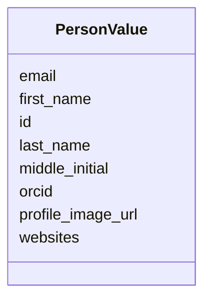

# Class: PersonValue 


URI: [basalt_schema:PersonValue](https://emsl-computing.github.io/BASALT-Schema/elements/PersonValue)





<!-- no inheritance hierarchy -->

## Slots

| Name | Cardinality and Range | Description | Inheritance |
| ---  | --- | --- | --- |
| [email](email.md) | 0..1 <br/> [String](String.md) | A contactable email address associated with a person or institution | direct |
| [id](id.md) | 1 <br/> [Uuid](Uuid.md) |  | direct |
| [first_name](first_name.md) | 1 <br/> [String](String.md) |  | direct |
| [last_name](last_name.md) | 1 <br/> [String](String.md) |  | direct |
| [middle_initial](middle_initial.md) | 0..1 <br/> [String](String.md) |  | direct |
| [orcid](orcid.md) | 0..1 <br/> [String](String.md) | ORCID identifier of the person | direct |
| [profile_image_url](profile_image_url.md) | 0..1 <br/> [String](String.md) |  | direct |
| [websites](websites.md) | 0..1 <br/> [String](String.md) |  | direct |

## Unique Keys


### PersonValue_email_key

**Unique key slots:** email


## Usages

| used by | used in | type | used |
| ---  | --- | --- | --- |
| [DataGenerationActivity](DataGenerationActivity.md) | [instrument_operator_id](instrument_operator_id.md) | range | [PersonValue](PersonValue.md) |
| [RespirationDataGenerationActivity](RespirationDataGenerationActivity.md) | [instrument_operator_id](instrument_operator_id.md) | range | [PersonValue](PersonValue.md) |
| [Custodian](Custodian.md) | [person_id](person_id.md) | range | [PersonValue](PersonValue.md) |
| [XRayDataGenerationActivity](XRayDataGenerationActivity.md) | [instrument_operator_id](instrument_operator_id.md) | range | [PersonValue](PersonValue.md) |
| [XRFDataGenerationActivity](XRFDataGenerationActivity.md) | [instrument_operator_id](instrument_operator_id.md) | range | [PersonValue](PersonValue.md) |
| [XRDDataGenerationActivity](XRDDataGenerationActivity.md) | [instrument_operator_id](instrument_operator_id.md) | range | [PersonValue](PersonValue.md) |
| [MassSpectrometryDataGenerationActivity](MassSpectrometryDataGenerationActivity.md) | [instrument_operator_id](instrument_operator_id.md) | range | [PersonValue](PersonValue.md) |
| [PlateSetupActivity](PlateSetupActivity.md) | [setup_operator_id](setup_operator_id.md) | range | [PersonValue](PersonValue.md) |
| [AMP2PlateSetupActivity](AMP2PlateSetupActivity.md) | [setup_operator_id](setup_operator_id.md) | range | [PersonValue](PersonValue.md) |
| [EcoplatePlateSetupActivity](EcoplatePlateSetupActivity.md) | [setup_operator_id](setup_operator_id.md) | range | [PersonValue](PersonValue.md) |
| [PlateDataGenerationActivity](PlateDataGenerationActivity.md) | [instrument_operator_id](instrument_operator_id.md) | range | [PersonValue](PersonValue.md) |
| [AMP2DataGenerationActivity](AMP2DataGenerationActivity.md) | [instrument_operator_id](instrument_operator_id.md) | range | [PersonValue](PersonValue.md) |
| [EcoplateDataGenerationActivity](EcoplateDataGenerationActivity.md) | [instrument_operator_id](instrument_operator_id.md) | range | [PersonValue](PersonValue.md) |
| [NucleotideSequencing](NucleotideSequencing.md) | [instrument_operator_id](instrument_operator_id.md) | range | [PersonValue](PersonValue.md) |
| [Study](Study.md) | [principal_investigator](principal_investigator.md) | range | [PersonValue](PersonValue.md) |
| [ProjectParticipant](ProjectParticipant.md) | [person](person.md) | range | [PersonValue](PersonValue.md) |


## Identifier and Mapping Information


### Schema Source


* from schema: https://emsl-computing.github.io/BASALT-Schema


## Mappings

| Mapping Type | Mapped Value |
| ---  | ---  |
| self | basalt_schema:PersonValue |
| native | basalt_schema:PersonValue |


## LinkML Source

<!-- TODO: investigate https://stackoverflow.com/questions/37606292/how-to-create-tabbed-code-blocks-in-mkdocs-or-sphinx -->

### Direct

<details>
```yaml
name: PersonValue
from_schema: https://emsl-computing.github.io/BASALT-Schema
slots:
- email
attributes:
  id:
    name: id
    from_schema: https://emsl-computing.github.io/BASALT-Schema/value-tables
    identifier: true
    domain_of:
    - Activity
    - Entity
    - DataProduct
    - DataGenerationActivity
    - DataProcessingActivity
    - AlternativeIdentifier
    - FunctionalAnnotationIdentifier
    - Instrument
    - OntologyClass
    - ContainerType
    - Custodian
    - InstrumentAlternativeIdentifier
    - LabDevice
    - SampleProcessing
    - ProcessingSampleLink
    - Configuration
    - MobilePhaseSegment
    - MassSpectrometryStandardRun
    - PurchasedMaterial
    - LabProcessingActivity
    - organism
    - MAOMProduct
    - WEOMProduct
    - Site
    - Sample
    - AerosolArmSample
    - AerosolSample
    - AMP2UserSample
    - CommerciallyPurchasedSample
    - CultureEnvironmentalSample
    - EngineeredStrainSample
    - FieldDeployedTerraformSample
    - MixedCultureSample
    - MonetSoilSample
    - OtherUndescribedSample
    - PlantSample
    - PureCultureSample
    - SedimentSample
    - SoilSample
    - SynthesizedMaterialSample
    - TerraformSample
    - WaterSample
    - ProcessedSample
    - CoreSection
    - SamplingActivity
    - AerosolArmSamplingActivity
    - AerosolSamplingActivity
    - CommerciallyPurchasedSamplingActivity
    - CultureEnvironmentalSamplingActivity
    - EngineeredStrainSamplingActivity
    - FieldDeployedTerraformSamplingActivity
    - MixedCultureSamplingActivity
    - MonetSoilSamplingActivity
    - OtherUndescribedSamplingActivity
    - PlantSamplingActivity
    - PureCultureSamplingActivity
    - SedimentSamplingActivity
    - SoilSamplingActivity
    - SynthesizedMaterialSamplingActivity
    - TerraformSamplingActivity
    - WaterSamplingActivity
    - Study
    - ProjectParticipant
    - TimestampValue
    - TextValue
    - SoftwareControlledTermValue
    - ControlledTermValue
    - PersonValue
    - QuantityValue
    - ConditioningValue
    - zipDownload
    range: uuid
    required: true
  first_name:
    name: first_name
    from_schema: https://emsl-computing.github.io/BASALT-Schema/value-tables
    rank: 1000
    domain_of:
    - PersonValue
    range: string
    required: true
  last_name:
    name: last_name
    from_schema: https://emsl-computing.github.io/BASALT-Schema/value-tables
    rank: 1000
    domain_of:
    - PersonValue
    range: string
    required: true
  middle_initial:
    name: middle_initial
    from_schema: https://emsl-computing.github.io/BASALT-Schema/value-tables
    rank: 1000
    domain_of:
    - PersonValue
    range: string
  orcid:
    name: orcid
    description: ORCID identifier of the person
    from_schema: https://emsl-computing.github.io/BASALT-Schema/value-tables
    rank: 1000
    domain_of:
    - PersonValue
    range: string
  profile_image_url:
    name: profile_image_url
    from_schema: https://emsl-computing.github.io/BASALT-Schema/value-tables
    rank: 1000
    domain_of:
    - PersonValue
    range: string
  websites:
    name: websites
    from_schema: https://emsl-computing.github.io/BASALT-Schema/value-tables
    rank: 1000
    domain_of:
    - PersonValue
    range: string
unique_keys:
  PersonValue_email_key:
    unique_key_name: PersonValue_email_key
    unique_key_slots:
    - email

```
</details>

### Induced

<details>
```yaml
name: PersonValue
from_schema: https://emsl-computing.github.io/BASALT-Schema
attributes:
  id:
    name: id
    from_schema: https://emsl-computing.github.io/BASALT-Schema/value-tables
    identifier: true
    alias: id
    owner: PersonValue
    domain_of:
    - Activity
    - Entity
    - DataProduct
    - DataGenerationActivity
    - DataProcessingActivity
    - AlternativeIdentifier
    - FunctionalAnnotationIdentifier
    - Instrument
    - OntologyClass
    - ContainerType
    - Custodian
    - InstrumentAlternativeIdentifier
    - LabDevice
    - SampleProcessing
    - ProcessingSampleLink
    - Configuration
    - MobilePhaseSegment
    - MassSpectrometryStandardRun
    - PurchasedMaterial
    - LabProcessingActivity
    - organism
    - MAOMProduct
    - WEOMProduct
    - Site
    - Sample
    - AerosolArmSample
    - AerosolSample
    - AMP2UserSample
    - CommerciallyPurchasedSample
    - CultureEnvironmentalSample
    - EngineeredStrainSample
    - FieldDeployedTerraformSample
    - MixedCultureSample
    - MonetSoilSample
    - OtherUndescribedSample
    - PlantSample
    - PureCultureSample
    - SedimentSample
    - SoilSample
    - SynthesizedMaterialSample
    - TerraformSample
    - WaterSample
    - ProcessedSample
    - CoreSection
    - SamplingActivity
    - AerosolArmSamplingActivity
    - AerosolSamplingActivity
    - CommerciallyPurchasedSamplingActivity
    - CultureEnvironmentalSamplingActivity
    - EngineeredStrainSamplingActivity
    - FieldDeployedTerraformSamplingActivity
    - MixedCultureSamplingActivity
    - MonetSoilSamplingActivity
    - OtherUndescribedSamplingActivity
    - PlantSamplingActivity
    - PureCultureSamplingActivity
    - SedimentSamplingActivity
    - SoilSamplingActivity
    - SynthesizedMaterialSamplingActivity
    - TerraformSamplingActivity
    - WaterSamplingActivity
    - Study
    - ProjectParticipant
    - TimestampValue
    - TextValue
    - SoftwareControlledTermValue
    - ControlledTermValue
    - PersonValue
    - QuantityValue
    - ConditioningValue
    - zipDownload
    range: uuid
    required: true
  first_name:
    name: first_name
    from_schema: https://emsl-computing.github.io/BASALT-Schema/value-tables
    rank: 1000
    alias: first_name
    owner: PersonValue
    domain_of:
    - PersonValue
    range: string
    required: true
  last_name:
    name: last_name
    from_schema: https://emsl-computing.github.io/BASALT-Schema/value-tables
    rank: 1000
    alias: last_name
    owner: PersonValue
    domain_of:
    - PersonValue
    range: string
    required: true
  middle_initial:
    name: middle_initial
    from_schema: https://emsl-computing.github.io/BASALT-Schema/value-tables
    rank: 1000
    alias: middle_initial
    owner: PersonValue
    domain_of:
    - PersonValue
    range: string
  orcid:
    name: orcid
    description: ORCID identifier of the person
    from_schema: https://emsl-computing.github.io/BASALT-Schema/value-tables
    rank: 1000
    alias: orcid
    owner: PersonValue
    domain_of:
    - PersonValue
    range: string
  profile_image_url:
    name: profile_image_url
    from_schema: https://emsl-computing.github.io/BASALT-Schema/value-tables
    rank: 1000
    alias: profile_image_url
    owner: PersonValue
    domain_of:
    - PersonValue
    range: string
  websites:
    name: websites
    from_schema: https://emsl-computing.github.io/BASALT-Schema/value-tables
    rank: 1000
    alias: websites
    owner: PersonValue
    domain_of:
    - PersonValue
    range: string
  email:
    name: email
    description: A contactable email address associated with a person or institution.
    from_schema: https://emsl-computing.github.io/BASALT-Schema
    rank: 1000
    alias: email
    owner: PersonValue
    domain_of:
    - PersonValue
    range: string
unique_keys:
  PersonValue_email_key:
    unique_key_name: PersonValue_email_key
    unique_key_slots:
    - email

```
</details>