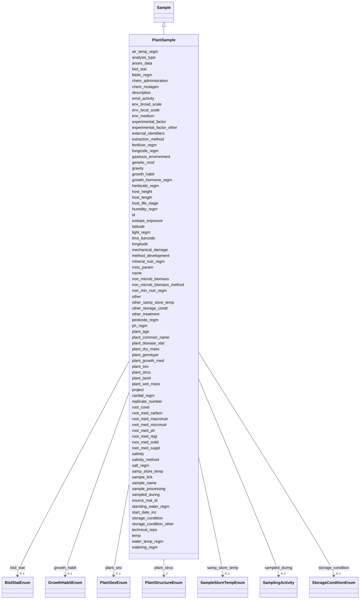

# Class: PlantSample 


_A sample containing plant material._


URI: [basalt_schema:PlantSample](https://EMSL-Computing.github.io/basalt-schema/PlantSample)





## Inheritance
* [Sample](Sample.md)
    * **PlantSample**


## Slots

| Name | Cardinality and Range | Description | Inheritance |
| ---  | --- | --- | --- |
| [air_temp_regm](air_temp_regm.md) | 0..1 <br/> [String](String.md) | Information about treatment involving an exposure to varying temperatures; sh... | direct |
| [ances_data](ances_data.md) | 0..1 <br/> [String](String.md) | Information about either pedigree or other ancestral information description | direct |
| [analysis_type](analysis_type.md) | 1 <br/> [String](String.md) | The type(s) of analysis planned for this sample | direct |
| [biol_stat](biol_stat.md) | 0..1 <br/> [BiolStatEnum](BiolStatEnum.md) | The level of genome modification | direct |
| [biotic_regm](biotic_regm.md) | 0..1 <br/> [String](String.md) | Information about treatment(s) involving use of biotic factors such as bacter... | direct |
| [chem_administration](chem_administration.md) | 0..1 <br/> [String](String.md) | List of chemical compounds administered to the host or site where sampling oc... | direct |
| [chem_mutagen](chem_mutagen.md) | 0..1 <br/> [String](String.md) | Treatment involving use of mutagens; should include the name of mutagen, amou... | direct |
| [env_broad_scale](env_broad_scale.md) | 0..1 <br/> [String](String.md) | 'Report the major environmental system the sample or specimen came from | direct |
| [env_local_scale](env_local_scale.md) | 0..1 <br/> [String](String.md) | 'Report the entity which are in your sample or specimens local vicinity and w... | direct |
| [env_medium](env_medium.md) | 0..1 <br/> [String](String.md) | 'Report the environmental material immediately surrounding the sample or spec... | direct |
| [experimental_factor](experimental_factor.md) | 0..1 <br/> [String](String.md) | Experimental factors are essentially the variable aspects of an experiment de... | direct |
| [experimental_factor_other](experimental_factor_other.md) | 0..1 <br/> [String](String.md) | Other details about your sample that you feel can't be accurately represented... | direct |
| [extraction_method](extraction_method.md) | 0..1 <br/> [String](String.md) | If you (the user) performed an extraction preparation or processing before se... | direct |
| [external_identifiers](external_identifiers.md) | * <br/> [Uriorcurie](Uriorcurie.md) | List of external identifiers associated with this entity or activity | direct |
| [fertilizer_regm](fertilizer_regm.md) | 0..1 <br/> [String](String.md) | Information about treatment involving the use of fertilizers; should include ... | direct |
| [fungicide_regm](fungicide_regm.md) | 0..1 <br/> [String](String.md) | Information about treatment involving use of fungicides; should include the n... | direct |
| [gaseous_environment](gaseous_environment.md) | 0..1 <br/> [String](String.md) | Use of conditions with differing gaseous environments; should include the nam... | direct |
| [genetic_mod](genetic_mod.md) | 0..1 <br/> [String](String.md) | Genetic modifications of the genome of an organism, which may occur naturally... | direct |
| [gravity](gravity.md) | 0..1 <br/> [String](String.md) | Information about treatment involving use of gravity factor to study various ... | direct |
| [growth_habit](growth_habit.md) | 0..1 <br/> [GrowthHabitEnum](GrowthHabitEnum.md) | Characteristic shape appearance or growth form of a plant species | direct |
| [growth_hormone_regm](growth_hormone_regm.md) | 0..1 <br/> [String](String.md) | Information about treatment involving use of growth hormones; should include ... | direct |
| [herbicide_regm](herbicide_regm.md) | 0..1 <br/> [String](String.md) | Information about treatment involving use of herbicides; information about tr... | direct |
| [host_height](host_height.md) | 0..1 <br/> [String](String.md) | The height of plant | direct |
| [host_length](host_length.md) | 0..1 <br/> [String](String.md) | The length of the plant | direct |
| [host_life_stage](host_life_stage.md) | 0..1 <br/> [String](String.md) | Description of life stage of the plant | direct |
| [humidity_regm](humidity_regm.md) | 0..1 <br/> [String](String.md) | Information about treatment involving an exposure to varying degrees of humid... | direct |
| [isotope_exposure](isotope_exposure.md) | 0..1 <br/> [String](String.md) | List isotope exposure or addition applied to your sample | direct |
| [latitude](latitude.md) | 1 <br/> [Double](Double.md) | Latitude coordinate of the sampling site in WSG 84 format | direct |
| [longitude](longitude.md) | 1 <br/> [Double](Double.md) | Longitude coordinate of the sampling site in WSG 84 format | direct |
| [light_regm](light_regm.md) | 0..1 <br/> [String](String.md) | Information about treatment(s) involving exposure to light including both lig... | direct |
| [mechanical_damage](mechanical_damage.md) | 0..1 <br/> [String](String.md) | Information about any mechanical damage exerted on the plant; can include mul... | direct |
| [method_development](method_development.md) | 0..1 <br/> [String](String.md) | If your samples are TEST sample ONLY, please provide information on what you'... | direct |
| [mineral_nutr_regm](mineral_nutr_regm.md) | 0..1 <br/> [String](String.md) | Information about treatment involving the use of mineral supplements; should ... | direct |
| [misc_param](misc_param.md) | 0..1 <br/> [String](String.md) | Any other measurement performed or parameter collected that is not listed her... | direct |
| [non_microb_biomass](non_microb_biomass.md) | 0..1 <br/> [String](String.md) | Amount of biomass; should include the name for the part of biomass measured e | direct |
| [non_microb_biomass_method](non_microb_biomass_method.md) | 0..1 <br/> [String](String.md) | Reference or method used in determining biomass | direct |
| [non_min_nutr_regm](non_min_nutr_regm.md) | 0..1 <br/> [String](String.md) | Information about treatment involving the exposure of plant to non-mineral nu... | direct |
| [other](other.md) | 0..1 <br/> [String](String.md) | Other/additional details about your sample that you feel can't be accurately ... | direct |
| [other_samp_store_temp](other_samp_store_temp.md) | 0..1 <br/> [String](String.md) | Please specify sample storage temperature if you selected 'other' | direct |
| [other_storage_condt](other_storage_condt.md) | 0..1 <br/> [String](String.md) | Please specify your storage conditions if you selected 'other' and the availa... | direct |
| [other_treatment](other_treatment.md) | 0..1 <br/> [String](String.md) | Many sample treatment descriptor columns are available | direct |
| [pesticide_regm](pesticide_regm.md) | 0..1 <br/> [String](String.md) | Information about treatment involving use of insecticides; should include the... | direct |
| [ph_regm](ph_regm.md) | 0..1 <br/> [String](String.md) | Information about treatment involving exposure of plants to varying levels of... | direct |
| [plant_age](plant_age.md) | 0..1 <br/> [String](String.md) | Age of plant at the time of sampling | direct |
| [plant_common_name](plant_common_name.md) | 1 <br/> [String](String.md) | Common name of the plant | direct |
| [plant_disease_stat](plant_disease_stat.md) | 0..1 <br/> [String](String.md) | List of diseases with which the plant has been diagnosed; can include multipl... | direct |
| [plant_dry_mass](plant_dry_mass.md) | 0..1 <br/> [String](String.md) | Measurement of dry mass | direct |
| [plant_genotype](plant_genotype.md) | 0..1 <br/> [String](String.md) | Observed genotype of the plant | direct |
| [plant_growth_med](plant_growth_med.md) | 0..1 <br/> [String](String.md) | Specification of the media for growing the plants or tissue cultured samples ... | direct |
| [plant_sex](plant_sex.md) | 0..1 <br/> [PlantSexEnum](PlantSexEnum.md) | Sex of the reproductive parts on the whole plant | direct |
| [plant_struc](plant_struc.md) | 1 <br/> [PlantStructureEnum](PlantStructureEnum.md) | Name of plant structure the sample was obtained from; for Plant Ontology (PO)... | direct |
| [plant_taxid](plant_taxid.md) | 1 <br/> [String](String.md) | NCBI taxon ID of the plant from https://www | direct |
| [plant_wet_mass](plant_wet_mass.md) | 0..1 <br/> [String](String.md) | Measurement of wet mass | direct |
| [project](project.md) | 0..1 <br/> [Integer](Integer.md) | Identifier for the user project associated with the entity or activity | direct |
| [rainfall_regm](rainfall_regm.md) | 0..1 <br/> [String](String.md) | Information about treatment involving an exposure to a given amount of rainfa... | direct |
| [replicate_number](replicate_number.md) | 0..1 <br/> [Integer](Integer.md) | The replicate number of the sample, if applicable | direct |
| [root_cond](root_cond.md) | 0..1 <br/> [String](String.md) | Relevant rooting conditions such as field plot size, sowing density, containe... | direct |
| [root_med_carbon](root_med_carbon.md) | 0..1 <br/> [String](String.md) | Source of organic carbon in the culture rooting medium | direct |
| [root_med_macronutr](root_med_macronutr.md) | 0..1 <br/> [String](String.md) | Measurement of the culture rooting medium macronutrients (NP K Ca Mg S) | direct |
| [root_med_micronutr](root_med_micronutr.md) | 0..1 <br/> [String](String.md) | Measurement of the culture rooting medium micronutrients (Fe Mn Zn B Cu Mo) | direct |
| [root_med_ph](root_med_ph.md) | 0..1 <br/> [Float](Float.md) | pH measurement of the culture rooting medium | direct |
| [root_med_regl](root_med_regl.md) | 0..1 <br/> [String](String.md) | Growth regulators in the culture rooting medium such as cytokinins, auxins, g... | direct |
| [root_med_solid](root_med_solid.md) | 0..1 <br/> [String](String.md) | Specification of the solidifying agent in the culture rooting medium | direct |
| [root_med_suppl](root_med_suppl.md) | 0..1 <br/> [String](String.md) | Organic supplements of the culture rooting medium such as vitamins, amino aci... | direct |
| [salinity](salinity.md) | 0..1 <br/> [String](String.md) | Salinity is the total concentration of all dissolved salts in a sample | direct |
| [salinity_method](salinity_method.md) | 0..1 <br/> [String](String.md) | Method used to determine sample salinity | direct |
| [salt_regm](salt_regm.md) | 0..1 <br/> [String](String.md) | Information about treatment involving use of salts as supplement to liquid an... | direct |
| [sample_link](sample_link.md) | 0..1 <br/> [String](String.md) | 'A unique identifier to assign parent-child subsample or sibling samples | direct |
| [sample_name](sample_name.md) | 0..1 <br/> [String](String.md) | The name or label that is present on the shipped sample | direct |
| [sample_processing](sample_processing.md) | 0..1 <br/> [String](String.md) | A brief description of any processing applied to the sample during or after r... | direct |
| [samp_store_temp](samp_store_temp.md) | 0..1 <br/> [SampleStoreTempEnum](SampleStoreTempEnum.md) | The temperature at which your samples should be stored upon arrival | direct |
| [sampled_during](sampled_during.md) | 0..1 <br/> [SamplingActivity](SamplingActivity.md) | Reference to the sampling activity during which this sample was collected | direct |
| [source_mat_id](source_mat_id.md) | 0..1 <br/> [String](String.md) | A unique identifier assigned to an original material sample collected or to a... | direct |
| [standing_water_regm](standing_water_regm.md) | 0..1 <br/> [String](String.md) | Treatment involving an exposure to standing water during a plant's life span;... | direct |
| [start_date_inc](start_date_inc.md) | 0..1 <br/> [String](String.md) | Date the incubation was started | direct |
| [storage_condition](storage_condition.md) | 0..1 <br/> [StorageConditionEnum](StorageConditionEnum.md) | The storage condition of the sample | direct |
| [storage_condition_other](storage_condition_other.md) | 0..1 <br/> [String](String.md) | Free-text field for storage conditions when 'storage_condition' is 'other' | direct |
| [technical_reps](technical_reps.md) | 0..1 <br/> [Integer](Integer.md) | Number of technical replicates for the sample | direct |
| [temp](temp.md) | 0..1 <br/> [String](String.md) | Temperature of the sample at the time of sampling | direct |
| [water_temp_regm](water_temp_regm.md) | 0..1 <br/> [String](String.md) | Information about treatment involving an exposure to water with varying degre... | direct |
| [watering_regm](watering_regm.md) | 0..1 <br/> [String](String.md) | Information about treatment involving an exposure to watering frequencies, tr... | direct |
| [id](id.md) | 1 <br/> [Uuid](Uuid.md) |  | direct |
| [name](name.md) | 1 <br/> [String](String.md) | Human-readable name for the entity or activity | [Sample](Sample.md) |
| [description](description.md) | 0..1 <br/> [String](String.md) | Human-readable description for the entity or activity | [Sample](Sample.md) |
| [emsl_activity](emsl_activity.md) | 0..1 <br/> [String](String.md) | Nullable string linking a Sample or SamplingActivity to a named EMSL activity... | [Sample](Sample.md) |
| [lims_barcode](lims_barcode.md) | 0..1 <br/> [String](String.md) | LIMS barcode identifier | [Sample](Sample.md) |


## Identifier and Mapping Information


### Schema Source


* from schema: https://EMSL-Computing.github.io/basalt-schema


## Mappings

| Mapping Type | Mapped Value |
| ---  | ---  |
| self | basalt_schema:PlantSample |
| native | basalt_schema:PlantSample |


## LinkML Source

<!-- TODO: investigate https://stackoverflow.com/questions/37606292/how-to-create-tabbed-code-blocks-in-mkdocs-or-sphinx -->

### Direct

<details>
```yaml
name: PlantSample
description: A sample containing plant material.
from_schema: https://EMSL-Computing.github.io/basalt-schema
is_a: Sample
slots:
- air_temp_regm
- ances_data
- analysis_type
- biol_stat
- biotic_regm
- chem_administration
- chem_mutagen
- env_broad_scale
- env_local_scale
- env_medium
- experimental_factor
- experimental_factor_other
- extraction_method
- external_identifiers
- fertilizer_regm
- fungicide_regm
- gaseous_environment
- genetic_mod
- gravity
- growth_habit
- growth_hormone_regm
- herbicide_regm
- host_height
- host_length
- host_life_stage
- humidity_regm
- isotope_exposure
- latitude
- longitude
- light_regm
- mechanical_damage
- method_development
- mineral_nutr_regm
- misc_param
- non_microb_biomass
- non_microb_biomass_method
- non_min_nutr_regm
- other
- other_samp_store_temp
- other_storage_condt
- other_treatment
- pesticide_regm
- ph_regm
- plant_age
- plant_common_name
- plant_disease_stat
- plant_dry_mass
- plant_genotype
- plant_growth_med
- plant_sex
- plant_struc
- plant_taxid
- plant_wet_mass
- project
- rainfall_regm
- replicate_number
- root_cond
- root_med_carbon
- root_med_macronutr
- root_med_micronutr
- root_med_ph
- root_med_regl
- root_med_solid
- root_med_suppl
- salinity
- salinity_method
- salt_regm
- sample_link
- sample_name
- sample_processing
- samp_store_temp
- sampled_during
- source_mat_id
- standing_water_regm
- start_date_inc
- storage_condition
- storage_condition_other
- technical_reps
- temp
- water_temp_regm
- watering_regm
slot_usage:
  analysis_type:
    name: analysis_type
    required: true
  host_height:
    name: host_height
    description: 'The height of plant. (Unit: cm or mm or m)'
  host_length:
    name: host_length
    description: 'The length of the plant. (Unit: cm or mm or m)'
    pattern: ^\d+(\.\d+)?\s*(cm|mm|m)$
  host_life_stage:
    name: host_life_stage
    description: Description of life stage of the plant
  latitude:
    name: latitude
    required: true
  longitude:
    name: longitude
    required: true
  non_microb_biomass:
    name: non_microb_biomass
    description: 'Amount of biomass; should include the name for the part of biomass
      measured e.g.insect plant total (Unit: µm)'
  plant_common_name:
    name: plant_common_name
    required: true
  plant_struc:
    name: plant_struc
    required: true
  plant_taxid:
    name: plant_taxid
    required: true
attributes:
  id:
    name: id
    from_schema: https://EMSL-Computing.github.io/basalt-schema/sample-classes
    identifier: true
    domain_of:
    - Activity
    - Entity
    - DataProduct
    - DataGenerationActivity
    - DataProcessingActivity
    - AlternativeIdentifier
    - FunctionalAnnotationIdentifier
    - Instrument
    - OntologyClass
    - ContainerType
    - Custodian
    - InstrumentAlternativeIdentifier
    - LabDevice
    - SampleProcessing
    - ProcessingSampleLink
    - Configuration
    - MobilePhaseSegment
    - MassSpectrometryStandardRun
    - PurchasedMaterial
    - LabProcessingActivity
    - organism
    - MAOMProduct
    - WEOMProduct
    - Site
    - Sample
    - AerosolArmSample
    - AerosolSample
    - AMP2UserSample
    - CommerciallyPurchasedSample
    - CultureEnvironmentalSample
    - EngineeredStrainSample
    - FieldDeployedTerraformSample
    - MixedCultureSample
    - MonetSoilSample
    - OtherUndescribedSample
    - PlantSample
    - PureCultureSample
    - SedimentSample
    - SoilSample
    - SynthesizedMaterialSample
    - TerraformSample
    - WaterSample
    - ProcessedSample
    - CoreSection
    - SamplingActivity
    - AerosolArmSamplingActivity
    - AerosolSamplingActivity
    - CommerciallyPurchasedSamplingActivity
    - CultureEnvironmentalSamplingActivity
    - EngineeredStrainSamplingActivity
    - FieldDeployedTerraformSamplingActivity
    - MixedCultureSamplingActivity
    - MonetSoilSamplingActivity
    - OtherUndescribedSamplingActivity
    - PlantSamplingActivity
    - PureCultureSamplingActivity
    - SedimentSamplingActivity
    - SoilSamplingActivity
    - SynthesizedMaterialSamplingActivity
    - TerraformSamplingActivity
    - WaterSamplingActivity
    - Study
    - ProjectParticipant
    - TimestampValue
    - TextValue
    - SoftwareControlledTermValue
    - ControlledTermValue
    - PersonValue
    - QuantityValue
    - ConditioningValue
    - zipDownload
    range: uuid
    required: true

```
</details>

### Induced

<details>
```yaml
name: PlantSample
description: A sample containing plant material.
from_schema: https://EMSL-Computing.github.io/basalt-schema
is_a: Sample
slot_usage:
  analysis_type:
    name: analysis_type
    required: true
  host_height:
    name: host_height
    description: 'The height of plant. (Unit: cm or mm or m)'
  host_length:
    name: host_length
    description: 'The length of the plant. (Unit: cm or mm or m)'
    pattern: ^\d+(\.\d+)?\s*(cm|mm|m)$
  host_life_stage:
    name: host_life_stage
    description: Description of life stage of the plant
  latitude:
    name: latitude
    required: true
  longitude:
    name: longitude
    required: true
  non_microb_biomass:
    name: non_microb_biomass
    description: 'Amount of biomass; should include the name for the part of biomass
      measured e.g.insect plant total (Unit: µm)'
  plant_common_name:
    name: plant_common_name
    required: true
  plant_struc:
    name: plant_struc
    required: true
  plant_taxid:
    name: plant_taxid
    required: true
attributes:
  id:
    name: id
    from_schema: https://EMSL-Computing.github.io/basalt-schema/sample-classes
    identifier: true
    alias: id
    owner: PlantSample
    domain_of:
    - Activity
    - Entity
    - DataProduct
    - DataGenerationActivity
    - DataProcessingActivity
    - AlternativeIdentifier
    - FunctionalAnnotationIdentifier
    - Instrument
    - OntologyClass
    - ContainerType
    - Custodian
    - InstrumentAlternativeIdentifier
    - LabDevice
    - SampleProcessing
    - ProcessingSampleLink
    - Configuration
    - MobilePhaseSegment
    - MassSpectrometryStandardRun
    - PurchasedMaterial
    - LabProcessingActivity
    - organism
    - MAOMProduct
    - WEOMProduct
    - Site
    - Sample
    - AerosolArmSample
    - AerosolSample
    - AMP2UserSample
    - CommerciallyPurchasedSample
    - CultureEnvironmentalSample
    - EngineeredStrainSample
    - FieldDeployedTerraformSample
    - MixedCultureSample
    - MonetSoilSample
    - OtherUndescribedSample
    - PlantSample
    - PureCultureSample
    - SedimentSample
    - SoilSample
    - SynthesizedMaterialSample
    - TerraformSample
    - WaterSample
    - ProcessedSample
    - CoreSection
    - SamplingActivity
    - AerosolArmSamplingActivity
    - AerosolSamplingActivity
    - CommerciallyPurchasedSamplingActivity
    - CultureEnvironmentalSamplingActivity
    - EngineeredStrainSamplingActivity
    - FieldDeployedTerraformSamplingActivity
    - MixedCultureSamplingActivity
    - MonetSoilSamplingActivity
    - OtherUndescribedSamplingActivity
    - PlantSamplingActivity
    - PureCultureSamplingActivity
    - SedimentSamplingActivity
    - SoilSamplingActivity
    - SynthesizedMaterialSamplingActivity
    - TerraformSamplingActivity
    - WaterSamplingActivity
    - Study
    - ProjectParticipant
    - TimestampValue
    - TextValue
    - SoftwareControlledTermValue
    - ControlledTermValue
    - PersonValue
    - QuantityValue
    - ConditioningValue
    - zipDownload
    range: uuid
    required: true
  air_temp_regm:
    name: air_temp_regm
    description: Information about treatment involving an exposure to varying temperatures;
      should include the temperature, treatment regimen including how many times the
      treatment was repeated, how long each treatment lasted, and the start and end
      time of the entire treatment; can include different temperature regimens
    title: air temperature regimen
    from_schema: https://EMSL-Computing.github.io/basalt-schema
    exact_mappings:
    - MIXS:0000551
    rank: 1000
    alias: air_temp_regm
    owner: PlantSample
    domain_of:
    - AerosolArmSample
    - AerosolSample
    - CultureEnvironmentalSample
    - FieldDeployedTerraformSample
    - MixedCultureSample
    - OtherUndescribedSample
    - PlantSample
    - PureCultureSample
    - SedimentSample
    - SoilSample
    - TerraformSample
    - WaterSample
    range: string
  ances_data:
    name: ances_data
    description: Information about either pedigree or other ancestral information
      description
    title: ancestral data
    from_schema: https://EMSL-Computing.github.io/basalt-schema
    rank: 1000
    alias: ances_data
    owner: PlantSample
    domain_of:
    - OtherUndescribedSample
    - PlantSample
    range: string
  analysis_type:
    name: analysis_type
    description: The type(s) of analysis planned for this sample.
    from_schema: https://EMSL-Computing.github.io/basalt-schema
    rank: 1000
    alias: analysis_type
    owner: PlantSample
    domain_of:
    - SampleProcessing
    - AerosolArmSample
    - AerosolSample
    - AMP2UserSample
    - CommerciallyPurchasedSample
    - CultureEnvironmentalSample
    - FieldDeployedTerraformSample
    - MixedCultureSample
    - OtherUndescribedSample
    - PlantSample
    - PureCultureSample
    - SedimentSample
    - SoilSample
    - SynthesizedMaterialSample
    - TerraformSample
    - WaterSample
    range: string
    required: true
  biol_stat:
    name: biol_stat
    description: The level of genome modification.
    title: biological status
    from_schema: https://EMSL-Computing.github.io/basalt-schema
    rank: 1000
    alias: biol_stat
    owner: PlantSample
    domain_of:
    - OtherUndescribedSample
    - PlantSample
    range: BiolStatEnum
  biotic_regm:
    name: biotic_regm
    description: Information about treatment(s) involving use of biotic factors such
      as bacteria, viruses, or fungi.
    title: biotic regimen
    from_schema: https://EMSL-Computing.github.io/basalt-schema
    rank: 1000
    alias: biotic_regm
    owner: PlantSample
    domain_of:
    - CultureEnvironmentalSample
    - FieldDeployedTerraformSample
    - MixedCultureSample
    - OtherUndescribedSample
    - PlantSample
    - PureCultureSample
    - SedimentSample
    - SoilSample
    - TerraformSample
    - WaterSample
    range: string
  chem_administration:
    name: chem_administration
    description: List of chemical compounds administered to the host or site where
      sampling occurred, and when (e.g. Antibiotics, n fertilizer, air filter); can
      include multiple compounds. For chemical entities of biological interest ontology
      (chebi) (v 163), http://purl.bioontology.org/ontology/chebi
    title: chemical administration
    from_schema: https://EMSL-Computing.github.io/basalt-schema
    exact_mappings:
    - MIXS:0000751
    rank: 1000
    alias: chem_administration
    owner: PlantSample
    domain_of:
    - AerosolArmSample
    - AerosolSample
    - CultureEnvironmentalSample
    - FieldDeployedTerraformSample
    - MixedCultureSample
    - MonetSoilSample
    - OtherUndescribedSample
    - PlantSample
    - PureCultureSample
    - SedimentSample
    - SoilSample
    - TerraformSample
    - WaterSample
    range: string
  chem_mutagen:
    name: chem_mutagen
    description: Treatment involving use of mutagens; should include the name of mutagen,
      amount administered, treatment regimen, including how many times the treatment
      was repeated, how long each treatment lasted, and the start and end time of
      the entire treatment; can include multiple mutagen regimens
    title: chemical mutagen
    from_schema: https://EMSL-Computing.github.io/basalt-schema
    rank: 1000
    alias: chem_mutagen
    owner: PlantSample
    domain_of:
    - OtherUndescribedSample
    - PlantSample
    range: string
  env_broad_scale:
    name: env_broad_scale
    description: '''Report the major environmental system the sample or specimen came
      from. The system identified should have a coarse spatial grain to provide the
      general environmental context of where the sampling was done (e.g. in the desert
      or a rainforest). We recommend using subclasses of EnvO''''s biome class: http://purl.obolibrary.org/obo/ENVO_00000428.
      EnvO documentation about how to use the field: https://github.com/EnvironmentOntology/envo/wiki/Using-ENVO-with-MIxS'''
    title: broad-scale environmental context
    from_schema: https://EMSL-Computing.github.io/basalt-schema
    rank: 1000
    alias: env_broad_scale
    owner: PlantSample
    domain_of:
    - AerosolArmSample
    - AerosolSample
    - CultureEnvironmentalSample
    - FieldDeployedTerraformSample
    - MonetSoilSample
    - OtherUndescribedSample
    - PlantSample
    - PureCultureSample
    - SedimentSample
    - SoilSample
    - TerraformSample
    - WaterSample
    range: string
    pattern: ^_*\s*[a-zA-Z\s]+\[ENVO:\d+\]$
  env_local_scale:
    name: env_local_scale
    description: '''Report the entity which are in your sample or specimens local
      vicinity and which you believe have significant causal influences on your sample
      or specimen. Please use terms that are present in ENVO and which are of smaller
      spatial grain than your entry for env_broad_scale.If needed, request new terms
      on the ENVO tracker identified here: http://www.obofoundry.org/ontology/envo.html'''
    title: local environmental context
    from_schema: https://EMSL-Computing.github.io/basalt-schema
    rank: 1000
    alias: env_local_scale
    owner: PlantSample
    domain_of:
    - AerosolArmSample
    - AerosolSample
    - CultureEnvironmentalSample
    - FieldDeployedTerraformSample
    - MonetSoilSample
    - OtherUndescribedSample
    - PlantSample
    - PureCultureSample
    - SedimentSample
    - SoilSample
    - TerraformSample
    - WaterSample
    range: string
    pattern: ^_*\s*[a-zA-Z\s]+\[ENVO:\d+\]$
  env_medium:
    name: env_medium
    description: '''Report the environmental material immediately surrounding the
      sample or specimen at the time of sampling. We recommend using subclasses of
      ''''environmental material'''' (http://purl.obolibrary.org/obo/ENVO_00010483).
      EnvO documentation about how to use the field: https://github.com/EnvironmentOntology/envo/wiki/Using-ENVO-with-MIxS.'''
    title: environmental medium
    from_schema: https://EMSL-Computing.github.io/basalt-schema
    rank: 1000
    alias: env_medium
    owner: PlantSample
    domain_of:
    - AerosolArmSample
    - AerosolSample
    - CultureEnvironmentalSample
    - FieldDeployedTerraformSample
    - MonetSoilSample
    - OtherUndescribedSample
    - PlantSample
    - PureCultureSample
    - SedimentSample
    - SoilSample
    - TerraformSample
    - WaterSample
    range: string
    pattern: ^_*\s*[a-zA-Z\s]+\[ENVO:\d+\]$
  experimental_factor:
    name: experimental_factor
    description: Experimental factors are essentially the variable aspects of an experiment
      design which can be used to describe an experiment or set of experiments in
      an increasingly detailed manner. This field accepts ontology terms from Experimental
      Factor Ontology (EFO) and/or Ontology for Biomedical Investigations (OBI). For
      a browser of EFO (v 2.95) terms please see http://purl.bioontology.org/ontology/EFO;
      for a browser of OBI (v 2018-02-12) terms please see http://purl.bioontology.org/ontology/OBI
    title: experimental factor
    from_schema: https://EMSL-Computing.github.io/basalt-schema
    rank: 1000
    alias: experimental_factor
    owner: PlantSample
    domain_of:
    - AerosolArmSample
    - AerosolSample
    - CommerciallyPurchasedSample
    - CultureEnvironmentalSample
    - MixedCultureSample
    - OtherUndescribedSample
    - PlantSample
    - PureCultureSample
    - SedimentSample
    - SoilSample
    - SynthesizedMaterialSample
    - WaterSample
    range: string
  experimental_factor_other:
    name: experimental_factor_other
    description: Other details about your sample that you feel can't be accurately
      represented in the available columns.
    title: other experimental factor
    from_schema: https://EMSL-Computing.github.io/basalt-schema
    rank: 1000
    alias: experimental_factor_other
    owner: PlantSample
    domain_of:
    - AerosolArmSample
    - AerosolSample
    - CommerciallyPurchasedSample
    - CultureEnvironmentalSample
    - MixedCultureSample
    - OtherUndescribedSample
    - PlantSample
    - PureCultureSample
    - SedimentSample
    - SoilSample
    - SynthesizedMaterialSample
    - WaterSample
    range: string
  extraction_method:
    name: extraction_method
    description: If you (the user) performed an extraction preparation or processing
      before sending the sample to EMSL, what was it? This is only applicable when
      sending an 'analytical sample'. See README for more details on types of samples.
    title: extraction method
    from_schema: https://EMSL-Computing.github.io/basalt-schema
    rank: 1000
    alias: extraction_method
    owner: PlantSample
    domain_of:
    - PhosphorusAnalysisProduct
    - AerosolArmSample
    - AerosolSample
    - CultureEnvironmentalSample
    - MixedCultureSample
    - OtherUndescribedSample
    - PlantSample
    - PureCultureSample
    - SedimentSample
    - SoilSample
    - WaterSample
    range: string
  external_identifiers:
    name: external_identifiers
    description: List of external identifiers associated with this entity or activity.
    from_schema: https://EMSL-Computing.github.io/basalt-schema
    rank: 1000
    alias: external_identifiers
    owner: PlantSample
    domain_of:
    - NucleotideSequencing
    - AerosolArmSample
    - AerosolSample
    - CommerciallyPurchasedSample
    - CultureEnvironmentalSample
    - EngineeredStrainSample
    - FieldDeployedTerraformSample
    - MixedCultureSample
    - MonetSoilSample
    - OtherUndescribedSample
    - PlantSample
    - PureCultureSample
    - SedimentSample
    - SoilSample
    - SynthesizedMaterialSample
    - TerraformSample
    - WaterSample
    - Study
    range: uriorcurie
    multivalued: true
  fertilizer_regm:
    name: fertilizer_regm
    description: Information about treatment involving the use of fertilizers; should
      include the name of fertilizer, amount administered, treatment regimen including
      how many times the treatment was repeated, how long each treatment lasted, and
      the start and end time of the entire treatment; can include multiple fertilizer
      regimens
    title: fertilizer regimen
    from_schema: https://EMSL-Computing.github.io/basalt-schema
    rank: 1000
    alias: fertilizer_regm
    owner: PlantSample
    domain_of:
    - OtherUndescribedSample
    - PlantSample
    range: string
  fungicide_regm:
    name: fungicide_regm
    description: Information about treatment involving use of fungicides; should include
      the name of fungicide, amount administered, treatment regimen including how
      many times the treatment was repeated, how long each treatment lasted, and the
      start and end time of the entire treatment; can include multiple fungicide regimens
    title: fungicide regimen
    from_schema: https://EMSL-Computing.github.io/basalt-schema
    rank: 1000
    alias: fungicide_regm
    owner: PlantSample
    domain_of:
    - OtherUndescribedSample
    - PlantSample
    range: string
  gaseous_environment:
    name: gaseous_environment
    description: Use of conditions with differing gaseous environments; should include
      the name of gaseous compound, amount administered, treatment duration, interval,
      and total experimental duration; can include multiple gaseous environment regimens
    title: gaseous environment
    from_schema: https://EMSL-Computing.github.io/basalt-schema
    rank: 1000
    alias: gaseous_environment
    owner: PlantSample
    domain_of:
    - CultureEnvironmentalSample
    - FieldDeployedTerraformSample
    - MixedCultureSample
    - OtherUndescribedSample
    - PlantSample
    - PureCultureSample
    - SedimentSample
    - SoilSample
    - TerraformSample
    - WaterSample
    range: string
  genetic_mod:
    name: genetic_mod
    description: Genetic modifications of the genome of an organism, which may occur
      naturally by spontaneous mutation or be introduced by some experimental means,
      e.g. specification of a transgene or the gene knocked-out or details of transient
      transfection
    title: genetic modifications
    from_schema: https://EMSL-Computing.github.io/basalt-schema
    rank: 1000
    alias: genetic_mod
    owner: PlantSample
    domain_of:
    - CultureEnvironmentalSample
    - FieldDeployedTerraformSample
    - MixedCultureSample
    - OtherUndescribedSample
    - PlantSample
    - PureCultureSample
    - SynthesizedMaterialSample
    - TerraformSample
    range: string
  gravity:
    name: gravity
    description: Information about treatment involving use of gravity factor to study
      various types of responses in presence, absence, or modified levels of gravity;
      treatment regimen including how many times the treatment was repeated, how long
      each treatment lasted, and the start and end time of the entire treatment; can
      include multiple treatments
    title: gravity
    from_schema: https://EMSL-Computing.github.io/basalt-schema
    rank: 1000
    alias: gravity
    owner: PlantSample
    domain_of:
    - OtherUndescribedSample
    - PlantSample
    range: string
  growth_habit:
    name: growth_habit
    description: Characteristic shape appearance or growth form of a plant species
    title: growth habit
    from_schema: https://EMSL-Computing.github.io/basalt-schema
    rank: 1000
    alias: growth_habit
    owner: PlantSample
    domain_of:
    - OtherUndescribedSample
    - PlantSample
    range: GrowthHabitEnum
  growth_hormone_regm:
    name: growth_hormone_regm
    description: Information about treatment involving use of growth hormones; should
      include the name of growth hormone, amount administered, treatment regimen including
      how many times the treatment was repeated, how long each treatment lasted, and
      the start and end time of the entire treatment; can include multiple growth
      hormone regimens
    title: growth hormone regimen
    from_schema: https://EMSL-Computing.github.io/basalt-schema
    rank: 1000
    alias: growth_hormone_regm
    owner: PlantSample
    domain_of:
    - OtherUndescribedSample
    - PlantSample
    range: string
  herbicide_regm:
    name: herbicide_regm
    description: Information about treatment involving use of herbicides; information
      about treatment involving use of growth hormones; should include the name of
      herbicide, amount administered, treatment regimen including how many times the
      treatment was repeated, how long each treatment lasted, and the start and end
      time of the entire treatment; can include multiple regimens
    title: herbicide regimen
    from_schema: https://EMSL-Computing.github.io/basalt-schema
    rank: 1000
    alias: herbicide_regm
    owner: PlantSample
    domain_of:
    - OtherUndescribedSample
    - PlantSample
    range: string
  host_height:
    name: host_height
    description: 'The height of plant. (Unit: cm or mm or m)'
    title: host height
    from_schema: https://EMSL-Computing.github.io/basalt-schema
    rank: 1000
    alias: host_height
    owner: PlantSample
    domain_of:
    - FieldDeployedTerraformSample
    - OtherUndescribedSample
    - PlantSample
    - TerraformSample
    range: string
    pattern: ^\d+(\.\d+)?\s*(cm|mm|m)$
  host_length:
    name: host_length
    description: 'The length of the plant. (Unit: cm or mm or m)'
    title: host length
    from_schema: https://EMSL-Computing.github.io/basalt-schema
    rank: 1000
    alias: host_length
    owner: PlantSample
    domain_of:
    - OtherUndescribedSample
    - PlantSample
    range: string
    pattern: ^\d+(\.\d+)?\s*(cm|mm|m)$
  host_life_stage:
    name: host_life_stage
    description: Description of life stage of the plant
    title: host life stage
    from_schema: https://EMSL-Computing.github.io/basalt-schema
    rank: 1000
    alias: host_life_stage
    owner: PlantSample
    domain_of:
    - FieldDeployedTerraformSample
    - OtherUndescribedSample
    - PlantSample
    - TerraformSample
    range: string
  humidity_regm:
    name: humidity_regm
    description: Information about treatment involving an exposure to varying degrees
      of humidity; should include amount of humidity administered, treatment regimen
      including how many times the treatment was repeated, how long each treatment
      lasted, and the start and end time of the entire treatment; can include multiple
      regimens
    title: humidity regimen
    from_schema: https://EMSL-Computing.github.io/basalt-schema
    rank: 1000
    alias: humidity_regm
    owner: PlantSample
    domain_of:
    - AerosolArmSample
    - AerosolSample
    - CultureEnvironmentalSample
    - FieldDeployedTerraformSample
    - MixedCultureSample
    - OtherUndescribedSample
    - PlantSample
    - PureCultureSample
    - SedimentSample
    - SoilSample
    - TerraformSample
    range: string
  isotope_exposure:
    name: isotope_exposure
    description: List isotope exposure or addition applied to your sample.
    title: isotope exposure
    from_schema: https://EMSL-Computing.github.io/basalt-schema
    rank: 1000
    alias: isotope_exposure
    owner: PlantSample
    domain_of:
    - AerosolArmSample
    - AerosolSample
    - CultureEnvironmentalSample
    - FieldDeployedTerraformSample
    - MixedCultureSample
    - OtherUndescribedSample
    - PlantSample
    - PureCultureSample
    - SedimentSample
    - SoilSample
    - TerraformSample
    - WaterSample
    range: string
  latitude:
    name: latitude
    description: Latitude coordinate of the sampling site in WSG 84 format.
    title: latitude
    from_schema: https://EMSL-Computing.github.io/basalt-schema
    broad_mappings:
    - MIXS:0000009
    rank: 1000
    alias: latitude
    owner: PlantSample
    domain_of:
    - Site
    - AerosolArmSample
    - AerosolSample
    - CultureEnvironmentalSample
    - FieldDeployedTerraformSample
    - MonetSoilSample
    - OtherUndescribedSample
    - PlantSample
    - SedimentSample
    - SoilSample
    - WaterSample
    range: double
    required: true
  longitude:
    name: longitude
    description: Longitude coordinate of the sampling site in WSG 84 format.
    title: longitude
    from_schema: https://EMSL-Computing.github.io/basalt-schema
    broad_mappings:
    - MIXS:0000009
    rank: 1000
    alias: longitude
    owner: PlantSample
    domain_of:
    - Site
    - AerosolArmSample
    - AerosolSample
    - CultureEnvironmentalSample
    - FieldDeployedTerraformSample
    - MonetSoilSample
    - OtherUndescribedSample
    - PlantSample
    - SedimentSample
    - SoilSample
    - WaterSample
    range: double
    required: true
  light_regm:
    name: light_regm
    description: Information about treatment(s) involving exposure to light including
      both light intensity and quality.
    title: light regimen
    from_schema: https://EMSL-Computing.github.io/basalt-schema
    rank: 1000
    alias: light_regm
    owner: PlantSample
    domain_of:
    - CultureEnvironmentalSample
    - FieldDeployedTerraformSample
    - MixedCultureSample
    - OtherUndescribedSample
    - PlantSample
    - PureCultureSample
    - SedimentSample
    - SoilSample
    - TerraformSample
    range: string
  mechanical_damage:
    name: mechanical_damage
    description: Information about any mechanical damage exerted on the plant; can
      include multiple damages and sites
    title: mechanical damage
    from_schema: https://EMSL-Computing.github.io/basalt-schema
    rank: 1000
    alias: mechanical_damage
    owner: PlantSample
    domain_of:
    - OtherUndescribedSample
    - PlantSample
    range: string
  method_development:
    name: method_development
    description: If your samples are TEST sample ONLY, please provide information
      on what you're hoping this test will resolve.
    title: method development
    from_schema: https://EMSL-Computing.github.io/basalt-schema
    rank: 1000
    alias: method_development
    owner: PlantSample
    domain_of:
    - AerosolArmSample
    - AerosolSample
    - CommerciallyPurchasedSample
    - CultureEnvironmentalSample
    - FieldDeployedTerraformSample
    - MixedCultureSample
    - OtherUndescribedSample
    - PlantSample
    - PureCultureSample
    - SedimentSample
    - SoilSample
    - TerraformSample
    - WaterSample
    range: string
  mineral_nutr_regm:
    name: mineral_nutr_regm
    description: Information about treatment involving the use of mineral supplements;
      should include the name of mineral nutrient, amount administered, treatment
      regimen including how many times the treatment was repeated, how long each treatment
      lasted, and the start and end time of the entire treatment; can include multiple
      mineral nutrient regimens
    title: mineral nutrient regimen
    from_schema: https://EMSL-Computing.github.io/basalt-schema
    rank: 1000
    alias: mineral_nutr_regm
    owner: PlantSample
    domain_of:
    - FieldDeployedTerraformSample
    - OtherUndescribedSample
    - PlantSample
    - TerraformSample
    range: string
  misc_param:
    name: misc_param
    description: Any other measurement performed or parameter collected that is not
      listed here
    title: miscellaneous parameter
    from_schema: https://EMSL-Computing.github.io/basalt-schema
    rank: 1000
    alias: misc_param
    owner: PlantSample
    domain_of:
    - AerosolArmSample
    - AerosolSample
    - FieldDeployedTerraformSample
    - MonetSoilSample
    - OtherUndescribedSample
    - PlantSample
    - SedimentSample
    - SoilSample
    - TerraformSample
    - WaterSample
    range: string
  non_microb_biomass:
    name: non_microb_biomass
    description: 'Amount of biomass; should include the name for the part of biomass
      measured e.g.insect plant total (Unit: µm)'
    title: non microbial biomass
    from_schema: https://EMSL-Computing.github.io/basalt-schema
    rank: 1000
    alias: non_microb_biomass
    owner: PlantSample
    domain_of:
    - CultureEnvironmentalSample
    - MixedCultureSample
    - OtherUndescribedSample
    - PlantSample
    - PureCultureSample
    - SedimentSample
    - SoilSample
    - WaterSample
    range: string
  non_microb_biomass_method:
    name: non_microb_biomass_method
    description: Reference or method used in determining biomass
    title: non microbial biomass method
    from_schema: https://EMSL-Computing.github.io/basalt-schema
    rank: 1000
    alias: non_microb_biomass_method
    owner: PlantSample
    domain_of:
    - CultureEnvironmentalSample
    - OtherUndescribedSample
    - PlantSample
    - PureCultureSample
    - SedimentSample
    - SoilSample
    - WaterSample
    range: string
  non_min_nutr_regm:
    name: non_min_nutr_regm
    description: Information about treatment involving the exposure of plant to non-mineral
      nutrient such as oxygen, hydrogen, or carbon; should include the name of non-mineral
      nutrient, amount administered, treatment regimen including how many times the
      treatment was repeated, how long each treatment lasted, and the start and end
      time of the entire treatment; can include multiple non-mineral nutrient regimens
    title: non mineral nutrient regimen
    from_schema: https://EMSL-Computing.github.io/basalt-schema
    rank: 1000
    alias: non_min_nutr_regm
    owner: PlantSample
    domain_of:
    - FieldDeployedTerraformSample
    - OtherUndescribedSample
    - PlantSample
    - TerraformSample
    range: string
  other:
    name: other
    description: Other/additional details about your sample that you feel can't be
      accurately represented in ANY of the available columns.
    title: other
    from_schema: https://EMSL-Computing.github.io/basalt-schema
    rank: 1000
    alias: other
    owner: PlantSample
    domain_of:
    - AerosolArmSample
    - AerosolSample
    - CommerciallyPurchasedSample
    - CultureEnvironmentalSample
    - FieldDeployedTerraformSample
    - MixedCultureSample
    - MonetSoilSample
    - OtherUndescribedSample
    - PlantSample
    - PureCultureSample
    - SedimentSample
    - SoilSample
    - SynthesizedMaterialSample
    - TerraformSample
    - WaterSample
    range: string
  other_samp_store_temp:
    name: other_samp_store_temp
    description: Please specify sample storage temperature if you selected 'other'
    title: other sample storage temperature
    from_schema: https://EMSL-Computing.github.io/basalt-schema
    rank: 1000
    alias: other_samp_store_temp
    owner: PlantSample
    domain_of:
    - AerosolArmSample
    - AerosolSample
    - CommerciallyPurchasedSample
    - CultureEnvironmentalSample
    - FieldDeployedTerraformSample
    - MixedCultureSample
    - MonetSoilSample
    - OtherUndescribedSample
    - PlantSample
    - PureCultureSample
    - SedimentSample
    - SoilSample
    - SynthesizedMaterialSample
    - TerraformSample
    - WaterSample
    range: string
  other_storage_condt:
    name: other_storage_condt
    description: Please specify your storage conditions if you selected 'other' and
      the available values are not appropriate
    title: other storage condition
    from_schema: https://EMSL-Computing.github.io/basalt-schema
    rank: 1000
    alias: other_storage_condt
    owner: PlantSample
    domain_of:
    - AerosolSample
    - CommerciallyPurchasedSample
    - CultureEnvironmentalSample
    - FieldDeployedTerraformSample
    - MixedCultureSample
    - MonetSoilSample
    - PlantSample
    - PureCultureSample
    - SedimentSample
    - SoilSample
    - SynthesizedMaterialSample
    - TerraformSample
    - WaterSample
    range: string
  other_treatment:
    name: other_treatment
    description: Many sample treatment descriptor columns are available. If a treatment
      is applied to your samples and the provided treatment terms do not satisfy please
      add it here. Multiple treatments can be entered here separated by ;
    title: other treatment
    from_schema: https://EMSL-Computing.github.io/basalt-schema
    rank: 1000
    alias: other_treatment
    owner: PlantSample
    domain_of:
    - AerosolArmSample
    - AerosolSample
    - CommerciallyPurchasedSample
    - CultureEnvironmentalSample
    - FieldDeployedTerraformSample
    - MixedCultureSample
    - MonetSoilSample
    - OtherUndescribedSample
    - PlantSample
    - PureCultureSample
    - SedimentSample
    - SoilSample
    - TerraformSample
    - WaterSample
    range: string
  pesticide_regm:
    name: pesticide_regm
    description: Information about treatment involving use of insecticides; should
      include the name of pesticide, amount administered, treatment regimen including
      how many times the treatment was repeated, how long each treatment lasted, and
      the start and end time of the entire treatment; can include multiple pesticide
      regimens
    title: pesticide regimen
    from_schema: https://EMSL-Computing.github.io/basalt-schema
    rank: 1000
    alias: pesticide_regm
    owner: PlantSample
    domain_of:
    - OtherUndescribedSample
    - PlantSample
    range: string
  ph_regm:
    name: ph_regm
    description: Information about treatment involving exposure of plants to varying
      levels of pH of the growth media, treatment regimen including how many times
      the treatment was repeated, how long each treatment lasted, and the start and
      end time of the entire treatment; can include multiple regimen
    title: pH regimen
    from_schema: https://EMSL-Computing.github.io/basalt-schema
    rank: 1000
    alias: ph_regm
    owner: PlantSample
    domain_of:
    - OtherUndescribedSample
    - PlantSample
    range: string
  plant_age:
    name: plant_age
    description: Age of plant at the time of sampling. Must provide unit
    title: plant age
    from_schema: https://EMSL-Computing.github.io/basalt-schema
    rank: 1000
    alias: plant_age
    owner: PlantSample
    domain_of:
    - PlantSample
    range: string
    pattern: ^\d+(\.\d+)?\s*\w+$
  plant_common_name:
    name: plant_common_name
    description: Common name of the plant.
    title: plant common name
    from_schema: https://EMSL-Computing.github.io/basalt-schema
    rank: 1000
    alias: plant_common_name
    owner: PlantSample
    domain_of:
    - PlantSample
    range: string
    required: true
  plant_disease_stat:
    name: plant_disease_stat
    description: List of diseases with which the plant has been diagnosed; can include
      multiple diagnoses.
    title: plant disease status
    from_schema: https://EMSL-Computing.github.io/basalt-schema
    rank: 1000
    alias: plant_disease_stat
    owner: PlantSample
    domain_of:
    - PlantSample
    range: string
  plant_dry_mass:
    name: plant_dry_mass
    description: 'Measurement of dry mass. (Unit: kg or g)'
    title: plant dry mass
    from_schema: https://EMSL-Computing.github.io/basalt-schema
    rank: 1000
    alias: plant_dry_mass
    owner: PlantSample
    domain_of:
    - PlantSample
    range: string
    pattern: ^\d+(\.\d+)?\s*(kg|g)$
  plant_genotype:
    name: plant_genotype
    description: Observed genotype of the plant
    title: plant genotype
    from_schema: https://EMSL-Computing.github.io/basalt-schema
    rank: 1000
    alias: plant_genotype
    owner: PlantSample
    domain_of:
    - PlantSample
    range: string
  plant_growth_med:
    name: plant_growth_med
    description: Specification of the media for growing the plants or tissue cultured
      samples e.g. soil, aeroponic, hydroponic, in vitro, solid culture medium, in
      vitro, liquid culture medium. Value is required to be a subclass from the PECO
      ontology (http://purl.bioontology.org/ontology/PECO). The value should be formatted
      as the name of the media followed by the PECO identifier in brackets, e.g. aeroponic
      plant growth media exposure [PECO:0001073]
    title: plant growth medium
    from_schema: https://EMSL-Computing.github.io/basalt-schema
    rank: 1000
    alias: plant_growth_med
    owner: PlantSample
    domain_of:
    - FieldDeployedTerraformSample
    - PlantSample
    - TerraformSample
    range: string
    pattern: ^_*\s*[a-zA-Z\s]+\[PECO:\d+\]$
  plant_sex:
    name: plant_sex
    description: Sex of the reproductive parts on the whole plant.
    title: plant sex
    from_schema: https://EMSL-Computing.github.io/basalt-schema
    rank: 1000
    alias: plant_sex
    owner: PlantSample
    domain_of:
    - FieldDeployedTerraformSample
    - PlantSample
    - TerraformSample
    range: PlantSexEnum
  plant_struc:
    name: plant_struc
    description: Name of plant structure the sample was obtained from; for Plant Ontology
      (PO) (v releases/2017-12-14) terms see http://purl.bioontology.org/ontology/PO
      e.g. petiole epidermis (PO_0000051). If an individual flower is sampled the
      sex of it can be recorded here.
    title: plant structure
    from_schema: https://EMSL-Computing.github.io/basalt-schema
    rank: 1000
    alias: plant_struc
    owner: PlantSample
    domain_of:
    - FieldDeployedTerraformSample
    - PlantSample
    - TerraformSample
    range: PlantStructureEnum
    required: true
  plant_taxid:
    name: plant_taxid
    description: NCBI taxon ID of the plant from https://www.ncbi.nlm.nih.gov/taxonomy
    title: plant taxonomy identifier
    from_schema: https://EMSL-Computing.github.io/basalt-schema
    rank: 1000
    alias: plant_taxid
    owner: PlantSample
    domain_of:
    - PlantSample
    range: string
    required: true
  plant_wet_mass:
    name: plant_wet_mass
    description: 'Measurement of wet mass. (Unit: kg or g)'
    title: plant wet mass
    from_schema: https://EMSL-Computing.github.io/basalt-schema
    rank: 1000
    alias: plant_wet_mass
    owner: PlantSample
    domain_of:
    - PlantSample
    range: string
    pattern: ^\d+(\.\d+)?\s*(kg|g)$
  project:
    name: project
    description: 'Identifier for the user project associated with the entity or activity. '
    title: Project
    todos:
    - should this be an ID? CURIE can use the one NMDC has https://bioregistry.io/reference/emsl.project:60141
      where emsl.project is the CURIE prefix
    from_schema: https://EMSL-Computing.github.io/basalt-schema
    aliases:
    - study
    - study_id
    - project_id
    - proposal
    - proposal_id
    rank: 1000
    alias: project
    owner: PlantSample
    domain_of:
    - DataProduct
    - AerosolArmSample
    - AerosolSample
    - CommerciallyPurchasedSample
    - CultureEnvironmentalSample
    - FieldDeployedTerraformSample
    - MixedCultureSample
    - MonetSoilSample
    - OtherUndescribedSample
    - PlantSample
    - PureCultureSample
    - SedimentSample
    - SoilSample
    - SynthesizedMaterialSample
    - TerraformSample
    - WaterSample
    - SamplingActivity
    range: integer
  rainfall_regm:
    name: rainfall_regm
    description: Information about treatment involving an exposure to a given amount
      of rainfall, treatment regimen including how many times the treatment was repeated,
      how long each treatment lasted, and the start and end time of the entire treatment;
      can include multiple regimens
    title: rainfall regimen
    from_schema: https://EMSL-Computing.github.io/basalt-schema
    rank: 1000
    alias: rainfall_regm
    owner: PlantSample
    domain_of:
    - OtherUndescribedSample
    - PlantSample
    range: string
  replicate_number:
    name: replicate_number
    description: The replicate number of the sample, if applicable. Included for compatibility
      with submission schema.
    todos:
    - reconcile replicate modelling
    from_schema: https://EMSL-Computing.github.io/basalt-schema
    rank: 1000
    alias: replicate_number
    owner: PlantSample
    domain_of:
    - AerosolArmSample
    - AerosolSample
    - CommerciallyPurchasedSample
    - CultureEnvironmentalSample
    - FieldDeployedTerraformSample
    - MixedCultureSample
    - OtherUndescribedSample
    - PlantSample
    - PureCultureSample
    - SedimentSample
    - SoilSample
    - SynthesizedMaterialSample
    - TerraformSample
    - WaterSample
    range: integer
  root_cond:
    name: root_cond
    description: Relevant rooting conditions such as field plot size, sowing density,
      container dimensions, number of plants per container.
    title: rooting conditions
    from_schema: https://EMSL-Computing.github.io/basalt-schema
    rank: 1000
    alias: root_cond
    owner: PlantSample
    domain_of:
    - FieldDeployedTerraformSample
    - PlantSample
    - TerraformSample
    range: string
  root_med_carbon:
    name: root_med_carbon
    description: Source of organic carbon in the culture rooting medium. Provide as
      {carbon source}, {value}{unit}. Can be multivalued, separated by ;. Preferred
      unit mg/L.
    title: rooting medium carbon
    from_schema: https://EMSL-Computing.github.io/basalt-schema
    rank: 1000
    alias: root_med_carbon
    owner: PlantSample
    domain_of:
    - FieldDeployedTerraformSample
    - PlantSample
    - TerraformSample
    range: string
  root_med_macronutr:
    name: root_med_macronutr
    description: Measurement of the culture rooting medium macronutrients (NP K Ca
      Mg S). Can be multivalued separated by ;. e.g. KH2PO4 170 mg/L
    title: rooting medium macronutrients
    from_schema: https://EMSL-Computing.github.io/basalt-schema
    rank: 1000
    alias: root_med_macronutr
    owner: PlantSample
    domain_of:
    - FieldDeployedTerraformSample
    - PlantSample
    - TerraformSample
    range: string
  root_med_micronutr:
    name: root_med_micronutr
    description: Measurement of the culture rooting medium micronutrients (Fe Mn Zn
      B Cu Mo). Can be multivalued separated by ;. e.g. H3BO3 6.2 mg/L
    title: rooting medium micronutrients
    from_schema: https://EMSL-Computing.github.io/basalt-schema
    rank: 1000
    alias: root_med_micronutr
    owner: PlantSample
    domain_of:
    - FieldDeployedTerraformSample
    - PlantSample
    - TerraformSample
    range: string
  root_med_ph:
    name: root_med_ph
    description: pH measurement of the culture rooting medium.
    title: rooting medium pH
    from_schema: https://EMSL-Computing.github.io/basalt-schema
    rank: 1000
    alias: root_med_ph
    owner: PlantSample
    domain_of:
    - PlantSample
    range: float
  root_med_regl:
    name: root_med_regl
    description: Growth regulators in the culture rooting medium such as cytokinins,
      auxins, gybberellins, abscisic acid. Can be multivalued separated by ;. e.g.
      Naphthaleneacetic Acid 0.5 mg/L
    title: rooting medium regulators
    from_schema: https://EMSL-Computing.github.io/basalt-schema
    rank: 1000
    alias: root_med_regl
    owner: PlantSample
    domain_of:
    - PlantSample
    range: string
  root_med_solid:
    name: root_med_solid
    description: Specification of the solidifying agent in the culture rooting medium.
    title: rooting medium solidifier
    from_schema: https://EMSL-Computing.github.io/basalt-schema
    rank: 1000
    alias: root_med_solid
    owner: PlantSample
    domain_of:
    - PlantSample
    range: string
  root_med_suppl:
    name: root_med_suppl
    description: Organic supplements of the culture rooting medium such as vitamins,
      amino acids, organic acids, antibiotics, activated charcoal. Can be multivalued
      separated by ;. e.g. nicotinic acid 0.5 mg/L
    title: rooting medium organic supplement
    from_schema: https://EMSL-Computing.github.io/basalt-schema
    rank: 1000
    alias: root_med_suppl
    owner: PlantSample
    domain_of:
    - PlantSample
    range: string
  salinity:
    name: salinity
    description: 'Salinity is the total concentration of all dissolved salts in a
      sample. While salinity can be measured by a complete chemical analysis, this
      method is difficult and time consuming. More often it is instead derived from
      the conductivity measurement. This is known as practical salinity. These derivations
      compare the specific conductance of the sample to a salinity standard such as
      seawater (Unit: practical salinity unit or percent)'
    title: salinity
    from_schema: https://EMSL-Computing.github.io/basalt-schema
    rank: 1000
    alias: salinity
    owner: PlantSample
    domain_of:
    - OtherUndescribedSample
    - PlantSample
    - SedimentSample
    - SoilSample
    - WaterSample
    range: string
    pattern: ^\d+(\.\d+)?\s*(practical salinity unit|percent)$
  salinity_method:
    name: salinity_method
    description: Method used to determine sample salinity
    title: salinity method
    from_schema: https://EMSL-Computing.github.io/basalt-schema
    rank: 1000
    alias: salinity_method
    owner: PlantSample
    domain_of:
    - OtherUndescribedSample
    - PlantSample
    - SedimentSample
    - SoilSample
    - WaterSample
    range: string
  salt_regm:
    name: salt_regm
    description: Information about treatment involving use of salts as supplement
      to liquid and soil growth media; should include the name of salt, amount administered,
      treatment regimen including how many times the treatment was repeated, how long
      each treatment lasted, and the start and end time of the entire treatment; can
      include multiple salt regimens.
    title: salt regimen
    from_schema: https://EMSL-Computing.github.io/basalt-schema
    rank: 1000
    alias: salt_regm
    owner: PlantSample
    domain_of:
    - FieldDeployedTerraformSample
    - OtherUndescribedSample
    - PlantSample
    - TerraformSample
    range: string
  sample_link:
    name: sample_link
    description: '''A unique identifier to assign parent-child subsample or sibling
      samples. This is relevant when a sample or other material was used to generate
      the new sample. This field allows multiple entries separated by ; (Examples:
      Soil collected from the field will link with the soil used in an incubation.
      The soil a plant was grown in links to the plant sample. An original culture
      sample was transferred to a new vial and generated a new sample)'''
    todos:
    - EMSL and NMDC both need better modelling for this
    from_schema: https://EMSL-Computing.github.io/basalt-schema
    rank: 1000
    alias: sample_link
    owner: PlantSample
    domain_of:
    - AerosolArmSample
    - AerosolSample
    - CommerciallyPurchasedSample
    - CultureEnvironmentalSample
    - FieldDeployedTerraformSample
    - MixedCultureSample
    - OtherUndescribedSample
    - PlantSample
    - PureCultureSample
    - SedimentSample
    - SoilSample
    - SynthesizedMaterialSample
    - TerraformSample
    - WaterSample
    range: string
  sample_name:
    name: sample_name
    description: 'The name or label that is present on the shipped sample. This should

      be a human readable name.'
    title: sample name
    notes:
    - This is typically an alias for the inherited 'name' slot on Sample classes.
      Defined separately for compatibility with source data files using 'sample_name'
      column headers.
    from_schema: https://EMSL-Computing.github.io/basalt-schema
    aliases:
    - samp_name
    rank: 1000
    alias: sample_name
    owner: PlantSample
    domain_of:
    - DataProduct
    - AerosolArmSample
    - AerosolSample
    - CommerciallyPurchasedSample
    - CultureEnvironmentalSample
    - FieldDeployedTerraformSample
    - MixedCultureSample
    - MonetSoilSample
    - OtherUndescribedSample
    - PlantSample
    - PureCultureSample
    - SedimentSample
    - SoilSample
    - SynthesizedMaterialSample
    - TerraformSample
    - WaterSample
    range: string
  sample_processing:
    name: sample_processing
    description: A brief description of any processing applied to the sample during
      or after retrieving the sample from environment or a link to the relevant protocol(s)
      performed.
    title: sample processing
    from_schema: https://EMSL-Computing.github.io/basalt-schema
    rank: 1000
    alias: sample_processing
    owner: PlantSample
    domain_of:
    - AerosolArmSample
    - AerosolSample
    - CommerciallyPurchasedSample
    - CultureEnvironmentalSample
    - FieldDeployedTerraformSample
    - MixedCultureSample
    - OtherUndescribedSample
    - PlantSample
    - PureCultureSample
    - SedimentSample
    - SoilSample
    - SynthesizedMaterialSample
    - TerraformSample
    range: string
  samp_store_temp:
    name: samp_store_temp
    description: The temperature at which your samples should be stored upon arrival.
      This field is NOT multivalued. If selecting other add the `other_samp_store_temp`
      attribute to provide additional detail.
    title: sample storage temperature
    from_schema: https://EMSL-Computing.github.io/basalt-schema
    aliases:
    - sample_storage_temperature
    - storage_temperature
    rank: 1000
    alias: samp_store_temp
    owner: PlantSample
    domain_of:
    - AerosolArmSample
    - AerosolSample
    - CommerciallyPurchasedSample
    - CultureEnvironmentalSample
    - FieldDeployedTerraformSample
    - MixedCultureSample
    - MonetSoilSample
    - OtherUndescribedSample
    - PlantSample
    - PureCultureSample
    - SedimentSample
    - SoilSample
    - SynthesizedMaterialSample
    - TerraformSample
    - WaterSample
    range: SampleStoreTempEnum
  sampled_during:
    name: sampled_during
    description: Reference to the sampling activity during which this sample was collected.
      This is a FK to the SamplingActivity class, which contains metadata about the
      sampling event, such as date, device, method.
    from_schema: https://EMSL-Computing.github.io/basalt-schema
    rank: 1000
    alias: sampled_during
    owner: PlantSample
    domain_of:
    - AerosolArmSample
    - AerosolSample
    - CommerciallyPurchasedSample
    - CultureEnvironmentalSample
    - FieldDeployedTerraformSample
    - MixedCultureSample
    - MonetSoilSample
    - OtherUndescribedSample
    - PlantSample
    - PureCultureSample
    - SedimentSample
    - SoilSample
    - SynthesizedMaterialSample
    - TerraformSample
    - WaterSample
    - ProcessedSample
    range: SamplingActivity
  source_mat_id:
    name: source_mat_id
    description: A unique identifier assigned to an original material sample collected
      or to any derived sub-samples. The source material should be listed as a sample
      to inform details about parent material relationship.
    title: source material identifier
    from_schema: https://EMSL-Computing.github.io/basalt-schema
    rank: 1000
    alias: source_mat_id
    owner: PlantSample
    domain_of:
    - AerosolArmSample
    - AerosolSample
    - CommerciallyPurchasedSample
    - CultureEnvironmentalSample
    - FieldDeployedTerraformSample
    - MixedCultureSample
    - OtherUndescribedSample
    - PlantSample
    - PureCultureSample
    - SedimentSample
    - SoilSample
    - SynthesizedMaterialSample
    - TerraformSample
    - WaterSample
    range: string
  standing_water_regm:
    name: standing_water_regm
    description: Treatment involving an exposure to standing water during a plant's
      life span; types can be flood water or standing water, treatment regimen including
      how many times the treatment was repeated, how long each treatment lasted, and
      the start and end time of the entire treatment; can include multiple regimens
    title: standing water regimen
    from_schema: https://EMSL-Computing.github.io/basalt-schema
    rank: 1000
    alias: standing_water_regm
    owner: PlantSample
    domain_of:
    - OtherUndescribedSample
    - PlantSample
    range: string
  start_date_inc:
    name: start_date_inc
    description: 'Date the incubation was started. Only relevant for incubation samples.
      Format: YYYY-MM-DD'
    title: incubation start date
    from_schema: https://EMSL-Computing.github.io/basalt-schema
    rank: 1000
    alias: start_date_inc
    owner: PlantSample
    domain_of:
    - AMP2UserSample
    - CultureEnvironmentalSample
    - FieldDeployedTerraformSample
    - MixedCultureSample
    - OtherUndescribedSample
    - PlantSample
    - PureCultureSample
    - SedimentSample
    - SoilSample
    - WaterSample
    range: string
    pattern: ^[12]\d{3}(?:(?:-(?:0[1-9]|1[0-2]))(?:-(?:0[1-9]|[12]\d|3[01]))?)?$
  storage_condition:
    name: storage_condition
    description: The storage condition of the sample. This field is NOT multivalued.
      If selecting other add the `other_storage_condt` attribute to provide additional
      detail.
    title: storage condition
    from_schema: https://EMSL-Computing.github.io/basalt-schema
    aliases:
    - samp_store_cond
    - storage_cond
    - storage_condt
    exact_mappings:
    - MIXS:0000327
    rank: 1000
    alias: storage_condition
    owner: PlantSample
    domain_of:
    - AerosolArmSample
    - AerosolSample
    - AMP2UserSample
    - CommerciallyPurchasedSample
    - CultureEnvironmentalSample
    - EngineeredStrainSample
    - FieldDeployedTerraformSample
    - MixedCultureSample
    - MonetSoilSample
    - OtherUndescribedSample
    - PlantSample
    - PureCultureSample
    - SedimentSample
    - SoilSample
    - SynthesizedMaterialSample
    - TerraformSample
    - WaterSample
    range: StorageConditionEnum
  storage_condition_other:
    name: storage_condition_other
    description: Free-text field for storage conditions when 'storage_condition' is
      'other'
    from_schema: https://EMSL-Computing.github.io/basalt-schema
    aliases:
    - other_storage_condt
    - storage_condt_other
    rank: 1000
    alias: storage_condition_other
    owner: PlantSample
    domain_of:
    - AerosolArmSample
    - AerosolSample
    - CommerciallyPurchasedSample
    - CultureEnvironmentalSample
    - FieldDeployedTerraformSample
    - MixedCultureSample
    - MonetSoilSample
    - OtherUndescribedSample
    - PlantSample
    - PureCultureSample
    - SedimentSample
    - SoilSample
    - SynthesizedMaterialSample
    - TerraformSample
    - WaterSample
    range: string
  technical_reps:
    name: technical_reps
    description: Number of technical replicates for the sample.
    title: technical replicates
    from_schema: https://EMSL-Computing.github.io/basalt-schema
    rank: 1000
    alias: technical_reps
    owner: PlantSample
    domain_of:
    - AerosolArmSample
    - AerosolSample
    - CommerciallyPurchasedSample
    - CultureEnvironmentalSample
    - FieldDeployedTerraformSample
    - MixedCultureSample
    - OtherUndescribedSample
    - PlantSample
    - PureCultureSample
    - SedimentSample
    - SoilSample
    - SynthesizedMaterialSample
    - TerraformSample
    - WaterSample
    range: integer
  temp:
    name: temp
    description: 'Temperature of the sample at the time of sampling. (Units: C)'
    title: temperature
    from_schema: https://EMSL-Computing.github.io/basalt-schema
    rank: 1000
    alias: temp
    owner: PlantSample
    domain_of:
    - CommerciallyPurchasedSample
    - FieldDeployedTerraformSample
    - MonetSoilSample
    - OtherUndescribedSample
    - PlantSample
    - SedimentSample
    - SoilSample
    - SynthesizedMaterialSample
    - TerraformSample
    - WaterSample
    range: string
    pattern: ^-?\d+(\.\d+)?\s*C$
  water_temp_regm:
    name: water_temp_regm
    description: Information about treatment involving an exposure to water with varying
      degree of temperature, treatment regimen including how many times the treatment
      was repeated, how long each treatment lasted, and the start and end time of
      the entire treatment; can include multiple regimens
    title: water temperature regimen
    from_schema: https://EMSL-Computing.github.io/basalt-schema
    rank: 1000
    alias: water_temp_regm
    owner: PlantSample
    domain_of:
    - OtherUndescribedSample
    - PlantSample
    range: string
  watering_regm:
    name: watering_regm
    description: Information about treatment involving an exposure to watering frequencies,
      treatment regimen including how many times the treatment was repeated, how long
      each treatment lasted, and the start and end time of the entire treatment; can
      include multiple regimens
    title: watering regimen
    from_schema: https://EMSL-Computing.github.io/basalt-schema
    rank: 1000
    alias: watering_regm
    owner: PlantSample
    domain_of:
    - CultureEnvironmentalSample
    - FieldDeployedTerraformSample
    - MixedCultureSample
    - MonetSoilSample
    - OtherUndescribedSample
    - PlantSample
    - PureCultureSample
    - SedimentSample
    - SoilSample
    - TerraformSample
    range: string
  name:
    name: name
    description: Human-readable name for the entity or activity.
    from_schema: https://EMSL-Computing.github.io/basalt-schema
    rank: 1000
    alias: name
    owner: PlantSample
    domain_of:
    - Activity
    - Entity
    - DataProduct
    - DataGenerationActivity
    - Instrument
    - OntologyClass
    - ContainerAxis
    - Configuration
    - MobilePhaseSegment
    - MassSpectrometryStandardRun
    - PurchasedMaterial
    - LabProcessingActivity
    - organism
    - Site
    - Sample
    - SamplingActivity
    - SoilSamplingActivity
    - Study
    - SoftwareControlledTermValue
    range: string
    required: true
  description:
    name: description
    description: Human-readable description for the entity or activity
    title: description
    from_schema: https://EMSL-Computing.github.io/basalt-schema
    rank: 1000
    alias: description
    owner: PlantSample
    domain_of:
    - Activity
    - Entity
    - DataProduct
    - DataGenerationActivity
    - DataProcessingActivity
    - OntologyClass
    - ContainerType
    - LabDevice
    - Configuration
    - MassSpectrometryStandardRun
    - PurchasedMaterial
    - LabProcessingActivity
    - organism
    - Site
    - Sample
    - SamplingActivity
    - SoilSamplingActivity
    - Study
    - TimestampValue
    - TextValue
    - SoftwareControlledTermValue
    - ControlledTermValue
    - QuantityValue
    range: string
  emsl_activity:
    name: emsl_activity
    description: 'Nullable string linking a Sample or SamplingActivity to a named
      EMSL activity or

      campaign (e.g., ''AMP2'', ''MONet_FY26''). Optional for historical records

      predating activity tracking.'
    todos:
    - Is sampling activity where we want to capture this?
    from_schema: https://EMSL-Computing.github.io/basalt-schema
    rank: 1000
    alias: emsl_activity
    owner: PlantSample
    domain_of:
    - Sample
    - SamplingActivity
    range: string
    required: false
  lims_barcode:
    name: lims_barcode
    description: LIMS barcode identifier
    from_schema: https://EMSL-Computing.github.io/basalt-schema
    rank: 1000
    alias: lims_barcode
    owner: PlantSample
    domain_of:
    - ProcessedData
    - Sample
    range: string
    required: false

```
</details>