# Class: ProcessedData 


_A data product generated by a workflow execution._


* __NOTE__: this is an abstract class and should not be instantiated directly


URI: [analysis_api_schema:ProcessedData](https://w3id.org/MONet/analysis-api-schema/ProcessedData)

```mermaid
 classDiagram
    class ProcessedData
    click ProcessedData href "../ProcessedData"
      DataProduct <|-- ProcessedData
        click DataProduct href "../DataProduct"
      

      ProcessedData <|-- MassSpectrometryDataProduct
        click MassSpectrometryDataProduct href "../MassSpectrometryDataProduct"
      ProcessedData <|-- MetagenomicsProduct
        click MetagenomicsProduct href "../MetagenomicsProduct"
      ProcessedData <|-- BulkDensityProduct
        click BulkDensityProduct href "../BulkDensityProduct"
      ProcessedData <|-- ElementalAnalysisProduct
        click ElementalAnalysisProduct href "../ElementalAnalysisProduct"
      ProcessedData <|-- EnzymeProduct
        click EnzymeProduct href "../EnzymeProduct"
      ProcessedData <|-- GWCMoistureProduct
        click GWCMoistureProduct href "../GWCMoistureProduct"
      ProcessedData <|-- HydraulicPropertiesProduct
        click HydraulicPropertiesProduct href "../HydraulicPropertiesProduct"
      ProcessedData <|-- IonsAnalysisProduct
        click IonsAnalysisProduct href "../IonsAnalysisProduct"
      ProcessedData <|-- MicrobialBiomassProduct
        click MicrobialBiomassProduct href "../MicrobialBiomassProduct"
      ProcessedData <|-- NitrogenAnalysisProduct
        click NitrogenAnalysisProduct href "../NitrogenAnalysisProduct"
      ProcessedData <|-- PhosphorusAnalysisProduct
        click PhosphorusAnalysisProduct href "../PhosphorusAnalysisProduct"
      ProcessedData <|-- RespirationProduct
        click RespirationProduct href "../RespirationProduct"
      ProcessedData <|-- TextureProduct
        click TextureProduct href "../TextureProduct"
      ProcessedData <|-- TomographyProduct
        click TomographyProduct href "../TomographyProduct"
      ProcessedData <|-- PHProduct
        click PHProduct href "../PHProduct"
      ProcessedData <|-- XRayDataProduct
        click XRayDataProduct href "../XRayDataProduct"
      
      
      ProcessedData : core_section
        
      ProcessedData : description
        
      ProcessedData : filesize
        
      ProcessedData : id
        
          
    
    

        
      ProcessedData : lims_barcode
        
      ProcessedData : md5checksum
        
      ProcessedData : name
        
      ProcessedData : project
        
      ProcessedData : s3_base_url
        
      ProcessedData : s3_bucket
        
      ProcessedData : s3_key
        
      ProcessedData : sample_id
        
          
    
    
    
    
    ProcessedData --> "0..1" Sample : sample_id
    click Sample href "../Sample"
    

        
      ProcessedData : sample_name
        
      ProcessedData : sampling_set
        
      ProcessedData : summary_metrics
        
      
```





## Inheritance
* [DataProduct](DataProduct.md)
    * **ProcessedData**
        * [MassSpectrometryDataProduct](MassSpectrometryDataProduct.md)
        * [MetagenomicsProduct](MetagenomicsProduct.md)
        * [BulkDensityProduct](BulkDensityProduct.md)
        * [ElementalAnalysisProduct](ElementalAnalysisProduct.md)
        * [EnzymeProduct](EnzymeProduct.md)
        * [GWCMoistureProduct](GWCMoistureProduct.md)
        * [HydraulicPropertiesProduct](HydraulicPropertiesProduct.md)
        * [IonsAnalysisProduct](IonsAnalysisProduct.md)
        * [MicrobialBiomassProduct](MicrobialBiomassProduct.md)
        * [NitrogenAnalysisProduct](NitrogenAnalysisProduct.md)
        * [PhosphorusAnalysisProduct](PhosphorusAnalysisProduct.md)
        * [RespirationProduct](RespirationProduct.md)
        * [TextureProduct](TextureProduct.md)
        * [TomographyProduct](TomographyProduct.md)
        * [PHProduct](PHProduct.md)
        * [XRayDataProduct](XRayDataProduct.md)


## Slots

| Name | Cardinality and Range | Description | Inheritance |
| ---  | --- | --- | --- |
| [summary_metrics](summary_metrics.md) | 0..1 <br/> [String](String.md) | Lightweight per-product summary for common queries that avoid full file downl... | direct |
| [lims_barcode](lims_barcode.md) | 0..1 <br/> [String](String.md) | LIMS barcode identifier | direct |
| [sample_id](sample_id.md) | 0..1 <br/> [Sample](Sample.md) | Link back to the originating sample | direct |
| [name](name.md) | 1 <br/> [String](String.md) | Human-readable name for the entity or activity | [DataProduct](DataProduct.md) |
| [description](description.md) | 0..1 <br/> [String](String.md) | Human-readable description for the entity or activity | [DataProduct](DataProduct.md) |
| [project](project.md) | 0..1 <br/> [Integer](Integer.md) | Identifier for the user project associated with the entity or activity | [DataProduct](DataProduct.md) |
| [sampling_set](sampling_set.md) | 0..1 <br/> [Integer](Integer.md) | Sampling set number for grouping related samples collected together | [DataProduct](DataProduct.md) |
| [core_section](core_section.md) | 0..1 <br/> [String](String.md) | The section of the core | [DataProduct](DataProduct.md) |
| [sample_name](sample_name.md) | 0..1 <br/> [String](String.md) | The name or label that is present on the shipped sample | [DataProduct](DataProduct.md) |
| [s3_base_url](s3_base_url.md) | 0..1 <br/> [String](String.md) |  | [DataProduct](DataProduct.md) |
| [s3_bucket](s3_bucket.md) | 0..1 <br/> [String](String.md) |  | [DataProduct](DataProduct.md) |
| [s3_key](s3_key.md) | 1 <br/> [String](String.md) | MinIO/S3 object key; required for all data products | [DataProduct](DataProduct.md) |
| [filesize](filesize.md) | 0..1 <br/> [Integer](Integer.md) |  | [DataProduct](DataProduct.md) |
| [md5checksum](md5checksum.md) | 0..1 <br/> [String](String.md) |  | [DataProduct](DataProduct.md) |
| [id](id.md) | 1 <br/> uuid |  | [DataProduct](DataProduct.md) |


## Usages

| used by | used in | type | used |
| ---  | --- | --- | --- |
| [MAOMProduct](MAOMProduct.md) | [id](id.md) | range | [ProcessedData](ProcessedData.md) |
| [WEOMProduct](WEOMProduct.md) | [id](id.md) | range | [ProcessedData](ProcessedData.md) |


## TODOs

* all subclasses need a more specific upstream slot to replace was_generated_by

## Identifier and Mapping Information


### Schema Source


* from schema: https://w3id.org/MONet/analysis-api-schema


## Mappings

| Mapping Type | Mapped Value |
| ---  | ---  |
| self | analysis_api_schema:ProcessedData |
| native | analysis_api_schema:ProcessedData |


## LinkML Source

<!-- TODO: investigate https://stackoverflow.com/questions/37606292/how-to-create-tabbed-code-blocks-in-mkdocs-or-sphinx -->

### Direct

<details>
```yaml
name: ProcessedData
description: A data product generated by a workflow execution.
todos:
- all subclasses need a more specific upstream slot to replace was_generated_by
from_schema: https://w3id.org/MONet/analysis-api-schema
rank: 1000
is_a: DataProduct
abstract: true
slots:
- summary_metrics
- lims_barcode
- sample_id

```
</details>

### Induced

<details>
```yaml
name: ProcessedData
description: A data product generated by a workflow execution.
todos:
- all subclasses need a more specific upstream slot to replace was_generated_by
from_schema: https://w3id.org/MONet/analysis-api-schema
rank: 1000
is_a: DataProduct
abstract: true
attributes:
  summary_metrics:
    name: summary_metrics
    description: "Lightweight per-product summary for common queries that avoid full\
      \ file download.\nDirection: structured key-value pairs; per-type schemas TBD:\n\
      \  ecoplate:  well-level absorbance summaries (position, timepoint, absorbance)\n\
      \  xrf:       per-element concentration results + QC flag\n  lcms:      feature\
      \ count, identification count, MSI-2 fraction\nInterim DB storage: JSONB column\
      \ retained until formal typed class exists."
    todos:
    - make this inined/multivalued?
    from_schema: https://w3id.org/MONet/analysis-api-schema
    rank: 1000
    alias: summary_metrics
    owner: ProcessedData
    domain_of:
    - ProcessedData
    range: string
    required: false
  lims_barcode:
    name: lims_barcode
    description: LIMS barcode identifier
    from_schema: https://w3id.org/MONet/analysis-api-schema
    rank: 1000
    alias: lims_barcode
    owner: ProcessedData
    domain_of:
    - ProcessedData
    - Sample
    range: string
    required: false
  sample_id:
    name: sample_id
    description: Link back to the originating sample
    from_schema: https://w3id.org/MONet/analysis-api-schema
    rank: 1000
    alias: sample_id
    owner: ProcessedData
    domain_of:
    - ProcessedData
    - AMP2WellMetadata
    - MetagenomicsProduct
    range: Sample
    required: false
  name:
    name: name
    description: Human-readable name for the entity or activity.
    from_schema: https://w3id.org/MONet/analysis-api-schema
    rank: 1000
    alias: name
    owner: ProcessedData
    domain_of:
    - Activity
    - Entity
    - DataProduct
    - DataGenerationActivity
    - Instrument
    - OntologyClass
    - ContainerAxis
    - Configuration
    - MobilePhaseSegment
    - MassSpectrometryStandardRun
    - PurchasedMaterial
    - LabProcessingActivity
    - Site
    - Sample
    - SamplingActivity
    - SoilSamplingActivity
    - biological_entity
    - Study
    - SoftwareControlledTermValue
    range: string
    required: true
  description:
    name: description
    description: Human-readable description for the entity or activity
    title: description
    from_schema: https://w3id.org/MONet/analysis-api-schema
    rank: 1000
    alias: description
    owner: ProcessedData
    domain_of:
    - Activity
    - Entity
    - DataProduct
    - DataGenerationActivity
    - DataProcessingActivity
    - OntologyClass
    - ContainerType
    - LabDevice
    - Configuration
    - MassSpectrometryStandardRun
    - PurchasedMaterial
    - LabProcessingActivity
    - Site
    - Sample
    - SamplingActivity
    - SoilSamplingActivity
    - biological_entity
    - Study
    - TimestampValue
    - TextValue
    - SoftwareControlledTermValue
    - ControlledTermValue
    - QuantityValue
    range: string
  project:
    name: project
    description: 'Identifier for the user project associated with the entity or activity. '
    title: Project
    todos:
    - should this be an ID? CURIE can use the one NMDC has https://bioregistry.io/reference/emsl.project:60141
      where emsl.project is the CURIE prefix
    from_schema: https://w3id.org/MONet/analysis-api-schema
    rank: 1000
    alias: '[''study'', ''study_id'', ''project_id'', ''proposal'', ''proposal_id'']'
    owner: ProcessedData
    domain_of:
    - DataProduct
    - AerosolArmSample
    - AerosolSample
    - CommerciallyPurchasedSample
    - CultureEnvironmentalSample
    - FieldDeployedTerraformSample
    - MixedCultureSample
    - MonetSoilSample
    - OtherUndescribedSample
    - PlantSample
    - PureCultureSample
    - SedimentSample
    - SoilSample
    - SynthesizedMaterialSample
    - TerraformSample
    - WaterSample
    - SamplingActivity
    range: integer
  sampling_set:
    name: sampling_set
    description: 'Sampling set number for grouping related samples collected together.

      This is a user-defined sequential integer that can be used to link samples collected

      in the same sampling event or campaign.'
    title: sampling set
    from_schema: https://w3id.org/MONet/analysis-api-schema
    rank: 1000
    alias: sampling_set
    owner: ProcessedData
    domain_of:
    - DataProduct
    - MonetSoilSample
    range: integer
  core_section:
    name: core_section
    description: The section of the core.
    title: core section
    examples:
    - value: TOP
    - value: MID
    - value: BTM
    from_schema: https://w3id.org/MONet/analysis-api-schema
    rank: 1000
    alias: core_section
    owner: ProcessedData
    domain_of:
    - DataProduct
    - CoreSection
    range: string
  sample_name:
    name: sample_name
    description: 'The name or label that is present on the shipped sample. This should

      be a human readable name.'
    title: sample name
    notes:
    - This is typically an alias for the inherited 'name' slot on Sample classes.
      Defined separately for compatibility with source data files using 'sample_name'
      column headers.
    from_schema: https://w3id.org/MONet/analysis-api-schema
    aliases:
    - samp_name
    rank: 1000
    alias: sample_name
    owner: ProcessedData
    domain_of:
    - DataProduct
    - AerosolArmSample
    - AerosolSample
    - CommerciallyPurchasedSample
    - CultureEnvironmentalSample
    - FieldDeployedTerraformSample
    - MixedCultureSample
    - MonetSoilSample
    - OtherUndescribedSample
    - PlantSample
    - PureCultureSample
    - SedimentSample
    - SoilSample
    - SynthesizedMaterialSample
    - TerraformSample
    - WaterSample
    range: string
  s3_base_url:
    name: s3_base_url
    from_schema: https://w3id.org/MONet/analysis-api-schema
    rank: 1000
    alias: s3_base_url
    owner: ProcessedData
    domain_of:
    - DataProduct
    range: string
  s3_bucket:
    name: s3_bucket
    from_schema: https://w3id.org/MONet/analysis-api-schema
    rank: 1000
    alias: s3_bucket
    owner: ProcessedData
    domain_of:
    - DataProduct
    range: string
  s3_key:
    name: s3_key
    description: MinIO/S3 object key; required for all data products
    from_schema: https://w3id.org/MONet/analysis-api-schema
    rank: 1000
    alias: s3_key
    owner: ProcessedData
    domain_of:
    - DataProduct
    range: string
    required: true
  filesize:
    name: filesize
    from_schema: https://w3id.org/MONet/analysis-api-schema
    rank: 1000
    alias: filesize
    owner: ProcessedData
    domain_of:
    - DataProduct
    range: integer
  md5checksum:
    name: md5checksum
    from_schema: https://w3id.org/MONet/analysis-api-schema
    rank: 1000
    alias: md5checksum
    owner: ProcessedData
    domain_of:
    - DataProduct
    range: string
  id:
    name: id
    from_schema: https://w3id.org/MONet/analysis-api-schema
    identifier: true
    alias: id
    owner: ProcessedData
    domain_of:
    - Activity
    - Entity
    - DataProduct
    - DataGenerationActivity
    - DataProcessingActivity
    - AlternativeIdentifier
    - FunctionalAnnotationIdentifier
    - Instrument
    - OntologyClass
    - ContainerType
    - Custodian
    - InstrumentAlternativeIdentifier
    - LabDevice
    - SampleProcessing
    - ProcessingSampleLink
    - Configuration
    - MobilePhaseSegment
    - MassSpectrometryStandardRun
    - PurchasedMaterial
    - LabProcessingActivity
    - MAOMProduct
    - WEOMProduct
    - Site
    - Sample
    - AerosolArmSample
    - AerosolSample
    - AMP2UserSample
    - CommerciallyPurchasedSample
    - CultureEnvironmentalSample
    - EngineeredStrainSample
    - FieldDeployedTerraformSample
    - MixedCultureSample
    - MonetSoilSample
    - OtherUndescribedSample
    - PlantSample
    - PureCultureSample
    - SedimentSample
    - SoilSample
    - SynthesizedMaterialSample
    - TerraformSample
    - WaterSample
    - ProcessedSample
    - CoreSection
    - SamplingActivity
    - AerosolArmSamplingActivity
    - AerosolSamplingActivity
    - CommerciallyPurchasedSamplingActivity
    - CultureEnvironmentalSamplingActivity
    - EngineeredStrainSamplingActivity
    - FieldDeployedTerraformSamplingActivity
    - MixedCultureSamplingActivity
    - MonetSoilSamplingActivity
    - OtherUndescribedSamplingActivity
    - PlantSamplingActivity
    - PureCultureSamplingActivity
    - SedimentSamplingActivity
    - SoilSamplingActivity
    - SynthesizedMaterialSamplingActivity
    - TerraformSamplingActivity
    - WaterSamplingActivity
    - biological_entity
    - Study
    - ProjectParticipant
    - TimestampValue
    - TextValue
    - SoftwareControlledTermValue
    - ControlledTermValue
    - PersonValue
    - QuantityValue
    - ConditioningValue
    - zipDownload
    range: uuid
    required: true

```
</details>