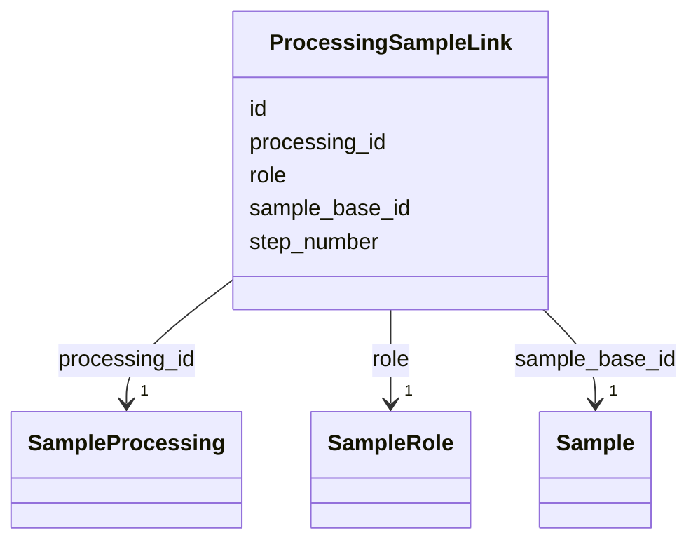

# Class: ProcessingSampleLink 


_A link between a processed sample and the sample processing activity that produced it._

_This class captures the relationship between a processed sample and the sample processing_

_activity that generated it, including the step number and role of the sample in the process._


URI: [analysis_api_schema:ProcessingSampleLink](https://w3id.org/MONet/analysis-api-schema/ProcessingSampleLink)





<!-- no inheritance hierarchy -->

## Slots

| Name | Cardinality and Range | Description | Inheritance |
| ---  | --- | --- | --- |
| [id](id.md) | 1 <br/> [Uuid](Uuid.md) |  | direct |
| [sample_base_id](sample_base_id.md) | 1 <br/> [Sample](Sample.md) |  | direct |
| [processing_id](processing_id.md) | 1 <br/> [SampleProcessing](SampleProcessing.md) |  | direct |
| [step_number](step_number.md) | 1 <br/> [Integer](Integer.md) |  | direct |
| [role](role.md) | 1 <br/> [SampleRole](SampleRole.md) |  | direct |

## Unique Keys


### unique_sample_process_step

**Unique key slots:** sample_base_id, processing_id, step_number, role


## Identifier and Mapping Information


### Schema Source


* from schema: https://w3id.org/MONet/analysis-api-schema


## Mappings

| Mapping Type | Mapped Value |
| ---  | ---  |
| self | analysis_api_schema:ProcessingSampleLink |
| native | analysis_api_schema:ProcessingSampleLink |


## LinkML Source

<!-- TODO: investigate https://stackoverflow.com/questions/37606292/how-to-create-tabbed-code-blocks-in-mkdocs-or-sphinx -->

### Direct

<details>
```yaml
name: ProcessingSampleLink
description: 'A link between a processed sample and the sample processing activity
  that produced it.

  This class captures the relationship between a processed sample and the sample processing

  activity that generated it, including the step number and role of the sample in
  the process.'
from_schema: https://w3id.org/MONet/analysis-api-schema
attributes:
  id:
    name: id
    from_schema: https://w3id.org/MONet/analysis-api-schema
    identifier: true
    domain_of:
    - Activity
    - Entity
    - DataProduct
    - DataGenerationActivity
    - DataProcessingActivity
    - AlternativeIdentifier
    - FunctionalAnnotationIdentifier
    - Instrument
    - OntologyClass
    - ContainerType
    - Custodian
    - InstrumentAlternativeIdentifier
    - LabDevice
    - SampleProcessing
    - ProcessingSampleLink
    - Configuration
    - MobilePhaseSegment
    - MassSpectrometryStandardRun
    - PurchasedMaterial
    - LabProcessingActivity
    - MAOMProduct
    - WEOMProduct
    - Site
    - Sample
    - AerosolArmSample
    - AerosolSample
    - AMP2UserSample
    - CommerciallyPurchasedSample
    - CultureEnvironmentalSample
    - EngineeredStrainSample
    - FieldDeployedTerraformSample
    - MixedCultureSample
    - MonetSoilSample
    - OtherUndescribedSample
    - PlantSample
    - PureCultureSample
    - SedimentSample
    - SoilSample
    - SynthesizedMaterialSample
    - TerraformSample
    - WaterSample
    - ProcessedSample
    - CoreSection
    - SamplingActivity
    - AerosolArmSamplingActivity
    - AerosolSamplingActivity
    - CommerciallyPurchasedSamplingActivity
    - CultureEnvironmentalSamplingActivity
    - EngineeredStrainSamplingActivity
    - FieldDeployedTerraformSamplingActivity
    - MixedCultureSamplingActivity
    - MonetSoilSamplingActivity
    - OtherUndescribedSamplingActivity
    - PlantSamplingActivity
    - PureCultureSamplingActivity
    - SedimentSamplingActivity
    - SoilSamplingActivity
    - SynthesizedMaterialSamplingActivity
    - TerraformSamplingActivity
    - WaterSamplingActivity
    - biological_entity
    - Study
    - ProjectParticipant
    - TimestampValue
    - TextValue
    - SoftwareControlledTermValue
    - ControlledTermValue
    - PersonValue
    - QuantityValue
    - ConditioningValue
    - zipDownload
    range: uuid
    required: true
  sample_base_id:
    name: sample_base_id
    from_schema: https://w3id.org/MONet/analysis-api-schema
    rank: 1000
    domain_of:
    - ProcessingSampleLink
    range: Sample
    required: true
  processing_id:
    name: processing_id
    from_schema: https://w3id.org/MONet/analysis-api-schema
    rank: 1000
    domain_of:
    - ProcessingSampleLink
    range: SampleProcessing
    required: true
  step_number:
    name: step_number
    from_schema: https://w3id.org/MONet/analysis-api-schema
    rank: 1000
    domain_of:
    - ProcessingSampleLink
    range: integer
    required: true
  role:
    name: role
    from_schema: https://w3id.org/MONet/analysis-api-schema
    rank: 1000
    domain_of:
    - ProcessingSampleLink
    - ProjectParticipant
    range: SampleRole
    required: true
unique_keys:
  unique_sample_process_step:
    unique_key_name: unique_sample_process_step
    unique_key_slots:
    - sample_base_id
    - processing_id
    - step_number
    - role

```
</details>

### Induced

<details>
```yaml
name: ProcessingSampleLink
description: 'A link between a processed sample and the sample processing activity
  that produced it.

  This class captures the relationship between a processed sample and the sample processing

  activity that generated it, including the step number and role of the sample in
  the process.'
from_schema: https://w3id.org/MONet/analysis-api-schema
attributes:
  id:
    name: id
    from_schema: https://w3id.org/MONet/analysis-api-schema
    identifier: true
    alias: id
    owner: ProcessingSampleLink
    domain_of:
    - Activity
    - Entity
    - DataProduct
    - DataGenerationActivity
    - DataProcessingActivity
    - AlternativeIdentifier
    - FunctionalAnnotationIdentifier
    - Instrument
    - OntologyClass
    - ContainerType
    - Custodian
    - InstrumentAlternativeIdentifier
    - LabDevice
    - SampleProcessing
    - ProcessingSampleLink
    - Configuration
    - MobilePhaseSegment
    - MassSpectrometryStandardRun
    - PurchasedMaterial
    - LabProcessingActivity
    - MAOMProduct
    - WEOMProduct
    - Site
    - Sample
    - AerosolArmSample
    - AerosolSample
    - AMP2UserSample
    - CommerciallyPurchasedSample
    - CultureEnvironmentalSample
    - EngineeredStrainSample
    - FieldDeployedTerraformSample
    - MixedCultureSample
    - MonetSoilSample
    - OtherUndescribedSample
    - PlantSample
    - PureCultureSample
    - SedimentSample
    - SoilSample
    - SynthesizedMaterialSample
    - TerraformSample
    - WaterSample
    - ProcessedSample
    - CoreSection
    - SamplingActivity
    - AerosolArmSamplingActivity
    - AerosolSamplingActivity
    - CommerciallyPurchasedSamplingActivity
    - CultureEnvironmentalSamplingActivity
    - EngineeredStrainSamplingActivity
    - FieldDeployedTerraformSamplingActivity
    - MixedCultureSamplingActivity
    - MonetSoilSamplingActivity
    - OtherUndescribedSamplingActivity
    - PlantSamplingActivity
    - PureCultureSamplingActivity
    - SedimentSamplingActivity
    - SoilSamplingActivity
    - SynthesizedMaterialSamplingActivity
    - TerraformSamplingActivity
    - WaterSamplingActivity
    - biological_entity
    - Study
    - ProjectParticipant
    - TimestampValue
    - TextValue
    - SoftwareControlledTermValue
    - ControlledTermValue
    - PersonValue
    - QuantityValue
    - ConditioningValue
    - zipDownload
    range: uuid
    required: true
  sample_base_id:
    name: sample_base_id
    from_schema: https://w3id.org/MONet/analysis-api-schema
    rank: 1000
    alias: sample_base_id
    owner: ProcessingSampleLink
    domain_of:
    - ProcessingSampleLink
    range: Sample
    required: true
  processing_id:
    name: processing_id
    from_schema: https://w3id.org/MONet/analysis-api-schema
    rank: 1000
    alias: processing_id
    owner: ProcessingSampleLink
    domain_of:
    - ProcessingSampleLink
    range: SampleProcessing
    required: true
  step_number:
    name: step_number
    from_schema: https://w3id.org/MONet/analysis-api-schema
    rank: 1000
    alias: step_number
    owner: ProcessingSampleLink
    domain_of:
    - ProcessingSampleLink
    range: integer
    required: true
  role:
    name: role
    from_schema: https://w3id.org/MONet/analysis-api-schema
    rank: 1000
    alias: role
    owner: ProcessingSampleLink
    domain_of:
    - ProcessingSampleLink
    - ProjectParticipant
    range: SampleRole
    required: true
unique_keys:
  unique_sample_process_step:
    unique_key_name: unique_sample_process_step
    unique_key_slots:
    - sample_base_id
    - processing_id
    - step_number
    - role

```
</details>