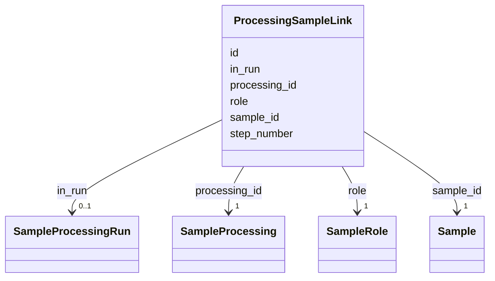

# Class: ProcessingSampleLink 


_The authoritative record of what a SampleProcessing step consumed and produced._

_One row is one directed edge between a Sample and a processing activity._

__

_This class is the ONLY place sample-to-processing edges are stored. No sample_

_or activity class carries a scalar pointer to its counterpart, so there is_

_exactly one representation of the lineage graph and no way for two encodings_

_to disagree._

__

_Direction is carried by role:_

_  role = input_sample   ->  sample_id was consumed by processing_id_

_  role = output_sample  ->  sample_id (a ProcessedSample) was produced by it_

__

_A minimal step is therefore two rows: one input edge and one output edge._

_Because role is per-row rather than per-activity, fan-in and fan-out are_

_expressed natively -- a PoolingProcess is N input rows to 1 output row, and a_

_FractionationProcess is 1 input row to N output rows. Lineage is a DAG, not a_

_chain, and this table is what makes that representable._

__

_step_number is the position of the step within its chain. It is only meaningful_

_relative to in_run, which names the chain the edge belongs to; see_

_SampleProcessingRun._


URI: [basalt_schema:ProcessingSampleLink](https://emsl-computing.github.io/BASALT-Schema/elements/ProcessingSampleLink)



```mermaid
 classDiagram
    class ProcessingSampleLink
    click ProcessingSampleLink href "../ProcessingSampleLink/"
      ProcessingSampleLink : id
        
      ProcessingSampleLink : in_run
        
          
    
        
        
        ProcessingSampleLink --> "0..1" SampleProcessingRun : in_run
        click SampleProcessingRun href "../SampleProcessingRun/"
    

        
      ProcessingSampleLink : processing_id
        
          
    
        
        
        ProcessingSampleLink --> "1" SampleProcessing : processing_id
        click SampleProcessing href "../SampleProcessing/"
    

        
      ProcessingSampleLink : role
        
          
    
        
        
        ProcessingSampleLink --> "1" SampleRole : role
        click SampleRole href "../SampleRole/"
    

        
      ProcessingSampleLink : sample_id
        
          
    
        
        
        ProcessingSampleLink --> "1" Sample : sample_id
        click Sample href "../Sample/"
    

        
      ProcessingSampleLink : step_number
        
      
```


<!-- no inheritance hierarchy -->

## Slots

| Name | Cardinality and Range | Description | Inheritance |
| ---  | --- | --- | --- |
| [in_run](in_run.md) | 0..1 <br/> [SampleProcessingRun](SampleProcessingRun.md) | The SampleProcessingRun (one concrete execution) that this edge belongs to | direct |
| [id](id.md) | 1 <br/> [Uuid](Uuid.md) |  | direct |
| [sample_id](sample_id.md) | 1 <br/> [Sample](Sample.md) |  | direct |
| [processing_id](processing_id.md) | 1 <br/> [SampleProcessing](SampleProcessing.md) |  | direct |
| [step_number](step_number.md) | 1 <br/> [Integer](Integer.md) |  | direct |
| [role](role.md) | 1 <br/> [SampleRole](SampleRole.md) | Whether sample_id was consumed by (input_sample) or produced by (output_sampl... | direct |

## Unique Keys


### unique_sample_process_step

**Unique key slots:** sample_id, processing_id, step_number, role


## Comments

* Invariant not expressible in LinkML: all rows sharing a processing_id must agree on in_run, since a step belongs to exactly one run. Enforce with a database-level check or a validation rule.


## Identifier and Mapping Information


### Schema Source


* from schema: https://emsl-computing.github.io/BASALT-Schema


## Mappings

| Mapping Type | Mapped Value |
| ---  | ---  |
| self | basalt_schema:ProcessingSampleLink |
| native | basalt_schema:ProcessingSampleLink |


## LinkML Source

<!-- TODO: investigate https://stackoverflow.com/questions/37606292/how-to-create-tabbed-code-blocks-in-mkdocs-or-sphinx -->

### Direct

<details>
```yaml
name: ProcessingSampleLink
description: "The authoritative record of what a SampleProcessing step consumed and\
  \ produced.\nOne row is one directed edge between a Sample and a processing activity.\n\
  \nThis class is the ONLY place sample-to-processing edges are stored. No sample\n\
  or activity class carries a scalar pointer to its counterpart, so there is\nexactly\
  \ one representation of the lineage graph and no way for two encodings\nto disagree.\n\
  \nDirection is carried by role:\n  role = input_sample   ->  sample_id was consumed\
  \ by processing_id\n  role = output_sample  ->  sample_id (a ProcessedSample) was\
  \ produced by it\n\nA minimal step is therefore two rows: one input edge and one\
  \ output edge.\nBecause role is per-row rather than per-activity, fan-in and fan-out\
  \ are\nexpressed natively -- a PoolingProcess is N input rows to 1 output row, and\
  \ a\nFractionationProcess is 1 input row to N output rows. Lineage is a DAG, not\
  \ a\nchain, and this table is what makes that representable.\n\nstep_number is the\
  \ position of the step within its chain. It is only meaningful\nrelative to in_run,\
  \ which names the chain the edge belongs to; see\nSampleProcessingRun."
comments:
- 'Invariant not expressible in LinkML: all rows sharing a processing_id must agree
  on in_run, since a step belongs to exactly one run. Enforce with a database-level
  check or a validation rule.'
from_schema: https://emsl-computing.github.io/BASALT-Schema
slots:
- in_run
attributes:
  id:
    name: id
    from_schema: https://emsl-computing.github.io/BASALT-Schema
    identifier: true
    domain_of:
    - Activity
    - Entity
    - DataProduct
    - DataGenerationActivity
    - DataProcessingActivity
    - AlternativeIdentifier
    - FunctionalAnnotationIdentifier
    - Instrument
    - OntologyClass
    - ContainerType
    - Custodian
    - InstrumentAlternativeIdentifier
    - LabDevice
    - SampleProcessing
    - ProcessingSampleLink
    - Configuration
    - MobilePhaseSegment
    - MassSpectrometryStandardRun
    - PurchasedMaterial
    - MAOMProduct
    - WEOMProduct
    - organism
    - Site
    - Sample
    - AerosolArmSample
    - AerosolSample
    - AMP2UserSample
    - CommerciallyPurchasedSample
    - CultureEnvironmentalSample
    - EngineeredStrainSample
    - FieldDeployedTerraformSample
    - MixedCultureSample
    - MonetSoilSample
    - OtherUndescribedSample
    - PlantSample
    - PureCultureSample
    - SedimentSample
    - SoilSample
    - SynthesizedMaterialSample
    - TerraformSample
    - WaterSample
    - ProcessedSample
    - CoreSection
    - SamplingActivity
    - AerosolArmSamplingActivity
    - AerosolSamplingActivity
    - CommerciallyPurchasedSamplingActivity
    - CultureEnvironmentalSamplingActivity
    - EngineeredStrainSamplingActivity
    - FieldDeployedTerraformSamplingActivity
    - MixedCultureSamplingActivity
    - MonetSoilSamplingActivity
    - OtherUndescribedSamplingActivity
    - PlantSamplingActivity
    - PureCultureSamplingActivity
    - SedimentSamplingActivity
    - SoilSamplingActivity
    - SynthesizedMaterialSamplingActivity
    - TerraformSamplingActivity
    - WaterSamplingActivity
    - SampleProcessingProtocol
    - SampleProcessingRun
    - Study
    - ProjectParticipant
    - TimestampValue
    - TextValue
    - SoftwareControlledTermValue
    - ControlledTermValue
    - PersonValue
    - QuantityValue
    - ConditioningValue
    - zipDownload
    range: uuid
    required: true
  sample_id:
    name: sample_id
    from_schema: https://emsl-computing.github.io/BASALT-Schema
    domain_of:
    - ProcessedData
    - ProcessingSampleLink
    - AMP2WellMetadata
    - MetagenomicsProduct
    range: Sample
    required: true
  processing_id:
    name: processing_id
    from_schema: https://emsl-computing.github.io/BASALT-Schema
    rank: 1000
    domain_of:
    - ProcessingSampleLink
    range: SampleProcessing
    required: true
  step_number:
    name: step_number
    from_schema: https://emsl-computing.github.io/BASALT-Schema
    domain_of:
    - ProcessingSampleLink
    range: integer
    required: true
  role:
    name: role
    description: Whether sample_id was consumed by (input_sample) or produced by (output_sample)
      processing_id.
    from_schema: https://emsl-computing.github.io/BASALT-Schema
    rank: 1000
    domain_of:
    - ProcessingSampleLink
    - ProjectParticipant
    range: SampleRole
    required: true
unique_keys:
  unique_sample_process_step:
    unique_key_name: unique_sample_process_step
    unique_key_slots:
    - sample_id
    - processing_id
    - step_number
    - role

```
</details>

### Induced

<details>
```yaml
name: ProcessingSampleLink
description: "The authoritative record of what a SampleProcessing step consumed and\
  \ produced.\nOne row is one directed edge between a Sample and a processing activity.\n\
  \nThis class is the ONLY place sample-to-processing edges are stored. No sample\n\
  or activity class carries a scalar pointer to its counterpart, so there is\nexactly\
  \ one representation of the lineage graph and no way for two encodings\nto disagree.\n\
  \nDirection is carried by role:\n  role = input_sample   ->  sample_id was consumed\
  \ by processing_id\n  role = output_sample  ->  sample_id (a ProcessedSample) was\
  \ produced by it\n\nA minimal step is therefore two rows: one input edge and one\
  \ output edge.\nBecause role is per-row rather than per-activity, fan-in and fan-out\
  \ are\nexpressed natively -- a PoolingProcess is N input rows to 1 output row, and\
  \ a\nFractionationProcess is 1 input row to N output rows. Lineage is a DAG, not\
  \ a\nchain, and this table is what makes that representable.\n\nstep_number is the\
  \ position of the step within its chain. It is only meaningful\nrelative to in_run,\
  \ which names the chain the edge belongs to; see\nSampleProcessingRun."
comments:
- 'Invariant not expressible in LinkML: all rows sharing a processing_id must agree
  on in_run, since a step belongs to exactly one run. Enforce with a database-level
  check or a validation rule.'
from_schema: https://emsl-computing.github.io/BASALT-Schema
attributes:
  id:
    name: id
    from_schema: https://emsl-computing.github.io/BASALT-Schema
    identifier: true
    alias: id
    owner: ProcessingSampleLink
    domain_of:
    - Activity
    - Entity
    - DataProduct
    - DataGenerationActivity
    - DataProcessingActivity
    - AlternativeIdentifier
    - FunctionalAnnotationIdentifier
    - Instrument
    - OntologyClass
    - ContainerType
    - Custodian
    - InstrumentAlternativeIdentifier
    - LabDevice
    - SampleProcessing
    - ProcessingSampleLink
    - Configuration
    - MobilePhaseSegment
    - MassSpectrometryStandardRun
    - PurchasedMaterial
    - MAOMProduct
    - WEOMProduct
    - organism
    - Site
    - Sample
    - AerosolArmSample
    - AerosolSample
    - AMP2UserSample
    - CommerciallyPurchasedSample
    - CultureEnvironmentalSample
    - EngineeredStrainSample
    - FieldDeployedTerraformSample
    - MixedCultureSample
    - MonetSoilSample
    - OtherUndescribedSample
    - PlantSample
    - PureCultureSample
    - SedimentSample
    - SoilSample
    - SynthesizedMaterialSample
    - TerraformSample
    - WaterSample
    - ProcessedSample
    - CoreSection
    - SamplingActivity
    - AerosolArmSamplingActivity
    - AerosolSamplingActivity
    - CommerciallyPurchasedSamplingActivity
    - CultureEnvironmentalSamplingActivity
    - EngineeredStrainSamplingActivity
    - FieldDeployedTerraformSamplingActivity
    - MixedCultureSamplingActivity
    - MonetSoilSamplingActivity
    - OtherUndescribedSamplingActivity
    - PlantSamplingActivity
    - PureCultureSamplingActivity
    - SedimentSamplingActivity
    - SoilSamplingActivity
    - SynthesizedMaterialSamplingActivity
    - TerraformSamplingActivity
    - WaterSamplingActivity
    - SampleProcessingProtocol
    - SampleProcessingRun
    - Study
    - ProjectParticipant
    - TimestampValue
    - TextValue
    - SoftwareControlledTermValue
    - ControlledTermValue
    - PersonValue
    - QuantityValue
    - ConditioningValue
    - zipDownload
    range: uuid
    required: true
  sample_id:
    name: sample_id
    from_schema: https://emsl-computing.github.io/BASALT-Schema
    alias: sample_id
    owner: ProcessingSampleLink
    domain_of:
    - ProcessedData
    - ProcessingSampleLink
    - AMP2WellMetadata
    - MetagenomicsProduct
    range: Sample
    required: true
  processing_id:
    name: processing_id
    from_schema: https://emsl-computing.github.io/BASALT-Schema
    rank: 1000
    alias: processing_id
    owner: ProcessingSampleLink
    domain_of:
    - ProcessingSampleLink
    range: SampleProcessing
    required: true
  step_number:
    name: step_number
    from_schema: https://emsl-computing.github.io/BASALT-Schema
    alias: step_number
    owner: ProcessingSampleLink
    domain_of:
    - ProcessingSampleLink
    range: integer
    required: true
  role:
    name: role
    description: Whether sample_id was consumed by (input_sample) or produced by (output_sample)
      processing_id.
    from_schema: https://emsl-computing.github.io/BASALT-Schema
    rank: 1000
    alias: role
    owner: ProcessingSampleLink
    domain_of:
    - ProcessingSampleLink
    - ProjectParticipant
    range: SampleRole
    required: true
  in_run:
    name: in_run
    description: 'The SampleProcessingRun (one concrete execution) that this edge
      belongs to. All ProcessingSampleLink rows in one chain share this value, which
      is what makes "give me every step of this chain" a single indexed query and
      what anchors step_number. Optional: a standalone StandardSampleProcessing needs
      no run, because its processing_id already identifies the whole group.'
    from_schema: https://emsl-computing.github.io/BASALT-Schema
    rank: 1000
    alias: in_run
    owner: ProcessingSampleLink
    domain_of:
    - ProcessingSampleLink
    range: SampleProcessingRun
unique_keys:
  unique_sample_process_step:
    unique_key_name: unique_sample_process_step
    unique_key_slots:
    - sample_id
    - processing_id
    - step_number
    - role

```
</details>