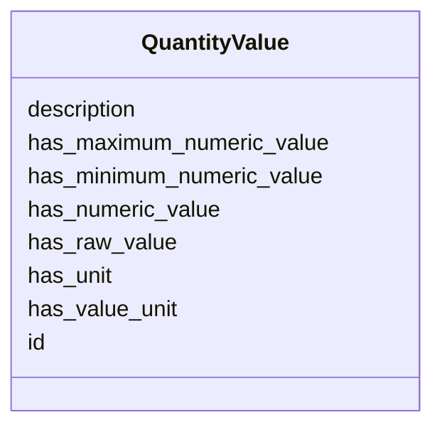

# Class: QuantityValue 


_A quantity value with numeric value and optional unit_


URI: [basalt_schema:QuantityValue](https://emsl-computing.github.io/BASALT-Schema/elements/QuantityValue)





<!-- no inheritance hierarchy -->

## Slots

| Name | Cardinality and Range | Description | Inheritance |
| ---  | --- | --- | --- |
| [description](description.md) | 0..1 <br/> [String](String.md) | Human-readable description for the entity or activity | direct |
| [id](id.md) | 1 <br/> [Uuid](Uuid.md) |  | direct |
| [has_value_unit](has_value_unit.md) | 0..1 <br/> [String](String.md) |  | direct |
| [has_unit](has_unit.md) | 0..1 <br/> [String](String.md) | The human-readable unit name | direct |
| [has_numeric_value](has_numeric_value.md) | 0..1 <br/> [Double](Double.md) | The numeric value of the quantity | direct |
| [has_minimum_numeric_value](has_minimum_numeric_value.md) | 0..1 <br/> [Double](Double.md) |  | direct |
| [has_maximum_numeric_value](has_maximum_numeric_value.md) | 0..1 <br/> [Double](Double.md) |  | direct |
| [has_raw_value](has_raw_value.md) | 0..1 <br/> [String](String.md) |  | direct |


## Usages

| used by | used in | type | used |
| ---  | --- | --- | --- |
| [ContainerType](ContainerType.md) | [container_size_id](container_size_id.md) | range | [QuantityValue](QuantityValue.md) |
| [LabDevice](LabDevice.md) | [activity_time_id](activity_time_id.md) | range | [QuantityValue](QuantityValue.md) |
| [LabDevice](LabDevice.md) | [activity_speed_id](activity_speed_id.md) | range | [QuantityValue](QuantityValue.md) |
| [BulkDensityProduct](BulkDensityProduct.md) | [bulk_density_id](bulk_density_id.md) | range | [QuantityValue](QuantityValue.md) |
| [ElementalAnalysisProduct](ElementalAnalysisProduct.md) | [total_carbon_id](total_carbon_id.md) | range | [QuantityValue](QuantityValue.md) |
| [ElementalAnalysisProduct](ElementalAnalysisProduct.md) | [total_nitrogen_id](total_nitrogen_id.md) | range | [QuantityValue](QuantityValue.md) |
| [ElementalAnalysisProduct](ElementalAnalysisProduct.md) | [total_kjeldahl_nitrogen_id](total_kjeldahl_nitrogen_id.md) | range | [QuantityValue](QuantityValue.md) |
| [ElementalAnalysisProduct](ElementalAnalysisProduct.md) | [total_sulfur_id](total_sulfur_id.md) | range | [QuantityValue](QuantityValue.md) |
| [EnzymeProduct](EnzymeProduct.md) | [beta_glucosidase_ug_pnp_per_g_per_h_id](beta_glucosidase_ug_pnp_per_g_per_h_id.md) | range | [QuantityValue](QuantityValue.md) |
| [GWCMoistureProduct](GWCMoistureProduct.md) | [gwc_percent_id](gwc_percent_id.md) | range | [QuantityValue](QuantityValue.md) |
| [IonsAnalysisProduct](IonsAnalysisProduct.md) | [sulfate_id](sulfate_id.md) | range | [QuantityValue](QuantityValue.md) |
| [IonsAnalysisProduct](IonsAnalysisProduct.md) | [boron_id](boron_id.md) | range | [QuantityValue](QuantityValue.md) |
| [IonsAnalysisProduct](IonsAnalysisProduct.md) | [zinc_id](zinc_id.md) | range | [QuantityValue](QuantityValue.md) |
| [IonsAnalysisProduct](IonsAnalysisProduct.md) | [manganate_id](manganate_id.md) | range | [QuantityValue](QuantityValue.md) |
| [IonsAnalysisProduct](IonsAnalysisProduct.md) | [copper_id](copper_id.md) | range | [QuantityValue](QuantityValue.md) |
| [IonsAnalysisProduct](IonsAnalysisProduct.md) | [iron_id](iron_id.md) | range | [QuantityValue](QuantityValue.md) |
| [IonsAnalysisProduct](IonsAnalysisProduct.md) | [calcium_id](calcium_id.md) | range | [QuantityValue](QuantityValue.md) |
| [IonsAnalysisProduct](IonsAnalysisProduct.md) | [magnesium_id](magnesium_id.md) | range | [QuantityValue](QuantityValue.md) |
| [IonsAnalysisProduct](IonsAnalysisProduct.md) | [sodium_id](sodium_id.md) | range | [QuantityValue](QuantityValue.md) |
| [IonsAnalysisProduct](IonsAnalysisProduct.md) | [potassium_id](potassium_id.md) | range | [QuantityValue](QuantityValue.md) |
| [IonsAnalysisProduct](IonsAnalysisProduct.md) | [total_bases_id](total_bases_id.md) | range | [QuantityValue](QuantityValue.md) |
| [IonsAnalysisProduct](IonsAnalysisProduct.md) | [cation_exchange_capacity_id](cation_exchange_capacity_id.md) | range | [QuantityValue](QuantityValue.md) |
| [MAOMProduct](MAOMProduct.md) | [total_organic_carbon_id](total_organic_carbon_id.md) | range | [QuantityValue](QuantityValue.md) |
| [MAOMProduct](MAOMProduct.md) | [total_nitrogen_id](total_nitrogen_id.md) | range | [QuantityValue](QuantityValue.md) |
| [MicrobialBiomassProduct](MicrobialBiomassProduct.md) | [mbc_id](mbc_id.md) | range | [QuantityValue](QuantityValue.md) |
| [MicrobialBiomassProduct](MicrobialBiomassProduct.md) | [mbn_id](mbn_id.md) | range | [QuantityValue](QuantityValue.md) |
| [NitrogenAnalysisProduct](NitrogenAnalysisProduct.md) | [no3_n_id](no3_n_id.md) | range | [QuantityValue](QuantityValue.md) |
| [NitrogenAnalysisProduct](NitrogenAnalysisProduct.md) | [nh4_n_id](nh4_n_id.md) | range | [QuantityValue](QuantityValue.md) |
| [PhosphorusAnalysisProduct](PhosphorusAnalysisProduct.md) | [phosphorus_id](phosphorus_id.md) | range | [QuantityValue](QuantityValue.md) |
| [TextureProduct](TextureProduct.md) | [sand_pct_id](sand_pct_id.md) | range | [QuantityValue](QuantityValue.md) |
| [TextureProduct](TextureProduct.md) | [silt_pct_id](silt_pct_id.md) | range | [QuantityValue](QuantityValue.md) |
| [TextureProduct](TextureProduct.md) | [clay_pct_id](clay_pct_id.md) | range | [QuantityValue](QuantityValue.md) |
| [WEOMProduct](WEOMProduct.md) | [total_organic_carbon_id](total_organic_carbon_id.md) | range | [QuantityValue](QuantityValue.md) |
| [WEOMProduct](WEOMProduct.md) | [total_nitrogen_id](total_nitrogen_id.md) | range | [QuantityValue](QuantityValue.md) |


## Identifier and Mapping Information


### Schema Source


* from schema: https://emsl-computing.github.io/BASALT-Schema


## Mappings

| Mapping Type | Mapped Value |
| ---  | ---  |
| self | basalt_schema:QuantityValue |
| native | basalt_schema:QuantityValue |


## LinkML Source

<!-- TODO: investigate https://stackoverflow.com/questions/37606292/how-to-create-tabbed-code-blocks-in-mkdocs-or-sphinx -->

### Direct

<details>
```yaml
name: QuantityValue
description: A quantity value with numeric value and optional unit
from_schema: https://emsl-computing.github.io/BASALT-Schema
slots:
- description
attributes:
  id:
    name: id
    from_schema: https://emsl-computing.github.io/BASALT-Schema/value-tables
    identifier: true
    domain_of:
    - Activity
    - Entity
    - DataProduct
    - DataGenerationActivity
    - DataProcessingActivity
    - AlternativeIdentifier
    - FunctionalAnnotationIdentifier
    - Instrument
    - OntologyClass
    - ContainerType
    - Custodian
    - InstrumentAlternativeIdentifier
    - LabDevice
    - SampleProcessing
    - ProcessingSampleLink
    - Configuration
    - MobilePhaseSegment
    - MassSpectrometryStandardRun
    - PurchasedMaterial
    - LabProcessingActivity
    - organism
    - MAOMProduct
    - WEOMProduct
    - Site
    - Sample
    - AerosolArmSample
    - AerosolSample
    - AMP2UserSample
    - CommerciallyPurchasedSample
    - CultureEnvironmentalSample
    - EngineeredStrainSample
    - FieldDeployedTerraformSample
    - MixedCultureSample
    - MonetSoilSample
    - OtherUndescribedSample
    - PlantSample
    - PureCultureSample
    - SedimentSample
    - SoilSample
    - SynthesizedMaterialSample
    - TerraformSample
    - WaterSample
    - ProcessedSample
    - CoreSection
    - SamplingActivity
    - AerosolArmSamplingActivity
    - AerosolSamplingActivity
    - CommerciallyPurchasedSamplingActivity
    - CultureEnvironmentalSamplingActivity
    - EngineeredStrainSamplingActivity
    - FieldDeployedTerraformSamplingActivity
    - MixedCultureSamplingActivity
    - MonetSoilSamplingActivity
    - OtherUndescribedSamplingActivity
    - PlantSamplingActivity
    - PureCultureSamplingActivity
    - SedimentSamplingActivity
    - SoilSamplingActivity
    - SynthesizedMaterialSamplingActivity
    - TerraformSamplingActivity
    - WaterSamplingActivity
    - Study
    - ProjectParticipant
    - TimestampValue
    - TextValue
    - SoftwareControlledTermValue
    - ControlledTermValue
    - PersonValue
    - QuantityValue
    - ConditioningValue
    - zipDownload
    range: uuid
    required: true
  has_value_unit:
    name: has_value_unit
    from_schema: https://emsl-computing.github.io/BASALT-Schema/value-tables
    rank: 1000
    domain_of:
    - QuantityValue
  has_unit:
    name: has_unit
    description: The human-readable unit name
    from_schema: https://emsl-computing.github.io/BASALT-Schema/value-tables
    rank: 1000
    domain_of:
    - QuantityValue
  has_numeric_value:
    name: has_numeric_value
    description: The numeric value of the quantity
    from_schema: https://emsl-computing.github.io/BASALT-Schema/value-tables
    rank: 1000
    domain_of:
    - QuantityValue
    range: double
  has_minimum_numeric_value:
    name: has_minimum_numeric_value
    from_schema: https://emsl-computing.github.io/BASALT-Schema/value-tables
    rank: 1000
    domain_of:
    - QuantityValue
    range: double
  has_maximum_numeric_value:
    name: has_maximum_numeric_value
    from_schema: https://emsl-computing.github.io/BASALT-Schema/value-tables
    rank: 1000
    domain_of:
    - QuantityValue
    range: double
  has_raw_value:
    name: has_raw_value
    from_schema: https://emsl-computing.github.io/BASALT-Schema/value-tables
    domain_of:
    - TimestampValue
    - TextValue
    - SoftwareControlledTermValue
    - ControlledTermValue
    - QuantityValue
    - ConditioningValue

```
</details>

### Induced

<details>
```yaml
name: QuantityValue
description: A quantity value with numeric value and optional unit
from_schema: https://emsl-computing.github.io/BASALT-Schema
attributes:
  id:
    name: id
    from_schema: https://emsl-computing.github.io/BASALT-Schema/value-tables
    identifier: true
    alias: id
    owner: QuantityValue
    domain_of:
    - Activity
    - Entity
    - DataProduct
    - DataGenerationActivity
    - DataProcessingActivity
    - AlternativeIdentifier
    - FunctionalAnnotationIdentifier
    - Instrument
    - OntologyClass
    - ContainerType
    - Custodian
    - InstrumentAlternativeIdentifier
    - LabDevice
    - SampleProcessing
    - ProcessingSampleLink
    - Configuration
    - MobilePhaseSegment
    - MassSpectrometryStandardRun
    - PurchasedMaterial
    - LabProcessingActivity
    - organism
    - MAOMProduct
    - WEOMProduct
    - Site
    - Sample
    - AerosolArmSample
    - AerosolSample
    - AMP2UserSample
    - CommerciallyPurchasedSample
    - CultureEnvironmentalSample
    - EngineeredStrainSample
    - FieldDeployedTerraformSample
    - MixedCultureSample
    - MonetSoilSample
    - OtherUndescribedSample
    - PlantSample
    - PureCultureSample
    - SedimentSample
    - SoilSample
    - SynthesizedMaterialSample
    - TerraformSample
    - WaterSample
    - ProcessedSample
    - CoreSection
    - SamplingActivity
    - AerosolArmSamplingActivity
    - AerosolSamplingActivity
    - CommerciallyPurchasedSamplingActivity
    - CultureEnvironmentalSamplingActivity
    - EngineeredStrainSamplingActivity
    - FieldDeployedTerraformSamplingActivity
    - MixedCultureSamplingActivity
    - MonetSoilSamplingActivity
    - OtherUndescribedSamplingActivity
    - PlantSamplingActivity
    - PureCultureSamplingActivity
    - SedimentSamplingActivity
    - SoilSamplingActivity
    - SynthesizedMaterialSamplingActivity
    - TerraformSamplingActivity
    - WaterSamplingActivity
    - Study
    - ProjectParticipant
    - TimestampValue
    - TextValue
    - SoftwareControlledTermValue
    - ControlledTermValue
    - PersonValue
    - QuantityValue
    - ConditioningValue
    - zipDownload
    range: uuid
    required: true
  has_value_unit:
    name: has_value_unit
    from_schema: https://emsl-computing.github.io/BASALT-Schema/value-tables
    rank: 1000
    alias: has_value_unit
    owner: QuantityValue
    domain_of:
    - QuantityValue
    range: string
  has_unit:
    name: has_unit
    description: The human-readable unit name
    from_schema: https://emsl-computing.github.io/BASALT-Schema/value-tables
    rank: 1000
    alias: has_unit
    owner: QuantityValue
    domain_of:
    - QuantityValue
    range: string
  has_numeric_value:
    name: has_numeric_value
    description: The numeric value of the quantity
    from_schema: https://emsl-computing.github.io/BASALT-Schema/value-tables
    rank: 1000
    alias: has_numeric_value
    owner: QuantityValue
    domain_of:
    - QuantityValue
    range: double
  has_minimum_numeric_value:
    name: has_minimum_numeric_value
    from_schema: https://emsl-computing.github.io/BASALT-Schema/value-tables
    rank: 1000
    alias: has_minimum_numeric_value
    owner: QuantityValue
    domain_of:
    - QuantityValue
    range: double
  has_maximum_numeric_value:
    name: has_maximum_numeric_value
    from_schema: https://emsl-computing.github.io/BASALT-Schema/value-tables
    rank: 1000
    alias: has_maximum_numeric_value
    owner: QuantityValue
    domain_of:
    - QuantityValue
    range: double
  has_raw_value:
    name: has_raw_value
    from_schema: https://emsl-computing.github.io/BASALT-Schema/value-tables
    alias: has_raw_value
    owner: QuantityValue
    domain_of:
    - TimestampValue
    - TextValue
    - SoftwareControlledTermValue
    - ControlledTermValue
    - QuantityValue
    - ConditioningValue
    range: string
  description:
    name: description
    description: Human-readable description for the entity or activity
    title: description
    from_schema: https://emsl-computing.github.io/BASALT-Schema
    rank: 1000
    alias: description
    owner: QuantityValue
    domain_of:
    - Activity
    - Entity
    - DataProduct
    - DataGenerationActivity
    - DataProcessingActivity
    - OntologyClass
    - ContainerType
    - LabDevice
    - Configuration
    - MassSpectrometryStandardRun
    - PurchasedMaterial
    - LabProcessingActivity
    - organism
    - Site
    - Sample
    - SamplingActivity
    - SoilSamplingActivity
    - Study
    - TimestampValue
    - TextValue
    - SoftwareControlledTermValue
    - ControlledTermValue
    - QuantityValue
    range: string

```
</details>