# Class: Sample 


_A physical sample collected from an environment. The environment can be ecological, laboratory, or any other context where samples are collected. This class serves as an abstract class to relate subclasses of samples._


* __NOTE__: this is an abstract class and should not be instantiated directly


URI: [analysis_api_schema:Sample](https://w3id.org/MONet/analysis-api-schema/Sample)

```mermaid
 classDiagram
    class Sample
    click Sample href "../Sample/"
      Sample <|-- AerosolArmSample
        click AerosolArmSample href "../AerosolArmSample/"
      Sample <|-- AerosolSample
        click AerosolSample href "../AerosolSample/"
      Sample <|-- AMP2UserSample
        click AMP2UserSample href "../AMP2UserSample/"
      Sample <|-- CommerciallyPurchasedSample
        click CommerciallyPurchasedSample href "../CommerciallyPurchasedSample/"
      Sample <|-- CultureEnvironmentalSample
        click CultureEnvironmentalSample href "../CultureEnvironmentalSample/"
      Sample <|-- EngineeredStrainSample
        click EngineeredStrainSample href "../EngineeredStrainSample/"
      Sample <|-- FieldDeployedTerraformSample
        click FieldDeployedTerraformSample href "../FieldDeployedTerraformSample/"
      Sample <|-- MixedCultureSample
        click MixedCultureSample href "../MixedCultureSample/"
      Sample <|-- MonetSoilSample
        click MonetSoilSample href "../MonetSoilSample/"
      Sample <|-- OtherUndescribedSample
        click OtherUndescribedSample href "../OtherUndescribedSample/"
      Sample <|-- PlantSample
        click PlantSample href "../PlantSample/"
      Sample <|-- PureCultureSample
        click PureCultureSample href "../PureCultureSample/"
      Sample <|-- SedimentSample
        click SedimentSample href "../SedimentSample/"
      Sample <|-- SoilSample
        click SoilSample href "../SoilSample/"
      Sample <|-- SynthesizedMaterialSample
        click SynthesizedMaterialSample href "../SynthesizedMaterialSample/"
      Sample <|-- TerraformSample
        click TerraformSample href "../TerraformSample/"
      Sample <|-- WaterSample
        click WaterSample href "../WaterSample/"
      Sample <|-- ProcessedSample
        click ProcessedSample href "../ProcessedSample/"
      
      Sample : description
        
      Sample : emsl_activity
        
      Sample : id
        
      Sample : lims_barcode
        
      Sample : name
        
      
```





## Inheritance
* **Sample**
    * [AerosolArmSample](AerosolArmSample.md)
    * [AerosolSample](AerosolSample.md)
    * [AMP2UserSample](AMP2UserSample.md)
    * [CommerciallyPurchasedSample](CommerciallyPurchasedSample.md)
    * [CultureEnvironmentalSample](CultureEnvironmentalSample.md)
    * [EngineeredStrainSample](EngineeredStrainSample.md)
    * [FieldDeployedTerraformSample](FieldDeployedTerraformSample.md)
    * [MixedCultureSample](MixedCultureSample.md)
    * [MonetSoilSample](MonetSoilSample.md)
    * [OtherUndescribedSample](OtherUndescribedSample.md)
    * [PlantSample](PlantSample.md)
    * [PureCultureSample](PureCultureSample.md)
    * [SedimentSample](SedimentSample.md)
    * [SoilSample](SoilSample.md)
    * [SynthesizedMaterialSample](SynthesizedMaterialSample.md)
    * [TerraformSample](TerraformSample.md)
    * [WaterSample](WaterSample.md)
    * [ProcessedSample](ProcessedSample.md)


## Slots

| Name | Cardinality and Range | Description | Inheritance |
| ---  | --- | --- | --- |
| [name](name.md) | 1 <br/> [String](String.md) | Human-readable name for the entity or activity | direct |
| [description](description.md) | 0..1 <br/> [String](String.md) | Human-readable description for the entity or activity | direct |
| [emsl_activity](emsl_activity.md) | 0..1 <br/> [String](String.md) | Nullable string linking a Sample or SamplingActivity to a named EMSL activity... | direct |
| [lims_barcode](lims_barcode.md) | 0..1 <br/> [String](String.md) | LIMS barcode identifier | direct |
| [id](id.md) | 1 <br/> [Uuid](Uuid.md) |  | direct |


## Usages

| used by | used in | type | used |
| ---  | --- | --- | --- |
| [ProcessedData](ProcessedData.md) | [sample_id](sample_id.md) | range | [Sample](Sample.md) |
| [SampleProcessing](SampleProcessing.md) | [uses_sample](uses_sample.md) | range | [Sample](Sample.md) |
| [ProcessingSampleLink](ProcessingSampleLink.md) | [sample_base_id](sample_base_id.md) | range | [Sample](Sample.md) |
| [MassSpectrometryDataProduct](MassSpectrometryDataProduct.md) | [sample_id](sample_id.md) | range | [Sample](Sample.md) |
| [MSImageProduct](MSImageProduct.md) | [sample_id](sample_id.md) | range | [Sample](Sample.md) |
| [MolecularIdentificationProduct](MolecularIdentificationProduct.md) | [sample_id](sample_id.md) | range | [Sample](Sample.md) |
| [MetaproteomicsProduct](MetaproteomicsProduct.md) | [sample_id](sample_id.md) | range | [Sample](Sample.md) |
| [MediaPreparation](MediaPreparation.md) | [uses_sample](uses_sample.md) | range | [Sample](Sample.md) |
| [CultureGrowth](CultureGrowth.md) | [uses_sample](uses_sample.md) | range | [Sample](Sample.md) |
| [StrainPurity](StrainPurity.md) | [uses_sample](uses_sample.md) | range | [Sample](Sample.md) |
| [StockCulturePreparation](StockCulturePreparation.md) | [uses_sample](uses_sample.md) | range | [Sample](Sample.md) |
| [PreCultureGrowth](PreCultureGrowth.md) | [uses_sample](uses_sample.md) | range | [Sample](Sample.md) |
| [ExperimentalCulture](ExperimentalCulture.md) | [uses_sample](uses_sample.md) | range | [Sample](Sample.md) |
| [PlateSetupActivity](PlateSetupActivity.md) | [uses_sample](uses_sample.md) | range | [Sample](Sample.md) |
| [AMP2PlateSetupActivity](AMP2PlateSetupActivity.md) | [uses_sample](uses_sample.md) | range | [Sample](Sample.md) |
| [EcoplatePlateSetupActivity](EcoplatePlateSetupActivity.md) | [uses_sample](uses_sample.md) | range | [Sample](Sample.md) |
| [MetagenomicsProduct](MetagenomicsProduct.md) | [sample_id](sample_id.md) | range | [Sample](Sample.md) |
| [MetagenomicsAnnotationProduct](MetagenomicsAnnotationProduct.md) | [sample_id](sample_id.md) | range | [Sample](Sample.md) |
| [MetagenomicsBinningProduct](MetagenomicsBinningProduct.md) | [sample_id](sample_id.md) | range | [Sample](Sample.md) |
| [MetagenomicsGenePhylogenyProduct](MetagenomicsGenePhylogenyProduct.md) | [sample_id](sample_id.md) | range | [Sample](Sample.md) |
| [BulkDensityProduct](BulkDensityProduct.md) | [sample_id](sample_id.md) | range | [Sample](Sample.md) |
| [ElementalAnalysisProduct](ElementalAnalysisProduct.md) | [sample_id](sample_id.md) | range | [Sample](Sample.md) |
| [EnzymeProduct](EnzymeProduct.md) | [sample_id](sample_id.md) | range | [Sample](Sample.md) |
| [GWCMoistureProduct](GWCMoistureProduct.md) | [sample_id](sample_id.md) | range | [Sample](Sample.md) |
| [HydraulicPropertiesProduct](HydraulicPropertiesProduct.md) | [sample_id](sample_id.md) | range | [Sample](Sample.md) |
| [IonsAnalysisProduct](IonsAnalysisProduct.md) | [sample_id](sample_id.md) | range | [Sample](Sample.md) |
| [MicrobialBiomassProduct](MicrobialBiomassProduct.md) | [sample_id](sample_id.md) | range | [Sample](Sample.md) |
| [NitrogenAnalysisProduct](NitrogenAnalysisProduct.md) | [sample_id](sample_id.md) | range | [Sample](Sample.md) |
| [PhosphorusAnalysisProduct](PhosphorusAnalysisProduct.md) | [sample_id](sample_id.md) | range | [Sample](Sample.md) |
| [RespirationProduct](RespirationProduct.md) | [sample_id](sample_id.md) | range | [Sample](Sample.md) |
| [TextureProduct](TextureProduct.md) | [sample_id](sample_id.md) | range | [Sample](Sample.md) |
| [TomographyProduct](TomographyProduct.md) | [sample_id](sample_id.md) | range | [Sample](Sample.md) |
| [PHProduct](PHProduct.md) | [sample_id](sample_id.md) | range | [Sample](Sample.md) |
| [XRayDataProduct](XRayDataProduct.md) | [sample_id](sample_id.md) | range | [Sample](Sample.md) |
| [XRFElementalProduct](XRFElementalProduct.md) | [sample_id](sample_id.md) | range | [Sample](Sample.md) |
| [XRDPhaseProduct](XRDPhaseProduct.md) | [sample_id](sample_id.md) | range | [Sample](Sample.md) |


## TODOs

* where should proposal ID live? probably not here? emsl_activity is a string referencing a campaign name. but we do need to link samples to their parent studies/projects somehow.


## Identifier and Mapping Information


### Schema Source


* from schema: https://w3id.org/MONet/analysis-api-schema


## Mappings

| Mapping Type | Mapped Value |
| ---  | ---  |
| self | analysis_api_schema:Sample |
| native | analysis_api_schema:Sample |


## LinkML Source

<!-- TODO: investigate https://stackoverflow.com/questions/37606292/how-to-create-tabbed-code-blocks-in-mkdocs-or-sphinx -->

### Direct

<details>
```yaml
name: Sample
description: A physical sample collected from an environment. The environment can
  be ecological, laboratory, or any other context where samples are collected. This
  class serves as an abstract class to relate subclasses of samples.
todos:
- where should proposal ID live? probably not here? emsl_activity is a string referencing
  a campaign name. but we do need to link samples to their parent studies/projects
  somehow.
from_schema: https://w3id.org/MONet/analysis-api-schema
abstract: true
slots:
- name
- description
- emsl_activity
- lims_barcode
attributes:
  id:
    name: id
    from_schema: https://w3id.org/MONet/analysis-api-schema/sample-classes
    identifier: true
    domain_of:
    - Activity
    - Entity
    - DataProduct
    - DataGenerationActivity
    - DataProcessingActivity
    - AlternativeIdentifier
    - FunctionalAnnotationIdentifier
    - Instrument
    - OntologyClass
    - ContainerType
    - Custodian
    - InstrumentAlternativeIdentifier
    - LabDevice
    - SampleProcessing
    - ProcessingSampleLink
    - Configuration
    - MobilePhaseSegment
    - MassSpectrometryStandardRun
    - PurchasedMaterial
    - LabProcessingActivity
    - organism
    - MAOMProduct
    - WEOMProduct
    - Site
    - Sample
    - AerosolArmSample
    - AerosolSample
    - AMP2UserSample
    - CommerciallyPurchasedSample
    - CultureEnvironmentalSample
    - EngineeredStrainSample
    - FieldDeployedTerraformSample
    - MixedCultureSample
    - MonetSoilSample
    - OtherUndescribedSample
    - PlantSample
    - PureCultureSample
    - SedimentSample
    - SoilSample
    - SynthesizedMaterialSample
    - TerraformSample
    - WaterSample
    - ProcessedSample
    - CoreSection
    - SamplingActivity
    - AerosolArmSamplingActivity
    - AerosolSamplingActivity
    - CommerciallyPurchasedSamplingActivity
    - CultureEnvironmentalSamplingActivity
    - EngineeredStrainSamplingActivity
    - FieldDeployedTerraformSamplingActivity
    - MixedCultureSamplingActivity
    - MonetSoilSamplingActivity
    - OtherUndescribedSamplingActivity
    - PlantSamplingActivity
    - PureCultureSamplingActivity
    - SedimentSamplingActivity
    - SoilSamplingActivity
    - SynthesizedMaterialSamplingActivity
    - TerraformSamplingActivity
    - WaterSamplingActivity
    - Study
    - ProjectParticipant
    - TimestampValue
    - TextValue
    - SoftwareControlledTermValue
    - ControlledTermValue
    - PersonValue
    - QuantityValue
    - ConditioningValue
    - zipDownload
    range: uuid
    required: true

```
</details>

### Induced

<details>
```yaml
name: Sample
description: A physical sample collected from an environment. The environment can
  be ecological, laboratory, or any other context where samples are collected. This
  class serves as an abstract class to relate subclasses of samples.
todos:
- where should proposal ID live? probably not here? emsl_activity is a string referencing
  a campaign name. but we do need to link samples to their parent studies/projects
  somehow.
from_schema: https://w3id.org/MONet/analysis-api-schema
abstract: true
attributes:
  id:
    name: id
    from_schema: https://w3id.org/MONet/analysis-api-schema/sample-classes
    identifier: true
    alias: id
    owner: Sample
    domain_of:
    - Activity
    - Entity
    - DataProduct
    - DataGenerationActivity
    - DataProcessingActivity
    - AlternativeIdentifier
    - FunctionalAnnotationIdentifier
    - Instrument
    - OntologyClass
    - ContainerType
    - Custodian
    - InstrumentAlternativeIdentifier
    - LabDevice
    - SampleProcessing
    - ProcessingSampleLink
    - Configuration
    - MobilePhaseSegment
    - MassSpectrometryStandardRun
    - PurchasedMaterial
    - LabProcessingActivity
    - organism
    - MAOMProduct
    - WEOMProduct
    - Site
    - Sample
    - AerosolArmSample
    - AerosolSample
    - AMP2UserSample
    - CommerciallyPurchasedSample
    - CultureEnvironmentalSample
    - EngineeredStrainSample
    - FieldDeployedTerraformSample
    - MixedCultureSample
    - MonetSoilSample
    - OtherUndescribedSample
    - PlantSample
    - PureCultureSample
    - SedimentSample
    - SoilSample
    - SynthesizedMaterialSample
    - TerraformSample
    - WaterSample
    - ProcessedSample
    - CoreSection
    - SamplingActivity
    - AerosolArmSamplingActivity
    - AerosolSamplingActivity
    - CommerciallyPurchasedSamplingActivity
    - CultureEnvironmentalSamplingActivity
    - EngineeredStrainSamplingActivity
    - FieldDeployedTerraformSamplingActivity
    - MixedCultureSamplingActivity
    - MonetSoilSamplingActivity
    - OtherUndescribedSamplingActivity
    - PlantSamplingActivity
    - PureCultureSamplingActivity
    - SedimentSamplingActivity
    - SoilSamplingActivity
    - SynthesizedMaterialSamplingActivity
    - TerraformSamplingActivity
    - WaterSamplingActivity
    - Study
    - ProjectParticipant
    - TimestampValue
    - TextValue
    - SoftwareControlledTermValue
    - ControlledTermValue
    - PersonValue
    - QuantityValue
    - ConditioningValue
    - zipDownload
    range: uuid
    required: true
  name:
    name: name
    description: Human-readable name for the entity or activity.
    from_schema: https://w3id.org/MONet/analysis-api-schema
    rank: 1000
    alias: name
    owner: Sample
    domain_of:
    - Activity
    - Entity
    - DataProduct
    - DataGenerationActivity
    - Instrument
    - OntologyClass
    - ContainerAxis
    - Configuration
    - MobilePhaseSegment
    - MassSpectrometryStandardRun
    - PurchasedMaterial
    - LabProcessingActivity
    - organism
    - Site
    - Sample
    - SamplingActivity
    - SoilSamplingActivity
    - Study
    - SoftwareControlledTermValue
    range: string
    required: true
  description:
    name: description
    description: Human-readable description for the entity or activity
    title: description
    from_schema: https://w3id.org/MONet/analysis-api-schema
    rank: 1000
    alias: description
    owner: Sample
    domain_of:
    - Activity
    - Entity
    - DataProduct
    - DataGenerationActivity
    - DataProcessingActivity
    - OntologyClass
    - ContainerType
    - LabDevice
    - Configuration
    - MassSpectrometryStandardRun
    - PurchasedMaterial
    - LabProcessingActivity
    - organism
    - Site
    - Sample
    - SamplingActivity
    - SoilSamplingActivity
    - Study
    - TimestampValue
    - TextValue
    - SoftwareControlledTermValue
    - ControlledTermValue
    - QuantityValue
    range: string
  emsl_activity:
    name: emsl_activity
    description: 'Nullable string linking a Sample or SamplingActivity to a named
      EMSL activity or

      campaign (e.g., ''AMP2'', ''MONet_FY26''). Optional for historical records

      predating activity tracking.'
    todos:
    - Is sampling activity where we want to capture this?
    from_schema: https://w3id.org/MONet/analysis-api-schema
    rank: 1000
    alias: emsl_activity
    owner: Sample
    domain_of:
    - Sample
    - SamplingActivity
    range: string
    required: false
  lims_barcode:
    name: lims_barcode
    description: LIMS barcode identifier
    from_schema: https://w3id.org/MONet/analysis-api-schema
    rank: 1000
    alias: lims_barcode
    owner: Sample
    domain_of:
    - ProcessedData
    - Sample
    range: string
    required: false

```
</details>