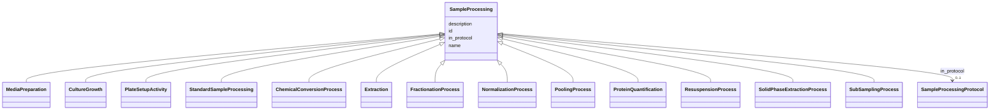

# Class: SampleProcessing 


_Abstract base for any sample processing activity (physical to physical): one_

_laboratory step that consumes one or more Samples and produces one or more_

_ProcessedSamples. Concrete protocol-specific subclasses use is_a: SampleProcessing._

__

_This class deliberately carries NO pointers to the samples it consumed or_

_produced. Those edges live exclusively in ProcessingSampleLink, which records_

_direction via its role slot. See that class for the rationale._

__

_Protocol identity (URL, version) is likewise NOT stored here. A step points at_

_a SampleProcessingProtocol record via in_protocol, which is the single home for_

_protocol_url and protocol_version._


* __NOTE__: this is an abstract class and should not be instantiated directly


URI: [basalt_schema:SampleProcessing](https://emsl-computing.github.io/BASALT-Schema/elements/SampleProcessing)



```mermaid
 classDiagram
    class SampleProcessing
    click SampleProcessing href "../SampleProcessing/"
      SampleProcessing <|-- MediaPreparation
        click MediaPreparation href "../MediaPreparation/"
      SampleProcessing <|-- CultureGrowth
        click CultureGrowth href "../CultureGrowth/"
      SampleProcessing <|-- PlateSetupActivity
        click PlateSetupActivity href "../PlateSetupActivity/"
      SampleProcessing <|-- StandardSampleProcessing
        click StandardSampleProcessing href "../StandardSampleProcessing/"
      SampleProcessing <|-- ChemicalConversionProcess
        click ChemicalConversionProcess href "../ChemicalConversionProcess/"
      SampleProcessing <|-- Extraction
        click Extraction href "../Extraction/"
      SampleProcessing <|-- FractionationProcess
        click FractionationProcess href "../FractionationProcess/"
      SampleProcessing <|-- NormalizationProcess
        click NormalizationProcess href "../NormalizationProcess/"
      SampleProcessing <|-- PoolingProcess
        click PoolingProcess href "../PoolingProcess/"
      SampleProcessing <|-- ProteinQuantification
        click ProteinQuantification href "../ProteinQuantification/"
      SampleProcessing <|-- ResuspensionProcess
        click ResuspensionProcess href "../ResuspensionProcess/"
      SampleProcessing <|-- SolidPhaseExtractionProcess
        click SolidPhaseExtractionProcess href "../SolidPhaseExtractionProcess/"
      SampleProcessing <|-- SubSamplingProcess
        click SubSamplingProcess href "../SubSamplingProcess/"
      
      SampleProcessing : description
        
      SampleProcessing : id
        
      SampleProcessing : in_protocol
        
          
    
        
        
        SampleProcessing --> "0..1" SampleProcessingProtocol : in_protocol
        click SampleProcessingProtocol href "../SampleProcessingProtocol/"
    

        
      SampleProcessing : name
        
      
```


## Inheritance
* **SampleProcessing**
    * [MediaPreparation](MediaPreparation.md)
    * [CultureGrowth](CultureGrowth.md) [ [HasIncubationConditions](HasIncubationConditions.md)]
    * [PlateSetupActivity](PlateSetupActivity.md) [ [HasIncubationConditions](HasIncubationConditions.md)]
    * [StandardSampleProcessing](StandardSampleProcessing.md)
    * [ChemicalConversionProcess](ChemicalConversionProcess.md)
    * [Extraction](Extraction.md)
    * [FractionationProcess](FractionationProcess.md)
    * [NormalizationProcess](NormalizationProcess.md)
    * [PoolingProcess](PoolingProcess.md)
    * [ProteinQuantification](ProteinQuantification.md)
    * [ResuspensionProcess](ResuspensionProcess.md)
    * [SolidPhaseExtractionProcess](SolidPhaseExtractionProcess.md)
    * [SubSamplingProcess](SubSamplingProcess.md)


## Slots

| Name | Cardinality and Range | Description | Inheritance |
| ---  | --- | --- | --- |
| [name](name.md) | 1 <br/> [String](String.md) | Human-readable name for the entity or activity | direct |
| [description](description.md) | 0..1 <br/> [String](String.md) | Human-readable description for the entity or activity | direct |
| [in_protocol](in_protocol.md) | 0..1 <br/> [SampleProcessingProtocol](SampleProcessingProtocol.md) | The SampleProcessingProtocol (the recipe) that this step follows | direct |
| [id](id.md) | 1 <br/> [Uuid](Uuid.md) |  | direct |


## Usages

| used by | used in | type | used |
| ---  | --- | --- | --- |
| [ProcessingSampleLink](ProcessingSampleLink.md) | [processing_id](processing_id.md) | range | [SampleProcessing](SampleProcessing.md) |


## Identifier and Mapping Information


### Schema Source


* from schema: https://emsl-computing.github.io/BASALT-Schema


## Mappings

| Mapping Type | Mapped Value |
| ---  | ---  |
| self | basalt_schema:SampleProcessing |
| native | basalt_schema:SampleProcessing |


## LinkML Source

<!-- TODO: investigate https://stackoverflow.com/questions/37606292/how-to-create-tabbed-code-blocks-in-mkdocs-or-sphinx -->

### Direct

<details>
```yaml
name: SampleProcessing
description: 'Abstract base for any sample processing activity (physical to physical):
  one

  laboratory step that consumes one or more Samples and produces one or more

  ProcessedSamples. Concrete protocol-specific subclasses use is_a: SampleProcessing.


  This class deliberately carries NO pointers to the samples it consumed or

  produced. Those edges live exclusively in ProcessingSampleLink, which records

  direction via its role slot. See that class for the rationale.


  Protocol identity (URL, version) is likewise NOT stored here. A step points at

  a SampleProcessingProtocol record via in_protocol, which is the single home for

  protocol_url and protocol_version.'
from_schema: https://emsl-computing.github.io/BASALT-Schema
abstract: true
slots:
- name
- description
- in_protocol
attributes:
  id:
    name: id
    from_schema: https://emsl-computing.github.io/BASALT-Schema
    identifier: true
    domain_of:
    - Activity
    - Entity
    - DataProduct
    - DataGenerationActivity
    - DataProcessingActivity
    - AlternativeIdentifier
    - FunctionalAnnotationIdentifier
    - Instrument
    - OntologyClass
    - ContainerType
    - Custodian
    - InstrumentAlternativeIdentifier
    - LabDevice
    - SampleProcessing
    - ProcessingSampleLink
    - Configuration
    - MobilePhaseSegment
    - MassSpectrometryStandardRun
    - PurchasedMaterial
    - MAOMProduct
    - WEOMProduct
    - organism
    - Site
    - Sample
    - AerosolArmSample
    - AerosolSample
    - AMP2UserSample
    - CommerciallyPurchasedSample
    - CultureEnvironmentalSample
    - EngineeredStrainSample
    - FieldDeployedTerraformSample
    - MixedCultureSample
    - MonetSoilSample
    - OtherUndescribedSample
    - PlantSample
    - PureCultureSample
    - SedimentSample
    - SoilSample
    - SynthesizedMaterialSample
    - TerraformSample
    - WaterSample
    - ProcessedSample
    - CoreSection
    - SamplingActivity
    - AerosolArmSamplingActivity
    - AerosolSamplingActivity
    - CommerciallyPurchasedSamplingActivity
    - CultureEnvironmentalSamplingActivity
    - EngineeredStrainSamplingActivity
    - FieldDeployedTerraformSamplingActivity
    - MixedCultureSamplingActivity
    - MonetSoilSamplingActivity
    - OtherUndescribedSamplingActivity
    - PlantSamplingActivity
    - PureCultureSamplingActivity
    - SedimentSamplingActivity
    - SoilSamplingActivity
    - SynthesizedMaterialSamplingActivity
    - TerraformSamplingActivity
    - WaterSamplingActivity
    - SampleProcessingProtocol
    - SampleProcessingRun
    - Study
    - ProjectParticipant
    - TimestampValue
    - TextValue
    - SoftwareControlledTermValue
    - ControlledTermValue
    - PersonValue
    - QuantityValue
    - ConditioningValue
    - zipDownload
    range: uuid
    required: true

```
</details>

### Induced

<details>
```yaml
name: SampleProcessing
description: 'Abstract base for any sample processing activity (physical to physical):
  one

  laboratory step that consumes one or more Samples and produces one or more

  ProcessedSamples. Concrete protocol-specific subclasses use is_a: SampleProcessing.


  This class deliberately carries NO pointers to the samples it consumed or

  produced. Those edges live exclusively in ProcessingSampleLink, which records

  direction via its role slot. See that class for the rationale.


  Protocol identity (URL, version) is likewise NOT stored here. A step points at

  a SampleProcessingProtocol record via in_protocol, which is the single home for

  protocol_url and protocol_version.'
from_schema: https://emsl-computing.github.io/BASALT-Schema
abstract: true
attributes:
  id:
    name: id
    from_schema: https://emsl-computing.github.io/BASALT-Schema
    identifier: true
    alias: id
    owner: SampleProcessing
    domain_of:
    - Activity
    - Entity
    - DataProduct
    - DataGenerationActivity
    - DataProcessingActivity
    - AlternativeIdentifier
    - FunctionalAnnotationIdentifier
    - Instrument
    - OntologyClass
    - ContainerType
    - Custodian
    - InstrumentAlternativeIdentifier
    - LabDevice
    - SampleProcessing
    - ProcessingSampleLink
    - Configuration
    - MobilePhaseSegment
    - MassSpectrometryStandardRun
    - PurchasedMaterial
    - MAOMProduct
    - WEOMProduct
    - organism
    - Site
    - Sample
    - AerosolArmSample
    - AerosolSample
    - AMP2UserSample
    - CommerciallyPurchasedSample
    - CultureEnvironmentalSample
    - EngineeredStrainSample
    - FieldDeployedTerraformSample
    - MixedCultureSample
    - MonetSoilSample
    - OtherUndescribedSample
    - PlantSample
    - PureCultureSample
    - SedimentSample
    - SoilSample
    - SynthesizedMaterialSample
    - TerraformSample
    - WaterSample
    - ProcessedSample
    - CoreSection
    - SamplingActivity
    - AerosolArmSamplingActivity
    - AerosolSamplingActivity
    - CommerciallyPurchasedSamplingActivity
    - CultureEnvironmentalSamplingActivity
    - EngineeredStrainSamplingActivity
    - FieldDeployedTerraformSamplingActivity
    - MixedCultureSamplingActivity
    - MonetSoilSamplingActivity
    - OtherUndescribedSamplingActivity
    - PlantSamplingActivity
    - PureCultureSamplingActivity
    - SedimentSamplingActivity
    - SoilSamplingActivity
    - SynthesizedMaterialSamplingActivity
    - TerraformSamplingActivity
    - WaterSamplingActivity
    - SampleProcessingProtocol
    - SampleProcessingRun
    - Study
    - ProjectParticipant
    - TimestampValue
    - TextValue
    - SoftwareControlledTermValue
    - ControlledTermValue
    - PersonValue
    - QuantityValue
    - ConditioningValue
    - zipDownload
    range: uuid
    required: true
  name:
    name: name
    description: Human-readable name for the entity or activity.
    from_schema: https://emsl-computing.github.io/BASALT-Schema
    rank: 1000
    alias: name
    owner: SampleProcessing
    domain_of:
    - Activity
    - Entity
    - DataProduct
    - DataGenerationActivity
    - Instrument
    - OntologyClass
    - ContainerAxis
    - SampleProcessing
    - Configuration
    - MobilePhaseSegment
    - MassSpectrometryStandardRun
    - PurchasedMaterial
    - organism
    - Site
    - Sample
    - SamplingActivity
    - SoilSamplingActivity
    - SampleProcessingProtocol
    - SampleProcessingRun
    - Study
    - SoftwareControlledTermValue
    range: string
    required: true
  description:
    name: description
    description: Human-readable description for the entity or activity
    title: description
    from_schema: https://emsl-computing.github.io/BASALT-Schema
    rank: 1000
    alias: description
    owner: SampleProcessing
    domain_of:
    - Activity
    - Entity
    - DataProduct
    - DataGenerationActivity
    - DataProcessingActivity
    - OntologyClass
    - ContainerType
    - LabDevice
    - SampleProcessing
    - Configuration
    - MassSpectrometryStandardRun
    - PurchasedMaterial
    - organism
    - Site
    - Sample
    - SamplingActivity
    - SoilSamplingActivity
    - SampleProcessingProtocol
    - SampleProcessingRun
    - Study
    - TimestampValue
    - TextValue
    - SoftwareControlledTermValue
    - ControlledTermValue
    - QuantityValue
    range: string
  in_protocol:
    name: in_protocol
    description: 'The SampleProcessingProtocol (the recipe) that this step follows.
      Type-level, not instance-level: every execution of the same SOP points at the
      same record, so this does NOT identify a particular chain. Use in_run for that.
      A chain may mix protocols, so this is recorded per step rather than per run.'
    from_schema: https://emsl-computing.github.io/BASALT-Schema
    rank: 1000
    alias: in_protocol
    owner: SampleProcessing
    domain_of:
    - SampleProcessing
    range: SampleProcessingProtocol

```
</details>