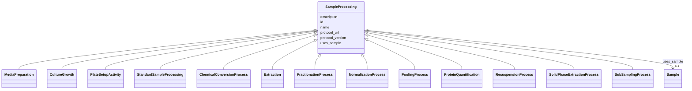

# Class: SampleProcessing 


_Abstract base for any sample processing activity (physical to physical). Input data should _

_be specified on workflow subclasses. Concrete protocol-specific subclasses use is_a: SampleProcessing._


* __NOTE__: this is an abstract class and should not be instantiated directly


URI: [basalt_schema:SampleProcessing](https://emsl-computing.github.io/BASALT-Schema/elements/SampleProcessing)



```mermaid
 classDiagram
    class SampleProcessing
    click SampleProcessing href "../SampleProcessing/"
      SampleProcessing <|-- MediaPreparation
        click MediaPreparation href "../MediaPreparation/"
      SampleProcessing <|-- CultureGrowth
        click CultureGrowth href "../CultureGrowth/"
      SampleProcessing <|-- PlateSetupActivity
        click PlateSetupActivity href "../PlateSetupActivity/"
      SampleProcessing <|-- StandardSampleProcessing
        click StandardSampleProcessing href "../StandardSampleProcessing/"
      SampleProcessing <|-- ChemicalConversionProcess
        click ChemicalConversionProcess href "../ChemicalConversionProcess/"
      SampleProcessing <|-- Extraction
        click Extraction href "../Extraction/"
      SampleProcessing <|-- FractionationProcess
        click FractionationProcess href "../FractionationProcess/"
      SampleProcessing <|-- NormalizationProcess
        click NormalizationProcess href "../NormalizationProcess/"
      SampleProcessing <|-- PoolingProcess
        click PoolingProcess href "../PoolingProcess/"
      SampleProcessing <|-- ProteinQuantification
        click ProteinQuantification href "../ProteinQuantification/"
      SampleProcessing <|-- ResuspensionProcess
        click ResuspensionProcess href "../ResuspensionProcess/"
      SampleProcessing <|-- SolidPhaseExtractionProcess
        click SolidPhaseExtractionProcess href "../SolidPhaseExtractionProcess/"
      SampleProcessing <|-- SubSamplingProcess
        click SubSamplingProcess href "../SubSamplingProcess/"
      
      SampleProcessing : description
        
      SampleProcessing : id
        
      SampleProcessing : name
        
      SampleProcessing : protocol_url
        
      SampleProcessing : protocol_version
        
      SampleProcessing : uses_sample
        
          
    
        
        
        SampleProcessing --> "0..1" Sample : uses_sample
        click Sample href "../Sample/"
    

        
      
```


## Inheritance
* **SampleProcessing**
    * [MediaPreparation](MediaPreparation.md)
    * [CultureGrowth](CultureGrowth.md) [ [HasIncubationConditions](HasIncubationConditions.md)]
    * [PlateSetupActivity](PlateSetupActivity.md) [ [HasIncubationConditions](HasIncubationConditions.md)]
    * [StandardSampleProcessing](StandardSampleProcessing.md)
    * [ChemicalConversionProcess](ChemicalConversionProcess.md)
    * [Extraction](Extraction.md)
    * [FractionationProcess](FractionationProcess.md)
    * [NormalizationProcess](NormalizationProcess.md)
    * [PoolingProcess](PoolingProcess.md)
    * [ProteinQuantification](ProteinQuantification.md)
    * [ResuspensionProcess](ResuspensionProcess.md)
    * [SolidPhaseExtractionProcess](SolidPhaseExtractionProcess.md)
    * [SubSamplingProcess](SubSamplingProcess.md)


## Slots

| Name | Cardinality and Range | Description | Inheritance |
| ---  | --- | --- | --- |
| [name](name.md) | 1 <br/> [String](String.md) | Human-readable name for the entity or activity | direct |
| [description](description.md) | 0..1 <br/> [String](String.md) | Human-readable description for the entity or activity | direct |
| [protocol_url](protocol_url.md) | 0..1 <br/> [String](String.md) | URL pointing to the protocol used in the activity, if applicable | direct |
| [protocol_version](protocol_version.md) | 0..1 <br/> [String](String.md) | Version of the protocol used in the activity, if applicable | direct |
| [uses_sample](uses_sample.md) | 0..1 <br/> [Sample](Sample.md) | The starting sample that is being processed or analyzed | direct |
| [id](id.md) | 1 <br/> [Uuid](Uuid.md) |  | direct |


## Usages

| used by | used in | type | used |
| ---  | --- | --- | --- |
| [ProcessingSampleLink](ProcessingSampleLink.md) | [processing_id](processing_id.md) | range | [SampleProcessing](SampleProcessing.md) |
| [ProcessedSample](ProcessedSample.md) | [sampled_during](sampled_during.md) | range | [SampleProcessing](SampleProcessing.md) |
| [CoreSection](CoreSection.md) | [sampled_during](sampled_during.md) | range | [SampleProcessing](SampleProcessing.md) |


## Identifier and Mapping Information


### Schema Source


* from schema: https://emsl-computing.github.io/BASALT-Schema


## Mappings

| Mapping Type | Mapped Value |
| ---  | ---  |
| self | basalt_schema:SampleProcessing |
| native | basalt_schema:SampleProcessing |


## LinkML Source

<!-- TODO: investigate https://stackoverflow.com/questions/37606292/how-to-create-tabbed-code-blocks-in-mkdocs-or-sphinx -->

### Direct

<details>
```yaml
name: SampleProcessing
description: "Abstract base for any sample processing activity (physical to physical).\
  \ Input data should \nbe specified on workflow subclasses. Concrete protocol-specific\
  \ subclasses use is_a: SampleProcessing."
from_schema: https://emsl-computing.github.io/BASALT-Schema
abstract: true
slots:
- name
- description
- protocol_url
- protocol_version
- uses_sample
attributes:
  id:
    name: id
    from_schema: https://emsl-computing.github.io/BASALT-Schema
    identifier: true
    domain_of:
    - Activity
    - Entity
    - DataProduct
    - DataGenerationActivity
    - DataProcessingActivity
    - AlternativeIdentifier
    - FunctionalAnnotationIdentifier
    - Instrument
    - OntologyClass
    - ContainerType
    - Custodian
    - InstrumentAlternativeIdentifier
    - LabDevice
    - SampleProcessing
    - ProcessingSampleLink
    - Configuration
    - MobilePhaseSegment
    - MassSpectrometryStandardRun
    - PurchasedMaterial
    - LabProcessingActivity
    - MAOMProduct
    - WEOMProduct
    - organism
    - Site
    - Sample
    - AerosolArmSample
    - AerosolSample
    - AMP2UserSample
    - CommerciallyPurchasedSample
    - CultureEnvironmentalSample
    - EngineeredStrainSample
    - FieldDeployedTerraformSample
    - MixedCultureSample
    - MonetSoilSample
    - OtherUndescribedSample
    - PlantSample
    - PureCultureSample
    - SedimentSample
    - SoilSample
    - SynthesizedMaterialSample
    - TerraformSample
    - WaterSample
    - ProcessedSample
    - CoreSection
    - SamplingActivity
    - AerosolArmSamplingActivity
    - AerosolSamplingActivity
    - CommerciallyPurchasedSamplingActivity
    - CultureEnvironmentalSamplingActivity
    - EngineeredStrainSamplingActivity
    - FieldDeployedTerraformSamplingActivity
    - MixedCultureSamplingActivity
    - MonetSoilSamplingActivity
    - OtherUndescribedSamplingActivity
    - PlantSamplingActivity
    - PureCultureSamplingActivity
    - SedimentSamplingActivity
    - SoilSamplingActivity
    - SynthesizedMaterialSamplingActivity
    - TerraformSamplingActivity
    - WaterSamplingActivity
    - SampleProcessingProtocol
    - Study
    - ProjectParticipant
    - TimestampValue
    - TextValue
    - SoftwareControlledTermValue
    - ControlledTermValue
    - PersonValue
    - QuantityValue
    - ConditioningValue
    - zipDownload
    range: uuid
    required: true

```
</details>

### Induced

<details>
```yaml
name: SampleProcessing
description: "Abstract base for any sample processing activity (physical to physical).\
  \ Input data should \nbe specified on workflow subclasses. Concrete protocol-specific\
  \ subclasses use is_a: SampleProcessing."
from_schema: https://emsl-computing.github.io/BASALT-Schema
abstract: true
attributes:
  id:
    name: id
    from_schema: https://emsl-computing.github.io/BASALT-Schema
    identifier: true
    alias: id
    owner: SampleProcessing
    domain_of:
    - Activity
    - Entity
    - DataProduct
    - DataGenerationActivity
    - DataProcessingActivity
    - AlternativeIdentifier
    - FunctionalAnnotationIdentifier
    - Instrument
    - OntologyClass
    - ContainerType
    - Custodian
    - InstrumentAlternativeIdentifier
    - LabDevice
    - SampleProcessing
    - ProcessingSampleLink
    - Configuration
    - MobilePhaseSegment
    - MassSpectrometryStandardRun
    - PurchasedMaterial
    - LabProcessingActivity
    - MAOMProduct
    - WEOMProduct
    - organism
    - Site
    - Sample
    - AerosolArmSample
    - AerosolSample
    - AMP2UserSample
    - CommerciallyPurchasedSample
    - CultureEnvironmentalSample
    - EngineeredStrainSample
    - FieldDeployedTerraformSample
    - MixedCultureSample
    - MonetSoilSample
    - OtherUndescribedSample
    - PlantSample
    - PureCultureSample
    - SedimentSample
    - SoilSample
    - SynthesizedMaterialSample
    - TerraformSample
    - WaterSample
    - ProcessedSample
    - CoreSection
    - SamplingActivity
    - AerosolArmSamplingActivity
    - AerosolSamplingActivity
    - CommerciallyPurchasedSamplingActivity
    - CultureEnvironmentalSamplingActivity
    - EngineeredStrainSamplingActivity
    - FieldDeployedTerraformSamplingActivity
    - MixedCultureSamplingActivity
    - MonetSoilSamplingActivity
    - OtherUndescribedSamplingActivity
    - PlantSamplingActivity
    - PureCultureSamplingActivity
    - SedimentSamplingActivity
    - SoilSamplingActivity
    - SynthesizedMaterialSamplingActivity
    - TerraformSamplingActivity
    - WaterSamplingActivity
    - SampleProcessingProtocol
    - Study
    - ProjectParticipant
    - TimestampValue
    - TextValue
    - SoftwareControlledTermValue
    - ControlledTermValue
    - PersonValue
    - QuantityValue
    - ConditioningValue
    - zipDownload
    range: uuid
    required: true
  name:
    name: name
    description: Human-readable name for the entity or activity.
    from_schema: https://emsl-computing.github.io/BASALT-Schema
    rank: 1000
    alias: name
    owner: SampleProcessing
    domain_of:
    - Activity
    - Entity
    - DataProduct
    - DataGenerationActivity
    - Instrument
    - OntologyClass
    - ContainerAxis
    - SampleProcessing
    - Configuration
    - MobilePhaseSegment
    - MassSpectrometryStandardRun
    - PurchasedMaterial
    - LabProcessingActivity
    - organism
    - Site
    - Sample
    - SamplingActivity
    - SoilSamplingActivity
    - SampleProcessingProtocol
    - Study
    - SoftwareControlledTermValue
    range: string
    required: true
  description:
    name: description
    description: Human-readable description for the entity or activity
    title: description
    from_schema: https://emsl-computing.github.io/BASALT-Schema
    rank: 1000
    alias: description
    owner: SampleProcessing
    domain_of:
    - Activity
    - Entity
    - DataProduct
    - DataGenerationActivity
    - DataProcessingActivity
    - OntologyClass
    - ContainerType
    - LabDevice
    - SampleProcessing
    - Configuration
    - MassSpectrometryStandardRun
    - PurchasedMaterial
    - LabProcessingActivity
    - organism
    - Site
    - Sample
    - SamplingActivity
    - SoilSamplingActivity
    - SampleProcessingProtocol
    - Study
    - TimestampValue
    - TextValue
    - SoftwareControlledTermValue
    - ControlledTermValue
    - QuantityValue
    range: string
  protocol_url:
    name: protocol_url
    description: URL pointing to the protocol used in the activity, if applicable.
    from_schema: https://emsl-computing.github.io/BASALT-Schema
    rank: 1000
    alias: protocol_url
    owner: SampleProcessing
    domain_of:
    - DataGenerationActivity
    - SampleProcessing
    - SampleProcessingProtocol
    range: string
  protocol_version:
    name: protocol_version
    description: Version of the protocol used in the activity, if applicable.
    from_schema: https://emsl-computing.github.io/BASALT-Schema
    rank: 1000
    alias: protocol_version
    owner: SampleProcessing
    domain_of:
    - DataGenerationActivity
    - SampleProcessing
    - SampleProcessingProtocol
    range: string
  uses_sample:
    name: uses_sample
    description: The starting sample that is being processed or analyzed. This slot
      should only be used on an Activity class.
    from_schema: https://emsl-computing.github.io/BASALT-Schema
    rank: 1000
    alias: uses_sample
    owner: SampleProcessing
    domain_of:
    - SampleProcessing
    range: Sample

```
</details>