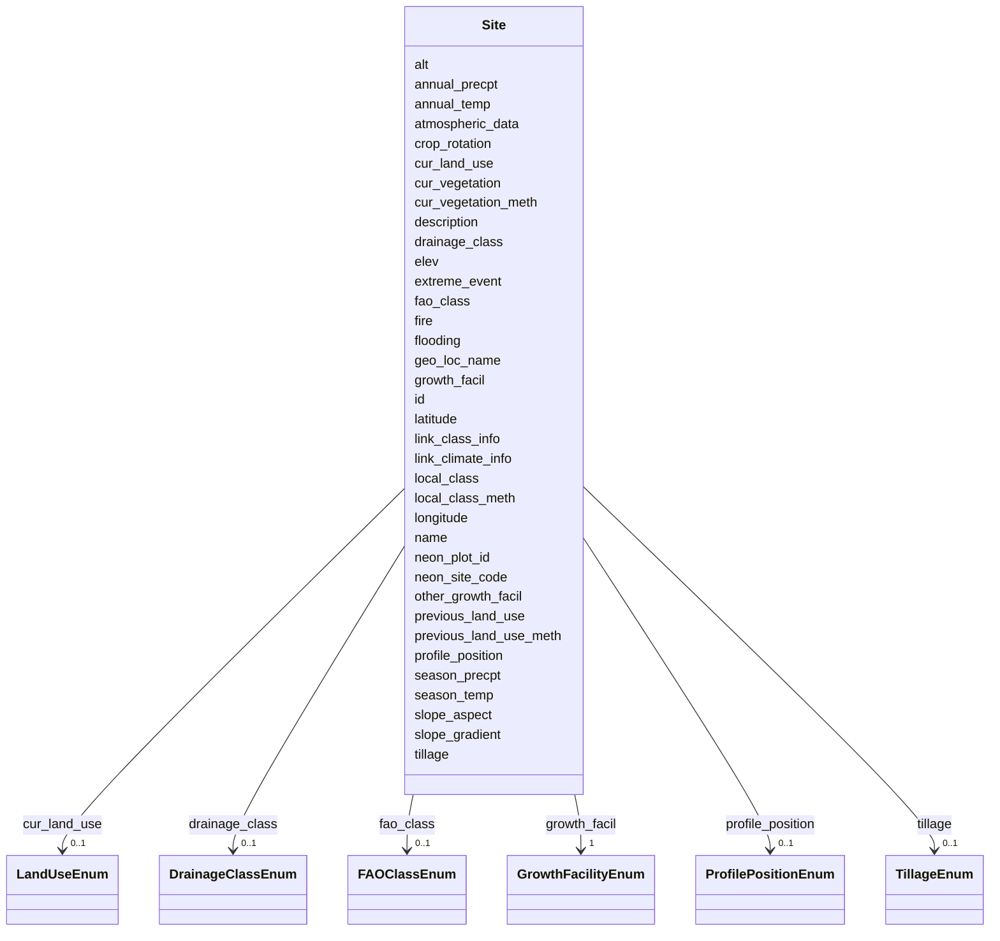

# Class: Site 


_Site-level metadata for a specific location from which a set of samples are collected._


URI: [basalt_schema:Site](https://w3id.org/MONet/basalt-schema/Site)





<!-- no inheritance hierarchy -->

## Slots

| Name | Cardinality and Range | Description | Inheritance |
| ---  | --- | --- | --- |
| [name](name.md) | 1 <br/> [String](String.md) | Human-readable name for the entity or activity | direct |
| [description](description.md) | 0..1 <br/> [String](String.md) | Human-readable description for the entity or activity | direct |
| [alt](alt.md) | 0..1 <br/> [String](String.md) | Heights of objects such as airplanes, space shuttles, rockets, atmospheric ba... | direct |
| [annual_precpt](annual_precpt.md) | 0..1 <br/> [String](String.md) | The average of all annual precipitation values known or an estimated equivale... | direct |
| [annual_temp](annual_temp.md) | 0..1 <br/> [String](String.md) | Mean annual temperature (Unit: C) | direct |
| [atmospheric_data](atmospheric_data.md) | 0..1 <br/> [String](String.md) | Measurement of atmospheric data; can include multiple data | direct |
| [crop_rotation](crop_rotation.md) | 0..1 <br/> [String](String.md) | Whether or not crop is rotated, and if yes, rotation schedule | direct |
| [cur_land_use](cur_land_use.md) | 0..1 <br/> [LandUseEnum](LandUseEnum.md) | Present state of sample site | direct |
| [cur_vegetation](cur_vegetation.md) | 0..1 <br/> [String](String.md) | Vegetation classification from one or more standard classification systems, o... | direct |
| [cur_vegetation_meth](cur_vegetation_meth.md) | 0..1 <br/> [String](String.md) | Reference or method used in vegetation classification | direct |
| [drainage_class](drainage_class.md) | 0..1 <br/> [DrainageClassEnum](DrainageClassEnum.md) | Drainage classification from a standard system such as the USDA system | direct |
| [elev](elev.md) | 1 <br/> [String](String.md) | Elevation of the sampling site is its height above a fixed reference point, m... | direct |
| [extreme_event](extreme_event.md) | 0..1 <br/> [String](String.md) | Unusual physical events that may have affected microbial populations | direct |
| [fao_class](fao_class.md) | 0..1 <br/> [FAOClassEnum](FAOClassEnum.md) | Soil classification from the FAO World soil distribution from International S... | direct |
| [fire](fire.md) | 0..1 <br/> [String](String.md) | Historical and/or physical evidence of fire | direct |
| [flooding](flooding.md) | 0..1 <br/> [String](String.md) | Historical and/or physical evidence of flooding | direct |
| [geo_loc_name](geo_loc_name.md) | 1 <br/> [String](String.md) | The geographical origin of the sample as defined by the country or sea name f... | direct |
| [growth_facil](growth_facil.md) | 1 <br/> [GrowthFacilityEnum](GrowthFacilityEnum.md) | Type of facility or location from where the sample was collected or | direct |
| [latitude](latitude.md) | 1 <br/> [Double](Double.md) | Latitude coordinate of the sampling site in WSG 84 format | direct |
| [link_climate_info](link_climate_info.md) | 0..1 <br/> [String](String.md) | Link to climate resource | direct |
| [link_class_info](link_class_info.md) | 0..1 <br/> [String](String.md) | Link to digitized soil maps or other soil classification information | direct |
| [local_class](local_class.md) | 0..1 <br/> [String](String.md) | Soil classification based on local soil classification system | direct |
| [local_class_meth](local_class_meth.md) | 0..1 <br/> [String](String.md) | Reference or method used in determining the local soil classification | direct |
| [longitude](longitude.md) | 1 <br/> [Double](Double.md) | Longitude coordinate of the sampling site in WSG 84 format | direct |
| [neon_site_code](neon_site_code.md) | 0..1 <br/> [String](String.md) | When sampling from a NEON site provide the 4 letter site code (Example: DEJU) | direct |
| [neon_plot_id](neon_plot_id.md) | 0..1 <br/> [String](String.md) | When sampling from a NEON site provide the plot ID from which you sampled | direct |
| [other_growth_facil](other_growth_facil.md) | 0..1 <br/> [String](String.md) | Please specify growth facility if you selected 'other' | direct |
| [previous_land_use](previous_land_use.md) | 0..1 <br/> [String](String.md) | Previous land use and dates | direct |
| [previous_land_use_meth](previous_land_use_meth.md) | 0..1 <br/> [String](String.md) | Reference or method used in determining previous land use and dates | direct |
| [profile_position](profile_position.md) | 0..1 <br/> [ProfilePositionEnum](ProfilePositionEnum.md) | Cross-sectional position in the hillslope where sample was collected | direct |
| [season_precpt](season_precpt.md) | 0..1 <br/> [String](String.md) | The average of all seasonal precipitation values known or an estimated equiva... | direct |
| [season_temp](season_temp.md) | 0..1 <br/> [String](String.md) | Mean seasonal temperature (Unit: C) | direct |
| [slope_aspect](slope_aspect.md) | 0..1 <br/> [String](String.md) | The direction a slope faces | direct |
| [slope_gradient](slope_gradient.md) | 0..1 <br/> [String](String.md) | Commonly called 'slope' | direct |
| [tillage](tillage.md) | 0..1 <br/> [TillageEnum](TillageEnum.md) | Note method(s) used for tilling | direct |
| [id](id.md) | 1 <br/> [Uuid](Uuid.md) |  | direct |


## Usages

| used by | used in | type | used |
| ---  | --- | --- | --- |
| [SamplingActivity](SamplingActivity.md) | [sampled_at_site](sampled_at_site.md) | range | [Site](Site.md) |
| [AerosolArmSamplingActivity](AerosolArmSamplingActivity.md) | [sampled_at_site](sampled_at_site.md) | range | [Site](Site.md) |
| [AerosolSamplingActivity](AerosolSamplingActivity.md) | [sampled_at_site](sampled_at_site.md) | range | [Site](Site.md) |
| [CommerciallyPurchasedSamplingActivity](CommerciallyPurchasedSamplingActivity.md) | [sampled_at_site](sampled_at_site.md) | range | [Site](Site.md) |
| [CultureEnvironmentalSamplingActivity](CultureEnvironmentalSamplingActivity.md) | [sampled_at_site](sampled_at_site.md) | range | [Site](Site.md) |
| [EngineeredStrainSamplingActivity](EngineeredStrainSamplingActivity.md) | [sampled_at_site](sampled_at_site.md) | range | [Site](Site.md) |
| [FieldDeployedTerraformSamplingActivity](FieldDeployedTerraformSamplingActivity.md) | [sampled_at_site](sampled_at_site.md) | range | [Site](Site.md) |
| [MixedCultureSamplingActivity](MixedCultureSamplingActivity.md) | [sampled_at_site](sampled_at_site.md) | range | [Site](Site.md) |
| [MonetSoilSamplingActivity](MonetSoilSamplingActivity.md) | [sampled_at_site](sampled_at_site.md) | range | [Site](Site.md) |
| [OtherUndescribedSamplingActivity](OtherUndescribedSamplingActivity.md) | [sampled_at_site](sampled_at_site.md) | range | [Site](Site.md) |
| [PlantSamplingActivity](PlantSamplingActivity.md) | [sampled_at_site](sampled_at_site.md) | range | [Site](Site.md) |
| [PureCultureSamplingActivity](PureCultureSamplingActivity.md) | [sampled_at_site](sampled_at_site.md) | range | [Site](Site.md) |
| [SedimentSamplingActivity](SedimentSamplingActivity.md) | [sampled_at_site](sampled_at_site.md) | range | [Site](Site.md) |
| [SoilSamplingActivity](SoilSamplingActivity.md) | [sampled_at_site](sampled_at_site.md) | range | [Site](Site.md) |
| [SynthesizedMaterialSamplingActivity](SynthesizedMaterialSamplingActivity.md) | [sampled_at_site](sampled_at_site.md) | range | [Site](Site.md) |
| [TerraformSamplingActivity](TerraformSamplingActivity.md) | [sampled_at_site](sampled_at_site.md) | range | [Site](Site.md) |
| [WaterSamplingActivity](WaterSamplingActivity.md) | [sampled_at_site](sampled_at_site.md) | range | [Site](Site.md) |


## TODOs

* If we only have one Site class, we can't require Site slots based on sample type. We could add this in the submission schema JSON conversion perhaps.
* fao_class - can this vary within a site or change with time?


## Identifier and Mapping Information


### Schema Source


* from schema: https://w3id.org/MONet/basalt-schema


## Mappings

| Mapping Type | Mapped Value |
| ---  | ---  |
| self | basalt_schema:Site |
| native | basalt_schema:Site |


## LinkML Source

<!-- TODO: investigate https://stackoverflow.com/questions/37606292/how-to-create-tabbed-code-blocks-in-mkdocs-or-sphinx -->

### Direct

<details>
```yaml
name: Site
description: Site-level metadata for a specific location from which a set of samples
  are collected.
todos:
- If we only have one Site class, we can't require Site slots based on sample type.
  We could add this in the submission schema JSON conversion perhaps.
- fao_class - can this vary within a site or change with time?
from_schema: https://w3id.org/MONet/basalt-schema
slots:
- name
- description
- alt
- annual_precpt
- annual_temp
- atmospheric_data
- crop_rotation
- cur_land_use
- cur_vegetation
- cur_vegetation_meth
- drainage_class
- elev
- extreme_event
- fao_class
- fire
- flooding
- geo_loc_name
- growth_facil
- latitude
- link_climate_info
- link_class_info
- local_class
- local_class_meth
- longitude
- neon_site_code
- neon_plot_id
- other_growth_facil
- previous_land_use
- previous_land_use_meth
- profile_position
- season_precpt
- season_temp
- slope_aspect
- slope_gradient
- tillage
slot_usage:
  elev:
    name: elev
    todos:
    - should this be required for all sample types though? probably not.
    required: true
  geo_loc_name:
    name: geo_loc_name
    required: true
  growth_facil:
    name: growth_facil
    required: true
  latitude:
    name: latitude
    required: true
  longitude:
    name: longitude
    required: true
attributes:
  id:
    name: id
    from_schema: https://w3id.org/MONet/basalt-schema/sample-classes
    identifier: true
    domain_of:
    - Activity
    - Entity
    - DataProduct
    - DataGenerationActivity
    - DataProcessingActivity
    - AlternativeIdentifier
    - FunctionalAnnotationIdentifier
    - Instrument
    - OntologyClass
    - ContainerType
    - Custodian
    - InstrumentAlternativeIdentifier
    - LabDevice
    - SampleProcessing
    - ProcessingSampleLink
    - Configuration
    - MobilePhaseSegment
    - MassSpectrometryStandardRun
    - PurchasedMaterial
    - LabProcessingActivity
    - organism
    - MAOMProduct
    - WEOMProduct
    - Site
    - Sample
    - AerosolArmSample
    - AerosolSample
    - AMP2UserSample
    - CommerciallyPurchasedSample
    - CultureEnvironmentalSample
    - EngineeredStrainSample
    - FieldDeployedTerraformSample
    - MixedCultureSample
    - MonetSoilSample
    - OtherUndescribedSample
    - PlantSample
    - PureCultureSample
    - SedimentSample
    - SoilSample
    - SynthesizedMaterialSample
    - TerraformSample
    - WaterSample
    - ProcessedSample
    - CoreSection
    - SamplingActivity
    - AerosolArmSamplingActivity
    - AerosolSamplingActivity
    - CommerciallyPurchasedSamplingActivity
    - CultureEnvironmentalSamplingActivity
    - EngineeredStrainSamplingActivity
    - FieldDeployedTerraformSamplingActivity
    - MixedCultureSamplingActivity
    - MonetSoilSamplingActivity
    - OtherUndescribedSamplingActivity
    - PlantSamplingActivity
    - PureCultureSamplingActivity
    - SedimentSamplingActivity
    - SoilSamplingActivity
    - SynthesizedMaterialSamplingActivity
    - TerraformSamplingActivity
    - WaterSamplingActivity
    - Study
    - ProjectParticipant
    - TimestampValue
    - TextValue
    - SoftwareControlledTermValue
    - ControlledTermValue
    - PersonValue
    - QuantityValue
    - ConditioningValue
    - zipDownload
    range: uuid
    required: true

```
</details>

### Induced

<details>
```yaml
name: Site
description: Site-level metadata for a specific location from which a set of samples
  are collected.
todos:
- If we only have one Site class, we can't require Site slots based on sample type.
  We could add this in the submission schema JSON conversion perhaps.
- fao_class - can this vary within a site or change with time?
from_schema: https://w3id.org/MONet/basalt-schema
slot_usage:
  elev:
    name: elev
    todos:
    - should this be required for all sample types though? probably not.
    required: true
  geo_loc_name:
    name: geo_loc_name
    required: true
  growth_facil:
    name: growth_facil
    required: true
  latitude:
    name: latitude
    required: true
  longitude:
    name: longitude
    required: true
attributes:
  id:
    name: id
    from_schema: https://w3id.org/MONet/basalt-schema/sample-classes
    identifier: true
    alias: id
    owner: Site
    domain_of:
    - Activity
    - Entity
    - DataProduct
    - DataGenerationActivity
    - DataProcessingActivity
    - AlternativeIdentifier
    - FunctionalAnnotationIdentifier
    - Instrument
    - OntologyClass
    - ContainerType
    - Custodian
    - InstrumentAlternativeIdentifier
    - LabDevice
    - SampleProcessing
    - ProcessingSampleLink
    - Configuration
    - MobilePhaseSegment
    - MassSpectrometryStandardRun
    - PurchasedMaterial
    - LabProcessingActivity
    - organism
    - MAOMProduct
    - WEOMProduct
    - Site
    - Sample
    - AerosolArmSample
    - AerosolSample
    - AMP2UserSample
    - CommerciallyPurchasedSample
    - CultureEnvironmentalSample
    - EngineeredStrainSample
    - FieldDeployedTerraformSample
    - MixedCultureSample
    - MonetSoilSample
    - OtherUndescribedSample
    - PlantSample
    - PureCultureSample
    - SedimentSample
    - SoilSample
    - SynthesizedMaterialSample
    - TerraformSample
    - WaterSample
    - ProcessedSample
    - CoreSection
    - SamplingActivity
    - AerosolArmSamplingActivity
    - AerosolSamplingActivity
    - CommerciallyPurchasedSamplingActivity
    - CultureEnvironmentalSamplingActivity
    - EngineeredStrainSamplingActivity
    - FieldDeployedTerraformSamplingActivity
    - MixedCultureSamplingActivity
    - MonetSoilSamplingActivity
    - OtherUndescribedSamplingActivity
    - PlantSamplingActivity
    - PureCultureSamplingActivity
    - SedimentSamplingActivity
    - SoilSamplingActivity
    - SynthesizedMaterialSamplingActivity
    - TerraformSamplingActivity
    - WaterSamplingActivity
    - Study
    - ProjectParticipant
    - TimestampValue
    - TextValue
    - SoftwareControlledTermValue
    - ControlledTermValue
    - PersonValue
    - QuantityValue
    - ConditioningValue
    - zipDownload
    range: uuid
    required: true
  name:
    name: name
    description: Human-readable name for the entity or activity.
    from_schema: https://w3id.org/MONet/basalt-schema
    rank: 1000
    alias: name
    owner: Site
    domain_of:
    - Activity
    - Entity
    - DataProduct
    - DataGenerationActivity
    - Instrument
    - OntologyClass
    - ContainerAxis
    - Configuration
    - MobilePhaseSegment
    - MassSpectrometryStandardRun
    - PurchasedMaterial
    - LabProcessingActivity
    - organism
    - Site
    - Sample
    - SamplingActivity
    - SoilSamplingActivity
    - Study
    - SoftwareControlledTermValue
    range: string
    required: true
  description:
    name: description
    description: Human-readable description for the entity or activity
    title: description
    from_schema: https://w3id.org/MONet/basalt-schema
    rank: 1000
    alias: description
    owner: Site
    domain_of:
    - Activity
    - Entity
    - DataProduct
    - DataGenerationActivity
    - DataProcessingActivity
    - OntologyClass
    - ContainerType
    - LabDevice
    - Configuration
    - MassSpectrometryStandardRun
    - PurchasedMaterial
    - LabProcessingActivity
    - organism
    - Site
    - Sample
    - SamplingActivity
    - SoilSamplingActivity
    - Study
    - TimestampValue
    - TextValue
    - SoftwareControlledTermValue
    - ControlledTermValue
    - QuantityValue
    range: string
  alt:
    name: alt
    description: 'Heights of objects such as airplanes, space shuttles, rockets, atmospheric
      balloons and heights of places such as atmospheric layers and clouds. It is
      used to measure the height of an object which is above the earth''s surface.
      In this context, the altitude measurement is the vertical distance between the
      earth''s surface above sea level and the sampled position in the air. For ARM
      this can be a range. (Unit: m)'
    title: altitude
    from_schema: https://w3id.org/MONet/basalt-schema
    rank: 1000
    alias: alt
    owner: Site
    domain_of:
    - Site
    range: string
    pattern: ^\d+(\.\d+)?m(?:-\d+(\.\d+)?m)?$
  annual_precpt:
    name: annual_precpt
    description: 'The average of all annual precipitation values known or an estimated
      equivalent value derived by such methods as regional indexes or Isohyetal maps.
      (Unit: mm)'
    title: mean annual precipitation
    from_schema: https://w3id.org/MONet/basalt-schema
    aliases:
    - average annual precipitation
    rank: 1000
    alias: annual_precpt
    owner: Site
    domain_of:
    - Site
    range: string
    pattern: ^\d+(\.\d+)?\s*mm$
  annual_temp:
    name: annual_temp
    description: 'Mean annual temperature (Unit: C)'
    title: mean annual temperature
    from_schema: https://w3id.org/MONet/basalt-schema
    aliases:
    - average annual temperature
    rank: 1000
    alias: annual_temp
    owner: Site
    domain_of:
    - Site
    range: string
    pattern: ^-?\d+(\.\d+)?\s*C$
  atmospheric_data:
    name: atmospheric_data
    description: Measurement of atmospheric data; can include multiple data
    title: atmospheric data
    from_schema: https://w3id.org/MONet/basalt-schema
    rank: 1000
    alias: atmospheric_data
    owner: Site
    domain_of:
    - Site
    range: string
  crop_rotation:
    name: crop_rotation
    description: Whether or not crop is rotated, and if yes, rotation schedule
    title: crop rotation
    from_schema: https://w3id.org/MONet/basalt-schema
    rank: 1000
    alias: crop_rotation
    owner: Site
    domain_of:
    - Site
    range: string
  cur_land_use:
    name: cur_land_use
    description: 'Present state of sample site. This slot is NOT multivalued. Valid
      entries: badlands, cities, conifers, crop trees, farmstead, gravel, hardwoods,
      hayland, horticultural plants, industrial areas, intermixed, marshlands, meadows,
      mines, quarries, mudflats, oil waste, pastureland, permanent snow or ice, rainforest,
      rangeland, roads, railroads, rock, row crops, saline seeps, salt flats, sand,
      shrub crops, shrub land, small grains, successional shrub land, swamp, tropical,
      tundra, vegetable crops, vine crops'
    title: current land use
    from_schema: https://w3id.org/MONet/basalt-schema
    rank: 1000
    alias: cur_land_use
    owner: Site
    domain_of:
    - Site
    range: LandUseEnum
  cur_vegetation:
    name: cur_vegetation
    description: Vegetation classification from one or more standard classification
      systems, or agricultural crop
    title: current vegetation
    from_schema: https://w3id.org/MONet/basalt-schema
    rank: 1000
    alias: cur_vegetation
    owner: Site
    domain_of:
    - Site
    range: string
  cur_vegetation_meth:
    name: cur_vegetation_meth
    description: Reference or method used in vegetation classification
    title: current vegetation method
    from_schema: https://w3id.org/MONet/basalt-schema
    rank: 1000
    alias: cur_vegetation_meth
    owner: Site
    domain_of:
    - Site
    range: string
  drainage_class:
    name: drainage_class
    description: Drainage classification from a standard system such as the USDA system
    title: drainage class
    from_schema: https://w3id.org/MONet/basalt-schema
    rank: 1000
    alias: drainage_class
    owner: Site
    domain_of:
    - Site
    range: DrainageClassEnum
  elev:
    name: elev
    description: 'Elevation of the sampling site is its height above a fixed reference
      point, most commonly the mean sea level. Elevation is mainly used when referring
      to points on the earth''s surface. (Unit: m).'
    title: elevation
    todos:
    - should this be required for all sample types though? probably not.
    from_schema: https://w3id.org/MONet/basalt-schema
    rank: 1000
    alias: elev
    owner: Site
    domain_of:
    - Site
    range: string
    required: true
    pattern: ^\d+(\.\d+)?\s*m$
  extreme_event:
    name: extreme_event
    description: 'Unusual physical events that may have affected microbial populations.
      Format: YYYY-MM-DD'
    title: extreme event
    from_schema: https://w3id.org/MONet/basalt-schema
    rank: 1000
    alias: extreme_event
    owner: Site
    domain_of:
    - Site
    range: string
    pattern: ^[12]\d{3}(?:(?:-(?:0[1-9]|1[0-2]))(?:-(?:0[1-9]|[12]\d|3[01]))?)?$
  fao_class:
    name: fao_class
    description: Soil classification from the FAO World soil distribution from International
      Soil Reference and Information Centre (ISRIC). The list of available soil classifications
      can be found at https://www.isric.org/explore/world-soil-distribution
    title: FAO soil taxonomy classification
    from_schema: https://w3id.org/MONet/basalt-schema
    rank: 1000
    alias: fao_class
    owner: Site
    domain_of:
    - Site
    range: FAOClassEnum
  fire:
    name: fire
    description: 'Historical and/or physical evidence of fire. Format: YYYY-MM-DD'
    title: fire
    from_schema: https://w3id.org/MONet/basalt-schema
    rank: 1000
    alias: fire
    owner: Site
    domain_of:
    - Site
    range: string
    pattern: ^[12]\d{3}(?:(?:-(?:0[1-9]|1[0-2]))(?:-(?:0[1-9]|[12]\d|3[01]))?)?$
  flooding:
    name: flooding
    description: 'Historical and/or physical evidence of flooding. Format: YYYY-MM-DD'
    title: flooding
    from_schema: https://w3id.org/MONet/basalt-schema
    rank: 1000
    alias: flooding
    owner: Site
    domain_of:
    - Site
    range: string
    pattern: ^[12]\d{3}(?:(?:-(?:0[1-9]|1[0-2]))(?:-(?:0[1-9]|[12]\d|3[01]))?)?$
  geo_loc_name:
    name: geo_loc_name
    description: 'The geographical origin of the sample as defined by the country
      or sea name followed by specific region name and site. Formatted as [Country
      or sea names: region or state, site]'
    title: geographic location name
    from_schema: https://w3id.org/MONet/basalt-schema
    rank: 1000
    alias: geo_loc_name
    owner: Site
    domain_of:
    - Site
    range: string
    required: true
    pattern: ^([^\s-]{12}|[^\s-]+.+[^\s-]+):\s?([^\s-]{12}|[^\s-]+.+[^\s-]+)\s?([^\s-]{12}|[^\s-]+.+[^\s-]+)$
  growth_facil:
    name: growth_facil
    description: 'Type of facility or location from where the sample was collected
      or

      grown. This field is NOT multivalued. If selecting other, add the `other_growth_facil`

      attribute to provide additional detail.'
    title: growth facility
    from_schema: https://w3id.org/MONet/basalt-schema
    rank: 1000
    alias: growth_facil
    owner: Site
    domain_of:
    - Site
    - AMP2UserSample
    range: GrowthFacilityEnum
    required: true
  latitude:
    name: latitude
    description: Latitude coordinate of the sampling site in WSG 84 format.
    title: latitude
    from_schema: https://w3id.org/MONet/basalt-schema
    broad_mappings:
    - MIXS:0000009
    rank: 1000
    alias: latitude
    owner: Site
    domain_of:
    - Site
    - AerosolArmSample
    - AerosolSample
    - CultureEnvironmentalSample
    - FieldDeployedTerraformSample
    - MonetSoilSample
    - OtherUndescribedSample
    - PlantSample
    - SedimentSample
    - SoilSample
    - WaterSample
    range: double
    required: true
  link_climate_info:
    name: link_climate_info
    description: Link to climate resource
    title: link to climate information
    from_schema: https://w3id.org/MONet/basalt-schema
    rank: 1000
    alias: link_climate_info
    owner: Site
    domain_of:
    - Site
    range: string
  link_class_info:
    name: link_class_info
    description: Link to digitized soil maps or other soil classification information
    title: link to soil classification
    from_schema: https://w3id.org/MONet/basalt-schema
    rank: 1000
    alias: link_class_info
    owner: Site
    domain_of:
    - Site
    range: string
  local_class:
    name: local_class
    description: Soil classification based on local soil classification system
    title: local soil classification
    from_schema: https://w3id.org/MONet/basalt-schema
    rank: 1000
    alias: local_class
    owner: Site
    domain_of:
    - Site
    range: string
  local_class_meth:
    name: local_class_meth
    description: Reference or method used in determining the local soil classification
    title: local soil classification method
    from_schema: https://w3id.org/MONet/basalt-schema
    rank: 1000
    alias: local_class_meth
    owner: Site
    domain_of:
    - Site
    range: string
  longitude:
    name: longitude
    description: Longitude coordinate of the sampling site in WSG 84 format.
    title: longitude
    from_schema: https://w3id.org/MONet/basalt-schema
    broad_mappings:
    - MIXS:0000009
    rank: 1000
    alias: longitude
    owner: Site
    domain_of:
    - Site
    - AerosolArmSample
    - AerosolSample
    - CultureEnvironmentalSample
    - FieldDeployedTerraformSample
    - MonetSoilSample
    - OtherUndescribedSample
    - PlantSample
    - SedimentSample
    - SoilSample
    - WaterSample
    range: double
    required: true
  neon_site_code:
    name: neon_site_code
    description: 'When sampling from a NEON site provide the 4 letter site code (Example:
      DEJU). If you do not have your NEON site use the code SITE_999.'
    title: neon site code
    from_schema: https://w3id.org/MONet/basalt-schema
    rank: 1000
    alias: neon_site_code
    owner: Site
    domain_of:
    - Site
    range: string
    pattern: ^[A-Z]{4}$
  neon_plot_id:
    name: neon_plot_id
    description: 'When sampling from a NEON site provide the plot ID from which you
      sampled. This includes the 4 letter site code followed by the 3 digit ID (Example:
      DEJU_048). If you do not have your NEON site use the code SITE_999.'
    title: neon plot identifier
    todos:
    - subport mapping - this is submitted as ABCD_123 but we want to store it as neon_site_code
      and neon_plot_id separately
    from_schema: https://w3id.org/MONet/basalt-schema
    rank: 1000
    alias: neon_plot_id
    owner: Site
    domain_of:
    - Site
    range: string
    pattern: ^[A-Z]{4}_\d{3}$
  other_growth_facil:
    name: other_growth_facil
    description: Please specify growth facility if you selected 'other'
    title: other growth facility
    from_schema: https://w3id.org/MONet/basalt-schema
    rank: 1000
    alias: other_growth_facil
    owner: Site
    domain_of:
    - Site
    range: string
  previous_land_use:
    name: previous_land_use
    description: Previous land use and dates
    title: previous land use
    from_schema: https://w3id.org/MONet/basalt-schema
    rank: 1000
    alias: previous_land_use
    owner: Site
    domain_of:
    - Site
    range: string
  previous_land_use_meth:
    name: previous_land_use_meth
    description: Reference or method used in determining previous land use and dates
    title: previous land use method
    from_schema: https://w3id.org/MONet/basalt-schema
    rank: 1000
    alias: previous_land_use_meth
    owner: Site
    domain_of:
    - Site
    range: string
  profile_position:
    name: profile_position
    description: Cross-sectional position in the hillslope where sample was collected.
      Sample area position in relation to surrounding areas
    title: profile position
    from_schema: https://w3id.org/MONet/basalt-schema
    rank: 1000
    alias: profile_position
    owner: Site
    domain_of:
    - Site
    range: ProfilePositionEnum
  season_precpt:
    name: season_precpt
    description: 'The average of all seasonal precipitation values known or an estimated
      equivalent value derived by such methods as regional indexes or Isohyetal maps.
      (Unit: mm)'
    title: mean seasonal precipitation
    from_schema: https://w3id.org/MONet/basalt-schema
    aliases:
    - average seasonal precipitation
    rank: 1000
    alias: season_precpt
    owner: Site
    domain_of:
    - Site
    range: string
    pattern: ^\d+(\.\d+)?\s*mm$
  season_temp:
    name: season_temp
    description: 'Mean seasonal temperature (Unit: C)'
    title: mean seasonal temperature
    from_schema: https://w3id.org/MONet/basalt-schema
    aliases:
    - average seasonal precipitation
    rank: 1000
    alias: season_temp
    owner: Site
    domain_of:
    - Site
    range: string
    pattern: ^-?\d+(\.\d+)?\s*C$
  slope_aspect:
    name: slope_aspect
    description: 'The direction a slope faces. While looking down a slope use a compass
      to record the direction you are facing (degrees); e.g. 315 degrees. This measure
      provides an indication of sun and wind exposure that will influence soil temperature
      and evapotranspiration. (Unit: degrees)'
    title: slope aspect
    from_schema: https://w3id.org/MONet/basalt-schema
    rank: 1000
    alias: slope_aspect
    owner: Site
    domain_of:
    - Site
    range: string
    pattern: ^\d+(\.\d+)?\s*degrees$
  slope_gradient:
    name: slope_gradient
    description: 'Commonly called ''slope''. The angle between ground surface and
      a horizontal line (in percent). This is the direction that overland water would
      flow. This measure is usually taken with a hand level meter or clinometer. (Unit:
      percent)'
    title: slope gradient
    from_schema: https://w3id.org/MONet/basalt-schema
    rank: 1000
    alias: slope_gradient
    owner: Site
    domain_of:
    - Site
    range: string
    pattern: ^\d+(\.\d+)?\s*percent$
  tillage:
    name: tillage
    description: Note method(s) used for tilling
    title: tillage
    from_schema: https://w3id.org/MONet/basalt-schema
    rank: 1000
    alias: tillage
    owner: Site
    domain_of:
    - Site
    range: TillageEnum

```
</details>