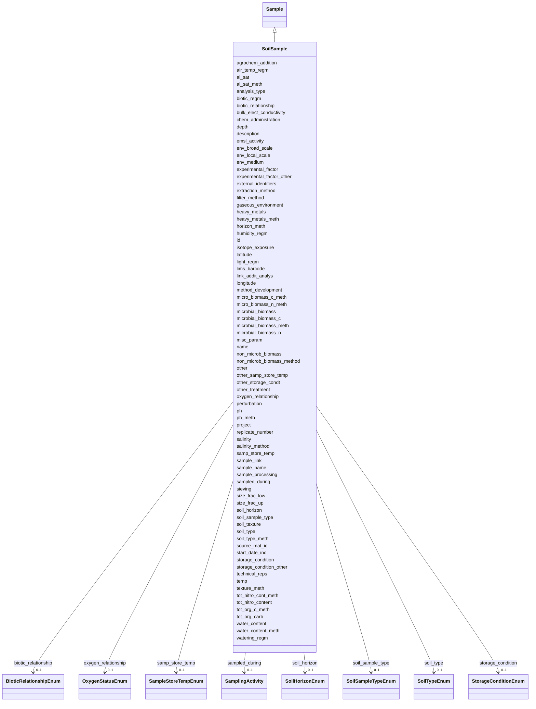

# Class: SoilSample 


_A sample of soil collected from the environment._


URI: [basalt_schema:SoilSample](https://w3id.org/MONet/basalt-schema/SoilSample)





## Inheritance
* [Sample](Sample.md)
    * **SoilSample**


## Slots

| Name | Cardinality and Range | Description | Inheritance |
| ---  | --- | --- | --- |
| [agrochem_addition](agrochem_addition.md) | 0..1 <br/> [String](String.md) | Addition of fertilizers, pesticides, etc | direct |
| [air_temp_regm](air_temp_regm.md) | 0..1 <br/> [String](String.md) | Information about treatment involving an exposure to varying temperatures; sh... | direct |
| [al_sat](al_sat.md) | 0..1 <br/> [String](String.md) | Aluminum saturation (esp | direct |
| [al_sat_meth](al_sat_meth.md) | 0..1 <br/> [String](String.md) | Reference or method used in determining Al saturation | direct |
| [analysis_type](analysis_type.md) | 1 <br/> [String](String.md) | The type(s) of analysis planned for this sample | direct |
| [biotic_regm](biotic_regm.md) | 0..1 <br/> [String](String.md) | Information about treatment(s) involving use of biotic factors such as bacter... | direct |
| [bulk_elect_conductivity](bulk_elect_conductivity.md) | 0..1 <br/> [String](String.md) | Electrical conductivity is a measure of the bulk soil ability to carry electr... | direct |
| [chem_administration](chem_administration.md) | 0..1 <br/> [String](String.md) | List of chemical compounds administered to the host or site where sampling oc... | direct |
| [depth](depth.md) | 1 <br/> [String](String.md) | The vertical distance below local surface | direct |
| [env_broad_scale](env_broad_scale.md) | 0..1 <br/> [String](String.md) | 'Report the major environmental system the sample or specimen came from | direct |
| [env_local_scale](env_local_scale.md) | 0..1 <br/> [String](String.md) | 'Report the entity which are in your sample or specimens local vicinity and w... | direct |
| [env_medium](env_medium.md) | 0..1 <br/> [String](String.md) | 'Report the environmental material immediately surrounding the sample or spec... | direct |
| [experimental_factor](experimental_factor.md) | 0..1 <br/> [String](String.md) | Experimental factors are essentially the variable aspects of an experiment de... | direct |
| [experimental_factor_other](experimental_factor_other.md) | 0..1 <br/> [String](String.md) | Other details about your sample that you feel can't be accurately represented... | direct |
| [extraction_method](extraction_method.md) | 0..1 <br/> [String](String.md) | If you (the user) performed an extraction preparation or processing before se... | direct |
| [external_identifiers](external_identifiers.md) | * <br/> [Uriorcurie](Uriorcurie.md) | List of external identifiers associated with this entity or activity | direct |
| [filter_method](filter_method.md) | 0..1 <br/> [String](String.md) | Type of filter used or how the sample was filtered | direct |
| [gaseous_environment](gaseous_environment.md) | 0..1 <br/> [String](String.md) | Use of conditions with differing gaseous environments; should include the nam... | direct |
| [heavy_metals](heavy_metals.md) | 0..1 <br/> [String](String.md) | Heavy metals present in the sample and the concentration of the metal | direct |
| [heavy_metals_meth](heavy_metals_meth.md) | 0..1 <br/> [String](String.md) | Reference or method used in determining heavy metals | direct |
| [horizon_meth](horizon_meth.md) | 0..1 <br/> [String](String.md) | Reference or method used in determining the horizon | direct |
| [humidity_regm](humidity_regm.md) | 0..1 <br/> [String](String.md) | Information about treatment involving an exposure to varying degrees of humid... | direct |
| [isotope_exposure](isotope_exposure.md) | 0..1 <br/> [String](String.md) | List isotope exposure or addition applied to your sample | direct |
| [latitude](latitude.md) | 1 <br/> [Double](Double.md) | Latitude coordinate of the sampling site in WSG 84 format | direct |
| [longitude](longitude.md) | 1 <br/> [Double](Double.md) | Longitude coordinate of the sampling site in WSG 84 format | direct |
| [light_regm](light_regm.md) | 0..1 <br/> [String](String.md) | Information about treatment(s) involving exposure to light including both lig... | direct |
| [link_addit_analys](link_addit_analys.md) | 0..1 <br/> [String](String.md) | Link to additional analysis results performed on the sample | direct |
| [method_development](method_development.md) | 0..1 <br/> [String](String.md) | If your samples are TEST sample ONLY, please provide information on what you'... | direct |
| [micro_biomass_c_meth](micro_biomass_c_meth.md) | 0..1 <br/> [String](String.md) | Reference or method used in determining microbial biomass | direct |
| [micro_biomass_n_meth](micro_biomass_n_meth.md) | 0..1 <br/> [String](String.md) | Reference or method used in determining microbial biomass nitrogen | direct |
| [microbial_biomass](microbial_biomass.md) | 0..1 <br/> [String](String.md) | The part of the organic matter in the soil that constitutes living microorgan... | direct |
| [microbial_biomass_c](microbial_biomass_c.md) | 0..1 <br/> [String](String.md) | The part of the organic matter in the soil that constitutes living microorgan... | direct |
| [microbial_biomass_meth](microbial_biomass_meth.md) | 0..1 <br/> [String](String.md) | Reference or method used in determining microbial biomass | direct |
| [microbial_biomass_n](microbial_biomass_n.md) | 0..1 <br/> [String](String.md) | The part of the organic matter in the soil that constitutes living microorgan... | direct |
| [misc_param](misc_param.md) | 0..1 <br/> [String](String.md) | Any other measurement performed or parameter collected that is not listed her... | direct |
| [non_microb_biomass](non_microb_biomass.md) | 0..1 <br/> [String](String.md) | Amount of non-microbial biomass measured | direct |
| [non_microb_biomass_method](non_microb_biomass_method.md) | 0..1 <br/> [String](String.md) | Reference or method used in determining biomass | direct |
| [other](other.md) | 0..1 <br/> [String](String.md) | Other/additional details about your sample that you feel can't be accurately ... | direct |
| [other_samp_store_temp](other_samp_store_temp.md) | 0..1 <br/> [String](String.md) | Please specify sample storage temperature if you selected 'other' | direct |
| [other_storage_condt](other_storage_condt.md) | 0..1 <br/> [String](String.md) | Please specify your storage conditions if you selected 'other' and the availa... | direct |
| [other_treatment](other_treatment.md) | 0..1 <br/> [String](String.md) | Many sample treatment descriptor columns are available | direct |
| [oxygen_relationship](oxygen_relationship.md) | 0..1 <br/> [OxygenStatusEnum](OxygenStatusEnum.md) | The relationship of the sample to oxygen, such as aerobic or anaerobic | direct |
| [perturbation](perturbation.md) | 0..1 <br/> [String](String.md) | Type of perturbation, e | direct |
| [ph](ph.md) | 0..1 <br/> [Float](Float.md) | pH measurement of the sample or liquid portion of sample or aqueous phase of ... | direct |
| [ph_meth](ph_meth.md) | 0..1 <br/> [String](String.md) | Reference or method used in determining ph of the sample | direct |
| [project](project.md) | 0..1 <br/> [Integer](Integer.md) | Identifier for the user project associated with the entity or activity | direct |
| [replicate_number](replicate_number.md) | 0..1 <br/> [Integer](Integer.md) | The replicate number of the sample, if applicable | direct |
| [salinity](salinity.md) | 0..1 <br/> [String](String.md) | Salinity is the total concentration of all dissolved salts in a sample | direct |
| [salinity_method](salinity_method.md) | 0..1 <br/> [String](String.md) | Method used to determine sample salinity | direct |
| [biotic_relationship](biotic_relationship.md) | 0..1 <br/> [BioticRelationshipEnum](BioticRelationshipEnum.md) | Description of relationship(s) between the subject organism and other organis... | direct |
| [samp_store_temp](samp_store_temp.md) | 0..1 <br/> [SampleStoreTempEnum](SampleStoreTempEnum.md) | The temperature at which your samples should be stored upon arrival | direct |
| [sample_link](sample_link.md) | 0..1 <br/> [String](String.md) | 'A unique identifier to assign parent-child subsample or sibling samples | direct |
| [sample_name](sample_name.md) | 0..1 <br/> [String](String.md) | The name or label that is present on the shipped sample | direct |
| [sample_processing](sample_processing.md) | 0..1 <br/> [String](String.md) | A brief description of any processing applied to the sample during or after r... | direct |
| [sampled_during](sampled_during.md) | 0..1 <br/> [SamplingActivity](SamplingActivity.md) | Reference to the sampling activity during which this sample was collected | direct |
| [sieving](sieving.md) | 0..1 <br/> [String](String.md) | Collection design of pooled samples and/or sieve size and amount of sample si... | direct |
| [size_frac_low](size_frac_low.md) | 0..1 <br/> [String](String.md) | Refers to the mesh/pore size used to retain the sample | direct |
| [size_frac_up](size_frac_up.md) | 0..1 <br/> [String](String.md) | Refers to the mesh/pore size used to pre-filter/pre-sort the sample | direct |
| [soil_horizon](soil_horizon.md) | 0..1 <br/> [SoilHorizonEnum](SoilHorizonEnum.md) | Specific layer in the land area which measures parallel to the soil surface a... | direct |
| [soil_sample_type](soil_sample_type.md) | 0..1 <br/> [SoilSampleTypeEnum](SoilSampleTypeEnum.md) | The specific type of soil sample (e | direct |
| [soil_texture](soil_texture.md) | 0..1 <br/> [String](String.md) | The relative proportion of different grain sizes of mineral particles in a so... | direct |
| [soil_type](soil_type.md) | 0..1 <br/> [SoilTypeEnum](SoilTypeEnum.md) | Soil series name or other lower-level classification | direct |
| [soil_type_meth](soil_type_meth.md) | 0..1 <br/> [String](String.md) | Reference or method used in determining soil series name or other lower-level... | direct |
| [source_mat_id](source_mat_id.md) | 0..1 <br/> [String](String.md) | A unique identifier assigned to an original material sample collected or to a... | direct |
| [start_date_inc](start_date_inc.md) | 0..1 <br/> [String](String.md) | Date the incubation was started | direct |
| [storage_condition](storage_condition.md) | 0..1 <br/> [StorageConditionEnum](StorageConditionEnum.md) | The storage condition of the sample | direct |
| [storage_condition_other](storage_condition_other.md) | 0..1 <br/> [String](String.md) | Free-text field for storage conditions when 'storage_condition' is 'other' | direct |
| [technical_reps](technical_reps.md) | 0..1 <br/> [Integer](Integer.md) | Number of technical replicates for the sample | direct |
| [temp](temp.md) | 0..1 <br/> [String](String.md) | Temperature of the sample at the time of sampling | direct |
| [texture_meth](texture_meth.md) | 0..1 <br/> [String](String.md) | Reference or method used in determining soil texture | direct |
| [tot_nitro_cont_meth](tot_nitro_cont_meth.md) | 0..1 <br/> [String](String.md) | Reference or method used in determining the total nitrogen | direct |
| [tot_nitro_content](tot_nitro_content.md) | 0..1 <br/> [String](String.md) | Total nitrogen content of the sample | direct |
| [tot_org_c_meth](tot_org_c_meth.md) | 0..1 <br/> [String](String.md) | Reference or method used in determining total organic carbon | direct |
| [tot_org_carb](tot_org_carb.md) | 0..1 <br/> [String](String.md) | Total organic carbon content | direct |
| [water_content](water_content.md) | 0..1 <br/> [String](String.md) | Water content measurement | direct |
| [water_content_meth](water_content_meth.md) | 0..1 <br/> [String](String.md) | Reference or method used in determining the water content of soil | direct |
| [watering_regm](watering_regm.md) | 0..1 <br/> [String](String.md) | Information about treatment involving an exposure to watering frequencies, tr... | direct |
| [id](id.md) | 1 <br/> [Uuid](Uuid.md) |  | direct |
| [name](name.md) | 1 <br/> [String](String.md) | Human-readable name for the entity or activity | [Sample](Sample.md) |
| [description](description.md) | 0..1 <br/> [String](String.md) | Human-readable description for the entity or activity | [Sample](Sample.md) |
| [emsl_activity](emsl_activity.md) | 0..1 <br/> [String](String.md) | Nullable string linking a Sample or SamplingActivity to a named EMSL activity... | [Sample](Sample.md) |
| [lims_barcode](lims_barcode.md) | 0..1 <br/> [String](String.md) | LIMS barcode identifier | [Sample](Sample.md) |


## Identifier and Mapping Information


### Schema Source


* from schema: https://w3id.org/MONet/basalt-schema


## Mappings

| Mapping Type | Mapped Value |
| ---  | ---  |
| self | basalt_schema:SoilSample |
| native | basalt_schema:SoilSample |


## LinkML Source

<!-- TODO: investigate https://stackoverflow.com/questions/37606292/how-to-create-tabbed-code-blocks-in-mkdocs-or-sphinx -->

### Direct

<details>
```yaml
name: SoilSample
description: A sample of soil collected from the environment.
from_schema: https://w3id.org/MONet/basalt-schema
is_a: Sample
slots:
- agrochem_addition
- air_temp_regm
- al_sat
- al_sat_meth
- analysis_type
- biotic_regm
- bulk_elect_conductivity
- chem_administration
- depth
- env_broad_scale
- env_local_scale
- env_medium
- experimental_factor
- experimental_factor_other
- extraction_method
- external_identifiers
- filter_method
- gaseous_environment
- heavy_metals
- heavy_metals_meth
- horizon_meth
- humidity_regm
- isotope_exposure
- latitude
- longitude
- light_regm
- link_addit_analys
- method_development
- micro_biomass_c_meth
- micro_biomass_n_meth
- microbial_biomass
- microbial_biomass_c
- microbial_biomass_meth
- microbial_biomass_n
- misc_param
- non_microb_biomass
- non_microb_biomass_method
- other
- other_samp_store_temp
- other_storage_condt
- other_treatment
- oxygen_relationship
- perturbation
- ph
- ph_meth
- project
- replicate_number
- salinity
- salinity_method
- biotic_relationship
- samp_store_temp
- sample_link
- sample_name
- sample_processing
- sampled_during
- sieving
- size_frac_low
- size_frac_up
- soil_horizon
- soil_sample_type
- soil_texture
- soil_type
- soil_type_meth
- source_mat_id
- start_date_inc
- storage_condition
- storage_condition_other
- technical_reps
- temp
- texture_meth
- tot_nitro_cont_meth
- tot_nitro_content
- tot_org_c_meth
- tot_org_carb
- water_content
- water_content_meth
- watering_regm
slot_usage:
  al_sat:
    name: al_sat
    description: 'Aluminum saturation (esp. For tropical soils) (Unit: percent)'
    pattern: ^\d+(\.\d+)?\s*percent$
  analysis_type:
    name: analysis_type
    required: true
  depth:
    name: depth
    required: true
    pattern: ^\d+(\.\d+)?-\d+(\.\d+)?\s*m$
  heavy_metals:
    name: heavy_metals
    description: 'Heavy metals present in the sample and the concentration of the
      metal. For multiple heavy metals and concentrations, separate them by `|`. (Example:
      mercury,0.09 micrograms per gram|lead,0.05 micrograms per gram'
  latitude:
    name: latitude
    required: true
  longitude:
    name: longitude
    required: true
  microbial_biomass:
    name: microbial_biomass
    description: 'The part of the organic matter in the soil that constitutes living
      microorganisms smaller than 5-10 micrometer. If you keep this you would need
      to have correction factors used for conversion to the final units. (Unit: g/kg
      soil or ug/g dry soil)'
    pattern: ^\d+(\.\d+)?\s*(g/kg soil|ug/g dry soil)$
  non_microb_biomass:
    name: non_microb_biomass
    description: 'Amount of non-microbial biomass measured. Include the name for the
      part of biomass measured, e.g. insect, plant, total. Provide value and unit,
      any unit is valid. (example: insect 5mg; plant 2ug/mL)'
    pattern: ^(\S+\s+\d+\s*\S+)(;\s*\S+\s+\d+\s*\S+)*$
  size_frac_low:
    name: size_frac_low
    description: 'Refers to the mesh/pore size used to retain the sample. Materials
      smaller than the size threshold are excluded from the sample. (Unit: um)'
    pattern: ^\d+(\.\d+)?\s*um$
  size_frac_up:
    name: size_frac_up
    description: 'Refers to the mesh/pore size used to pre-filter/pre-sort the sample.
      Materials larger than the size threshold are excluded from the sample. (Unit:
      um)'
    pattern: ^\d+(\.\d+)?\s*um$
attributes:
  id:
    name: id
    from_schema: https://w3id.org/MONet/basalt-schema/sample-classes
    identifier: true
    domain_of:
    - Activity
    - Entity
    - DataProduct
    - DataGenerationActivity
    - DataProcessingActivity
    - AlternativeIdentifier
    - FunctionalAnnotationIdentifier
    - Instrument
    - OntologyClass
    - ContainerType
    - Custodian
    - InstrumentAlternativeIdentifier
    - LabDevice
    - SampleProcessing
    - ProcessingSampleLink
    - Configuration
    - MobilePhaseSegment
    - MassSpectrometryStandardRun
    - PurchasedMaterial
    - LabProcessingActivity
    - organism
    - MAOMProduct
    - WEOMProduct
    - Site
    - Sample
    - AerosolArmSample
    - AerosolSample
    - AMP2UserSample
    - CommerciallyPurchasedSample
    - CultureEnvironmentalSample
    - EngineeredStrainSample
    - FieldDeployedTerraformSample
    - MixedCultureSample
    - MonetSoilSample
    - OtherUndescribedSample
    - PlantSample
    - PureCultureSample
    - SedimentSample
    - SoilSample
    - SynthesizedMaterialSample
    - TerraformSample
    - WaterSample
    - ProcessedSample
    - CoreSection
    - SamplingActivity
    - AerosolArmSamplingActivity
    - AerosolSamplingActivity
    - CommerciallyPurchasedSamplingActivity
    - CultureEnvironmentalSamplingActivity
    - EngineeredStrainSamplingActivity
    - FieldDeployedTerraformSamplingActivity
    - MixedCultureSamplingActivity
    - MonetSoilSamplingActivity
    - OtherUndescribedSamplingActivity
    - PlantSamplingActivity
    - PureCultureSamplingActivity
    - SedimentSamplingActivity
    - SoilSamplingActivity
    - SynthesizedMaterialSamplingActivity
    - TerraformSamplingActivity
    - WaterSamplingActivity
    - Study
    - ProjectParticipant
    - TimestampValue
    - TextValue
    - SoftwareControlledTermValue
    - ControlledTermValue
    - PersonValue
    - QuantityValue
    - ConditioningValue
    - zipDownload
    range: uuid
    required: true

```
</details>

### Induced

<details>
```yaml
name: SoilSample
description: A sample of soil collected from the environment.
from_schema: https://w3id.org/MONet/basalt-schema
is_a: Sample
slot_usage:
  al_sat:
    name: al_sat
    description: 'Aluminum saturation (esp. For tropical soils) (Unit: percent)'
    pattern: ^\d+(\.\d+)?\s*percent$
  analysis_type:
    name: analysis_type
    required: true
  depth:
    name: depth
    required: true
    pattern: ^\d+(\.\d+)?-\d+(\.\d+)?\s*m$
  heavy_metals:
    name: heavy_metals
    description: 'Heavy metals present in the sample and the concentration of the
      metal. For multiple heavy metals and concentrations, separate them by `|`. (Example:
      mercury,0.09 micrograms per gram|lead,0.05 micrograms per gram'
  latitude:
    name: latitude
    required: true
  longitude:
    name: longitude
    required: true
  microbial_biomass:
    name: microbial_biomass
    description: 'The part of the organic matter in the soil that constitutes living
      microorganisms smaller than 5-10 micrometer. If you keep this you would need
      to have correction factors used for conversion to the final units. (Unit: g/kg
      soil or ug/g dry soil)'
    pattern: ^\d+(\.\d+)?\s*(g/kg soil|ug/g dry soil)$
  non_microb_biomass:
    name: non_microb_biomass
    description: 'Amount of non-microbial biomass measured. Include the name for the
      part of biomass measured, e.g. insect, plant, total. Provide value and unit,
      any unit is valid. (example: insect 5mg; plant 2ug/mL)'
    pattern: ^(\S+\s+\d+\s*\S+)(;\s*\S+\s+\d+\s*\S+)*$
  size_frac_low:
    name: size_frac_low
    description: 'Refers to the mesh/pore size used to retain the sample. Materials
      smaller than the size threshold are excluded from the sample. (Unit: um)'
    pattern: ^\d+(\.\d+)?\s*um$
  size_frac_up:
    name: size_frac_up
    description: 'Refers to the mesh/pore size used to pre-filter/pre-sort the sample.
      Materials larger than the size threshold are excluded from the sample. (Unit:
      um)'
    pattern: ^\d+(\.\d+)?\s*um$
attributes:
  id:
    name: id
    from_schema: https://w3id.org/MONet/basalt-schema/sample-classes
    identifier: true
    alias: id
    owner: SoilSample
    domain_of:
    - Activity
    - Entity
    - DataProduct
    - DataGenerationActivity
    - DataProcessingActivity
    - AlternativeIdentifier
    - FunctionalAnnotationIdentifier
    - Instrument
    - OntologyClass
    - ContainerType
    - Custodian
    - InstrumentAlternativeIdentifier
    - LabDevice
    - SampleProcessing
    - ProcessingSampleLink
    - Configuration
    - MobilePhaseSegment
    - MassSpectrometryStandardRun
    - PurchasedMaterial
    - LabProcessingActivity
    - organism
    - MAOMProduct
    - WEOMProduct
    - Site
    - Sample
    - AerosolArmSample
    - AerosolSample
    - AMP2UserSample
    - CommerciallyPurchasedSample
    - CultureEnvironmentalSample
    - EngineeredStrainSample
    - FieldDeployedTerraformSample
    - MixedCultureSample
    - MonetSoilSample
    - OtherUndescribedSample
    - PlantSample
    - PureCultureSample
    - SedimentSample
    - SoilSample
    - SynthesizedMaterialSample
    - TerraformSample
    - WaterSample
    - ProcessedSample
    - CoreSection
    - SamplingActivity
    - AerosolArmSamplingActivity
    - AerosolSamplingActivity
    - CommerciallyPurchasedSamplingActivity
    - CultureEnvironmentalSamplingActivity
    - EngineeredStrainSamplingActivity
    - FieldDeployedTerraformSamplingActivity
    - MixedCultureSamplingActivity
    - MonetSoilSamplingActivity
    - OtherUndescribedSamplingActivity
    - PlantSamplingActivity
    - PureCultureSamplingActivity
    - SedimentSamplingActivity
    - SoilSamplingActivity
    - SynthesizedMaterialSamplingActivity
    - TerraformSamplingActivity
    - WaterSamplingActivity
    - Study
    - ProjectParticipant
    - TimestampValue
    - TextValue
    - SoftwareControlledTermValue
    - ControlledTermValue
    - PersonValue
    - QuantityValue
    - ConditioningValue
    - zipDownload
    range: uuid
    required: true
  agrochem_addition:
    name: agrochem_addition
    description: Addition of fertilizers, pesticides, etc. - amount and time of applications
    title: agrochemical additions
    from_schema: https://w3id.org/MONet/basalt-schema
    rank: 1000
    alias: agrochem_addition
    owner: SoilSample
    domain_of:
    - MonetSoilSample
    - OtherUndescribedSample
    - SoilSample
    range: string
  air_temp_regm:
    name: air_temp_regm
    description: Information about treatment involving an exposure to varying temperatures;
      should include the temperature, treatment regimen including how many times the
      treatment was repeated, how long each treatment lasted, and the start and end
      time of the entire treatment; can include different temperature regimens
    title: air temperature regimen
    from_schema: https://w3id.org/MONet/basalt-schema
    exact_mappings:
    - MIXS:0000551
    rank: 1000
    alias: air_temp_regm
    owner: SoilSample
    domain_of:
    - AerosolArmSample
    - AerosolSample
    - CultureEnvironmentalSample
    - FieldDeployedTerraformSample
    - MixedCultureSample
    - OtherUndescribedSample
    - PlantSample
    - PureCultureSample
    - SedimentSample
    - SoilSample
    - TerraformSample
    - WaterSample
    range: string
  al_sat:
    name: al_sat
    description: 'Aluminum saturation (esp. For tropical soils) (Unit: percent)'
    title: aluminum saturation
    from_schema: https://w3id.org/MONet/basalt-schema
    rank: 1000
    alias: al_sat
    owner: SoilSample
    domain_of:
    - OtherUndescribedSample
    - SoilSample
    range: string
    pattern: ^\d+(\.\d+)?\s*percent$
  al_sat_meth:
    name: al_sat_meth
    description: Reference or method used in determining Al saturation
    title: aluminum saturation method
    from_schema: https://w3id.org/MONet/basalt-schema
    rank: 1000
    alias: al_sat_meth
    owner: SoilSample
    domain_of:
    - OtherUndescribedSample
    - SoilSample
    range: string
  analysis_type:
    name: analysis_type
    description: The type(s) of analysis planned for this sample.
    from_schema: https://w3id.org/MONet/basalt-schema
    rank: 1000
    alias: analysis_type
    owner: SoilSample
    domain_of:
    - SampleProcessing
    - AerosolArmSample
    - AerosolSample
    - AMP2UserSample
    - CommerciallyPurchasedSample
    - CultureEnvironmentalSample
    - FieldDeployedTerraformSample
    - MixedCultureSample
    - OtherUndescribedSample
    - PlantSample
    - PureCultureSample
    - SedimentSample
    - SoilSample
    - SynthesizedMaterialSample
    - TerraformSample
    - WaterSample
    range: string
    required: true
  biotic_regm:
    name: biotic_regm
    description: Information about treatment(s) involving use of biotic factors such
      as bacteria, viruses, or fungi.
    title: biotic regimen
    from_schema: https://w3id.org/MONet/basalt-schema
    rank: 1000
    alias: biotic_regm
    owner: SoilSample
    domain_of:
    - CultureEnvironmentalSample
    - FieldDeployedTerraformSample
    - MixedCultureSample
    - OtherUndescribedSample
    - PlantSample
    - PureCultureSample
    - SedimentSample
    - SoilSample
    - TerraformSample
    - WaterSample
    range: string
  bulk_elect_conductivity:
    name: bulk_elect_conductivity
    description: 'Electrical conductivity is a measure of the bulk soil ability to
      carry electric current which is mostly dictated by the chemistry of and amount
      of soil water. (Unit: mS/cm)'
    title: bulk electrical conductivity
    from_schema: https://w3id.org/MONet/basalt-schema
    rank: 1000
    alias: bulk_elect_conductivity
    owner: SoilSample
    domain_of:
    - MonetSoilSample
    - OtherUndescribedSample
    - SoilSample
    range: string
    pattern: ^\d+(\.\d+)?\s*mS/cm$
  chem_administration:
    name: chem_administration
    description: List of chemical compounds administered to the host or site where
      sampling occurred, and when (e.g. Antibiotics, n fertilizer, air filter); can
      include multiple compounds. For chemical entities of biological interest ontology
      (chebi) (v 163), http://purl.bioontology.org/ontology/chebi
    title: chemical administration
    from_schema: https://w3id.org/MONet/basalt-schema
    exact_mappings:
    - MIXS:0000751
    rank: 1000
    alias: chem_administration
    owner: SoilSample
    domain_of:
    - AerosolArmSample
    - AerosolSample
    - CultureEnvironmentalSample
    - FieldDeployedTerraformSample
    - MixedCultureSample
    - MonetSoilSample
    - OtherUndescribedSample
    - PlantSample
    - PureCultureSample
    - SedimentSample
    - SoilSample
    - TerraformSample
    - WaterSample
    range: string
  depth:
    name: depth
    description: 'The vertical distance below local surface. For sediment or soil
      samples, depth is measured from sediment or soil surface respectively. Depth
      is required to be reported as an interval for subsurface samples. (Units: m)'
    title: depth
    from_schema: https://w3id.org/MONet/basalt-schema
    rank: 1000
    alias: depth
    owner: SoilSample
    domain_of:
    - FieldDeployedTerraformSample
    - MonetSoilSample
    - OtherUndescribedSample
    - SedimentSample
    - SoilSample
    - WaterSample
    range: string
    required: true
    pattern: ^\d+(\.\d+)?-\d+(\.\d+)?\s*m$
  env_broad_scale:
    name: env_broad_scale
    description: '''Report the major environmental system the sample or specimen came
      from. The system identified should have a coarse spatial grain to provide the
      general environmental context of where the sampling was done (e.g. in the desert
      or a rainforest). We recommend using subclasses of EnvO''''s biome class: http://purl.obolibrary.org/obo/ENVO_00000428.
      EnvO documentation about how to use the field: https://github.com/EnvironmentOntology/envo/wiki/Using-ENVO-with-MIxS'''
    title: broad-scale environmental context
    from_schema: https://w3id.org/MONet/basalt-schema
    rank: 1000
    alias: env_broad_scale
    owner: SoilSample
    domain_of:
    - AerosolArmSample
    - AerosolSample
    - CultureEnvironmentalSample
    - FieldDeployedTerraformSample
    - MonetSoilSample
    - OtherUndescribedSample
    - PlantSample
    - PureCultureSample
    - SedimentSample
    - SoilSample
    - TerraformSample
    - WaterSample
    range: string
    pattern: ^_*\s*[a-zA-Z\s]+\[ENVO:\d+\]$
  env_local_scale:
    name: env_local_scale
    description: '''Report the entity which are in your sample or specimens local
      vicinity and which you believe have significant causal influences on your sample
      or specimen. Please use terms that are present in ENVO and which are of smaller
      spatial grain than your entry for env_broad_scale.If needed, request new terms
      on the ENVO tracker identified here: http://www.obofoundry.org/ontology/envo.html'''
    title: local environmental context
    from_schema: https://w3id.org/MONet/basalt-schema
    rank: 1000
    alias: env_local_scale
    owner: SoilSample
    domain_of:
    - AerosolArmSample
    - AerosolSample
    - CultureEnvironmentalSample
    - FieldDeployedTerraformSample
    - MonetSoilSample
    - OtherUndescribedSample
    - PlantSample
    - PureCultureSample
    - SedimentSample
    - SoilSample
    - TerraformSample
    - WaterSample
    range: string
    pattern: ^_*\s*[a-zA-Z\s]+\[ENVO:\d+\]$
  env_medium:
    name: env_medium
    description: '''Report the environmental material immediately surrounding the
      sample or specimen at the time of sampling. We recommend using subclasses of
      ''''environmental material'''' (http://purl.obolibrary.org/obo/ENVO_00010483).
      EnvO documentation about how to use the field: https://github.com/EnvironmentOntology/envo/wiki/Using-ENVO-with-MIxS.'''
    title: environmental medium
    from_schema: https://w3id.org/MONet/basalt-schema
    rank: 1000
    alias: env_medium
    owner: SoilSample
    domain_of:
    - AerosolArmSample
    - AerosolSample
    - CultureEnvironmentalSample
    - FieldDeployedTerraformSample
    - MonetSoilSample
    - OtherUndescribedSample
    - PlantSample
    - PureCultureSample
    - SedimentSample
    - SoilSample
    - TerraformSample
    - WaterSample
    range: string
    pattern: ^_*\s*[a-zA-Z\s]+\[ENVO:\d+\]$
  experimental_factor:
    name: experimental_factor
    description: Experimental factors are essentially the variable aspects of an experiment
      design which can be used to describe an experiment or set of experiments in
      an increasingly detailed manner. This field accepts ontology terms from Experimental
      Factor Ontology (EFO) and/or Ontology for Biomedical Investigations (OBI). For
      a browser of EFO (v 2.95) terms please see http://purl.bioontology.org/ontology/EFO;
      for a browser of OBI (v 2018-02-12) terms please see http://purl.bioontology.org/ontology/OBI
    title: experimental factor
    from_schema: https://w3id.org/MONet/basalt-schema
    rank: 1000
    alias: experimental_factor
    owner: SoilSample
    domain_of:
    - AerosolArmSample
    - AerosolSample
    - CommerciallyPurchasedSample
    - CultureEnvironmentalSample
    - MixedCultureSample
    - OtherUndescribedSample
    - PlantSample
    - PureCultureSample
    - SedimentSample
    - SoilSample
    - SynthesizedMaterialSample
    - WaterSample
    range: string
  experimental_factor_other:
    name: experimental_factor_other
    description: Other details about your sample that you feel can't be accurately
      represented in the available columns.
    title: other experimental factor
    from_schema: https://w3id.org/MONet/basalt-schema
    rank: 1000
    alias: experimental_factor_other
    owner: SoilSample
    domain_of:
    - AerosolArmSample
    - AerosolSample
    - CommerciallyPurchasedSample
    - CultureEnvironmentalSample
    - MixedCultureSample
    - OtherUndescribedSample
    - PlantSample
    - PureCultureSample
    - SedimentSample
    - SoilSample
    - SynthesizedMaterialSample
    - WaterSample
    range: string
  extraction_method:
    name: extraction_method
    description: If you (the user) performed an extraction preparation or processing
      before sending the sample to EMSL, what was it? This is only applicable when
      sending an 'analytical sample'. See README for more details on types of samples.
    title: extraction method
    from_schema: https://w3id.org/MONet/basalt-schema
    rank: 1000
    alias: extraction_method
    owner: SoilSample
    domain_of:
    - PhosphorusAnalysisProduct
    - AerosolArmSample
    - AerosolSample
    - CultureEnvironmentalSample
    - MixedCultureSample
    - OtherUndescribedSample
    - PlantSample
    - PureCultureSample
    - SedimentSample
    - SoilSample
    - WaterSample
    range: string
  external_identifiers:
    name: external_identifiers
    description: List of external identifiers associated with this entity or activity.
    from_schema: https://w3id.org/MONet/basalt-schema
    rank: 1000
    alias: external_identifiers
    owner: SoilSample
    domain_of:
    - NucleotideSequencing
    - AerosolArmSample
    - AerosolSample
    - CommerciallyPurchasedSample
    - CultureEnvironmentalSample
    - EngineeredStrainSample
    - FieldDeployedTerraformSample
    - MixedCultureSample
    - MonetSoilSample
    - OtherUndescribedSample
    - PlantSample
    - PureCultureSample
    - SedimentSample
    - SoilSample
    - SynthesizedMaterialSample
    - TerraformSample
    - WaterSample
    - Study
    range: uriorcurie
    multivalued: true
  filter_method:
    name: filter_method
    description: Type of filter used or how the sample was filtered
    title: filter method
    from_schema: https://w3id.org/MONet/basalt-schema
    rank: 1000
    alias: filter_method
    owner: SoilSample
    domain_of:
    - CultureEnvironmentalSample
    - OtherUndescribedSample
    - PureCultureSample
    - SoilSample
    - WaterSample
    range: string
  gaseous_environment:
    name: gaseous_environment
    description: Use of conditions with differing gaseous environments; should include
      the name of gaseous compound, amount administered, treatment duration, interval,
      and total experimental duration; can include multiple gaseous environment regimens
    title: gaseous environment
    from_schema: https://w3id.org/MONet/basalt-schema
    rank: 1000
    alias: gaseous_environment
    owner: SoilSample
    domain_of:
    - CultureEnvironmentalSample
    - FieldDeployedTerraformSample
    - MixedCultureSample
    - OtherUndescribedSample
    - PlantSample
    - PureCultureSample
    - SedimentSample
    - SoilSample
    - TerraformSample
    - WaterSample
    range: string
  heavy_metals:
    name: heavy_metals
    description: 'Heavy metals present in the sample and the concentration of the
      metal. For multiple heavy metals and concentrations, separate them by `|`. (Example:
      mercury,0.09 micrograms per gram|lead,0.05 micrograms per gram'
    title: heavy metals
    from_schema: https://w3id.org/MONet/basalt-schema
    rank: 1000
    alias: heavy_metals
    owner: SoilSample
    domain_of:
    - OtherUndescribedSample
    - SoilSample
    range: string
  heavy_metals_meth:
    name: heavy_metals_meth
    description: Reference or method used in determining heavy metals
    title: heavy metals method
    from_schema: https://w3id.org/MONet/basalt-schema
    rank: 1000
    alias: heavy_metals_meth
    owner: SoilSample
    domain_of:
    - OtherUndescribedSample
    - SoilSample
    range: string
  horizon_meth:
    name: horizon_meth
    description: Reference or method used in determining the horizon
    title: soil horizon method
    from_schema: https://w3id.org/MONet/basalt-schema
    rank: 1000
    alias: horizon_meth
    owner: SoilSample
    domain_of:
    - SoilSample
    range: string
  humidity_regm:
    name: humidity_regm
    description: Information about treatment involving an exposure to varying degrees
      of humidity; should include amount of humidity administered, treatment regimen
      including how many times the treatment was repeated, how long each treatment
      lasted, and the start and end time of the entire treatment; can include multiple
      regimens
    title: humidity regimen
    from_schema: https://w3id.org/MONet/basalt-schema
    rank: 1000
    alias: humidity_regm
    owner: SoilSample
    domain_of:
    - AerosolArmSample
    - AerosolSample
    - CultureEnvironmentalSample
    - FieldDeployedTerraformSample
    - MixedCultureSample
    - OtherUndescribedSample
    - PlantSample
    - PureCultureSample
    - SedimentSample
    - SoilSample
    - TerraformSample
    range: string
  isotope_exposure:
    name: isotope_exposure
    description: List isotope exposure or addition applied to your sample.
    title: isotope exposure
    from_schema: https://w3id.org/MONet/basalt-schema
    rank: 1000
    alias: isotope_exposure
    owner: SoilSample
    domain_of:
    - AerosolArmSample
    - AerosolSample
    - CultureEnvironmentalSample
    - FieldDeployedTerraformSample
    - MixedCultureSample
    - OtherUndescribedSample
    - PlantSample
    - PureCultureSample
    - SedimentSample
    - SoilSample
    - TerraformSample
    - WaterSample
    range: string
  latitude:
    name: latitude
    description: Latitude coordinate of the sampling site in WSG 84 format.
    title: latitude
    from_schema: https://w3id.org/MONet/basalt-schema
    broad_mappings:
    - MIXS:0000009
    rank: 1000
    alias: latitude
    owner: SoilSample
    domain_of:
    - Site
    - AerosolArmSample
    - AerosolSample
    - CultureEnvironmentalSample
    - FieldDeployedTerraformSample
    - MonetSoilSample
    - OtherUndescribedSample
    - PlantSample
    - SedimentSample
    - SoilSample
    - WaterSample
    range: double
    required: true
  longitude:
    name: longitude
    description: Longitude coordinate of the sampling site in WSG 84 format.
    title: longitude
    from_schema: https://w3id.org/MONet/basalt-schema
    broad_mappings:
    - MIXS:0000009
    rank: 1000
    alias: longitude
    owner: SoilSample
    domain_of:
    - Site
    - AerosolArmSample
    - AerosolSample
    - CultureEnvironmentalSample
    - FieldDeployedTerraformSample
    - MonetSoilSample
    - OtherUndescribedSample
    - PlantSample
    - SedimentSample
    - SoilSample
    - WaterSample
    range: double
    required: true
  light_regm:
    name: light_regm
    description: Information about treatment(s) involving exposure to light including
      both light intensity and quality.
    title: light regimen
    from_schema: https://w3id.org/MONet/basalt-schema
    rank: 1000
    alias: light_regm
    owner: SoilSample
    domain_of:
    - CultureEnvironmentalSample
    - FieldDeployedTerraformSample
    - MixedCultureSample
    - OtherUndescribedSample
    - PlantSample
    - PureCultureSample
    - SedimentSample
    - SoilSample
    - TerraformSample
    range: string
  link_addit_analys:
    name: link_addit_analys
    description: Link to additional analysis results performed on the sample
    title: link to additional analysis
    from_schema: https://w3id.org/MONet/basalt-schema
    rank: 1000
    alias: link_addit_analys
    owner: SoilSample
    domain_of:
    - OtherUndescribedSample
    - SoilSample
    range: string
  method_development:
    name: method_development
    description: If your samples are TEST sample ONLY, please provide information
      on what you're hoping this test will resolve.
    title: method development
    from_schema: https://w3id.org/MONet/basalt-schema
    rank: 1000
    alias: method_development
    owner: SoilSample
    domain_of:
    - AerosolArmSample
    - AerosolSample
    - CommerciallyPurchasedSample
    - CultureEnvironmentalSample
    - FieldDeployedTerraformSample
    - MixedCultureSample
    - OtherUndescribedSample
    - PlantSample
    - PureCultureSample
    - SedimentSample
    - SoilSample
    - TerraformSample
    - WaterSample
    range: string
  micro_biomass_c_meth:
    name: micro_biomass_c_meth
    description: Reference or method used in determining microbial biomass
    title: microbial biomass carbon method
    from_schema: https://w3id.org/MONet/basalt-schema
    rank: 1000
    alias: micro_biomass_c_meth
    owner: SoilSample
    domain_of:
    - SedimentSample
    - SoilSample
    range: string
  micro_biomass_n_meth:
    name: micro_biomass_n_meth
    description: Reference or method used in determining microbial biomass nitrogen
    title: microbial biomass nitrogen method
    from_schema: https://w3id.org/MONet/basalt-schema
    rank: 1000
    alias: micro_biomass_n_meth
    owner: SoilSample
    domain_of:
    - SedimentSample
    - SoilSample
    range: string
  microbial_biomass:
    name: microbial_biomass
    description: 'The part of the organic matter in the soil that constitutes living
      microorganisms smaller than 5-10 micrometer. If you keep this you would need
      to have correction factors used for conversion to the final units. (Unit: g/kg
      soil or ug/g dry soil)'
    title: microbial biomass
    from_schema: https://w3id.org/MONet/basalt-schema
    rank: 1000
    alias: microbial_biomass
    owner: SoilSample
    domain_of:
    - OtherUndescribedSample
    - SedimentSample
    - SoilSample
    range: string
    pattern: ^\d+(\.\d+)?\s*(g/kg soil|ug/g dry soil)$
  microbial_biomass_c:
    name: microbial_biomass_c
    description: The part of the organic matter in the soil that constitutes living
      microorganisms smaller than 5-10 micrometer. If you keep this, you would need
      to have correction factors used for conversion to the final units. Provide value
      and unit, any unit is valid
    title: microbial biomass carbon
    from_schema: https://w3id.org/MONet/basalt-schema
    rank: 1000
    alias: microbial_biomass_c
    owner: SoilSample
    domain_of:
    - OtherUndescribedSample
    - SedimentSample
    - SoilSample
    range: string
    pattern: ^\d+(\.\d+)?\s*[\w\s/]+$
  microbial_biomass_meth:
    name: microbial_biomass_meth
    description: Reference or method used in determining microbial biomass
    title: microbial biomass method
    from_schema: https://w3id.org/MONet/basalt-schema
    rank: 1000
    alias: microbial_biomass_meth
    owner: SoilSample
    domain_of:
    - OtherUndescribedSample
    - SedimentSample
    - SoilSample
    range: string
  microbial_biomass_n:
    name: microbial_biomass_n
    description: The part of the organic matter in the soil that constitutes living
      microorganisms smaller than 5-10 micrometer. If you keep this, you would need
      to have correction factors used for conversion to the final units. Provide value
      and unit, any unit is valid
    title: microbial biomass nitrogen
    from_schema: https://w3id.org/MONet/basalt-schema
    rank: 1000
    alias: microbial_biomass_n
    owner: SoilSample
    domain_of:
    - OtherUndescribedSample
    - SedimentSample
    - SoilSample
    range: string
    pattern: ^\d+(\.\d+)?\s*[\w\s/]+$
  misc_param:
    name: misc_param
    description: Any other measurement performed or parameter collected that is not
      listed here
    title: miscellaneous parameter
    from_schema: https://w3id.org/MONet/basalt-schema
    rank: 1000
    alias: misc_param
    owner: SoilSample
    domain_of:
    - AerosolArmSample
    - AerosolSample
    - FieldDeployedTerraformSample
    - MonetSoilSample
    - OtherUndescribedSample
    - PlantSample
    - SedimentSample
    - SoilSample
    - TerraformSample
    - WaterSample
    range: string
  non_microb_biomass:
    name: non_microb_biomass
    description: 'Amount of non-microbial biomass measured. Include the name for the
      part of biomass measured, e.g. insect, plant, total. Provide value and unit,
      any unit is valid. (example: insect 5mg; plant 2ug/mL)'
    title: non microbial biomass
    from_schema: https://w3id.org/MONet/basalt-schema
    rank: 1000
    alias: non_microb_biomass
    owner: SoilSample
    domain_of:
    - CultureEnvironmentalSample
    - MixedCultureSample
    - OtherUndescribedSample
    - PlantSample
    - PureCultureSample
    - SedimentSample
    - SoilSample
    - WaterSample
    range: string
    pattern: ^(\S+\s+\d+\s*\S+)(;\s*\S+\s+\d+\s*\S+)*$
  non_microb_biomass_method:
    name: non_microb_biomass_method
    description: Reference or method used in determining biomass
    title: non microbial biomass method
    from_schema: https://w3id.org/MONet/basalt-schema
    rank: 1000
    alias: non_microb_biomass_method
    owner: SoilSample
    domain_of:
    - CultureEnvironmentalSample
    - OtherUndescribedSample
    - PlantSample
    - PureCultureSample
    - SedimentSample
    - SoilSample
    - WaterSample
    range: string
  other:
    name: other
    description: Other/additional details about your sample that you feel can't be
      accurately represented in ANY of the available columns.
    title: other
    from_schema: https://w3id.org/MONet/basalt-schema
    rank: 1000
    alias: other
    owner: SoilSample
    domain_of:
    - AerosolArmSample
    - AerosolSample
    - CommerciallyPurchasedSample
    - CultureEnvironmentalSample
    - FieldDeployedTerraformSample
    - MixedCultureSample
    - MonetSoilSample
    - OtherUndescribedSample
    - PlantSample
    - PureCultureSample
    - SedimentSample
    - SoilSample
    - SynthesizedMaterialSample
    - TerraformSample
    - WaterSample
    range: string
  other_samp_store_temp:
    name: other_samp_store_temp
    description: Please specify sample storage temperature if you selected 'other'
    title: other sample storage temperature
    from_schema: https://w3id.org/MONet/basalt-schema
    rank: 1000
    alias: other_samp_store_temp
    owner: SoilSample
    domain_of:
    - AerosolArmSample
    - AerosolSample
    - CommerciallyPurchasedSample
    - CultureEnvironmentalSample
    - FieldDeployedTerraformSample
    - MixedCultureSample
    - MonetSoilSample
    - OtherUndescribedSample
    - PlantSample
    - PureCultureSample
    - SedimentSample
    - SoilSample
    - SynthesizedMaterialSample
    - TerraformSample
    - WaterSample
    range: string
  other_storage_condt:
    name: other_storage_condt
    description: Please specify your storage conditions if you selected 'other' and
      the available values are not appropriate
    title: other storage condition
    from_schema: https://w3id.org/MONet/basalt-schema
    rank: 1000
    alias: other_storage_condt
    owner: SoilSample
    domain_of:
    - AerosolSample
    - CommerciallyPurchasedSample
    - CultureEnvironmentalSample
    - FieldDeployedTerraformSample
    - MixedCultureSample
    - MonetSoilSample
    - PlantSample
    - PureCultureSample
    - SedimentSample
    - SoilSample
    - SynthesizedMaterialSample
    - TerraformSample
    - WaterSample
    range: string
  other_treatment:
    name: other_treatment
    description: Many sample treatment descriptor columns are available. If a treatment
      is applied to your samples and the provided treatment terms do not satisfy please
      add it here. Multiple treatments can be entered here separated by ;
    title: other treatment
    from_schema: https://w3id.org/MONet/basalt-schema
    rank: 1000
    alias: other_treatment
    owner: SoilSample
    domain_of:
    - AerosolArmSample
    - AerosolSample
    - CommerciallyPurchasedSample
    - CultureEnvironmentalSample
    - FieldDeployedTerraformSample
    - MixedCultureSample
    - MonetSoilSample
    - OtherUndescribedSample
    - PlantSample
    - PureCultureSample
    - SedimentSample
    - SoilSample
    - TerraformSample
    - WaterSample
    range: string
  oxygen_relationship:
    name: oxygen_relationship
    description: The relationship of the sample to oxygen, such as aerobic or anaerobic.
    title: oxygen relationship
    from_schema: https://w3id.org/MONet/basalt-schema
    exact_mappings:
    - MIXS:0000015
    rank: 1000
    alias: oxygen_status
    owner: SoilSample
    domain_of:
    - HasIncubationConditions
    - CommerciallyPurchasedSample
    - CultureEnvironmentalSample
    - FieldDeployedTerraformSample
    - MixedCultureSample
    - OtherUndescribedSample
    - PureCultureSample
    - SedimentSample
    - SoilSample
    - SynthesizedMaterialSample
    - TerraformSample
    - WaterSample
    range: OxygenStatusEnum
  perturbation:
    name: perturbation
    description: Type of perturbation, e.g. chemical administration, physical disturbance,
      etc.; coupled with perturbation regimen, including how many times the perturbation
      was repeated, how long each perturbation lasted, and the start and end time
      of the entire perturbation period; can include multiple perturbation types
    title: perturbation
    from_schema: https://w3id.org/MONet/basalt-schema
    rank: 1000
    alias: perturbation
    owner: SoilSample
    domain_of:
    - OtherUndescribedSample
    - SedimentSample
    - SoilSample
    - WaterSample
    range: string
  ph:
    name: ph
    description: pH measurement of the sample or liquid portion of sample or aqueous
      phase of the fluid
    title: pH
    from_schema: https://w3id.org/MONet/basalt-schema
    rank: 1000
    alias: ph
    owner: SoilSample
    domain_of:
    - pHProduct
    - OtherUndescribedSample
    - SedimentSample
    - SoilSample
    - WaterSample
    range: float
  ph_meth:
    name: ph_meth
    description: Reference or method used in determining ph of the sample
    title: pH method
    from_schema: https://w3id.org/MONet/basalt-schema
    rank: 1000
    alias: ph_meth
    owner: SoilSample
    domain_of:
    - OtherUndescribedSample
    - SedimentSample
    - SoilSample
    - WaterSample
    range: string
  project:
    name: project
    description: 'Identifier for the user project associated with the entity or activity. '
    title: Project
    todos:
    - should this be an ID? CURIE can use the one NMDC has https://bioregistry.io/reference/emsl.project:60141
      where emsl.project is the CURIE prefix
    from_schema: https://w3id.org/MONet/basalt-schema
    aliases:
    - study
    - study_id
    - project_id
    - proposal
    - proposal_id
    rank: 1000
    alias: project
    owner: SoilSample
    domain_of:
    - DataProduct
    - AerosolArmSample
    - AerosolSample
    - CommerciallyPurchasedSample
    - CultureEnvironmentalSample
    - FieldDeployedTerraformSample
    - MixedCultureSample
    - MonetSoilSample
    - OtherUndescribedSample
    - PlantSample
    - PureCultureSample
    - SedimentSample
    - SoilSample
    - SynthesizedMaterialSample
    - TerraformSample
    - WaterSample
    - SamplingActivity
    range: integer
  replicate_number:
    name: replicate_number
    description: The replicate number of the sample, if applicable. Included for compatibility
      with submission schema.
    todos:
    - reconcile replicate modelling
    from_schema: https://w3id.org/MONet/basalt-schema
    rank: 1000
    alias: replicate_number
    owner: SoilSample
    domain_of:
    - AerosolArmSample
    - AerosolSample
    - CommerciallyPurchasedSample
    - CultureEnvironmentalSample
    - FieldDeployedTerraformSample
    - MixedCultureSample
    - OtherUndescribedSample
    - PlantSample
    - PureCultureSample
    - SedimentSample
    - SoilSample
    - SynthesizedMaterialSample
    - TerraformSample
    - WaterSample
    range: integer
  salinity:
    name: salinity
    description: 'Salinity is the total concentration of all dissolved salts in a
      sample. While salinity can be measured by a complete chemical analysis, this
      method is difficult and time consuming. More often it is instead derived from
      the conductivity measurement. This is known as practical salinity. These derivations
      compare the specific conductance of the sample to a salinity standard such as
      seawater (Unit: practical salinity unit or percent)'
    title: salinity
    from_schema: https://w3id.org/MONet/basalt-schema
    rank: 1000
    alias: salinity
    owner: SoilSample
    domain_of:
    - OtherUndescribedSample
    - PlantSample
    - SedimentSample
    - SoilSample
    - WaterSample
    range: string
    pattern: ^\d+(\.\d+)?\s*(practical salinity unit|percent)$
  salinity_method:
    name: salinity_method
    description: Method used to determine sample salinity
    title: salinity method
    from_schema: https://w3id.org/MONet/basalt-schema
    rank: 1000
    alias: salinity_method
    owner: SoilSample
    domain_of:
    - OtherUndescribedSample
    - PlantSample
    - SedimentSample
    - SoilSample
    - WaterSample
    range: string
  biotic_relationship:
    name: biotic_relationship
    description: Description of relationship(s) between the subject organism and other
      organism(s) it is associated with. E.g. parasite on species X; mutualist with
      species Y. The target organism is the subject of the relationship and the other
      organism(s) is the object
    title: observed biotic relationship
    from_schema: https://w3id.org/MONet/basalt-schema
    aliases:
    - samp_biotic_relationship
    exact_mappings:
    - MIXS:0000016
    rank: 1000
    alias: biotic_relationship
    owner: SoilSample
    domain_of:
    - CultureEnvironmentalSample
    - FieldDeployedTerraformSample
    - MixedCultureSample
    - OtherUndescribedSample
    - PureCultureSample
    - SedimentSample
    - SoilSample
    - TerraformSample
    range: BioticRelationshipEnum
  samp_store_temp:
    name: samp_store_temp
    description: The temperature at which your samples should be stored upon arrival.
      This field is NOT multivalued. If selecting other add the `other_samp_store_temp`
      attribute to provide additional detail.
    title: sample storage temperature
    from_schema: https://w3id.org/MONet/basalt-schema
    aliases:
    - sample_storage_temperature
    - storage_temperature
    rank: 1000
    alias: samp_store_temp
    owner: SoilSample
    domain_of:
    - AerosolArmSample
    - AerosolSample
    - CommerciallyPurchasedSample
    - CultureEnvironmentalSample
    - FieldDeployedTerraformSample
    - MixedCultureSample
    - MonetSoilSample
    - OtherUndescribedSample
    - PlantSample
    - PureCultureSample
    - SedimentSample
    - SoilSample
    - SynthesizedMaterialSample
    - TerraformSample
    - WaterSample
    range: SampleStoreTempEnum
  sample_link:
    name: sample_link
    description: '''A unique identifier to assign parent-child subsample or sibling
      samples. This is relevant when a sample or other material was used to generate
      the new sample. This field allows multiple entries separated by ; (Examples:
      Soil collected from the field will link with the soil used in an incubation.
      The soil a plant was grown in links to the plant sample. An original culture
      sample was transferred to a new vial and generated a new sample)'''
    todos:
    - EMSL and NMDC both need better modelling for this
    from_schema: https://w3id.org/MONet/basalt-schema
    rank: 1000
    alias: sample_link
    owner: SoilSample
    domain_of:
    - AerosolArmSample
    - AerosolSample
    - CommerciallyPurchasedSample
    - CultureEnvironmentalSample
    - FieldDeployedTerraformSample
    - MixedCultureSample
    - OtherUndescribedSample
    - PlantSample
    - PureCultureSample
    - SedimentSample
    - SoilSample
    - SynthesizedMaterialSample
    - TerraformSample
    - WaterSample
    range: string
  sample_name:
    name: sample_name
    description: 'The name or label that is present on the shipped sample. This should

      be a human readable name.'
    title: sample name
    notes:
    - This is typically an alias for the inherited 'name' slot on Sample classes.
      Defined separately for compatibility with source data files using 'sample_name'
      column headers.
    from_schema: https://w3id.org/MONet/basalt-schema
    aliases:
    - samp_name
    rank: 1000
    alias: sample_name
    owner: SoilSample
    domain_of:
    - DataProduct
    - AerosolArmSample
    - AerosolSample
    - CommerciallyPurchasedSample
    - CultureEnvironmentalSample
    - FieldDeployedTerraformSample
    - MixedCultureSample
    - MonetSoilSample
    - OtherUndescribedSample
    - PlantSample
    - PureCultureSample
    - SedimentSample
    - SoilSample
    - SynthesizedMaterialSample
    - TerraformSample
    - WaterSample
    range: string
  sample_processing:
    name: sample_processing
    description: A brief description of any processing applied to the sample during
      or after retrieving the sample from environment or a link to the relevant protocol(s)
      performed.
    title: sample processing
    from_schema: https://w3id.org/MONet/basalt-schema
    rank: 1000
    alias: sample_processing
    owner: SoilSample
    domain_of:
    - AerosolArmSample
    - AerosolSample
    - CommerciallyPurchasedSample
    - CultureEnvironmentalSample
    - FieldDeployedTerraformSample
    - MixedCultureSample
    - OtherUndescribedSample
    - PlantSample
    - PureCultureSample
    - SedimentSample
    - SoilSample
    - SynthesizedMaterialSample
    - TerraformSample
    range: string
  sampled_during:
    name: sampled_during
    description: Reference to the sampling activity during which this sample was collected.
      This is a FK to the SamplingActivity class, which contains metadata about the
      sampling event, such as date, device, method.
    from_schema: https://w3id.org/MONet/basalt-schema
    rank: 1000
    alias: sampled_during
    owner: SoilSample
    domain_of:
    - AerosolArmSample
    - AerosolSample
    - CommerciallyPurchasedSample
    - CultureEnvironmentalSample
    - FieldDeployedTerraformSample
    - MixedCultureSample
    - MonetSoilSample
    - OtherUndescribedSample
    - PlantSample
    - PureCultureSample
    - SedimentSample
    - SoilSample
    - SynthesizedMaterialSample
    - TerraformSample
    - WaterSample
    - ProcessedSample
    range: SamplingActivity
  sieving:
    name: sieving
    description: Collection design of pooled samples and/or sieve size and amount
      of sample sieved
    title: sieving
    from_schema: https://w3id.org/MONet/basalt-schema
    rank: 1000
    alias: sieving
    owner: SoilSample
    domain_of:
    - OtherUndescribedSample
    - SedimentSample
    - SoilSample
    range: string
  size_frac_low:
    name: size_frac_low
    description: 'Refers to the mesh/pore size used to retain the sample. Materials
      smaller than the size threshold are excluded from the sample. (Unit: um)'
    title: size fraction lower threshold
    from_schema: https://w3id.org/MONet/basalt-schema
    rank: 1000
    alias: size_frac_low
    owner: SoilSample
    domain_of:
    - AerosolArmSample
    - AerosolSample
    - OtherUndescribedSample
    - SoilSample
    - WaterSample
    range: string
    pattern: ^\d+(\.\d+)?\s*um$
  size_frac_up:
    name: size_frac_up
    description: 'Refers to the mesh/pore size used to pre-filter/pre-sort the sample.
      Materials larger than the size threshold are excluded from the sample. (Unit:
      um)'
    title: size fraction upper threshold
    from_schema: https://w3id.org/MONet/basalt-schema
    rank: 1000
    alias: size_frac_up
    owner: SoilSample
    domain_of:
    - AerosolArmSample
    - AerosolSample
    - OtherUndescribedSample
    - SoilSample
    - WaterSample
    range: string
    pattern: ^\d+(\.\d+)?\s*um$
  soil_horizon:
    name: soil_horizon
    description: Specific layer in the land area which measures parallel to the soil
      surface and possesses physical characteristics which differ from the layers
      above and beneath.
    title: soil horizon
    from_schema: https://w3id.org/MONet/basalt-schema
    exact_mappings:
    - MIXS:0001082
    rank: 1000
    alias: soil_horizon
    owner: SoilSample
    domain_of:
    - SoilSample
    range: SoilHorizonEnum
  soil_sample_type:
    name: soil_sample_type
    description: The specific type of soil sample (e.g. soil core, surface layer).
    title: soil type
    todos:
    - this is a GSC slot but it's not constrined by an enum, it's a string. where
      did this come from?
    - BJM 060626 - clarified this slot and enum name from 'soil_type' but I'm still
      not sure we need it. it is populated in the current database though.
    from_schema: https://w3id.org/MONet/basalt-schema
    rank: 1000
    alias: soil_sample_type
    owner: SoilSample
    domain_of:
    - MonetSoilSample
    - SoilSample
    range: SoilSampleTypeEnum
  soil_texture:
    name: soil_texture
    description: The relative proportion of different grain sizes of mineral particles
      in a soil as described using a standard system; express as decimal percent sand
      (50 um to 2 mm) silt (2 um to 50 um) and clay (<2 um) with optional textural
      name (e.g. sand:0.20 silt:0.25 clay:0.55 description:silty clay loam).
    title: soil texture
    from_schema: https://w3id.org/MONet/basalt-schema
    rank: 1000
    alias: soil_texture
    owner: SoilSample
    domain_of:
    - SoilSample
    range: string
    pattern: ^(\w+:0\.\d+ )*description:[A-Za-z ]+$
  soil_type:
    name: soil_type
    description: Soil series name or other lower-level classification
    title: soil type
    from_schema: https://w3id.org/MONet/basalt-schema
    rank: 1000
    alias: soil_type
    owner: SoilSample
    domain_of:
    - MonetSoilSample
    - SoilSample
    range: SoilTypeEnum
  soil_type_meth:
    name: soil_type_meth
    description: Reference or method used in determining soil series name or other
      lower-level classification
    title: soil type method
    from_schema: https://w3id.org/MONet/basalt-schema
    rank: 1000
    alias: soil_type_meth
    owner: SoilSample
    domain_of:
    - MonetSoilSample
    - SoilSample
    range: string
  source_mat_id:
    name: source_mat_id
    description: A unique identifier assigned to an original material sample collected
      or to any derived sub-samples. The source material should be listed as a sample
      to inform details about parent material relationship.
    title: source material identifier
    from_schema: https://w3id.org/MONet/basalt-schema
    rank: 1000
    alias: source_mat_id
    owner: SoilSample
    domain_of:
    - AerosolArmSample
    - AerosolSample
    - CommerciallyPurchasedSample
    - CultureEnvironmentalSample
    - FieldDeployedTerraformSample
    - MixedCultureSample
    - OtherUndescribedSample
    - PlantSample
    - PureCultureSample
    - SedimentSample
    - SoilSample
    - SynthesizedMaterialSample
    - TerraformSample
    - WaterSample
    range: string
  start_date_inc:
    name: start_date_inc
    description: 'Date the incubation was started. Only relevant for incubation samples.
      Format: YYYY-MM-DD'
    title: incubation start date
    from_schema: https://w3id.org/MONet/basalt-schema
    rank: 1000
    alias: start_date_inc
    owner: SoilSample
    domain_of:
    - AMP2UserSample
    - CultureEnvironmentalSample
    - FieldDeployedTerraformSample
    - MixedCultureSample
    - OtherUndescribedSample
    - PlantSample
    - PureCultureSample
    - SedimentSample
    - SoilSample
    - WaterSample
    range: string
    pattern: ^[12]\d{3}(?:(?:-(?:0[1-9]|1[0-2]))(?:-(?:0[1-9]|[12]\d|3[01]))?)?$
  storage_condition:
    name: storage_condition
    description: The storage condition of the sample. This field is NOT multivalued.
      If selecting other add the `other_storage_condt` attribute to provide additional
      detail.
    title: storage condition
    from_schema: https://w3id.org/MONet/basalt-schema
    aliases:
    - samp_store_cond
    - storage_cond
    - storage_condt
    exact_mappings:
    - MIXS:0000327
    rank: 1000
    alias: storage_condition
    owner: SoilSample
    domain_of:
    - AerosolArmSample
    - AerosolSample
    - AMP2UserSample
    - CommerciallyPurchasedSample
    - CultureEnvironmentalSample
    - EngineeredStrainSample
    - FieldDeployedTerraformSample
    - MixedCultureSample
    - MonetSoilSample
    - OtherUndescribedSample
    - PlantSample
    - PureCultureSample
    - SedimentSample
    - SoilSample
    - SynthesizedMaterialSample
    - TerraformSample
    - WaterSample
    range: StorageConditionEnum
  storage_condition_other:
    name: storage_condition_other
    description: Free-text field for storage conditions when 'storage_condition' is
      'other'
    from_schema: https://w3id.org/MONet/basalt-schema
    aliases:
    - other_storage_condt
    - storage_condt_other
    rank: 1000
    alias: storage_condition_other
    owner: SoilSample
    domain_of:
    - AerosolArmSample
    - AerosolSample
    - CommerciallyPurchasedSample
    - CultureEnvironmentalSample
    - FieldDeployedTerraformSample
    - MixedCultureSample
    - MonetSoilSample
    - OtherUndescribedSample
    - PlantSample
    - PureCultureSample
    - SedimentSample
    - SoilSample
    - SynthesizedMaterialSample
    - TerraformSample
    - WaterSample
    range: string
  technical_reps:
    name: technical_reps
    description: Number of technical replicates for the sample.
    title: technical replicates
    from_schema: https://w3id.org/MONet/basalt-schema
    rank: 1000
    alias: technical_reps
    owner: SoilSample
    domain_of:
    - AerosolArmSample
    - AerosolSample
    - CommerciallyPurchasedSample
    - CultureEnvironmentalSample
    - FieldDeployedTerraformSample
    - MixedCultureSample
    - OtherUndescribedSample
    - PlantSample
    - PureCultureSample
    - SedimentSample
    - SoilSample
    - SynthesizedMaterialSample
    - TerraformSample
    - WaterSample
    range: integer
  temp:
    name: temp
    description: 'Temperature of the sample at the time of sampling. (Units: C)'
    title: temperature
    from_schema: https://w3id.org/MONet/basalt-schema
    rank: 1000
    alias: temp
    owner: SoilSample
    domain_of:
    - CommerciallyPurchasedSample
    - FieldDeployedTerraformSample
    - MonetSoilSample
    - OtherUndescribedSample
    - PlantSample
    - SedimentSample
    - SoilSample
    - SynthesizedMaterialSample
    - TerraformSample
    - WaterSample
    range: string
    pattern: ^-?\d+(\.\d+)?\s*C$
  texture_meth:
    name: texture_meth
    description: Reference or method used in determining soil texture
    title: texture method
    from_schema: https://w3id.org/MONet/basalt-schema
    rank: 1000
    alias: texture_meth
    owner: SoilSample
    domain_of:
    - SoilSample
    range: string
  tot_nitro_cont_meth:
    name: tot_nitro_cont_meth
    description: Reference or method used in determining the total nitrogen
    title: total nitrogen content method
    from_schema: https://w3id.org/MONet/basalt-schema
    rank: 1000
    alias: tot_nitro_cont_meth
    owner: SoilSample
    domain_of:
    - OtherUndescribedSample
    - SedimentSample
    - SoilSample
    range: string
  tot_nitro_content:
    name: tot_nitro_content
    description: Total nitrogen content of the sample. Provide value and unit any
      unit is valid
    title: total nitrogen content
    from_schema: https://w3id.org/MONet/basalt-schema
    rank: 1000
    alias: tot_nitro_content
    owner: SoilSample
    domain_of:
    - OtherUndescribedSample
    - SedimentSample
    - SoilSample
    range: string
    pattern: ^\d+(\.\d+)?\s*[\w\s/]+$
  tot_org_c_meth:
    name: tot_org_c_meth
    description: Reference or method used in determining total organic carbon
    title: total organic carbon method
    from_schema: https://w3id.org/MONet/basalt-schema
    rank: 1000
    alias: tot_org_c_meth
    owner: SoilSample
    domain_of:
    - OtherUndescribedSample
    - SedimentSample
    - SoilSample
    range: string
  tot_org_carb:
    name: tot_org_carb
    description: 'Total organic carbon content. Provided as gram of Carbon per kg
      of your sample material. (Unit: g C/kg)'
    title: total organic carbon
    from_schema: https://w3id.org/MONet/basalt-schema
    rank: 1000
    alias: tot_org_carb
    owner: SoilSample
    domain_of:
    - OtherUndescribedSample
    - SedimentSample
    - SoilSample
    range: string
    pattern: ^\d+(\.\d+)?\s*g C/kg$
  water_content:
    name: water_content
    description: Water content measurement. Provide value and unit any unit is valid
    title: water content
    from_schema: https://w3id.org/MONet/basalt-schema
    rank: 1000
    alias: water_content
    owner: SoilSample
    domain_of:
    - FieldDeployedTerraformSample
    - MonetSoilSample
    - OtherUndescribedSample
    - SedimentSample
    - SoilSample
    - TerraformSample
    range: string
    pattern: ^\d+(\.\d+)?\s*[\w\s/]+$
  water_content_meth:
    name: water_content_meth
    description: Reference or method used in determining the water content of soil
    title: water content method
    from_schema: https://w3id.org/MONet/basalt-schema
    rank: 1000
    alias: water_content_meth
    owner: SoilSample
    domain_of:
    - FieldDeployedTerraformSample
    - MonetSoilSample
    - SedimentSample
    - SoilSample
    - TerraformSample
    range: string
  watering_regm:
    name: watering_regm
    description: Information about treatment involving an exposure to watering frequencies,
      treatment regimen including how many times the treatment was repeated, how long
      each treatment lasted, and the start and end time of the entire treatment; can
      include multiple regimens
    title: watering regimen
    from_schema: https://w3id.org/MONet/basalt-schema
    rank: 1000
    alias: watering_regm
    owner: SoilSample
    domain_of:
    - CultureEnvironmentalSample
    - FieldDeployedTerraformSample
    - MixedCultureSample
    - MonetSoilSample
    - OtherUndescribedSample
    - PlantSample
    - PureCultureSample
    - SedimentSample
    - SoilSample
    - TerraformSample
    range: string
  name:
    name: name
    description: Human-readable name for the entity or activity.
    from_schema: https://w3id.org/MONet/basalt-schema
    rank: 1000
    alias: name
    owner: SoilSample
    domain_of:
    - Activity
    - Entity
    - DataProduct
    - DataGenerationActivity
    - Instrument
    - OntologyClass
    - ContainerAxis
    - Configuration
    - MobilePhaseSegment
    - MassSpectrometryStandardRun
    - PurchasedMaterial
    - LabProcessingActivity
    - organism
    - Site
    - Sample
    - SamplingActivity
    - SoilSamplingActivity
    - Study
    - SoftwareControlledTermValue
    range: string
    required: true
  description:
    name: description
    description: Human-readable description for the entity or activity
    title: description
    from_schema: https://w3id.org/MONet/basalt-schema
    rank: 1000
    alias: description
    owner: SoilSample
    domain_of:
    - Activity
    - Entity
    - DataProduct
    - DataGenerationActivity
    - DataProcessingActivity
    - OntologyClass
    - ContainerType
    - LabDevice
    - Configuration
    - MassSpectrometryStandardRun
    - PurchasedMaterial
    - LabProcessingActivity
    - organism
    - Site
    - Sample
    - SamplingActivity
    - SoilSamplingActivity
    - Study
    - TimestampValue
    - TextValue
    - SoftwareControlledTermValue
    - ControlledTermValue
    - QuantityValue
    range: string
  emsl_activity:
    name: emsl_activity
    description: 'Nullable string linking a Sample or SamplingActivity to a named
      EMSL activity or

      campaign (e.g., ''AMP2'', ''MONet_FY26''). Optional for historical records

      predating activity tracking.'
    todos:
    - Is sampling activity where we want to capture this?
    from_schema: https://w3id.org/MONet/basalt-schema
    rank: 1000
    alias: emsl_activity
    owner: SoilSample
    domain_of:
    - Sample
    - SamplingActivity
    range: string
    required: false
  lims_barcode:
    name: lims_barcode
    description: LIMS barcode identifier
    from_schema: https://w3id.org/MONet/basalt-schema
    rank: 1000
    alias: lims_barcode
    owner: SoilSample
    domain_of:
    - ProcessedData
    - Sample
    range: string
    required: false

```
</details>