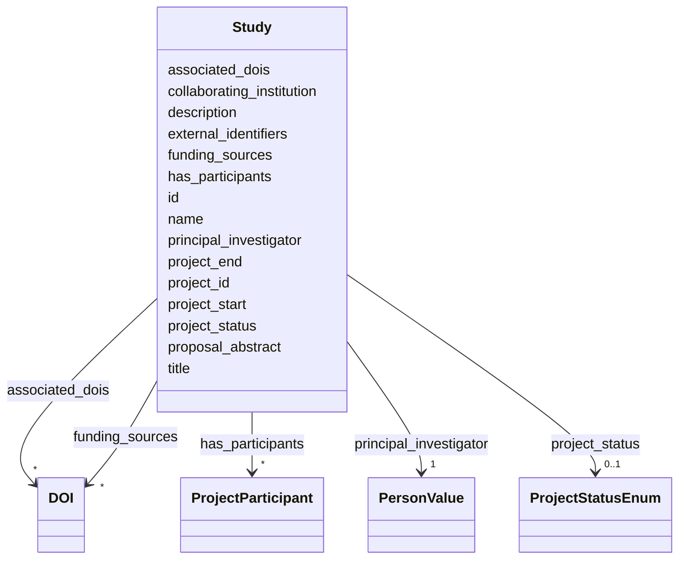

# Class: Study 


_A study or research project, typically associated with a proposal and a set of experiments._

_A study may have multiple participants, each with different roles, and may be associated with_

_one or more campaigns. The study may also have associated DOIs and funding sources._


URI: [analysis_api_schema:Study](https://w3id.org/MONet/analysis-api-schema/Study)





<!-- no inheritance hierarchy -->

## Slots

| Name | Cardinality and Range | Description | Inheritance |
| ---  | --- | --- | --- |
| [external_identifiers](external_identifiers.md) | * <br/> [Uriorcurie](Uriorcurie.md) | List of project- or study-level identifiers (e | direct |
| [id](id.md) | 1 <br/> [Uuid](Uuid.md) |  | direct |
| [project_id](project_id.md) | 1 <br/> [Integer](Integer.md) |  | direct |
| [title](title.md) | 0..1 <br/> [String](String.md) | The title of the study/proposal | direct |
| [name](name.md) | 1 <br/> [String](String.md) | Short name or code for the study | direct |
| [proposal_abstract](proposal_abstract.md) | 0..1 <br/> [String](String.md) | The abstract submitted with the research proposal | direct |
| [description](description.md) | 0..1 <br/> [String](String.md) | study objectives and scope | direct |
| [has_participants](has_participants.md) | * <br/> [ProjectParticipant](ProjectParticipant.md) | Links to a record of a person and their roles for this study | direct |
| [principal_investigator](principal_investigator.md) | 1 <br/> [PersonValue](PersonValue.md) |  | direct |
| [collaborating_institution](collaborating_institution.md) | 0..1 <br/> [String](String.md) |  | direct |
| [project_status](project_status.md) | 0..1 <br/> [ProjectStatusEnum](ProjectStatusEnum.md) |  | direct |
| [project_start](project_start.md) | 0..1 <br/> [Datetime](Datetime.md) |  | direct |
| [project_end](project_end.md) | 0..1 <br/> [Datetime](Datetime.md) |  | direct |
| [associated_dois](associated_dois.md) | * <br/> [DOI](DOI.md) | A list of DOIs associated with this study | direct |
| [funding_sources](funding_sources.md) | * <br/> [DOI](DOI.md) |  | direct |


## Identifier and Mapping Information


### Schema Source


* from schema: https://w3id.org/MONet/analysis-api-schema


## Mappings

| Mapping Type | Mapped Value |
| ---  | ---  |
| self | analysis_api_schema:Study |
| native | analysis_api_schema:Study |


## LinkML Source

<!-- TODO: investigate https://stackoverflow.com/questions/37606292/how-to-create-tabbed-code-blocks-in-mkdocs-or-sphinx -->

### Direct

<details>
```yaml
name: Study
description: 'A study or research project, typically associated with a proposal and
  a set of experiments.

  A study may have multiple participants, each with different roles, and may be associated
  with

  one or more campaigns. The study may also have associated DOIs and funding sources.'
from_schema: https://w3id.org/MONet/analysis-api-schema
slots:
- external_identifiers
slot_usage:
  external_identifiers:
    name: external_identifiers
    description: List of project- or study-level identifiers (e.g., GOLD study ID)
      representing this project.
attributes:
  id:
    name: id
    from_schema: https://w3id.org/MONet/analysis-api-schema/study
    identifier: true
    domain_of:
    - Activity
    - Entity
    - DataProduct
    - DataGenerationActivity
    - DataProcessingActivity
    - AlternativeIdentifier
    - FunctionalAnnotationIdentifier
    - Instrument
    - OntologyClass
    - ContainerType
    - Custodian
    - InstrumentAlternativeIdentifier
    - LabDevice
    - SampleProcessing
    - ProcessingSampleLink
    - Configuration
    - MobilePhaseSegment
    - MassSpectrometryStandardRun
    - PurchasedMaterial
    - LabProcessingActivity
    - organism
    - MAOMProduct
    - WEOMProduct
    - Site
    - Sample
    - AerosolArmSample
    - AerosolSample
    - AMP2UserSample
    - CommerciallyPurchasedSample
    - CultureEnvironmentalSample
    - EngineeredStrainSample
    - FieldDeployedTerraformSample
    - MixedCultureSample
    - MonetSoilSample
    - OtherUndescribedSample
    - PlantSample
    - PureCultureSample
    - SedimentSample
    - SoilSample
    - SynthesizedMaterialSample
    - TerraformSample
    - WaterSample
    - ProcessedSample
    - CoreSection
    - SamplingActivity
    - AerosolArmSamplingActivity
    - AerosolSamplingActivity
    - CommerciallyPurchasedSamplingActivity
    - CultureEnvironmentalSamplingActivity
    - EngineeredStrainSamplingActivity
    - FieldDeployedTerraformSamplingActivity
    - MixedCultureSamplingActivity
    - MonetSoilSamplingActivity
    - OtherUndescribedSamplingActivity
    - PlantSamplingActivity
    - PureCultureSamplingActivity
    - SedimentSamplingActivity
    - SoilSamplingActivity
    - SynthesizedMaterialSamplingActivity
    - TerraformSamplingActivity
    - WaterSamplingActivity
    - Study
    - ProjectParticipant
    - TimestampValue
    - TextValue
    - SoftwareControlledTermValue
    - ControlledTermValue
    - PersonValue
    - QuantityValue
    - ConditioningValue
    - zipDownload
    range: uuid
    required: true
  project_id:
    name: project_id
    from_schema: https://w3id.org/MONet/analysis-api-schema/study
    rank: 1000
    domain_of:
    - Study
    range: integer
    required: true
  title:
    name: title
    description: The title of the study/proposal.
    from_schema: https://w3id.org/MONet/analysis-api-schema/study
    rank: 1000
    domain_of:
    - Study
    range: string
  name:
    name: name
    description: Short name or code for the study.
    from_schema: https://w3id.org/MONet/analysis-api-schema/study
    domain_of:
    - Activity
    - Entity
    - DataProduct
    - DataGenerationActivity
    - Instrument
    - OntologyClass
    - ContainerAxis
    - Configuration
    - MobilePhaseSegment
    - MassSpectrometryStandardRun
    - PurchasedMaterial
    - LabProcessingActivity
    - organism
    - Site
    - Sample
    - SamplingActivity
    - SoilSamplingActivity
    - Study
    - SoftwareControlledTermValue
    range: string
    required: true
  proposal_abstract:
    name: proposal_abstract
    description: The abstract submitted with the research proposal.
    from_schema: https://w3id.org/MONet/analysis-api-schema/study
    rank: 1000
    domain_of:
    - Study
    range: string
  description:
    name: description
    description: study objectives and scope
    from_schema: https://w3id.org/MONet/analysis-api-schema/study
    domain_of:
    - Activity
    - Entity
    - DataProduct
    - DataGenerationActivity
    - DataProcessingActivity
    - OntologyClass
    - ContainerType
    - LabDevice
    - Configuration
    - MassSpectrometryStandardRun
    - PurchasedMaterial
    - LabProcessingActivity
    - organism
    - Site
    - Sample
    - SamplingActivity
    - SoilSamplingActivity
    - Study
    - TimestampValue
    - TextValue
    - SoftwareControlledTermValue
    - ControlledTermValue
    - QuantityValue
    range: string
  has_participants:
    name: has_participants
    description: Links to a record of a person and their roles for this study.
    from_schema: https://w3id.org/MONet/analysis-api-schema/study
    rank: 1000
    domain_of:
    - Study
    range: ProjectParticipant
    multivalued: true
  principal_investigator:
    name: principal_investigator
    from_schema: https://w3id.org/MONet/analysis-api-schema/study
    rank: 1000
    domain_of:
    - Study
    range: PersonValue
    required: true
  collaborating_institution:
    name: collaborating_institution
    from_schema: https://w3id.org/MONet/analysis-api-schema/study
    rank: 1000
    domain_of:
    - Study
    range: string
  project_status:
    name: project_status
    from_schema: https://w3id.org/MONet/analysis-api-schema/study
    rank: 1000
    domain_of:
    - Study
    range: ProjectStatusEnum
  project_start:
    name: project_start
    from_schema: https://w3id.org/MONet/analysis-api-schema/study
    rank: 1000
    domain_of:
    - Study
    range: datetime
  project_end:
    name: project_end
    from_schema: https://w3id.org/MONet/analysis-api-schema/study
    rank: 1000
    domain_of:
    - Study
    range: datetime
  associated_dois:
    name: associated_dois
    description: A list of DOIs associated with this study
    from_schema: https://w3id.org/MONet/analysis-api-schema/study
    rank: 1000
    domain_of:
    - Study
    range: DOI
    multivalued: true
  funding_sources:
    name: funding_sources
    from_schema: https://w3id.org/MONet/analysis-api-schema/study
    rank: 1000
    domain_of:
    - Study
    range: DOI
    multivalued: true

```
</details>

### Induced

<details>
```yaml
name: Study
description: 'A study or research project, typically associated with a proposal and
  a set of experiments.

  A study may have multiple participants, each with different roles, and may be associated
  with

  one or more campaigns. The study may also have associated DOIs and funding sources.'
from_schema: https://w3id.org/MONet/analysis-api-schema
slot_usage:
  external_identifiers:
    name: external_identifiers
    description: List of project- or study-level identifiers (e.g., GOLD study ID)
      representing this project.
attributes:
  id:
    name: id
    from_schema: https://w3id.org/MONet/analysis-api-schema/study
    identifier: true
    alias: id
    owner: Study
    domain_of:
    - Activity
    - Entity
    - DataProduct
    - DataGenerationActivity
    - DataProcessingActivity
    - AlternativeIdentifier
    - FunctionalAnnotationIdentifier
    - Instrument
    - OntologyClass
    - ContainerType
    - Custodian
    - InstrumentAlternativeIdentifier
    - LabDevice
    - SampleProcessing
    - ProcessingSampleLink
    - Configuration
    - MobilePhaseSegment
    - MassSpectrometryStandardRun
    - PurchasedMaterial
    - LabProcessingActivity
    - organism
    - MAOMProduct
    - WEOMProduct
    - Site
    - Sample
    - AerosolArmSample
    - AerosolSample
    - AMP2UserSample
    - CommerciallyPurchasedSample
    - CultureEnvironmentalSample
    - EngineeredStrainSample
    - FieldDeployedTerraformSample
    - MixedCultureSample
    - MonetSoilSample
    - OtherUndescribedSample
    - PlantSample
    - PureCultureSample
    - SedimentSample
    - SoilSample
    - SynthesizedMaterialSample
    - TerraformSample
    - WaterSample
    - ProcessedSample
    - CoreSection
    - SamplingActivity
    - AerosolArmSamplingActivity
    - AerosolSamplingActivity
    - CommerciallyPurchasedSamplingActivity
    - CultureEnvironmentalSamplingActivity
    - EngineeredStrainSamplingActivity
    - FieldDeployedTerraformSamplingActivity
    - MixedCultureSamplingActivity
    - MonetSoilSamplingActivity
    - OtherUndescribedSamplingActivity
    - PlantSamplingActivity
    - PureCultureSamplingActivity
    - SedimentSamplingActivity
    - SoilSamplingActivity
    - SynthesizedMaterialSamplingActivity
    - TerraformSamplingActivity
    - WaterSamplingActivity
    - Study
    - ProjectParticipant
    - TimestampValue
    - TextValue
    - SoftwareControlledTermValue
    - ControlledTermValue
    - PersonValue
    - QuantityValue
    - ConditioningValue
    - zipDownload
    range: uuid
    required: true
  project_id:
    name: project_id
    from_schema: https://w3id.org/MONet/analysis-api-schema/study
    rank: 1000
    alias: project_id
    owner: Study
    domain_of:
    - Study
    range: integer
    required: true
  title:
    name: title
    description: The title of the study/proposal.
    from_schema: https://w3id.org/MONet/analysis-api-schema/study
    rank: 1000
    alias: title
    owner: Study
    domain_of:
    - Study
    range: string
  name:
    name: name
    description: Short name or code for the study.
    from_schema: https://w3id.org/MONet/analysis-api-schema/study
    alias: name
    owner: Study
    domain_of:
    - Activity
    - Entity
    - DataProduct
    - DataGenerationActivity
    - Instrument
    - OntologyClass
    - ContainerAxis
    - Configuration
    - MobilePhaseSegment
    - MassSpectrometryStandardRun
    - PurchasedMaterial
    - LabProcessingActivity
    - organism
    - Site
    - Sample
    - SamplingActivity
    - SoilSamplingActivity
    - Study
    - SoftwareControlledTermValue
    range: string
    required: true
  proposal_abstract:
    name: proposal_abstract
    description: The abstract submitted with the research proposal.
    from_schema: https://w3id.org/MONet/analysis-api-schema/study
    rank: 1000
    alias: proposal_abstract
    owner: Study
    domain_of:
    - Study
    range: string
  description:
    name: description
    description: study objectives and scope
    from_schema: https://w3id.org/MONet/analysis-api-schema/study
    alias: description
    owner: Study
    domain_of:
    - Activity
    - Entity
    - DataProduct
    - DataGenerationActivity
    - DataProcessingActivity
    - OntologyClass
    - ContainerType
    - LabDevice
    - Configuration
    - MassSpectrometryStandardRun
    - PurchasedMaterial
    - LabProcessingActivity
    - organism
    - Site
    - Sample
    - SamplingActivity
    - SoilSamplingActivity
    - Study
    - TimestampValue
    - TextValue
    - SoftwareControlledTermValue
    - ControlledTermValue
    - QuantityValue
    range: string
  has_participants:
    name: has_participants
    description: Links to a record of a person and their roles for this study.
    from_schema: https://w3id.org/MONet/analysis-api-schema/study
    rank: 1000
    alias: has_participants
    owner: Study
    domain_of:
    - Study
    range: ProjectParticipant
    multivalued: true
  principal_investigator:
    name: principal_investigator
    from_schema: https://w3id.org/MONet/analysis-api-schema/study
    rank: 1000
    alias: principal_investigator
    owner: Study
    domain_of:
    - Study
    range: PersonValue
    required: true
  collaborating_institution:
    name: collaborating_institution
    from_schema: https://w3id.org/MONet/analysis-api-schema/study
    rank: 1000
    alias: collaborating_institution
    owner: Study
    domain_of:
    - Study
    range: string
  project_status:
    name: project_status
    from_schema: https://w3id.org/MONet/analysis-api-schema/study
    rank: 1000
    alias: project_status
    owner: Study
    domain_of:
    - Study
    range: ProjectStatusEnum
  project_start:
    name: project_start
    from_schema: https://w3id.org/MONet/analysis-api-schema/study
    rank: 1000
    alias: project_start
    owner: Study
    domain_of:
    - Study
    range: datetime
  project_end:
    name: project_end
    from_schema: https://w3id.org/MONet/analysis-api-schema/study
    rank: 1000
    alias: project_end
    owner: Study
    domain_of:
    - Study
    range: datetime
  associated_dois:
    name: associated_dois
    description: A list of DOIs associated with this study
    from_schema: https://w3id.org/MONet/analysis-api-schema/study
    rank: 1000
    alias: associated_dois
    owner: Study
    domain_of:
    - Study
    range: DOI
    multivalued: true
  funding_sources:
    name: funding_sources
    from_schema: https://w3id.org/MONet/analysis-api-schema/study
    rank: 1000
    alias: funding_sources
    owner: Study
    domain_of:
    - Study
    range: DOI
    multivalued: true
  external_identifiers:
    name: external_identifiers
    description: List of project- or study-level identifiers (e.g., GOLD study ID)
      representing this project.
    from_schema: https://w3id.org/MONet/analysis-api-schema
    rank: 1000
    alias: external_identifiers
    owner: Study
    domain_of:
    - NucleotideSequencing
    - AerosolArmSample
    - AerosolSample
    - CommerciallyPurchasedSample
    - CultureEnvironmentalSample
    - EngineeredStrainSample
    - FieldDeployedTerraformSample
    - MixedCultureSample
    - MonetSoilSample
    - OtherUndescribedSample
    - PlantSample
    - PureCultureSample
    - SedimentSample
    - SoilSample
    - SynthesizedMaterialSample
    - TerraformSample
    - WaterSample
    - Study
    range: uriorcurie
    multivalued: true

```
</details>